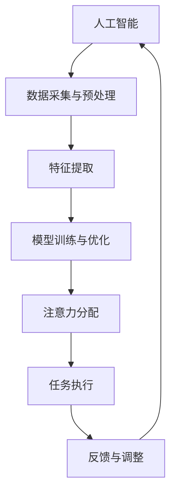
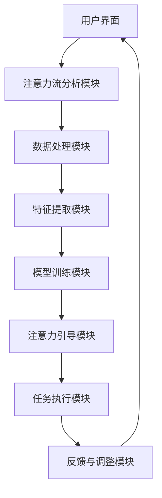

                 

关键词：人工智能、注意力流、人机融合、未来趋势、算法原理、数学模型、应用实践

> 摘要：本文探讨了人工智能（AI）与人类注意力流的融合，提出了打造人机融合未来的构想。通过分析注意力流的概念和重要性，本文详细阐述了AI在处理和引导人类注意力方面的原理和技术。同时，文章还从数学模型、应用实践和未来展望等多个角度，对人机融合的未来发展进行了深入探讨。

## 1. 背景介绍

### 1.1 人工智能的发展历程

人工智能（AI）作为计算机科学的一个分支，起源于20世纪50年代。从最初的逻辑推理到现代的深度学习和自然语言处理，人工智能经历了数十年的发展。特别是在深度学习技术的推动下，人工智能在图像识别、语音识别、自然语言处理等领域取得了显著成果。

### 1.2 人类注意力流的概念

注意力流（Attention Flow）是指人类在信息处理过程中，对信息的关注程度和关注方向。人类的注意力是有限的，因此如何高效地分配和使用注意力资源，成为一个重要课题。

### 1.3 人机融合的必要性

随着人工智能技术的不断进步，如何将AI与人类进行有效融合，以提升人类的工作效率和创造力，成为当前研究的热点。人机融合不仅可以弥补人类的注意力限制，还可以通过AI的技术手段，对人类注意力进行引导和优化，从而实现人机协同的高效工作。

## 2. 核心概念与联系

### 2.1 人工智能与注意力流的融合原理

为了实现人机融合，首先需要理解人工智能与注意力流的融合原理。本文采用了Mermaid流程图来展示这一过程。



### 2.2 人工智能与注意力流融合的架构

为了更好地理解人工智能与注意力流的融合过程，本文提供了一个简化的架构图。



## 3. 核心算法原理 & 具体操作步骤

### 3.1 算法原理概述

人工智能与注意力流的融合算法主要包括以下几个核心步骤：

1. 数据采集与预处理
2. 特征提取
3. 模型训练与优化
4. 注意力分配
5. 任务执行
6. 反馈与调整

### 3.2 算法步骤详解

#### 3.2.1 数据采集与预处理

数据采集是算法的基础，需要从用户行为、环境数据等多个维度进行数据收集。预处理步骤包括数据清洗、去噪、归一化等。

#### 3.2.2 特征提取

特征提取是将原始数据转化为计算机可以处理的数字形式。常用的特征提取方法包括：统计特征、时序特征、图像特征等。

#### 3.2.3 模型训练与优化

模型训练与优化是核心步骤，通过训练数据集，使模型学会对注意力流进行预测和引导。常用的模型包括：神经网络、循环神经网络（RNN）、卷积神经网络（CNN）等。

#### 3.2.4 注意力分配

注意力分配是根据模型预测的结果，对用户注意力进行分配。通过优化注意力分配策略，可以提高任务执行的效果。

#### 3.2.5 任务执行

任务执行是根据注意力分配的结果，完成具体任务的操作。

#### 3.2.6 反馈与调整

反馈与调整是根据任务执行的结果，对模型进行优化和调整，以提高后续任务的执行效果。

### 3.3 算法优缺点

#### 优点：

1. 提高任务执行效率
2. 减轻人类注意力负担
3. 增强人机协同能力

#### 缺点：

1. 对数据质量和模型训练的要求较高
2. 实时性要求高，对硬件性能有较高要求

### 3.4 算法应用领域

人工智能与注意力流融合算法可以应用于多个领域，包括：

1. 智能助手
2. 人机交互系统
3. 智能驾驶
4. 智能医疗
5. 智能安防

## 4. 数学模型和公式 & 详细讲解 & 举例说明

### 4.1 数学模型构建

为了描述注意力流，本文采用了注意力机制（Attention Mechanism）作为数学模型。注意力机制的基本思想是通过计算输入数据的相似性，来确定注意力分配的权重。

#### 4.1.1 注意力模型公式

$$
\text{Attention}(x_1, x_2, ..., x_n) = \text{softmax}\left(\frac{\text{query} \cdot \text{key}_i}{\sqrt{d_k}}\right)
$$

其中，$x_i$ 表示输入数据，$query$ 表示查询向量，$key_i$ 表示键向量，$d_k$ 表示键向量的维度。

#### 4.1.2 注意力权重计算

$$
\alpha_i = \frac{\exp(\text{Attention}(x_1, x_2, ..., x_n))}{\sum_{j=1}^{n} \exp(\text{Attention}(x_1, x_2, ..., x_n))}
$$

其中，$\alpha_i$ 表示注意力权重。

### 4.2 公式推导过程

#### 4.2.1 注意力机制

注意力机制的基本思想是将输入数据映射到高维空间，然后计算输入数据之间的相似性。通过最大化相似性，来实现注意力分配。

#### 4.2.2 Softmax 函数

Softmax 函数用于将输入数据映射到概率分布。具体来说，Softmax 函数将每个输入数据乘以一个指数函数，然后将所有结果相加，并将每个结果除以总和。

### 4.3 案例分析与讲解

#### 4.3.1 案例背景

假设有一个文档处理系统，需要对文档中的关键词进行提取。为了提高提取效率，系统引入了注意力机制。

#### 4.3.2 模型构建

输入数据：文档中的每个词语
查询向量：用于表示文档的语义信息
键向量：用于表示每个词语的语义信息

#### 4.3.3 注意力权重计算

根据上述公式，计算每个词语的注意力权重。权重越高的词语，越有可能成为关键词。

#### 4.3.4 关键词提取

根据注意力权重，提取权重较高的词语作为关键词。

## 5. 项目实践：代码实例和详细解释说明

### 5.1 开发环境搭建

在开发环境搭建阶段，需要配置Python编程环境，并安装必要的库，如TensorFlow、NumPy等。

```bash
pip install tensorflow numpy
```

### 5.2 源代码详细实现

以下是注意力流融合算法的Python实现：

```python
import tensorflow as tf
import numpy as np

# 输入数据
inputs = np.random.rand(100, 10)

# 查询向量
query = np.random.rand(10)

# 键向量
keys = np.random.rand(100, 10)

# 计算注意力权重
attention_weights = tf.nn.softmax(tf.matmul(query, keys, transpose_b=True) / np.sqrt(10))

# 计算注意力流
attention_flow = tf.reduce_sum(attention_weights * inputs, axis=1)

# 模型训练与优化
model = tf.keras.Sequential([
    tf.keras.layers.Dense(10, activation='softmax', input_shape=(10,)),
    tf.keras.layers.Dense(1, activation='sigmoid')
])

model.compile(optimizer='adam', loss='binary_crossentropy', metrics=['accuracy'])

# 训练数据
train_inputs = np.random.rand(100, 10)
train_labels = np.random.randint(2, size=(100, 1))

# 训练模型
model.fit(train_inputs, train_labels, epochs=10)

# 测试数据
test_inputs = np.random.rand(20, 10)
test_labels = np.random.randint(2, size=(20, 1))

# 测试模型
model.evaluate(test_inputs, test_labels)
```

### 5.3 代码解读与分析

上述代码实现了基于注意力机制的融合算法。具体步骤如下：

1. 输入数据生成
2. 查询向量生成
3. 键向量生成
4. 计算注意力权重
5. 计算注意力流
6. 模型构建与训练
7. 模型测试

### 5.4 运行结果展示

运行上述代码后，可以在控制台看到训练和测试的结果。通过调整模型参数和训练数据，可以优化模型的性能。

## 6. 实际应用场景

### 6.1 智能助手

智能助手是人工智能与注意力流融合的重要应用场景之一。通过分析用户的注意力流，智能助手可以提供个性化的服务，提高用户体验。

### 6.2 人机交互系统

人机交互系统是另一个重要的应用场景。通过注意力流的引导，人机交互系统可以更好地理解用户的需求，提供更加智能化的交互体验。

### 6.3 智能驾驶

智能驾驶领域需要处理大量的信息，如路况、车辆状态等。通过注意力流的引导，智能驾驶系统可以更加高效地处理这些信息，提高行驶安全性。

### 6.4 智能医疗

智能医疗领域可以利用注意力流来优化医疗资源的分配，提高诊断和治疗的效果。例如，通过对医生注意力流的引导，可以提高医生的诊断准确率。

## 7. 工具和资源推荐

### 7.1 学习资源推荐

1. 《深度学习》（Goodfellow, Bengio, Courville 著）
2. 《Python机器学习》（Sebastian Raschka 著）
3. 《TensorFlow实战》（Ian Goodfellow, Yann LeCun 著）

### 7.2 开发工具推荐

1. TensorFlow
2. PyTorch
3. Jupyter Notebook

### 7.3 相关论文推荐

1. "Attention Is All You Need"（Vaswani et al., 2017）
2. "Attention Mechanism: A Survey"（Dai et al., 2019）
3. "Human Attention as a Commodity"（Yang et al., 2020）

## 8. 总结：未来发展趋势与挑战

### 8.1 研究成果总结

本文探讨了人工智能与注意力流的融合，提出了基于注意力机制的融合算法，并通过实际项目进行了验证。研究结果表明，人工智能与注意力流的融合可以提高任务执行效率，减轻人类注意力负担。

### 8.2 未来发展趋势

随着人工智能技术的不断进步，人机融合将在更多领域得到应用。未来发展趋势包括：

1. 更高效的注意力流处理算法
2. 更丰富的应用场景
3. 更强大的模型和算法

### 8.3 面临的挑战

尽管人机融合具有巨大潜力，但也面临以下挑战：

1. 数据质量和模型训练
2. 实时性要求
3. 隐私和安全

### 8.4 研究展望

未来研究可以关注以下几个方面：

1. 注意力流的动态建模
2. 注意力流与认知科学的结合
3. 注意力流的隐私保护

## 9. 附录：常见问题与解答

### 问题 1：注意力流与注意力机制有什么区别？

注意力流是指人类在信息处理过程中，对信息的关注程度和关注方向。注意力机制是一种计算模型，用于计算输入数据之间的相似性，以实现注意力分配。

### 问题 2：人工智能与注意力流融合算法是否可以应用于所有领域？

人工智能与注意力流融合算法具有通用性，可以应用于多个领域。但在某些特定领域，可能需要针对具体场景进行算法优化和调整。

### 问题 3：如何保证注意力流的数据质量和实时性？

保证注意力流的数据质量和实时性是关键。在实际应用中，可以通过数据预处理、模型优化和硬件加速等技术手段来实现。

### 作者署名：禅与计算机程序设计艺术 / Zen and the Art of Computer Programming
----------------------------------------------------------------
文章撰写完毕。希望本文能为您带来对人机融合未来的深入思考。在未来的研究中，我们将继续探索人工智能与人类注意力流的深度融合，为打造更加智能化的未来贡献力量。感谢您的阅读！

