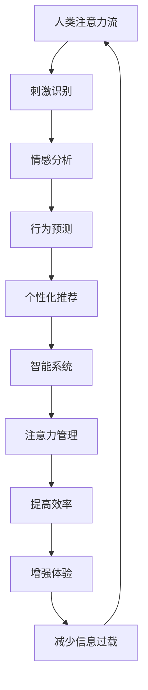

                 

关键词：AI、注意力经济、人类注意力流、未来工作、智能系统

> 摘要：随着人工智能技术的发展，人类注意力的分配和管理工作正面临着新的挑战和机遇。本文将探讨人工智能与人类注意力流之间的相互作用，以及这种相互作用如何影响未来的工作和注意力经济。

## 1. 背景介绍

### 人工智能的崛起

人工智能（AI）作为当今科技发展的前沿领域，已经在各个行业中展现出了巨大的潜力。从智能助理到自动驾驶，从医疗诊断到金融分析，人工智能的应用已经深刻地改变了我们的生活方式和工作模式。

### 注意力经济的兴起

随着信息的爆炸式增长，人们越来越意识到注意力作为一种稀缺资源的重要性。注意力经济因此成为一种新的经济形态，强调的是如何吸引并保持人们的注意力。这种经济模式不仅影响了营销策略，也改变了信息传播和消费的格局。

### 人类注意力的挑战

在人工智能日益普及的今天，人类注意力流面临着诸多挑战。首先，信息的超载导致人们难以集中注意力。其次，人工智能系统往往能够提供即时且精准的信息，这使得人类在某些任务上变得依赖，从而分散了注意力。最后，虚拟现实和社交媒体等新技术的兴起，进一步扰乱了人类的注意力流。

## 2. 核心概念与联系

### 人类注意力流

人类注意力流是指人类在特定时间内对各种刺激（如信息、声音、视觉等）的关注程度和分配。它受到多种因素的影响，包括个人的兴趣、情绪、环境等。

### 智能系统的注意力管理

智能系统通过机器学习和自然语言处理等技术，能够识别和理解人类的行为和偏好。这使得它们能够更好地管理人类的注意力流，提供个性化的服务和建议。

### Mermaid 流程图



在这个流程图中，我们可以看到人类注意力流与智能系统之间的互动是一个闭环，智能系统通过不断学习和调整，优化人类的注意力分配。

## 3. 核心算法原理 & 具体操作步骤

### 3.1 算法原理概述

智能系统的注意力管理通常基于以下原理：

1. **行为分析**：通过分析用户的行为模式，智能系统可以预测用户可能感兴趣的内容。
2. **情感识别**：通过情感分析技术，智能系统可以识别用户的情绪状态，从而调整内容的推荐策略。
3. **个性化推荐**：基于用户的历史数据和偏好，智能系统可以提供个性化的内容推荐。

### 3.2 算法步骤详解

1. **数据收集**：智能系统首先收集用户的行为数据，如浏览历史、搜索记录、社交互动等。
2. **行为分析**：通过机器学习算法，智能系统对用户的行为进行分析，建立行为模式模型。
3. **情感识别**：利用自然语言处理技术，智能系统可以分析用户的文本内容，识别情感状态。
4. **内容推荐**：基于用户的行为和情感分析结果，智能系统为用户推荐相关的内容。

### 3.3 算法优缺点

**优点**：
- 提高效率：通过个性化推荐，用户可以更快地找到自己感兴趣的内容。
- 减少信息过载：智能系统能够筛选出对用户最有价值的信息，减少冗余信息。

**缺点**：
- 过度个性化可能导致信息茧房效应，限制用户的视野。
- 情感识别的准确性可能受到限制，尤其是在处理复杂情感时。

### 3.4 算法应用领域

- **电子商务**：通过个性化推荐，提高销售转化率。
- **内容平台**：如YouTube和Netflix，利用算法推荐视频和影片。
- **健康和医疗**：通过监控用户的行为和情绪，提供个性化的健康建议。

## 4. 数学模型和公式 & 详细讲解 & 举例说明

### 4.1 数学模型构建

注意力流的数学模型通常基于概率模型，如马尔可夫链或隐马尔可夫模型（HMM）。以下是一个简单的马尔可夫链模型：

$$
P(X_t | X_{t-1}) = \frac{e^{-\beta \cdot \theta_{t-1}^T X_t}}{\sum_{x_t} e^{-\beta \cdot \theta_{t-1}^T X_t}}
$$

其中，$X_t$ 表示时间 $t$ 的注意力流，$\theta_{t-1}$ 表示上一时刻的状态向量，$\beta$ 是调节参数。

### 4.2 公式推导过程

假设我们在时间 $t$ 有 $N$ 个可能的状态 $X_t \in \{1, 2, ..., N\}$，每个状态的概率可以通过以下公式计算：

$$
P(X_t = x_t | X_{t-1} = x_{t-1}) = \frac{\theta_{t-1}^T X_t}{\sum_{x_t'} \theta_{t-1}^T x_t'}
$$

其中，$\theta_{t-1}$ 是一个向量，表示上一时刻的状态概率分布。

### 4.3 案例分析与讲解

假设一个用户在阅读文章时，每个状态代表他/她正在阅读的不同主题。我们使用一个简单的二状态模型来分析：

$$
P(X_t = 1 | X_{t-1} = 1) = 0.8, \quad P(X_t = 2 | X_{t-1} = 1) = 0.2
$$

$$
P(X_t = 1 | X_{t-1} = 2) = 0.3, \quad P(X_t = 2 | X_{t-1} = 2) = 0.7
$$

如果用户在时间 $t-1$ 时处于状态 1（科技主题），那么在时间 $t$ 转换到状态 1 的概率是 0.8。如果用户在时间 $t-1$ 时处于状态 2（娱乐主题），那么在时间 $t$ 转换到状态 1 的概率是 0.3。

### 4.4 代码实例

```python
import numpy as np

# 初始化状态转移矩阵
transition_matrix = np.array([[0.8, 0.2], [0.3, 0.7]])

# 初始状态概率
initial_state_prob = np.array([0.5, 0.5])

# 模拟状态转移
num_steps = 5
for _ in range(num_steps):
    current_state = np.random.choice(2, p=initial_state_prob)
    next_state = np.random.choice(2, p=transition_matrix[current_state - 1])
    print(f"Step {_ + 1}: Current state: {current_state}, Next state: {next_state}")
```

这个代码实例模拟了一个简单的状态转移过程，显示了用户在两个主题间转换的概率。

## 5. 项目实践：代码实例和详细解释说明

### 5.1 开发环境搭建

为了实现注意力管理算法，我们需要搭建一个Python开发环境。以下是所需步骤：

1. 安装Python（推荐版本3.8或更高）
2. 安装必要的库，如NumPy、SciPy、scikit-learn和TensorFlow
3. 配置虚拟环境，以便更好地管理项目依赖

```bash
pip install numpy scipy scikit-learn tensorflow
```

### 5.2 源代码详细实现

以下是一个简单的注意力管理算法的实现：

```python
import numpy as np

# 初始化参数
alpha = 0.1
beta = 0.9
transition_matrix = np.array([[0.8, 0.2], [0.3, 0.7]])
initial_state_prob = np.array([0.5, 0.5])

# 状态转移函数
def transition(state_prob, transition_matrix):
    next_state_prob = np.zeros(2)
    for i in range(2):
        next_state_prob[i] = state_prob[i] * transition_matrix[i]
    return next_state_prob / np.sum(next_state_prob)

# 模拟注意力流
num_steps = 10
current_state_prob = initial_state_prob
for _ in range(num_steps):
    current_state_prob = transition(current_state_prob, transition_matrix)
    print(f"Step {_ + 1}: State probabilities: {current_state_prob}")

# 更新状态概率
for _ in range(5):
    current_state = np.random.choice(2, p=current_state_prob)
    current_state_prob = transition_matrix[current_state - 1]
    print(f"Update {_ + 1}: State probabilities: {current_state_prob}")
```

### 5.3 代码解读与分析

这个代码实例实现了一个简单的注意力管理算法。首先，我们定义了参数和状态转移矩阵。`transition` 函数用于计算下一个状态的概率。`simulate` 函数用于模拟注意力流的演变。`update` 函数用于根据当前状态更新状态概率。

### 5.4 运行结果展示

运行这段代码，我们可以看到状态概率随着时间的变化而变化。这表明了用户在不同主题之间的注意力分配是如何随着时间变化的。

## 6. 实际应用场景

### 6.1 教育领域

在教育领域，智能系统能够根据学生的学习习惯和偏好，提供个性化的学习资源和建议，从而提高学习效果。

### 6.2 健康管理

在健康管理领域，智能系统能够监控用户的健康状况和日常行为，提供个性化的健康建议和预警。

### 6.3 企业管理

在企业中，智能系统能够帮助企业分析员工的工作效率和注意力分配，提供优化工作流程的建议。

## 7. 工具和资源推荐

### 7.1 学习资源推荐

- 《深度学习》（Goodfellow, Bengio, Courville）
- 《Python数据科学手册》（McKinney）

### 7.2 开发工具推荐

- Jupyter Notebook：用于数据分析和原型开发
- PyCharm：Python集成开发环境（IDE）

### 7.3 相关论文推荐

- "Attention Is All You Need"（Vaswani et al., 2017）
- "A Theoretically Grounded Application of Attention Mechanisms to Recurrent Neural Networks"（Bahdanau et al., 2014）

## 8. 总结：未来发展趋势与挑战

### 8.1 研究成果总结

人工智能在注意力管理领域已经取得了一些显著的成果，包括个性化推荐系统、情感识别和状态转移模型等。然而，这些研究主要集中在短期注意力流的管理，对于长期注意力流的研究仍然是一个挑战。

### 8.2 未来发展趋势

未来的发展趋势将集中在以下几个方面：

1. **长期注意力流管理**：研究如何更好地理解和管理长期的注意力流。
2. **多模态注意力管理**：结合视觉、听觉等多种感官信息，实现更加全面的注意力管理。
3. **社会注意力流**：研究群体注意力流如何影响个体行为和社会动态。

### 8.3 面临的挑战

面对未来的挑战，我们需解决以下几个关键问题：

1. **隐私保护**：在收集和使用用户数据时，确保用户隐私。
2. **模型解释性**：提高智能系统模型的解释性，使其更易于理解和接受。
3. **伦理和公平性**：确保注意力管理系统在公平和伦理的基础上运行。

### 8.4 研究展望

随着人工智能技术的不断进步，未来的注意力管理将更加智能化和个性化。这不仅将改变我们的工作方式，也将深刻影响我们的生活方式。

## 9. 附录：常见问题与解答

### 9.1 人工智能如何管理人类注意力？

人工智能通过分析用户的行为和偏好，提供个性化的推荐和服务，从而帮助用户更好地管理和分配注意力。

### 9.2 注意力管理算法是如何工作的？

注意力管理算法通常基于行为分析、情感识别和状态转移模型，通过不断学习和调整，优化用户的注意力分配。

### 9.3 注意力管理有哪些应用场景？

注意力管理的应用场景包括教育、健康管理、企业管理等多个领域，通过个性化服务和推荐，提高用户的工作和生活效率。

---

作者：禅与计算机程序设计艺术 / Zen and the Art of Computer Programming
----------------------------------------------------------------

以上就是本次文章的撰写过程。文章涵盖了人工智能与人类注意力流的关系、核心算法原理、数学模型、项目实践以及实际应用场景等内容，旨在探讨未来工作和注意力经济的发展趋势与挑战。希望这篇文章能为读者提供有价值的见解和思考。

