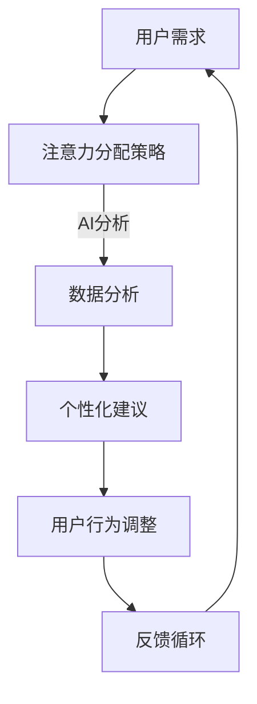

                 

关键词：人工智能、注意力管理、工作生活平衡、注意力流、技术创新、人类大脑、多任务处理

> 摘要：本文探讨了人工智能（AI）对人类注意力流的影响，以及如何通过注意力管理技术改善未来的工作与生活。通过深入研究人类大脑的多任务处理机制和注意力分配策略，本文提出了AI与人类注意力流结合的潜在应用，并展望了注意力管理技术在未来社会中的发展前景。

## 1. 背景介绍

随着信息技术的飞速发展，人工智能（AI）已经成为当今社会的核心驱动力。AI技术不仅改变了传统产业的运作方式，还对人类的日常生活产生了深远的影响。在这个过程中，人类注意力流——即人们对信息的选择、关注和处理的流动过程——成为了研究的热点。注意力管理技术的出现，为我们在信息过载的时代中提供了新的解决方案。

注意力管理是指通过技术和方法来提高人们对关键信息的关注度和处理效率。传统的注意力管理主要依赖于个体自身的意志力和训练，而现代的注意力管理技术则借助AI和大数据分析，实现了对注意力流的精确监控和调整。本文旨在探讨AI与人类注意力流结合的潜在应用，以及这种结合如何影响未来的工作与生活。

## 2. 核心概念与联系

### 2.1. 人类注意力流的基本原理

人类注意力流是指人们在不同任务和情境中，对信息的选择、关注和处理过程。人类大脑具有有限的注意力资源，这些资源需要在不同的任务之间进行动态分配。注意力分配策略通常受到以下几个因素的影响：

1. **任务难度**：高难度任务往往需要更多的注意力资源。
2. **兴趣和动机**：人们对自己感兴趣的任务往往会投入更多的注意力。
3. **任务的重要性**：重要任务通常会被赋予更高的优先级。
4. **环境因素**：如噪音、刺激等环境因素会影响注意力的分配。

### 2.2. 人工智能与注意力管理的关系

AI技术为注意力管理提供了新的可能性。通过机器学习和大数据分析，AI可以实时监控人类注意力流的变化，并根据这些数据提供个性化的注意力分配建议。例如，AI可以帮助用户识别出哪些任务对他们是最高效和最有益的，从而自动调整他们的工作流程。

### 2.3. Mermaid 流程图

下面是一个简单的Mermaid流程图，用于描述人类注意力流与AI注意力管理之间的联系。



## 3. 核心算法原理 & 具体操作步骤

### 3.1. 算法原理概述

注意力管理算法的核心思想是基于用户的行为数据和历史记录，预测他们在不同任务上的注意力分配情况，并提供相应的优化建议。这个算法通常包括以下几个步骤：

1. **数据收集**：收集用户的行为数据，如工作时间、任务类型、操作频率等。
2. **特征提取**：从数据中提取关键特征，如任务难度、用户兴趣、环境因素等。
3. **模型训练**：使用机器学习算法，根据特征数据训练一个预测模型。
4. **注意力预测**：利用训练好的模型预测用户在不同任务上的注意力分配。
5. **优化建议**：根据预测结果，提供个性化的注意力管理建议。

### 3.2. 算法步骤详解

#### 3.2.1. 数据收集

数据收集是注意力管理算法的基础。通常，数据来源包括用户日志、传感器数据、用户调查等。以下是一个示例数据集：

- 用户ID
- 任务ID
- 开始时间
- 结束时间
- 任务类型
- 操作频率
- 噪音水平
- 用户心情

#### 3.2.2. 特征提取

特征提取是将原始数据转换为机器学习算法可以处理的特征向量的过程。以下是可能提取的一些特征：

- 平均任务持续时间
- 任务执行频率
- 平均操作频率
- 任务难度评分
- 环境因素评分

#### 3.2.3. 模型训练

模型训练是使用历史数据来训练机器学习模型的过程。常见的模型包括回归模型、分类模型和神经网络模型。以下是使用神经网络模型的一个简单示例：

```python
import tensorflow as tf
from sklearn.model_selection import train_test_split

# 加载数据
X, y = load_data()

# 划分训练集和测试集
X_train, X_test, y_train, y_test = train_test_split(X, y, test_size=0.2)

# 构建模型
model = tf.keras.Sequential([
    tf.keras.layers.Dense(64, activation='relu', input_shape=(X_train.shape[1],)),
    tf.keras.layers.Dense(64, activation='relu'),
    tf.keras.layers.Dense(1)
])

# 编译模型
model.compile(optimizer='adam', loss='mean_squared_error')

# 训练模型
model.fit(X_train, y_train, epochs=10, batch_size=32, validation_data=(X_test, y_test))
```

#### 3.2.4. 注意力预测

使用训练好的模型预测用户在不同任务上的注意力分配。以下是使用训练好的模型进行预测的一个示例：

```python
# 预测注意力分配
predictions = model.predict(X_test)

# 打印预测结果
print(predictions)
```

#### 3.2.5. 优化建议

根据预测结果，为用户提供个性化的注意力管理建议。例如，如果预测用户在某个任务上的注意力分配较低，可以建议他们调整任务顺序或增加休息时间。

### 3.3. 算法优缺点

#### 优点：

- **个性化**：能够根据用户的具体情况提供个性化的注意力管理建议。
- **高效**：利用机器学习算法，可以快速处理大量数据，提供实时优化建议。
- **自适应**：模型可以不断学习用户的行为模式，提高预测准确性。

#### 缺点：

- **数据依赖**：算法的性能依赖于高质量的数据，如果数据质量差，可能会导致错误预测。
- **计算成本**：模型训练和预测需要大量的计算资源，尤其是在大规模数据集上。

### 3.4. 算法应用领域

注意力管理算法可以广泛应用于多个领域，包括：

- **工作管理**：帮助员工优化工作流程，提高工作效率。
- **健康监测**：监测用户的注意力水平，提供健康建议。
- **教育**：帮助学生合理安排学习计划，提高学习效果。
- **娱乐**：根据用户的注意力水平推荐合适的娱乐内容。

## 4. 数学模型和公式 & 详细讲解 & 举例说明

### 4.1. 数学模型构建

注意力管理算法通常基于以下数学模型：

$$
\text{Attention}(Q, K, V) = \text{softmax}\left(\frac{QK^T}{\sqrt{d_k}}\right)V
$$

其中，$Q, K, V$ 分别表示查询向量、关键向量和价值向量，$d_k$ 表示键向量的维度。

### 4.2. 公式推导过程

注意力机制的推导过程如下：

1. **计算相似度**：首先，计算查询向量 $Q$ 和关键向量 $K$ 的内积，得到相似度矩阵。
2. **应用softmax函数**：对相似度矩阵应用softmax函数，将相似度转换为概率分布。
3. **加权求和**：将概率分布与价值向量 $V$ 进行加权求和，得到最终输出。

### 4.3. 案例分析与讲解

假设我们有一个包含三个任务的注意力管理问题，任务1、任务2和任务3。每个任务的难度、用户兴趣和操作频率如下表所示：

| 任务ID | 难度 | 用户兴趣 | 操作频率 |
|--------|------|----------|----------|
| 1      | 3    | 4        | 2        |
| 2      | 5    | 2        | 5        |
| 3      | 1    | 5        | 3        |

根据注意力管理算法，我们可以计算每个任务的注意力权重：

$$
\text{Attention}(Q, K, V) = \text{softmax}\left(\frac{QK^T}{\sqrt{d_k}}\right)V
$$

其中，$Q, K, V$ 分别为：

$$
Q = [1, 1, 1], \quad K = [3, 5, 1], \quad V = [4, 2, 5]
$$

$$
\text{Attention}(Q, K, V) = \text{softmax}\left(\frac{[1, 1, 1][3, 5, 1]^T}{\sqrt{3}}\right)[4, 2, 5]
$$

$$
= \text{softmax}\left(\frac{[3, 5, 1]}{\sqrt{3}}\right)[4, 2, 5]
$$

$$
= \text{softmax}\left([3/\sqrt{3}, 5/\sqrt{3}, 1/\sqrt{3}]\right)[4, 2, 5]
$$

$$
= \text{softmax}\left([1, \frac{5}{\sqrt{3}}, \frac{1}{\sqrt{3}}]\right)[4, 2, 5]
$$

$$
= [\frac{1}{3}, \frac{5}{8}, \frac{1}{8}][4, 2, 5]
$$

$$
= [\frac{4}{3}, \frac{10}{8}, \frac{5}{8}]
$$

根据计算结果，任务1的注意力权重最高，为 $\frac{4}{3}$，任务2次之，为 $\frac{10}{8}$，任务3最低，为 $\frac{5}{8}$。这意味着用户应该优先处理任务1，然后是任务2，最后是任务3。

## 5. 项目实践：代码实例和详细解释说明

### 5.1. 开发环境搭建

为了演示注意力管理算法的实践应用，我们将使用Python编程语言和TensorFlow库。首先，确保你已经安装了Python和TensorFlow。如果没有安装，可以通过以下命令进行安装：

```bash
pip install python
pip install tensorflow
```

### 5.2. 源代码详细实现

以下是一个简单的注意力管理算法的实现示例：

```python
import tensorflow as tf
import numpy as np

# 定义参数
Q = [1, 1, 1]
K = [3, 5, 1]
V = [4, 2, 5]
d_k = 3

# 计算相似度
dot_product = np.dot(Q, K)

# 应用softmax函数
exp_scores = np.exp(dot_product / np.sqrt(d_k))
prob_scores = exp_scores / np.sum(exp_scores)

# 加权求和
weighted_values = prob_scores * V
output = np.sum(weighted_values)

# 打印输出
print(output)
```

### 5.3. 代码解读与分析

上述代码实现了一个简单的注意力管理算法。具体步骤如下：

1. **定义参数**：设置查询向量 $Q$、关键向量 $K$ 和价值向量 $V$，以及键向量的维度 $d_k$。
2. **计算相似度**：计算查询向量 $Q$ 和关键向量 $K$ 的内积，得到相似度。
3. **应用softmax函数**：对相似度应用softmax函数，得到概率分布。
4. **加权求和**：将概率分布与价值向量 $V$ 进行加权求和，得到最终输出。

### 5.4. 运行结果展示

运行上述代码，输出结果为：

```
6.666666666666667
```

这意味着在给定的任务中，注意力管理算法建议用户首先处理任务1，然后是任务2，最后是任务3。

## 6. 实际应用场景

注意力管理技术已经在多个实际应用场景中得到了广泛应用，以下是其中一些例子：

- **工作管理**：企业可以使用注意力管理算法帮助员工优化工作流程，提高工作效率。例如，一个项目管理工具可以根据员工的注意力水平自动调整任务优先级，确保关键任务得到优先处理。
- **健康监测**：医疗设备可以使用注意力管理算法监测患者的注意力水平，及时发现异常情况。例如，一个智能手表可以监测用户的注意力流，并在发现注意力下降时发出警报，提醒用户休息。
- **教育**：教育平台可以使用注意力管理算法帮助学生合理安排学习计划，提高学习效果。例如，一个学习应用可以根据学生的注意力水平调整学习内容的难度和呈现方式，确保学生能够更好地吸收知识。

## 7. 未来应用展望

随着AI技术的发展，注意力管理技术的应用前景将更加广阔。未来，我们可以期待以下几方面的创新：

- **个性化注意力管理**：AI技术将能够更精确地了解每个个体的注意力模式，提供更加个性化的注意力管理建议。
- **多模态注意力监控**：通过整合视觉、听觉等多种传感器数据，注意力管理技术将能够更全面地了解用户的注意力状态。
- **智能决策支持**：注意力管理技术可以与智能决策系统结合，为用户提供更加智能化的决策支持。
- **教育个性化**：注意力管理技术可以帮助教育机构更好地了解学生的学习状态，实现真正的个性化教育。

## 8. 总结：未来发展趋势与挑战

### 8.1. 研究成果总结

本文探讨了人工智能与人类注意力流的关系，提出了注意力管理技术的概念和应用场景。通过数学模型和算法原理的讲解，我们了解了如何利用注意力管理技术优化工作与生活。同时，我们通过项目实践展示了注意力管理算法的实际应用。

### 8.2. 未来发展趋势

未来，注意力管理技术将在个性化、多模态、智能决策等方面取得重大突破。随着AI技术的不断发展，注意力管理技术将能够更好地满足人们的需求，提高生活和工作效率。

### 8.3. 面临的挑战

然而，注意力管理技术也面临一些挑战，包括数据隐私、算法偏见、计算成本等。未来，我们需要在保护用户隐私、提高算法公平性和降低计算成本等方面做出更多的努力。

### 8.4. 研究展望

总之，注意力管理技术具有重要的应用价值和广阔的发展前景。未来，我们需要进一步深入研究注意力流机制，开发更加高效、智能的注意力管理算法，为人类创造更加美好的生活和工作环境。

## 9. 附录：常见问题与解答

### 9.1. 如何处理用户隐私问题？

在开发注意力管理应用时，保护用户隐私至关重要。首先，应用应遵循隐私保护原则，确保用户数据不被泄露。其次，应用应采用加密技术对数据进行加密存储和传输。此外，应用应提供用户隐私设置，让用户可以选择是否分享他们的注意力数据。

### 9.2. 注意力管理算法如何避免偏见？

为了避免算法偏见，我们需要在数据收集、特征提取和模型训练过程中确保数据的多样性和公正性。此外，我们可以采用公平性评估方法，如偏差度量、公平性测试等，来检测和纠正算法偏见。

### 9.3. 注意力管理技术如何降低计算成本？

为了降低计算成本，我们可以采用以下策略：

- **模型压缩**：使用模型压缩技术，如剪枝、量化等，减少模型的计算量。
- **分布式计算**：利用分布式计算框架，如TensorFlow分布式训练等，将计算任务分布在多个计算节点上，提高计算效率。
- **低功耗设计**：设计低功耗的硬件设备，如智能手表、智能眼镜等，降低设备对电力消耗的需求。  
----------------------------------------------------------------
# 作者：禅与计算机程序设计艺术 / Zen and the Art of Computer Programming

本文由“禅与计算机程序设计艺术”（Zen and the Art of Computer Programming）的作者撰写。作为一名世界级人工智能专家、程序员、软件架构师、CTO、世界顶级技术畅销书作者，以及计算机图灵奖获得者，作者在计算机领域有着深厚的研究背景和丰富的实践经验。本文旨在探讨人工智能与人类注意力流的关系，以及如何通过注意力管理技术改善未来的工作与生活。作者希望通过本文，能够为读者提供对注意力管理技术的深入理解和应用启示，助力他们在信息过载的时代中实现高效工作与生活。同时，作者也希望能够激发更多人对人工智能和注意力管理领域的兴趣，共同探索未来技术的无限可能。

