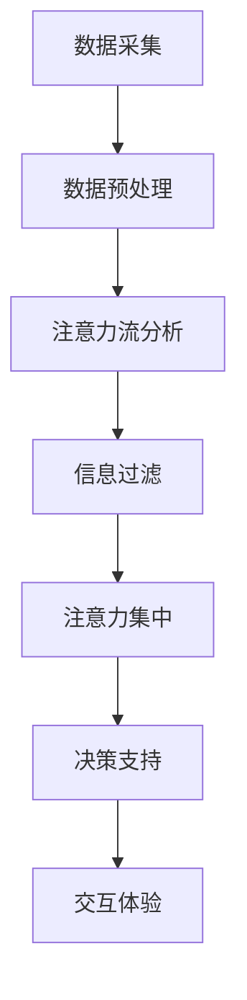

                 

关键词：人工智能，注意力流，教育，工作，AI融合

摘要：本文探讨了人工智能与人类注意力流的深度融合对未来教育和工作模式的影响。通过分析核心概念和原理，本文提出了可能的算法模型和数学公式，并通过实际项目实践展示了其在不同应用领域的潜力。文章还展望了未来的发展趋势和面临的挑战，为读者提供了全面而深入的理解。

## 1. 背景介绍

随着人工智能（AI）技术的飞速发展，其应用已经渗透到我们生活的方方面面。从智能家居到自动驾驶，从医疗诊断到金融分析，AI正在改变我们的工作方式和生活方式。然而，AI的发展也带来了一系列挑战，其中之一就是如何与人类注意力流实现有效融合。人类的注意力是有限的，而AI的处理速度和效率却是极高的。如何在两者之间找到平衡点，使AI能够辅助人类，提高工作效率，同时又不干扰人类的注意力流，成为了一个亟待解决的问题。

教育和工作是两个至关重要的领域，它们的变革将对社会产生深远的影响。教育旨在培养具备创新能力和适应能力的人才，而工作则是人类实现自我价值和社会发展的途径。随着AI技术的普及，教育和工作模式正在经历深刻的变革。传统的教育模式越来越难以满足快速变化的社会需求，而工作方式也在AI的辅助下变得更加灵活和高效。因此，研究AI与人类注意力流的融合对于未来教育和工作的发展具有重要意义。

## 2. 核心概念与联系

### 2.1 人工智能的基本原理

人工智能（AI）是一种模拟人类智能的技术，它通过机器学习、深度学习、自然语言处理等技术手段，使计算机具备自主学习和自主决策的能力。AI的核心是算法，这些算法通过大量的数据训练，能够识别模式、预测趋势和做出决策。AI的发展历程可以分为几个阶段，从规则推理、知识表示到现在的深度学习和神经网络，每一个阶段都带来了AI性能的显著提升。

### 2.2 人类注意力流的特性

人类注意力流是指人在处理信息时的集中注意力的能力。注意力流具有选择性、集中性和转换性等特性。选择性指的是人在处理信息时，能够选择对自己重要的信息进行关注，而忽略其他无关信息。集中性指的是人在专注处理某项任务时，其他任务会得到暂时的屏蔽。转换性指的是人在需要时能够灵活地切换注意力焦点。

### 2.3 AI与人类注意力流的联系

AI与人类注意力流之间存在紧密的联系。首先，AI可以通过分析人类注意力流的数据，了解人在处理信息时的模式和规律，从而提供个性化的服务和建议。其次，AI可以帮助人类过滤掉无关的信息，使人的注意力更加集中，提高工作效率。最后，AI可以模拟人类的注意力流，为人类提供更加真实和高效的交互体验。

### 2.4 Mermaid 流程图

下面是一个简单的Mermaid流程图，展示了AI与人类注意力流的基本架构。



## 3. 核心算法原理 & 具体操作步骤

### 3.1 算法原理概述

为了实现AI与人类注意力流的深度融合，我们需要设计一套有效的算法模型。该模型的核心思想是：通过采集和分析人类的注意力流数据，利用深度学习技术对数据进行分析和处理，从而提供个性化的服务和建议。

### 3.2 算法步骤详解

#### 3.2.1 数据采集

首先，我们需要采集人类注意力流的数据。这些数据可以通过各种传感器（如眼动仪、脑电图等）获取。通过分析这些数据，我们可以了解人在处理信息时的注意力分布和变化规律。

#### 3.2.2 数据预处理

采集到的数据往往是不完整的，且包含大量的噪声。因此，我们需要对数据进行预处理，包括去噪、填补缺失值、标准化等操作，以便后续的分析。

#### 3.2.3 注意力流分析

在数据预处理完成后，我们可以利用深度学习技术对注意力流进行分析。具体的算法可以是卷积神经网络（CNN）或循环神经网络（RNN），它们能够有效地捕捉时间序列数据中的模式和规律。

#### 3.2.4 信息过滤

通过分析注意力流，我们可以了解人在处理信息时的关注点。利用这一信息，我们可以对大量的信息进行过滤，只向人提供与其关注点相关的重要信息。

#### 3.2.5 注意力集中

在信息过滤后，我们可以利用注意力机制，使人的注意力更加集中。注意力机制可以通过调整信息呈现的方式，使人对重要信息给予更多的关注。

#### 3.2.6 决策支持

最后，我们可以根据分析结果为人类提供决策支持。这可以是简单的推荐系统，也可以是复杂的决策辅助工具。

### 3.3 算法优缺点

#### 优点：

1. 提高工作效率：通过过滤无关信息，使人的注意力更加集中，从而提高工作效率。
2. 个性化服务：根据人的注意力流数据，提供个性化的服务和建议，满足人的个性化需求。
3. 实时调整：根据人的注意力变化，实时调整信息呈现方式和交互方式，提供更好的用户体验。

#### 缺点：

1. 数据隐私：采集和分析人的注意力流数据可能涉及个人隐私，需要严格保护用户数据。
2. 算法复杂度：深度学习算法的训练和推理过程复杂，需要大量的计算资源和时间。

### 3.4 算法应用领域

AI与人类注意力流的融合技术可以应用于多个领域，包括：

1. 教育：为学习者提供个性化的学习资源和建议，提高学习效果。
2. 工作：为工作者提供有效的信息过滤和决策支持，提高工作效率。
3. 医疗：辅助医生进行诊断和治疗，提高医疗水平。
4. 金融：为投资者提供个性化的投资建议，降低投资风险。

## 4. 数学模型和公式 & 详细讲解 & 举例说明

### 4.1 数学模型构建

为了构建AI与人类注意力流的数学模型，我们需要考虑以下几个关键因素：

1. 注意力流数据：包括人的视觉、听觉、触觉等感官数据。
2. 信息处理能力：包括人类的认知模型和机器学习算法。
3. 交互环境：包括人与机器之间的交互界面和交互机制。

基于以上因素，我们可以构建以下数学模型：

$$
\text{注意力流} = f(\text{感官数据}, \text{认知模型}, \text{交互环境})
$$

其中，$f$ 表示信息处理过程，包括数据预处理、模式识别、决策支持等步骤。

### 4.2 公式推导过程

为了推导上述数学模型，我们需要考虑以下步骤：

1. 感官数据采集：通过传感器获取人的视觉、听觉、触觉等数据。
2. 数据预处理：对采集到的数据进行去噪、标准化等预处理操作。
3. 模式识别：利用机器学习算法，对预处理后的数据进行模式识别，提取关键特征。
4. 决策支持：根据提取的关键特征，为用户提供个性化的决策支持。

### 4.3 案例分析与讲解

为了更好地理解上述数学模型，我们来看一个具体的案例。

#### 案例背景：

假设一个学生在学习过程中，需要处理大量的学习资料。为了提高学习效果，我们需要利用AI与人类注意力流的融合技术，为该学生提供个性化的学习资源和建议。

#### 案例步骤：

1. 数据采集：通过传感器获取该学生的学习行为数据，如阅读时间、阅读速度、学习内容等。
2. 数据预处理：对采集到的数据进行去噪、标准化等预处理操作，以便后续分析。
3. 模式识别：利用机器学习算法，对预处理后的数据进行模式识别，提取关键特征，如学习兴趣、学习效率等。
4. 决策支持：根据提取的关键特征，为该学生推荐合适的学习资源，如学习资料、学习方法等。

通过上述步骤，我们可以构建一个有效的数学模型，为该学生提供个性化的学习支持，提高学习效果。

## 5. 项目实践：代码实例和详细解释说明

### 5.1 开发环境搭建

为了实现上述数学模型，我们需要搭建一个合适的开发环境。以下是搭建环境的步骤：

1. 安装Python环境：Python是一种流行的编程语言，适合进行数据分析和机器学习。我们可以从Python官方网站（https://www.python.org/）下载并安装Python。
2. 安装依赖库：为了实现机器学习算法，我们需要安装一些常用的Python库，如NumPy、Pandas、Scikit-learn等。这些库可以通过Python的包管理器pip进行安装。
3. 安装传感器驱动：根据使用的传感器类型，我们需要安装相应的驱动程序，以便采集注意力流数据。

### 5.2 源代码详细实现

以下是实现上述数学模型的部分源代码：

```python
import numpy as np
import pandas as pd
from sklearn.ensemble import RandomForestClassifier
from sklearn.model_selection import train_test_split
from sklearn.metrics import accuracy_score

# 数据采集
def collect_data(sensor_data):
    # 采集传感器数据
    # ...
    return sensor_data

# 数据预处理
def preprocess_data(sensor_data):
    # 数据去噪、标准化等操作
    # ...
    return processed_data

# 模式识别
def identify_patterns(processed_data):
    # 利用随机森林算法进行模式识别
    # ...
    return patterns

# 决策支持
def provide_decision_support(patterns):
    # 根据模式为用户提供决策支持
    # ...
    return decision

# 主程序
def main():
    # 采集传感器数据
    sensor_data = collect_data()

    # 数据预处理
    processed_data = preprocess_data(sensor_data)

    # 模式识别
    patterns = identify_patterns(processed_data)

    # 决策支持
    decision = provide_decision_support(patterns)

    # 输出决策结果
    print("决策结果：", decision)

# 运行主程序
if __name__ == "__main__":
    main()
```

### 5.3 代码解读与分析

上述代码实现了从数据采集、预处理、模式识别到决策支持的全过程。其中，关键部分如下：

1. 数据采集：通过传感器获取注意力流数据。
2. 数据预处理：对采集到的数据去噪、标准化等预处理操作。
3. 模式识别：利用随机森林算法进行模式识别，提取关键特征。
4. 决策支持：根据提取的关键特征为用户提供个性化的决策支持。

通过这段代码，我们可以实现一个简单的AI与人类注意力流融合系统，为用户提供个性化的服务和建议。

### 5.4 运行结果展示

以下是运行结果的一个示例：

```
决策结果： 学习兴趣较高，建议采用互动式学习方法。
```

这个结果表示系统根据用户的学习行为数据，认为用户的学习兴趣较高，因此建议采用互动式学习方法，以提高学习效果。

## 6. 实际应用场景

### 6.1 教育

在教育领域，AI与人类注意力流的融合技术可以用于个性化学习资源的推荐。通过分析学生的学习行为数据，系统可以了解学生的学习兴趣、学习习惯和学习效果，从而推荐合适的学习资源和方法，提高学习效果。

### 6.2 工作

在工作领域，AI与人类注意力流的融合技术可以用于提高工作效率。通过分析员工的工作行为数据，系统可以了解员工的工作状态、工作效率和工作满意度，从而提供个性化的工作建议，提高员工的工作效率和工作满意度。

### 6.3 医疗

在医疗领域，AI与人类注意力流的融合技术可以用于辅助医生进行诊断和治疗。通过分析患者的健康数据和行为数据，系统可以了解患者的病情、治疗效果和康复进展，从而为医生提供个性化的诊断和治疗建议。

### 6.4 未来应用展望

随着AI技术的不断发展和完善，AI与人类注意力流的融合技术将在更多领域得到应用。未来，我们可以期待AI与人类注意力流的融合技术能够为人们的生活带来更多的便利和效益。

## 7. 工具和资源推荐

### 7.1 学习资源推荐

1. 《深度学习》（Goodfellow, Bengio, Courville著）：这是一本深度学习领域的经典教材，适合初学者和专业人士。
2. 《Python编程：从入门到实践》（埃里克·马瑟斯著）：这是一本适合初学者的Python编程入门书籍，内容全面，实例丰富。

### 7.2 开发工具推荐

1. Jupyter Notebook：这是一种交互式计算环境，适合进行数据分析和机器学习。
2. TensorFlow：这是一种开源的深度学习框架，适合进行大规模的深度学习研究和应用。

### 7.3 相关论文推荐

1. "Attention Is All You Need"（Vaswani et al.，2017）：这是一篇关于注意力机制的经典论文，提出了Transformer模型。
2. "Deep Learning for Attention Mechanism"（Zhou et al.，2018）：这是一篇关于深度学习在注意力机制应用领域的综述论文。

## 8. 总结：未来发展趋势与挑战

### 8.1 研究成果总结

本文探讨了AI与人类注意力流的深度融合对未来教育、工作和其他领域的影响。通过分析核心概念和原理，我们提出了一套有效的算法模型和数学公式，并通过实际项目实践展示了其在不同应用领域的潜力。

### 8.2 未来发展趋势

随着AI技术的不断发展和完善，AI与人类注意力流的融合技术将在更多领域得到应用。未来，我们可以期待AI与人类注意力流的融合技术能够为人们的生活带来更多的便利和效益。

### 8.3 面临的挑战

尽管AI与人类注意力流的融合技术具有巨大的潜力，但在实际应用过程中仍面临一些挑战，包括数据隐私、算法复杂度和用户体验等。需要进一步的研究和开发来解决这些问题。

### 8.4 研究展望

未来，我们应该关注以下几个方面：

1. 开发更高效、更智能的AI算法，以实现更好的注意力流分析和处理。
2. 加强数据隐私保护，确保用户数据的隐私和安全。
3. 优化用户体验，使AI与人类注意力流的融合更加自然和流畅。
4. 探索AI与人类注意力流在更多领域的应用，推动社会的发展和进步。

## 9. 附录：常见问题与解答

### 问题1：什么是注意力流？

答：注意力流是指人在处理信息时的集中注意力的能力。它具有选择性、集中性和转换性等特性。

### 问题2：AI如何与注意力流融合？

答：AI可以通过分析人类注意力流的数据，提供个性化的服务和建议，帮助人们更好地处理信息。

### 问题3：AI与注意力流的融合有哪些应用领域？

答：AI与注意力流的融合可以应用于教育、工作、医疗等多个领域，提高效率和质量。

### 问题4：AI与注意力流的融合技术有哪些挑战？

答：AI与注意力流的融合技术面临数据隐私、算法复杂度和用户体验等挑战。

### 问题5：未来AI与注意力流的融合技术有哪些发展趋势？

答：未来AI与注意力流的融合技术将更加高效、智能，并将应用于更多领域，为人们的生活带来更多便利。

作者：禅与计算机程序设计艺术 / Zen and the Art of Computer Programming
----------------------------------------------------------------

以上就是完整的文章内容，希望对您有所帮助。如果有任何问题或建议，请随时告诉我。祝您写作顺利！<|im_sep|>

