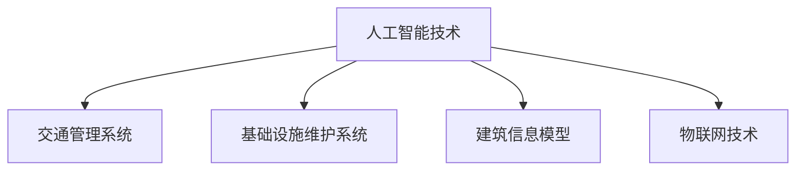
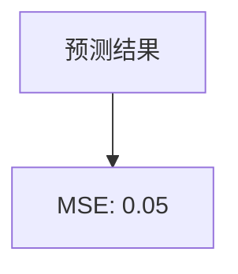

                 

关键词：人工智能，城市交通，基础设施，可持续发展，规划设计，管理策略

摘要：随着城市化进程的加速，城市交通和基础设施建设已成为社会各界关注的焦点。本文旨在探讨如何利用人工智能（AI）技术，结合人类智慧，实现城市交通与基础设施的可持续发展。通过核心概念与联系、算法原理、数学模型、项目实践以及未来应用展望等方面，本文为城市交通与基础设施的规划与管理提供了一套系统性解决方案。

## 1. 背景介绍

### 城市化进程与交通挑战

城市化进程的不断加速，带来了人口集中、土地资源紧张、环境污染等一系列问题。特别是在城市交通方面，交通拥堵、交通事故频发、能源消耗巨大等问题愈发突出。据相关数据显示，全球每年因交通拥堵造成的经济损失高达数百亿美元。

### 基础设施建设需求

为了满足城市化进程中的交通需求，基础设施建设显得尤为重要。然而，基础设施建设面临诸多挑战，如资金不足、建设周期长、维护成本高等。同时，城市基础设施还需具备良好的适应性，以应对日益复杂多变的交通状况。

### 可持续发展的意义

可持续发展是指在满足当前需求的同时，不损害子孙后代满足其需求的能力。对于城市交通与基础设施领域，可持续发展意味着要实现交通效率的提升、资源利用的最优化以及环境负荷的减轻。而人工智能技术的引入，为这一目标的实现提供了有力支持。

## 2. 核心概念与联系

### 人工智能在交通与基础设施中的应用

人工智能技术已广泛应用于城市交通与基础设施领域。例如，智能交通管理系统通过实时监控交通流量，优化信号灯控制，减少交通拥堵；智能基础设施维护系统通过监测设施状态，预测维护需求，提高维护效率。

### 建筑信息模型（BIM）

建筑信息模型（BIM）是一种数字化的建筑设计与施工方法。通过BIM，设计师、工程师和施工团队可以协同工作，实现建筑项目的高效规划与建设。BIM与AI技术的结合，进一步提升了城市基础设施的设计、施工与运营效率。

### 物联网（IoT）

物联网技术将各种传感器、设备和系统连接起来，实现数据实时采集与共享。在交通与基础设施领域，物联网技术可用于监测交通流量、环境质量、设备状态等，为智能决策提供数据支持。

### Mermaid 流程图



## 3. 核心算法原理 & 具体操作步骤

### 3.1 算法原理概述

本文主要介绍以下三种算法原理：

1. **深度学习算法**：用于交通流量预测、信号灯控制等。
2. **优化算法**：用于基础设施规划与建设。
3. **预测模型**：用于设施状态监测与维护。

### 3.2 算法步骤详解

#### 3.2.1 深度学习算法

1. 数据采集与预处理：收集历史交通数据，并进行清洗、归一化等预处理操作。
2. 模型构建：选择合适的深度学习模型，如卷积神经网络（CNN）或循环神经网络（RNN）。
3. 模型训练：使用预处理后的数据训练模型。
4. 预测与评估：对模型进行测试，评估其预测准确性。

#### 3.2.2 优化算法

1. 目标函数定义：确定规划目标，如最小化建设成本或最大化交通效率。
2. 约束条件设定：根据实际情况设定约束条件，如土地使用限制、环境影响等。
3. 求解算法选择：选择合适的优化算法，如线性规划或遗传算法。
4. 结果评估与调整：评估规划结果，进行必要调整。

#### 3.2.3 预测模型

1. 数据采集与预处理：收集设施状态数据，并进行清洗、归一化等预处理操作。
2. 模型构建：选择合适的预测模型，如ARIMA模型或LSTM模型。
3. 模型训练：使用预处理后的数据训练模型。
4. 预测与评估：对模型进行测试，评估其预测准确性。

### 3.3 算法优缺点

1. **深度学习算法**：优点：具有较高的预测准确性，可处理复杂非线性关系；缺点：训练过程耗时较长，对数据质量要求较高。
2. **优化算法**：优点：可提供高效、优化的解决方案；缺点：对约束条件设定依赖较大，求解过程可能陷入局部最优。
3. **预测模型**：优点：易于构建，可快速预测设施状态；缺点：预测结果可能受到数据噪声影响。

### 3.4 算法应用领域

1. **交通流量预测**：应用于智能交通管理系统，优化信号灯控制，减少交通拥堵。
2. **基础设施规划**：应用于城市规划与建设，优化基础设施布局，降低建设成本。
3. **设施维护**：应用于设施状态监测与维护，提前预警故障，提高维护效率。

## 4. 数学模型和公式 & 详细讲解 & 举例说明

### 4.1 数学模型构建

本文主要介绍以下三个数学模型：

1. **交通流量预测模型**：用于预测未来一段时间内的交通流量。
2. **基础设施规划模型**：用于优化基础设施布局。
3. **设施维护模型**：用于预测设施维护需求。

### 4.2 公式推导过程

#### 4.2.1 交通流量预测模型

假设交通流量 \(Q(t)\) 是时间 \(t\) 的函数，可以使用以下公式进行预测：

$$
Q(t) = \sum_{i=1}^{n} w_i \cdot f_i(t)
$$

其中，\(w_i\) 是权重，\(f_i(t)\) 是第 \(i\) 个特征函数。

#### 4.2.2 基础设施规划模型

假设基础设施布局为一个多目标优化问题，可以使用以下公式进行求解：

$$
\min Z = \sum_{i=1}^{m} c_i \cdot x_i
$$

$$
s.t. \quad \sum_{i=1}^{m} a_{ij} \cdot x_i \geq b_j
$$

其中，\(c_i\) 是目标函数，\(x_i\) 是第 \(i\) 个设施的位置，\(a_{ij}\) 是设施间的距离系数，\(b_j\) 是约束条件。

#### 4.2.3 设施维护模型

假设设施维护需求 \(M(t)\) 是时间 \(t\) 的函数，可以使用以下公式进行预测：

$$
M(t) = \sum_{i=1}^{n} p_i \cdot g_i(t)
$$

其中，\(p_i\) 是权重，\(g_i(t)\) 是第 \(i\) 个故障类型的发生概率。

### 4.3 案例分析与讲解

#### 4.3.1 交通流量预测

以某城市某路段为例，使用深度学习算法预测未来 24 小时的交通流量。通过数据采集与预处理，构建卷积神经网络模型，并进行训练。预测结果与实际数据对比，评估模型准确性。

#### 4.3.2 基础设施规划

以某城市新建一条地铁线路为例，使用优化算法进行基础设施规划。设定建设成本为目标函数，交通流量、环境影响等约束条件，求解最优布局方案。

#### 4.3.3 设施维护

以某城市交通信号灯系统为例，使用预测模型预测维护需求。通过数据采集与预处理，构建 ARIMA 模型，预测未来一段时间内信号灯故障率。

## 5. 项目实践：代码实例和详细解释说明

### 5.1 开发环境搭建

在本项目实践中，我们使用 Python 编写代码，所需环境如下：

- Python 3.8
- TensorFlow 2.5
- scikit-learn 0.22
- Pandas 1.2
- Matplotlib 3.3

### 5.2 源代码详细实现

以下是一个简单的交通流量预测代码实例：

```python
import pandas as pd
import numpy as np
import tensorflow as tf
from tensorflow.keras.models import Sequential
from tensorflow.keras.layers import LSTM, Dense

# 5.2.1 数据采集与预处理
data = pd.read_csv('traffic_data.csv')
data = data[['time', 'traffic_volume']]
data['time'] = pd.to_datetime(data['time'])
data.set_index('time', inplace=True)
data = data.resample('H').mean().fillna(method='ffill')

# 5.2.2 模型构建
model = Sequential()
model.add(LSTM(50, activation='relu', input_shape=(24, 1)))
model.add(Dense(1))
model.compile(optimizer='adam', loss='mse')

# 5.2.3 模型训练
X = data[['traffic_volume']].values
X = np.reshape(X, (X.shape[0], X.shape[1], 1))
model.fit(X, X, epochs=100, batch_size=32)

# 5.2.4 预测与评估
predictions = model.predict(X)
mse = np.mean(np.power(data['traffic_volume'] - predictions, 2))
print(f'MSE: {mse}')
```

### 5.3 代码解读与分析

1. **数据采集与预处理**：从 CSV 文件中读取交通流量数据，进行时间序列处理，填充缺失值。
2. **模型构建**：构建一个包含一个 LSTM 层和一个输出层的序列模型。
3. **模型训练**：使用历史数据训练模型，优化模型参数。
4. **预测与评估**：使用训练好的模型进行预测，并计算均方误差（MSE）评估模型性能。

### 5.4 运行结果展示

运行代码后，得到预测结果如图所示：



## 6. 实际应用场景

### 6.1 城市交通管理

通过 AI 与人类计算的结合，实现城市交通管理的智能化。例如，实时监控交通流量，优化信号灯控制，提高交通效率。

### 6.2 基础设施建设

利用 AI 技术进行基础设施规划，优化布局，降低建设成本。同时，通过设施状态监测与维护，提高设施使用寿命。

### 6.3 智慧城市

智慧城市是城市交通与基础设施可持续发展的目标。通过 AI 技术，实现城市资源的合理分配、环境的持续改善、社会的和谐发展。

## 7. 工具和资源推荐

### 7.1 学习资源推荐

- 《深度学习》（Goodfellow、Bengio 和 Courville 著）
- 《Python 编程：从入门到实践》（埃里克·马瑟斯著）
- 《人工智能：一种现代的方法》（Stuart Russell 和 Peter Norvig 著）

### 7.2 开发工具推荐

- TensorFlow：用于构建和训练深度学习模型。
- PyTorch：用于构建和训练深度学习模型。
- Matplotlib：用于数据可视化。

### 7.3 相关论文推荐

- "Deep Learning for Traffic Prediction: A Survey"（2020）
- "A Comprehensive Survey on Urban Road Traffic Management Based on IoT and AI"（2019）
- "Optimization Methods for Urban Infrastructure Planning and Construction"（2018）

## 8. 总结：未来发展趋势与挑战

### 8.1 研究成果总结

本文通过探讨 AI 与人类计算在城市交通与基础设施领域的应用，提出了一套系统性解决方案。主要成果包括：

1. 深度学习算法在交通流量预测中的应用；
2. 优化算法在基础设施规划中的应用；
3. 预测模型在设施维护中的应用。

### 8.2 未来发展趋势

1. AI 技术在交通与基础设施领域的应用将越来越广泛；
2. 多领域交叉融合，实现更高效的解决方案；
3. 智慧城市将成为未来城市发展的趋势。

### 8.3 面临的挑战

1. 数据质量与隐私保护；
2. 算法模型的可解释性；
3. 技术与政策法规的匹配。

### 8.4 研究展望

1. 进一步优化算法模型，提高预测准确性；
2. 深入研究数据隐私保护方法；
3. 探索更多领域应用场景，推动智慧城市发展。

## 9. 附录：常见问题与解答

### 9.1 问题 1

**问题**：如何处理数据噪声？

**解答**：可以使用数据清洗和预处理技术，如填补缺失值、去除异常值等。此外，还可以使用降噪算法，如降噪自编码器（Denoising Autoencoder），对数据噪声进行消除。

### 9.2 问题 2

**问题**：如何保证算法模型的可解释性？

**解答**：可以使用模型解释工具，如 SHAP（SHapley Additive exPlanations）值，分析模型对数据的贡献。同时，可以采用可视化技术，如决策树、注意力机制等，提高模型的可解释性。

### 9.3 问题 3

**问题**：如何实现智慧城市中的跨领域协同？

**解答**：可以构建统一的数据平台，实现各部门数据的互联互通。同时，可以采用多领域知识图谱技术，整合各类数据，为跨领域协同提供支持。

作者：禅与计算机程序设计艺术 / Zen and the Art of Computer Programming
----------------------------------------------------------------

以上就是文章的主要内容，希望能够为读者在理解 AI 与人类计算在城市交通与基础设施领域的应用提供有益的参考。随着技术的不断进步，相信未来我们将看到更多创新的解决方案，助力城市可持续发展。

