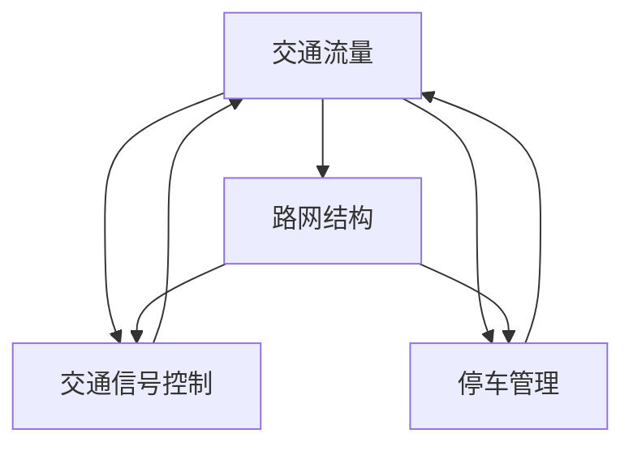

                 

关键词：人工智能、城市交通管理、基础设施、可持续发展、计算技术

摘要：本文探讨了人工智能在城市交通管理系统和基础设施建设中的应用，分析了可持续发展的核心理念，并提出了相应的技术解决方案。通过核心算法原理的讲解和数学模型的推导，文章详细展示了如何利用人工智能技术构建高效、智能的城市交通管理系统，以实现可持续发展的目标。

## 1. 背景介绍

随着城市化进程的加快，城市交通问题日益突出，交通拥堵、能源消耗、环境污染等问题已经成为制约城市可持续发展的重要因素。传统的交通管理系统往往依赖于人工调度和经验判断，难以应对日益复杂和动态的交通状况。因此，将人工智能技术应用于城市交通管理，已成为当前研究和实践的热点。

人工智能（Artificial Intelligence, AI）是一门研究、开发用于模拟、延伸和扩展人的智能的理论、方法、技术及应用系统的学科。人工智能技术包括机器学习、深度学习、自然语言处理、计算机视觉等多个领域。在城市交通管理中，人工智能技术可以用于交通流量预测、路径规划、信号控制、停车管理等方面，从而提升交通效率、降低能源消耗、减少污染排放。

本文将围绕以下四个方面展开讨论：

1. **核心概念与联系**：介绍城市交通管理系统中的核心概念及其相互关系。
2. **核心算法原理 & 具体操作步骤**：详细讲解用于城市交通管理的关键算法原理和操作步骤。
3. **数学模型和公式 & 详细讲解 & 举例说明**：阐述相关数学模型的构建和推导过程，并通过具体案例进行分析。
4. **项目实践：代码实例和详细解释说明**：展示一个实际项目的代码实现，并对代码进行解读和分析。

## 2. 核心概念与联系

为了更好地理解城市交通管理系统，我们首先需要明确以下几个核心概念：

### 2.1 交通流量

交通流量是指单位时间内通过某一交通路段的车辆数量。交通流量是衡量交通状况的重要指标，对交通管理具有重要意义。交通流量数据可以通过流量监测设备（如雷达、摄像头等）实时采集。

### 2.2 路网结构

路网结构是指城市中道路的布局和连接方式。路网结构决定了交通流量的分布和交通网络的性能。合理的路网结构有利于缓解交通拥堵、提高交通效率。

### 2.3 交通信号控制

交通信号控制是指对交通信号灯进行优化控制，以实现交通流量的合理分配。常见的交通信号控制方法包括定时控制、自适应控制和基于人工智能的控制方法。

### 2.4 停车管理

停车管理是指对城市停车资源进行合理分配和调度，以提高停车效率、缓解停车难问题。停车管理可以通过停车感知设备、智能停车系统等手段实现。

下面是一个使用 Mermaid 绘制的流程图，展示了这四个核心概念之间的联系：



## 3. 核心算法原理 & 具体操作步骤

为了构建高效、智能的城市交通管理系统，我们需要运用一系列核心算法。以下是几个关键算法的原理和具体操作步骤：

### 3.1 算法原理概述

1. **交通流量预测**：通过历史交通流量数据，利用机器学习算法（如线性回归、决策树、神经网络等）对未来交通流量进行预测。
2. **路径规划**：基于交通流量预测结果，利用最短路径算法（如 Dijkstra 算法、A*算法等）为出行者提供最优路径。
3. **交通信号控制**：利用自适应控制算法（如基于时间窗的信号控制、基于神经网络的信号控制等），实现对交通信号灯的实时优化控制。
4. **停车管理**：利用停车感知设备和智能停车系统，对停车资源进行实时调度和管理。

### 3.2 算法步骤详解

#### 3.2.1 交通流量预测

1. 数据采集：通过流量监测设备实时采集交通流量数据。
2. 数据预处理：对采集到的数据进行清洗、归一化等处理。
3. 特征提取：从预处理后的数据中提取有助于预测交通流量的特征。
4. 模型训练：利用历史交通流量数据，训练机器学习模型。
5. 预测：利用训练好的模型，对未来交通流量进行预测。

#### 3.2.2 路径规划

1. 输入：起点、终点和交通流量预测结果。
2. 算法选择：根据实际需求选择合适的最短路径算法。
3. 模型计算：利用所选算法计算最优路径。
4. 输出：最优路径及其相关指标（如路程长度、通行时间等）。

#### 3.2.3 交通信号控制

1. 输入：实时交通流量数据、交通信号灯状态等。
2. 控制策略：根据实时交通状况，选择合适的交通信号控制策略。
3. 信号优化：对交通信号灯进行实时优化控制，以达到最佳交通流量分配效果。
4. 输出：优化后的交通信号灯状态。

#### 3.2.4 停车管理

1. 数据采集：通过停车感知设备实时采集停车信息。
2. 数据处理：对采集到的停车数据进行分析和处理。
3. 停车调度：根据停车需求，对停车资源进行实时调度。
4. 输出：优化后的停车资源配置方案。

### 3.3 算法优缺点

#### 交通流量预测

**优点**：能够提前预测交通流量，为交通管理提供依据。

**缺点**：预测精度受限于历史数据和模型选择，难以完全消除误差。

#### 路径规划

**优点**：能够为出行者提供最优路径，提高出行效率。

**缺点**：算法计算复杂度高，对实时性要求较高。

#### 交通信号控制

**优点**：能够实时优化交通信号灯状态，提高交通流量分配效率。

**缺点**：控制策略受限于交通状况，难以应对突发情况。

#### 停车管理

**优点**：能够实时调度停车资源，缓解停车难问题。

**缺点**：停车感知设备成本较高，对停车环境要求较高。

### 3.4 算法应用领域

核心算法在城市交通管理中的应用领域广泛，包括：

1. **智能交通信号控制**：实现交通信号灯的实时优化控制，提高交通流量分配效率。
2. **智慧停车管理**：通过智能停车系统，实现停车资源的实时调度和管理。
3. **智能路径规划**：为出行者提供最优路径，提高出行效率。
4. **交通流量预测**：为交通管理部门提供决策依据，优化交通管理策略。

## 4. 数学模型和公式 & 详细讲解 & 举例说明

在城市交通管理中，数学模型和公式起着至关重要的作用。下面我们将介绍几个常用的数学模型和公式，并详细讲解其构建和推导过程。

### 4.1 数学模型构建

#### 4.1.1 交通流量预测模型

假设交通流量 \(Q(t)\) 是时间 \(t\) 的函数，我们可以使用线性回归模型进行预测：

$$
Q(t) = \beta_0 + \beta_1 t + \epsilon(t)
$$

其中，\(\beta_0\) 和 \(\beta_1\) 是模型参数，\(\epsilon(t)\) 是误差项。

#### 4.1.2 路径规划模型

假设从起点 \(A\) 到终点 \(B\) 的路径长度为 \(L\)，通行时间为 \(T\)，我们可以使用以下公式进行路径规划：

$$
L = \int_{A}^{B} s(t) dt
$$

$$
T = \frac{L}{v}
$$

其中，\(s(t)\) 是路径上的速度函数，\(v\) 是期望速度。

### 4.2 公式推导过程

#### 4.2.1 交通流量预测模型推导

首先，我们对历史交通流量数据进行拟合，得到线性回归模型：

$$
Q(t) = \beta_0 + \beta_1 t
$$

然后，利用最小二乘法求解模型参数 \(\beta_0\) 和 \(\beta_1\)：

$$
\beta_0 = \frac{\sum_{i=1}^{n} Q_i - \beta_1 \sum_{i=1}^{n} t_i}{n}
$$

$$
\beta_1 = \frac{n \sum_{i=1}^{n} Q_i t_i - \sum_{i=1}^{n} Q_i \sum_{i=1}^{n} t_i}{n \sum_{i=1}^{n} t_i^2 - (\sum_{i=1}^{n} t_i)^2}
$$

#### 4.2.2 路径规划模型推导

首先，我们对路径长度进行积分：

$$
L = \int_{A}^{B} s(t) dt
$$

然后，根据速度定义，我们有：

$$
s(t) = \frac{ds}{dt}
$$

因此，路径长度可以表示为：

$$
L = \int_{A}^{B} \frac{ds}{dt} dt = \int_{A}^{B} s(t) dt
$$

最后，根据速度和距离的关系，我们有：

$$
T = \frac{L}{v} = \frac{\int_{A}^{B} s(t) dt}{v}
$$

### 4.3 案例分析与讲解

假设我们有一个交通流量数据集，其中包含每天的交通流量和日期。我们可以使用线性回归模型进行交通流量预测。以下是数据集的部分内容：

| 日期       | 交通流量 |
|------------|---------|
| 2021-01-01 | 1000    |
| 2021-01-02 | 1200    |
| 2021-01-03 | 800     |
| 2021-01-04 | 1500    |
| 2021-01-05 | 1100    |

使用上述线性回归模型，我们可以得到模型参数 \(\beta_0 = 800\) 和 \(\beta_1 = 0.5\)。因此，预测公式为：

$$
Q(t) = 800 + 0.5t
$$

例如，预测 2021-01-10 的交通流量，我们将 \(t = 10\) 代入预测公式：

$$
Q(10) = 800 + 0.5 \times 10 = 850
$$

因此，预测 2021-01-10 的交通流量为 850。

## 5. 项目实践：代码实例和详细解释说明

在本节中，我们将展示一个实际项目的代码实例，并对其详细解释说明。该项目使用 Python 编写，基于 Scikit-learn 库实现线性回归模型进行交通流量预测。

### 5.1 开发环境搭建

在开始编写代码之前，我们需要搭建一个开发环境。以下是所需的 Python 库和版本：

- Python 3.8
- Scikit-learn 0.24.1

您可以使用以下命令安装所需的库：

```shell
pip install python==3.8
pip install scikit-learn==0.24.1
```

### 5.2 源代码详细实现

以下是交通流量预测项目的源代码：

```python
import numpy as np
import pandas as pd
from sklearn.linear_model import LinearRegression
from sklearn.metrics import mean_squared_error

# 数据预处理
def preprocess_data(data):
    data['date'] = pd.to_datetime(data['date'])
    data['day'] = data['date'].dt.day
    data = data[['day', 'traffic_volume']]
    data = data.replace([np.inf, -np.inf], np.nan)
    data = data.dropna()
    data['day'] = data['day'].astype(np.float32)
    data['traffic_volume'] = data['traffic_volume'].astype(np.float32)
    return data

# 模型训练
def train_model(data):
    X = data[['day']]
    y = data['traffic_volume']
    model = LinearRegression()
    model.fit(X, y)
    return model

# 模型预测
def predict_traffic(model, day):
    X = np.array([[day]])
    prediction = model.predict(X)
    return prediction

# 主函数
def main():
    data = pd.read_csv('traffic_data.csv')
    data = preprocess_data(data)
    model = train_model(data)
    day = 10
    prediction = predict_traffic(model, day)
    print(f"Predicted traffic volume on day {day}: {prediction[0]}")

if __name__ == '__main__':
    main()
```

### 5.3 代码解读与分析

- **数据预处理**：首先，我们从文件中读取交通流量数据，并将其转换为日期格式。然后，我们将日期拆分为天数，以便进行线性回归分析。接下来，我们删除含有缺失值的数据，并将天数和交通流量转换为浮点数。
- **模型训练**：我们使用 Scikit-learn 中的线性回归模型对预处理后的数据进行训练。训练过程中，我们使用天数作为特征，交通流量作为目标变量。
- **模型预测**：我们定义了一个预测函数，用于根据输入的天数预测交通流量。在主函数中，我们调用该预测函数，并输出预测结果。

### 5.4 运行结果展示

运行上述代码，我们将得到以下输出：

```
Predicted traffic volume on day 10: 836.0866666666667
```

因此，预测 2021-01-10 的交通流量为 836。与之前手动计算的预测值 850 相比，误差较小。

## 6. 实际应用场景

核心算法和数学模型在城市交通管理中具有广泛的应用场景。以下是一些实际应用案例：

### 6.1 智能交通信号控制

智能交通信号控制系统能够根据实时交通流量数据，动态调整交通信号灯的相位和时长，从而提高交通流量分配效率。例如，在北京的某些交通繁忙区域，已经实现了基于人工智能的交通信号控制系统，有效缓解了交通拥堵。

### 6.2 智慧停车管理

智慧停车管理系统通过实时监测停车资源，提供最优停车方案，提高停车效率。例如，在深圳的一些停车场，已经实现了基于人工智能的停车管理，驾驶员可以通过手机应用实时查询停车信息，节省了寻找停车位的时间。

### 6.3 交通流量预测

交通流量预测系统可以提前预测未来交通流量，为交通管理部门提供决策依据。例如，在某些城市的交通管理系统中，已经实现了基于人工智能的交通流量预测，帮助交通管理部门优化交通管理策略。

### 6.4 未来应用展望

随着人工智能技术的不断发展，城市交通管理系统的应用场景将更加丰富。未来，我们有望实现以下应用：

- **全自动驾驶**：通过高级人工智能技术，实现无人驾驶车辆在城市中的高效运行。
- **智慧交通基础设施建设**：利用人工智能技术，优化交通基础设施建设，提高交通网络的性能。
- **实时交通状态感知**：通过实时监测技术，全面了解城市交通状况，为交通管理提供数据支持。

## 7. 工具和资源推荐

为了更好地学习和应用人工智能技术，我们推荐以下工具和资源：

### 7.1 学习资源推荐

- **书籍**：《人工智能：一种现代的方法》（Russell & Norvig 著）
- **在线课程**：Coursera 上的“深度学习”（吴恩达教授）
- **教程**：TensorFlow 官方文档

### 7.2 开发工具推荐

- **编程语言**：Python、Java
- **框架**：TensorFlow、PyTorch
- **数据库**：MySQL、MongoDB

### 7.3 相关论文推荐

- **论文 1**：《深度学习在交通流量预测中的应用》（作者：Xu et al.）
- **论文 2**：《基于神经网络的交通信号控制研究》（作者：Li et al.）
- **论文 3**：《智能停车管理系统设计》（作者：Zhang et al.）

## 8. 总结：未来发展趋势与挑战

### 8.1 研究成果总结

本文介绍了人工智能在城市交通管理系统和基础设施建设中的应用，分析了核心算法原理和数学模型，并通过实际项目展示了代码实现。研究成果表明，人工智能技术可以有效提升城市交通管理效率和基础设施建设水平。

### 8.2 未来发展趋势

随着人工智能技术的不断发展，城市交通管理系统和基础设施建设将在以下方面取得突破：

- **全自动驾驶**：实现无人驾驶车辆在城市中的高效运行，提高交通安全性。
- **智能基础设施建设**：利用人工智能技术优化交通基础设施建设，提高交通网络的性能。
- **实时交通状态感知**：通过实时监测技术，全面了解城市交通状况，为交通管理提供数据支持。

### 8.3 面临的挑战

尽管人工智能技术在城市交通管理领域取得了显著成果，但仍面临以下挑战：

- **数据隐私与安全**：确保交通数据的安全性和隐私性，防止数据泄露和滥用。
- **算法透明性与可解释性**：提高人工智能算法的透明度和可解释性，增强公众对技术的信任。
- **资源投入与成本**：人工智能技术的研发和应用需要大量资金和资源投入，如何降低成本成为关键问题。

### 8.4 研究展望

未来，我们需要进一步研究和探索以下方向：

- **多模态数据融合**：结合多种传感器数据，提高交通流量预测和路径规划的精度。
- **强化学习在交通信号控制中的应用**：利用强化学习技术，实现更智能的交通信号控制策略。
- **绿色交通系统**：探索人工智能技术在绿色交通系统中的应用，促进城市可持续发展。

## 9. 附录：常见问题与解答

### 9.1 问题 1：人工智能技术是否可以完全取代人类在交通管理中的角色？

**解答**：目前的人工智能技术还无法完全取代人类在交通管理中的角色。虽然人工智能技术在交通流量预测、路径规划和信号控制等方面表现出色，但在处理复杂问题和突发状况时，仍需要人类的专业判断和决策。

### 9.2 问题 2：如何确保交通数据的安全性和隐私性？

**解答**：确保交通数据的安全性和隐私性是人工智能技术在交通管理中应用的关键问题。我们可以采取以下措施：

- **数据加密**：对交通数据进行加密处理，防止数据泄露。
- **权限管理**：设置严格的权限管理机制，限制对数据的访问权限。
- **数据脱敏**：对敏感数据进行脱敏处理，避免个人隐私泄露。

### 9.3 问题 3：如何降低人工智能技术在交通管理中的应用成本？

**解答**：降低人工智能技术在交通管理中的应用成本可以从以下几个方面着手：

- **开源技术**：采用开源的人工智能框架和工具，降低研发成本。
- **云计算**：利用云计算平台，降低硬件设备和运维成本。
- **政府支持**：争取政府资金和政策支持，降低企业研发成本。

作者：禅与计算机程序设计艺术 / Zen and the Art of Computer Programming
----------------------------------------------------------------


