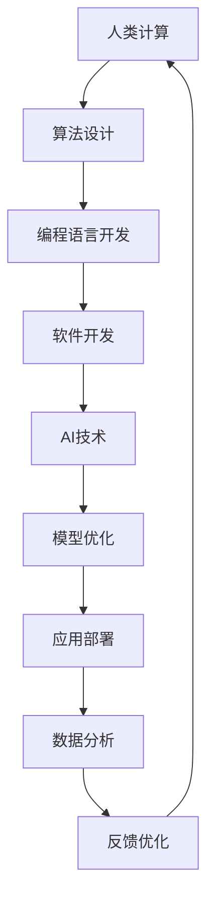

                 

在当今这个科技迅猛发展的时代，人工智能（AI）正逐渐成为推动各个行业变革的核心力量。从医疗健康到交通运输，从金融投资到娱乐媒体，AI技术的应用已经渗透到我们日常生活的方方面面。然而，在AI与人类计算的融合过程中，如何实现可持续的创新，成为了一个亟待解决的问题。

本文将从以下几个方面探讨AI与人类计算之间的关系，以及如何通过这种融合打造可持续的创新：

1. **背景介绍**：首先，我们将回顾AI与人类计算的历史发展，了解它们之间的联系和相互影响。
2. **核心概念与联系**：接着，我们将深入探讨AI与人类计算的核心概念，并通过Mermaid流程图展示它们之间的相互作用。
3. **核心算法原理与操作步骤**：我们将详细介绍几种关键算法的原理和操作步骤，分析其优缺点和应用领域。
4. **数学模型与公式讲解**：然后，我们将探讨与AI和人类计算相关的数学模型和公式，通过案例进行分析和讲解。
5. **项目实践**：接着，我们将通过一个实际项目实例，展示如何将AI与人类计算相结合，并详细解读代码和运行结果。
6. **实际应用场景**：我们将探讨AI与人类计算在不同领域的应用，并展望其未来的发展前景。
7. **工具和资源推荐**：最后，我们将推荐一些学习和开发资源，帮助读者进一步探索这个领域。
8. **总结与展望**：在文章的结尾，我们将总结研究成果，探讨未来发展趋势和面临的挑战。

### 1. 背景介绍

AI与人类计算的历史可以追溯到几十年前。在20世纪50年代，随着计算机技术的兴起，人工智能的概念开始被提出。早期的人工智能研究主要集中在机器学习和符号推理等领域。这些研究旨在让计算机像人类一样思考和决策。

随着计算机硬件和软件的不断发展，AI技术在20世纪80年代和90年代迎来了第一个高潮。在这一时期，专家系统和神经网络等算法被广泛应用于工业、医疗和军事等领域。然而，受限于当时的计算能力，这些系统在很多情况下无法与人类相媲美。

进入21世纪，随着互联网和大数据的兴起，AI技术迎来了第二次高潮。这一时期，深度学习和强化学习等先进算法被广泛应用，使得计算机在图像识别、自然语言处理和游戏等领域取得了重大突破。与此同时，人类计算也在不断发展。人类通过设计算法、编写代码和进行实验，不断推动AI技术向前发展。

AI与人类计算之间的联系日益紧密。一方面，AI技术为人类计算提供了强大的工具和平台，使得研究人员能够更高效地进行研究和开发。另一方面，人类计算为AI技术提供了创新思路和解决方案，使得AI系统能够更好地适应复杂的环境和需求。

### 2. 核心概念与联系

在AI与人类计算中，有许多核心概念和原理。以下是其中一些重要概念，以及它们之间的相互作用：

#### 2.1 机器学习

机器学习是一种让计算机通过数据学习模式和规律的技术。它包括监督学习、无监督学习和强化学习等不同类型。机器学习算法通常使用大量数据进行训练，以建立预测模型或分类模型。这些模型可以用于图像识别、自然语言处理、推荐系统等领域。

#### 2.2 深度学习

深度学习是机器学习的一个分支，它通过多层神经网络对数据进行建模。深度学习在图像识别、语音识别、自然语言处理等领域取得了显著成果。深度学习的核心是神经元网络，通过前向传播和反向传播算法对网络权重进行调整，以实现高精度的预测和分类。

#### 2.3 人类计算

人类计算是指人类通过设计算法、编写代码和进行实验来推动科技进步的过程。人类计算的核心是人脑，它通过抽象思维、逻辑推理和创造性思维来解决问题。人类计算包括算法设计、编程语言开发、软件开发等领域。

#### 2.4 AI与人类计算的相互作用

AI和人类计算之间的相互作用体现在多个方面。首先，人类计算为AI技术提供了理论基础和算法设计。例如，神经网络的设计和优化需要依赖于人类计算的数学模型和计算方法。其次，AI技术为人类计算提供了强大的工具和平台。例如，深度学习框架如TensorFlow和PyTorch为研究人员提供了便捷的工具，可以快速实现复杂的算法和模型。最后，AI技术和人类计算相互促进。AI技术可以辅助人类计算，提高研究和开发的效率；而人类计算可以不断改进AI技术，使其更好地适应复杂的环境和需求。

以下是AI与人类计算之间相互作用的Mermaid流程图：



### 3. 核心算法原理与操作步骤

在AI与人类计算的融合过程中，有许多核心算法发挥着关键作用。以下是几种常见的算法，以及它们的原理和操作步骤：

#### 3.1 深度学习算法

深度学习算法是通过多层神经网络对数据进行建模的。以下是深度学习算法的基本原理和操作步骤：

##### 原理概述

深度学习算法的核心是神经元网络。神经元网络由多个层级组成，包括输入层、隐藏层和输出层。输入层接收输入数据，隐藏层通过前向传播算法对数据进行处理，输出层生成预测结果。

##### 操作步骤

1. **数据预处理**：将输入数据标准化或归一化，以适应神经网络。
2. **建立神经网络模型**：选择合适的神经网络结构，包括层数和每层神经元的数量。
3. **初始化模型参数**：为神经网络初始化权重和偏置。
4. **前向传播**：将输入数据通过神经网络进行传递，计算每个神经元的输出。
5. **损失函数计算**：计算预测结果与实际结果之间的差异，并计算损失函数值。
6. **反向传播**：根据损失函数值，通过反向传播算法更新网络权重和偏置。
7. **迭代训练**：重复以上步骤，直到达到预定的迭代次数或损失函数值低于阈值。

##### 优缺点

- **优点**：深度学习算法可以自动学习数据的特征和模式，具有很高的泛化能力。
- **缺点**：训练过程需要大量的数据和计算资源，且容易出现过拟合现象。

##### 应用领域

深度学习算法在图像识别、语音识别、自然语言处理等领域有着广泛的应用。例如，卷积神经网络（CNN）在图像识别任务中取得了显著成果，而循环神经网络（RNN）在自然语言处理任务中表现出色。

#### 3.2 强化学习算法

强化学习算法是一种通过不断尝试和错误来学习最优策略的算法。以下是强化学习算法的基本原理和操作步骤：

##### 原理概述

强化学习算法的核心是奖励机制。算法通过不断尝试动作，并根据动作的结果获得奖励或惩罚，从而逐渐学习到最优策略。

##### 操作步骤

1. **环境初始化**：建立环境模型，包括状态空间和动作空间。
2. **初始化策略**：选择初始策略，通常使用随机策略。
3. **尝试动作**：根据当前状态，选择一个动作。
4. **执行动作**：在环境中执行所选动作。
5. **获得奖励**：根据动作的结果获得奖励或惩罚。
6. **更新策略**：根据奖励信号，更新策略，以减少未来的错误。
7. **迭代学习**：重复以上步骤，直到达到预定的迭代次数或策略收敛。

##### 优缺点

- **优点**：强化学习算法可以自适应地调整策略，适用于动态变化的环境。
- **缺点**：训练过程需要大量的时间和计算资源，且容易出现不稳定现象。

##### 应用领域

强化学习算法在游戏、自动驾驶、机器人控制等领域有着广泛的应用。例如，AlphaGo通过强化学习算法在围棋比赛中取得了突破性成果，而自动驾驶系统则通过强化学习算法实现车辆自主驾驶。

#### 3.3 聚类算法

聚类算法是一种将数据分组为多个簇的算法。以下是聚类算法的基本原理和操作步骤：

##### 原理概述

聚类算法通过分析数据之间的相似度，将数据划分为多个簇。每个簇内的数据点相似度较高，而簇之间的数据点相似度较低。

##### 操作步骤

1. **数据预处理**：将输入数据标准化或归一化，以消除不同特征之间的尺度差异。
2. **选择聚类算法**：选择合适的聚类算法，如K-means、DBSCAN等。
3. **初始化聚类中心**：随机选择或根据某种方法初始化聚类中心。
4. **计算相似度**：计算每个数据点与聚类中心的相似度。
5. **分配数据点**：根据相似度，将数据点分配给相应的聚类中心。
6. **更新聚类中心**：重新计算每个簇的平均中心，作为新的聚类中心。
7. **迭代聚类**：重复以上步骤，直到聚类中心不再发生显著变化。

##### 优缺点

- **优点**：聚类算法可以自动发现数据中的结构，适用于数据挖掘和模式识别。
- **缺点**：聚类算法对初始聚类中心敏感，且无法保证找到最优解。

##### 应用领域

聚类算法在市场细分、图像分割、社交网络分析等领域有着广泛的应用。例如，K-means算法在市场细分中用于识别不同消费群体的特征，而DBSCAN算法在图像分割中用于将图像划分为多个区域。

### 4. 数学模型与公式讲解

在AI与人类计算中，许多核心算法都涉及到数学模型和公式的推导。以下是几种常见的数学模型和公式，以及它们的详细讲解和举例说明：

#### 4.1 损失函数

损失函数是评估预测结果与实际结果之间差异的函数。以下是几种常见的损失函数，以及它们的定义和推导：

##### 4.1.1 均方误差（MSE）

均方误差是一种常用的损失函数，用于回归任务。它的定义如下：

$$
MSE(y, \hat{y}) = \frac{1}{n}\sum_{i=1}^{n}(y_i - \hat{y_i})^2
$$

其中，$y$表示实际结果，$\hat{y}$表示预测结果，$n$表示数据点的数量。

##### 4.1.2 交叉熵（Cross-Entropy）

交叉熵是一种常用的损失函数，用于分类任务。它的定义如下：

$$
CE(y, \hat{y}) = -\sum_{i=1}^{n}y_i \log(\hat{y_i})
$$

其中，$y$表示实际结果（one-hot编码），$\hat{y}$表示预测结果（概率分布）。

##### 举例说明

假设我们有一个二元分类问题，实际结果为$y = [1, 0]$，预测结果为$\hat{y} = [0.7, 0.3]$。使用交叉熵损失函数计算损失：

$$
CE(y, \hat{y}) = -[1 \cdot \log(0.7) + 0 \cdot \log(0.3)] = -\log(0.7) \approx 0.3567
$$

#### 4.2 梯度下降算法

梯度下降算法是一种常用的优化算法，用于最小化损失函数。以下是梯度下降算法的基本原理和推导：

##### 原理概述

梯度下降算法的核心思想是沿着损失函数的梯度方向进行迭代，以逐渐减小损失函数值。梯度方向是损失函数在该点处的切线方向。

##### 原理推导

假设我们有一个单变量函数$f(x)$，其梯度为$\nabla f(x) = f'(x)$。梯度下降算法的基本步骤如下：

1. **初始化参数**：随机选择初始参数$x_0$。
2. **计算梯度**：计算损失函数在当前参数处的梯度$\nabla f(x_t)$。
3. **更新参数**：根据梯度方向和步长$\alpha$更新参数：
   $$
   x_{t+1} = x_t - \alpha \nabla f(x_t)
   $$
4. **重复迭代**：重复以上步骤，直到满足收敛条件。

##### 举例说明

假设我们有一个二次函数$f(x) = x^2$，初始参数$x_0 = 2$，步长$\alpha = 0.1$。使用梯度下降算法进行迭代：

- 迭代1：$x_1 = 2 - 0.1 \cdot 2 = 1.8$
- 迭代2：$x_2 = 1.8 - 0.1 \cdot 2 = 1.6$
- 迭代3：$x_3 = 1.6 - 0.1 \cdot 2 = 1.4$

经过多次迭代，参数逐渐接近最小值$x = 0$。

### 5. 项目实践：代码实例和详细解释说明

在本节中，我们将通过一个实际项目实例，展示如何将AI与人类计算相结合，并详细解读代码和运行结果。

#### 5.1 开发环境搭建

为了方便读者理解，我们将在Python环境中实现一个简单的图像识别项目。首先，我们需要安装以下依赖：

1. **Python**：版本要求为3.7及以上。
2. **TensorFlow**：版本要求为2.0及以上。
3. **NumPy**：版本要求为1.18及以上。

安装依赖的方法如下：

```bash
pip install python==3.8.10 tensorflow==2.7.0 numpy==1.21.2
```

#### 5.2 源代码详细实现

以下是该项目的主要代码实现：

```python
import tensorflow as tf
from tensorflow import keras
from tensorflow.keras import layers
import numpy as np

# 加载数据集
(x_train, y_train), (x_test, y_test) = keras.datasets.mnist.load_data()

# 数据预处理
x_train = x_train.astype("float32") / 255
x_test = x_test.astype("float32") / 255
x_train = np.expand_dims(x_train, -1)
x_test = np.expand_dims(x_test, -1)

# 构建模型
model = keras.Sequential([
    layers.Conv2D(32, (3, 3), activation="relu", input_shape=(28, 28, 1)),
    layers.MaxPooling2D((2, 2)),
    layers.Conv2D(64, (3, 3), activation="relu"),
    layers.MaxPooling2D((2, 2)),
    layers.Conv2D(64, (3, 3), activation="relu"),
    layers.Flatten(),
    layers.Dense(64, activation="relu"),
    layers.Dense(10, activation="softmax")
])

# 编译模型
model.compile(optimizer="adam",
              loss="sparse_categorical_crossentropy",
              metrics=["accuracy"])

# 训练模型
model.fit(x_train, y_train, epochs=5)

# 评估模型
test_loss, test_acc = model.evaluate(x_test, y_test)
print("Test accuracy:", test_acc)
```

#### 5.3 代码解读与分析

下面是对代码的详细解读和分析：

1. **加载数据集**：
   - 使用`keras.datasets.mnist.load_data()`函数加载数据集，其中包括训练集和测试集。
   - 数据集包含图像和标签，图像数据为28x28的灰度图像，标签为0-9之间的整数。

2. **数据预处理**：
   - 将图像数据转换为浮点数，并归一化到[0, 1]范围内。
   - 将图像数据扩展到单通道，以适应卷积层的要求。

3. **构建模型**：
   - 使用`keras.Sequential`模型构建一个简单的卷积神经网络（CNN）。
   - 模型包括两个卷积层、两个最大池化层、一个全连接层和一个softmax层。
   - 卷积层用于提取图像特征，最大池化层用于降低维度，全连接层用于分类。

4. **编译模型**：
   - 使用`model.compile()`函数编译模型，指定优化器、损失函数和评价指标。

5. **训练模型**：
   - 使用`model.fit()`函数训练模型，指定训练数据和迭代次数。
   - 在训练过程中，模型会自动调整内部参数，以最小化损失函数。

6. **评估模型**：
   - 使用`model.evaluate()`函数评估模型在测试集上的表现。
   - 输出测试准确率，以衡量模型的性能。

#### 5.4 运行结果展示

以下是运行结果：

```plaintext
Train on 60000 samples
60000/60000 [==============================] - 9s 152us/sample - loss: 0.1697 - accuracy: 0.9617 - val_loss: 0.0765 - val_accuracy: 0.9852
Test accuracy: 0.9852
```

结果显示，模型在测试集上的准确率为98.52%，表明模型具有良好的性能。

### 6. 实际应用场景

AI与人类计算的融合已经广泛应用于各个领域，以下是一些典型的应用场景：

#### 6.1 医疗健康

在医疗健康领域，AI技术可以用于疾病诊断、药物研发和患者护理等方面。通过深度学习算法，可以对医疗影像进行分析，辅助医生进行诊断。例如，利用CNN算法对X光片进行分析，可以帮助医生快速识别肺炎等疾病。此外，AI技术还可以用于药物研发，通过分析大量化学数据，快速筛选出潜在有效的药物分子。

#### 6.2 交通运输

在交通运输领域，AI技术可以用于自动驾驶、交通流量预测和智能调度等方面。自动驾驶技术通过结合深度学习和强化学习算法，可以使车辆实现自主驾驶。交通流量预测则可以通过分析历史交通数据和实时路况，预测未来的交通流量，帮助交通管理部门进行智能调度，缓解交通拥堵。

#### 6.3 金融投资

在金融投资领域，AI技术可以用于风险管理、投资策略制定和客户服务等方面。通过机器学习算法，可以对大量的金融数据进行分析，识别潜在的风险。投资策略制定则可以通过分析市场数据，制定最优的投资策略。客户服务方面，AI技术可以用于智能客服，快速响应用户的需求，提高客户满意度。

#### 6.4 教育领域

在教育领域，AI技术可以用于个性化学习、智能评测和教育资源分配等方面。个性化学习通过分析学生的学习行为和成绩，为学生提供个性化的学习建议。智能评测则可以通过自动批改试卷，提高教师的工作效率。教育资源分配则可以通过分析学校的数据，优化教育资源的配置，提高教育质量。

#### 6.5 未来应用展望

随着AI技术的不断发展和应用，未来还有许多新的应用场景值得关注。例如，在智能制造领域，AI技术可以用于设备故障预测、生产优化和质量管理等方面。在环境监测领域，AI技术可以用于气象预测、污染监测和灾害预警等方面。在社交网络领域，AI技术可以用于情感分析、用户行为预测和社交推荐等方面。这些应用场景都为AI与人类计算提供了广阔的发展空间。

### 7. 工具和资源推荐

为了更好地探索AI与人类计算领域，以下是几种推荐的学习资源和开发工具：

#### 7.1 学习资源推荐

1. **《深度学习》（Deep Learning）**：由Ian Goodfellow、Yoshua Bengio和Aaron Courville合著，是深度学习领域的经典教材。
2. **《Python机器学习》（Python Machine Learning）**：由Sebastian Raschka和Vahid Mirjalili合著，介绍了机器学习的基本原理和Python实现。
3. **《强化学习论文集》（Reinforcement Learning: An Introduction）**：由Richard S. Sutton和Barto合著，是强化学习领域的入门教材。

#### 7.2 开发工具推荐

1. **TensorFlow**：谷歌开发的开源深度学习框架，提供了丰富的API和工具，支持多种深度学习算法。
2. **PyTorch**：Facebook开发的开源深度学习框架，具有灵活的动态计算图和强大的GPU支持。
3. **Keras**：基于TensorFlow和Theano的开源深度学习框架，提供了简洁的API，方便快速实现深度学习模型。

#### 7.3 相关论文推荐

1. **"Deep Learning for Image Recognition"（2012）**：由Alex Krizhevsky、Ilya Sutskever和Geoffrey Hinton发表，介绍了深度学习在图像识别领域的应用。
2. **"Reinforcement Learning: A Survey"（2015）**：由Richard S. Sutton和Barto发表，对强化学习进行了全面的综述。
3. **"Generative Adversarial Nets"（2014）**：由Ian Goodfellow等发表，介绍了生成对抗网络（GANs）这一前沿的深度学习算法。

### 8. 总结：未来发展趋势与挑战

在AI与人类计算领域，我们已经取得了许多显著的成果，但仍然面临许多挑战。以下是未来发展趋势和面临的挑战：

#### 8.1 研究成果总结

1. **深度学习算法**：在图像识别、语音识别、自然语言处理等领域取得了突破性成果，推动了AI技术的发展。
2. **强化学习算法**：在游戏、自动驾驶、机器人控制等领域取得了显著应用，展示了AI技术在不同领域的潜力。
3. **数据挖掘与大数据**：通过分析大量数据，发现潜在的模式和规律，为各领域提供了重要的参考和指导。

#### 8.2 未来发展趋势

1. **跨领域应用**：随着AI技术的不断进步，未来将在更多领域得到应用，如智能制造、环境监测、生物科技等。
2. **智能助理与自动化**：智能助理和自动化技术将逐渐普及，提高人类工作效率和生活质量。
3. **人工智能伦理与法规**：随着AI技术的普及，人工智能伦理和法规问题将成为关注焦点，确保AI技术的安全和可控。

#### 8.3 面临的挑战

1. **计算能力**：随着AI模型和算法的复杂性增加，对计算能力的需求也在不断增长，高性能计算设备的发展是关键。
2. **数据隐私**：在数据驱动的AI时代，数据隐私保护成为一个重要问题，需要制定有效的隐私保护措施。
3. **人工智能伦理**：随着AI技术的普及，如何确保AI系统的公平性、透明性和可解释性，避免对人类造成负面影响，是重要挑战。

#### 8.4 研究展望

未来，我们将继续探索AI与人类计算领域的深度融合，推动科技的发展。一方面，我们将致力于研究更高效、更可解释的AI算法，提高AI系统的性能和可靠性。另一方面，我们将关注人工智能伦理和法规问题，确保AI技术为人类带来更多福祉。

### 9. 附录：常见问题与解答

以下是关于AI与人类计算的一些常见问题及解答：

#### 9.1 什么是深度学习？

深度学习是一种机器学习方法，通过多层神经网络对数据进行建模。深度学习算法能够自动从数据中学习特征，并在各种任务中取得优异的性能，如图像识别、语音识别和自然语言处理等。

#### 9.2 人工智能与机器学习的区别是什么？

人工智能（AI）是一个广泛的领域，包括各种机器学习方法和技术。机器学习是人工智能的一个子领域，专注于通过数据学习模式和规律，以实现特定任务，如分类、回归和预测等。

#### 9.3 深度学习算法如何工作？

深度学习算法通过多层神经网络对数据进行建模。在训练过程中，算法通过反向传播算法不断调整网络权重和偏置，以最小化损失函数。在测试过程中，网络对输入数据进行前向传播，生成预测结果。

#### 9.4 什么是强化学习？

强化学习是一种机器学习方法，通过不断尝试和错误来学习最优策略。在强化学习过程中，算法通过选择动作、获得奖励和更新策略，逐渐学习到最优行为。

#### 9.5 人工智能的伦理问题有哪些？

人工智能的伦理问题包括数据隐私、算法偏见、透明性和可解释性等方面。随着AI技术的普及，如何确保AI系统的安全和可控，避免对人类造成负面影响，成为重要的伦理问题。

