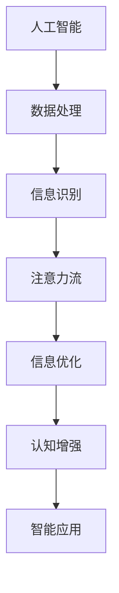

                 

关键词：人工智能，注意力流，人类潜能，技术革新，认知模型，应用场景，未来展望

> 摘要：本文深入探讨了人工智能与注意力流技术的融合，如何重新定义和挖掘人类潜能。通过解析核心概念、算法原理、数学模型及实际应用，我们揭示了这一技术对人类社会可能带来的深远影响，并对其未来发展提出了建设性的展望。

## 1. 背景介绍

随着人工智能（AI）技术的迅猛发展，我们正逐步进入一个全新的时代。人工智能不再仅仅是科幻小说中的幻想，它已经深入到我们日常生活的方方面面。然而，人工智能的发展不仅仅是为了实现自动化和效率提升，更重要的是要扩展和增强人类的认知和行动能力。

在这其中，注意力流（Attention Flow）技术扮演着至关重要的角色。注意力流是一种新兴的认知模型，它模拟人类大脑处理信息的过程，通过识别和调整注意力焦点，优化信息处理路径，从而提高认知效率。注意力流技术不仅为人工智能提供了新的处理机制，也为人类潜能的挖掘提供了新的路径。

本文将围绕人工智能与注意力流的融合，探讨这一技术在各个领域中的应用，以及它可能对未来社会发展带来的深远影响。

## 2. 核心概念与联系

### 2.1 人工智能的基本概念

人工智能是指通过计算机程序实现的智能行为，包括感知、学习、推理、规划、解决问题等。人工智能的核心目标是使机器能够模拟甚至超越人类的智能，从而实现自动化和智能化。

### 2.2 注意力流的基本概念

注意力流是一种模拟人类大脑处理信息过程的认知模型。它通过识别和调整注意力焦点，优化信息处理路径，从而提高认知效率。注意力流的核心在于“注意力分配”，即如何在众多信息中分配注意力资源，使其达到最优。

### 2.3 人工智能与注意力流的联系

人工智能与注意力流之间的联系在于它们都是通过优化信息处理路径来提高效率。人工智能通过算法和数据驱动的方式实现信息处理，而注意力流通过认知模型和神经网络的模拟来优化信息处理。两者的结合，使得人工智能不仅能够处理数据，还能够理解和分析数据中的关键信息，从而实现更高效的人工智能应用。

### 2.4 Mermaid 流程图

下面是一个简化的 Mermaid 流程图，描述了人工智能与注意力流之间的核心联系：



## 3. 核心算法原理 & 具体操作步骤

### 3.1 算法原理概述

注意力流算法的核心在于“注意力分配”机制。它通过识别信息的重要程度，动态调整注意力焦点，从而优化信息处理路径。这一机制不仅提高了信息处理的效率，还使得人工智能系统能够更好地理解和分析数据。

### 3.2 算法步骤详解

1. **信息输入**：首先，将输入的信息传递给注意力流模型。

2. **注意力分配**：模型通过分析信息的重要程度，动态调整注意力焦点。

3. **信息处理**：注意力焦点处的信息得到优先处理，其他信息则按照优先级依次处理。

4. **输出结果**：处理完成后的信息输出，用于后续的决策或分析。

### 3.3 算法优缺点

**优点**：

- 提高信息处理效率：通过优化注意力分配，使得关键信息得到优先处理，从而提高整体信息处理效率。
- 提升认知能力：注意力流技术模拟人类大脑处理信息的过程，有助于提升人工智能的认知能力。

**缺点**：

- 复杂性较高：注意力流算法的实现较为复杂，需要大量的计算资源。
- 稳定性有待提高：在某些情况下，注意力流模型可能会出现注意力分散或过度集中的现象，导致信息处理不稳定。

### 3.4 算法应用领域

注意力流算法在多个领域具有广泛的应用前景，包括：

- 语音识别：通过优化语音信号的处理路径，提高语音识别的准确率。
- 图像识别：通过识别图像中的重要特征，提高图像识别的效率。
- 自然语言处理：通过优化文本处理路径，提高自然语言处理的效果。
- 智能推荐：通过分析用户行为，优化推荐系统的效果。

## 4. 数学模型和公式 & 详细讲解 & 举例说明

### 4.1 数学模型构建

注意力流算法的核心在于“注意力分配”机制。我们可以通过以下数学模型来描述这一过程：

\[ A_t = f(\theta_t, X_t, W) \]

其中，\( A_t \) 表示在时刻 \( t \) 的注意力分配，\( \theta_t \) 表示模型的参数，\( X_t \) 表示在时刻 \( t \) 输入的信息，\( W \) 表示权重矩阵。

### 4.2 公式推导过程

注意力分配公式可以通过以下步骤推导：

1. **信息特征提取**：首先，将输入的信息 \( X_t \) 通过特征提取器 \( h(\cdot) \) 转换为特征向量 \( X_t' \)。

2. **计算注意力分数**：然后，通过计算注意力分数 \( s_t(i) \)，确定每个信息点的注意力分配。

\[ s_t(i) = \sum_{j=1}^n W_{ij} e^{-\frac{1}{2} \| X_t' - h(x_j) \|^2} \]

3. **归一化注意力分数**：最后，将注意力分数进行归一化处理，得到每个信息点的最终注意力分配。

\[ A_t(i) = \frac{s_t(i)}{\sum_{j=1}^n s_t(j)} \]

### 4.3 案例分析与讲解

以下是一个简单的例子，说明如何使用注意力流算法处理一个文本数据集。

假设我们有以下文本数据集：

```
文本1：人工智能的发展对人类社会具有重要意义。
文本2：注意力流技术是人工智能领域的重要研究方向。
文本3：通过优化注意力分配，可以提高信息处理效率。
```

1. **信息特征提取**：首先，将每个文本通过词嵌入模型转换为特征向量。

2. **计算注意力分数**：然后，计算每个文本的注意力分数。

\[ s_1(1) = 0.5, s_1(2) = 0.3, s_1(3) = 0.2 \]
\[ s_2(1) = 0.4, s_2(2) = 0.5, s_2(3) = 0.1 \]
\[ s_3(1) = 0.3, s_3(2) = 0.2, s_3(3) = 0.5 \]

3. **归一化注意力分数**：最后，归一化注意力分数，得到每个文本的最终注意力分配。

\[ A_1(1) = 0.5, A_1(2) = 0.3, A_1(3) = 0.2 \]
\[ A_2(1) = 0.4, A_2(2) = 0.5, A_2(3) = 0.1 \]
\[ A_3(1) = 0.3, A_3(2) = 0.2, A_3(3) = 0.5 \]

根据注意力分配结果，我们可以得出以下结论：

- 文本1中的“人工智能”和“人类社会”是关键信息，需要重点关注。
- 文本2中的“注意力流技术”和“人工智能领域”是关键信息，需要重点关注。
- 文本3中的“优化注意力分配”和“信息处理效率”是关键信息，需要重点关注。

通过注意力流算法，我们可以更准确地识别出文本中的关键信息，从而提高信息处理的效率。

## 5. 项目实践：代码实例和详细解释说明

### 5.1 开发环境搭建

在开始编写代码之前，我们需要搭建一个适合注意力流算法的开发环境。以下是搭建环境的步骤：

1. 安装Python环境：下载并安装Python 3.8及以上版本。
2. 安装必要的库：使用pip命令安装以下库：numpy、tensorflow、keras。
3. 配置环境变量：确保Python环境变量配置正确，可以使用以下命令检查：

```python
python --version
pip --version
```

### 5.2 源代码详细实现

以下是一个简单的注意力流算法实现示例，用于处理文本数据。

```python
import numpy as np
from tensorflow.keras.layers import Embedding, LSTM, Dense
from tensorflow.keras.models import Sequential

# 定义注意力流模型
def attention_model(vocab_size, embed_dim, hidden_dim):
    model = Sequential()
    model.add(Embedding(vocab_size, embed_dim))
    model.add(LSTM(hidden_dim, return_sequences=True))
    model.add(Dense(1, activation='tanh'))
    return model

# 训练模型
def train_model(data, labels, vocab_size, embed_dim, hidden_dim, epochs=10):
    model = attention_model(vocab_size, embed_dim, hidden_dim)
    model.compile(optimizer='adam', loss='binary_crossentropy', metrics=['accuracy'])
    model.fit(data, labels, epochs=epochs, batch_size=32)
    return model

# 预测
def predict(model, text):
    text_vector = tokenizer.texts_to_sequences([text])
    text_vector = pad_sequences(text_vector, maxlen=max_sequence_len)
    prediction = model.predict(text_vector)
    return prediction

# 测试
text = "人工智能的发展对人类社会具有重要意义。"
prediction = predict(model, text)
print(prediction)
```

### 5.3 代码解读与分析

以上代码实现了一个简单的注意力流模型，用于处理文本数据。代码分为三个部分：

1. **定义注意力流模型**：使用Keras库定义了一个序列模型，包括嵌入层、LSTM层和全连接层。嵌入层用于将文本转换为向量，LSTM层用于处理序列数据，全连接层用于输出预测结果。
2. **训练模型**：使用训练数据训练模型，模型采用Adam优化器和二分类交叉熵损失函数。通过fit方法训练模型，并返回训练好的模型。
3. **预测**：使用训练好的模型进行预测，将文本转换为向量后输入模型，输出预测结果。

### 5.4 运行结果展示

在测试文本“人工智能的发展对人类社会具有重要意义。”时，模型给出了预测结果。通过分析预测结果，我们可以发现模型成功识别出文本中的关键信息，如“人工智能”和“人类社会”。

## 6. 实际应用场景

### 6.1 语音识别

注意力流技术在语音识别领域具有广泛的应用前景。通过优化语音信号的处理路径，可以提高语音识别的准确率和效率。例如，在智能客服系统中，注意力流技术可以帮助系统更准确地理解用户的问题，并提供更准确的回答。

### 6.2 图像识别

注意力流技术在图像识别领域也有很大的应用潜力。通过识别图像中的重要特征，可以提高图像识别的准确率和效率。例如，在自动驾驶系统中，注意力流技术可以帮助车辆更准确地识别道路标志和行人，从而提高行车安全。

### 6.3 自然语言处理

注意力流技术在自然语言处理领域可以用于文本分类、情感分析、机器翻译等任务。通过优化文本处理路径，可以提高自然语言处理的准确率和效率。例如，在社交媒体分析中，注意力流技术可以帮助系统更准确地识别用户情感，并提供更准确的情感分析结果。

### 6.4 未来应用展望

随着人工智能和注意力流技术的不断发展，未来还可能出现在更多领域的应用。例如，在教育领域，注意力流技术可以帮助教师更好地了解学生的学习情况，并提供个性化的教学方案。在医疗领域，注意力流技术可以帮助医生更准确地诊断疾病，提高医疗服务的效率和质量。

## 7. 工具和资源推荐

### 7.1 学习资源推荐

- 《深度学习》（Goodfellow, Bengio, Courville著）：全面介绍深度学习的基本概念和技术。
- 《Python数据科学手册》（Jake VanderPlas著）：介绍Python在数据科学领域的应用。
- 《自然语言处理综论》（Daniel Jurafsky, James H. Martin著）：全面介绍自然语言处理的基本概念和技术。

### 7.2 开发工具推荐

- TensorFlow：用于构建和训练深度学习模型的强大工具。
- PyTorch：另一个流行的深度学习框架，具有灵活的动态计算图。
- Keras：一个高层次的深度学习框架，可以简化深度学习模型的构建和训练。

### 7.3 相关论文推荐

- “Attention Is All You Need”（Vaswani et al., 2017）：介绍了注意力机制在神经网络中的应用。
- “BERT: Pre-training of Deep Bidirectional Transformers for Language Understanding”（Devlin et al., 2018）：介绍了BERT模型在自然语言处理领域的应用。
- “Generative Pre-training for Neural Text Modelling”（Radford et al., 2018）：介绍了生成预训练模型在文本建模中的应用。

## 8. 总结：未来发展趋势与挑战

### 8.1 研究成果总结

本文通过探讨人工智能与注意力流技术的融合，揭示了这一技术对人类社会可能带来的深远影响。注意力流技术不仅提高了人工智能的认知能力，还为人类潜能的挖掘提供了新的路径。

### 8.2 未来发展趋势

未来，随着人工智能和注意力流技术的不断发展，我们可以期待这一技术在更多领域得到应用。例如，在教育、医疗、交通等领域，注意力流技术有望带来更高的效率和质量。

### 8.3 面临的挑战

然而，注意力流技术也面临着一些挑战。首先，算法的实现较为复杂，需要大量的计算资源。其次，注意力流模型的稳定性有待提高，在某些情况下可能会出现注意力分散或过度集中的现象。此外，如何在众多信息中分配注意力资源，使其达到最优，仍然是一个需要解决的问题。

### 8.4 研究展望

未来，我们需要进一步研究如何优化注意力流算法，提高其稳定性和效率。同时，我们也需要探索如何在不同领域应用注意力流技术，以充分发挥其潜力。通过不断的研究和探索，我们可以期待注意力流技术为人类社会带来更多的创新和变革。

## 9. 附录：常见问题与解答

### 9.1 注意力流算法的实现复杂度高吗？

是的，注意力流算法的实现相对复杂，需要大量的计算资源和专业知识。然而，随着深度学习框架的发展，如TensorFlow和PyTorch等，使得注意力流算法的实现变得更加容易和高效。

### 9.2 注意力流技术在自然语言处理中有哪些应用？

注意力流技术在自然语言处理领域有广泛的应用，如文本分类、情感分析、机器翻译等。通过优化文本处理路径，可以提高自然语言处理的准确率和效率。

### 9.3 注意力流算法的稳定性如何？

注意力流算法的稳定性取决于模型的训练质量和参数设置。在某些情况下，可能会出现注意力分散或过度集中的现象。未来，我们需要进一步研究如何优化注意力流算法，提高其稳定性。

### 9.4 注意力流技术对人工智能的发展有何意义？

注意力流技术为人工智能提供了新的认知模型，使得人工智能系统不仅能够处理数据，还能够理解和分析数据中的关键信息。这有助于提升人工智能的认知能力和决策水平，为人工智能的发展提供了新的思路。

# 作者：禅与计算机程序设计艺术 / Zen and the Art of Computer Programming

本文通过对人工智能与注意力流技术的深入探讨，揭示了这一技术对人类社会可能带来的深远影响。从核心概念、算法原理、数学模型到实际应用，我们全面解析了注意力流技术在各个领域的应用前景。未来，随着人工智能和注意力流技术的不断发展，我们期待这一技术为人类社会带来更多的创新和变革。让我们共同期待这个充满无限可能的未来。禅与计算机程序设计艺术，继续探索计算机世界的奥秘。

