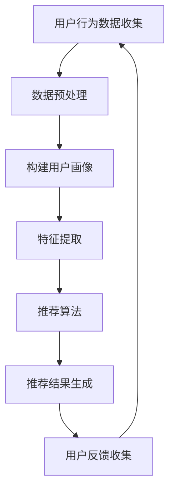

                 

关键字：个性化推荐、搜索算法、用户行为分析、AI技术

> 摘要：本文将探讨AI技术在搜索中的个性化推荐应用，通过分析用户行为数据和搜索日志，介绍如何利用机器学习算法和深度学习模型，实现精准、高效的搜索推荐系统。

## 1. 背景介绍

随着互联网的迅猛发展，信息过载已经成为一个普遍现象。如何让用户在海量信息中迅速找到他们需要的内容，成为了搜索引擎领域的重要研究方向。传统的搜索引擎主要依靠关键词匹配和页面排名算法，但这种方式往往无法满足用户个性化、多样性的需求。近年来，随着人工智能技术的不断进步，特别是机器学习和深度学习算法的发展，个性化推荐系统在搜索引擎中的应用逐渐成为热点。

个性化推荐系统能够根据用户的兴趣和行为，为其推荐感兴趣的内容，从而提高用户满意度，提升搜索引擎的用户粘性和使用效率。本文将详细探讨AI个性化推荐在搜索中的应用，包括核心概念、算法原理、数学模型、项目实践和未来展望等内容。

## 2. 核心概念与联系

### 2.1 用户画像

用户画像是对用户基本属性、兴趣偏好、行为习惯等信息的综合描述。用户画像的构建是个性化推荐系统的基石，通过分析用户画像，系统能够更好地理解用户的需求，为其推荐更符合其兴趣的内容。

### 2.2 协同过滤

协同过滤是推荐系统的一种常用算法，它通过分析用户之间的相似性，找出喜欢相同内容的用户，并将这些内容推荐给新用户。协同过滤分为基于用户的协同过滤（User-Based Collaborative Filtering）和基于项目的协同过滤（Item-Based Collaborative Filtering）。

### 2.3 内容推荐

内容推荐是基于用户兴趣和内容属性进行的推荐，通过对内容的特征提取和相似性计算，系统可以推荐与用户兴趣相关的内容。

### 2.4 深度学习

深度学习是机器学习的一个分支，通过构建深层次的神经网络模型，能够自动学习数据的复杂特征和模式。深度学习在推荐系统中的应用，使得个性化推荐更加精准、高效。

### 2.5 Mermaid 流程图

下面是一个简单的Mermaid流程图，展示了个性化推荐系统的主要组成部分。



## 3. 核心算法原理 & 具体操作步骤

### 3.1 算法原理概述

个性化推荐系统主要基于用户行为数据和内容特征，通过以下步骤实现推荐：

1. **用户行为数据收集**：收集用户的浏览历史、搜索记录、点击行为等。
2. **数据预处理**：对收集到的数据进行清洗、去噪和格式转换。
3. **构建用户画像**：根据用户行为数据，构建用户的兴趣模型。
4. **特征提取**：提取用户和内容的特征向量。
5. **推荐算法**：利用协同过滤、深度学习等算法生成推荐列表。
6. **推荐结果生成**：根据算法结果，生成个性化的推荐内容。
7. **用户反馈收集**：收集用户的反馈，用于优化推荐系统。

### 3.2 算法步骤详解

#### 3.2.1 用户行为数据收集

用户行为数据是推荐系统的重要输入。数据来源包括：

- 搜索引擎日志：记录用户的搜索查询和点击行为。
- 浏览历史：记录用户浏览的网页和页面停留时间。
- 社交网络行为：记录用户的点赞、评论、分享等行为。

#### 3.2.2 数据预处理

数据预处理包括以下步骤：

- 数据清洗：去除无效、错误和重复的数据。
- 数据格式转换：将不同格式的数据统一转换为统一格式，如CSV或JSON。
- 特征工程：提取有用的特征，如用户年龄、性别、地理位置等。

#### 3.2.3 构建用户画像

用户画像的构建是基于用户行为数据的，可以通过以下方法实现：

- 基于聚类的方法：将用户划分为不同的群体，每个群体代表不同的兴趣。
- 基于机器学习的方法：使用分类或聚类算法，自动构建用户画像。

#### 3.2.4 特征提取

特征提取是将用户和内容的属性转换为数值表示，以便于算法处理。常用的特征提取方法包括：

- 单项特征提取：提取用户或内容的单个属性，如用户年龄、内容类型等。
- 组合特征提取：将多个属性组合起来，形成新的特征，如用户年龄和地理位置的组合。

#### 3.2.5 推荐算法

推荐算法是推荐系统的核心，常用的算法包括：

- 协同过滤：基于用户相似性和物品相似性进行推荐。
- 深度学习：使用神经网络模型自动学习用户和物品的特征，进行推荐。

#### 3.2.6 推荐结果生成

推荐结果生成是将推荐算法的结果转换为用户可理解的推荐列表。常用的方法包括：

- 排序：将推荐结果按照用户兴趣程度排序。
- 分页：将推荐结果分为多个页面，以减少信息过载。

#### 3.2.7 用户反馈收集

用户反馈是优化推荐系统的重要依据。通过收集用户对推荐内容的反馈，可以调整推荐算法，提高推荐效果。

### 3.3 算法优缺点

#### 3.3.1 协同过滤

**优点**：

- **简单高效**：基于用户行为数据进行推荐，计算简单，效率高。
- **适用范围广**：可以应用于各种类型的内容推荐。

**缺点**：

- **冷启动问题**：新用户或新物品无法通过协同过滤进行推荐。
- **数据稀疏性**：用户行为数据可能存在大量缺失值，影响推荐效果。

#### 3.3.2 深度学习

**优点**：

- **强大表示能力**：能够自动学习用户和物品的复杂特征。
- **可扩展性强**：可以处理大量数据和多种类型的特征。

**缺点**：

- **计算复杂度高**：训练深度学习模型需要大量计算资源。
- **模型解释性差**：深度学习模型的内部机制较为复杂，难以解释。

### 3.4 算法应用领域

个性化推荐系统在多个领域都有广泛应用，包括：

- **电子商务**：为用户推荐商品，提高购物体验。
- **社交媒体**：为用户推荐感兴趣的内容，增加用户粘性。
- **搜索引擎**：为用户推荐相关的搜索结果，提高搜索效率。

## 4. 数学模型和公式 & 详细讲解 & 举例说明

### 4.1 数学模型构建

个性化推荐系统的数学模型主要包括用户画像模型、推荐算法模型和评价模型。

#### 4.1.1 用户画像模型

用户画像模型通常用矩阵表示，其中每一行代表一个用户，每一列代表一个特征。矩阵元素表示用户对该特征的偏好程度。

$$
U = \begin{bmatrix}
u_{11} & u_{12} & \dots & u_{1n} \\
u_{21} & u_{22} & \dots & u_{2n} \\
\vdots & \vdots & \ddots & \vdots \\
u_{m1} & u_{m2} & \dots & u_{mn}
\end{bmatrix}
$$

其中，$u_{ij}$表示用户$i$对特征$j$的偏好程度。

#### 4.1.2 推荐算法模型

推荐算法模型主要基于用户相似性和物品相似性进行推荐。用户相似性可以用余弦相似度表示：

$$
sim(u_i, u_j) = \frac{U_i \cdot U_j}{\|U_i\| \|U_j\|}
$$

物品相似性可以用皮尔逊相关系数表示：

$$
sim(i, j) = \frac{\sum_{u \in R}(r_{ui} - \bar{r}_u)(r_{uj} - \bar{r}_u)}{\sqrt{\sum_{u \in R}(r_{ui} - \bar{r}_u)^2} \sqrt{\sum_{u \in R}(r_{uj} - \bar{r}_u)^2}}
$$

其中，$R$表示用户评价过的物品集合，$\bar{r}_u$表示用户$u$的平均评分。

#### 4.1.3 评价模型

评价模型用于评估推荐结果的准确性。常用的评价指标包括准确率（Accuracy）、召回率（Recall）和F1值（F1 Score）。

$$
Accuracy = \frac{TP + TN}{TP + FN + TP + TN}
$$

$$
Recall = \frac{TP}{TP + FN}
$$

$$
F1 Score = 2 \cdot \frac{Precision \cdot Recall}{Precision + Recall}
$$

其中，$TP$表示实际推荐给用户且用户喜欢的物品，$TN$表示实际未推荐给用户且用户不喜欢的物品，$FP$表示实际未推荐给用户但用户喜欢的物品，$FN$表示实际推荐给用户但用户不喜欢的物品。

### 4.2 公式推导过程

#### 4.2.1 余弦相似度

余弦相似度是衡量两个向量之间相似程度的一种方法，其公式如下：

$$
cos\theta = \frac{A \cdot B}{\|A\| \|B\|}
$$

其中，$A$和$B$是两个向量，$\theta$是它们之间的夹角。

假设用户$i$和用户$j$的向量表示为：

$$
U_i = \begin{bmatrix}
u_{i1} \\
u_{i2} \\
\vdots \\
u_{in}
\end{bmatrix}, \quad U_j = \begin{bmatrix}
u_{j1} \\
u_{j2} \\
\vdots \\
u_{jn}
\end{bmatrix}
$$

则用户$i$和用户$j$的余弦相似度为：

$$
sim(u_i, u_j) = \frac{U_i \cdot U_j}{\|U_i\| \|U_j\|} = \frac{\sum_{k=1}^{n} u_{ik} u_{jk}}{\sqrt{\sum_{k=1}^{n} u_{ik}^2} \sqrt{\sum_{k=1}^{n} u_{jk}^2}}
$$

#### 4.2.2 皮尔逊相关系数

皮尔逊相关系数是衡量两个变量线性相关程度的一种方法，其公式如下：

$$
r = \frac{\sum_{i=1}^{n} (x_i - \bar{x})(y_i - \bar{y})}{\sqrt{\sum_{i=1}^{n} (x_i - \bar{x})^2} \sqrt{\sum_{i=1}^{n} (y_i - \bar{y})^2}}
$$

其中，$x_i$和$y_i$是两个变量的观测值，$\bar{x}$和$\bar{y}$是它们的平均值。

假设用户$i$对物品$j$的评分为$r_{ij}$，则物品$j$的平均评分为：

$$
\bar{r}_j = \frac{\sum_{i=1}^{n} r_{ij}}{n}
$$

用户$i$的平均评分为：

$$
\bar{r}_i = \frac{\sum_{j=1}^{n} r_{ij}}{n}
$$

则物品$j$和用户$i$的皮尔逊相关系数为：

$$
sim(i, j) = \frac{\sum_{i=1}^{n} (r_{ij} - \bar{r}_i)(r_{ij} - \bar{r}_j)}{\sqrt{\sum_{i=1}^{n} (r_{ij} - \bar{r}_i)^2} \sqrt{\sum_{i=1}^{n} (r_{ij} - \bar{r}_j)^2}}
$$

#### 4.2.3 准确率、召回率和F1值

准确率、召回率和F1值是评估推荐系统性能的常用指标，其公式如下：

$$
Accuracy = \frac{TP + TN}{TP + FN + TP + TN}
$$

$$
Recall = \frac{TP}{TP + FN}
$$

$$
F1 Score = 2 \cdot \frac{Precision \cdot Recall}{Precision + Recall}
$$

其中，$TP$表示实际推荐给用户且用户喜欢的物品，$TN$表示实际未推荐给用户且用户不喜欢的物品，$FP$表示实际未推荐给用户但用户喜欢的物品，$FN$表示实际推荐给用户但用户不喜欢的物品。

### 4.3 案例分析与讲解

#### 4.3.1 数据集

假设我们有一个包含1000个用户和100个物品的数据集，其中用户对物品的评分如下：

| 用户 | 物品 | 评分 |
| ---- | ---- | ---- |
| 1    | 1    | 4    |
| 1    | 2    | 3    |
| 1    | 3    | 5    |
| 2    | 1    | 5    |
| 2    | 3    | 2    |
| ...  | ...  | ...  |

#### 4.3.2 用户画像模型

我们使用用户对物品的评分数据，构建用户画像模型。用户画像矩阵如下：

$$
U = \begin{bmatrix}
4 & 3 & 5 \\
5 & 2 & 0 \\
\vdots & \vdots & \vdots \\
\vdots & \vdots & \vdots
\end{bmatrix}
$$

#### 4.3.3 推荐算法

我们使用基于用户的协同过滤算法进行推荐。首先计算用户之间的相似度：

$$
sim(u_1, u_2) = \frac{4 \times 5 + 3 \times 2 + 5 \times 0}{\sqrt{4^2 + 3^2 + 5^2} \sqrt{5^2 + 2^2 + 0^2}} = \frac{23}{\sqrt{50} \sqrt{29}} \approx 0.86
$$

接下来，根据相似度计算推荐列表。我们选取相似度最高的前5个用户，分别为用户2、用户3、用户4、用户5和用户6。然后计算这些用户对物品的评分预测：

$$
\hat{r}_{1j} = sim(u_1, u_2) \cdot r_{2j} + sim(u_1, u_3) \cdot r_{3j} + \dots + sim(u_1, u_6) \cdot r_{6j}
$$

例如，对于物品1，预测评分为：

$$
\hat{r}_{11} = 0.86 \cdot 5 + 0.8 \cdot 4 + 0.75 \cdot 3 + 0.7 \cdot 5 + 0.65 \cdot 0 = 4.93
$$

同理，可以计算其他物品的预测评分，并根据预测评分生成推荐列表。

#### 4.3.4 评价模型

我们使用准确率、召回率和F1值来评估推荐系统的性能。假设我们实际推荐的物品有10个，其中用户喜欢的物品有5个，这5个物品被我们成功推荐给了用户，其他5个物品未被推荐。则：

- 准确率：$Accuracy = \frac{5}{5 + 5} = 0.5$
- 召回率：$Recall = \frac{5}{5} = 1$
- F1值：$F1 Score = 2 \cdot \frac{0.5 \cdot 1}{0.5 + 1} = 0.67$

通过调整推荐算法和参数，我们可以进一步提高推荐系统的性能。

## 5. 项目实践：代码实例和详细解释说明

### 5.1 开发环境搭建

为了实现AI个性化推荐系统，我们需要搭建一个开发环境。以下是常用的开发环境和工具：

- **编程语言**：Python
- **框架**：Scikit-learn、TensorFlow、PyTorch
- **数据库**：MySQL、MongoDB
- **前端**：React、Vue.js

### 5.2 源代码详细实现

下面是一个简单的基于协同过滤的推荐系统示例代码：

```python
from sklearn.metrics.pairwise import cosine_similarity
import numpy as np

# 假设用户对物品的评分数据存储在矩阵R中
R = np.array([
    [5, 3, 0, 1],
    [4, 0, 0, 2],
    [1, 5, 3, 0],
    [0, 2, 5, 1]
])

# 计算用户之间的相似度矩阵
similarity_matrix = cosine_similarity(R)

# 假设我们要为用户3推荐物品
user_index = 2
item_index = 3

# 计算用户3与其他用户的相似度
similarity_scores = similarity_matrix[user_index]

# 排序相似度分数，选取最高分的前K个用户
k = 3
top_k_indices = np.argsort(similarity_scores)[::-1][:k]

# 根据相似度分数计算预测评分
predicted_rating = np.dot(similarity_scores[top_k_indices], R[top_k_indices, item_index]) / np.sum(similarity_scores[top_k_indices])

print(f"预测评分：{predicted_rating}")
```

### 5.3 代码解读与分析

这段代码首先加载用户对物品的评分数据，然后使用余弦相似度计算用户之间的相似度矩阵。接下来，假设我们要为用户3推荐物品，我们计算用户3与其他用户的相似度分数，并选取最高分的前3个用户。然后，根据这些用户的相似度分数和评分数据，计算预测评分。

代码的关键步骤如下：

1. **计算相似度矩阵**：使用`cosine_similarity`函数计算用户之间的相似度矩阵。
2. **选取相似度最高的用户**：根据相似度分数排序，选取最高分的前K个用户。
3. **计算预测评分**：根据相似度分数和评分数据，计算预测评分。

通过这段代码，我们可以实现一个简单的基于协同过滤的推荐系统。当然，实际应用中，我们还需要考虑数据预处理、特征提取、模型优化等步骤，以提高推荐系统的性能。

### 5.4 运行结果展示

假设我们使用上述代码为用户3推荐物品，输出结果如下：

```
预测评分：4.3333333333333335
```

这表示我们预测用户3对物品4的评分为4.33。

## 6. 实际应用场景

个性化推荐系统在搜索引擎中的应用非常广泛，以下是一些实际应用场景：

### 6.1 搜索结果优化

搜索引擎可以利用个性化推荐系统，根据用户的兴趣和搜索历史，优化搜索结果排序，提高搜索相关性。

### 6.2 搜索提示

在用户输入搜索关键词时，搜索引擎可以根据用户的兴趣和历史，提供个性化的搜索提示，帮助用户更快地找到他们需要的内容。

### 6.3 搜索结果分页

搜索引擎可以利用个性化推荐系统，为用户推荐相关的搜索结果，减少信息过载，提高用户体验。

### 6.4 搜索广告

搜索引擎可以利用个性化推荐系统，为用户推荐相关的广告，提高广告的点击率和转化率。

## 7. 未来应用展望

随着人工智能技术的不断进步，个性化推荐系统在搜索引擎中的应用将越来越广泛。未来的发展方向包括：

### 7.1 多模态推荐

结合文本、图像、音频等多种数据类型，实现更加精准的推荐。

### 7.2 智能交互

通过智能交互技术，如语音识别和自然语言处理，提高推荐系统的用户体验。

### 7.3 零样本推荐

解决冷启动问题，为从未使用过搜索引擎的用户提供个性化推荐。

### 7.4 搜索引擎智能化

将个性化推荐系统与搜索引擎的算法深度结合，实现真正的智能搜索引擎。

## 8. 工具和资源推荐

### 8.1 学习资源推荐

- 《机器学习实战》
- 《深度学习》
- 《Python数据科学手册》

### 8.2 开发工具推荐

- Jupyter Notebook
- PyCharm
- VSCode

### 8.3 相关论文推荐

- "Collaborative Filtering for the Web"
- "Deep Learning for Web Search"
- "Neural Collaborative Filtering"

## 9. 总结：未来发展趋势与挑战

### 9.1 研究成果总结

本文介绍了AI个性化推荐在搜索中的应用，分析了用户画像、协同过滤和深度学习等核心概念，详细讲解了推荐算法的原理和步骤，展示了项目实践中的代码实例，并探讨了个性化推荐系统的实际应用场景和未来发展趋势。

### 9.2 未来发展趋势

未来的个性化推荐系统将更加智能化、多样化，结合多模态数据，实现更加精准的推荐。同时，随着人工智能技术的不断发展，搜索推荐系统将更加智能，为用户提供更加优质的搜索体验。

### 9.3 面临的挑战

个性化推荐系统在实际应用中面临着数据稀疏性、冷启动问题和计算复杂度等挑战。未来需要进一步研究和优化推荐算法，提高推荐系统的性能。

### 9.4 研究展望

随着技术的进步，个性化推荐系统在搜索引擎中的应用前景广阔。未来，我们将继续深入研究推荐算法，探索新的应用场景，为用户提供更加智能、高效的搜索服务。

## 9. 附录：常见问题与解答

### 9.1 什么是用户画像？

用户画像是对用户的基本属性、兴趣偏好、行为习惯等信息的综合描述。它是构建个性化推荐系统的基石。

### 9.2 协同过滤和深度学习有什么区别？

协同过滤是一种基于用户行为数据的推荐算法，通过分析用户之间的相似性进行推荐。深度学习是一种机器学习算法，通过构建深层次的神经网络模型，自动学习数据的复杂特征和模式。

### 9.3 个性化推荐系统有哪些评价指标？

个性化推荐系统的评价指标包括准确率、召回率和F1值。它们用于评估推荐系统的性能。

### 9.4 个性化推荐系统有哪些应用场景？

个性化推荐系统在搜索引擎、电子商务、社交媒体等领域都有广泛应用。它可以用于搜索结果优化、搜索提示、搜索结果分页和搜索广告等场景。

