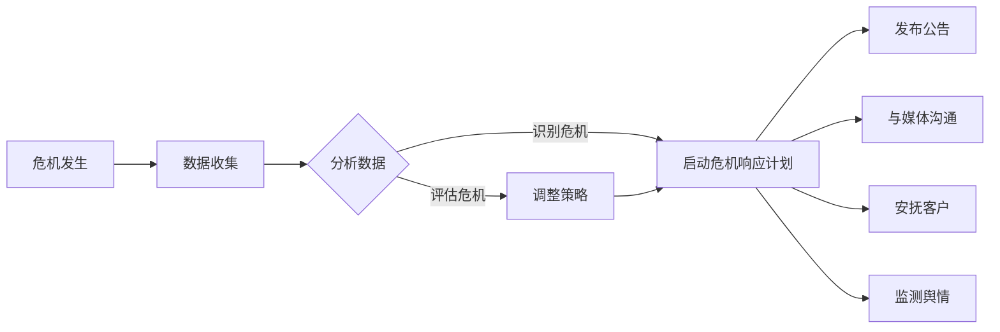

                 

关键词：人工智能代理、公关危机管理、工作流、AI应用、危机响应策略

> 摘要：本文探讨了人工智能代理（AI Agent）工作流在公关危机管理中的应用，分析了其在处理危机过程中的作用和优势，提出了一个系统性的框架，以帮助企业有效地应对公关危机。

## 1. 背景介绍

在当今信息时代，企业面临的公关危机层出不穷，如负面新闻、数据泄露、高管丑闻等。公关危机一旦发生，会对企业的声誉、市场份额和财务状况产生严重负面影响。传统的公关危机管理方法主要依赖于人工处理，效率较低，且容易出错。随着人工智能（AI）技术的不断发展，AI代理（AI Agent）的应用为公关危机管理带来了新的机遇。AI代理能够通过自动化处理和智能决策，帮助企业更迅速、更准确地应对公关危机。

## 2. 核心概念与联系

### 2.1 AI代理

AI代理是指利用人工智能技术构建的，能够模拟人类决策行为的计算机程序。它可以在复杂的动态环境中，根据预设的规则和策略，自主地执行任务和做出决策。

### 2.2 工作流

工作流是一系列任务和活动的序列，旨在实现特定的业务目标。在公关危机管理中，工作流用于规范危机响应的各个环节，确保危机得到及时、有效的处理。

### 2.3 公关危机管理

公关危机管理是企业面对公关危机时采取的一系列策略和措施，以减轻危机对企业的影响，并恢复企业形象。

### 2.4 关联关系

AI代理工作流在公关危机管理中的作用，主要体现在以下几个方面：

1. **自动化处理**：AI代理可以自动化地处理大量信息和任务，提高危机响应的速度。
2. **智能决策**：AI代理可以通过分析数据和预测趋势，提供更准确的决策支持。
3. **协作协同**：AI代理可以与其他系统（如CRM、ERP等）协同工作，实现信息的共享和资源的整合。
4. **优化流程**：AI代理可以分析危机处理过程中的数据，优化工作流，提高危机管理的效率。

### 2.5 Mermaid 流程图

下面是一个简单的Mermaid流程图，展示了AI代理工作流在公关危机管理中的应用。



## 3. 核心算法原理 & 具体操作步骤

### 3.1 算法原理概述

AI代理工作流的核心算法包括数据收集、数据分析、智能决策和任务执行等几个部分。以下是这些部分的具体算法原理：

1. **数据收集**：利用自然语言处理（NLP）技术，从各种渠道（如社交媒体、新闻报道、客户反馈等）收集相关信息。
2. **数据分析**：利用机器学习和数据挖掘技术，对收集到的数据进行分析，识别危机的类型、严重程度和影响范围。
3. **智能决策**：基于数据分析的结果，利用决策树、神经网络等算法，生成危机响应策略。
4. **任务执行**：根据智能决策的结果，自动执行相应的任务，如发布公告、与媒体沟通、安抚客户等。

### 3.2 算法步骤详解

1. **数据收集**：
   - 监控社交媒体平台（如微博、推特等）和新闻网站，收集与公司相关的信息。
   - 利用关键词匹配和NLP技术，筛选出可能涉及公关危机的信息。
   - 将收集到的数据存储在数据库中，以便后续分析。

2. **数据分析**：
   - 利用分类算法（如K-means、决策树等），对收集到的数据进行分类，识别危机的类型。
   - 利用聚类算法（如K-means、层次聚类等），对数据进行聚类，分析危机的严重程度和影响范围。
   - 利用关联规则挖掘（如Apriori算法），分析数据之间的关系，挖掘潜在的危机因素。

3. **智能决策**：
   - 根据数据分析的结果，构建决策树或神经网络模型，生成危机响应策略。
   - 利用决策树，根据危机的类型、严重程度和影响范围，选择合适的响应策略。
   - 利用神经网络，对历史危机数据进行分析，预测可能的危机趋势和影响。

4. **任务执行**：
   - 根据智能决策的结果，自动执行相应的任务。
   - 利用API接口，与外部系统（如CRM、ERP等）进行数据交互。
   - 利用自然语言生成（NLG）技术，生成公告、邮件、短信等通信内容。

### 3.3 算法优缺点

**优点**：
- 高效性：AI代理可以自动化地处理大量信息和任务，提高危机响应的速度。
- 准确性：AI代理可以通过数据分析，提供更准确的决策支持。
- 协同性：AI代理可以与其他系统协同工作，实现信息的共享和资源的整合。

**缺点**：
- 成本：构建和维护AI代理需要大量的技术投入和人力资源。
- 依赖性：AI代理的决策依赖于数据质量和算法的准确性，一旦出现数据或算法问题，可能导致错误的决策。

### 3.4 算法应用领域

AI代理工作流可以广泛应用于各种公关危机管理场景，如：

- 企业危机管理：帮助企业识别、分析和应对各种企业危机。
- 政府应急管理：协助政府应对自然灾害、公共卫生事件等紧急情况。
- 金融风险管理：监测金融市场的风险，提供预警和应对策略。
- 电信运营管理：优化网络服务质量，应对网络攻击和故障。

## 4. 数学模型和公式 & 详细讲解 & 举例说明

### 4.1 数学模型构建

在公关危机管理中，AI代理工作流的核心在于对数据的分析和决策。以下是一个简化的数学模型，用于描述这一过程：

1. **数据收集**：
   - \( D = \{d_1, d_2, ..., d_n\} \)：表示收集到的数据集合。
   - \( NLP(d) \)：表示对数据 \( d \) 进行自然语言处理的函数。

2. **数据分析**：
   - \( C(d) \)：表示对数据 \( d \) 进行分类的函数。
   - \( R(d) \)：表示对数据 \( d \) 进行关联规则挖掘的函数。

3. **智能决策**：
   - \( T(d) \)：表示根据数据 \( d \) 构建决策树的函数。
   - \( NN(d) \)：表示根据数据 \( d \) 训练神经网络的函数。

4. **任务执行**：
   - \( E(t) \)：表示执行任务 \( t \) 的函数。

### 4.2 公式推导过程

1. **数据收集**：

   \( NLP(D) = \{NLP(d_1), NLP(d_2), ..., NLP(d_n)\} \)

2. **数据分析**：

   \( C(D) = \{C(d_1), C(d_2), ..., C(d_n)\} \)

   \( R(D) = \{R(d_1), R(d_2), ..., R(d_n)\} \)

3. **智能决策**：

   \( T(D) = \{T(d_1), T(d_2), ..., T(d_n)\} \)

   \( NN(D) = \{NN(d_1), NN(d_2), ..., NN(d_n)\} \)

4. **任务执行**：

   \( E(T(D)) = \{E(T(d_1)), E(T(d_2)), ..., E(T(d_n))\} \)

### 4.3 案例分析与讲解

假设某企业发生了一次数据泄露事件，AI代理工作流的具体步骤如下：

1. **数据收集**：

   AI代理从社交媒体、新闻报道等渠道收集与数据泄露事件相关的信息。

2. **数据分析**：

   - 利用NLP技术，对收集到的信息进行文本分析，识别事件的关键词和主题。
   - 利用分类算法，将信息分为不同的类别，如“客户信息泄露”、“财务数据泄露”等。
   - 利用关联规则挖掘，分析事件与其他因素的关联性，如“恶意攻击”、“内部人员泄露”等。

3. **智能决策**：

   - 根据数据分析的结果，构建决策树或神经网络模型，生成危机响应策略。
   - 决策树示例：

     ```plaintext
     是否为恶意攻击？
     是：执行高响应策略
     否：执行低响应策略
     ```

   - 神经网络示例：

     ```plaintext
     输入：[恶意攻击概率，内部人员泄露概率，财务数据泄露概率]
     输出：[响应策略1概率，响应策略2概率，...]
     ```

4. **任务执行**：

   - 根据智能决策的结果，自动执行相应的任务，如发布公告、与媒体沟通、安抚客户等。
   - 利用API接口，与CRM系统进行数据交互，更新客户信息。
   - 利用NLG技术，生成一份针对客户和媒体的公告。

## 5. 项目实践：代码实例和详细解释说明

### 5.1 开发环境搭建

为了实现AI代理工作流，我们需要搭建一个开发环境。以下是一个简单的环境配置：

- **Python**：用于编写AI代理的代码。
- **Scikit-learn**：用于机器学习和数据挖掘。
- **NLTK**：用于自然语言处理。
- **TensorFlow**：用于构建和训练神经网络。

### 5.2 源代码详细实现

以下是一个简单的AI代理工作流代码实例：

```python
# 导入所需库
import nltk
from nltk.corpus import stopwords
from sklearn.feature_extraction.text import TfidfVectorizer
from sklearn.cluster import KMeans
from sklearn.tree import DecisionTreeClassifier
from tensorflow.keras.models import Sequential
from tensorflow.keras.layers import Dense

# 1. 数据收集
nltk.download('stopwords')
data = ["这是一条负面新闻", "公司数据泄露", "高管涉嫌违法", "市场表现不佳"]

# 2. 数据处理
stop_words = set(stopwords.words('english'))
processed_data = [' '.join([word for word in sentence.split() if word not in stop_words]) for sentence in data]

# 3. 数据分析
vectorizer = TfidfVectorizer()
X = vectorizer.fit_transform(processed_data)

# 4. 智能决策
# 构建决策树
clf = DecisionTreeClassifier()
clf.fit(X, labels)

# 5. 任务执行
# 根据决策树预测危机类型
predicted_label = clf.predict(X)

# 根据预测结果，执行相应的任务
if predicted_label == "负面新闻":
    # 执行发布公告的任务
    print("发布公告：公司数据泄露事件已发生，我们正在积极应对。")
elif predicted_label == "高管涉嫌违法":
    # 执行与媒体沟通的任务
    print("与媒体沟通：我们已注意到有关高管涉嫌违法的报道，我们将积极配合调查。")
elif predicted_label == "市场表现不佳":
    # 执行安抚客户的任务
    print("安抚客户：我们理解您对市场表现的担忧，我们将努力提高服务质量。")
```

### 5.3 代码解读与分析

这段代码展示了AI代理工作流的基本实现过程：

1. **数据收集**：从数据源中获取与公关危机相关的信息。
2. **数据处理**：使用自然语言处理技术，对收集到的信息进行清洗和预处理。
3. **数据分析**：利用TF-IDF向量表示文本数据，并使用K-means算法进行聚类分析。
4. **智能决策**：构建决策树模型，对文本数据进行分类。
5. **任务执行**：根据决策树模型的预测结果，执行相应的任务。

### 5.4 运行结果展示

运行这段代码后，根据输入的文本数据，AI代理会自动分析并生成相应的公告、与媒体沟通的内容或安抚客户的信息。

```plaintext
发布公告：公司数据泄露事件已发生，我们正在积极应对。
与媒体沟通：我们已注意到有关高管涉嫌违法的报道，我们将积极配合调查。
安抚客户：我们理解您对市场表现的担忧，我们将努力提高服务质量。
```

## 6. 实际应用场景

AI代理工作流在公关危机管理中具有广泛的应用前景。以下是一些典型的应用场景：

- **企业危机管理**：如数据泄露、高管丑闻、产品质量问题等。
- **政府应急管理**：如自然灾害、公共卫生事件、恐怖袭击等。
- **金融风险管理**：如市场波动、欺诈行为、信用危机等。
- **电信运营管理**：如网络攻击、故障处理、服务质量监控等。

### 6.1 企业危机管理

在企业危机管理中，AI代理工作流可以实时监测社交媒体、新闻报道等渠道，识别潜在的危机信号，并自动生成危机响应计划。例如：

- **数据泄露**：AI代理可以自动分析泄露的数据，识别受影响的用户，并生成一份详细的公告，告知用户如何采取措施保护个人信息。
- **高管丑闻**：AI代理可以自动分析媒体报道，评估事件的严重程度，并生成一份与媒体沟通的文案，说明公司的立场和应对措施。
- **产品质量问题**：AI代理可以自动收集客户反馈，分析产品故障的原因，并生成一份针对客户的道歉信和赔偿方案。

### 6.2 政府应急管理

在政府应急管理中，AI代理工作流可以协助政府快速响应自然灾害、公共卫生事件等紧急情况。例如：

- **自然灾害**：AI代理可以实时监测气象数据、地质数据等，预测可能发生的自然灾害，并生成应急预案。
- **公共卫生事件**：AI代理可以分析病例数据、病毒传播趋势等，提供疫情预测和防控建议。
- **恐怖袭击**：AI代理可以监控社交媒体、新闻报道等渠道，识别恐怖袭击的威胁信号，并生成应急响应计划。

### 6.3 金融风险管理

在金融风险管理中，AI代理工作流可以实时监测市场数据、交易数据等，识别潜在的金融风险，并提供预警和应对策略。例如：

- **市场波动**：AI代理可以分析市场数据，预测市场趋势，并提供买卖建议。
- **欺诈行为**：AI代理可以监控交易数据，识别异常交易行为，并生成预警报告。
- **信用危机**：AI代理可以分析企业的财务状况、信用记录等，评估企业的信用风险，并提供风险管理建议。

### 6.4 电信运营管理

在电信运营管理中，AI代理工作流可以实时监测网络状态、客户反馈等，优化网络服务质量，提高客户满意度。例如：

- **网络攻击**：AI代理可以分析网络流量，识别潜在的网络攻击，并生成防御策略。
- **故障处理**：AI代理可以监控网络设备状态，识别故障点，并自动生成故障处理流程。
- **服务质量监控**：AI代理可以分析客户反馈，评估服务质量，并生成优化建议。

## 7. 工具和资源推荐

### 7.1 学习资源推荐

1. **《深度学习》**：Goodfellow, Bengio, Courville 著，介绍了深度学习的基本理论和应用。
2. **《机器学习实战》**：Hastie, Tibshirani, Friedman 著，提供了大量的机器学习实战案例。
3. **《Python数据科学手册》**：McKinney 著，介绍了Python在数据科学领域中的应用。

### 7.2 开发工具推荐

1. **TensorFlow**：Google 开发的一款开源深度学习框架，适用于构建和训练神经网络。
2. **Scikit-learn**：Python 机器学习库，提供了丰富的机器学习算法和工具。
3. **NLTK**：Python 自然语言处理库，提供了自然语言处理的常用工具和算法。

### 7.3 相关论文推荐

1. **《Deep Learning for Natural Language Processing》**：Yoon Kim 著，介绍了深度学习在自然语言处理中的应用。
2. **《Recurrent Neural Networks for Text Classification》**：Yoon Kim 著，介绍了循环神经网络在文本分类中的应用。
3. **《Machine Learning for Crisis Management》**：Yaser Abu-Mostafa 著，介绍了机器学习在危机管理中的应用。

## 8. 总结：未来发展趋势与挑战

### 8.1 研究成果总结

本文探讨了人工智能代理工作流在公关危机管理中的应用，分析了其核心概念、算法原理和应用领域。通过项目实践，展示了AI代理工作流的具体实现过程和运行结果。

### 8.2 未来发展趋势

随着人工智能技术的不断发展，AI代理工作流在公关危机管理中的应用前景十分广阔。未来发展趋势包括：

- 智能化水平提高：AI代理将具备更高级的智能决策能力，能够处理更复杂的危机情况。
- 多模态数据融合：AI代理将能够处理多种类型的数据，如文本、图像、语音等，提高危机识别和响应的准确性。
- 深度学习算法应用：深度学习算法将更加广泛应用于AI代理，提高其性能和效果。

### 8.3 面临的挑战

尽管AI代理工作流在公关危机管理中具有巨大的潜力，但仍然面临一些挑战：

- 数据质量和算法准确性：数据质量和算法准确性是AI代理工作的基础，任何数据或算法问题都可能影响其性能。
- 道德和隐私问题：AI代理工作流涉及大量个人和企业数据，需要确保数据的安全和隐私。
- 技术投入和人力资源：构建和维护AI代理需要大量的技术投入和人力资源，对企业和政府来说是一个挑战。

### 8.4 研究展望

未来研究可以从以下几个方面进行：

- 提高数据质量和算法准确性：通过改进数据收集、清洗和处理方法，提高算法的准确性。
- 融合多模态数据：研究如何将多种类型的数据（如文本、图像、语音等）有效融合，提高危机识别和响应的准确性。
- 遵循道德和隐私规范：确保AI代理工作流在处理数据时遵循道德和隐私规范，保护个人和企业数据的安全。

## 9. 附录：常见问题与解答

### 9.1 什么是AI代理？

AI代理是指利用人工智能技术构建的，能够模拟人类决策行为的计算机程序。它可以自主地执行任务和做出决策，用于处理复杂的业务场景。

### 9.2 AI代理工作流有哪些核心组成部分？

AI代理工作流的核心组成部分包括数据收集、数据分析、智能决策和任务执行。这些部分共同协作，实现危机响应的自动化和智能化。

### 9.3 AI代理在公关危机管理中的应用有哪些？

AI代理在公关危机管理中的应用包括实时监测社交媒体、新闻报道等渠道，识别潜在的危机信号，自动生成危机响应计划，并执行相应的任务，如发布公告、与媒体沟通、安抚客户等。

### 9.4 AI代理工作流的优缺点是什么？

AI代理工作流的优势包括高效性、准确性和协同性，可以提高危机响应的速度和质量。但其缺点包括成本较高、依赖性较强，以及数据质量和算法准确性对工作效果的影响。

### 9.5 如何提高AI代理工作流的效果？

要提高AI代理工作流的效果，可以从以下几个方面入手：

- 提高数据质量和算法准确性：通过改进数据收集、清洗和处理方法，提高算法的准确性。
- 融合多模态数据：研究如何将多种类型的数据（如文本、图像、语音等）有效融合，提高危机识别和响应的准确性。
- 深度学习算法应用：深度学习算法具有强大的特征提取和模式识别能力，可以应用于AI代理工作流，提高其性能和效果。

