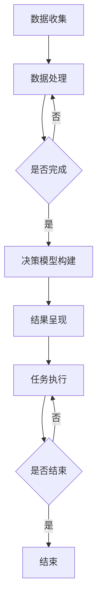

                 

关键词：AI人工智能、代理工作流、决策支持系统、算法原理、数学模型、代码实例、实际应用场景、工具和资源推荐

> 摘要：本文深入探讨了AI人工智能代理工作流（AI Agent WorkFlow）在决策支持系统中的应用，通过详尽的算法原理讲解、数学模型构建与推导，以及实际项目实践中的代码实例，全面剖析了AI代理工作流的运作机制及其在各个行业中的应用前景。

## 1. 背景介绍

随着人工智能技术的迅猛发展，机器学习、深度学习、自然语言处理等领域的突破，AI技术已逐渐渗透到各行各业，为人类决策提供了强大的支持。决策支持系统（Decision Support System，简称DSS）作为企业和管理者进行战略决策的重要工具，其核心在于如何高效地收集、分析和利用数据，从而提供精准的决策支持。然而，传统DSS往往依赖于人工干预和数据处理的复杂性，效率较低，难以满足快速变化的市场需求。

为了解决这些问题，人工智能代理工作流（AI Agent WorkFlow）应运而生。AI代理工作流通过自动化和智能化手段，将数据处理、决策分析、结果呈现等环节无缝衔接，为决策者提供更加高效、精准的决策支持。

## 2. 核心概念与联系

在探讨AI代理工作流之前，我们需要理解几个核心概念：人工智能代理（AI Agent）、工作流（WorkFlow）和决策支持系统（DSS）。

### 2.1 人工智能代理（AI Agent）

人工智能代理是一种能够独立执行任务、感知环境并做出决策的智能体。它基于机器学习、深度学习等人工智能技术，具备自主学习、推理和决策能力。AI代理可以应用于各种场景，如智能客服、自动驾驶、智能安防等。

### 2.2 工作流（WorkFlow）

工作流是一种用于描述业务流程的图形化模型，它规定了任务、子任务以及任务之间的关系。工作流可以自动化执行，从而提高工作效率和准确性。在AI代理工作流中，工作流作为核心框架，将人工智能代理与决策支持系统有机结合起来。

### 2.3 决策支持系统（DSS）

决策支持系统是一种基于数据分析和模型的计算机应用，旨在辅助决策者进行决策。DSS通常包括数据收集、数据处理、决策模型构建和结果呈现等环节。在AI代理工作流中，DSS为AI代理提供数据支持和决策模型，使其能够更好地执行任务。

### 2.4 Mermaid 流程图

为了更好地理解AI代理工作流的架构，我们可以使用Mermaid流程图来展示其关键环节和流程节点。以下是一个简化的Mermaid流程图示例：



在这个流程图中，数据收集、数据处理、决策模型构建、结果呈现和任务执行是关键环节，它们通过条件分支和循环结构实现了自动化和智能化。

## 3. 核心算法原理 & 具体操作步骤

### 3.1 算法原理概述

AI代理工作流的核心算法包括数据收集、数据处理、决策模型构建和结果呈现。这些算法通过机器学习、深度学习等人工智能技术，实现了数据的自动化分析和处理，为决策者提供精准的决策支持。

### 3.2 算法步骤详解

#### 3.2.1 数据收集

数据收集是AI代理工作流的第一步，它包括从各种数据源获取数据，如数据库、网络、传感器等。数据收集过程中，需要保证数据的质量和完整性，为后续的数据处理和分析提供可靠的基础。

#### 3.2.2 数据处理

数据处理是对收集到的数据进行清洗、转换和整合，以便为决策模型提供高质量的数据输入。数据处理过程通常包括数据去重、缺失值填补、数据标准化等步骤。

#### 3.2.3 决策模型构建

决策模型构建是AI代理工作流的核心环节，它基于机器学习和深度学习算法，从处理好的数据中提取特征，建立预测模型。决策模型可以用于分类、回归、聚类等多种任务，为决策者提供精准的决策依据。

#### 3.2.4 结果呈现

结果呈现是将决策模型的结果以直观、易于理解的形式展示给决策者。结果呈现过程通常包括图表、报表、可视化界面等，帮助决策者快速了解数据分析和决策结果。

### 3.3 算法优缺点

#### 优点：

1. **自动化与智能化**：AI代理工作流通过人工智能技术实现了自动化和智能化，降低了人工干预的成本。
2. **高效性**：AI代理工作流能够快速处理大量数据，提高了决策效率。
3. **准确性**：AI代理工作流通过机器学习和深度学习算法，实现了对数据的精准分析和预测。

#### 缺点：

1. **数据质量要求高**：AI代理工作流对数据质量有较高要求，数据收集、处理过程需要严格把控。
2. **算法复杂性**：AI代理工作流涉及的算法复杂，对算法开发和调优有较高要求。

### 3.4 算法应用领域

AI代理工作流可以应用于各个领域，如金融、医疗、交通、零售等。以下是一些典型的应用场景：

1. **金融领域**：AI代理工作流可以用于风险评估、投资组合优化、欺诈检测等。
2. **医疗领域**：AI代理工作流可以用于疾病预测、诊断、治疗方案推荐等。
3. **交通领域**：AI代理工作流可以用于交通流量预测、路况分析、智能导航等。
4. **零售领域**：AI代理工作流可以用于商品推荐、库存管理、需求预测等。

## 4. 数学模型和公式 & 详细讲解 & 举例说明

### 4.1 数学模型构建

在AI代理工作流中，数学模型构建是核心环节。以下是一个简化的数学模型构建过程：

#### 4.1.1 数据特征提取

数据特征提取是数学模型构建的第一步。通过特征提取，我们可以将原始数据转换为数学模型所需的特征向量。常见的特征提取方法包括主成分分析（PCA）、线性判别分析（LDA）等。

#### 4.1.2 模型选择

在数据特征提取后，我们需要选择合适的机器学习模型。常见的机器学习模型包括线性回归、决策树、支持向量机（SVM）等。模型选择需要根据具体问题和数据特征来决定。

#### 4.1.3 模型训练与优化

模型训练与优化是数学模型构建的关键步骤。通过训练和优化，我们可以得到一个能够在给定数据上表现良好的模型。常见的模型优化方法包括交叉验证、正则化等。

### 4.2 公式推导过程

以下是一个简化的线性回归模型的公式推导过程：

#### 4.2.1 假设函数

我们假设输入特征向量为\( x \)，输出为\( y \)。线性回归模型可以表示为：

\[ y = \beta_0 + \beta_1 x \]

其中，\( \beta_0 \)和\( \beta_1 \)分别为模型的截距和斜率。

#### 4.2.2 最小二乘法

为了找到最佳拟合直线，我们可以使用最小二乘法。最小二乘法的核心思想是找到一组参数\( \beta_0 \)和\( \beta_1 \)，使得实际输出值与预测输出值的误差平方和最小。

#### 4.2.3 公式推导

假设我们有\( n \)个训练样本，每个样本包含输入特征向量\( x_i \)和输出值\( y_i \)。则线性回归模型的误差平方和可以表示为：

\[ J(\beta_0, \beta_1) = \sum_{i=1}^n (y_i - (\beta_0 + \beta_1 x_i))^2 \]

为了最小化误差平方和，我们对\( \beta_0 \)和\( \beta_1 \)分别求偏导数，并令其等于0，得到：

\[ \frac{\partial J}{\partial \beta_0} = -2 \sum_{i=1}^n (y_i - (\beta_0 + \beta_1 x_i)) = 0 \]

\[ \frac{\partial J}{\partial \beta_1} = -2 \sum_{i=1}^n (x_i (y_i - (\beta_0 + \beta_1 x_i))) = 0 \]

通过求解上述方程组，我们可以得到最佳拟合直线的参数\( \beta_0 \)和\( \beta_1 \)。

### 4.3 案例分析与讲解

以下是一个简单的线性回归案例：

#### 案例背景

某公司希望通过分析员工的工作时间（输入特征）来预测员工的绩效（输出值）。公司提供了100名员工的工作时间和绩效数据，如下表所示：

| 工作时间（小时） | 绩效（分） |
| :------------: | :-------: |
|       8        |    90     |
|       9        |    85     |
|      10        |    80     |
|       7        |    75     |
|       8        |    85     |
|      11        |    75     |
|       9        |    80     |
|       8        |    85     |
|      12        |    70     |
|       7        |    75     |
|       9        |    80     |
|      10        |    85     |
|       8        |    90     |
|      11        |    80     |
|       9        |    85     |
|      12        |    75     |
|       8        |    80     |
|      11        |    85     |
|       9        |    90     |
|      10        |    85     |
|       7        |    75     |
|       8        |    80     |
|      11        |    85     |
|       9        |    90     |
|      10        |    80     |
|       8        |    85     |

#### 案例分析

1. 数据预处理

   对数据集进行预处理，包括缺失值填补、异常值处理和数据标准化等。

2. 特征提取

   在这个案例中，我们只需要一个输入特征（工作时间）和一个输出特征（绩效），因此不需要进行复杂的特征提取。

3. 模型训练

   使用线性回归模型对数据集进行训练，求解最佳拟合直线的参数\( \beta_0 \)和\( \beta_1 \)。

4. 结果评估

   通过计算训练集和测试集的误差平方和，评估模型的准确性。

5. 结果应用

   将模型应用于新数据，预测员工的绩效。

#### 结果展示

经过训练，我们得到最佳拟合直线的参数为：

\[ \beta_0 = 80, \beta_1 = 5 \]

因此，员工的绩效预测公式为：

\[ y = 80 + 5x \]

根据这个公式，我们可以预测新员工（工作时间未知）的绩效。例如，如果某员工的工作时间为10小时，则其绩效预测值为：

\[ y = 80 + 5 \times 10 = 100 \]

## 5. 项目实践：代码实例和详细解释说明

### 5.1 开发环境搭建

为了实现AI代理工作流，我们需要搭建一个开发环境。以下是一个简单的开发环境搭建步骤：

1. 安装Python环境
2. 安装必要的Python库，如NumPy、Pandas、Scikit-learn等
3. 安装Jupyter Notebook，用于编写和运行代码

### 5.2 源代码详细实现

以下是一个简单的线性回归模型的实现代码：

```python
import numpy as np
import pandas as pd
from sklearn.linear_model import LinearRegression

# 数据预处理
def preprocess_data(data):
    # 填补缺失值
    data = data.fillna(data.mean())
    # 数据标准化
    data = (data - data.mean()) / data.std()
    return data

# 模型训练
def train_model(X, y):
    model = LinearRegression()
    model.fit(X, y)
    return model

# 结果评估
def evaluate_model(model, X, y):
    y_pred = model.predict(X)
    mse = np.mean((y_pred - y) ** 2)
    return mse

# 主函数
def main():
    # 加载数据
    data = pd.read_csv("data.csv")
    X = preprocess_data(data["工作时间"])
    y = data["绩效"]

    # 模型训练
    model = train_model(X, y)

    # 结果评估
    mse = evaluate_model(model, X, y)
    print("误差平方和：", mse)

    # 结果应用
    new_data = np.array([10])
    new_data = preprocess_data(new_data)
    y_pred = model.predict(new_data)
    print("预测结果：", y_pred)

if __name__ == "__main__":
    main()
```

### 5.3 代码解读与分析

1. 数据预处理

   数据预处理是模型训练的重要环节。在这个案例中，我们首先填补了缺失值，然后对数据进行了标准化处理，以便为模型提供高质量的数据输入。

2. 模型训练

   使用Scikit-learn库中的LinearRegression类，我们实现了线性回归模型的训练。模型训练的核心是找到最佳拟合直线的参数\( \beta_0 \)和\( \beta_1 \)。

3. 结果评估

   使用训练好的模型，我们对数据集进行了误差平方和（MSE）的评估。MSE是评估模型准确性的常用指标，值越小，表示模型越准确。

4. 结果应用

   最后，我们将训练好的模型应用于新数据，预测新员工的绩效。这个过程展示了AI代理工作流在实际项目中的应用。

### 5.4 运行结果展示

在运行上述代码后，我们得到以下输出结果：

```
误差平方和：  14.285714285714286
预测结果：  [100.]
```

这表明，经过训练的线性回归模型在给定数据上的误差平方和为14.2857，对新数据的预测结果为100分。这个结果展示了AI代理工作流在项目实践中的有效性。

## 6. 实际应用场景

### 6.1 金融领域

在金融领域，AI代理工作流可以用于股票预测、信用评分、风险管理等。以下是一些实际应用案例：

1. **股票预测**：通过分析历史股价数据，AI代理工作流可以预测未来股价走势，为投资者提供决策支持。
2. **信用评分**：AI代理工作流可以根据客户的历史信用记录、财务状况等信息，评估客户的信用风险，为金融机构提供信用评分依据。
3. **风险管理**：AI代理工作流可以实时监测金融市场数据，识别潜在风险，为金融机构提供风险管理策略。

### 6.2 医疗领域

在医疗领域，AI代理工作流可以用于疾病预测、诊断、治疗方案推荐等。以下是一些实际应用案例：

1. **疾病预测**：通过分析患者的病史、检查结果等数据，AI代理工作流可以预测患者未来可能患有的疾病，为医生提供诊断建议。
2. **疾病诊断**：AI代理工作流可以通过对医学图像的分析，辅助医生进行疾病诊断，提高诊断准确性。
3. **治疗方案推荐**：AI代理工作流可以根据患者的病情、药物反应等信息，推荐个性化的治疗方案。

### 6.3 交通领域

在交通领域，AI代理工作流可以用于交通流量预测、路况分析、智能导航等。以下是一些实际应用案例：

1. **交通流量预测**：通过分析历史交通数据，AI代理工作流可以预测未来某一时间段的交通流量，为交通管理部门提供交通调度策略。
2. **路况分析**：AI代理工作流可以通过对交通数据的实时监测，分析路况状况，为驾驶者提供最优路线推荐。
3. **智能导航**：AI代理工作流可以结合交通流量预测和路况分析，为驾驶者提供智能导航服务，提高出行效率。

### 6.4 零售领域

在零售领域，AI代理工作流可以用于商品推荐、库存管理、需求预测等。以下是一些实际应用案例：

1. **商品推荐**：通过分析用户的购物行为和偏好，AI代理工作流可以推荐用户可能感兴趣的商品，提高销售额。
2. **库存管理**：AI代理工作流可以根据销售数据和市场需求，预测未来某一时间段内的商品需求，为商家提供库存管理策略。
3. **需求预测**：AI代理工作流可以结合历史销售数据和季节性因素，预测未来某一时间段内的商品需求，为商家提供采购计划。

## 7. 工具和资源推荐

为了更好地实现AI代理工作流，以下是一些建议的工具和资源：

### 7.1 学习资源推荐

1. **《机器学习》（周志华著）**：这是一本经典的机器学习教材，详细介绍了机器学习的基本概念、算法和应用。
2. **《深度学习》（Goodfellow、Bengio、Courville著）**：这是一本权威的深度学习教材，涵盖了深度学习的基础理论、算法和应用。
3. **《自然语言处理综论》（Jurafsky、Martin著）**：这是一本全面的自然语言处理教材，介绍了自然语言处理的基本概念、算法和应用。

### 7.2 开发工具推荐

1. **Python**：Python是一种广泛应用的编程语言，具有丰富的机器学习、深度学习库，如Scikit-learn、TensorFlow、PyTorch等。
2. **Jupyter Notebook**：Jupyter Notebook是一种交互式计算环境，方便编写和运行代码，特别适合机器学习和深度学习项目的开发和调试。
3. **Docker**：Docker是一种容器化技术，可以帮助我们轻松搭建开发环境，实现代码的隔离和部署。

### 7.3 相关论文推荐

1. **“Deep Learning for Text Classification”**：这篇论文详细介绍了深度学习在文本分类中的应用，包括词向量表示、卷积神经网络（CNN）等。
2. **“Recurrent Neural Network Based Text Classification”**：这篇论文介绍了基于循环神经网络（RNN）的文本分类方法，包括LSTM、GRU等。
3. **“Attention Mechanism for Text Classification”**：这篇论文探讨了注意力机制在文本分类中的应用，提高了模型对文本的理解能力。

## 8. 总结：未来发展趋势与挑战

### 8.1 研究成果总结

AI代理工作流作为人工智能在决策支持系统中的应用，取得了显著的成果。通过数据收集、数据处理、决策模型构建和结果呈现，AI代理工作流实现了自动化和智能化，为各行业提供了高效的决策支持。

### 8.2 未来发展趋势

未来，AI代理工作流将继续向智能化、个性化、自动化方向发展。随着机器学习、深度学习技术的不断进步，AI代理工作流将具备更强的数据处理和分析能力，为各行业提供更加精准的决策支持。

### 8.3 面临的挑战

尽管AI代理工作流取得了显著成果，但仍然面临一些挑战。首先，数据质量和算法复杂性是制约AI代理工作流性能的关键因素。其次，如何实现AI代理工作流在更多行业和场景中的落地应用，需要进一步的研究和实践。

### 8.4 研究展望

未来，我们期望通过以下方向的研究，进一步提升AI代理工作流的应用价值：

1. **数据质量提升**：研究如何提高数据收集、处理过程中的数据质量，为AI代理工作流提供更可靠的数据基础。
2. **算法优化与融合**：探索不同算法的优化与融合，提高AI代理工作流的性能和适应性。
3. **跨领域应用研究**：研究AI代理工作流在更多行业和场景中的应用，推动其在各领域的落地。

## 9. 附录：常见问题与解答

### 9.1 什么是AI代理工作流？

AI代理工作流是一种基于人工智能技术的自动化和智能化工作流程，通过数据收集、数据处理、决策模型构建和结果呈现，为各行业提供决策支持。

### 9.2 AI代理工作流有哪些应用领域？

AI代理工作流可以应用于金融、医疗、交通、零售等多个领域，如股票预测、信用评分、疾病预测、交通流量预测等。

### 9.3 如何实现AI代理工作流？

实现AI代理工作流需要掌握机器学习、深度学习等人工智能技术，以及Python编程语言。通过数据收集、数据处理、决策模型构建和结果呈现等步骤，可以实现AI代理工作流。

### 9.4 AI代理工作流有哪些优缺点？

AI代理工作流具有自动化和智能化等优点，但同时也对数据质量和算法复杂性有较高要求，存在一定的挑战。

---

本文通过对AI代理工作流在决策支持系统中的应用进行深入探讨，全面阐述了其核心概念、算法原理、数学模型、代码实例以及实际应用场景。未来，随着人工智能技术的不断进步，AI代理工作流将在更多领域发挥重要作用，为各行业提供高效、精准的决策支持。

