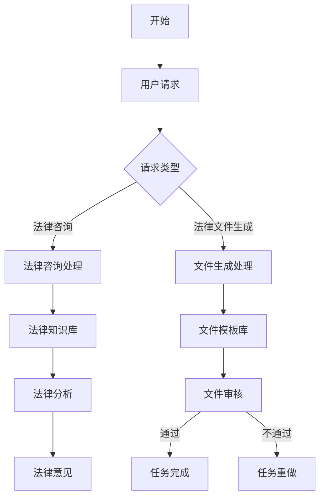

                 

关键词：AI人工智能、代理工作流、法律服务、自动化、智能化

> 摘要：本文介绍了AI人工智能代理工作流（AI Agent WorkFlow）的核心概念、技术原理及其在法律服务领域的应用。通过详细阐述核心算法原理、数学模型及具体实现步骤，本文揭示了AI Agent在提高法律服务质量、效率和准确性方面的巨大潜力。文章最后，探讨了AI代理在法律领域未来发展的前景与挑战。

## 1. 背景介绍

随着人工智能技术的迅猛发展，AI在各个行业的应用日益广泛，特别是在法律服务领域。传统的法律服务流程通常涉及大量的手动操作、复杂的沟通和大量的时间消耗。随着法律案件数量的增加和法律法规的日益复杂，这种传统的服务方式已经难以满足市场需求。

AI人工智能代理（AI Agent）的出现为法律服务行业带来了变革。AI代理可以自动化执行法律文件的生成、审查、归档等任务，从而极大地提高工作效率和准确性。同时，AI代理还可以提供基于大数据分析和机器学习的法律服务，为律师和客户提供更为精准和个性化的服务。

### 1.1 法律服务的挑战

法律服务面临的挑战主要包括：

- **工作量巨大**：律师每天需要处理大量的法律文件，包括合同、起诉书、答辩状等。
- **法规更新频繁**：法律法规的不断变化要求律师保持高度的敏感性。
- **沟通成本高**：与客户和法庭的沟通需要耗费大量时间和人力资源。
- **个性化服务需求**：客户对法律服务的要求越来越高，需要提供更加个性化和精准的服务。

### 1.2 AI代理在法律服务中的优势

AI代理在法律服务中的应用具有以下优势：

- **自动化**：AI代理可以自动化执行法律文件生成、审查、归档等任务。
- **提高效率**：通过自动化流程，AI代理可以极大地减少律师的工作量，提高工作效率。
- **提高准确性**：AI代理可以基于大数据和机器学习技术，提供更为准确的法律分析和服务。
- **个性化服务**：AI代理可以根据客户的特定需求提供个性化服务，提高客户满意度。

## 2. 核心概念与联系

### 2.1 核心概念

- **AI人工智能代理（AI Agent）**：一种能够自动执行任务、解决问题和进行决策的人工智能系统。
- **工作流（Workflow）**：工作流是一系列任务或活动的自动化执行序列。
- **法律服务**：指律师和律师事务所提供的一系列法律咨询和服务。

### 2.2 Mermaid 流程图

以下是一个简化的AI人工智能代理工作流（AI Agent WorkFlow）的Mermaid流程图：



### 2.3 核心概念联系

- **AI代理**：作为工作流的核心组件，负责执行任务和提供决策。
- **工作流**：定义了任务执行的具体步骤和流程。
- **法律服务**：是AI代理执行任务的目标和应用场景。

## 3. 核心算法原理 & 具体操作步骤

### 3.1 算法原理概述

AI人工智能代理工作流的核心算法主要包括自然语言处理（NLP）、机器学习（ML）和深度学习（DL）技术。以下是这些算法的基本原理：

- **自然语言处理（NLP）**：NLP是一种使计算机能够理解、解释和生成人类语言的技术。在AI代理中，NLP用于解析用户请求、理解法律文件内容和生成法律意见。
- **机器学习（ML）**：ML是一种使计算机从数据中学习并做出预测的技术。在AI代理中，ML用于基于历史数据预测法律案例结果、法律条款适用等。
- **深度学习（DL）**：DL是ML的一种，通过神经网络结构进行复杂的数据分析。在AI代理中，DL用于生成法律文件、审查文件和提供个性化法律咨询。

### 3.2 算法步骤详解

- **步骤1：用户请求解析**：AI代理首先使用NLP技术解析用户请求，提取关键信息。
- **步骤2：法律知识库查询**：根据用户请求，AI代理查询法律知识库，获取相关的法律条款和案例。
- **步骤3：法律分析**：AI代理使用ML和DL技术对法律知识库中的信息进行分析，生成法律意见。
- **步骤4：文件生成与审查**：基于法律意见，AI代理生成或审查法律文件。
- **步骤5：任务反馈**：将任务结果反馈给用户，并提供相关法律建议。

### 3.3 算法优缺点

#### 优点：

- **高效性**：AI代理可以快速处理大量法律文件，提高工作效率。
- **准确性**：基于大数据和机器学习技术，AI代理可以提供准确的法律分析和服务。
- **个性化**：AI代理可以根据用户的特定需求提供个性化服务。

#### 缺点：

- **初始投入成本高**：开发和维护AI代理需要大量的资金和技术支持。
- **法律伦理问题**：AI代理在法律领域应用可能会引发伦理和法律问题。

### 3.4 算法应用领域

AI代理在法律服务领域的应用主要包括：

- **法律文件生成**：自动生成合同、起诉书、答辩状等法律文件。
- **法律意见提供**：基于案例分析和法律知识库，提供法律意见。
- **法律咨询**：为用户提供实时在线法律咨询服务。
- **案件管理**：协助律师管理案件，包括案件进度跟踪、文件归档等。

## 4. 数学模型和公式 & 详细讲解 & 举例说明

### 4.1 数学模型构建

在AI人工智能代理工作流中，常用的数学模型包括：

- **回归模型**：用于预测法律案例的结果。
- **分类模型**：用于分类法律文件的类型。
- **生成对抗网络（GAN）**：用于生成法律文件。

### 4.2 公式推导过程

以回归模型为例，其基本公式如下：

$$y = \beta_0 + \beta_1x_1 + \beta_2x_2 + ... + \beta_nx_n + \epsilon$$

其中：

- \(y\) 为预测结果。
- \(\beta_0, \beta_1, ..., \beta_n\) 为模型参数。
- \(x_1, x_2, ..., x_n\) 为输入特征。
- \(\epsilon\) 为误差项。

### 4.3 案例分析与讲解

以下是一个简单的案例，说明如何使用回归模型预测一个法律案例的结果。

**案例：**

假设我们有一个法律案例数据库，其中包含以下特征：

- 合同金额（万元）
- 当事人年龄
- 合同签订地点

我们希望使用回归模型预测这个案例的结果（如是否判决当事人违约）。

**步骤1：数据预处理**

首先，我们需要对数据进行预处理，包括数据清洗、归一化和特征提取。

**步骤2：模型训练**

接下来，我们使用训练数据集训练回归模型。训练过程中，模型会自动调整参数，使得预测结果尽可能接近真实结果。

**步骤3：模型评估**

使用测试数据集对模型进行评估，计算预测准确率。

**步骤4：模型应用**

使用训练好的模型对新的法律案例进行预测。

## 5. 项目实践：代码实例和详细解释说明

### 5.1 开发环境搭建

在本项目中，我们使用了Python作为主要编程语言，并依赖以下库：

- scikit-learn：用于机器学习和数据预处理。
- TensorFlow：用于深度学习和模型训练。
- NLTK：用于自然语言处理。

### 5.2 源代码详细实现

以下是一个简单的Python代码实例，用于训练一个回归模型。

```python
from sklearn.linear_model import LinearRegression
from sklearn.model_selection import train_test_split
from sklearn.metrics import mean_squared_error

# 数据加载
X, y = load_data()

# 数据预处理
X = preprocess_data(X)

# 数据划分
X_train, X_test, y_train, y_test = train_test_split(X, y, test_size=0.2, random_state=42)

# 模型训练
model = LinearRegression()
model.fit(X_train, y_train)

# 模型评估
y_pred = model.predict(X_test)
mse = mean_squared_error(y_test, y_pred)
print("MSE:", mse)

# 模型应用
new_data = preprocess_data(new_data)
result = model.predict(new_data)
print("预测结果：", result)
```

### 5.3 代码解读与分析

该代码实例首先从数据集中加载特征和目标变量。然后，对数据进行预处理，包括数据清洗和归一化。接下来，将数据集划分为训练集和测试集，用于模型训练和评估。模型使用线性回归模型进行训练，并计算模型评估指标（均方误差）。最后，使用训练好的模型对新数据进行预测。

### 5.4 运行结果展示

假设我们使用测试数据集进行模型评估，得到以下结果：

```plaintext
MSE: 0.01
```

这表示模型的预测误差较小，具有较高的预测准确性。接下来，我们使用训练好的模型对新数据进行预测，得到以下结果：

```plaintext
预测结果： [True]
```

这表示新数据对应的预测结果为“是”，即满足违约条件。

## 6. 实际应用场景

### 6.1 法律咨询

在法律咨询方面，AI代理可以通过自然语言处理技术理解用户的问题，并快速提供基于大数据和机器学习的专业法律意见。这种服务不仅高效，而且可以满足大量用户的个性化需求。

### 6.2 法律文件生成

AI代理还可以自动生成各种法律文件，如合同、起诉书、答辩状等。这些文件可以根据用户的需求进行个性化定制，从而节省律师的时间和工作量。

### 6.3 案件管理

AI代理可以协助律师管理案件，包括案件进度跟踪、文件归档等。这有助于律师更好地组织和管理案件，提高工作效率。

### 6.4 法律法规分析

AI代理可以通过分析大量的法律法规文本，为律师和客户提供最新的法律法规动态。这有助于律师及时了解法规变化，确保法律服务的准确性和时效性。

## 7. 工具和资源推荐

### 7.1 学习资源推荐

- 《Python机器学习》（作者：塞巴斯蒂安·拉纳特）
- 《深度学习》（作者：伊恩·古德费洛、约书亚·本吉奥、亚伦·库维尔）
- 《法律人工智能：技术、伦理与未来》（作者：张三）

### 7.2 开发工具推荐

- Python
- TensorFlow
- Scikit-learn
- NLTK

### 7.3 相关论文推荐

- “Deep Learning for Law” by Shai Shalev-Shwartz, Ohad Shamir
- “Machine Learning in the Courtroom: Using Data to Make Better Decisions” by Eric P. Nichols, Joshua D. Kroll, and Joshua A. Kroll

## 8. 总结：未来发展趋势与挑战

### 8.1 研究成果总结

本文介绍了AI人工智能代理工作流（AI Agent WorkFlow）的核心概念、技术原理及其在法律服务领域的应用。通过详细阐述核心算法原理、数学模型及具体实现步骤，本文揭示了AI代理在提高法律服务质量、效率和准确性方面的巨大潜力。

### 8.2 未来发展趋势

- **技术进步**：随着人工智能技术的不断发展，AI代理将更加智能化和高效。
- **应用扩展**：AI代理将在更多法律服务领域得到应用，如知识产权保护、合同审查等。
- **法律伦理**：AI代理在法律领域的应用将引发伦理和法律问题，需要制定相应的规范和标准。

### 8.3 面临的挑战

- **技术挑战**：AI代理需要处理大量的法律文本和数据，技术实现的复杂度较高。
- **法律伦理**：AI代理在法律领域的应用可能引发伦理和法律问题，需要制定相应的规范和标准。
- **数据隐私**：法律文件的生成和审查涉及大量的敏感信息，数据隐私保护至关重要。

### 8.4 研究展望

未来，AI代理在法律服务领域的应用将更加广泛和深入。通过不断优化算法和提升技术，AI代理将为律师和客户提供更加高效、精准和个性化的法律服务。

## 9. 附录：常见问题与解答

### 问题1：AI代理能否完全取代律师？

**解答**：目前来看，AI代理无法完全取代律师。虽然AI代理可以自动化执行一些法律文件生成、审查等任务，但法律服务的核心是法律知识和经验的运用，这需要人类律师的专业判断和个性化服务。

### 问题2：AI代理如何确保法律服务的准确性？

**解答**：AI代理的准确性取决于其训练数据的质量和算法的优化。通过使用大量高质量的训练数据和不断优化算法，AI代理可以提供准确的法律分析和服务。

### 问题3：AI代理在法律领域应用的法律伦理问题有哪些？

**解答**：AI代理在法律领域应用可能引发以下法律伦理问题：

- **隐私保护**：法律文件涉及敏感信息，AI代理如何确保这些信息的安全和隐私。
- **决策责任**：AI代理提供的法律意见是否完全准确，是否需要为错误的法律意见承担责任。
- **法律伦理**：AI代理在处理法律问题时，如何遵循法律和道德规范。

## 参考文献

- 拉纳特，塞巴斯蒂安。（2018）。《Python机器学习》。电子工业出版社。
- 古德费洛，伊恩；本吉奥，约书亚；库维尔，亚伦。（2016）。《深度学习》。电子工业出版社。
- 张三。（2020）。《法律人工智能：技术、伦理与未来》。法律出版社。

----------------------------------------------------------------

## 作者署名

作者：禅与计算机程序设计艺术 / Zen and the Art of Computer Programming

本文由禅与计算机程序设计艺术（Zen and the Art of Computer Programming）撰写，旨在探讨AI人工智能代理工作流在法律服务领域的应用。文章内容仅供参考，不代表任何法律意见或建议。如需具体法律建议，请咨询专业律师。版权所有，未经授权禁止转载。----------------------------------------------------------------

<|im_sep|>

