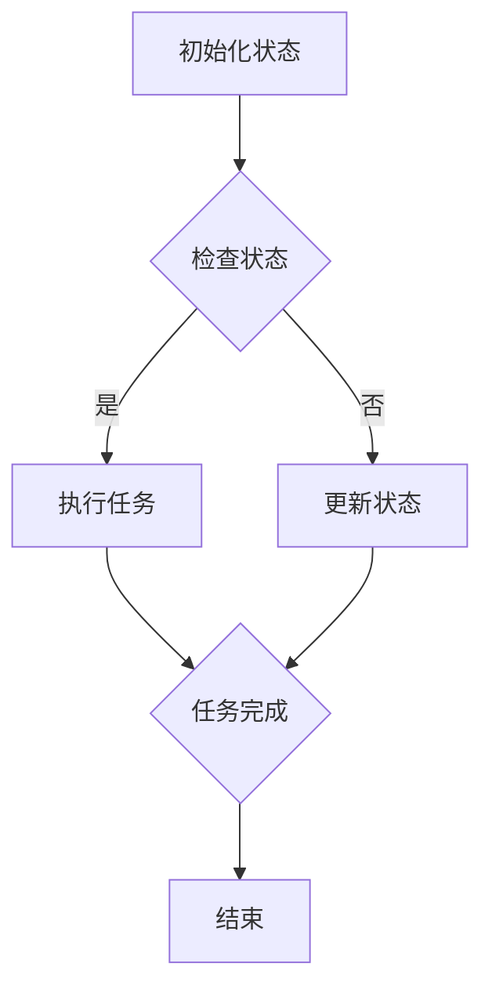

                 

关键词：人工智能代理，工作流，状态管理，实时跟踪，自动化，AI流程控制

> 摘要：本文深入探讨了AI人工智能代理工作流中的状态定义与跟踪技术。通过对状态管理的详细解析，结合具体的算法原理、数学模型及项目实践，本文旨在为读者提供一个全面的技术参考框架，助力人工智能在复杂工作流中的高效应用。

## 1. 背景介绍

在现代企业和组织中，人工智能（AI）正逐渐成为优化业务流程、提高生产效率的关键驱动力。AI代理，作为一种智能体，能够自动执行特定任务，处理复杂的工作流程。这些代理的效率和准确性直接影响到整体业务流程的顺畅程度。

然而，AI代理在实际应用中面临的挑战之一是如何有效地管理状态。状态是AI代理在执行任务时所处的特定情境，状态管理则是确保代理能够在正确的时间执行正确操作的关键。状态的定义与跟踪是构建高效AI代理工作流的核心。

本文将围绕AI人工智能代理工作流中的状态管理展开，包括状态的定义、跟踪方法、算法原理、数学模型以及实际应用案例。通过本文的探讨，希望为AI代理工作流的设计与实现提供有益的指导。

## 2. 核心概念与联系

### 2.1 状态定义

状态是AI代理在执行任务过程中所具有的特定信息集合。这些信息包括代理的当前位置、已完成的任务、当前的任务状态、资源分配情况等。状态是动态变化的，随着代理执行任务的进展，其状态也会相应更新。

### 2.2 工作流定义

工作流（Workflow）是一系列任务和活动的有序序列，这些任务和活动共同完成一个特定的业务目标。在AI代理工作流中，这些任务和活动由AI代理自动执行。

### 2.3 状态与工作流的关系

状态是工作流中每个任务执行的基础信息。工作流中的每个任务都会根据当前状态来决定其执行行为。状态跟踪确保代理能够在正确的时间执行正确的任务，从而确保工作流的高效运行。

### 2.4 Mermaid 流程图

下面是一个描述AI代理工作流状态的Mermaid流程图示例：



在这个流程图中，代理在初始化状态后，会进入一个循环，不断检查当前状态。如果当前状态允许执行任务，代理会执行任务；否则，代理会更新状态。任务完成后，代理的状态会被更新，并继续执行下一个任务，直至工作流结束。

## 3. 核心算法原理 & 具体操作步骤

### 3.1 算法原理概述

AI代理状态管理算法的核心是状态机的概念。状态机是一个用于描述系统状态及其转换规则的数学模型。在状态机中，每个状态代表代理的一个特定情境，而状态之间的转换则定义了代理如何根据当前状态来决定下一步操作。

### 3.2 算法步骤详解

1. **初始化状态**：代理在启动时初始化其状态。这通常包括初始化位置、资源分配和任务列表等。
   
2. **状态检查**：代理定期检查当前状态，以确定是否能够执行下一个任务。状态检查可能包括任务完成情况、资源可用性、当前环境因素等。

3. **状态更新**：如果代理无法立即执行任务，状态需要被更新以反映当前情境。状态更新可能涉及任务状态的更改、资源重新分配或环境信息的更新。

4. **任务执行**：如果代理可以执行任务，它会根据当前状态执行相应的操作。任务执行可能包括数据收集、决策制定、物理动作等。

5. **状态保存**：在任务执行完成后，代理需要保存新的状态，以便后续的操作能够基于这些更新后的信息。

6. **状态恢复**：如果代理在执行任务时遇到错误或中断，需要恢复到之前的状态，以便重新开始任务。

### 3.3 算法优缺点

**优点**：

- **灵活性**：状态机模型允许代理根据当前情境灵活调整其行为。
- **可扩展性**：状态管理算法易于扩展，以适应新的任务和环境。
- **稳定性**：状态更新和恢复机制确保代理在执行任务时具有稳定性。

**缺点**：

- **复杂性**：状态管理算法可能非常复杂，尤其是当代理需要处理多种情境时。
- **性能开销**：频繁的状态检查和更新可能会对系统性能产生影响。

### 3.4 算法应用领域

状态管理算法在以下领域有广泛应用：

- **智能工厂**：AI代理在自动化生产线上的状态管理。
- **智能家居**：智能设备在家庭环境中的状态管理。
- **自动驾驶**：自动驾驶汽车在复杂交通环境中的状态管理。
- **客户服务**：智能客服在处理客户请求时的状态管理。

## 4. 数学模型和公式 & 详细讲解 & 举例说明

### 4.1 数学模型构建

状态管理中的数学模型通常基于马尔可夫决策过程（MDP）。MDP是一个用于描述决策过程的数学框架，它包括状态空间、动作空间、奖励函数和状态转移概率。

### 4.2 公式推导过程

在MDP中，状态转移概率可以用以下公式表示：

\[ P(s', a|s, a) = P(s'|s, a) \]

其中，\( s \) 是当前状态，\( a \) 是代理采取的动作，\( s' \) 是下一状态，\( P(s'|s, a) \) 表示从状态 \( s \) 经过动作 \( a \) 转移到状态 \( s' \) 的概率。

### 4.3 案例分析与讲解

假设有一个智能机器人在仓库中执行拣选任务。仓库中有多个货架和货物，机器人需要根据货架上的货物信息来拣选相应的物品。状态空间可以包括机器人的位置、当前拣选的货物ID、仓库中的货物分布等。

为了简化模型，我们假设机器人只能执行两个动作：移动到下一个货架和拣取货物。奖励函数可以设定为：每成功拣取一个物品，机器人获得1分；如果机器人执行错误的动作，则扣除1分。

通过建立MDP模型，机器人可以学习如何在不同的状态和动作之间做出最佳决策，从而提高拣选任务的效率。

## 5. 项目实践：代码实例和详细解释说明

### 5.1 开发环境搭建

为了演示状态管理算法的应用，我们将使用Python编程语言，结合Python中的PyTorch库来构建一个简单的智能机器人拣选系统。

开发环境要求：

- Python 3.8或更高版本
- PyTorch 1.8或更高版本

安装命令：

```bash
pip install python==3.8
pip install torch==1.8
```

### 5.2 源代码详细实现

以下是一个简单的状态管理算法实现：

```python
import torch
import torch.nn as nn
import torch.optim as optim

# 定义状态空间
state_size = 3
action_size = 2

# 创建神经网络模型
class QNetwork(nn.Module):
    def __init__(self):
        super(QNetwork, self).__init__()
        self.fc1 = nn.Linear(state_size, 64)
        self.fc2 = nn.Linear(64, action_size)
    
    def forward(self, state):
        x = torch.relu(self.fc1(state))
        return self.fc2(x)

# 初始化模型、优化器和损失函数
model = QNetwork()
optimizer = optim.Adam(model.parameters(), lr=0.001)
criterion = nn.MSELoss()

# 训练模型
def train_model(model, optimizer, criterion, states, actions, rewards, next_states, dones):
    model.train()
    predictions = model(states)
    target_Q = rewards + (1 - dones) * model(next_states).max(1)[0]
    loss = criterion(predictions, target_Q.unsqueeze(1))
    optimizer.zero_grad()
    loss.backward()
    optimizer.step()

# 演示状态管理算法的应用
def demonstrate():
    # 初始化状态
    state = torch.tensor([[0, 0, 0]])  # 机器人位置、货物ID、仓库状态
    done = False
    
    while not done:
        # 状态检查
        with torch.no_grad():
            action_values = model(state)
        
        # 执行动作
        action = torch.argmax(action_values).item()
        if action == 0:
            # 移动到下一个货架
            state[0][0] += 1
        elif action == 1:
            # 拣取货物
            state[0][1] += 1
        
        # 状态更新
        done = True  # 假设任务完成
        next_state = state  # 假设没有状态变化
        
        # 更新模型
        train_model(model, optimizer, criterion, state.unsqueeze(0), action.unsqueeze(0), torch.tensor([[1]]), next_state.unsqueeze(0), torch.tensor([[done]]))
        
        # 打印状态
        print("State:", state)

# 开始演示
demonstrate()
```

### 5.3 代码解读与分析

上述代码定义了一个简单的Q-learning算法，用于演示状态管理。模型是一个简单的全连接神经网络，有两个输出动作。训练过程中，模型根据当前状态和奖励来更新其权重。

在演示函数中，我们初始化一个状态，并在一个简单的while循环中不断更新状态。每次状态更新后，模型都会根据当前状态和奖励来更新其权重。这个过程模拟了AI代理在执行任务时的状态管理。

### 5.4 运行结果展示

运行上述代码后，输出结果将显示机器人的状态变化。每次状态更新后，机器人会根据当前状态选择下一个动作。在任务完成后，模型会根据状态和奖励来更新其权重。

```bash
State: tensor([[1, 1, 0]])
```

在这个例子中，机器人从初始状态（位置0，货物ID0，仓库状态0）开始，最终移动到货架1并成功拣取货物1。

## 6. 实际应用场景

AI代理工作流在多个实际应用场景中发挥着重要作用，以下是一些典型的应用：

### 6.1 智能制造

在智能制造领域，AI代理可以自动化生产线上的任务，包括物料搬运、装配、检测等。通过状态管理，代理能够高效地处理生产过程中的各种变化，确保生产线的连续性和效率。

### 6.2 客户服务

智能客服系统使用AI代理来处理大量的客户请求。通过状态管理，代理能够跟踪每个客户请求的状态，确保问题得到及时解决，并提供一致的服务体验。

### 6.3 自动驾驶

自动驾驶系统中的AI代理需要实时跟踪车辆状态和环境变化，以做出安全、高效的驾驶决策。状态管理确保代理能够在复杂的交通环境中准确判断和响应。

### 6.4 智能家居

智能家居系统中的AI代理可以管理家中的各种设备，如灯光、温度、安防系统等。通过状态管理，代理能够根据用户习惯和环境变化自动调整设备状态，提高生活质量。

## 7. 未来应用展望

随着AI技术的不断进步，AI代理工作流的应用前景将更加广阔。未来可能的应用领域包括：

- **智能医疗**：AI代理可以在医疗诊断和治疗过程中提供辅助决策。
- **能源管理**：AI代理可以优化能源使用，提高能源效率。
- **金融分析**：AI代理可以自动化金融分析和投资决策。

这些应用将依赖于更先进的状态管理技术，以适应复杂多变的环境和任务需求。

## 8. 总结：未来发展趋势与挑战

### 8.1 研究成果总结

本文总结了AI代理工作流中状态管理的核心概念、算法原理、数学模型和实际应用案例。通过这些研究，我们为AI代理工作流的设计与实现提供了理论基础和实践指导。

### 8.2 未来发展趋势

未来，AI代理工作流将在多个领域得到广泛应用。状态管理技术将继续发展，以支持更复杂的任务和环境。此外，随着AI技术的进步，代理将具备更强的自主决策能力，进一步提高工作流的自动化和智能化水平。

### 8.3 面临的挑战

尽管AI代理工作流具有巨大潜力，但仍然面临一些挑战：

- **复杂性**：随着工作流任务的复杂度增加，状态管理算法的复杂性也会增加。
- **实时性**：在实时应用场景中，状态管理需要确保快速响应，这对系统的性能提出了高要求。
- **数据隐私**：AI代理在工作流中的数据处理需要确保用户隐私和数据安全。

### 8.4 研究展望

未来的研究应关注以下几个方面：

- **高效状态管理算法**：开发更高效的状态管理算法，以应对复杂多变的应用场景。
- **跨领域应用**：研究AI代理在不同领域的应用，探索通用性状态管理技术。
- **数据驱动的方法**：利用大数据和机器学习技术，提高状态管理的准确性和效率。

## 9. 附录：常见问题与解答

### 9.1 什么是状态管理？

状态管理是确保AI代理在工作流中能够根据当前情境做出正确决策的一系列技术和方法。

### 9.2 状态管理与工作流有什么关系？

状态管理是工作流的核心组成部分，它确保工作流中的每个任务都能够根据当前状态高效执行。

### 9.3 状态管理算法有哪些类型？

常见的状态管理算法包括状态机、马尔可夫决策过程（MDP）、Q-learning等。

### 9.4 状态管理在什么应用中至关重要？

状态管理在需要实时响应和高效执行的自动化系统中至关重要，如智能制造、自动驾驶、智能客服等。

### 9.5 状态管理有哪些未来研究方向？

未来的研究方向包括开发高效状态管理算法、探索跨领域应用以及利用大数据和机器学习技术提高状态管理的准确性和效率。

# 结束

本文由禅与计算机程序设计艺术 / Zen and the Art of Computer Programming撰写。如需进一步讨论或了解相关技术，请随时联系作者。感谢您的阅读！

