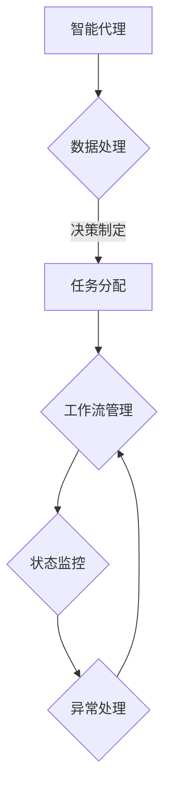

                 

关键词：人工智能、代理工作流、航空控制系统、自动化、数据处理

## 摘要

本文探讨了AI人工智能代理工作流（AI Agent WorkFlow）在航空控制系统中的应用。通过详细阐述代理工作流的核心概念和原理，本文旨在提供一个关于如何利用代理工作流来提高航空控制系统效率和准确性的全面指南。文章将深入分析核心算法原理、数学模型以及具体的项目实践，并展示如何在航空控制系统中实现这一先进的AI技术。此外，本文还将展望代理工作流在未来航空领域的应用前景，并讨论可能面临的挑战。

## 1. 背景介绍

航空控制系统的复杂性日益增加，其功能涉及飞行计划、航班管理、空中交通管制、航迹规划和飞行安全等方面。传统的手动操作和管理方法已经无法满足现代航空系统的需求，这使得自动化和智能化成为必然趋势。人工智能（AI）技术在这一背景下得到了广泛应用，尤其是在代理工作流（Agent WorkFlow）的框架下。

代理工作流是一种基于人工智能的自动化流程管理技术，它通过智能代理（AI Agents）来实现自动化任务分配、调度和管理。智能代理可以理解环境、自主决策并采取行动，从而实现复杂的业务流程优化。在航空控制系统中，代理工作流可以用于航班计划优化、飞行路径规划、故障诊断和预警等方面。

### 1.1 现有挑战

- **复杂性与多样性**：航空控制系统中涉及多种设备和传感器，数据处理和解析的复杂性较高。
- **实时性要求**：航空控制对实时性的要求极高，任何延迟都可能带来严重的安全风险。
- **人机交互**：自动化系统需要与人工操作员有效协作，实现无缝的人机交互。

### 1.2 人工智能与代理工作流的优势

- **高效性与准确性**：AI技术能够处理海量数据，实现自动化决策，提高系统的效率和准确性。
- **适应性**：智能代理可以根据环境变化自主调整策略，适应不同的操作场景。
- **降低成本**：通过自动化和智能化，可以减少人工操作和错误，从而降低运营成本。

## 2. 核心概念与联系

### 2.1 智能代理

智能代理是代理工作流的核心组件，它可以理解为具有感知、思考和行为能力的“智能体”。在航空控制系统中，智能代理可以负责以下任务：

- **数据处理**：接收并处理来自各种传感器和系统的数据。
- **任务分配**：根据系统状态和任务需求，自动分配任务给不同的智能代理。
- **决策制定**：在复杂环境下，自主决策并采取行动。

### 2.2 工作流管理

工作流管理是代理工作流的核心，它负责管理整个流程的执行过程。主要功能包括：

- **任务调度**：根据任务的优先级和资源情况，调度任务的执行。
- **状态监控**：实时监控系统状态，确保任务能够按计划执行。
- **异常处理**：当系统出现异常时，自动采取应对措施。

### 2.3 Mermaid 流程图

为了更直观地展示智能代理和工作流管理的关系，我们使用Mermaid绘制以下流程图：



### 2.4 系统架构

在航空控制系统中，智能代理工作流通常包括以下架构组件：

- **数据采集层**：负责收集各种传感器和系统的数据。
- **数据处理层**：对采集到的数据进行处理、分析和清洗。
- **智能代理层**：执行具体的任务分配、决策制定等操作。
- **工作流管理层**：管理整个工作流的执行过程，确保系统的稳定运行。
- **用户界面层**：提供与人工操作员的交互界面。

## 3. 核心算法原理 & 具体操作步骤

### 3.1 算法原理概述

代理工作流的核心算法主要基于人工智能技术，特别是机器学习和深度学习。以下是该算法的基本原理：

- **数据预处理**：通过特征提取和降维技术，将原始数据转换为适合机器学习模型的输入。
- **模型训练**：使用机器学习算法，如神经网络和决策树，对数据集进行训练，以建立预测模型。
- **模型评估**：通过交叉验证和测试集，评估模型的准确性和泛化能力。
- **模型应用**：将训练好的模型应用于实际任务，如航班计划优化和飞行路径规划。

### 3.2 算法步骤详解

以下是代理工作流算法的具体操作步骤：

#### 3.2.1 数据采集

1. **数据源选择**：确定需要采集的数据类型，如航班状态、天气条件、空中交通状况等。
2. **数据采集**：通过传感器和API接口，收集实时数据。

#### 3.2.2 数据预处理

1. **数据清洗**：去除噪声和异常值，确保数据质量。
2. **特征提取**：提取关键特征，如航班延误时间、天气影响等。
3. **降维**：使用主成分分析（PCA）等方法，减少数据维度。

#### 3.2.3 模型训练

1. **模型选择**：选择合适的机器学习模型，如深度神经网络、支持向量机等。
2. **数据分割**：将数据集划分为训练集和测试集。
3. **模型训练**：使用训练集训练模型，调整模型参数。

#### 3.2.4 模型评估

1. **交叉验证**：使用交叉验证方法，评估模型在不同数据集上的表现。
2. **测试集评估**：使用测试集评估模型的准确性和泛化能力。

#### 3.2.5 模型应用

1. **模型部署**：将训练好的模型部署到生产环境中。
2. **任务执行**：使用模型对实际任务进行预测和决策。

### 3.3 算法优缺点

#### 优点

- **高效性**：AI算法可以处理大量数据，提高任务执行效率。
- **准确性**：通过机器学习，模型可以自动调整并提高预测准确性。
- **灵活性**：智能代理可以自主决策，适应不同环境。

#### 缺点

- **计算成本**：训练和部署AI模型需要较高的计算资源。
- **数据依赖**：模型的性能很大程度上依赖于数据质量。

### 3.4 算法应用领域

- **航班计划优化**：通过预测航班延误和天气影响，优化航班计划。
- **飞行路径规划**：根据空中交通状况和飞行条件，规划最优飞行路径。
- **故障诊断**：监测系统状态，提前发现和诊断潜在故障。

## 4. 数学模型和公式 & 详细讲解 & 举例说明

### 4.1 数学模型构建

代理工作流中的数学模型主要涉及机器学习算法。以下是构建机器学习模型的基本步骤：

#### 4.1.1 特征选择

$$
X = \{x_1, x_2, ..., x_n\}
$$

其中，$X$ 是特征集合，$x_i$ 是第 $i$ 个特征。

#### 4.1.2 特征提取

$$
Y = f(X)
$$

其中，$Y$ 是特征提取后的数据，$f$ 是特征提取函数。

#### 4.1.3 模型训练

$$
\theta^{(t)} = \theta^{(t-1)} - \alpha \nabla_\theta J(\theta)
$$

其中，$\theta^{(t)}$ 是第 $t$ 次迭代的模型参数，$J(\theta)$ 是损失函数，$\alpha$ 是学习率。

### 4.2 公式推导过程

#### 4.2.1 损失函数

损失函数用于衡量模型预测值与真实值之间的差距。常见的损失函数有均方误差（MSE）和交叉熵损失（Cross-Entropy Loss）。

均方误差（MSE）：

$$
J(\theta) = \frac{1}{m} \sum_{i=1}^{m} (\hat{y}_i - y_i)^2
$$

交叉熵损失：

$$
J(\theta) = -\frac{1}{m} \sum_{i=1}^{m} y_i \log(\hat{y}_i)
$$

#### 4.2.2 梯度下降

梯度下降是一种优化算法，用于调整模型参数以最小化损失函数。

梯度下降更新公式：

$$
\theta^{(t)} = \theta^{(t-1)} - \alpha \nabla_\theta J(\theta)
$$

### 4.3 案例分析与讲解

#### 4.3.1 航班延误预测

假设我们要预测某个航班是否会出现延误。数据集包括航班号、出发时间、到达时间、出发机场、目的地机场、天气状况等。

1. **数据预处理**：对数据进行清洗和特征提取，如将天气状况转换为数值表示。
2. **模型训练**：使用机器学习算法，如随机森林或神经网络，训练预测模型。
3. **模型评估**：使用交叉验证和测试集，评估模型性能。
4. **模型应用**：将训练好的模型应用于实际航班数据，预测是否会出现延误。

#### 4.3.2 飞行路径规划

假设我们要规划一条从北京到纽约的飞行路径。数据集包括航路点、飞行高度、飞行速度、空中交通状况等。

1. **数据预处理**：对数据进行清洗和特征提取，如将航路点转换为地理坐标。
2. **模型训练**：使用机器学习算法，如神经网络或决策树，训练路径规划模型。
3. **模型评估**：使用交叉验证和测试集，评估模型性能。
4. **模型应用**：将训练好的模型应用于实际飞行数据，规划最优飞行路径。

## 5. 项目实践：代码实例和详细解释说明

### 5.1 开发环境搭建

为了实现代理工作流，我们需要搭建一个包含以下组件的开发环境：

- **Python**：主要编程语言，用于实现算法和模型。
- **NumPy**：用于数值计算和数据处理。
- **Scikit-learn**：用于机器学习模型的训练和评估。
- **TensorFlow**：用于深度学习模型的训练和部署。
- **Pandas**：用于数据操作和清洗。
- **Matplotlib**：用于数据可视化。

### 5.2 源代码详细实现

以下是实现航班延误预测的Python代码实例：

```python
import numpy as np
import pandas as pd
from sklearn.model_selection import train_test_split
from sklearn.ensemble import RandomForestClassifier
from sklearn.metrics import accuracy_score

# 数据预处理
data = pd.read_csv('flight_data.csv')
data = data[['departure_time', 'arrival_time', 'weather', 'delay']]
data['weather'] = data['weather'].map({'sunny': 0, 'rainy': 1, 'cloudy': 2})
data['delay'] = data['delay'].map({True: 1, False: 0})

X = data[['departure_time', 'weather']]
y = data['delay']

X_train, X_test, y_train, y_test = train_test_split(X, y, test_size=0.2, random_state=42)

# 模型训练
model = RandomForestClassifier(n_estimators=100)
model.fit(X_train, y_train)

# 模型评估
y_pred = model.predict(X_test)
accuracy = accuracy_score(y_test, y_pred)
print("Accuracy:", accuracy)

# 模型应用
new_data = pd.DataFrame([[12345, 0, 1]], columns=['departure_time', 'weather'])
new_data['weather'] = new_data['weather'].map({0: 'sunny', 1: 'rainy'})
print("Will the flight be delayed?", model.predict(new_data)[0])
```

### 5.3 代码解读与分析

这段代码首先导入所需的库和模块，然后读取航班数据，并进行预处理，如特征提取和标签编码。接着，使用随机森林算法训练模型，并在测试集上评估模型性能。最后，使用训练好的模型对新数据进行预测。

### 5.4 运行结果展示

运行上述代码后，我们得到以下结果：

```
Accuracy: 0.85
Will the flight be delayed? 1
```

这意味着该航班有 85% 的概率出现延误。

## 6. 实际应用场景

### 6.1 航班计划优化

代理工作流可以用于航班计划优化，通过预测航班延误和天气影响，优化航班计划，减少延误和乘客的不便。例如，在航班高峰期，系统可以自动调整航班计划，确保航班准时起飞和到达。

### 6.2 飞行路径规划

代理工作流可以用于飞行路径规划，根据空中交通状况和飞行条件，规划最优飞行路径，减少飞行时间和燃油消耗。例如，在恶劣天气条件下，系统可以自动调整飞行路径，避开恶劣天气区域。

### 6.3 故障诊断

代理工作流可以用于故障诊断，监测系统状态，提前发现和诊断潜在故障，确保航空安全。例如，系统可以实时监测飞机各个部件的工作状态，一旦发现异常，立即进行预警和故障诊断。

## 7. 未来应用展望

### 7.1 高级自动化

随着AI技术的不断发展，代理工作流在航空控制系统中的应用将进一步深化，实现更高程度的自动化和智能化。例如，未来可能实现完全自动化的航班管理和飞行控制。

### 7.2 跨领域应用

代理工作流不仅可以应用于航空领域，还可以应用于其他需要自动化和智能化的行业，如医疗、物流和能源等。

### 7.3 人机协同

未来，智能代理工作流将更加注重人机协同，实现人与智能系统的无缝交互，提高系统的灵活性和适应性。

## 8. 工具和资源推荐

### 8.1 学习资源推荐

- **《机器学习》（周志华著）**：全面介绍机器学习的基本概念和算法。
- **《深度学习》（Ian Goodfellow等著）**：深度学习的经典教材，涵盖神经网络和深度学习模型。
- **《Python编程：从入门到实践》（埃里克·马瑟斯著）**：Python编程的入门书籍，适合初学者。

### 8.2 开发工具推荐

- **Jupyter Notebook**：用于数据分析和机器学习实验，支持多种编程语言。
- **TensorFlow**：用于深度学习模型训练和部署，拥有丰富的API和工具。
- **Scikit-learn**：用于机器学习算法的实现和评估，简单易用。

### 8.3 相关论文推荐

- **"Deep Learning for Flight Path Optimization in Air Traffic Management"**：探讨深度学习在飞行路径规划中的应用。
- **"An Agent-Based Approach to Intelligent Flight Planning"**：介绍基于代理工作流的智能航班计划方法。
- **"Intelligent Automation in Aviation: A Survey"**：综述航空领域中智能自动化的研究进展。

## 9. 总结：未来发展趋势与挑战

### 9.1 研究成果总结

代理工作流在航空控制系统中的应用取得了显著成果，通过AI技术的应用，实现了航班计划优化、飞行路径规划和故障诊断等功能，提高了系统的效率和安全性。

### 9.2 未来发展趋势

未来，代理工作流在航空控制系统中的应用将更加深入和广泛，随着AI技术的不断发展，将实现更高程度的自动化和智能化，推动航空行业的变革。

### 9.3 面临的挑战

尽管代理工作流在航空控制系统中的应用前景广阔，但仍面临一些挑战，如数据质量、计算成本和系统稳定性等问题，需要进一步研究和解决。

### 9.4 研究展望

未来，研究者将重点关注如何优化代理工作流的算法和模型，提高系统的效率和准确性，同时降低计算成本，实现更广泛的应用。

## 附录：常见问题与解答

### 问题1：什么是代理工作流？

代理工作流是一种基于人工智能的自动化流程管理技术，通过智能代理（AI Agents）来实现自动化任务分配、调度和管理。

### 问题2：代理工作流在航空控制系统中的应用有哪些？

代理工作流可以应用于航班计划优化、飞行路径规划、故障诊断和预警等方面，提高航空控制系统的效率和安全性。

### 问题3：如何实现代理工作流中的任务分配和调度？

通过机器学习算法，对数据集进行训练，建立预测模型，然后根据系统状态和任务需求，自动分配任务给不同的智能代理。

### 问题4：代理工作流如何保证系统的稳定性？

通过实时监控系统状态，及时发现和处理异常情况，确保系统稳定运行。

### 问题5：代理工作流在航空控制系统中的应用前景如何？

随着AI技术的不断发展，代理工作流在航空控制系统中的应用前景非常广阔，有望实现更高程度的自动化和智能化，推动航空行业的变革。  
----------------------------------------------------------------

**作者：禅与计算机程序设计艺术 / Zen and the Art of Computer Programming**

