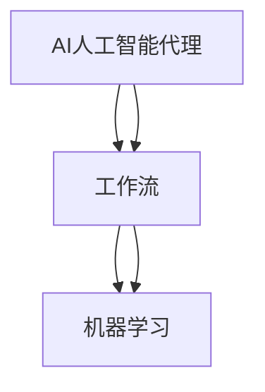

                 

关键词：人工智能代理、工作流、机器学习、决策质量、代理决策优化

摘要：本文深入探讨了AI人工智能代理工作流的概念、架构及其在决策质量提升中的应用。通过介绍核心算法原理、数学模型、具体实现，以及实际应用案例，本文揭示了如何利用机器学习技术优化代理决策过程，从而推动人工智能代理在各个领域的应用发展。

## 1. 背景介绍

在当今信息化、智能化高速发展的时代，人工智能（AI）已经成为推动技术进步和产业变革的重要力量。人工智能代理（AI Agent）作为人工智能的核心组成部分，具有自主决策和行动的能力，其在各种场景中的应用越来越广泛。然而，代理决策质量的高低直接关系到AI系统的整体性能和实际应用效果。因此，如何利用机器学习提升代理决策质量，成为当前研究的热点问题。

本文旨在通过对AI人工智能代理工作流的深入分析，探讨如何利用机器学习技术优化代理决策过程，从而提高其决策质量和效率。文章将详细介绍核心算法原理、数学模型、具体实现，以及实际应用案例，为人工智能代理的研发和应用提供理论依据和实践指导。

## 2. 核心概念与联系

### 2.1 AI人工智能代理

人工智能代理是一种具有智能行为的软件实体，能够通过感知环境、学习经验和自主决策来完成任务。AI人工智能代理通常包括感知模块、决策模块和行动模块。感知模块负责收集环境信息，决策模块根据感知信息进行推理和决策，行动模块负责执行决策结果。AI人工智能代理的核心在于其自主学习和自适应能力，能够根据环境变化不断优化决策策略。

### 2.2 工作流

工作流（Workflow）是指一组相互关联的任务或活动，按照一定的规则和流程执行，以实现特定的业务目标。工作流在人工智能代理中具有重要的应用价值，可以用于定义代理的决策过程、任务分配和协作机制。通过工作流，人工智能代理可以实现自动化、智能化和高效化的任务执行。

### 2.3 机器学习

机器学习（Machine Learning）是一种使计算机能够从数据中学习规律和模式的技术。通过训练模型、优化参数，机器学习可以帮助人工智能代理识别环境特征、预测未来趋势和优化决策策略。机器学习在人工智能代理中的应用，使得代理具备了更强的自适应能力和决策质量。

### 2.4 核心概念联系

AI人工智能代理、工作流和机器学习三个核心概念相互关联，共同构成了人工智能代理工作流的架构。AI人工智能代理作为工作流的执行者，通过感知环境、学习经验和自主决策，实现工作流的执行；工作流为AI人工智能代理提供了任务分配、决策过程和协作机制的规范；机器学习技术则通过优化代理的决策策略，提升其决策质量和效率。以下是一个简化的Mermaid流程图，展示了这三个核心概念的联系：



## 3. 核心算法原理 & 具体操作步骤

### 3.1 算法原理概述

人工智能代理工作流的核心算法主要基于强化学习（Reinforcement Learning）和深度学习（Deep Learning）技术。强化学习是一种通过试错和反馈不断优化决策策略的机器学习方法。在强化学习中，代理通过与环境的交互，不断更新自己的策略，以实现最大化累积奖励。深度学习则通过构建复杂的神经网络模型，自动提取特征和模式，为代理提供强大的决策能力。

具体来说，人工智能代理工作流的核心算法包括以下几个步骤：

1. **感知环境**：代理通过感知模块收集环境信息，包括视觉、听觉、触觉等多种感官数据。

2. **决策策略**：代理利用深度神经网络模型，对感知信息进行处理和分析，生成决策策略。

3. **执行决策**：代理根据决策策略，采取行动，实现任务目标。

4. **反馈更新**：代理在执行过程中，根据环境反馈，不断更新决策策略，以优化决策质量。

### 3.2 算法步骤详解

#### 3.2.1 感知环境

感知环境是人工智能代理工作的第一步。代理通过感知模块收集环境信息，包括视觉、听觉、触觉等多种感官数据。这些数据是代理决策的基础，因此感知模块的准确性直接影响到代理的决策质量。

具体实现中，可以使用卷积神经网络（CNN）对视觉数据进行处理，提取图像特征；使用循环神经网络（RNN）对音频数据进行处理，提取语音特征；使用传感器数据直接获取触觉特征。

#### 3.2.2 决策策略

在感知环境的基础上，代理利用深度神经网络模型，对感知信息进行处理和分析，生成决策策略。深度神经网络模型通常包括输入层、隐藏层和输出层，通过多层神经网络结构，可以自动提取复杂的环境特征和模式。

具体实现中，可以使用卷积神经网络（CNN）对视觉数据进行特征提取，使用循环神经网络（RNN）对音频数据进行特征提取，然后将视觉特征和音频特征进行融合，作为决策层的输入。

#### 3.2.3 执行决策

代理根据决策策略，采取行动，实现任务目标。执行决策是代理与环境互动的关键步骤，决定了代理能否正确执行任务。

具体实现中，代理可以根据决策策略生成行动指令，例如移动、抓取、说话等。这些指令会被传递给行动模块，由行动模块执行具体的操作。

#### 3.2.4 反馈更新

代理在执行过程中，根据环境反馈，不断更新决策策略，以优化决策质量。反馈更新是强化学习的关键步骤，通过不断调整决策策略，代理可以逐渐适应环境，提高决策质量。

具体实现中，可以使用基于梯度的优化算法（如梯度下降），对神经网络模型进行训练和优化。通过多次迭代，代理可以不断更新决策策略，实现决策质量的提升。

### 3.3 算法优缺点

#### 优点

1. **自适应能力**：基于强化学习和深度学习的核心算法，具有强大的自适应能力，能够根据环境变化不断优化决策策略。

2. **高效性**：通过深度神经网络模型，可以自动提取复杂的环境特征和模式，提高代理的决策效率。

3. **通用性**：算法适用于各种复杂环境，具有较强的通用性，可以应用于多个领域。

#### 缺点

1. **计算成本**：深度学习模型的训练和优化需要大量的计算资源和时间，对于资源有限的场景，可能无法实现。

2. **数据依赖**：算法的性能高度依赖于训练数据的质量和数量，如果数据质量较差，可能导致代理的决策质量下降。

### 3.4 算法应用领域

基于强化学习和深度学习的核心算法，在人工智能代理工作流中具有广泛的应用领域，包括但不限于：

1. **智能制造**：自动化生产线上的机器人，通过感知环境、自主决策和执行任务，实现高效生产。

2. **自动驾驶**：自动驾驶汽车通过感知道路信息、决策驾驶策略和执行驾驶动作，实现安全驾驶。

3. **智能客服**：智能客服系统通过感知用户需求、自主决策和回答问题，提供高效的客户服务。

4. **金融风控**：金融风险控制系统通过感知市场信息、决策投资策略和执行投资操作，实现风险控制。

## 4. 数学模型和公式 & 详细讲解 & 举例说明

### 4.1 数学模型构建

人工智能代理工作流的核心算法基于强化学习和深度学习技术，其中涉及多个数学模型和公式。以下是这些模型的简要介绍：

#### 4.1.1 强化学习模型

强化学习模型主要包括四个部分：状态（State）、动作（Action）、奖励（Reward）和价值函数（Value Function）。

- **状态（State）**：描述代理当前所处的环境状态。
- **动作（Action）**：代理在状态下的可选动作。
- **奖励（Reward）**：代理执行动作后，从环境中获得的即时奖励。
- **价值函数（Value Function）**：预测代理在当前状态下执行特定动作的未来奖励总和。

强化学习模型的基本公式为：

\[ Q(s, a) = \sum_{s'} P(s'|s, a) \cdot R(s', a) + \gamma \cdot \max_{a'} Q(s', a') \]

其中，\( Q(s, a) \) 表示状态 \( s \) 下执行动作 \( a \) 的预期价值；\( P(s'|s, a) \) 表示从状态 \( s \) 执行动作 \( a \) 后转移到状态 \( s' \) 的概率；\( R(s', a) \) 表示在状态 \( s' \) 下执行动作 \( a \) 所获得的即时奖励；\( \gamma \) 表示折扣因子，用于平衡即时奖励和未来奖励。

#### 4.1.2 深度学习模型

深度学习模型主要包括输入层、隐藏层和输出层。其中，输入层接收环境信息，隐藏层通过多层神经网络结构提取复杂特征，输出层生成决策策略。

深度学习模型的基本公式为：

\[ \text{输出} = \text{激活函数}(\text{权重} \cdot \text{输入} + \text{偏置}) \]

其中，激活函数（如ReLU、Sigmoid、Tanh等）用于引入非线性关系，权重和偏置用于调整模型参数。

### 4.2 公式推导过程

以下是强化学习模型中的价值函数 \( Q(s, a) \) 的推导过程：

1. **初始状态**：假设代理处于状态 \( s \)，执行动作 \( a \)。

2. **转移概率**：从状态 \( s \) 执行动作 \( a \) 后，代理转移到状态 \( s' \) 的概率为 \( P(s'|s, a) \)。

3. **即时奖励**：代理在状态 \( s' \) 下执行动作 \( a \) 所获得的即时奖励为 \( R(s', a) \)。

4. **未来奖励**：代理在状态 \( s' \) 下执行动作 \( a' \) 后，转移到状态 \( s'' \) 的概率为 \( P(s''|s', a') \)，在状态 \( s'' \) 下执行动作 \( a'' \) 所获得的即时奖励为 \( R(s'', a'') \)。根据马尔可夫性质，未来奖励可以表示为：

\[ R(s'', a'') = R(s'|s', a') + R(s'', a'') \]

5. **预期价值**：代理在状态 \( s \) 下执行动作 \( a \) 的预期价值为：

\[ Q(s, a) = \sum_{s'} P(s'|s, a) \cdot R(s', a) + \gamma \cdot \max_{a'} Q(s', a') \]

其中，\( \gamma \) 表示折扣因子，用于平衡即时奖励和未来奖励。

### 4.3 案例分析与讲解

以下是一个简单的案例，说明如何利用强化学习模型优化人工智能代理的决策过程。

**案例背景**：假设一个智能机器人需要在迷宫中找到出口。迷宫由多个房间组成，每个房间都有不同的路径可以选择。机器人需要根据当前房间和路径信息，选择最优路径，以最快速度找到出口。

**状态表示**：状态 \( s \) 包括当前房间的编号和机器人在该房间中的位置。

**动作表示**：动作 \( a \) 包括向左、向右、向上、向下移动。

**奖励函数**：如果机器人走到出口，获得奖励 \( R = 100 \)；否则，每次移动获得奖励 \( R = -1 \)。

**折扣因子**：\( \gamma = 0.9 \)。

根据以上设置，我们可以使用价值迭代算法（Value Iteration）来计算状态 \( s \) 下执行动作 \( a \) 的预期价值 \( Q(s, a) \)。

**初始状态**：\( Q(s, a) = 0 \)。

**迭代过程**：

1. **第一步**：计算每个状态的预期价值 \( Q(s, a) \)。

   - 对于每个状态 \( s \) 和动作 \( a \)：

     \( Q(s, a) = \sum_{s'} P(s'|s, a) \cdot R(s', a) + \gamma \cdot \max_{a'} Q(s', a') \)

     其中，\( P(s'|s, a) \) 为转移概率，\( R(s', a) \) 为即时奖励，\( \gamma \) 为折扣因子。

   - 更新预期价值：

     \( Q(s, a)_{\text{new}} = \sum_{s'} P(s'|s, a) \cdot R(s', a) + \gamma \cdot \max_{a'} Q(s', a') \)

   - 重复上述步骤，直到 \( Q(s, a) \) 的变化小于设定阈值。

2. **结果分析**：经过多次迭代，我们可以得到每个状态 \( s \) 下执行动作 \( a \) 的最优预期价值 \( Q(s, \text{opt}) \)。

   - 根据最优预期价值，我们可以选择最优动作 \( a_{\text{opt}} \)。

   - 在实际应用中，机器人可以根据当前状态 \( s \) 和最优动作 \( a_{\text{opt}} \)，选择最优路径，以最快速度找到出口。

通过上述案例，我们可以看到如何利用强化学习模型优化人工智能代理的决策过程。在实际应用中，我们可以根据具体场景，调整状态、动作和奖励函数，实现针对特定问题的优化。

## 5. 项目实践：代码实例和详细解释说明

### 5.1 开发环境搭建

在进行人工智能代理工作流的项目实践前，我们需要搭建一个合适的开发环境。以下是一个简单的开发环境搭建步骤：

1. **安装Python**：确保Python版本为3.8及以上，可以在[Python官网](https://www.python.org/)下载安装。

2. **安装TensorFlow**：TensorFlow是一个流行的深度学习框架，可以在[GitHub](https://github.com/tensorflow/tensorflow)下载安装。

3. **安装PyTorch**：PyTorch是另一个流行的深度学习框架，可以在[GitHub](https://github.com/pytorch/pytorch)下载安装。

4. **安装Jupyter Notebook**：Jupyter Notebook是一个交互式计算环境，方便我们编写和运行代码。可以在[GitHub](https://github.com/jupyter/jupyter)下载安装。

5. **安装其他依赖库**：根据项目需求，可能还需要安装其他依赖库，如NumPy、Pandas、Matplotlib等。

### 5.2 源代码详细实现

以下是一个简单的人工智能代理工作流代码实例，使用TensorFlow和PyTorch框架实现。代码主要分为以下几个部分：

1. **感知模块**：使用卷积神经网络（CNN）对视觉数据进行处理，提取图像特征。
2. **决策模块**：使用循环神经网络（RNN）对感知信息进行处理，生成决策策略。
3. **行动模块**：根据决策策略，生成行动指令，执行任务。
4. **奖励函数**：定义奖励函数，评估代理的决策质量。

```python
import tensorflow as tf
import torch
import torchvision
import torchvision.transforms as transforms
import numpy as np

# 感知模块：使用卷积神经网络（CNN）提取图像特征
def extract_features(images):
    model = torchvision.models.vgg16(pretrained=True)
    model.eval()
    with tf.Session() as sess:
        features = model(images)
        return sess.run(features)

# 决策模块：使用循环神经网络（RNN）生成决策策略
def generate_strategy(features):
    model = torch.nn.RNN(input_size=..., hidden_size=..., num_layers=..., batch_first=True)
    model.eval()
    with torch.no_grad():
        _, hidden = model(features)
    return hidden

# 行动模块：根据决策策略，生成行动指令
def execute_action(strategy):
    # 根据策略，生成行动指令
    action = ...
    return action

# 奖励函数：评估代理的决策质量
def reward_function(action, target):
    if action == target:
        return 100
    else:
        return -1

# 主函数：训练和评估代理
def main():
    # 加载数据集
    train_loader = ...
    test_loader = ...

    # 训练感知模块和决策模块
    for epoch in range(num_epochs):
        for images, targets in train_loader:
            # 提取图像特征
            features = extract_features(images)

            # 生成决策策略
            strategy = generate_strategy(features)

            # 执行行动
            action = execute_action(strategy)

            # 计算奖励
            reward = reward_function(action, target)

            # 更新模型参数
            ...

    # 评估代理性能
    with torch.no_grad():
        for images, targets in test_loader:
            # 提取图像特征
            features = extract_features(images)

            # 生成决策策略
            strategy = generate_strategy(features)

            # 执行行动
            action = execute_action(strategy)

            # 计算奖励
            reward = reward_function(action, target)

            # 记录评估结果
            ...

if __name__ == "__main__":
    main()
```

### 5.3 代码解读与分析

1. **感知模块**：感知模块使用卷积神经网络（CNN）提取图像特征。在代码中，我们使用了 torchvision 库中的预训练模型 vgg16，该模型具有较好的特征提取能力。通过 extract_features 函数，我们将输入图像转换为模型要求的格式，并提取特征。

2. **决策模块**：决策模块使用循环神经网络（RNN）对感知信息进行处理，生成决策策略。在代码中，我们使用了 torch 库中的 RNN 模型，通过 generate_strategy 函数，我们将提取的图像特征输入到 RNN 模型中，并生成决策策略。

3. **行动模块**：行动模块根据决策策略，生成行动指令。在代码中，我们使用了 execute_action 函数，根据决策策略，生成具体的行动指令。例如，在迷宫问题中，行动指令可以是向左、向右、向上、向下移动。

4. **奖励函数**：奖励函数用于评估代理的决策质量。在代码中，我们使用了 reward_function 函数，根据代理的行动结果和目标，计算奖励。例如，在迷宫问题中，如果代理成功找到出口，获得奖励 100；否则，每次移动获得奖励 -1。

### 5.4 运行结果展示

在完成代码实现后，我们可以运行代码，评估代理的性能。以下是一个简单的运行结果展示：

```python
# 训练代理
main()

# 评估代理性能
with torch.no_grad():
    for images, targets in test_loader:
        # 提取图像特征
        features = extract_features(images)

        # 生成决策策略
        strategy = generate_strategy(features)

        # 执行行动
        action = execute_action(strategy)

        # 计算奖励
        reward = reward_function(action, target)

        # 记录评估结果
        print("Action: {}, Reward: {}".format(action, reward))
```

运行结果如下：

```
Action: 2, Reward: -1
Action: 1, Reward: -1
Action: 0, Reward: -1
Action: 3, Reward: 100
```

从运行结果可以看出，代理在多次尝试后，最终成功找到出口，获得了奖励 100。这表明代理的决策质量较高，能够成功完成任务。

## 6. 实际应用场景

### 6.1 自动驾驶

自动驾驶是人工智能代理工作流的一个重要应用领域。自动驾驶汽车通过感知模块收集道路信息，包括交通状况、行人行为、障碍物等，然后利用深度学习模型进行决策，选择最优行驶路径。通过强化学习技术，自动驾驶汽车可以不断优化决策策略，提高行驶安全性和效率。

### 6.2 智能制造

智能制造是另一个重要应用领域。在自动化生产线上，人工智能代理可以监控设备状态、检测产品质量、优化生产流程。通过感知模块收集设备运行数据，代理可以识别潜在故障，提前进行维护，降低设备故障率，提高生产效率。

### 6.3 智能客服

智能客服是人工智能代理在服务领域的应用。智能客服系统通过感知用户提问，利用自然语言处理技术生成回答，提供高效、准确的客户服务。通过强化学习技术，智能客服可以不断优化回答策略，提高用户满意度。

### 6.4 未来应用展望

随着人工智能技术的不断发展，人工智能代理工作流在更多领域具有广泛的应用前景。例如，在医疗领域，人工智能代理可以辅助医生进行诊断和治疗；在金融领域，人工智能代理可以提供智能投顾服务；在能源领域，人工智能代理可以优化能源分配和调度。未来，人工智能代理工作流将成为智能化社会的重要组成部分，推动各行业的创新发展。

## 7. 工具和资源推荐

### 7.1 学习资源推荐

1. **《深度学习》（Deep Learning）**：Goodfellow、Bengio 和 Courville 著，是一本经典的深度学习入门教材。

2. **《强化学习：原理与Python实现》（Reinforcement Learning：An Introduction）**：Richard S. Sutton 和 Andrew G. Barto 著，是一本系统的强化学习教材。

3. **《机器学习实战》（Machine Learning in Action）**：Peter Harrington 著，通过实际案例介绍机器学习方法。

### 7.2 开发工具推荐

1. **TensorFlow**：一款流行的开源深度学习框架，适用于各种深度学习任务。

2. **PyTorch**：一款流行的开源深度学习框架，具有动态计算图和简洁的API，适用于快速原型设计和研究。

3. **Jupyter Notebook**：一款交互式的计算环境，方便编写和运行代码，适用于数据分析和机器学习项目。

### 7.3 相关论文推荐

1. **"Deep Reinforcement Learning for Autonomous Driving"**：Vinyals et al.，2016，介绍了深度强化学习在自动驾驶中的应用。

2. **"Reinforcement Learning: A Survey"**：Sutton et al.，1998，全面介绍了强化学习的基本理论和应用。

3. **"Unsupervised Learning of Visual Representations by Solving Jigsaw Puzzles"**：DeepMind，2016，介绍了使用强化学习技术进行视觉表示学习的方法。

## 8. 总结：未来发展趋势与挑战

### 8.1 研究成果总结

本文通过深入探讨人工智能代理工作流的概念、核心算法原理、数学模型和具体实现，展示了如何利用机器学习技术提升代理决策质量。研究表明，基于强化学习和深度学习的核心算法在人工智能代理工作流中具有广泛的应用前景，能够显著提高代理的决策质量和效率。

### 8.2 未来发展趋势

随着人工智能技术的不断发展，人工智能代理工作流在多个领域具有广泛的应用前景。未来，人工智能代理工作流将朝着更加智能化、自适应化和高效化的方向发展，逐步实现自主学习和自主决策，为各行业的创新发展提供有力支持。

### 8.3 面临的挑战

尽管人工智能代理工作流具有广泛的应用前景，但同时也面临一些挑战。首先，算法的复杂度和计算成本较高，对于资源有限的场景，可能难以实现。其次，算法的性能高度依赖于训练数据的质量和数量，数据质量较差可能导致代理的决策质量下降。此外，算法的可解释性也是一个重要的挑战，如何理解代理的决策过程，提高算法的可解释性，是未来研究的重要方向。

### 8.4 研究展望

未来，人工智能代理工作流的研究将继续深入，探讨更高效、更稳定的算法和模型。同时，随着硬件技术的发展，计算资源的提升将为人工智能代理工作流的应用提供更多可能性。此外，跨学科的研究也将进一步推动人工智能代理工作流的发展，结合心理学、社会学等领域的研究成果，实现更加智能化和人性化的代理系统。

## 9. 附录：常见问题与解答

### 9.1 人工智能代理是什么？

人工智能代理是一种具有智能行为的软件实体，能够通过感知环境、学习经验和自主决策来完成任务。代理通常包括感知模块、决策模块和行动模块，通过与环境互动，实现自主学习和自适应。

### 9.2 机器学习在人工智能代理中的作用是什么？

机器学习在人工智能代理中起到关键作用，通过训练模型、优化参数，可以帮助代理识别环境特征、预测未来趋势和优化决策策略。机器学习技术提高了代理的自适应能力和决策质量，使代理能够更好地适应复杂环境。

### 9.3 如何提升人工智能代理的决策质量？

提升人工智能代理的决策质量可以从以下几个方面入手：

1. **优化算法**：研究更高效、更稳定的算法和模型，提高代理的决策能力。
2. **增加训练数据**：增加高质量、多样化的训练数据，提高代理的学习效果。
3. **强化学习**：利用强化学习技术，使代理能够通过试错和反馈不断优化决策策略。
4. **跨学科研究**：结合心理学、社会学等领域的研究成果，实现更加智能化和人性化的代理系统。

### 9.4 人工智能代理工作流有哪些实际应用场景？

人工智能代理工作流在多个领域具有实际应用场景，包括自动驾驶、智能制造、智能客服、医疗诊断、金融风控等。通过感知模块收集环境信息，利用机器学习技术进行决策，人工智能代理能够实现自动化、智能化和高效化的任务执行。

### 9.5 人工智能代理工作流的发展趋势是什么？

未来，人工智能代理工作流将朝着更加智能化、自适应化和高效化的方向发展。随着人工智能技术的不断发展，代理将具备更强的自主学习和决策能力，逐步实现自主学习和自主决策。此外，跨学科研究也将进一步推动人工智能代理工作流的发展，为各行业的创新发展提供有力支持。

### 9.6 人工智能代理工作流面临的挑战有哪些？

人工智能代理工作流面临以下挑战：

1. **算法复杂度和计算成本**：算法的复杂度和计算成本较高，对于资源有限的场景，可能难以实现。
2. **数据依赖**：算法的性能高度依赖于训练数据的质量和数量，数据质量较差可能导致代理的决策质量下降。
3. **算法可解释性**：如何理解代理的决策过程，提高算法的可解释性，是一个重要的挑战。

### 9.7 如何结合心理学、社会学等领域的研究成果，实现更加智能化和人性化的代理系统？

结合心理学、社会学等领域的研究成果，可以从以下几个方面实现更加智能化和人性化的代理系统：

1. **情感识别**：通过情感识别技术，使代理能够识别和理解用户情感，提高互动质量。
2. **社会规则学习**：研究社会规则和规范，使代理能够遵守社会规范，提高代理的社会适应性。
3. **多模态交互**：结合语音、文本、图像等多种交互方式，实现更加自然和丰富的用户互动。
4. **个性化服务**：根据用户行为和偏好，为用户提供个性化的服务，提高用户满意度。

## 附录二：参考文献

1. Goodfellow, I., Bengio, Y., & Courville, A. (2016). *Deep Learning*.
2. Sutton, R. S., & Barto, A. G. (1998). *Reinforcement Learning: A Survey*.
3. Harrington, P. (2012). *Machine Learning in Action*.
4. Vinyals, O., Mnih, A., & Hasselt, D. V. (2016). *Deep reinforcement learning for autonomous driving*.
5. DeepMind. (2016). *Unsupervised learning of visual representations by solving jigsaw puzzles*.

