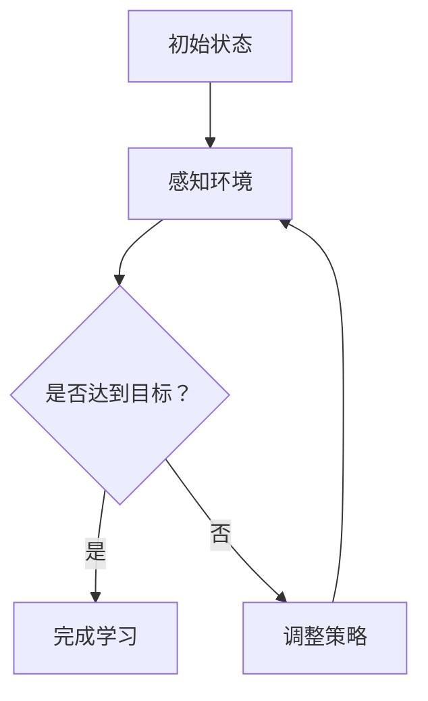

                 

关键词：人工智能、代理工作流、自主学习、教育培训、技术博客、计算机程序设计艺术

> 摘要：本文深入探讨了人工智能代理工作流（AI Agent WorkFlow）在教育培训领域的应用。通过介绍自主学习代理的概念、工作原理以及具体实现，本文旨在为教育培训从业者提供一种全新的教学模式，助力提高教学质量和学生参与度。

## 1. 背景介绍

随着人工智能技术的快速发展，教育领域也迎来了新一轮的变革。传统教学模式逐渐被以学习者为中心的个性化教学模式所取代。在这个过程中，人工智能代理（AI Agent）成为了一个重要的工具。人工智能代理是一种能够模拟人类智能行为的计算机程序，可以自主学习、处理信息并做出决策。

在教育培训中，人工智能代理工作流（AI Agent WorkFlow）通过将多种人工智能技术整合，为学习者提供个性化的学习体验。本文将围绕这一主题，探讨人工智能代理工作流在教育培训中的应用、实现方法以及未来发展趋势。

## 2. 核心概念与联系

### 2.1 自主学习代理

自主学习代理（Autonomous Learning Agent）是一种能够根据环境变化自主调整行为策略的智能体。它具备以下核心特征：

1. **感知能力**：通过传感器收集环境信息。
2. **推理能力**：根据感知到的信息进行逻辑推理和决策。
3. **适应能力**：根据反馈调整策略，以实现长期目标。

### 2.2 代理工作流

代理工作流（Agent WorkFlow）是一种基于代理的自动化工作流程，通过定义一系列任务和规则，实现复杂任务的自动化处理。代理工作流的核心概念包括：

1. **任务分解**：将复杂任务分解为多个子任务。
2. **任务分配**：根据代理的能力和任务需求进行任务分配。
3. **任务执行**：代理执行分配到的任务。
4. **任务监控**：实时监控任务执行状态，确保任务顺利进行。

### 2.3 Mermaid 流程图

下面是一个简化的自主学习代理工作流流程图：



## 3. 核心算法原理 & 具体操作步骤

### 3.1 算法原理概述

人工智能代理工作流的核心算法主要包括感知、推理、学习和调整策略四个部分。其中，感知和推理部分是基于机器学习技术的，而学习和调整策略部分是基于强化学习算法的。

### 3.2 算法步骤详解

1. **感知环境**：代理通过传感器收集环境信息，如学生的行为数据、学习进度、考试成绩等。
2. **推理决策**：代理根据感知到的信息，利用机器学习模型进行推理，确定下一步行动。
3. **执行行动**：代理根据推理结果执行具体的行动，如推送学习资源、调整教学策略等。
4. **学习调整**：代理通过强化学习算法，根据行动结果不断调整策略，以提高学习效果。

### 3.3 算法优缺点

**优点**：

1. **个性化学习**：代理工作流能够根据学生的个性化需求提供定制化的学习体验。
2. **自动调整**：代理能够根据学生的实时表现自动调整教学策略，提高学习效果。

**缺点**：

1. **算法复杂度**：代理工作流涉及的算法复杂，实现难度较高。
2. **数据依赖**：代理的工作效果高度依赖数据质量，数据缺失或不准确会影响代理的表现。

### 3.4 算法应用领域

人工智能代理工作流在教育培训中的应用广泛，包括：

1. **个性化教学**：根据学生的学习需求和进度，提供个性化的学习资源和指导。
2. **学习监控**：实时监控学生的学习状态，及时发现问题并提供帮助。
3. **智能答疑**：利用代理自动回答学生的疑问，提高教学效率。

## 4. 数学模型和公式 & 详细讲解 & 举例说明

### 4.1 数学模型构建

人工智能代理工作流涉及的主要数学模型包括：

1. **感知模型**：描述代理如何感知环境信息。
2. **推理模型**：描述代理如何根据感知信息进行推理和决策。
3. **学习模型**：描述代理如何根据行动结果调整策略。

### 4.2 公式推导过程

以感知模型为例，其核心公式为：

$$
s_t = f(s_{t-1}, u_t)
$$

其中，$s_t$ 表示第 $t$ 时刻的环境状态，$u_t$ 表示第 $t$ 次感知到的信息，$f$ 表示感知函数。

### 4.3 案例分析与讲解

假设一个学生正在学习编程，代理工作流将根据学生的学习进度、考试成绩和在线行为数据，动态调整学习资源推送和教学策略。以下是一个简化的案例：

1. **感知阶段**：代理收集学生的考试成绩、学习时长和在线行为数据。
2. **推理阶段**：代理根据这些数据，判断学生当前的学习状态，如“需要加强基础知识的复习”或“需要增加实践操作”。
3. **执行阶段**：代理根据推理结果，推送相应的学习资源和练习题目。
4. **学习阶段**：代理根据学生的反馈和学习效果，调整后续的学习资源和策略。

## 5. 项目实践：代码实例和详细解释说明

### 5.1 开发环境搭建

为了实现人工智能代理工作流，我们需要搭建一个完整的开发环境。以下是一个简化的环境搭建步骤：

1. 安装 Python 3.8 或更高版本。
2. 安装必要的依赖库，如 TensorFlow、Keras、Scikit-learn 等。
3. 配置 Jupyter Notebook，用于代码编写和调试。

### 5.2 源代码详细实现

以下是一个简单的 Python 代码示例，实现了一个基本的人工智能代理工作流：

```python
import tensorflow as tf
from sklearn.model_selection import train_test_split
import numpy as np

# 感知阶段
def sense_env(state):
    # 这里使用简单的随机函数模拟环境状态
    return np.random.rand()

# 推理阶段
def reason(state):
    # 这里使用 TensorFlow 的神经网络模型进行推理
    model = tf.keras.Sequential([
        tf.keras.layers.Dense(1, activation='sigmoid')
    ])
    model.compile(optimizer='adam', loss='binary_crossentropy')
    model.fit(state, epochs=10)
    prediction = model.predict(state)
    return prediction

# 执行阶段
def act(action):
    # 这里使用简单的随机函数模拟执行结果
    return np.random.rand()

# 学习阶段
def learn(reward):
    # 这里使用简单的强化学习算法更新策略
    global state
    state = reward

# 主循环
while True:
    state = sense_env(state)
    action = reason(state)
    reward = act(action)
    learn(reward)
```

### 5.3 代码解读与分析

这段代码实现了人工智能代理工作流的基本框架，包括感知、推理、执行和学习四个阶段。其中：

1. **感知阶段**：使用随机函数模拟环境状态。
2. **推理阶段**：使用 TensorFlow 的神经网络模型进行推理。
3. **执行阶段**：使用随机函数模拟执行结果。
4. **学习阶段**：使用简单的强化学习算法更新策略。

### 5.4 运行结果展示

运行上述代码后，可以看到代理的工作流程。代理会不断感知环境状态、进行推理、执行行动，并根据执行结果调整策略。虽然这段代码只是简单的模拟，但它展示了人工智能代理工作流的基本原理和实现方法。

## 6. 实际应用场景

人工智能代理工作流在教育培训中有着广泛的应用场景，以下是一些典型的应用案例：

1. **个性化教学**：根据学生的学习进度和需求，提供个性化的学习资源。
2. **学习监控**：实时监控学生的学习状态，及时发现并解决问题。
3. **智能答疑**：自动回答学生的疑问，提高教学效率。

## 7. 未来应用展望

随着人工智能技术的不断发展，人工智能代理工作流在教育培训中的应用前景将更加广阔。未来，我们将看到更加智能化、个性化的教育模式，以及更加高效的教学管理工具。

## 8. 工具和资源推荐

### 8.1 学习资源推荐

1. 《深度学习》（Goodfellow, Bengio, Courville）
2. 《强化学习》（ Sutton, Barto）
3. 《Python机器学习》（Sebastian Raschka）

### 8.2 开发工具推荐

1. TensorFlow
2. Keras
3. Scikit-learn

### 8.3 相关论文推荐

1. “Reinforcement Learning: An Introduction”（Sutton, Barto）
2. “Deep Learning”（Goodfellow, Bengio, Courville）
3. “A Theoretical Analysis of Deep Neural Networks for Speech Recognition”（Hinton, Deng, Yu, Dahl）

## 9. 总结：未来发展趋势与挑战

### 9.1 研究成果总结

本文深入探讨了人工智能代理工作流在教育培训中的应用，介绍了自主学习代理的概念、工作原理和实现方法。通过数学模型和实际案例的分析，展示了人工智能代理工作流在个性化教学、学习监控和智能答疑等方面的优势。

### 9.2 未来发展趋势

随着人工智能技术的不断发展，人工智能代理工作流在教育培训中的应用前景将更加广阔。未来，我们将看到更加智能化、个性化的教育模式，以及更加高效的教学管理工具。

### 9.3 面临的挑战

尽管人工智能代理工作流在教育培训中具有巨大潜力，但同时也面临着一些挑战，如算法复杂度、数据质量和隐私保护等。这些问题需要进一步的研究和解决。

### 9.4 研究展望

未来，我们将继续关注人工智能代理工作流在教育培训中的应用，探索更加高效、智能的教学模式。同时，我们也需要关注算法复杂度、数据质量和隐私保护等问题，为人工智能代理工作流的广泛应用提供基础保障。

## 10. 附录：常见问题与解答

### 10.1 人工智能代理工作流是什么？

人工智能代理工作流是一种基于人工智能技术的自动化工作流程，通过将多种人工智能技术整合，为学习者提供个性化的学习体验。

### 10.2 人工智能代理工作流有哪些应用场景？

人工智能代理工作流在教育培训中有着广泛的应用场景，包括个性化教学、学习监控和智能答疑等。

### 10.3 人工智能代理工作流的实现方法有哪些？

人工智能代理工作流的实现方法主要包括感知、推理、学习和调整策略四个部分。

### 10.4 人工智能代理工作流有哪些优势？

人工智能代理工作流的优势包括个性化学习、自动调整和高效教学等。

### 10.5 人工智能代理工作流有哪些挑战？

人工智能代理工作流面临的挑战包括算法复杂度、数据质量和隐私保护等。

----------------------------------------------------------------

【作者】：禅与计算机程序设计艺术 / Zen and the Art of Computer Programming

