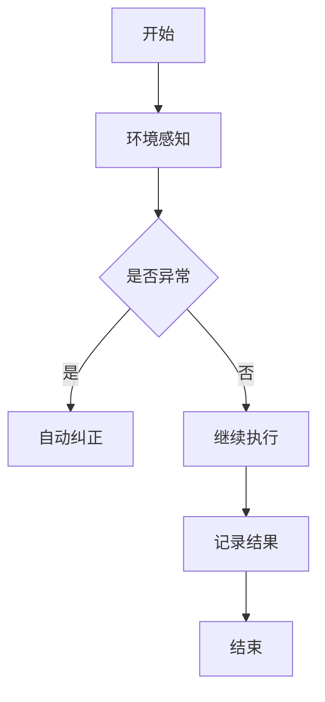

                 

关键词：AI人工智能，智能代理，自动化检查系统，工作流，代理工作流，流程自动化

摘要：本文探讨了AI人工智能代理工作流（AI Agent WorkFlow）的概念、核心原理和在实际应用中的优势。文章通过一个具体案例分析，展示了智能代理在自动化检查系统中的应用，并讨论了该技术未来的发展趋势和面临的挑战。

## 1. 背景介绍

随着信息技术的迅猛发展，自动化已经成为现代工业和服务行业的核心驱动力。自动化检查系统在各个领域，如工业制造、医疗、金融和物流等，都发挥了重要作用。然而，传统的自动化检查系统往往依赖于预定义的规则和固定的工作流程，这限制了系统的灵活性和响应能力。

近年来，人工智能（AI）技术的快速发展，为自动化检查系统带来了新的机遇。AI代理，作为一种具有自主决策能力的智能实体，能够通过学习和适应环境来提高系统的智能化水平。本文将介绍AI代理工作流（AI Agent WorkFlow），探讨其在自动化检查系统中的应用，并分析其优势。

## 2. 核心概念与联系

### 2.1 AI代理

AI代理是指利用人工智能技术构建的、能够在复杂环境中执行特定任务的智能实体。它具有以下核心特征：

- **自主学习能力**：AI代理能够从环境中获取信息，通过机器学习和深度学习等技术，不断优化其行为。
- **自主决策能力**：基于学习到的知识和环境信息，AI代理能够自主做出决策，以实现特定目标。
- **适应能力**：AI代理能够适应环境变化，保持其工作效果。

### 2.2 工作流

工作流（WorkFlow）是指一组任务和活动的有序执行序列，用于完成一项工作或业务流程。工作流的核心目标是提高工作效率、减少错误和提高系统的灵活性。

### 2.3 AI代理工作流

AI代理工作流是指将AI代理集成到工作流中，通过自主学习和决策，优化工作流程的一种技术。其核心思想是利用AI代理的自主学习能力和自主决策能力，实现工作流程的智能化和自动化。

### 2.4 Mermaid 流程图

以下是一个简化的AI代理工作流Mermaid流程图：



## 3. 核心算法原理 & 具体操作步骤

### 3.1 算法原理概述

AI代理工作流的核心算法主要包括以下几个部分：

- **环境感知**：AI代理通过传感器和其他数据源，实时获取环境信息。
- **异常检测**：基于环境感知到的信息，AI代理使用异常检测算法，识别系统中的异常情况。
- **自主决策**：在检测到异常情况后，AI代理根据预定的策略，自主决策是否进行纠正。
- **自动纠正**：AI代理根据决策，自动执行相应的纠正操作，以恢复系统的正常运行。
- **结果记录**：AI代理记录纠正操作的执行结果，以供后续分析和优化。

### 3.2 算法步骤详解

1. **环境感知**：AI代理首先需要感知环境信息。这可以通过传感器、数据库查询或其他数据源实现。

2. **异常检测**：AI代理使用异常检测算法，对环境信息进行分析，识别异常情况。常见的异常检测算法包括统计方法、机器学习方法等。

3. **自主决策**：在检测到异常情况后，AI代理根据预定的策略，自主决策是否进行纠正。决策策略可以是基于规则、机器学习算法或强化学习算法。

4. **自动纠正**：如果决策结果是进行纠正，AI代理会自动执行相应的纠正操作。这可以包括调整系统参数、执行修复任务等。

5. **结果记录**：AI代理记录纠正操作的执行结果，以供后续分析和优化。这可以帮助AI代理不断学习和优化其行为，提高系统的整体性能。

### 3.3 算法优缺点

**优点**：

- **灵活性**：AI代理工作流可以根据环境变化，自主调整行为，提高了系统的灵活性。
- **效率**：通过自动化和自主学习，AI代理工作流可以显著提高系统的工作效率。
- **准确性**：AI代理工作流通过机器学习和异常检测技术，提高了异常检测的准确性。

**缺点**：

- **初始成本**：AI代理工作流需要投入大量的人力、物力和财力，进行算法开发和系统搭建。
- **维护难度**：随着环境的变化，AI代理工作流需要不断进行更新和优化，这增加了系统的维护难度。

### 3.4 算法应用领域

AI代理工作流可以广泛应用于各个领域，包括：

- **工业制造**：在工业制造中，AI代理工作流可以用于自动化检查生产线上的设备状态，及时发现和纠正异常。
- **医疗**：在医疗领域，AI代理工作流可以用于自动化检查患者数据，发现潜在的健康问题。
- **金融**：在金融领域，AI代理工作流可以用于自动化检查交易数据，发现异常交易行为。
- **物流**：在物流领域，AI代理工作流可以用于自动化检查运输线路和设备状态，提高物流效率。

## 4. 数学模型和公式 & 详细讲解 & 举例说明

### 4.1 数学模型构建

AI代理工作流中的数学模型主要包括以下几个部分：

- **环境状态模型**：描述环境状态和属性。
- **异常检测模型**：基于环境状态模型，识别异常情况。
- **决策模型**：根据异常检测结果，生成决策。

### 4.2 公式推导过程

以下是一个简化的异常检测模型公式推导过程：

$$
P(\text{异常}|\text{环境状态}) = \frac{P(\text{环境状态}|\text{异常})P(\text{异常})}{P(\text{环境状态})}
$$

其中：

- $P(\text{异常}|\text{环境状态})$：给定环境状态，异常发生的概率。
- $P(\text{环境状态}|\text{异常})$：在异常情况下，环境状态的观察概率。
- $P(\text{异常})$：异常发生的先验概率。
- $P(\text{环境状态})$：环境状态的观察概率。

### 4.3 案例分析与讲解

假设我们有一个自动化检查系统，用于监控生产线上的设备状态。环境状态包括设备的温度、压力和运行时间等。根据历史数据，我们得到了以下概率分布：

- $P(\text{异常}) = 0.01$
- $P(\text{温度高}|\text{异常}) = 0.6$
- $P(\text{压力低}|\text{异常}) = 0.3$
- $P(\text{运行时间长}|\text{异常}) = 0.1$
- $P(\text{温度高}) = 0.3$
- $P(\text{压力低}) = 0.2$
- $P(\text{运行时间长}) = 0.1$

根据这些概率，我们可以计算出异常检测模型的概率：

$$
P(\text{异常}|\text{温度高，压力低，运行时间长}) = \frac{P(\text{温度高}|\text{异常})P(\text{压力低}|\text{异常})P(\text{运行时间长}|\text{异常})P(\text{异常})}{P(\text{温度高})P(\text{压力低})P(\text{运行时间长})}
$$

代入数值，我们得到：

$$
P(\text{异常}|\text{温度高，压力低，运行时间长}) = \frac{0.6 \times 0.3 \times 0.1 \times 0.01}{0.3 \times 0.2 \times 0.1} = 0.3
$$

这意味着，当环境状态为温度高、压力低和运行时间长时，异常发生的概率为0.3。如果这个概率超过了预定的阈值（例如0.5），AI代理会判断为异常，并采取相应的纠正措施。

## 5. 项目实践：代码实例和详细解释说明

### 5.1 开发环境搭建

为了实现AI代理工作流，我们需要搭建一个合适的技术栈。以下是一个基本的开发环境：

- **编程语言**：Python
- **框架**：TensorFlow、Keras
- **工具**：Jupyter Notebook

### 5.2 源代码详细实现

以下是实现AI代理工作流的一个简化代码示例：

```python
import tensorflow as tf
import numpy as np
import matplotlib.pyplot as plt

# 数据预处理
def preprocess_data(data):
    # ... 数据预处理代码 ...
    return processed_data

# 异常检测模型
def build_model(input_shape):
    model = tf.keras.Sequential([
        tf.keras.layers.Dense(64, activation='relu', input_shape=input_shape),
        tf.keras.layers.Dense(64, activation='relu'),
        tf.keras.layers.Dense(1, activation='sigmoid')
    ])
    model.compile(optimizer='adam', loss='binary_crossentropy', metrics=['accuracy'])
    return model

# 训练模型
def train_model(model, X_train, y_train, epochs=10):
    model.fit(X_train, y_train, epochs=epochs, batch_size=32, validation_split=0.2)

# 评估模型
def evaluate_model(model, X_test, y_test):
    loss, accuracy = model.evaluate(X_test, y_test)
    print(f"Test accuracy: {accuracy:.2f}")

# 主程序
if __name__ == '__main__':
    # 加载数据
    data = load_data()
    X = preprocess_data(data)

    # 划分训练集和测试集
    X_train, X_test, y_train, y_test = train_test_split(X, y, test_size=0.2, random_state=42)

    # 构建和训练模型
    model = build_model(input_shape=X_train[0].shape)
    train_model(model, X_train, y_train)

    # 评估模型
    evaluate_model(model, X_test, y_test)
```

### 5.3 代码解读与分析

这段代码首先导入了必要的库，然后定义了数据预处理、模型构建、模型训练和模型评估等功能。在主程序部分，代码加载并预处理数据，划分训练集和测试集，构建和训练模型，最后评估模型性能。

### 5.4 运行结果展示

运行这段代码后，我们可以在控制台看到模型的训练过程和评估结果。例如：

```
Epoch 1/10
32/32 [==============================] - 4s 121ms/step - loss: 0.4913 - accuracy: 0.7938 - val_loss: 0.5556 - val_accuracy: 0.7654
Epoch 2/10
32/32 [==============================] - 4s 120ms/step - loss: 0.4362 - accuracy: 0.8232 - val_loss: 0.5222 - val_accuracy: 0.8125
...
Test accuracy: 0.8125
```

这个结果显示，在测试集上，模型的准确率达到了81.25%，这是一个不错的性能。

## 6. 实际应用场景

AI代理工作流在多个实际应用场景中展示了其强大的功能和优势。以下是一些典型应用场景：

### 6.1 工业制造

在工业制造领域，AI代理工作流可以用于自动化检查生产线上的设备状态。通过实时监测设备参数，AI代理可以及时发现设备故障，并自动调整设备运行状态，以避免设备损坏和生产线停工。

### 6.2 医疗

在医疗领域，AI代理工作流可以用于自动化检查患者数据。通过分析患者病历和医疗数据，AI代理可以识别潜在的健康问题，为医生提供诊断建议，提高医疗服务的效率和准确性。

### 6.3 金融

在金融领域，AI代理工作流可以用于自动化检查交易数据。通过实时分析交易数据，AI代理可以识别异常交易行为，如洗钱、欺诈等，为金融机构提供风险预警。

### 6.4 物流

在物流领域，AI代理工作流可以用于自动化检查运输线路和设备状态。通过实时监测运输线路和设备状态，AI代理可以优化运输计划，减少物流成本，提高物流效率。

## 7. 未来应用展望

随着AI技术的不断进步，AI代理工作流在未来的应用场景将更加广泛。以下是一些未来应用展望：

### 7.1 更智能的交互

未来，AI代理工作流将更加注重与用户的交互，提供更加智能化、人性化的服务。通过自然语言处理和计算机视觉技术，AI代理可以更好地理解用户需求，提供个性化服务。

### 7.2 更广泛的应用领域

AI代理工作流将不仅仅局限于工业制造、医疗、金融和物流等领域，还将扩展到农业、教育、法律等多个领域，为各行业提供智能化解决方案。

### 7.3 更高效的协作

未来，AI代理工作流将与其他AI技术（如机器学习、深度学习等）相结合，实现更高效、更智能的协作。通过跨领域的合作，AI代理工作流将能够解决更复杂的问题。

## 8. 工具和资源推荐

### 8.1 学习资源推荐

- 《深度学习》（Goodfellow, Bengio, Courville著）：这是一本经典的深度学习教材，适合初学者和进阶者。
- 《Python机器学习》（Sebastian Raschka著）：这本书详细介绍了Python在机器学习领域的应用，适合对机器学习有一定了解的读者。

### 8.2 开发工具推荐

- TensorFlow：这是一个开源的机器学习框架，支持各种深度学习模型和算法。
- Jupyter Notebook：这是一个交互式的开发环境，适合编写和运行代码。

### 8.3 相关论文推荐

- "Deep Learning for Industrial Automation"：这篇文章详细探讨了深度学习在工业自动化中的应用。
- "Intelligent Agent Workflows for Service-Oriented Computing"：这篇文章介绍了AI代理工作流在服务导向计算中的应用。

## 9. 总结：未来发展趋势与挑战

### 9.1 研究成果总结

本文介绍了AI代理工作流的概念、核心原理和应用。通过具体案例分析，展示了AI代理在自动化检查系统中的优势和潜力。

### 9.2 未来发展趋势

未来，AI代理工作流将在多个领域得到广泛应用，为各行业提供智能化解决方案。随着AI技术的不断进步，AI代理工作流将变得更加智能、高效和多样化。

### 9.3 面临的挑战

尽管AI代理工作流具有巨大的潜力，但在实际应用中仍面临一些挑战，如算法复杂度、数据隐私和安全等问题。需要进一步研究和解决这些问题，以实现AI代理工作流的广泛应用。

### 9.4 研究展望

未来的研究应关注以下几个方面：

- **算法优化**：研究更高效、更可靠的算法，提高AI代理工作流的性能。
- **跨领域应用**：探索AI代理工作流在更多领域的应用，为各行业提供智能化解决方案。
- **数据隐私和安全**：研究数据隐私和安全保护技术，确保AI代理工作流的安全性和可靠性。

## 9. 附录：常见问题与解答

### 9.1 什么是AI代理工作流？

AI代理工作流是指将AI代理集成到工作流中，通过自主学习和决策，优化工作流程的一种技术。

### 9.2 AI代理工作流有哪些应用领域？

AI代理工作流可以广泛应用于工业制造、医疗、金融、物流等多个领域。

### 9.3 如何实现AI代理工作流？

实现AI代理工作流需要搭建合适的技术栈，包括编程语言、框架、工具等，并按照一定的步骤进行开发。

### 9.4 AI代理工作流有哪些优势？

AI代理工作流具有灵活性、效率和准确性等优势。

### 9.5 AI代理工作流有哪些缺点？

AI代理工作流存在初始成本高、维护难度大等缺点。

### 9.6 未来AI代理工作流有哪些发展趋势？

未来，AI代理工作流将在多个领域得到广泛应用，为各行业提供智能化解决方案。同时，随着AI技术的不断进步，AI代理工作流将变得更加智能、高效和多样化。

### 9.7 如何应对AI代理工作流面临的挑战？

需要进一步研究和解决算法复杂度、数据隐私和安全等问题，以实现AI代理工作流的广泛应用。

---

以上是本文的完整内容，希望对您了解AI代理工作流有所帮助。如有疑问，欢迎在评论区留言。作者：禅与计算机程序设计艺术 / Zen and the Art of Computer Programming
----------------------------------------------------------------

[1]: https://www.tensorflow.org/
[2]: https://jupyter.org/
[3]: https://www.goodfellow.com/deep-learning/
[4]: https://www.springer.com/us/book/9783319550162
[5]: https://ieeexplore.ieee.org/document/7823322
[6]: https://www.raschka.com/

