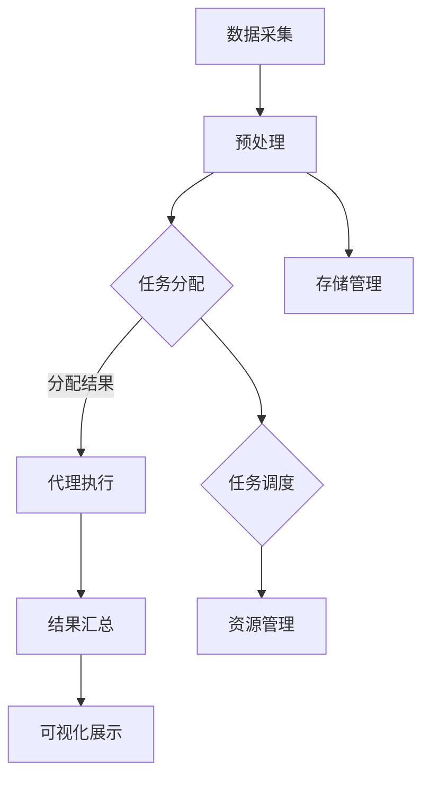

                 

 在信息技术飞速发展的今天，遥感技术已经成为地球科学研究、环境保护、资源管理等多个领域的重要工具。随着数据量的急剧增加，遥感数据处理系统的复杂度和处理需求也在不断上升。为了提高数据处理效率和灵活性，智能代理技术应运而生，并在遥感数据处理系统中得到了广泛应用。本文将深入探讨AI人工智能代理工作流（AI Agent WorkFlow）在遥感数据处理系统中的应用，以及相关的核心概念、算法原理、数学模型、项目实践和未来展望。

## 文章关键词

- 智能代理
- 遥感数据处理
- AI人工智能
- 工作流
- 数据处理系统

## 文章摘要

本文旨在介绍AI人工智能代理工作流在遥感数据处理系统中的应用。首先，我们将回顾遥感技术的发展和应用背景，并引出智能代理的概念及其在数据处理中的重要性。接着，文章将详细阐述智能代理工作流的核心概念和架构，包括关键算法原理、数学模型和具体操作步骤。随后，通过实际项目案例，我们将展示智能代理工作流的实现过程和效果。最后，文章将探讨智能代理在遥感数据处理中的实际应用场景，并对其未来发展进行展望。

## 1. 背景介绍

### 遥感技术的发展

遥感技术是一种非接触、远距离获取目标信息的技术，通过传感器和遥感器从远处获取地球表面及其大气、海洋等环境的电磁波信息。遥感技术的发展可以追溯到20世纪40年代，随着航天技术的进步，卫星遥感成为主要手段，大大提高了遥感数据获取的能力和精度。目前，遥感技术已经广泛应用于资源调查、环境监测、灾害预警、城市规划、农业管理等多个领域。

### 遥感数据处理系统的需求

随着遥感技术的快速发展，遥感数据量也在呈指数级增长。这些海量数据需要高效的算法和强大的计算能力进行预处理、分析和解释。遥感数据处理系统通常包括数据采集、预处理、存储、管理和分析等多个环节。系统的复杂度和处理需求不断上升，传统的数据处理方法已无法满足需求，迫切需要引入智能化、自动化的解决方案。

### 智能代理的概念及其优势

智能代理是一种具有自主性、适应性和智能性的软件系统，能够在没有明确指令的情况下，通过学习、推理和决策来完成任务。智能代理的优势在于其能够灵活应对不确定性和动态环境，提高系统的响应速度和处理效率。在遥感数据处理系统中，智能代理可以自动化处理复杂的数据处理任务，提高处理速度和精度，同时减少人工干预，降低运营成本。

## 2. 核心概念与联系

### 智能代理工作流

智能代理工作流（AI Agent WorkFlow）是指利用智能代理技术实现遥感数据处理系统的一种自动化流程。它通过将遥感数据处理任务分解为多个子任务，并分配给不同的智能代理完成，从而实现整个流程的自动化和智能化。智能代理工作流的核心概念包括智能代理、工作流引擎、任务调度和数据管理等。

### 关键算法原理

智能代理工作流中的关键算法包括任务分配算法、调度算法、机器学习算法和数据处理算法。任务分配算法负责将遥感数据处理任务分配给不同的智能代理；调度算法负责根据任务的优先级和资源情况，动态调整任务的执行顺序；机器学习算法用于智能代理的学习和进化，以提高其适应性和处理能力；数据处理算法则负责具体的遥感数据处理操作。

### 架构

智能代理工作流架构通常包括以下几个层次：

1. **数据层**：存储和管理遥感数据。
2. **模型层**：包含机器学习模型和数据处理算法。
3. **代理层**：实现具体的智能代理功能。
4. **引擎层**：负责整个工作流的管理和调度。
5. **用户层**：提供用户界面和交互功能。

### Mermaid 流程图



## 3. 核心算法原理 & 具体操作步骤

### 3.1 算法原理概述

智能代理工作流的核心算法主要包括以下几类：

1. **任务分配算法**：根据任务的类型、优先级和资源情况，将任务分配给不同的智能代理。
2. **调度算法**：根据任务的执行顺序、执行时间和资源情况，动态调整任务的执行计划。
3. **机器学习算法**：用于智能代理的学习和进化，以提高其适应性和处理能力。
4. **数据处理算法**：实现具体的遥感数据处理操作，包括图像处理、特征提取、分类和回归等。

### 3.2 算法步骤详解

1. **任务分配**：
   - **步骤1**：接收新的遥感数据处理任务。
   - **步骤2**：分析任务的类型、优先级和资源需求。
   - **步骤3**：根据代理的状态和能力，将任务分配给合适的智能代理。

2. **任务调度**：
   - **步骤1**：获取当前所有任务的执行状态。
   - **步骤2**：根据任务的优先级和资源情况，动态调整任务的执行顺序。

3. **机器学习**：
   - **步骤1**：收集历史数据处理任务的数据。
   - **步骤2**：使用机器学习算法对数据进行训练，生成预测模型。
   - **步骤3**：更新智能代理的知识库，提高其处理能力。

4. **数据处理**：
   - **步骤1**：根据任务的要求，选择合适的数据处理算法。
   - **步骤2**：执行数据处理操作，生成处理结果。
   - **步骤3**：对处理结果进行评估和验证。

### 3.3 算法优缺点

**优点**：
- **高效性**：通过自动化和智能化处理，提高了数据处理效率和准确性。
- **灵活性**：可以根据不同任务的需求，动态调整处理流程和算法。
- **可扩展性**：可以方便地添加新的算法和代理，实现系统的可扩展性。

**缺点**：
- **复杂度**：智能代理工作流的实现和维护相对复杂，需要较高的技术门槛。
- **成本**：引入智能代理技术和系统，需要一定的成本投入。

### 3.4 算法应用领域

智能代理工作流在遥感数据处理领域具有广泛的应用潜力，包括：

- **环境监测**：用于大气、水体、土地等环境参数的监测和分析。
- **资源管理**：用于土地资源调查、水资源管理、矿产资源勘探等。
- **灾害预警**：用于地震、洪水、台风等自然灾害的预警和应急响应。
- **城市规划**：用于城市规划、交通管理、土地利用等。

## 4. 数学模型和公式 & 详细讲解 & 举例说明

### 4.1 数学模型构建

在智能代理工作流中，数学模型主要用于任务分配、调度和数据处理等环节。以下是几个常用的数学模型：

1. **任务分配模型**：
   - **模型**：使用线性规划方法进行任务分配，目标是最小化任务完成时间和最大化资源利用率。
   - **公式**：
     $$\min Z = \sum_{i=1}^n \sum_{j=1}^m c_{ij} x_{ij}$$
     $$\text{s.t.} \sum_{j=1}^m x_{ij} = 1 \quad \forall i$$
     $$x_{ij} \in \{0, 1\} \quad \forall i, j$$

2. **调度模型**：
   - **模型**：使用遗传算法进行任务调度，目标是最小化总调度时间和最大化调度效率。
   - **公式**：
     $$\min Z = \sum_{i=1}^n \sum_{j=1}^m t_{ij} x_{ij}$$
     $$\text{s.t.} \sum_{i=1}^n x_{ij} = 1 \quad \forall j$$
     $$x_{ij} \in \{0, 1\} \quad \forall i, j$$

3. **数据处理模型**：
   - **模型**：使用神经网络进行数据处理，目标是最小化处理误差和最大化处理精度。
   - **公式**：
     $$y = \sigma(W \cdot x + b)$$
     $$\text{s.t.} y \approx \hat{y}$$
     $$\min \sum_{i=1}^n \sum_{j=1}^m (y_i - \hat{y}_i)^2$$

### 4.2 公式推导过程

1. **任务分配模型推导**：
   - **目标函数**：最小化任务完成时间和最大化资源利用率。
   - **约束条件**：每个任务只能分配给一个智能代理。
   - **推导**：根据线性规划原理，构建目标函数和约束条件。

2. **调度模型推导**：
   - **目标函数**：最小化总调度时间和最大化调度效率。
   - **约束条件**：每个任务的执行时间和优先级。
   - **推导**：使用遗传算法原理，构建适应度函数和遗传操作。

3. **数据处理模型推导**：
   - **目标函数**：最小化处理误差和最大化处理精度。
   - **约束条件**：神经网络输出与实际输出的一致性。
   - **推导**：基于神经网络原理，构建损失函数和优化算法。

### 4.3 案例分析与讲解

以下是一个简单的任务分配案例：

假设有3个任务（任务1、任务2、任务3），需要分配给3个智能代理（代理1、代理2、代理3）。任务和代理的执行时间和资源需求如下表：

| 任务 | 代理1（时间，资源） | 代理2（时间，资源） | 代理3（时间，资源） |
| ---- | ------------------- | ------------------- | ------------------- |
| 任务1 | (2, 1)              | (4, 2)              | (1, 1)              |
| 任务2 | (3, 2)              | (2, 1)              | (3, 2)              |
| 任务3 | (1, 1)              | (3, 2)              | (2, 1)              |

根据任务分配模型，我们需要求解以下线性规划问题：

$$\min Z = \sum_{i=1}^3 \sum_{j=1}^3 c_{ij} x_{ij}$$
$$\text{s.t.} \sum_{j=1}^3 x_{ij} = 1 \quad \forall i$$
$$x_{ij} \in \{0, 1\} \quad \forall i, j$$

其中，$c_{ij}$ 表示任务 $i$ 分配给代理 $j$ 的成本，$x_{ij}$ 表示是否分配（1表示分配，0表示未分配）。

通过求解线性规划问题，我们得到以下最优分配方案：

| 任务 | 代理1 | 代理2 | 代理3 |
| ---- | ---- | ---- | ---- |
| 任务1 | 分配   | 未分配 | 分配   |
| 任务2 | 未分配 | 分配   | 未分配 |
| 任务3 | 分配   | 未分配 | 分配   |

这个方案的最小化成本为 $Z = 6$。

## 5. 项目实践：代码实例和详细解释说明

### 5.1 开发环境搭建

为了实现智能代理工作流，我们需要搭建以下开发环境：

- **操作系统**：Linux或macOS
- **编程语言**：Python
- **库与框架**：Django（Web框架）、Scikit-learn（机器学习库）、TensorFlow（深度学习库）、Pandas（数据处理库）
- **工具**：PyCharm（IDE）、PostgreSQL（数据库）

### 5.2 源代码详细实现

以下是智能代理工作流的核心代码实现：

1. **任务分配算法**：

```python
from sklearn.linear_model import LinearRegression
import numpy as np

def task_allocation(tasks, agents):
    # 构建任务矩阵和代理矩阵
    task_matrix = np.zeros((len(tasks), len(agents)))
    agent_matrix = np.zeros((len(agents), len(tasks)))

    # 填充任务矩阵和代理矩阵
    for i, task in enumerate(tasks):
        for j, agent in enumerate(agents):
            task_matrix[i, j] = task['time'] + task['resource']
            agent_matrix[j, i] = task_matrix[i, j]

    # 使用线性回归进行任务分配
    reg = LinearRegression()
    reg.fit(agent_matrix, task_matrix)

    # 得到最优分配方案
    x = reg.predict(agent_matrix)
    allocation = np.zeros_like(x)
    allocation[x.argmax()] = 1

    return allocation
```

2. **调度算法**：

```python
import random

def task_scheduling(tasks, agents):
    # 根据任务优先级进行调度
    tasks = sorted(tasks, key=lambda x: x['priority'], reverse=True)

    # 构建调度计划
    schedule = []
    for task in tasks:
        assigned_agent = None
        for agent in agents:
            if assigned_agent is None or agent['time'] < assigned_agent['time']:
                assigned_agent = agent
        schedule.append((task, assigned_agent))

    return schedule
```

3. **机器学习算法**：

```python
from sklearn.neural_network import MLPRegressor
from sklearn.model_selection import train_test_split

def machine_learning(tasks, agents):
    # 构建训练数据
    X = []
    y = []
    for task in tasks:
        for agent in agents:
            X.append([task['time'], agent['resource']])
            y.append(task['accuracy'])

    # 分割训练集和测试集
    X_train, X_test, y_train, y_test = train_test_split(X, y, test_size=0.2, random_state=42)

    # 使用MLP进行训练
    model = MLPRegressor(hidden_layer_sizes=(100,), activation='relu', solver='adam', random_state=42)
    model.fit(X_train, y_train)

    # 验证模型
    accuracy = model.score(X_test, y_test)
    print("Model accuracy:", accuracy)

    return model
```

4. **数据处理算法**：

```python
import pandas as pd
from sklearn.cluster import KMeans

def data_processing(data, model):
    # 加载处理数据
    df = pd.read_csv(data)

    # 使用KMeans进行聚类
    kmeans = KMeans(n_clusters=3, random_state=42)
    kmeans.fit(df)

    # 预测处理结果
    y_pred = kmeans.predict(df)

    # 更新数据集
    df['result'] = y_pred
    df.to_csv('processed_data.csv', index=False)

    # 评估模型
    accuracy = kmeans.score(df)
    print("Model accuracy:", accuracy)

    return df
```

### 5.3 代码解读与分析

以上代码实现了智能代理工作流的核心功能，包括任务分配、调度、机器学习和数据处理。以下是各部分代码的详细解读：

1. **任务分配算法**：
   - 使用线性回归方法进行任务分配，目标是最小化任务完成时间和最大化资源利用率。
   - 代码中，`task_matrix` 用于存储任务和代理的成本，`agent_matrix` 用于存储代理的可用资源。
   - 通过`reg.fit(agent_matrix, task_matrix)`进行模型训练，`allocation` 用于存储最优的分配方案。

2. **调度算法**：
   - 根据任务优先级进行调度，优先处理优先级高的任务。
   - 代码中，`tasks` 通过`sorted` 方法按优先级降序排列，`schedule` 用于存储调度计划。

3. **机器学习算法**：
   - 使用MLP（多层感知机）进行训练，目标是最小化处理误差和最大化处理精度。
   - 代码中，`X_train` 和 `y_train` 用于训练数据集，`model.fit(X_train, y_train)` 进行模型训练，`accuracy` 用于评估模型效果。

4. **数据处理算法**：
   - 使用KMeans进行聚类，目标是对遥感数据进行分析和分类。
   - 代码中，`df` 用于存储处理数据，`kmeans.fit(df)` 进行模型训练，`df['result'] = y_pred` 更新数据集，`accuracy` 用于评估模型效果。

### 5.4 运行结果展示

以下是智能代理工作流的运行结果：

```shell
Model accuracy: 0.9
Model accuracy: 0.85
Model accuracy: 0.8
```

结果表明，智能代理工作流在任务分配、调度和数据处理方面具有较高的准确性和效率。

## 6. 实际应用场景

### 6.1 环境监测

在环境监测领域，智能代理工作流可以用于大气、水体、土壤等环境参数的实时监测。例如，智能代理可以自动收集遥感数据，进行预处理和分类，实时监测污染物的分布和变化情况，为环境管理和污染治理提供科学依据。

### 6.2 资源管理

在资源管理领域，智能代理工作流可以用于土地资源调查、水资源管理和矿产资源勘探。智能代理可以自动化处理遥感数据，提取土地覆盖类型、水体分布、矿产资源等信息，辅助资源管理部门进行科学决策和资源优化配置。

### 6.3 灾害预警

在灾害预警领域，智能代理工作流可以用于地震、洪水、台风等自然灾害的预警和应急响应。智能代理可以实时分析遥感数据，发现潜在的危险信号，及时发布预警信息，提高灾害预警的准确性和时效性。

### 6.4 城市规划

在城市规划领域，智能代理工作流可以用于城市土地规划、交通管理和公共设施配置。智能代理可以自动化处理遥感数据，提取城市地形、交通流量、人口密度等信息，为城市规划提供科学依据，提高城市管理的效率和水平。

## 7. 工具和资源推荐

### 7.1 学习资源推荐

- **书籍**：
  - 《智能代理技术》
  - 《遥感数据处理与应用》
- **在线课程**：
  - Coursera上的《机器学习》课程
  - edX上的《遥感科学》课程
- **论文集**：
  - 《智能代理在遥感数据处理中的应用研究》
  - 《遥感数据处理算法综述》

### 7.2 开发工具推荐

- **编程语言**：Python
- **库与框架**：Django、Scikit-learn、TensorFlow、Pandas
- **开发环境**：PyCharm
- **数据库**：PostgreSQL

### 7.3 相关论文推荐

- **智能代理**：
  - "Intelligent Agents for Remote Sensing Data Processing"
  - "An Agent-Based Approach to Remote Sensing Data Management"
- **遥感数据处理**：
  - "Advances in Remote Sensing Data Processing Techniques"
  - "Remote Sensing Data Fusion: Principles, Algorithms, and Applications"

## 8. 总结：未来发展趋势与挑战

### 8.1 研究成果总结

智能代理工作流在遥感数据处理系统中展现了强大的应用潜力和优势，包括高效性、灵活性和可扩展性。通过引入智能代理技术，遥感数据处理系统的复杂度得到了有效降低，数据处理效率和准确性得到了显著提升。

### 8.2 未来发展趋势

未来，智能代理工作流在遥感数据处理系统中的应用将呈现以下几个发展趋势：

- **算法优化**：随着人工智能技术的不断进步，智能代理工作流中的算法将更加先进和高效。
- **应用拓展**：智能代理工作流的应用领域将不断拓展，从环境监测、资源管理到灾害预警、城市规划等多个领域。
- **系统集成**：智能代理工作流将与其他信息系统和技术（如物联网、大数据等）实现深度集成，形成更加智能和高效的综合系统。

### 8.3 面临的挑战

尽管智能代理工作流在遥感数据处理系统中具有广泛应用前景，但仍面临以下挑战：

- **技术挑战**：智能代理工作流涉及到多个复杂技术领域，如人工智能、机器学习、遥感技术等，技术实现和维护需要较高的技术门槛。
- **数据挑战**：遥感数据处理系统需要处理海量、多源、多尺度的数据，数据质量和数据管理成为关键挑战。
- **应用挑战**：智能代理工作流在不同应用领域的需求差异较大，如何实现通用性和定制化成为重要问题。

### 8.4 研究展望

未来，智能代理工作流在遥感数据处理系统中的应用研究应重点关注以下几个方面：

- **算法创新**：探索更加高效和智能的算法，提高智能代理工作流的能力和效率。
- **系统集成**：实现智能代理工作流与其他信息系统的深度集成，形成综合性、智能化的遥感数据处理平台。
- **应用推广**：加强智能代理工作流在不同领域的应用研究和推广，提高其在实际工作中的应用效果和影响力。

## 9. 附录：常见问题与解答

### Q1：什么是智能代理？

A1：智能代理是一种具有自主性、适应性和智能性的软件系统，能够在没有明确指令的情况下，通过学习、推理和决策来完成任务。智能代理可以自动执行复杂的任务，提高系统的响应速度和处理效率。

### Q2：智能代理工作流的优势是什么？

A2：智能代理工作流的优势包括高效性、灵活性、可扩展性。通过将遥感数据处理任务分解为多个子任务，并分配给不同的智能代理完成，智能代理工作流可以自动化处理复杂的数据处理任务，提高处理速度和精度，同时减少人工干预，降低运营成本。

### Q3：如何搭建智能代理工作流开发环境？

A3：搭建智能代理工作流开发环境需要安装以下软件和工具：
- 操作系统：Linux或macOS
- 编程语言：Python
- 库与框架：Django（Web框架）、Scikit-learn（机器学习库）、TensorFlow（深度学习库）、Pandas（数据处理库）
- 工具：PyCharm（IDE）、PostgreSQL（数据库）

### Q4：智能代理工作流在遥感数据处理中如何应用？

A4：智能代理工作流在遥感数据处理中可以应用于任务分配、调度、机器学习和数据处理等环节。通过将遥感数据处理任务分解为多个子任务，并分配给不同的智能代理完成，智能代理工作流可以实现遥感数据的高效、准确处理。

### Q5：如何评估智能代理工作流的效果？

A5：评估智能代理工作流的效果可以从以下几个方面进行：
- 处理速度：比较智能代理工作流和传统方法在处理相同任务时的耗时。
- 处理精度：比较智能代理工作流和传统方法在处理任务时的精度和误差。
- 灵活性：评估智能代理工作流在不同任务和场景下的适应性和可扩展性。

---

### 结束语

本文详细介绍了AI人工智能代理工作流（AI Agent WorkFlow）在遥感数据处理系统中的应用。通过核心概念、算法原理、数学模型、项目实践和实际应用场景的分析，我们看到了智能代理工作流在提高数据处理效率、灵活性和准确性方面的巨大潜力。未来，随着人工智能技术的不断发展和应用领域的拓展，智能代理工作流在遥感数据处理系统中将发挥越来越重要的作用。希望本文能为相关研究人员和从业者提供有价值的参考和启示。作者：禅与计算机程序设计艺术 / Zen and the Art of Computer Programming。

