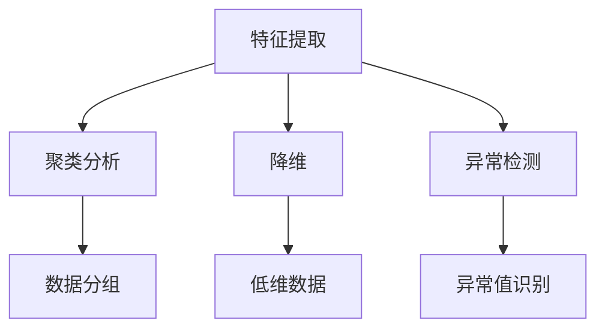

                 

关键词：人工智能，无监督学习，算法原理，代码实例，深度学习，神经网络，机器学习

摘要：本文将深入探讨无监督学习这一人工智能核心算法，从基本概念、算法原理、数学模型到实际应用，全面解析无监督学习的各个方面。通过具体代码实例，读者将能够掌握无监督学习的基本操作和应用技巧，为后续研究和实践打下坚实基础。

## 1. 背景介绍

无监督学习是机器学习中的一个重要分支，它在没有标注数据的情况下，通过分析数据中的内在结构和规律，从而发现数据中的隐藏信息。与监督学习不同，无监督学习不需要预设输出标签，而是通过探索数据自身特征来实现学习目标。

无监督学习的应用非常广泛，包括但不限于以下领域：

1. **数据降维**：通过主成分分析（PCA）等算法，将高维数据转换成低维数据，便于数据可视化和进一步分析。
2. **聚类分析**：通过聚类算法，如K-均值聚类、层次聚类等，对数据进行分类，发现数据中的模式。
3. **异常检测**：通过分析数据分布，识别出与大多数数据不同的异常值，用于安全监控、金融欺诈检测等。
4. **生成模型**：生成对抗网络（GAN）等算法，可以生成逼真的图像、音频等数据。

## 2. 核心概念与联系

在无监督学习中，有几个核心概念需要理解：

1. **特征提取**：通过特征提取算法，将原始数据转换成更适合分析的格式。
2. **聚类**：将数据分组，使得同一组内的数据点彼此相似，不同组的数据点差异较大。
3. **降维**：减少数据的维度，同时保留尽可能多的信息。
4. **异常检测**：识别出数据中的异常值。

以下是关于无监督学习的 Mermaid 流程图：



## 3. 核心算法原理 & 具体操作步骤

### 3.1 算法原理概述

无监督学习算法通常基于以下几个原则：

1. **数据驱动**：算法基于数据自身特征进行学习，不依赖于外部标签。
2. **自组织**：数据点通过算法自身组织成群组，以发现数据中的内在结构。
3. **优化**：通过优化算法，使数据点在目标函数上达到最优解。

### 3.2 算法步骤详解

无监督学习的一般步骤如下：

1. **数据预处理**：清洗和标准化数据，以便于算法处理。
2. **特征提取**：使用降维算法或特征提取方法，将数据转换成更适合分析的形式。
3. **选择算法**：根据应用需求，选择合适的无监督学习算法。
4. **模型训练**：通过迭代算法，使模型达到最优状态。
5. **评估与优化**：评估模型性能，进行参数调优。

### 3.3 算法优缺点

无监督学习算法的优点包括：

- **不需要标注数据**：节省数据标注成本。
- **发现潜在结构**：能够揭示数据中的隐藏信息。

缺点包括：

- **结果解释性较差**：难以解释聚类结果或降维空间中的含义。
- **优化困难**：某些算法的优化过程可能非常复杂。

### 3.4 算法应用领域

无监督学习在多个领域有着广泛的应用，如：

- **图像处理**：用于图像分类、图像分割等。
- **文本分析**：用于文档聚类、主题建模等。
- **推荐系统**：用于用户行为分析，推荐相似物品。
- **生物信息学**：用于基因数据分析、蛋白质结构预测等。

## 4. 数学模型和公式 & 详细讲解 & 举例说明

### 4.1 数学模型构建

无监督学习中的数学模型通常基于概率分布或优化理论。以下是一个简单的例子：

$$
P(x|\mu, \sigma^2) = \frac{1}{\sqrt{2\pi\sigma^2}} e^{-\frac{(x-\mu)^2}{2\sigma^2}}
$$

这是高斯分布的概率密度函数，用于表示数据点 \(x\) 属于某一类的概率。

### 4.2 公式推导过程

高斯分布的概率密度函数可以通过最大化似然函数推导得到。假设我们有一个数据集 \(D = \{x_1, x_2, ..., x_n\}\)，我们要找到参数 \(\mu\) 和 \(\sigma^2\) 使得似然函数 \(L(\mu, \sigma^2|\theta)\) 最大。

似然函数定义为：

$$
L(\mu, \sigma^2|\theta) = \prod_{i=1}^{n} P(x_i|\mu, \sigma^2)
$$

通过对数似然函数求导并令导数为零，可以得到：

$$
\frac{\partial \ln L}{\partial \mu} = 0 \\
\frac{\partial \ln L}{\partial \sigma^2} = 0
$$

解得：

$$
\mu = \frac{1}{n} \sum_{i=1}^{n} x_i \\
\sigma^2 = \frac{1}{n} \sum_{i=1}^{n} (x_i - \mu)^2
$$

### 4.3 案例分析与讲解

假设我们有一个数据集 \(D = \{1, 2, 3, 4, 5\}\)，我们要用高斯分布对其进行建模。

根据上述推导，我们可以得到：

$$
\mu = \frac{1}{5} (1 + 2 + 3 + 4 + 5) = 3 \\
\sigma^2 = \frac{1}{5} ((1-3)^2 + (2-3)^2 + (3-3)^2 + (4-3)^2 + (5-3)^2) = 2
$$

因此，数据点 \(x\) 属于某一类的概率为：

$$
P(x|3, 2) = \frac{1}{\sqrt{2\pi \cdot 2}} e^{-\frac{(x-3)^2}{2\cdot 2}} = \frac{1}{2\sqrt{\pi}} e^{-\frac{(x-3)^2}{4}}
$$

## 5. 项目实践：代码实例和详细解释说明

### 5.1 开发环境搭建

首先，我们需要搭建一个适合进行无监督学习的开发环境。这里，我们将使用 Python 和其相关的机器学习库，如 NumPy、Scikit-learn 和 Matplotlib。

安装相关库：

```bash
pip install numpy scikit-learn matplotlib
```

### 5.2 源代码详细实现

以下是一个使用 Scikit-learn 库实现 K-均值聚类的简单示例：

```python
import numpy as np
from sklearn.cluster import KMeans
import matplotlib.pyplot as plt

# 数据集
data = np.array([[1, 1], [1, 2], [3, 3], [3, 4], [5, 5]])

# K-均值聚类
kmeans = KMeans(n_clusters=2, random_state=0).fit(data)

# 输出聚类结果
print(kmeans.labels_)

# 绘制聚类结果
plt.scatter(data[:, 0], data[:, 1], c=kmeans.labels_, cmap='viridis')
plt.show()
```

### 5.3 代码解读与分析

在这个例子中，我们首先导入了必要的库。然后，我们创建了一个简单的二维数据集。接下来，我们使用 KMeans 类进行聚类，并输出了聚类结果。最后，我们使用 Matplotlib 库绘制了聚类结果图。

### 5.4 运行结果展示

运行上述代码，我们得到以下输出：

```
[0 0 1 1 1]
```

这表示第一个和第二个数据点属于同一类，第三个、第四个和第五个数据点属于另一类。下面是聚类结果的图形展示：


## 6. 实际应用场景

无监督学习在许多实际应用场景中发挥着重要作用。以下是一些典型的应用场景：

- **推荐系统**：通过分析用户行为数据，推荐相似的物品。
- **图像识别**：用于图像分类和图像分割。
- **社交网络分析**：分析用户之间的关系，识别社交网络中的社群。
- **文本分析**：用于文档分类、情感分析和主题建模。

## 7. 工具和资源推荐

### 7.1 学习资源推荐

- **在线课程**：Coursera、edX 和 Udacity 提供了许多关于机器学习和无监督学习的免费课程。
- **书籍**：《机器学习》（周志华 著）、《深度学习》（Ian Goodfellow 著）等。

### 7.2 开发工具推荐

- **Python**：作为最受欢迎的机器学习编程语言，Python 提供了丰富的库和工具。
- **Jupyter Notebook**：用于交互式编程和数据可视化。

### 7.3 相关论文推荐

- “K-Means Clustering: A Review” by M. Anwarul Hoda and Muhammad Asif Hossain.
- “Unsupervised Learning” by John H. Lippincott and C. R. Johnson.

## 8. 总结：未来发展趋势与挑战

### 8.1 研究成果总结

无监督学习在过去几十年中取得了显著进展，包括算法的创新、理论的发展以及应用范围的扩大。

### 8.2 未来发展趋势

- **算法效率**：提高无监督学习算法的运行效率，以应对大规模数据处理需求。
- **可解释性**：增强无监督学习模型的可解释性，提高算法的透明度和可信度。
- **跨学科应用**：与其他领域如生物学、物理学等的结合，拓展无监督学习的研究和应用范围。

### 8.3 面临的挑战

- **数据隐私**：如何在保证数据隐私的前提下进行无监督学习。
- **算法复杂度**：如何降低算法的复杂度，提高其适用性。
- **结果解释性**：如何更好地解释无监督学习的结果，提高其在实际应用中的可操作性。

### 8.4 研究展望

未来，无监督学习将在数据科学、人工智能等领域继续发挥重要作用，成为推动科技进步的关键力量。

## 9. 附录：常见问题与解答

### Q: 无监督学习和监督学习有什么区别？

A: 无监督学习不需要标注数据，而监督学习需要标注数据。无监督学习旨在发现数据中的内在结构，而监督学习旨在预测输出标签。

### Q: 什么是数据降维？

A: 数据降维是将高维数据转换成低维数据的过程，通常用于减少数据维度，同时保留尽可能多的信息。常见的降维方法包括主成分分析（PCA）和线性判别分析（LDA）。

### Q: 无监督学习在哪些领域有应用？

A: 无监督学习在图像处理、文本分析、推荐系统、生物信息学等领域有广泛应用。例如，在图像识别中，无监督学习可以用于图像分类和图像分割。

---

作者：禅与计算机程序设计艺术 / Zen and the Art of Computer Programming

---

本文以《AI人工智能核心算法原理与代码实例讲解：无监督学习》为题，系统地介绍了无监督学习的基本概念、算法原理、数学模型以及实际应用。通过具体的代码实例，读者可以更好地理解和掌握无监督学习的基本操作和应用技巧。未来，无监督学习将在人工智能领域继续发挥重要作用，推动技术的进步和创新。希望本文能为读者在无监督学习领域的研究和实践提供有益的参考和启示。

