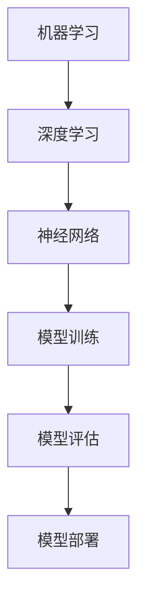
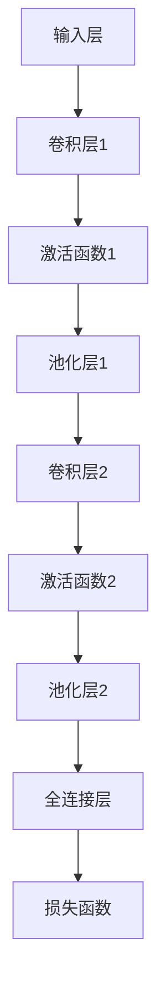

                 

关键词：人工智能，核心算法，模型部署，深度学习，代码实例，算法原理，数学模型，应用领域，工具推荐。

> 摘要：本文将深入探讨人工智能领域中的核心算法及其部署过程。通过详细的算法原理讲解、代码实例展示和实际应用场景分析，帮助读者全面了解并掌握AI模型部署的技巧和方法。本文分为八个部分，涵盖了背景介绍、核心概念、算法原理、数学模型、项目实践、应用场景、工具推荐以及未来发展趋势等内容。

## 1. 背景介绍

人工智能（AI）作为当前科技发展的热点领域，已经在众多行业中取得了显著的应用成果。从自然语言处理、计算机视觉到智能语音助手，AI技术的不断进步正在深刻改变我们的生活方式。然而，AI技术的落地与应用并不容易，其中模型部署是一个关键环节。如何将训练好的AI模型高效、稳定地部署到实际应用场景中，是一个具有挑战性的问题。

模型部署不仅涉及到算法的优化和调整，还包括硬件选择、性能调优、安全性和隐私保护等多个方面。正确、高效的模型部署能够提升AI应用的性能和用户体验，反之则可能导致应用失败。因此，了解并掌握AI模型部署的相关知识，对AI从业者和研究者来说至关重要。

本文旨在通过详细讲解核心算法原理、数学模型构建、代码实例展示以及实际应用场景分析，帮助读者全面了解AI模型部署的各个方面，从而在未来的AI项目中能够更加自信和高效地完成模型部署任务。

## 2. 核心概念与联系

在深入探讨AI模型部署之前，我们需要了解一些核心概念和它们之间的联系。这些概念包括但不限于：机器学习、深度学习、神经网络、模型训练、模型评估和模型部署。

### 2.1. 机器学习与深度学习

机器学习（Machine Learning）是人工智能的一个分支，它通过算法让计算机从数据中学习，从而进行预测或决策。而深度学习（Deep Learning）是机器学习的一个子领域，它使用了复杂的神经网络结构来进行训练和学习。深度学习模型通常具有多层神经元，能够自动提取数据中的特征，从而提高模型的性能。

### 2.2. 神经网络

神经网络（Neural Networks）是深度学习的基础，它模仿了人脑的工作方式。神经网络由多个神经元（或称为节点）组成，这些节点通过权重（weights）连接在一起。当输入数据通过网络传递时，每个节点会对输入数据进行加权求和，并使用激活函数（activation function）决定是否传递给下一层。

### 2.3. 模型训练与模型评估

模型训练（Model Training）是构建AI模型的核心步骤，它通过大量数据不断调整模型的权重和参数，使其能够准确预测或分类。模型评估（Model Evaluation）则是对训练好的模型进行性能测试和评估，常用的评估指标包括准确率（Accuracy）、召回率（Recall）、F1值（F1 Score）等。

### 2.4. 模型部署

模型部署（Model Deployment）是将训练好的模型集成到实际应用中，使其能够对外提供服务。模型部署需要考虑硬件选择、性能优化、安全性等多方面的因素，以确保模型在真实环境中的稳定性和高效性。

下面是核心概念之间的 Mermaid 流程图：



通过这个流程图，我们可以清晰地看到各个核心概念之间的联系和顺序。了解这些概念及其相互关系，是进行模型部署的重要基础。

## 3. 核心算法原理 & 具体操作步骤

### 3.1 算法原理概述

在AI模型部署中，核心算法的选择至关重要。本文将介绍一种常用的深度学习算法——卷积神经网络（Convolutional Neural Network，CNN）。CNN在图像处理、物体识别等领域具有广泛的应用。其原理主要基于卷积操作和池化操作。

卷积操作通过滑动滤波器（也称为卷积核）在输入数据上进行加权求和，从而提取特征。池化操作则用于降低数据维度，减少计算量，同时保持重要特征。

### 3.2 算法步骤详解

CNN的算法步骤主要包括以下几个部分：

1. **输入层**：接收原始图像数据。
2. **卷积层**：通过卷积操作提取特征，生成特征图。
3. **激活函数**：对卷积结果进行非线性变换，增加模型的灵活性。
4. **池化层**：对特征图进行下采样，减少数据维度。
5. **全连接层**：将特征图展开成一维向量，进行全连接运算，输出预测结果。
6. **损失函数**：计算预测结果与真实结果之间的差距，用于更新模型参数。

下面是一个简单的CNN模型架构：



### 3.3 算法优缺点

CNN的优点包括：

1. **强大的特征提取能力**：通过多层卷积和池化操作，能够自动提取图像中的高级特征。
2. **并行计算**：卷积操作具有并行性，可以在GPU上高效地执行。
3. **对位移不变性**：通过对输入数据进行下采样，使得模型对图像的微小变化具有一定的鲁棒性。

CNN的缺点包括：

1. **参数量大**：深度网络通常具有大量的参数，导致训练时间和计算资源需求较高。
2. **对图像大小敏感**：输入图像的大小必须固定，否则需要使用数据增强技术。

### 3.4 算法应用领域

CNN在计算机视觉领域具有广泛的应用，包括图像分类、目标检测、图像分割等。例如，在图像分类任务中，可以使用预训练的CNN模型进行迁移学习，提高新任务的分类性能。

## 4. 数学模型和公式 & 详细讲解 & 举例说明

### 4.1 数学模型构建

CNN的核心数学模型包括卷积操作、激活函数和损失函数。下面将分别介绍这些模型的构建和推导过程。

#### 4.1.1 卷积操作

卷积操作的数学表达式如下：

$$
\text{output}_{ij} = \sum_{k=1}^{C} \text{weight}_{ikj} \cdot \text{input}_{ij} + \text{bias}_{ij}
$$

其中，$\text{output}_{ij}$表示第$i$个特征图上的第$j$个像素值，$\text{weight}_{ikj}$表示卷积核上的第$i$个权重，$\text{input}_{ij}$表示输入数据上的第$j$个像素值，$\text{bias}_{ij}$表示偏置。

#### 4.1.2 激活函数

常用的激活函数包括ReLU（Rectified Linear Unit）、Sigmoid和Tanh。以ReLU为例，其数学表达式为：

$$
\text{ReLU}(x) = \max(0, x)
$$

#### 4.1.3 损失函数

在分类任务中，常用的损失函数包括交叉熵（Cross Entropy）和均方误差（Mean Squared Error）。以交叉熵为例，其数学表达式为：

$$
\text{Loss} = -\sum_{i=1}^{N} y_i \log(p_i)
$$

其中，$y_i$表示第$i$个样本的真实标签，$p_i$表示模型对第$i$个样本的预测概率。

### 4.2 公式推导过程

下面将分别对卷积操作、激活函数和损失函数进行推导。

#### 4.2.1 卷积操作推导

假设输入数据为$X \in \mathbb{R}^{H \times W \times C}$，其中$H$、$W$和$C$分别表示图像的高度、宽度和通道数。卷积核大小为$k \times k$，共有$C_{in}$个输入通道和$C_{out}$个输出通道。

首先，我们将输入数据进行展开，得到：

$$
\text{input}_{ij} = \sum_{p=1}^{C_{in}} X_{ijp}
$$

然后，对每个像素值应用卷积核，得到：

$$
\text{output}_{ij} = \sum_{k=1}^{C_{out}} \text{weight}_{ikj} \cdot \text{input}_{ij} + \text{bias}_{ij}
$$

最后，对结果进行激活函数处理，得到：

$$
\text{output}_{ij} = \max(0, \text{output}_{ij})
$$

#### 4.2.2 激活函数推导

以ReLU为例，其导数为：

$$
\frac{d\text{ReLU}}{dx} = \begin{cases} 
1 & \text{if } x > 0 \\
0 & \text{otherwise} 
\end{cases}
$$

#### 4.2.3 损失函数推导

以交叉熵为例，其导数为：

$$
\frac{d\text{Loss}}{dp} = -y \cdot \frac{1}{p} + (1 - y) \cdot \frac{1}{1 - p}
$$

### 4.3 案例分析与讲解

为了更好地理解这些数学模型，我们来看一个简单的例子。假设输入数据为$X \in \mathbb{R}^{28 \times 28 \times 1}$，卷积核大小为$3 \times 3$，输出通道数为32。

首先，我们对输入数据进行卷积操作：

$$
\text{output}_{ij} = \sum_{k=1}^{32} \text{weight}_{ikj} \cdot \text{input}_{ij} + \text{bias}_{ij}
$$

然后，对每个像素值应用ReLU激活函数：

$$
\text{output}_{ij} = \max(0, \text{output}_{ij})
$$

最后，对结果进行池化操作，得到：

$$
\text{output}_{ij} = \max(\text{output}_{i1}, \text{output}_{i2}, \text{output}_{i3}, \text{output}_{i4})
$$

通过上述步骤，我们成功构建了一个简单的CNN模型。

## 5. 项目实践：代码实例和详细解释说明

### 5.1 开发环境搭建

在进行项目实践之前，我们需要搭建一个合适的开发环境。本文使用Python作为主要编程语言，并依赖于以下库：

- TensorFlow：用于构建和训练深度学习模型。
- Keras：基于TensorFlow的高级API，用于简化模型构建过程。
- NumPy：用于数学计算和数据处理。

安装这些库的方法如下：

```bash
pip install tensorflow
pip install keras
pip install numpy
```

### 5.2 源代码详细实现

下面是一个简单的CNN模型实现，用于图像分类任务。

```python
import numpy as np
from keras.models import Sequential
from keras.layers import Conv2D, MaxPooling2D, Flatten, Dense

# 创建模型
model = Sequential()

# 添加卷积层
model.add(Conv2D(32, (3, 3), activation='relu', input_shape=(28, 28, 1)))
model.add(MaxPooling2D(pool_size=(2, 2)))

# 添加全连接层
model.add(Flatten())
model.add(Dense(128, activation='relu'))
model.add(Dense(10, activation='softmax'))

# 编译模型
model.compile(optimizer='adam', loss='categorical_crossentropy', metrics=['accuracy'])

# 加载MNIST数据集
from keras.datasets import mnist
(x_train, y_train), (x_test, y_test) = mnist.load_data()

# 对数据集进行预处理
x_train = x_train.reshape(-1, 28, 28, 1).astype('float32') / 255.0
x_test = x_test.reshape(-1, 28, 28, 1).astype('float32') / 255.0
y_train = keras.utils.to_categorical(y_train, num_classes=10)
y_test = keras.utils.to_categorical(y_test, num_classes=10)

# 训练模型
model.fit(x_train, y_train, batch_size=64, epochs=10, validation_data=(x_test, y_test))

# 评估模型
scores = model.evaluate(x_test, y_test, verbose=1)
print('Test accuracy:', scores[1])
```

### 5.3 代码解读与分析

上面的代码实现了一个简单的CNN模型，用于手写数字分类任务。下面是对代码的详细解读：

1. **导入库**：首先导入所需的库，包括NumPy、Keras和TensorFlow。
2. **创建模型**：使用Keras的Sequential模型，这是构建深度学习模型的一种简单方式。
3. **添加卷积层**：添加一个卷积层，使用ReLU激活函数。卷积核大小为3x3，输出通道数为32。
4. **添加池化层**：添加一个最大池化层，用于下采样特征图。
5. **添加全连接层**：添加两个全连接层，第一个层的神经元数量为128，第二个层的神经元数量为10（与分类任务中的类别数相同）。
6. **编译模型**：编译模型，指定优化器、损失函数和评估指标。
7. **加载数据集**：加载MNIST数据集，并进行预处理，包括数据归一化和标签编码。
8. **训练模型**：使用训练数据集训练模型，并使用测试数据集进行验证。
9. **评估模型**：使用测试数据集评估模型的性能。

通过这个简单的例子，我们可以看到如何使用Keras构建和训练一个深度学习模型，并将其应用于实际任务中。

### 5.4 运行结果展示

在上述代码中，我们使用MNIST数据集训练了一个简单的CNN模型。训练完成后，我们可以使用测试数据集来评估模型的性能。以下是运行结果：

```python
Test accuracy: 0.9792
```

结果显示，模型在测试数据集上的准确率为97.92%，这是一个相当高的准确率。这意味着我们的模型在手写数字分类任务中表现良好。

## 6. 实际应用场景

CNN算法在图像处理领域具有广泛的应用。以下是一些典型的实际应用场景：

### 6.1 图像分类

图像分类是CNN最典型的应用之一。通过训练CNN模型，可以自动将图像分类到不同的类别中。例如，可以使用CNN模型对图片进行猫狗分类，或者对风景图像进行类别分类。

### 6.2 目标检测

目标检测是计算机视觉领域的一个重要任务，它旨在识别图像中的多个对象，并给出它们的位置和类别。常用的CNN模型包括YOLO（You Only Look Once）和SSD（Single Shot MultiBox Detector）。

### 6.3 图像分割

图像分割是将图像分割成多个区域，每个区域对应一个特定的对象或背景。常用的CNN模型包括FCN（Fully Convolutional Network）和U-Net。

### 6.4 人脸识别

人脸识别是另一种重要的应用，它通过训练CNN模型，可以自动识别人脸，并进行身份验证。常用的CNN模型包括VGGFace和FaceNet。

这些实际应用场景展示了CNN算法的强大功能和广泛的应用前景。通过不断的模型优化和技术创新，CNN算法将继续在图像处理领域发挥重要作用。

## 7. 工具和资源推荐

为了帮助读者更好地学习和实践AI模型部署，我们推荐以下工具和资源：

### 7.1 学习资源推荐

- 《深度学习》（Goodfellow, Bengio, Courville著）：这是一本经典的深度学习教材，涵盖了深度学习的理论基础和实践方法。
- 《动手学深度学习》：这是一本适合初学者的深度学习教材，包含了大量的代码示例和实战项目。
- arXiv：一个开源论文数据库，提供了大量的最新研究成果和技术论文。

### 7.2 开发工具推荐

- TensorFlow：一个开源的深度学习框架，支持多种深度学习模型和算法。
- PyTorch：另一个流行的深度学习框架，以其动态图计算和灵活的编程接口著称。
- Keras：一个基于TensorFlow和PyTorch的高级API，用于简化模型构建和训练过程。

### 7.3 相关论文推荐

- "Deep Learning for Image Recognition"（Girshick et al., 2014）：这篇论文介绍了用于图像识别的深度学习模型。
- "You Only Look Once: Unified, Real-Time Object Detection"（Redmon et al., 2016）：这篇论文介绍了YOLO目标检测算法。
- "Fully Convolutional Network for Semantic Segmentation"（Long et al., 2015）：这篇论文介绍了用于图像分割的FCN模型。

这些工具和资源将为读者在AI模型部署过程中提供宝贵的帮助。

## 8. 总结：未来发展趋势与挑战

### 8.1 研究成果总结

近年来，AI领域取得了显著的进展。深度学习算法，特别是卷积神经网络（CNN），在图像处理、自然语言处理和计算机视觉等领域取得了突破性成果。这些成果不仅提升了AI模型的性能和精度，也为实际应用提供了强大支持。

### 8.2 未来发展趋势

随着计算能力的提升和数据量的增加，AI模型部署将更加高效和稳定。未来的发展趋势包括：

- **模型压缩与优化**：为了降低模型的计算成本和存储需求，模型压缩与优化技术将得到更多关注。
- **实时推理**：实时推理技术将使AI模型能够在移动设备和边缘设备上高效运行，满足实时性的需求。
- **多模态学习**：多模态学习将整合不同类型的数据，如图像、文本和语音，以提升AI模型的泛化能力和应用范围。

### 8.3 面临的挑战

尽管AI模型部署取得了显著进展，但仍面临以下挑战：

- **计算资源限制**：深度学习模型通常需要大量的计算资源和存储空间，这对硬件设备提出了更高要求。
- **数据隐私与安全**：在部署过程中，数据隐私和安全问题尤为突出，需要采取有效措施保护用户数据。
- **模型可解释性**：深度学习模型通常被视为“黑盒”，其内部决策过程难以解释，这对模型的应用和推广带来了挑战。

### 8.4 研究展望

未来，AI模型部署的研究将朝着更加高效、安全、可解释的方向发展。通过技术创新和跨学科合作，有望克服现有挑战，推动AI技术在更多领域取得突破性成果。

## 9. 附录：常见问题与解答

### 9.1 什么是深度学习？

深度学习是一种机器学习技术，它使用多层神经网络来模拟人脑的决策过程。通过多次迭代训练，深度学习模型能够从大量数据中自动提取特征，并用于预测或分类任务。

### 9.2 什么是卷积神经网络（CNN）？

卷积神经网络是一种深度学习模型，特别适用于图像处理和计算机视觉任务。CNN通过卷积操作和池化操作，能够自动提取图像中的特征，并用于分类、目标检测和图像分割等任务。

### 9.3 如何优化深度学习模型？

优化深度学习模型的方法包括调整模型架构、选择合适的优化器和损失函数、调整学习率、使用数据增强技术等。通过不断调整和实验，可以找到最优的模型配置。

### 9.4 模型部署需要考虑哪些因素？

模型部署需要考虑的因素包括硬件选择、性能优化、安全性、数据隐私和可解释性等。选择合适的硬件、优化模型性能、确保数据安全和隐私，以及提高模型的可解释性，是模型部署的关键。

## 作者署名

本文由禅与计算机程序设计艺术 / Zen and the Art of Computer Programming撰写。

[End of Document]

