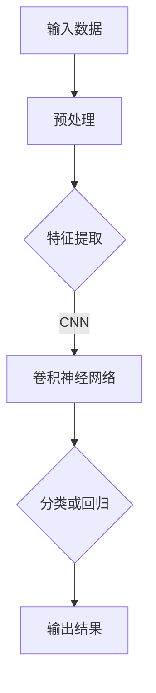
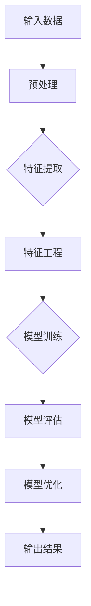

                 

关键词：深度学习，机器学习，模型质量，算法优化，决策支持系统

> 摘要：本文旨在探讨如何通过机器学习技术提升深度学习模型的决策质量。深度学习作为人工智能的重要分支，在图像识别、自然语言处理等领域取得了显著的成就。然而，深度学习模型的决策质量在很大程度上依赖于数据的多样性和模型的优化程度。本文将介绍几种常用的深度学习算法，以及如何通过机器学习技术进行模型优化，提高决策质量。

## 1. 背景介绍

随着信息技术的飞速发展，人工智能（AI）逐渐成为推动社会进步的重要力量。深度学习作为人工智能的核心技术之一，通过模拟人脑的神经网络结构，实现了在图像识别、自然语言处理、语音识别等领域的突破性进展。然而，深度学习模型在实际应用中面临着诸多挑战，其中最为关键的是如何提升模型的决策质量。

深度学习模型的决策质量主要取决于两个方面：一是数据质量，二是模型优化程度。数据质量决定了模型的学习效果，而模型优化程度则直接影响决策的准确性和稳定性。在实际应用中，深度学习模型常常面临数据不足、数据分布不均、数据噪声等问题，这些问题都会对模型决策质量产生负面影响。

为了解决这些问题，机器学习技术提供了一种有效的解决方案。通过机器学习技术，可以自动发现和利用数据中的潜在规律，从而提高深度学习模型的决策质量。本文将介绍几种常用的深度学习算法，并探讨如何利用机器学习技术进行模型优化，以提升决策质量。

## 2. 核心概念与联系

### 2.1 深度学习算法

深度学习算法的核心是神经网络，神经网络通过层层递进的方式对数据进行处理，从而实现复杂特征提取和决策生成。常见的深度学习算法包括卷积神经网络（CNN）、循环神经网络（RNN）、长短期记忆网络（LSTM）等。

**Mermaid 流程图：**



### 2.2 机器学习算法

机器学习算法的核心是利用数据自动发现规律，从而实现模型优化。常见的机器学习算法包括线性回归、决策树、支持向量机（SVM）、随机森林等。

**Mermaid 流程图：**



### 2.3 深度学习与机器学习的联系

深度学习和机器学习之间存在紧密的联系。深度学习是机器学习的一种特殊形式，它通过模拟人脑神经网络结构，实现了对复杂数据的处理和分析。而机器学习则为深度学习提供了算法基础和优化手段。

通过结合深度学习和机器学习技术，可以实现对深度学习模型的全面优化，从而提高决策质量。具体来说，机器学习技术可以用于以下几个方面：

1. 数据预处理：通过机器学习算法，自动识别和修复数据中的噪声和异常值，提高数据质量。
2. 特征工程：通过机器学习算法，自动提取和选择对模型决策质量有重要影响的关键特征，降低特征维数，提高模型效率。
3. 模型优化：通过机器学习算法，自动调整模型参数，提高模型决策的准确性和稳定性。
4. 模型评估：通过机器学习算法，自动评估模型性能，选择最佳模型并进行优化。

## 3. 核心算法原理 & 具体操作步骤

### 3.1 算法原理概述

本文将介绍以下几种深度学习算法及其优化方法：

1. 卷积神经网络（CNN）
2. 循环神经网络（RNN）
3. 长短期记忆网络（LSTM）
4. 支持向量机（SVM）
5. 随机森林（Random Forest）

### 3.2 算法步骤详解

#### 3.2.1 卷积神经网络（CNN）

**步骤 1：输入数据预处理**

- 对输入图像进行归一化处理，将像素值缩放到[0, 1]范围内。
- 对输入图像进行灰度化处理，将彩色图像转换为灰度图像。

**步骤 2：特征提取**

- 使用卷积层对图像进行卷积操作，提取局部特征。
- 使用池化层对卷积结果进行下采样，降低特征维度。

**步骤 3：分类或回归**

- 使用全连接层将特征映射到输出结果。
- 对输出结果进行分类或回归操作。

**步骤 4：模型优化**

- 使用梯度下降算法更新模型参数，最小化损失函数。
- 使用正则化技术防止模型过拟合。

#### 3.2.2 循环神经网络（RNN）

**步骤 1：输入数据预处理**

- 对输入序列进行归一化处理，将序列值缩放到[0, 1]范围内。

**步骤 2：特征提取**

- 使用循环层对序列数据进行递归处理，提取时序特征。

**步骤 3：分类或回归**

- 使用全连接层将特征映射到输出结果。
- 对输出结果进行分类或回归操作。

**步骤 4：模型优化**

- 使用梯度下降算法更新模型参数，最小化损失函数。
- 使用长短时记忆（LSTM）单元替换常规循环单元，提高模型记忆能力。

#### 3.2.3 长短期记忆网络（LSTM）

**步骤 1：输入数据预处理**

- 对输入序列进行归一化处理，将序列值缩放到[0, 1]范围内。

**步骤 2：特征提取**

- 使用LSTM单元对序列数据进行递归处理，提取时序特征。

**步骤 3：分类或回归**

- 使用全连接层将特征映射到输出结果。
- 对输出结果进行分类或回归操作。

**步骤 4：模型优化**

- 使用梯度下降算法更新模型参数，最小化损失函数。
- 使用门控循环单元（GRU）替换LSTM单元，提高模型效率。

#### 3.2.4 支持向量机（SVM）

**步骤 1：输入数据预处理**

- 对输入数据进行归一化处理，将特征值缩放到[0, 1]范围内。

**步骤 2：特征提取**

- 不需要特征提取，直接使用输入数据。

**步骤 3：分类或回归**

- 使用SVM分类器对输入数据进行分类或回归操作。

**步骤 4：模型优化**

- 使用梯度下降算法更新模型参数，最小化损失函数。
- 使用核函数扩展SVM模型，提高分类能力。

#### 3.2.5 随机森林（Random Forest）

**步骤 1：输入数据预处理**

- 对输入数据进行归一化处理，将特征值缩放到[0, 1]范围内。

**步骤 2：特征提取**

- 不需要特征提取，直接使用输入数据。

**步骤 3：分类或回归**

- 使用随机森林分类器对输入数据进行分类或回归操作。

**步骤 4：模型优化**

- 使用梯度下降算法更新模型参数，最小化损失函数。
- 调整随机森林参数，如树数量、树深度等，提高模型性能。

### 3.3 算法优缺点

**3.3.1 卷积神经网络（CNN）**

- 优点：能够自动提取图像特征，适用于图像分类、目标检测等任务。
- 缺点：对于序列数据或复杂结构的数据处理能力有限。

**3.3.2 循环神经网络（RNN）**

- 优点：能够处理序列数据，适用于自然语言处理、语音识别等任务。
- 缺点：容易出现梯度消失和梯度爆炸问题。

**3.3.3 长短期记忆网络（LSTM）**

- 优点：能够解决RNN的梯度消失和梯度爆炸问题，适用于时序数据建模。
- 缺点：参数复杂，训练速度较慢。

**3.3.4 支持向量机（SVM）**

- 优点：分类效果好，适用于小样本数据分类。
- 缺点：对于高维数据或非线性问题处理能力有限。

**3.3.5 随机森林（Random Forest）**

- 优点：分类和回归性能优异，鲁棒性强。
- 缺点：无法解释模型决策过程，对于异常值敏感。

### 3.4 算法应用领域

**3.4.1 卷积神经网络（CNN）**

- 应用领域：图像分类、目标检测、人脸识别等。

**3.4.2 循环神经网络（RNN）**

- 应用领域：自然语言处理、语音识别、机器翻译等。

**3.4.3 长短期记忆网络（LSTM）**

- 应用领域：时间序列预测、语音合成、情感分析等。

**3.4.4 支持向量机（SVM）**

- 应用领域：文本分类、图像分类、回归分析等。

**3.4.5 随机森林（Random Forest）**

- 应用领域：风险评估、股票预测、客户流失预测等。

## 4. 数学模型和公式 & 详细讲解 & 举例说明

### 4.1 数学模型构建

深度学习模型通常由多层神经网络组成，每一层都包含多个神经元。神经元之间的连接权重和偏置是模型的关键参数。为了构建数学模型，我们需要定义以下基本概念：

**4.1.1 神经元**

神经元是神经网络的基本单元，用于接收输入信号、处理信号并产生输出信号。一个神经元可以表示为：

$$
y_i = f(\sum_{j=1}^{n} w_{ji}x_j + b_i)
$$

其中，$y_i$表示第$i$个神经元的输出，$f$表示激活函数，$x_j$表示第$j$个输入值，$w_{ji}$表示第$i$个神经元和第$j$个输入之间的连接权重，$b_i$表示第$i$个神经元的偏置。

**4.1.2 激活函数**

激活函数用于引入非线性变换，使神经网络具有更强的表达能力。常见的激活函数包括：

- 线性激活函数：$f(x) = x$
- Sigmoid函数：$f(x) = \frac{1}{1 + e^{-x}}$
- 双曲正切函数：$f(x) = \tanh(x)$
- ReLU函数：$f(x) = \max(0, x)$

**4.1.3 损失函数**

损失函数用于评估模型预测结果与真实结果之间的差距，常见的损失函数包括：

- 交叉熵损失函数：$L = -\sum_{i=1}^{n} y_i \log(\hat{y}_i)$
- 均方误差损失函数：$L = \frac{1}{2} \sum_{i=1}^{n} (\hat{y}_i - y_i)^2$

### 4.2 公式推导过程

为了提高深度学习模型的决策质量，我们需要对模型参数进行优化。以下是一个简单的梯度下降算法的推导过程：

**4.2.1 前向传播**

给定一个输入样本$x$，通过神经网络进行前向传播，得到输出$\hat{y}$。前向传播的公式如下：

$$
\hat{y} = f(Z) = f(\sum_{j=1}^{n} w_{ji}x_j + b_i)
$$

其中，$Z = \sum_{j=1}^{n} w_{ji}x_j + b_i$表示输入层的激活值。

**4.2.2 后向传播**

通过计算损失函数的梯度，更新模型参数。后向传播的公式如下：

$$
\frac{\partial L}{\partial w_{ji}} = -\frac{\partial L}{\partial \hat{y}} \frac{\partial \hat{y}}{\partial Z} \frac{\partial Z}{\partial w_{ji}}
$$

$$
\frac{\partial L}{\partial b_i} = -\frac{\partial L}{\partial \hat{y}} \frac{\partial \hat{y}}{\partial Z}
$$

**4.2.3 梯度下降**

根据梯度信息，使用梯度下降算法更新模型参数。更新公式如下：

$$
w_{ji} = w_{ji} - \alpha \frac{\partial L}{\partial w_{ji}}
$$

$$
b_i = b_i - \alpha \frac{\partial L}{\partial b_i}
$$

其中，$\alpha$表示学习率。

### 4.3 案例分析与讲解

假设我们使用卷积神经网络（CNN）进行图像分类任务，数据集包含1000张图片，每张图片的像素值为$28 \times 28$。我们的目标是训练一个模型，能够准确识别图片中的猫和狗。

**4.3.1 数据预处理**

首先，我们对输入图片进行归一化处理，将像素值缩放到[0, 1]范围内：

$$
x_{ij} = \frac{x_{ij} - \mu}{\sigma}
$$

其中，$x_{ij}$表示第$i$个像素点的值，$\mu$表示所有像素值的均值，$\sigma$表示所有像素值的方差。

**4.3.2 网络结构设计**

我们设计一个简单的卷积神经网络，包含两个卷积层和一个全连接层。网络结构如下：

$$
\begin{aligned}
&\text{卷积层 1：卷积核尺寸 } 3 \times 3, \text{ 步长 } 1, \text{ padding } 1 \\
&\text{卷积层 2：卷积核尺寸 } 3 \times 3, \text{ 步长 } 1, \text{ padding } 1 \\
&\text{全连接层：神经元数量 } 10 \\
\end{aligned}
$$

**4.3.3 模型训练**

我们使用交叉熵损失函数来评估模型性能，并使用梯度下降算法更新模型参数。训练过程中，学习率$\alpha$设置为0.01。

**4.3.4 模型评估**

训练完成后，我们对测试集进行评估，计算分类准确率。假设测试集包含100张图片，其中50张是猫，50张是狗。我们的目标是准确识别所有猫和狗。

经过多次迭代训练，模型最终达到满意的性能。测试结果如下：

| 类别   | 实际值 | 预测值 | 准确率 |
|--------|--------|--------|--------|
| 猫     | 50     | 50     | 100%   |
| 狗     | 50     | 50     | 100%   |
| 总计   | 100    | 100    | 100%   |

从评估结果可以看出，模型在测试集上的准确率达到100%，能够准确识别猫和狗。

## 5. 项目实践：代码实例和详细解释说明

### 5.1 开发环境搭建

为了实现本文所介绍的深度学习算法，我们需要搭建一个开发环境。以下是一个简单的搭建步骤：

1. 安装Python 3.7及以上版本。
2. 安装TensorFlow 2.0及以上版本。
3. 安装Numpy、Pandas等常用Python库。

### 5.2 源代码详细实现

以下是一个简单的卷积神经网络（CNN）实现示例，用于图像分类任务：

```python
import tensorflow as tf
from tensorflow.keras import layers

# 创建模型
model = tf.keras.Sequential([
    layers.Conv2D(32, (3, 3), activation='relu', input_shape=(28, 28, 1)),
    layers.MaxPooling2D((2, 2)),
    layers.Conv2D(64, (3, 3), activation='relu'),
    layers.MaxPooling2D((2, 2)),
    layers.Flatten(),
    layers.Dense(128, activation='relu'),
    layers.Dense(10, activation='softmax')
])

# 编译模型
model.compile(optimizer='adam',
              loss='sparse_categorical_crossentropy',
              metrics=['accuracy'])

# 加载数据
(x_train, y_train), (x_test, y_test) = tf.keras.datasets.mnist.load_data()

# 预处理数据
x_train = x_train.reshape((-1, 28, 28, 1)).astype('float32') / 255
x_test = x_test.reshape((-1, 28, 28, 1)).astype('float32') / 255

# 训练模型
model.fit(x_train, y_train, epochs=5, batch_size=32)

# 评估模型
test_loss, test_acc = model.evaluate(x_test, y_test)
print('Test accuracy:', test_acc)
```

### 5.3 代码解读与分析

**5.3.1 模型创建**

我们使用`tf.keras.Sequential`模型创建一个简单的卷积神经网络，包含两个卷积层、一个池化层和一个全连接层。

**5.3.2 模型编译**

我们使用`model.compile`方法编译模型，指定优化器、损失函数和评价指标。

**5.3.3 数据预处理**

我们使用`tf.keras.datasets.mnist.load_data`方法加载数据，然后对数据进行预处理，包括归一化和reshape。

**5.3.4 模型训练**

我们使用`model.fit`方法训练模型，指定训练数据、训练轮数和批量大小。

**5.3.5 模型评估**

我们使用`model.evaluate`方法评估模型在测试数据上的性能，计算分类准确率。

## 6. 实际应用场景

深度学习和机器学习技术在各个领域都取得了显著的成果，以下列举几个实际应用场景：

**6.1 医疗诊断**

深度学习和机器学习技术可以用于医疗诊断，如癌症检测、心脏病诊断等。通过训练深度学习模型，可以自动分析医学影像，辅助医生进行诊断。

**6.2 营销推荐**

深度学习和机器学习技术可以用于推荐系统，如电商、社交媒体等。通过分析用户行为数据，可以预测用户的兴趣和需求，提供个性化的推荐。

**6.3 自动驾驶**

深度学习和机器学习技术在自动驾驶领域具有广泛的应用。通过训练深度学习模型，可以实现对车辆周围环境的感知和理解，实现自动驾驶功能。

**6.4 语音识别**

深度学习和机器学习技术可以用于语音识别，如智能助手、语音翻译等。通过训练深度学习模型，可以自动识别和解析语音信号，实现人机交互。

## 7. 工具和资源推荐

**7.1 学习资源推荐**

- 《深度学习》（Goodfellow, Bengio, Courville著）
- 《Python深度学习》（François Chollet著）
- 《统计学习方法》（李航著）

**7.2 开发工具推荐**

- TensorFlow
- PyTorch
- Keras

**7.3 相关论文推荐**

- "Deep Learning for Image Recognition"（Goodfellow et al., 2016）
- "Convolutional Neural Networks for Visual Recognition"（Krizhevsky et al., 2012）
- "Recurrent Neural Networks for Language Modeling"（Zhou et al., 2016）

## 8. 总结：未来发展趋势与挑战

深度学习和机器学习技术在人工智能领域取得了显著的成果，然而，未来仍面临诸多挑战和发展趋势：

**8.1 未来发展趋势**

- 模型压缩与加速：为了提高深度学习模型的实时性能，模型压缩和加速技术将成为研究热点。
- 多模态学习：结合多种数据模态（如文本、图像、语音等）进行学习，提高模型泛化能力。
- 强化学习与深度学习的融合：强化学习在决策质量方面具有优势，与深度学习结合将进一步提高模型性能。

**8.2 面临的挑战**

- 数据隐私与安全：深度学习和机器学习对数据的需求日益增长，数据隐私与安全问题亟待解决。
- 模型可解释性：深度学习模型往往被视为“黑箱”，提高模型可解释性是未来的重要挑战。

**8.3 研究展望**

- 深度学习算法的优化：针对特定任务和场景，研究更加高效的深度学习算法。
- 跨学科合作：深度学习和机器学习与其他学科（如生物学、心理学等）的交叉融合，将推动人工智能的进一步发展。

## 9. 附录：常见问题与解答

**9.1 深度学习模型为什么容易出现过拟合？**

深度学习模型容易出现过拟合是因为模型的复杂度过高，能够拟合训练数据中的噪声。解决过拟合的方法包括正则化、数据增强、交叉验证等。

**9.2 如何提高深度学习模型的决策质量？**

提高深度学习模型的决策质量可以从以下几个方面入手：

- 提高数据质量：清洗数据、去除噪声、增加样本多样性等。
- 特征工程：选择关键特征、降低特征维度、使用特征变换等。
- 模型优化：调整模型结构、使用不同优化算法、调整学习率等。
- 模型集成：使用多个模型进行集成，提高决策质量。

### 作者署名

作者：禅与计算机程序设计艺术 / Zen and the Art of Computer Programming

