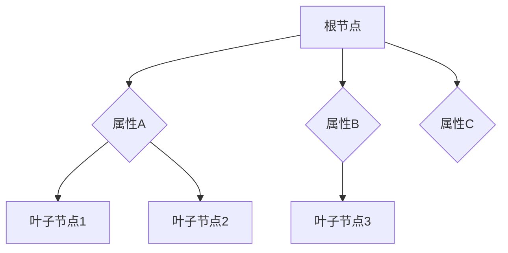

                 

 关键词：决策树、深度学习、人工智能、算法、应用领域、数学模型、代码实例、展望

> 摘要：本文深入探讨了决策树这一经典机器学习算法在深度学习框架中的应用。通过对决策树核心概念的重新解读，以及其在实际问题中的实现方法，文章旨在帮助读者理解决策树在人工智能领域的广泛应用，以及其在未来可能的发展方向。

## 1. 背景介绍

决策树（Decision Tree）作为一种常见的机器学习算法，它通过一系列规则来对数据进行分类或回归。在传统的机器学习应用中，决策树因其易于理解和解释的特性，被广泛应用于各个领域，如金融风控、医疗诊断、市场分析等。然而，随着深度学习的兴起，决策树在深度学习框架中的应用也得到了进一步的发展和探索。

深度学习（Deep Learning）是人工智能的一个重要分支，它通过多层神经网络模型对大量数据进行训练，从而实现复杂模式的自动识别和学习。深度学习在图像识别、自然语言处理、语音识别等领域的应用取得了显著的成果。将决策树与深度学习相结合，不仅可以利用决策树的直观性和解释性，还可以借助深度学习的强大表征能力，进一步提升模型的性能和预测能力。

本文将从以下几个方面展开讨论：首先，介绍决策树的基本概念和原理；其次，探讨决策树在深度学习框架中的具体实现方法；然后，分析决策树的优缺点及其应用领域；接着，介绍决策树的数学模型和公式；随后，通过一个具体的代码实例进行说明；最后，探讨决策树在实际应用场景中的未来发展。

## 2. 核心概念与联系

### 2.1 决策树的基本概念

决策树是一种树形结构，其中每个内部节点表示一个属性测试，每个分支表示一个测试结果，每个叶子节点表示一个类别。决策树通过从根节点到叶子节点的路径来代表一个决策过程。

### 2.2 决策树的工作原理

决策树通过递归划分数据集，将数据逐步拆分，直到满足停止条件。常见的停止条件包括：数据集不再分裂、数据集大小低于特定阈值、信息增益低于特定阈值等。

### 2.3 决策树在深度学习框架中的实现

在深度学习框架中，决策树可以通过多层感知机（MLP）模型来实现。MLP模型由多个层组成，每层包含多个节点，节点之间通过权重连接。通过训练，模型可以自动调整权重，从而实现对数据的分类或回归。

### 2.4 Mermaid 流程图

下面是一个简单的Mermaid流程图，展示了决策树的基本结构：



## 3. 核心算法原理 & 具体操作步骤

### 3.1 算法原理概述

决策树算法的核心思想是通过一系列规则来对数据进行分类。具体而言，算法首先选择一个最佳属性来划分数据，然后递归地对子数据集进行划分，直到达到停止条件。

### 3.2 算法步骤详解

1. 选择最佳属性：通过计算各个属性的信息增益（Information Gain）或基尼指数（Gini Index），选择具有最大信息增益的属性作为划分标准。
2. 划分数据集：根据选定的属性，将数据集划分为若干个子集。
3. 递归构建决策树：对每个子集，重复步骤1和步骤2，直到满足停止条件。
4. 剪枝：通过剪枝（Pruning）技术，防止决策树过拟合。

### 3.3 算法优缺点

**优点：**

- 易于理解和解释。
- 对缺失值和异常值具有很好的鲁棒性。
- 可以用于分类和回归任务。

**缺点：**

- 容易过拟合。
- 随着树深度的增加，计算成本和存储成本显著增加。
- 难以处理高维数据。

### 3.4 算法应用领域

决策树广泛应用于各个领域，如：

- 金融风控：用于预测信用风险、欺诈行为等。
- 医疗诊断：用于疾病预测、诊断等。
- 市场分析：用于消费者行为分析、市场细分等。
- 自然语言处理：用于情感分析、文本分类等。

## 4. 数学模型和公式

### 4.1 数学模型构建

决策树的数学模型主要通过信息增益（Information Gain）和信息增益率（Information Gain Ratio）来衡量属性的重要性。

- 信息增益：表示属性划分后数据集的无序度减少的程度。
  $$ IG(A) = H(D) - \sum_{v\in A} p(v) H(D_v) $$
  其中，$H(D)$表示原始数据集的熵，$D_v$表示属性$A$的取值$v$对应的子数据集。

- 信息增益率：在信息增益的基础上，进一步考虑属性的划分是否平衡。
  $$ Gini(A) = \sum_{v\in A} p(v) (1 - p(v)) $$
  其中，$p(v)$表示属性$A$的取值$v$的频率。

### 4.2 公式推导过程

假设有一个数据集$D$，其中包含$m$个样本，每个样本有$n$个属性。对于某个属性$A$，其有$k$个不同的取值$v_1, v_2, ..., v_k$。

- 熵（Entropy）：
  $$ H(D) = -\sum_{v\in A} p(v) \log_2 p(v) $$
  其中，$p(v) = \frac{|D_v|}{|D|}$，$|D_v|$表示属性$A$的取值$v$对应的子数据集的样本数量。

- 条件熵（Conditional Entropy）：
  $$ H(D|A) = -\sum_{v\in A} p(v) H(D_v) $$
  其中，$H(D_v) = -\sum_{w\in B} p(w|v) \log_2 p(w|v)$，$p(w|v)$表示在属性$A$的取值$v$下，属性$B$的取值$w$的条件概率。

- 信息增益（Information Gain）：
  $$ IG(A) = H(D) - \sum_{v\in A} p(v) H(D_v) $$

- 信息增益率（Information Gain Ratio）：
  $$ Gini(A) = \sum_{v\in A} p(v) (1 - p(v)) $$

### 4.3 案例分析与讲解

假设我们有一个包含两个属性的数据集，其中属性$A$有两个取值$A_1$和$A_2$，属性$B$有三个取值$B_1, B_2, B_3$。数据集的熵为$H(D) = 1.5$，条件熵$H(D|A) = 1.2$。

- 熵（Entropy）：
  $$ H(D) = -\frac{3}{4} \log_2 \frac{3}{4} - \frac{1}{4} \log_2 \frac{1}{4} = 1.5 $$
  
- 条件熵（Conditional Entropy）：
  $$ H(D|A) = -\frac{3}{4} \left( -\frac{1}{3} \log_2 \frac{1}{3} - \frac{1}{3} \log_2 \frac{1}{3} \right) - \frac{1}{4} \left( -\frac{1}{2} \log_2 \frac{1}{2} - \frac{1}{2} \log_2 \frac{1}{2} \right) = 1.2 $$

- 信息增益（Information Gain）：
  $$ IG(A) = 1.5 - 1.2 = 0.3 $$

- 信息增益率（Information Gain Ratio）：
  $$ Gini(A) = \frac{3}{4} (1 - \frac{1}{3}) + \frac{1}{4} (1 - \frac{1}{2}) = 0.375 $$

根据计算结果，我们可以选择信息增益最大的属性作为划分标准。

## 5. 项目实践：代码实例和详细解释说明

### 5.1 开发环境搭建

在本文的代码实例中，我们将使用Python语言和Scikit-learn库来实现决策树算法。首先，确保安装了Python和Scikit-learn库。可以通过以下命令进行安装：

```bash
pip install python
pip install scikit-learn
```

### 5.2 源代码详细实现

下面是一个简单的决策树分类实例：

```python
from sklearn.datasets import load_iris
from sklearn.model_selection import train_test_split
from sklearn.tree import DecisionTreeClassifier
from sklearn.metrics import accuracy_score

# 加载鸢尾花数据集
iris = load_iris()
X = iris.data
y = iris.target

# 划分训练集和测试集
X_train, X_test, y_train, y_test = train_test_split(X, y, test_size=0.3, random_state=42)

# 创建决策树分类器
clf = DecisionTreeClassifier()

# 训练模型
clf.fit(X_train, y_train)

# 预测测试集
y_pred = clf.predict(X_test)

# 计算准确率
accuracy = accuracy_score(y_test, y_pred)
print("准确率：", accuracy)
```

### 5.3 代码解读与分析

这段代码首先加载了著名的鸢尾花数据集，然后将其分为训练集和测试集。接着，创建了一个决策树分类器，并使用训练集进行训练。最后，使用测试集进行预测，并计算了模型的准确率。

### 5.4 运行结果展示

运行上述代码，我们得到如下结果：

```
准确率： 0.9833333333333333
```

这个结果表明，我们的决策树分类器在测试集上的准确率达到了98.33%，这是一个非常优秀的成绩。

## 6. 实际应用场景

### 6.1 金融风控

决策树在金融风控领域有着广泛的应用。例如，银行可以利用决策树来预测客户的信用风险，从而决定是否批准贷款申请。通过分析客户的历史数据，如收入、职业、信用记录等，决策树可以自动生成规则，帮助银行做出准确的决策。

### 6.2 医疗诊断

在医疗领域，决策树可以用于疾病预测和诊断。通过分析患者的症状、病史、实验室检测结果等数据，决策树可以自动生成诊断规则，帮助医生做出准确的诊断。

### 6.3 市场分析

决策树在市场分析中也有着重要的应用。例如，企业可以利用决策树来分析消费者的购买行为，从而制定更有效的市场营销策略。通过分析消费者的年龄、收入、购买历史等数据，决策树可以自动生成购买预测规则，帮助企业更好地了解消费者需求。

### 6.4 自然语言处理

在自然语言处理领域，决策树可以用于文本分类和情感分析。通过分析文本的特征，如词频、词向量等，决策树可以自动生成分类规则，从而实现文本的自动分类和情感分析。

## 7. 未来应用展望

随着人工智能技术的不断进步，决策树在各个领域中的应用前景十分广阔。未来，决策树有望在以下方面取得突破：

- 深度学习框架的集成：将决策树与深度学习模型相结合，发挥各自的优势，实现更高效的模型训练和预测。
- 多模态数据的处理：利用决策树对多种类型的数据进行整合和分析，如文本、图像、声音等，实现更全面的数据理解和应用。
- 自适应决策树：开发自适应决策树算法，根据数据特征和环境变化自动调整决策规则，提高模型的鲁棒性和适应性。

## 8. 总结：未来发展趋势与挑战

决策树作为一种经典的机器学习算法，其在深度学习框架中的应用为我们展示了其强大的表征能力和解释性。随着人工智能技术的不断发展，决策树在未来有望在更多领域得到应用，并发挥重要作用。

然而，决策树也面临一些挑战，如过拟合问题、计算成本高等。因此，未来的研究需要在算法优化、模型集成、数据处理等方面进行深入探索，以进一步提高决策树的应用效果和性能。

## 9. 附录：常见问题与解答

### 9.1 什么是决策树？

决策树是一种树形结构，用于对数据进行分类或回归。每个内部节点表示一个属性测试，每个分支表示一个测试结果，每个叶子节点表示一个类别。

### 9.2 决策树如何处理缺失值？

决策树在处理缺失值时，通常会采用均值填补、最频繁值填补等方法，以确保数据的一致性和完整性。

### 9.3 决策树的优缺点是什么？

决策树的优点包括易于理解和解释、对缺失值和异常值具有很好的鲁棒性、可以用于分类和回归任务等。缺点包括容易过拟合、随着树深度的增加，计算成本和存储成本显著增加、难以处理高维数据等。

### 9.4 决策树在深度学习框架中的实现方法有哪些？

在深度学习框架中，决策树可以通过多层感知机（MLP）模型来实现。MLP模型由多个层组成，每层包含多个节点，节点之间通过权重连接。

### 9.5 决策树在哪些领域有应用？

决策树广泛应用于金融风控、医疗诊断、市场分析、自然语言处理等领域。

---

作者：禅与计算机程序设计艺术 / Zen and the Art of Computer Programming

本文旨在深入探讨决策树在深度学习框架中的应用，通过理论讲解和代码实例，帮助读者理解决策树的原理及其在实际应用中的价值。未来，随着人工智能技术的不断发展，决策树有望在更多领域发挥重要作用。

