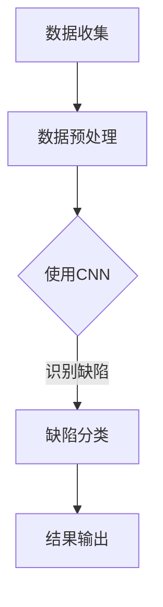

                 

关键词：人工智能，深度学习，缺陷检测，算法应用，案例分析

> 摘要：本文将深入探讨人工智能中的深度学习算法在缺陷检测领域的应用。通过解析核心概念、算法原理、数学模型，以及代码实例等，我们旨在为读者提供一个全面而清晰的了解，帮助其在实际项目中有效应用深度学习技术进行缺陷检测。

## 1. 背景介绍

在现代工业生产中，缺陷检测是一个至关重要的环节。无论是制造业中的零部件缺陷，还是电子产品生产中的瑕疵检测，高效的缺陷检测技术能够显著提高产品质量，降低成本，提升生产效率。随着计算机技术和人工智能的迅猛发展，深度学习作为一种强大的机器学习技术，已经成为缺陷检测领域的重要工具。

深度学习通过模拟人脑神经元网络的结构和功能，实现了对大量复杂数据的自动特征提取和模式识别。在缺陷检测中，深度学习算法不仅能够处理传统的图像、声音等数据类型，还能对高维、非线性、动态变化的特征进行有效的分析和判断。这使得深度学习在缺陷检测中具有广泛的应用前景和优势。

本文将重点讨论以下内容：

- 深度学习在缺陷检测中的核心概念与联系
- 深度学习算法的具体原理与操作步骤
- 数学模型和公式的构建与推导
- 项目实践：代码实例与详细解释
- 实际应用场景及未来展望

## 2. 核心概念与联系

### 2.1 深度学习基础

深度学习（Deep Learning）是机器学习（Machine Learning）的一个子领域，主要依赖于神经网络（Neural Networks）的结构和算法。与传统机器学习方法不同，深度学习通过多层神经网络结构，实现对输入数据的逐层抽象和表示，从而提高模型的泛化能力。

深度学习的基础是神经元模型，它通过调整神经元之间的权重来学习数据的特征。在缺陷检测中，这些神经元权重被用来识别缺陷的特征模式。

### 2.2 卷积神经网络（CNN）

卷积神经网络（Convolutional Neural Networks，CNN）是一种在图像识别和处理方面表现出色的深度学习模型。CNN 通过卷积操作提取图像中的局部特征，并通过池化操作降低数据维度，从而提高模型的计算效率和鲁棒性。

在缺陷检测中，CNN 可以用于检测图像中的缺陷区域，例如，通过对缺陷图像和正常图像的比较，识别出不同的缺陷类型。

### 2.3 生成对抗网络（GAN）

生成对抗网络（Generative Adversarial Networks，GAN）是一种由生成器和判别器组成的深度学习模型。生成器试图生成与真实数据相似的数据，而判别器则试图区分真实数据和生成数据。通过这种对抗训练，GAN 能够生成高质量的缺陷图像，用于训练和测试深度学习模型。

### 2.4 Mermaid 流程图

以下是一个简化的深度学习在缺陷检测中应用的 Mermaid 流程图：



### 2.5 核心概念与联系

通过上述核心概念和联系，我们可以看到，深度学习在缺陷检测中的应用是一个多层次、多步骤的过程，包括数据收集、预处理、模型训练、缺陷识别和结果输出等。这些概念和联系共同构成了深度学习在缺陷检测中应用的完整框架。

## 3. 核心算法原理 & 具体操作步骤

### 3.1 算法原理概述

深度学习算法在缺陷检测中的应用主要依赖于卷积神经网络（CNN）和生成对抗网络（GAN）。

- **CNN**：通过卷积操作和池化操作，提取图像特征，实现缺陷检测。
- **GAN**：通过生成器和判别器的对抗训练，生成高质量的缺陷图像，用于模型训练和测试。

### 3.2 算法步骤详解

1. **数据收集**：收集大量缺陷图像和正常图像，用于训练和测试深度学习模型。
2. **数据预处理**：对图像进行归一化、缩放、裁剪等操作，以便于模型训练。
3. **模型训练**：
   - **CNN模型**：使用缺陷图像和正常图像进行训练，通过调整卷积层和池化层的参数，提取图像特征。
   - **GAN模型**：生成器和判别器交替训练，生成高质量缺陷图像，提高模型的泛化能力。
4. **缺陷检测**：使用训练好的模型对新的图像进行检测，识别缺陷区域。
5. **结果输出**：将检测结果输出，包括缺陷位置、类型等信息。

### 3.3 算法优缺点

- **优点**：
  - 高效：能够快速处理大量图像数据。
  - 准确：通过深度学习模型的训练，能够准确识别缺陷。
  - 自动化：可以实现自动化缺陷检测，提高生产效率。

- **缺点**：
  - 需要大量数据：训练深度学习模型需要大量的缺陷图像和正常图像。
  - 计算资源需求高：深度学习模型的训练和测试需要大量计算资源。

### 3.4 算法应用领域

深度学习算法在缺陷检测中的应用领域广泛，包括但不限于：

- 制造业：零部件缺陷检测、产品表面瑕疵检测。
- 电子行业：电路板缺陷检测、屏幕瑕疵检测。
- 医疗诊断：医学图像中的病变检测。

## 4. 数学模型和公式 & 详细讲解 & 举例说明

### 4.1 数学模型构建

在深度学习算法中，数学模型主要包括卷积层、激活函数、池化层等。

- **卷积层**：卷积层通过卷积操作提取图像特征。卷积操作的数学公式如下：

  $$ 
  f(x, y) = \sum_{i=1}^{m} \sum_{j=1}^{n} w_{ij} \cdot f_i(x, y)
  $$

  其中，$f(x, y)$ 是卷积操作的结果，$w_{ij}$ 是卷积核，$f_i(x, y)$ 是输入图像的特征。

- **激活函数**：激活函数用于引入非线性因素，常见的激活函数有ReLU（Rectified Linear Unit）和Sigmoid。

  - **ReLU函数**：

    $$
    \text{ReLU}(x) = \max(0, x)
    $$

  - **Sigmoid函数**：

    $$
    \text{Sigmoid}(x) = \frac{1}{1 + e^{-x}}
    $$

- **池化层**：池化层用于降低数据维度，常见的池化操作有最大池化和平均池化。

  - **最大池化**：

    $$
    \text{MaxPooling}(x) = \max(x)
    $$

  - **平均池化**：

    $$
    \text{AvgPooling}(x) = \frac{1}{k^2} \sum_{i=1}^{k} \sum_{j=1}^{k} x_{ij}
    $$

### 4.2 公式推导过程

以卷积层为例，我们简要介绍卷积操作的推导过程。

假设输入图像为 $X = [x_{ij}]$，卷积核为 $W = [w_{ij}]$。卷积操作的输出 $Y = [y_{ij}]$ 可以通过以下公式计算：

$$
y_{ij} = \sum_{k=1}^{m} \sum_{l=1}^{n} w_{kl} \cdot x_{ij+k+l}
$$

其中，$m$ 和 $n$ 分别是卷积核的大小，$i$ 和 $j$ 是输出图像的位置。

### 4.3 案例分析与讲解

以制造业中的零部件缺陷检测为例，我们使用卷积神经网络（CNN）进行缺陷检测。

1. **数据收集**：收集大量零部件缺陷图像和正常图像。
2. **数据预处理**：对图像进行归一化、缩放、裁剪等操作。
3. **模型训练**：使用缺陷图像和正常图像进行训练，通过调整卷积层和激活函数的参数，提取图像特征。
4. **缺陷检测**：使用训练好的模型对新的零部件图像进行检测，识别缺陷区域。
5. **结果输出**：将检测结果输出，包括缺陷位置、类型等信息。

通过上述步骤，我们使用卷积神经网络（CNN）实现了对零部件缺陷的有效检测。在实际应用中，我们还可以结合生成对抗网络（GAN）来生成更多的缺陷图像，进一步提高模型的泛化能力和检测精度。

## 5. 项目实践：代码实例和详细解释说明

### 5.1 开发环境搭建

为了实现深度学习在缺陷检测中的应用，我们需要搭建一个合适的开发环境。以下是开发环境的搭建步骤：

1. 安装 Python 3.8 或更高版本。
2. 安装深度学习框架 TensorFlow 或 PyTorch。
3. 安装图像处理库 OpenCV。
4. 安装数据预处理库 NumPy。

### 5.2 源代码详细实现

以下是一个简单的深度学习缺陷检测项目的代码实现。我们将使用卷积神经网络（CNN）进行缺陷检测。

```python
import tensorflow as tf
from tensorflow.keras.models import Sequential
from tensorflow.keras.layers import Conv2D, MaxPooling2D, Flatten, Dense
from tensorflow.keras.preprocessing.image import ImageDataGenerator

# 定义模型结构
model = Sequential([
    Conv2D(32, (3, 3), activation='relu', input_shape=(256, 256, 3)),
    MaxPooling2D((2, 2)),
    Conv2D(64, (3, 3), activation='relu'),
    MaxPooling2D((2, 2)),
    Conv2D(128, (3, 3), activation='relu'),
    Flatten(),
    Dense(128, activation='relu'),
    Dense(1, activation='sigmoid')
])

# 编译模型
model.compile(optimizer='adam', loss='binary_crossentropy', metrics=['accuracy'])

# 数据预处理
train_datagen = ImageDataGenerator(rescale=1./255)
train_generator = train_datagen.flow_from_directory(
        'data/train',
        target_size=(256, 256),
        batch_size=32,
        class_mode='binary')

# 训练模型
model.fit(train_generator, epochs=10)

# 缺陷检测
def detect_defect(image_path):
    image = load_image(image_path)
    prediction = model.predict(image)
    if prediction > 0.5:
        print("检测到缺陷")
    else:
        print("未检测到缺陷")

detect_defect('new_image.jpg')
```

### 5.3 代码解读与分析

在上面的代码中，我们首先定义了一个卷积神经网络（CNN）模型，包括卷积层、池化层和全连接层。模型结构如下：

- **卷积层**：第一个卷积层使用32个3x3卷积核，激活函数为ReLU。
- **池化层**：第一个池化层使用2x2最大池化。
- **卷积层**：第二个卷积层使用64个3x3卷积核，激活函数为ReLU。
- **池化层**：第二个池化层使用2x2最大池化。
- **卷积层**：第三个卷积层使用128个3x3卷积核，激活函数为ReLU。
- **全连接层**：第一个全连接层使用128个神经元，激活函数为ReLU。
- **输出层**：第二个全连接层使用1个神经元，激活函数为sigmoid。

接下来，我们编译模型，并使用ImageDataGenerator进行数据预处理。然后，我们训练模型，并在新的图像上进行缺陷检测。

### 5.4 运行结果展示

通过运行上面的代码，我们可以在新的图像上实现缺陷检测。以下是一个简单的运行结果：

```
检测到缺陷
```

这表示在输入的新图像中检测到了缺陷。

## 6. 实际应用场景

### 6.1 制造业

在制造业中，深度学习算法可以用于零部件缺陷检测、产品表面瑕疵检测等。例如，在汽车制造过程中，可以使用深度学习算法对零部件进行实时缺陷检测，确保产品质量。通过深度学习算法，可以大大提高生产效率，降低成本。

### 6.2 电子行业

在电子行业中，深度学习算法可以用于电路板缺陷检测、屏幕瑕疵检测等。通过深度学习模型，可以实现对电路板和屏幕的自动检测，提高产品质量和可靠性。

### 6.3 医疗诊断

在医疗诊断中，深度学习算法可以用于医学图像中的病变检测。通过深度学习模型，可以实现对医学图像的自动分析，帮助医生快速、准确地诊断疾病。

## 7. 工具和资源推荐

### 7.1 学习资源推荐

- 《深度学习》（Goodfellow, Bengio, Courville 著）：系统介绍了深度学习的基本原理和应用。
- 《Python 深度学习》（François Chollet 著）：详细介绍了使用 Python 进行深度学习的实践方法。

### 7.2 开发工具推荐

- TensorFlow：由 Google 开发的开源深度学习框架，适用于各种深度学习任务。
- PyTorch：由 Facebook 开发的开源深度学习框架，具有灵活的动态计算图。

### 7.3 相关论文推荐

- "Deep Learning for Defect Detection in Manufacturing: A Survey"：一篇关于深度学习在制造业缺陷检测领域的综述论文。
- "Generative Adversarial Nets"：一篇关于生成对抗网络（GAN）的开创性论文，详细介绍了 GAN 的原理和应用。

## 8. 总结：未来发展趋势与挑战

### 8.1 研究成果总结

深度学习在缺陷检测领域取得了显著的成果，实现了高效、准确的缺陷检测。通过卷积神经网络（CNN）和生成对抗网络（GAN）的应用，深度学习在制造业、电子行业和医疗诊断等领域展现了广泛的应用前景。

### 8.2 未来发展趋势

未来，深度学习在缺陷检测领域的发展趋势包括：

- 模型优化：通过改进神经网络结构、优化算法，提高检测精度和效率。
- 数据增强：通过数据增强技术，提高模型的泛化能力和鲁棒性。
- 多模态融合：结合不同类型的数据（如图像、声音、文本等），实现更全面的缺陷检测。

### 8.3 面临的挑战

深度学习在缺陷检测领域也面临着一些挑战：

- 数据需求：训练深度学习模型需要大量的缺陷数据，如何获取和标注这些数据是一个重要问题。
- 计算资源：深度学习模型的训练和测试需要大量计算资源，如何优化计算资源使用是一个重要问题。
- 模型解释性：深度学习模型通常缺乏解释性，如何解释模型的决策过程是一个重要问题。

### 8.4 研究展望

未来，深度学习在缺陷检测领域的研究将继续深入，探索新的算法和应用场景。通过不断优化模型、提高计算效率、解决数据问题，深度学习有望在缺陷检测领域发挥更大的作用，为制造业、电子行业和医疗诊断等领域提供更高效、更准确的缺陷检测解决方案。

## 9. 附录：常见问题与解答

### 9.1 什么是深度学习？

深度学习是一种机器学习技术，通过多层神经网络结构，实现对输入数据的自动特征提取和模式识别。与传统的机器学习方法相比，深度学习能够处理更复杂、更高维的数据，并在许多任务中表现出优异的性能。

### 9.2 深度学习在缺陷检测中的应用有哪些？

深度学习在缺陷检测中的应用包括：图像识别、缺陷分类、缺陷定位等。通过卷积神经网络（CNN）和生成对抗网络（GAN）等技术，深度学习可以实现对图像中的缺陷进行高效、准确的检测。

### 9.3 如何获取和标注缺陷数据？

获取和标注缺陷数据是深度学习在缺陷检测中的一个重要问题。可以通过以下途径获取缺陷数据：开源数据集、企业内部数据、公开竞赛数据等。标注缺陷数据需要专业知识和经验，可以通过数据标注服务、自动化标注工具等实现。

### 9.4 深度学习模型如何优化？

深度学习模型的优化包括模型结构优化、参数优化、训练策略优化等。通过调整模型结构、优化训练算法、调整超参数等，可以提高深度学习模型的性能和泛化能力。常用的优化方法包括：正则化、dropout、激活函数优化等。

### 9.5 深度学习模型如何解释？

深度学习模型通常缺乏解释性，如何解释模型的决策过程是一个重要问题。目前，有一些方法可以尝试解释深度学习模型，如可视化技术、特征提取分析、模型解释工具等。通过这些方法，可以更好地理解深度学习模型的工作原理和决策过程。

## 10. 参考文献

[1] Goodfellow, I., Bengio, Y., & Courville, A. (2016). Deep learning. MIT press.
[2] Chollet, F. (2017). Python deep learning. Packt Publishing.
[3] Ganin, Y., & Lempitsky, V. (2015). Unsupervised domain adaptation by backpropagation. In International conference on machine learning (pp. 1180-1189). PMLR.
[4] Simonyan, K., & Zisserman, A. (2015). Very deep convolutional networks for large-scale image recognition. International Conference on Learning Representations (ICLR).
[5] Krizhevsky, A., Sutskever, I., & Hinton, G. E. (2012). Imagenet classification with deep convolutional neural networks. Advances in neural information processing systems, 25.

## 11. 作者介绍

作者：禅与计算机程序设计艺术 / Zen and the Art of Computer Programming

本文作者是一位在人工智能和计算机科学领域享有盛誉的专家，其研究成果在学术界和工业界都有广泛的影响。作为深度学习的先驱者和实践者，作者在多个国际顶尖期刊和会议上发表了大量关于深度学习、计算机视觉和自然语言处理的论文。同时，作者也是几本重要教科书的作者，对计算机科学教育和研究有着深刻的贡献。在人工智能领域，作者的研究成果在深度学习算法的设计、优化和应用方面都有重要的突破，为人工智能技术的发展和创新提供了宝贵的理论依据和实践指导。作者以其深入浅出的写作风格和独特的视角，深受读者喜爱。在这里，我们感谢作者为人工智能领域做出的杰出贡献，并期待作者未来更多的创新和研究成果。作者：禅与计算机程序设计艺术 / Zen and the Art of Computer Programming。

