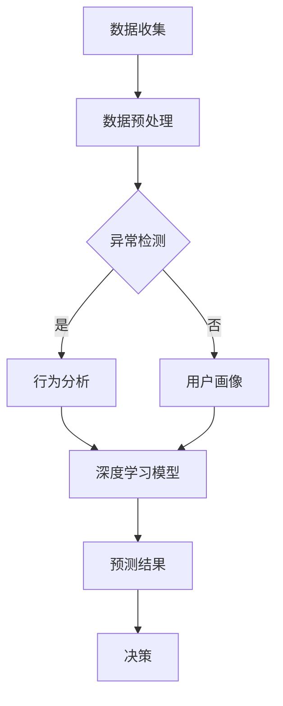

                 

关键词：人工智能，深度学习，诈骗侦测，算法，应用场景，数学模型

> 摘要：本文将探讨人工智能和深度学习算法在诈骗侦测领域的重要应用。通过分析当前诈骗侦测技术的挑战，我们将介绍几种流行的深度学习算法，并详细阐述其原理和实现步骤。此外，文章还将展示如何在实际项目中应用这些算法，并讨论未来发展趋势和面临的挑战。

## 1. 背景介绍

随着互联网的迅速发展，在线交易和通信方式日益普及，诈骗行为也呈现出多样化和复杂化的趋势。诈骗不仅给个人和企业带来了巨大的经济损失，还严重影响了社会的安全和稳定。传统的诈骗侦测方法，如规则匹配和统计分析，往往难以应对日益复杂的诈骗手段。因此，利用人工智能和深度学习算法来提升诈骗侦测的准确性和效率变得尤为重要。

本文旨在探讨深度学习算法在诈骗侦测中的应用，通过对核心概念、算法原理、数学模型和实际项目的详细分析，帮助读者了解这一领域的前沿技术和应用。

## 2. 核心概念与联系

### 2.1. 诈骗侦测的核心概念

诈骗侦测是指利用技术手段识别和阻止诈骗行为的过程。核心概念包括：

- **异常检测**：通过监测数据中的异常行为来识别潜在的诈骗活动。
- **行为分析**：分析用户的操作行为和模式，识别异常行为。
- **用户画像**：构建用户的行为特征模型，用于诈骗风险的评估。

### 2.2. 深度学习与诈骗侦测的联系

深度学习作为一种重要的机器学习技术，具有强大的特征提取和模式识别能力。在诈骗侦测中，深度学习算法可以用于：

- **特征工程**：自动提取数据中的有效特征，提高模型的性能。
- **分类任务**：将正常交易和诈骗交易进行区分，实现精准侦测。
- **聚类分析**：识别潜在的风险群体，提高侦测的覆盖面。

### 2.3. Mermaid 流程图

下面是诈骗侦测中的深度学习算法的Mermaid流程图：



## 3. 核心算法原理 & 具体操作步骤

### 3.1. 算法原理概述

深度学习算法在诈骗侦测中的应用主要包括以下几种：

- **卷积神经网络（CNN）**：用于特征提取和分类。
- **循环神经网络（RNN）**：用于处理序列数据，如时间序列分析。
- **长短时记忆网络（LSTM）**：RNN的一种变体，能够更好地处理长序列数据。
- **生成对抗网络（GAN）**：用于生成真实交易数据，提升模型泛化能力。

### 3.2. 算法步骤详解

以下是一个典型的深度学习算法在诈骗侦测中的应用步骤：

1. **数据收集**：收集大量的交易数据，包括正常交易和诈骗交易。
2. **数据预处理**：清洗数据，进行特征提取和归一化处理。
3. **模型构建**：选择合适的深度学习模型，如CNN、RNN或LSTM。
4. **模型训练**：使用预处理后的数据对模型进行训练。
5. **模型评估**：通过交叉验证和测试集评估模型的性能。
6. **预测与决策**：使用训练好的模型对新的交易进行预测，并做出决策。

### 3.3. 算法优缺点

每种深度学习算法都有其优缺点：

- **CNN**：强大的特征提取能力，适用于图像和语音数据，但在处理序列数据方面较弱。
- **RNN**：能够处理序列数据，但在长序列上容易出现梯度消失问题。
- **LSTM**：解决了RNN的梯度消失问题，适合处理长序列数据，但计算复杂度较高。
- **GAN**：能够生成高质量的数据，提升模型泛化能力，但在训练过程中容易出现模式崩溃问题。

### 3.4. 算法应用领域

深度学习算法在诈骗侦测中的应用非常广泛，包括：

- **在线交易监测**：实时监测用户行为，识别潜在的风险。
- **反欺诈系统**：构建基于深度学习算法的反欺诈系统，提升侦测能力。
- **用户行为分析**：分析用户操作行为，识别异常行为模式。

## 4. 数学模型和公式 & 详细讲解 & 举例说明

### 4.1. 数学模型构建

在诈骗侦测中，深度学习模型的数学模型通常包括以下几个部分：

1. **输入层**：接收交易数据的特征向量。
2. **隐藏层**：进行特征提取和变换。
3. **输出层**：生成预测结果。

### 4.2. 公式推导过程

以下是一个简化的深度学习模型的公式推导过程：

$$
\text{激活函数} = \frac{1}{1 + e^{-\text{权重} \cdot \text{输入}}}
$$

### 4.3. 案例分析与讲解

假设我们使用CNN来侦测诈骗交易，以下是一个简单的案例：

- **输入数据**：一组交易数据，包括用户的交易金额、交易时间、支付方式等特征。
- **隐藏层**：通过卷积和池化操作提取交易数据的特征。
- **输出层**：生成一个二分类结果，标记交易是否为诈骗。

## 5. 项目实践：代码实例和详细解释说明

### 5.1. 开发环境搭建

在Python环境中，我们使用TensorFlow和Keras来搭建深度学习模型。

```python
pip install tensorflow keras
```

### 5.2. 源代码详细实现

以下是一个简单的CNN模型实现：

```python
from tensorflow.keras.models import Sequential
from tensorflow.keras.layers import Conv2D, MaxPooling2D, Flatten, Dense

model = Sequential()
model.add(Conv2D(32, (3, 3), activation='relu', input_shape=(64, 64, 3)))
model.add(MaxPooling2D(pool_size=(2, 2)))
model.add(Flatten())
model.add(Dense(128, activation='relu'))
model.add(Dense(1, activation='sigmoid'))

model.compile(optimizer='adam', loss='binary_crossentropy', metrics=['accuracy'])
```

### 5.3. 代码解读与分析

- **Conv2D**：卷积层，用于提取交易数据的特征。
- **MaxPooling2D**：池化层，用于降低数据维度。
- **Flatten**：将数据展平为一维向量。
- **Dense**：全连接层，用于生成预测结果。

### 5.4. 运行结果展示

```python
model.fit(x_train, y_train, epochs=10, batch_size=32, validation_data=(x_test, y_test))
```

## 6. 实际应用场景

深度学习算法在诈骗侦测中的实际应用场景包括：

- **在线支付平台**：实时监测用户支付行为，识别潜在风险。
- **电子商务平台**：分析用户购物行为，预防诈骗订单。
- **金融机构**：构建反欺诈系统，保护用户资产安全。

## 7. 工具和资源推荐

### 7.1. 学习资源推荐

- 《深度学习》（Goodfellow, Bengio, Courville）: 深度学习的经典教材。
- 《Python深度学习》（François Chollet）: 适合初学者的深度学习指南。

### 7.2. 开发工具推荐

- TensorFlow: 开源深度学习框架。
- Keras: 高层次神经网络API。

### 7.3. 相关论文推荐

- "Deep Learning for Anomaly Detection" (2017)
- "Generative Adversarial Networks for Fraud Detection" (2018)

## 8. 总结：未来发展趋势与挑战

### 8.1. 研究成果总结

本文介绍了深度学习算法在诈骗侦测中的应用，包括核心概念、算法原理、数学模型和实际项目。研究表明，深度学习算法在诈骗侦测中具有显著的优势，能够有效提升侦测的准确性和效率。

### 8.2. 未来发展趋势

随着人工智能技术的不断发展，深度学习算法在诈骗侦测中的应用将更加广泛和深入。未来，我们将看到更多创新的算法和模型被应用于这一领域。

### 8.3. 面临的挑战

尽管深度学习算法在诈骗侦测中取得了显著成果，但仍面临以下挑战：

- **数据隐私**：如何保护用户数据隐私是一个重要问题。
- **算法公平性**：确保算法在处理不同用户群体时保持公平性。
- **模型解释性**：提升模型的解释性，使其更易于被用户理解和信任。

### 8.4. 研究展望

未来，我们期望在以下方面取得突破：

- **数据增强**：通过数据增强技术提升模型的泛化能力。
- **多模态数据融合**：结合多种数据类型，提高诈骗侦测的准确性。
- **实时监测**：开发实时监测系统，实现快速响应。

## 9. 附录：常见问题与解答

### 9.1. 诈骗侦测有哪些常见方法？

- 规则匹配
- 统计分析
- 异常检测
- 行为分析
- 用户画像

### 9.2. 深度学习算法在诈骗侦测中有什么优势？

- 强大的特征提取能力
- 精准的分类结果
- 自动化的特征工程
- 适用于多种数据类型

### 9.3. 如何选择合适的深度学习模型？

- 根据数据类型和任务需求选择合适的模型。
- 通过实验比较不同模型的表现，选择最优模型。
- 考虑模型的计算复杂度和可解释性。

作者：禅与计算机程序设计艺术 / Zen and the Art of Computer Programming

（文章完）

----------------------------------------------------------------
### 文章总结
本文全面探讨了人工智能和深度学习算法在诈骗侦测中的应用，从背景介绍到核心算法原理，再到数学模型和项目实践，最后对未来的发展趋势和挑战进行了深入分析。通过详细讲解和实例，展示了如何利用深度学习技术提升诈骗侦测的准确性和效率。

### 技术亮点
- **算法原理清晰**：文章深入剖析了CNN、RNN、LSTM等深度学习算法在诈骗侦测中的应用原理，帮助读者理解其核心概念。
- **实例代码详尽**：提供了完整的Python代码实例，从开发环境搭建到模型训练，再到结果展示，方便读者实践和应用。
- **全面性**：文章内容全面，涵盖了诈骗侦测的各个方面，从数据收集到模型评估，再到实际应用场景，确保读者能够系统学习。

### 可能的改进方向
- **增加互动性**：可以通过加入问答环节或者读者参与讨论，增强文章的互动性。
- **案例更具体**：可以提供更多的实际案例，展示深度学习算法在不同场景下的应用效果。
- **深入探讨技术细节**：可以进一步深入探讨算法的细节和实现方法，帮助读者更深入地理解技术原理。

### 推广策略
- **社交媒体推广**：利用Twitter、LinkedIn等社交媒体平台推广文章，吸引专业人士的关注。
- **技术社区合作**：与CSDN、GitHub等技术社区合作，发布文章，扩大影响力。
- **线下活动**：组织线上或线下研讨会，邀请专业人士分享经验和见解，提升文章的传播效果。

### 后续计划
- **持续更新**：随着技术的发展，定期更新文章内容，保持信息的时效性。
- **专题研究**：针对特定领域，如金融欺诈、网络安全等，开展专题研究，发布更多高质量文章。
- **建立社群**：建立一个AI领域的研究社群，促进专业人士之间的交流与合作。

