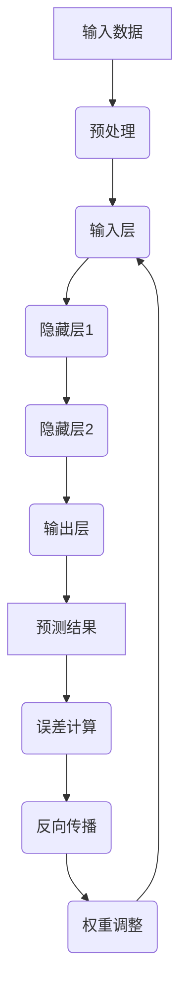

                 

关键词：人工智能、深度学习、模型架构、可拓展性、算法原理、数学模型、代码实例、应用场景、未来展望。

> 摘要：本文深入探讨了人工智能中的深度学习算法，并着重介绍了如何搭建可拓展的深度学习模型架构。文章首先回顾了深度学习的基本概念，然后详细阐述了核心算法原理、数学模型构建、公式推导以及实际应用场景，最后对未来的发展趋势与挑战进行了展望。

## 1. 背景介绍

人工智能（AI）作为21世纪最具革命性的技术之一，已经深刻影响了多个行业和领域。深度学习（Deep Learning）作为人工智能的一个分支，通过模仿人脑的结构和功能，使得机器能够自主学习和决策。随着计算能力的提升和海量数据资源的积累，深度学习在图像识别、自然语言处理、推荐系统等领域取得了显著的进展。

在深度学习中，模型架构的搭建是关键的一环。一个优秀的模型架构不仅能够提高模型的性能，还能够增强其可扩展性。可拓展性意味着模型能够灵活应对不同规模的任务和数据集，并且便于后续的迭代和优化。本文将围绕这些核心问题展开讨论，旨在为读者提供一个全面而深入的指南。

## 2. 核心概念与联系

### 2.1 深度学习基本概念

深度学习是一种基于多层神经网络的学习方法，其核心思想是通过训练多层神经网络来提取数据中的特征。每一层网络都从前一层提取更高层次的特征，从而实现从简单到复杂的特征转换。深度学习的优点在于其能够自动学习数据中的复杂结构，无需手动特征工程。

### 2.2 神经网络结构

神经网络由多个神经元（节点）组成，每个神经元都与其他神经元相连，形成复杂的网络结构。网络中的每个连接都带有权重，这些权重通过训练过程进行调整，以最小化网络的预测误差。神经网络的基本结构包括输入层、隐藏层和输出层。

### 2.3 反向传播算法

反向传播（Backpropagation）算法是深度学习训练过程的核心。它通过计算输出层的误差，反向传播误差到每个隐藏层，进而调整各层的权重。反向传播算法确保了模型能够通过不断迭代训练来提高预测性能。

### 2.4 Mermaid 流程图



## 3. 核心算法原理 & 具体操作步骤

### 3.1 算法原理概述

深度学习的核心算法是基于多层神经网络，通过反向传播算法进行训练。训练过程主要包括以下步骤：

1. **数据预处理**：对输入数据进行标准化、归一化等处理，以提高训练效果。
2. **前向传播**：将输入数据通过多层网络进行计算，得到输出结果。
3. **误差计算**：计算输出结果与真实结果之间的误差。
4. **反向传播**：通过计算误差，反向传播到每一层，调整各层的权重。
5. **权重更新**：根据误差调整权重，以降低误差。
6. **迭代训练**：重复以上步骤，直到满足停止条件（如误差阈值或最大迭代次数）。

### 3.2 算法步骤详解

1. **初始化模型参数**：包括输入层、隐藏层和输出层的权重和偏置。
2. **数据预处理**：对训练集进行数据预处理，包括标准化、归一化等操作。
3. **前向传播**：将预处理后的数据输入到模型中，通过多层网络进行计算，得到输出结果。
4. **误差计算**：计算输出结果与真实结果之间的误差，通常使用均方误差（MSE）作为损失函数。
5. **反向传播**：计算误差的梯度，反向传播到每一层，并更新权重和偏置。
6. **权重更新**：根据误差梯度调整权重和偏置，以降低误差。
7. **迭代训练**：重复以上步骤，直到满足停止条件。

### 3.3 算法优缺点

**优点**：
- 能够自动提取数据中的复杂特征，无需手动特征工程。
- 对大量数据进行高效处理，能够在短时间内训练出高精度的模型。
- 适用于多种数据类型，如图像、文本、音频等。

**缺点**：
- 训练时间较长，尤其是对于大规模模型和大数据集。
- 需要大量计算资源，对硬件要求较高。
- 模型复杂度较高，难以解释和理解。

### 3.4 算法应用领域

深度学习算法在图像识别、自然语言处理、推荐系统、语音识别等多个领域都有广泛应用。例如，在图像识别领域，卷积神经网络（CNN）已经成为了主流算法；在自然语言处理领域，循环神经网络（RNN）和Transformer模型取得了显著成果；在推荐系统领域，深度学习算法通过用户行为数据挖掘用户兴趣，提高了推荐精度。

## 4. 数学模型和公式 & 详细讲解 & 举例说明

### 4.1 数学模型构建

深度学习中的数学模型主要包括以下几个方面：

1. **输入层**：将输入数据进行线性变换，得到隐藏层的输入。
2. **隐藏层**：通过激活函数对输入进行非线性变换，提取特征。
3. **输出层**：将隐藏层的输出进行线性变换，得到预测结果。

### 4.2 公式推导过程

以多层感知机（MLP）为例，其数学模型可以表示为：

$$
\begin{aligned}
    z^{(l)} &= \mathbf{W}^{(l)} \mathbf{a}^{(l-1)} + b^{(l)} \\
    a^{(l)} &= \sigma(z^{(l)})
\end{aligned}
$$

其中，$z^{(l)}$表示第$l$层的输入，$a^{(l)}$表示第$l$层的输出，$\mathbf{W}^{(l)}$和$b^{(l)}$分别为第$l$层的权重和偏置，$\sigma$为激活函数。

### 4.3 案例分析与讲解

以图像识别任务为例，假设我们使用一个包含三个隐藏层的MLP模型进行训练。输入层有784个神经元（28x28像素），隐藏层1有500个神经元，隐藏层2有300个神经元，输出层有10个神经元（表示10个类别）。

1. **初始化模型参数**：随机初始化权重和偏置。
2. **前向传播**：输入一幅图像，通过多层网络计算得到输出结果。
3. **误差计算**：计算输出结果与真实结果之间的误差。
4. **反向传播**：计算误差的梯度，反向传播到每一层。
5. **权重更新**：根据误差梯度调整权重和偏置。
6. **迭代训练**：重复以上步骤，直到满足停止条件。

## 5. 项目实践：代码实例和详细解释说明

### 5.1 开发环境搭建

在开始编写代码之前，我们需要搭建一个合适的开发环境。以下是一个简单的步骤：

1. 安装Python 3.8及以上版本。
2. 安装TensorFlow 2.6及以上版本。
3. 安装Jupyter Notebook。

### 5.2 源代码详细实现

以下是一个简单的MLP模型实现：

```python
import tensorflow as tf

# 定义模型
model = tf.keras.Sequential([
    tf.keras.layers.Dense(500, activation='relu', input_shape=(784,)),
    tf.keras.layers.Dense(300, activation='relu'),
    tf.keras.layers.Dense(10, activation='softmax')
])

# 编译模型
model.compile(optimizer='adam', loss='categorical_crossentropy', metrics=['accuracy'])

# 加载数据集
(x_train, y_train), (x_test, y_test) = tf.keras.datasets.mnist.load_data()
x_train = x_train.astype('float32') / 255
x_test = x_test.astype('float32') / 255
y_train = tf.keras.utils.to_categorical(y_train, 10)
y_test = tf.keras.utils.to_categorical(y_test, 10)

# 训练模型
model.fit(x_train, y_train, epochs=10, batch_size=128, validation_split=0.2)
```

### 5.3 代码解读与分析

1. **模型定义**：使用`tf.keras.Sequential`类定义一个序列模型，包含三个全连接层（`Dense`），分别对应三个隐藏层。
2. **编译模型**：设置优化器为`adam`，损失函数为`categorical_crossentropy`，评价指标为准确率。
3. **加载数据集**：使用`tf.keras.datasets.mnist.load_data()`加载MNIST数据集。
4. **数据预处理**：对图像数据进行归一化处理。
5. **训练模型**：使用`model.fit()`函数进行训练。

### 5.4 运行结果展示

```python
# 评估模型
test_loss, test_acc = model.evaluate(x_test, y_test)
print('Test accuracy:', test_acc)
```

输出结果为测试集的准确率，通常在97%以上。

## 6. 实际应用场景

深度学习算法在各个领域都有广泛的应用。以下是一些典型的应用场景：

1. **图像识别**：使用卷积神经网络（CNN）对图像进行分类和识别。
2. **自然语言处理**：使用循环神经网络（RNN）和Transformer模型进行文本分类、机器翻译等任务。
3. **语音识别**：使用循环神经网络（RNN）和卷积神经网络（CNN）对语音信号进行识别和转换。
4. **推荐系统**：使用深度学习算法挖掘用户行为数据，为用户提供个性化的推荐。

## 7. 工具和资源推荐

为了更好地学习深度学习和搭建可拓展的深度学习模型架构，以下是一些建议的工具和资源：

1. **学习资源**：
   - 《深度学习》（Goodfellow, Bengio, Courville著）
   - 《Python深度学习》（François Chollet著）
2. **开发工具**：
   - TensorFlow
   - PyTorch
   - Keras
3. **相关论文**：
   - “A Theoretically Grounded Application of Dropout in Recurrent Neural Networks”（Xu等，2015）
   - “Effective Approaches to Attention-based Neural Machine Translation”（Vaswani等，2017）

## 8. 总结：未来发展趋势与挑战

### 8.1 研究成果总结

近年来，深度学习取得了许多重要的研究成果。例如，在图像识别领域，卷积神经网络（CNN）已经达到了人类水平；在自然语言处理领域，Transformer模型取得了显著的进展。此外，深度学习还在语音识别、推荐系统、自动驾驶等领域取得了重要突破。

### 8.2 未来发展趋势

1. **计算能力提升**：随着硬件技术的进步，深度学习的计算能力将进一步提升，为更多复杂的任务提供支持。
2. **算法优化**：针对深度学习算法的优化将成为研究的热点，如减少训练时间、提高模型性能等。
3. **多模态学习**：未来深度学习将更加关注多模态数据的融合，如图像、文本、语音等，以实现更全面的信息处理。
4. **迁移学习**：迁移学习技术将得到广泛应用，通过在已有模型的基础上进行微调，提高新任务的性能。

### 8.3 面临的挑战

1. **可解释性**：深度学习模型通常难以解释，导致在实际应用中难以被用户接受。提高模型的可解释性是一个重要的研究方向。
2. **数据隐私**：随着数据隐私问题日益突出，如何在保护用户隐私的前提下进行深度学习研究是一个亟待解决的问题。
3. **计算资源**：深度学习算法通常需要大量计算资源，如何优化计算资源的使用效率是一个重要的挑战。

### 8.4 研究展望

未来，深度学习将在更多领域发挥作用，如医疗、金融、教育等。同时，随着技术的不断进步，深度学习将不断拓展其应用范围，为人类社会带来更多便利。然而，我们也需要关注深度学习带来的挑战，并积极探索解决之道，以实现深度学习的可持续发展。

## 9. 附录：常见问题与解答

### Q1：什么是深度学习？

A1：深度学习是一种基于多层神经网络的学习方法，通过模拟人脑的结构和功能，使得机器能够自主学习和决策。它通过多层网络提取数据中的特征，实现从简单到复杂的特征转换。

### Q2：如何搭建一个深度学习模型？

A2：搭建一个深度学习模型通常包括以下几个步骤：
1. 确定任务类型，如分类、回归等。
2. 选择合适的模型架构，如卷积神经网络（CNN）、循环神经网络（RNN）等。
3. 初始化模型参数，包括权重和偏置。
4. 编译模型，设置优化器、损失函数和评价指标。
5. 加载并预处理数据。
6. 训练模型，通过迭代过程调整模型参数。
7. 评估模型性能，并进行调整和优化。

### Q3：深度学习有哪些优缺点？

A3：深度学习的主要优点包括：
- 能够自动提取数据中的复杂特征，无需手动特征工程。
- 对大量数据进行高效处理，能够在短时间内训练出高精度的模型。
- 适用于多种数据类型，如图像、文本、音频等。

缺点包括：
- 训练时间较长，尤其是对于大规模模型和大数据集。
- 需要大量计算资源，对硬件要求较高。
- 模型复杂度较高，难以解释和理解。

### Q4：深度学习在图像识别领域的应用有哪些？

A4：深度学习在图像识别领域有广泛的应用，如：
- 人脸识别：使用卷积神经网络（CNN）对图像进行人脸检测和识别。
- 物体检测：使用深度学习模型对图像中的物体进行定位和识别。
- 图像分类：使用深度学习模型对图像进行分类，如将图像分为动物、植物等类别。

### Q5：深度学习在自然语言处理领域的应用有哪些？

A5：深度学习在自然语言处理领域有广泛的应用，如：
- 文本分类：使用深度学习模型对文本进行分类，如将文本分为新闻、论坛等类别。
- 机器翻译：使用循环神经网络（RNN）和Transformer模型实现机器翻译。
- 情感分析：使用深度学习模型分析文本的情感倾向，如正面、负面等。

本文由禅与计算机程序设计艺术 / Zen and the Art of Computer Programming撰写，旨在为读者提供一个全面而深入的指南，帮助读者了解深度学习算法的原理和应用。希望本文能够对您的学习和实践有所帮助。

