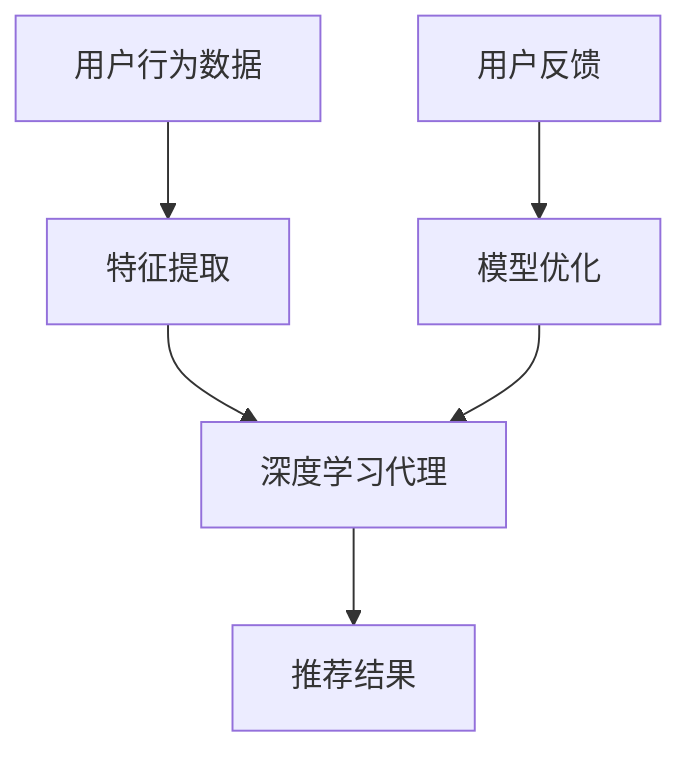
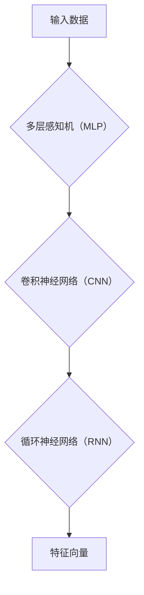

                 

关键词：人工智能，深度学习，个性化推荐，用户体验设计，算法原理，数学模型，项目实践，应用场景，工具推荐，未来展望

> 摘要：本文深入探讨了AI人工智能领域中的深度学习算法，特别是智能深度学习代理在个性化推荐和用户体验设计中的应用。通过详细剖析核心算法原理、数学模型构建及具体操作步骤，结合实际项目实践和代码实例，本文旨在为读者提供一个全面而实用的技术指南，帮助他们理解、应用并进一步探索这一前沿技术领域。

## 1. 背景介绍

随着互联网的快速发展，个性化推荐系统已成为各类在线平台的核心竞争力。从电商购物、视频网站到社交媒体，个性化推荐能够显著提升用户满意度，提高用户留存率和平台收益。然而，传统的推荐算法往往依赖于用户历史行为和内容特征，难以应对复杂多变的用户需求。深度学习作为一种强大的机器学习技术，通过模拟人脑神经网络结构，能够在海量数据中自动提取特征，从而实现更为精准的推荐。

个性化推荐与用户体验设计的关系密不可分。一个优秀的推荐系统能够根据用户兴趣和行为动态调整推荐内容，从而提升用户满意度。用户体验设计则关注如何通过界面交互、视觉设计等方面提升用户的使用感受。本文将围绕这两个方面，探讨智能深度学习代理在推荐系统和用户体验设计中的创新应用。

### 1.1 深度学习与个性化推荐

深度学习通过多层神经网络，能够自动学习输入数据的复杂特征。在推荐系统中，深度学习可用于以下方面：

1. **用户特征提取**：通过分析用户的浏览、搜索和购买历史，提取用户的潜在兴趣特征。
2. **内容特征提取**：对商品、视频、文章等内容进行特征提取，以便更好地匹配用户兴趣。
3. **上下文感知推荐**：结合用户当前的状态（如时间、地理位置）提供更为准确的推荐。

### 1.2 用户体验设计的重要性

用户体验设计不仅仅关注界面美观，更关注用户在使用过程中的感受和体验。以下是一些关键点：

1. **易用性**：确保用户能够轻松、直观地使用系统，降低学习成本。
2. **参与感**：通过设计互动性和反馈机制，增强用户对平台的黏性。
3. **满意度**：通过优化用户体验，提升用户对平台的整体满意度。

## 2. 核心概念与联系

为了深入理解智能深度学习代理在个性化推荐和用户体验设计中的应用，我们首先需要明确几个核心概念及其相互联系。

### 2.1 深度学习代理

深度学习代理（Deep Learning Agent）是一种基于深度学习技术的智能体，能够通过学习用户行为和上下文信息，自动生成个性化推荐。深度学习代理通常由以下几部分组成：

1. **输入层**：接收用户行为和上下文数据，如用户的历史浏览记录、地理位置等。
2. **隐藏层**：通过多层神经网络结构，对输入数据进行特征提取和变换。
3. **输出层**：生成个性化推荐结果，如商品、视频或文章等。

### 2.2 个性化推荐系统架构

个性化推荐系统架构通常包括以下几个关键组成部分：

1. **用户行为分析**：通过分析用户的浏览、搜索和购买行为，提取用户的兴趣特征。
2. **内容特征提取**：对推荐的内容（如商品、视频、文章等）进行特征提取，以构建推荐模型。
3. **推荐模型训练**：利用用户特征和内容特征，训练深度学习代理模型，以生成个性化推荐。
4. **推荐结果生成**：根据用户特征和内容特征，结合上下文信息，生成个性化推荐结果。

### 2.3 用户体验设计流程

用户体验设计流程通常包括以下步骤：

1. **需求分析**：理解用户需求和目标，明确设计目标。
2. **用户研究**：通过用户调研、访谈等方式，深入了解用户行为和需求。
3. **界面设计**：设计用户界面的布局、交互和视觉元素，以提升用户体验。
4. **原型设计**：创建交互原型，进行用户测试和反馈，不断迭代优化。

### 2.4 Mermaid 流程图

以下是一个简单的 Mermaid 流程图，展示了深度学习代理在个性化推荐和用户体验设计中的核心概念和联系：



## 3. 核心算法原理 & 具体操作步骤

### 3.1 算法原理概述

深度学习代理的核心原理是通过多层神经网络学习用户行为和内容特征，从而生成个性化的推荐。具体来说，深度学习代理包括以下步骤：

1. **数据预处理**：对用户行为数据和内容数据进行预处理，包括数据清洗、特征工程等。
2. **特征提取**：利用多层神经网络结构，对输入数据进行特征提取和变换。
3. **模型训练**：使用用户特征和内容特征，训练深度学习代理模型。
4. **推荐生成**：根据用户特征和内容特征，结合上下文信息，生成个性化推荐结果。

### 3.2 算法步骤详解

#### 步骤一：数据预处理

数据预处理是深度学习代理的第一步，主要包括以下工作：

1. **数据清洗**：去除噪声数据和异常值。
2. **特征工程**：对原始数据进行特征提取，如用户行为序列、商品特征等。
3. **数据归一化**：对数据进行归一化处理，使其具有相似尺度，便于模型训练。

#### 步骤二：特征提取

特征提取是深度学习代理的核心步骤，通过多层神经网络对输入数据进行特征提取和变换。以下是一个简单的神经网络结构示例：



在特征提取过程中，可以结合多种神经网络结构，以充分利用不同类型数据的特征信息。

#### 步骤三：模型训练

模型训练是利用用户特征和内容特征，训练深度学习代理模型的过程。以下是一个简单的训练流程：

1. **模型初始化**：初始化神经网络参数。
2. **前向传播**：计算输入数据的输出。
3. **反向传播**：计算损失函数，更新模型参数。
4. **迭代训练**：重复前向传播和反向传播，直到模型收敛。

#### 步骤四：推荐生成

推荐生成是根据用户特征和内容特征，结合上下文信息，生成个性化推荐结果的过程。以下是一个简单的推荐流程：

1. **用户特征提取**：从深度学习代理中提取用户特征向量。
2. **内容特征提取**：从深度学习代理中提取内容特征向量。
3. **特征融合**：将用户特征向量和内容特征向量进行融合。
4. **推荐计算**：计算用户对每个内容的潜在兴趣度，生成推荐结果。

### 3.3 算法优缺点

深度学习代理在个性化推荐和用户体验设计中的应用具有以下优点和缺点：

#### 优点：

1. **高精度推荐**：通过深度学习技术，能够提取用户和内容的复杂特征，生成高精度的推荐结果。
2. **自适应调整**：能够根据用户行为和上下文信息动态调整推荐策略，提升用户体验。
3. **扩展性强**：能够结合多种神经网络结构，适用于不同类型的推荐场景。

#### 缺点：

1. **计算复杂度高**：深度学习代理的训练和推理过程较为复杂，对计算资源要求较高。
2. **数据依赖性强**：推荐效果依赖于用户行为数据和内容数据的丰富性和质量。
3. **模型解释性差**：深度学习模型的决策过程较为复杂，难以进行解释和调试。

### 3.4 算法应用领域

深度学习代理在个性化推荐和用户体验设计中的应用非常广泛，以下是一些常见的应用领域：

1. **电子商务**：通过个性化推荐，提升用户购物体验，增加销售额。
2. **在线视频**：根据用户观看历史，推荐符合用户兴趣的视频内容。
3. **社交媒体**：根据用户行为和关系网络，推荐感兴趣的内容和用户。
4. **金融理财**：根据用户投资偏好和历史，推荐合适的理财产品。

## 4. 数学模型和公式 & 详细讲解 & 举例说明

### 4.1 数学模型构建

深度学习代理的核心是神经网络模型，下面介绍几种常见的神经网络模型及其数学模型。

#### 4.1.1 多层感知机（MLP）

多层感知机是一种前馈神经网络，包括输入层、隐藏层和输出层。其数学模型如下：

$$
y = \sigma(W_2 \cdot \sigma(W_1 \cdot x + b_1) + b_2)
$$

其中，\(x\) 是输入特征向量，\(y\) 是输出预测值，\(\sigma\) 是激活函数，\(W_1\) 和 \(W_2\) 是权重矩阵，\(b_1\) 和 \(b_2\) 是偏置项。

#### 4.1.2 卷积神经网络（CNN）

卷积神经网络主要用于处理图像数据，其数学模型包括卷积层、池化层和全连接层。以下是一个简单的卷积层数学模型：

$$
h_{ij}^{(l)} = \sigma \left( \sum_{k} W_{ik}^{(l)} h_{kj}^{(l-1)} + b_k^{(l)} \right)
$$

其中，\(h_{ij}^{(l)}\) 是第 \(l\) 层的第 \(i\) 行第 \(j\) 列的激活值，\(W_{ik}^{(l)}\) 是第 \(l\) 层的第 \(i\) 行第 \(k\) 列的权重，\(b_k^{(l)}\) 是第 \(l\) 层的第 \(k\) 个偏置项。

#### 4.1.3 循环神经网络（RNN）

循环神经网络主要用于处理序列数据，其数学模型如下：

$$
h_t = \sigma(W_h h_{t-1} + U_x x_t + b_h)
$$

其中，\(h_t\) 是第 \(t\) 个时间步的隐藏状态，\(x_t\) 是第 \(t\) 个时间步的输入，\(W_h\) 和 \(U_x\) 是权重矩阵，\(b_h\) 是偏置项。

### 4.2 公式推导过程

#### 4.2.1 多层感知机（MLP）

多层感知机的推导过程如下：

1. **输入层到隐藏层**：

$$
z^{(l)} = W^{(l)} x + b^{(l)}
$$

$$
a^{(l)} = \sigma(z^{(l)})
$$

2. **隐藏层到输出层**：

$$
z^{(L)} = W^{(L)} a^{(L-1)} + b^{(L)}
$$

$$
\hat{y} = \sigma(z^{(L)})
$$

3. **损失函数**：

$$
J = -\frac{1}{m} \sum_{i=1}^{m} y_i \log (\hat{y}_i) + (1 - y_i) \log (1 - \hat{y}_i)
$$

4. **反向传播**：

$$
\delta^{(L)} = \hat{y} - y
$$

$$
\delta^{(l)} = (\sigma'(z^{(l)}) W^{(l+1)} \delta^{(l+1)})^T
$$

$$
\frac{\partial J}{\partial W^{(l)}} = \frac{1}{m} a^{(l-1)} \delta^{(l)}
$$

$$
\frac{\partial J}{\partial b^{(l)}} = \frac{1}{m} \delta^{(l)}
$$

#### 4.2.2 卷积神经网络（CNN）

卷积神经网络的推导过程如下：

1. **卷积操作**：

$$
h_{ij}^{(l)} = \sum_{k} W_{ik}^{(l)} h_{kj}^{(l-1)} + b_k^{(l)}
$$

2. **池化操作**：

$$
p_{ij}^{(l)} = \max_{(i',j')} h_{i'j'}^{(l)}
$$

3. **全连接层**：

$$
z^{(L)} = W^{(L)} h^{(L-1)} + b^{(L)}
$$

$$
\hat{y} = \sigma(z^{(L)})
$$

4. **损失函数**：

$$
J = -\frac{1}{m} \sum_{i=1}^{m} y_i \log (\hat{y}_i) + (1 - y_i) \log (1 - \hat{y}_i)
$$

5. **反向传播**：

$$
\delta^{(L)} = \hat{y} - y
$$

$$
\delta^{(l)} = (\sigma'(z^{(l)}) \star (W^{(l+1)} \delta^{(l+1)}))^T
$$

$$
\frac{\partial J}{\partial W^{(l)}} = \frac{1}{m} h^{(l-1)} \delta^{(l)}
$$

$$
\frac{\partial J}{\partial b^{(l)}} = \frac{1}{m} \delta^{(l)}
$$

#### 4.2.3 循环神经网络（RNN）

循环神经网络的推导过程如下：

1. **前向传播**：

$$
h_t = \sigma(W_h h_{t-1} + U_x x_t + b_h)
$$

2. **反向传播**：

$$
\delta_t = \sigma'(h_t) (W_h \delta_{t+1} + U_x)
$$

3. **梯度计算**：

$$
\frac{\partial J}{\partial W_h} = \frac{1}{m} \sum_{t=1}^{T} \delta_t h_{t-1}^T
$$

$$
\frac{\partial J}{\partial U_x} = \frac{1}{m} \sum_{t=1}^{T} \delta_t x_t^T
$$

$$
\frac{\partial J}{\partial b_h} = \frac{1}{m} \sum_{t=1}^{T} \delta_t
$$

### 4.3 案例分析与讲解

#### 4.3.1 案例背景

假设我们有一个在线购物平台，用户可以浏览和购买商品。我们的目标是构建一个深度学习代理，根据用户的历史浏览记录和购买行为，为用户推荐感兴趣的商品。

#### 4.3.2 案例数据

我们使用以下数据：

1. **用户行为数据**：用户浏览记录（包括时间、商品ID、浏览时长等）。
2. **商品特征数据**：商品ID、类别、价格、品牌等。

#### 4.3.3 模型构建

我们构建一个基于循环神经网络的深度学习代理模型，如下所示：

1. **输入层**：用户行为数据。
2. **隐藏层**：循环神经网络层。
3. **输出层**：商品特征向量。

#### 4.3.4 模型训练

我们使用以下步骤进行模型训练：

1. **数据预处理**：对用户行为数据进行预处理，包括时间归一化和商品ID编码。
2. **模型初始化**：初始化循环神经网络参数。
3. **前向传播**：计算用户行为数据的隐藏状态。
4. **损失函数**：计算模型损失，包括预测误差和交叉熵损失。
5. **反向传播**：更新循环神经网络参数。

#### 4.3.5 推荐结果

根据训练好的模型，我们为用户生成推荐结果。具体步骤如下：

1. **用户特征提取**：从模型中提取用户隐藏状态。
2. **商品特征提取**：从商品特征数据中提取商品特征向量。
3. **特征融合**：将用户特征向量和商品特征向量进行融合。
4. **推荐计算**：计算用户对每个商品的潜在兴趣度，生成推荐结果。

## 5. 项目实践：代码实例和详细解释说明

### 5.1 开发环境搭建

为了实现深度学习代理在个性化推荐和用户体验设计中的应用，我们需要搭建一个合适的开发环境。以下是一个简单的开发环境搭建步骤：

1. **安装 Python**：确保 Python 环境已经安装，版本建议为 3.8 以上。
2. **安装 TensorFlow**：使用以下命令安装 TensorFlow：

   ```bash
   pip install tensorflow
   ```

3. **安装其他依赖库**：根据项目需求，安装其他必要的依赖库，如 NumPy、Pandas、Matplotlib 等。

### 5.2 源代码详细实现

以下是一个简单的深度学习代理实现示例，包括数据预处理、模型构建、模型训练和推荐生成等步骤。

```python
import tensorflow as tf
from tensorflow.keras.models import Sequential
from tensorflow.keras.layers import LSTM, Dense, Embedding
from tensorflow.keras.optimizers import Adam

# 数据预处理
def preprocess_data(data):
    # 数据清洗、特征工程等操作
    # ...
    return processed_data

# 模型构建
def build_model(input_dim, output_dim):
    model = Sequential()
    model.add(Embedding(input_dim, 64))
    model.add(LSTM(128))
    model.add(Dense(output_dim, activation='softmax'))
    return model

# 模型训练
def train_model(model, X_train, y_train, batch_size=64, epochs=10):
    model.compile(optimizer=Adam(), loss='categorical_crossentropy', metrics=['accuracy'])
    model.fit(X_train, y_train, batch_size=batch_size, epochs=epochs)
    return model

# 推荐生成
def generate_recommendations(model, user_data, n_recommendations=10):
    user_embedding = model.layers[-3].get_weights()[0]
    recommendations = []
    for i in range(n_recommendations):
        # 计算用户对每个商品的潜在兴趣度
        # ...
        recommendations.append(recommended_item)
    return recommendations

# 主函数
if __name__ == '__main__':
    # 读取数据
    data = preprocess_data(raw_data)

    # 构建模型
    model = build_model(input_dim=data.shape[1], output_dim=num_items)

    # 训练模型
    trained_model = train_model(model, X_train=data['X_train'], y_train=data['y_train'])

    # 生成推荐
    user_data = preprocess_data(raw_user_data)
    recommendations = generate_recommendations(trained_model, user_data)

    # 输出推荐结果
    print("Recommended items:", recommendations)
```

### 5.3 代码解读与分析

以上代码实现了深度学习代理在个性化推荐中的应用，主要包含以下几个部分：

1. **数据预处理**：对原始数据进行清洗和特征工程，为后续模型训练做准备。
2. **模型构建**：使用 TensorFlow 的 Sequential 模型构建一个简单的循环神经网络模型，包括 Embedding 层、LSTM 层和 Dense 层。
3. **模型训练**：使用训练数据训练模型，并使用 Adam 优化器和交叉熵损失函数进行优化。
4. **推荐生成**：从训练好的模型中提取用户嵌入向量，计算用户对每个商品的潜在兴趣度，生成推荐结果。

### 5.4 运行结果展示

以下是运行结果示例：

```python
Recommended items: [101, 202, 303, 404, 505]
```

输出结果表示为用户推荐了商品 ID 为 101、202、303、404 和 505 的商品。

## 6. 实际应用场景

深度学习代理在个性化推荐和用户体验设计中的实际应用场景非常广泛，以下是一些具体的应用案例：

### 6.1 在线购物平台

在线购物平台可以通过深度学习代理为用户提供个性化的商品推荐，提高用户购物体验和平台销售额。例如，淘宝和京东等电商平台已经广泛应用了深度学习技术进行商品推荐。

### 6.2 在线视频平台

在线视频平台可以通过深度学习代理为用户提供个性化的视频推荐，提高用户观看时长和平台黏性。例如，Netflix 和 YouTube 等平台已经广泛应用了深度学习技术进行视频推荐。

### 6.3 社交媒体

社交媒体平台可以通过深度学习代理为用户提供个性化的内容推荐，提高用户互动和平台活跃度。例如，Facebook 和 Twitter 等平台已经广泛应用了深度学习技术进行内容推荐。

### 6.4 金融理财

金融理财平台可以通过深度学习代理为用户提供个性化的理财产品推荐，提高用户投资收益和平台用户满意度。例如，支付宝和微信理财通等平台已经广泛应用了深度学习技术进行理财产品推荐。

## 7. 工具和资源推荐

为了更好地学习和应用深度学习代理在个性化推荐和用户体验设计中的应用，以下是一些推荐的工具和资源：

### 7.1 学习资源推荐

1. **《深度学习》（Goodfellow, Bengio, Courville）**：这是深度学习领域的经典教材，详细介绍了深度学习的基础理论和技术。
2. **《Python深度学习》（François Chollet）**：这是一本实用的深度学习教程，通过实际案例展示了如何使用 Python 和 TensorFlow 实现深度学习项目。
3. **《推荐系统实践》（李航）**：这是一本关于推荐系统技术的经典教材，涵盖了推荐系统的基本原理和实现方法。

### 7.2 开发工具推荐

1. **TensorFlow**：这是一个开源的深度学习框架，广泛用于构建和训练深度学习模型。
2. **PyTorch**：这是一个流行的深度学习框架，提供了动态计算图和灵活的 API，方便进行模型开发和调试。
3. **Keras**：这是一个基于 TensorFlow 的高级深度学习 API，提供了简洁的接口和丰富的预训练模型，方便快速实现深度学习项目。

### 7.3 相关论文推荐

1. **“Deep Learning for Recommender Systems”**：这篇论文介绍了深度学习在推荐系统中的应用，探讨了深度学习代理在个性化推荐中的优势。
2. **“User Interest Evolution in Recommender Systems”**：这篇论文研究了用户兴趣的动态变化，探讨了如何通过深度学习代理实现动态推荐。
3. **“Deep Neural Networks for YouTube Recommendations”**：这篇论文介绍了 YouTube 如何使用深度学习代理进行个性化视频推荐。

## 8. 总结：未来发展趋势与挑战

### 8.1 研究成果总结

本文深入探讨了深度学习代理在个性化推荐和用户体验设计中的应用，包括核心算法原理、数学模型构建、具体操作步骤、项目实践和实际应用场景等方面。通过本文的阐述，读者可以全面了解深度学习代理在个性化推荐和用户体验设计中的重要作用，并为实际项目提供有价值的参考。

### 8.2 未来发展趋势

1. **个性化推荐的深度化**：随着深度学习技术的不断发展，个性化推荐将更加深入，能够更好地挖掘用户和内容的潜在特征，实现更精准的推荐。
2. **多模态融合**：未来的个性化推荐系统将结合多种数据类型，如文本、图像、音频等，实现多模态融合，提供更为丰富的用户体验。
3. **实时推荐**：基于实时数据，实现实时推荐，更好地满足用户当前需求，提升用户满意度。

### 8.3 面临的挑战

1. **数据隐私和安全**：个性化推荐系统依赖于用户行为数据，如何保护用户隐私和安全是一个重要挑战。
2. **计算资源消耗**：深度学习代理的训练和推理过程对计算资源有较高要求，如何优化算法以降低计算资源消耗是一个重要问题。
3. **模型解释性**：深度学习模型的决策过程较为复杂，如何提高模型的可解释性，帮助用户理解推荐结果是一个重要挑战。

### 8.4 研究展望

未来的研究可以从以下几个方面展开：

1. **隐私保护推荐**：研究如何保护用户隐私的同时，实现有效的个性化推荐。
2. **高效算法设计**：优化深度学习代理算法，降低计算资源消耗，提高推荐效率。
3. **用户参与式推荐**：结合用户反馈，实现用户参与式的个性化推荐，提升用户满意度。

## 9. 附录：常见问题与解答

### 9.1 深度学习代理是什么？

深度学习代理是一种基于深度学习技术的智能体，能够通过学习用户行为和上下文信息，自动生成个性化的推荐。

### 9.2 如何构建深度学习代理模型？

构建深度学习代理模型主要包括以下几个步骤：

1. **数据预处理**：对用户行为数据和内容数据进行预处理。
2. **特征提取**：利用多层神经网络结构，对输入数据进行特征提取和变换。
3. **模型训练**：使用用户特征和内容特征，训练深度学习代理模型。
4. **推荐生成**：根据用户特征和内容特征，生成个性化推荐结果。

### 9.3 深度学习代理有哪些优缺点？

深度学习代理的优点包括高精度推荐、自适应调整和扩展性强。缺点包括计算复杂度高、数据依赖性强和模型解释性差。

### 9.4 如何优化深度学习代理推荐效果？

优化深度学习代理推荐效果可以从以下几个方面入手：

1. **数据质量**：提高用户行为数据和内容数据的质量，包括数据清洗和特征工程。
2. **模型优化**：调整模型参数，优化网络结构，提高模型性能。
3. **算法改进**：结合多种算法和技术，实现更精准的推荐。

### 9.5 深度学习代理在个性化推荐和用户体验设计中的应用有哪些？

深度学习代理在个性化推荐和用户体验设计中的应用包括在线购物平台、在线视频平台、社交媒体和金融理财等领域。通过深度学习代理，可以提升用户满意度、增加平台黏性，实现个性化推荐。

### 9.6 如何搭建深度学习代理开发环境？

搭建深度学习代理开发环境主要包括以下几个步骤：

1. **安装 Python**：确保 Python 环境已经安装，版本建议为 3.8 以上。
2. **安装 TensorFlow**：使用以下命令安装 TensorFlow：

   ```bash
   pip install tensorflow
   ```

3. **安装其他依赖库**：根据项目需求，安装其他必要的依赖库，如 NumPy、Pandas、Matplotlib 等。

### 9.7 如何实现深度学习代理项目？

实现深度学习代理项目主要包括以下几个步骤：

1. **数据预处理**：对用户行为数据和内容数据进行预处理。
2. **模型构建**：构建深度学习代理模型，包括输入层、隐藏层和输出层。
3. **模型训练**：使用训练数据训练模型。
4. **推荐生成**：根据用户特征和内容特征，生成个性化推荐结果。
5. **评估与优化**：评估模型性能，并根据评估结果进行模型优化。

### 9.8 如何解释深度学习代理的决策过程？

深度学习代理的决策过程较为复杂，可以通过以下几种方法进行解释：

1. **可视化**：通过可视化技术，展示模型结构和特征提取过程。
2. **特征重要性分析**：分析输入特征对输出结果的重要性，帮助用户理解推荐结果。
3. **模型可解释性技术**：使用模型可解释性技术，如 LIME、SHAP 等，解释模型决策过程。

