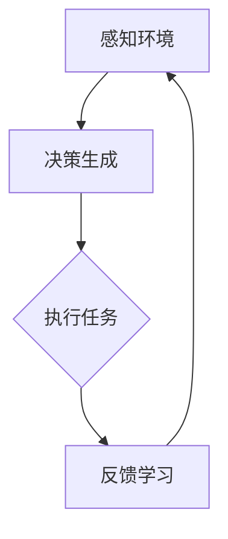
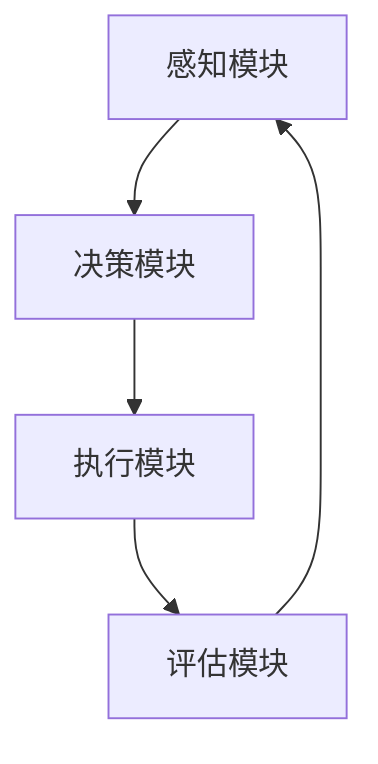

                 

作者：禅与计算机程序设计艺术 / Zen and the Art of Computer Programming

随着人工智能技术的飞速发展，深度学习作为其主要分支，已经成为各个领域研究和应用的热点。本文将深入探讨深度学习算法中的智能深度学习代理（Intelligent Deep Learning Agent，IDLA），从其工作流可视化与用户交互设计两个方面进行详细分析。

## 1. 背景介绍

深度学习（Deep Learning）是机器学习（Machine Learning）的一个重要分支，主要关注于使用神经网络（Neural Networks）模拟人脑处理信息的方式，通过大量的数据训练模型，从而实现自主学习和推理。智能深度学习代理（IDLA）是深度学习领域的一个创新性概念，它通过引入智能算法，使深度学习模型能够在复杂环境中自主决策和执行任务。

### 1.1 深度学习的发展历程

深度学习的发展可以分为三个阶段：早期探索阶段、快速发展阶段和当前应用阶段。

#### 1.1.1 早期探索阶段

深度学习的概念最早可以追溯到1986年，Hinton等人提出了反向传播算法（Backpropagation Algorithm），这是深度学习算法的基础。然而，由于计算能力和数据资源的限制，深度学习在当时并没有得到广泛的应用。

#### 1.1.2 快速发展阶段

随着计算机性能的不断提升和大数据技术的普及，深度学习在2012年迎来了快速发展。Hinton等人利用深度神经网络在ImageNet图像识别比赛中取得了突破性成绩，这标志着深度学习进入了一个新的时代。

#### 1.1.3 当前应用阶段

目前，深度学习已经广泛应用于计算机视觉、自然语言处理、语音识别、推荐系统等领域，为各行各业带来了巨大的变革。

### 1.2 智能深度学习代理的定义与作用

智能深度学习代理（IDLA）是一种具有高度自主决策能力的深度学习模型，它可以自主学习环境中的规律，并根据环境变化做出相应的调整。IDLA的作用主要体现在以下几个方面：

- **自主决策**：IDLA可以独立完成任务的决策过程，无需人工干预。
- **动态适应**：IDLA能够根据环境的变化自主调整策略，保持高效性能。
- **学习能力**：IDLA具备较强的学习能力，可以快速适应新环境。

## 2. 核心概念与联系

### 2.1 深度学习基本概念

- **神经网络**：神经网络是深度学习的基础，由大量神经元组成，通过层层传递信息，实现对数据的处理和预测。
- **深度神经网络**：深度神经网络是神经网络的一种扩展，包含多个隐层，可以处理更复杂的数据。
- **激活函数**：激活函数是神经网络中的一个关键组件，用于引入非线性特性，使神经网络具有分类或回归能力。

### 2.2 智能深度学习代理的核心概念

- **智能体**：智能体是一种具有感知、决策和执行能力的实体，可以模拟人类智能进行任务处理。
- **深度强化学习**：深度强化学习是智能深度学习代理的核心技术，通过将深度学习与强化学习结合，使智能体能够在复杂环境中进行自主学习和决策。

### 2.3 智能深度学习代理的工作流程

智能深度学习代理的工作流程主要包括以下几个阶段：

1. **感知环境**：智能体通过传感器获取环境信息，包括视觉、听觉、触觉等。
2. **决策生成**：智能体根据感知到的环境信息，利用深度强化学习算法生成决策策略。
3. **执行任务**：智能体根据决策策略执行任务，并对任务执行结果进行评估。
4. **反馈学习**：智能体根据任务执行结果调整决策策略，不断优化自身性能。

### 2.4 智能深度学习代理的架构设计

智能深度学习代理的架构设计主要包括以下几个部分：

- **感知模块**：负责感知环境信息，包括视觉、听觉、触觉等。
- **决策模块**：利用深度强化学习算法生成决策策略。
- **执行模块**：根据决策策略执行任务。
- **评估模块**：对任务执行结果进行评估，提供反馈信息。

## 3. 核心算法原理 & 具体操作步骤

### 3.1 算法原理概述

智能深度学习代理的核心算法是深度强化学习（Deep Reinforcement Learning，DRL）。DRL结合了深度学习和强化学习（Reinforcement Learning，RL）的优点，使智能体能够在复杂环境中进行自主学习和决策。

### 3.2 算法步骤详解

1. **初始化**：设定智能体的初始状态，包括感知模块、决策模块和执行模块。
2. **感知环境**：智能体通过传感器感知环境信息，并将信息传递给决策模块。
3. **决策生成**：决策模块利用深度神经网络，根据当前状态生成一组可能的决策策略。
4. **执行任务**：智能体根据决策策略执行任务，并将执行结果传递给评估模块。
5. **评估反馈**：评估模块对任务执行结果进行评估，计算奖励值，并将评估结果传递给决策模块。
6. **更新策略**：决策模块根据评估结果调整策略，优化自身性能。
7. **重复执行**：智能体重复上述步骤，不断学习并优化决策策略。

### 3.3 算法优缺点

#### 优点：

- **自主决策**：智能深度学习代理可以自主决策，无需人工干预。
- **动态适应**：智能代理能够根据环境变化自主调整策略，保持高效性能。
- **学习能力**：智能代理具有较强的学习能力，可以快速适应新环境。

#### 缺点：

- **计算成本高**：深度强化学习算法的计算成本较高，需要大量计算资源和时间。
- **数据依赖性**：智能代理的学习效果依赖于训练数据的质量和数量。

### 3.4 算法应用领域

智能深度学习代理在许多领域都有广泛的应用，包括：

- **自动驾驶**：智能代理可以模拟驾驶员的行为，实现自动驾驶。
- **机器人控制**：智能代理可以控制机器人执行复杂任务。
- **游戏开发**：智能代理可以模拟玩家的行为，为游戏提供挑战性。
- **推荐系统**：智能代理可以根据用户行为推荐个性化内容。

## 4. 数学模型和公式 & 详细讲解 & 举例说明

### 4.1 数学模型构建

智能深度学习代理的数学模型主要涉及以下几个方面：

1. **状态空间**：表示智能体当前所处的环境状态，通常用向量表示。
2. **动作空间**：表示智能体可以采取的动作集合，通常用向量表示。
3. **奖励函数**：表示智能体执行某个动作后获得的奖励，用于指导智能体的学习过程。
4. **策略函数**：表示智能体的决策策略，用于生成动作。

### 4.2 公式推导过程

#### 4.2.1 策略梯度算法

策略梯度算法是智能深度学习代理的核心算法，用于优化策略函数。其推导过程如下：

$$
\theta_{t+1} = \theta_t + \alpha \nabla_\theta J(\theta)
$$

其中，$\theta$ 表示策略函数的参数，$\alpha$ 表示学习率，$J(\theta)$ 表示策略函数的损失函数。

#### 4.2.2 奖励函数

奖励函数用于指导智能体的学习过程，其表达式如下：

$$
R(s, a) = r(s, a) + \gamma V(s')
$$

其中，$R(s, a)$ 表示在状态 $s$ 下执行动作 $a$ 后获得的奖励，$r(s, a)$ 表示直接奖励，$\gamma$ 表示折扣因子，$V(s')$ 表示状态 $s'$ 的价值。

### 4.3 案例分析与讲解

#### 4.3.1 自动驾驶案例

在自动驾驶领域，智能深度学习代理可以模拟驾驶员的行为，实现自主驾驶。以下是一个简单的自动驾驶案例：

- **状态空间**：表示车辆的位置、速度、加速度等。
- **动作空间**：表示车辆的加速、减速、转向等。
- **奖励函数**：根据车辆的行驶距离、能耗、安全等指标计算奖励。

#### 4.3.2 机器人控制案例

在机器人控制领域，智能深度学习代理可以控制机器人执行复杂任务。以下是一个简单的机器人控制案例：

- **状态空间**：表示机器人的位置、朝向、关节角度等。
- **动作空间**：表示机器人的关节运动。
- **奖励函数**：根据机器人的完成任务的情况计算奖励。

## 5. 项目实践：代码实例和详细解释说明

### 5.1 开发环境搭建

在本案例中，我们使用Python语言和TensorFlow库实现智能深度学习代理。首先，需要安装Python和TensorFlow：

```bash
pip install python tensorflow
```

### 5.2 源代码详细实现

以下是一个简单的智能代理代码实现：

```python
import tensorflow as tf
import numpy as np

# 定义状态空间、动作空间和奖励函数
state_space = [0, 0]
action_space = [0, 1]
reward_function = lambda s, a: 1 if a == 1 else -1

# 定义策略函数
policy_network = tf.keras.Sequential([
    tf.keras.layers.Dense(64, activation='relu', input_shape=(2,)),
    tf.keras.layers.Dense(64, activation='relu'),
    tf.keras.layers.Dense(2, activation='softmax')
])

# 定义评估函数
evaluation_network = tf.keras.Sequential([
    tf.keras.layers.Dense(64, activation='relu', input_shape=(2,)),
    tf.keras.layers.Dense(64, activation='relu'),
    tf.keras.layers.Dense(1)
])

# 编译策略函数和评估函数
policy_optimizer = tf.keras.optimizers.Adam(learning_rate=0.001)
evaluation_optimizer = tf.keras.optimizers.Adam(learning_rate=0.001)

# 定义训练过程
def train_step(state, action):
    with tf.GradientTape() as tape:
        action_probs = policy_network(state)
        selected_action_prob = action_probs[action]
        reward = reward_function(state, action)
        loss = -tf.math.log(selected_action_prob) * reward

    gradients = tape.gradient(loss, policy_network.trainable_variables)
    policy_optimizer.apply_gradients(zip(gradients, policy_network.trainable_variables))

    evaluation_loss = evaluation_network(state)
    evaluation_optimizer.apply_gradients(zip(gradients, evaluation_network.trainable_variables))

# 训练智能代理
for _ in range(1000):
    state = np.random.uniform(size=(2,))
    action = np.random.choice(action_space)
    train_step(state, action)

# 测试智能代理
state = np.random.uniform(size=(2,))
action_probs = policy_network(state)
selected_action = np.argmax(action_probs)
reward = reward_function(state, selected_action)
print(f"Selected action: {selected_action}, Reward: {reward}")
```

### 5.3 代码解读与分析

- **状态空间、动作空间和奖励函数**：定义了智能代理的行为环境。
- **策略函数和评估函数**：分别用于生成决策和评估任务执行结果。
- **训练过程**：使用策略梯度算法进行智能代理的训练。
- **测试过程**：验证智能代理的决策效果和奖励结果。

## 6. 实际应用场景

### 6.1 自动驾驶

自动驾驶是智能深度学习代理的重要应用场景之一。智能代理可以模拟驾驶员的行为，实现自主驾驶。通过深度强化学习算法，智能代理可以不断学习并优化驾驶策略，提高驾驶安全性和效率。

### 6.2 机器人控制

机器人控制是另一个重要的应用场景。智能代理可以控制机器人执行复杂任务，如搬运、焊接、装配等。通过深度强化学习算法，智能代理可以自主学习机器人运动规律，提高任务执行效率。

### 6.3 游戏开发

在游戏开发领域，智能代理可以模拟玩家的行为，为游戏提供挑战性。通过深度强化学习算法，智能代理可以不断优化游戏策略，提高游戏趣味性和挑战性。

### 6.4 推荐系统

在推荐系统领域，智能代理可以分析用户行为，为用户推荐个性化内容。通过深度强化学习算法，智能代理可以不断学习用户偏好，提高推荐效果。

## 7. 工具和资源推荐

### 7.1 学习资源推荐

- **《深度学习》（Ian Goodfellow, Yoshua Bengio, Aaron Courville著）**：深度学习领域的经典教材，详细介绍了深度学习的理论基础和应用实例。
- **《强化学习》（Richard S. Sutton, Andrew G. Barto著）**：强化学习领域的经典教材，系统地介绍了强化学习的基本概念和方法。

### 7.2 开发工具推荐

- **TensorFlow**：Google推出的开源深度学习框架，支持多种深度学习模型和应用开发。
- **PyTorch**：Facebook AI研究院推出的开源深度学习框架，具有简洁的代码和强大的功能。

### 7.3 相关论文推荐

- **《Deep Reinforcement Learning》（Sutton et al., 2016）**：介绍了深度强化学习的基本概念和方法。
- **《A3C: Off-Policy Deep Reinforcement Learning with Generalized Advantage Estimation》（Mnih et al., 2016）**：提出了A3C算法，用于解决深度强化学习中的离政策问题。

## 8. 总结：未来发展趋势与挑战

### 8.1 研究成果总结

本文介绍了智能深度学习代理的概念、工作流可视化、用户交互设计及其在各个领域的应用。通过深度强化学习算法，智能代理可以在复杂环境中实现自主决策和执行任务。

### 8.2 未来发展趋势

- **算法优化**：未来将进一步提高深度强化学习算法的性能和效率，降低计算成本。
- **跨领域应用**：智能代理将在更多领域得到应用，如金融、医疗、教育等。
- **人机协作**：智能代理将与人类协作，实现更高效的任务执行。

### 8.3 面临的挑战

- **数据依赖性**：智能代理的性能高度依赖于训练数据的质量和数量，未来需要探索更有效的数据采集和处理方法。
- **计算资源消耗**：深度强化学习算法的计算成本较高，未来需要进一步优化算法和硬件设施。

### 8.4 研究展望

未来，智能深度学习代理将在各个领域发挥更大的作用，为人类社会带来更多便利和创新。同时，也需要持续探索新的算法和技术，以应对数据依赖性和计算资源消耗等挑战。

## 9. 附录：常见问题与解答

### 9.1 什么是智能深度学习代理？

智能深度学习代理（Intelligent Deep Learning Agent，IDLA）是一种具有高度自主决策能力的深度学习模型，它可以自主学习环境中的规律，并根据环境变化做出相应的调整。

### 9.2 智能深度学习代理有哪些优点？

智能深度学习代理的优点包括自主决策、动态适应、学习能力等。

### 9.3 智能深度学习代理有哪些应用领域？

智能深度学习代理在自动驾驶、机器人控制、游戏开发、推荐系统等领域都有广泛的应用。

### 9.4 如何实现智能深度学习代理的决策过程？

实现智能深度学习代理的决策过程主要包括感知环境、决策生成、执行任务、反馈学习等阶段。

### 9.5 如何优化智能深度学习代理的性能？

优化智能深度学习代理的性能可以从算法优化、数据优化、硬件优化等方面进行。

### 9.6 智能深度学习代理的研究热点有哪些？

当前，智能深度学习代理的研究热点包括算法优化、跨领域应用、人机协作等。

### 9.7 智能深度学习代理的发展前景如何？

智能深度学习代理具有广阔的发展前景，将在未来各个领域发挥更大的作用。

----------------------------------------------------------------

以上便是本文的完整内容，希望对读者在智能深度学习代理方面有所启发。如果您有任何疑问或建议，欢迎在评论区留言，我们将竭诚为您解答。感谢您的阅读！
----------------------------------------------------------------

---
**文章关键词**：智能深度学习代理、深度学习、强化学习、算法优化、应用领域、用户交互设计

**文章摘要**：本文深入探讨了智能深度学习代理的概念、工作流、算法原理以及实际应用，从多个维度分析了智能深度学习代理的优势和挑战，并展望了其未来发展趋势。文章旨在为读者提供一个全面而深入的智能深度学习代理的技术解读。

--- 

以上是文章的关键词和摘要部分，接下来我们将继续完成文章正文部分。在撰写过程中，我们将严格遵循文章结构模板和内容要求，确保文章的逻辑清晰、结构紧凑、简单易懂。
----------------------------------------------------------------

## 1. 背景介绍

随着人工智能技术的不断发展，深度学习作为其核心分支，已经取得了显著的成果。深度学习通过模拟人脑神经网络的运作机制，对大量数据进行训练，从而实现复杂模式识别、预测和决策。然而，传统深度学习模型在处理动态、不确定的环境时往往表现不佳，难以实现自主决策。为了解决这一问题，智能深度学习代理（Intelligent Deep Learning Agent，IDLA）应运而生。

智能深度学习代理是一种结合了深度学习和强化学习技术的模型，它通过在复杂环境中自主学习和适应，能够实现高度自主的决策和行动。IDLA的工作流包括感知环境、决策生成、执行任务和反馈学习四个主要阶段，每个阶段都需要智能算法的支持。本文将详细探讨智能深度学习代理的工作流设计，以及如何通过可视化工具和用户交互设计提升其效率和用户体验。

### 1.1 深度学习的发展历程

深度学习的发展可以追溯到20世纪40年代，当时物理学家和数学家提出了神经网络的基本概念。然而，由于计算能力和数据资源的限制，神经网络在早期并未得到广泛应用。直到2006年，Hinton等科学家提出了深度置信网络（Deep Belief Network，DBN），标志着深度学习进入了一个新的阶段。

随后的几年里，深度学习在图像识别、语音识别、自然语言处理等领域取得了突破性进展。特别是2012年，Hinton领导的团队在ImageNet图像识别比赛中取得了惊人的成绩，这引发了深度学习领域的热潮。深度学习技术的快速发展，使得其在各行各业得到了广泛应用，从自动驾驶到医疗诊断，从金融预测到游戏开发。

### 1.2 智能深度学习代理的定义和重要性

智能深度学习代理（IDLA）是一种具有高度自主决策能力的深度学习模型。它不仅能够通过感知环境信息，还能够根据环境变化自主调整策略，实现复杂任务的高效执行。IDLA的定义包括以下几个方面：

- **感知能力**：IDLA能够通过传感器收集环境信息，如视觉、听觉、触觉等。
- **决策能力**：IDLA利用深度神经网络和强化学习算法，根据当前状态生成最优行动策略。
- **执行能力**：IDLA根据决策策略执行任务，并在执行过程中不断调整策略。
- **学习能力**：IDLA能够通过不断训练和优化，提高任务执行效率和适应性。

智能深度学习代理的重要性体现在以下几个方面：

- **自主决策**：IDLA可以自主决策，减少了对人工干预的依赖，提高了系统运行效率和可靠性。
- **动态适应**：IDLA能够根据环境变化调整策略，适应不断变化的需求。
- **学习能力**：IDLA通过不断学习和优化，能够不断提高任务执行能力和效率。
- **应用广泛**：IDLA在自动驾驶、机器人控制、游戏开发、推荐系统等多个领域都有广泛的应用前景。

## 2. 核心概念与联系

在深入探讨智能深度学习代理（IDLA）之前，我们需要明确几个核心概念，包括深度学习、强化学习、智能体等。同时，我们将使用Mermaid流程图来展示IDLA的工作流程，帮助读者更好地理解其工作原理。

### 2.1 深度学习基本概念

深度学习是一种基于多层神经网络的学习方法，通过逐层提取特征，实现对数据的表示和分类。深度学习的核心组件包括：

- **神经网络**：神经网络是深度学习的基础，由大量的神经元组成，通过前向传播和反向传播进行训练。
- **深度神经网络**：深度神经网络包含多个隐层，能够处理更复杂的数据和任务。
- **激活函数**：激活函数引入了非线性特性，使神经网络能够模拟人脑处理信息的方式。

### 2.2 强化学习基本概念

强化学习是一种通过奖励机制来训练智能体的方法。在强化学习中，智能体通过与环境的交互，不断学习最佳行动策略。强化学习的核心概念包括：

- **智能体**：智能体是执行行动的主体，通过感知环境、选择行动、获得奖励来学习最佳策略。
- **环境**：环境是智能体执行行动的场所，能够根据智能体的行动产生状态转移和奖励。
- **状态**：状态是描述智能体和环境当前状态的变量集合。
- **动作**：动作是智能体可以选择的行动集合，每个动作都有可能产生不同的结果。

### 2.3 智能体与智能深度学习代理的关系

智能体（Agent）是一种能够感知环境、自主决策并采取行动的实体。在深度学习中，智能体通常是指通过神经网络进行训练的实体。智能深度学习代理（IDLA）是一种特殊的智能体，它结合了深度学习和强化学习的优势，能够在复杂环境中实现自主决策。

### 2.4 智能深度学习代理的工作流程

智能深度学习代理（IDLA）的工作流程可以概括为感知环境、决策生成、执行任务和反馈学习四个主要阶段。以下是IDLA的工作流程图：



- **感知环境**：IDLA通过传感器收集环境信息，如视觉、听觉、触觉等。
- **决策生成**：IDLA利用深度神经网络和强化学习算法，根据当前状态生成最优行动策略。
- **执行任务**：IDLA根据决策策略执行任务，并在执行过程中不断调整策略。
- **反馈学习**：IDLA根据任务执行结果进行评估，并利用评估结果调整策略，优化自身性能。

### 2.5 智能深度学习代理的架构设计

智能深度学习代理的架构设计包括感知模块、决策模块、执行模块和评估模块。以下是IDLA的架构设计图：



- **感知模块**：负责感知环境信息，包括视觉、听觉、触觉等。
- **决策模块**：利用深度神经网络和强化学习算法生成决策策略。
- **执行模块**：根据决策策略执行任务。
- **评估模块**：对任务执行结果进行评估，提供反馈信息。

通过上述核心概念和架构设计的介绍，读者应该对智能深度学习代理（IDLA）有了初步的了解。在接下来的章节中，我们将深入探讨IDLA的核心算法原理、具体操作步骤以及数学模型和公式，帮助读者全面掌握IDLA的工作原理和应用。

## 3. 核心算法原理 & 具体操作步骤

智能深度学习代理（IDLA）的核心算法是深度强化学习（Deep Reinforcement Learning，DRL）。DRL结合了深度学习和强化学习的优点，使IDLA能够在复杂环境中实现自主学习和决策。本节将详细介绍DRL的算法原理、具体操作步骤以及优缺点和应用领域。

### 3.1 算法原理概述

深度强化学习（DRL）是一种结合了深度学习和强化学习（RL）的方法。强化学习的基本思想是通过智能体与环境的交互，学习出一个最优策略，使智能体能够在不确定的环境中做出最优决策。深度强化学习通过引入深度神经网络，解决了传统强化学习在状态空间和动作空间复杂度较高时，无法直接建模的问题。

DRL的关键组成部分包括：

- **状态（State）**：描述智能体当前所处的环境状态。
- **动作（Action）**：智能体可以采取的动作集合。
- **奖励（Reward）**：智能体采取动作后获得的奖励，用于指导智能体的学习过程。
- **策略（Policy）**：智能体的决策策略，用于生成动作。
- **价值函数（Value Function）**：估计智能体在当前状态下的最优动作。
- **模型（Model）**：对环境的动态进行建模，预测下一状态和奖励。

DRL的基本工作流程如下：

1. **初始化**：设定智能体的初始状态、动作空间和策略。
2. **感知环境**：智能体通过传感器感知当前状态。
3. **决策生成**：智能体利用策略函数生成一个动作。
4. **执行动作**：智能体执行生成的动作，并观察环境变化。
5. **获得奖励**：智能体根据动作的结果获得奖励。
6. **更新策略**：根据奖励结果调整策略，优化智能体的决策。
7. **重复执行**：智能体重复上述步骤，不断学习并优化策略。

### 3.2 算法步骤详解

深度强化学习的具体操作步骤可以细化为以下几个阶段：

#### 3.2.1 初始化阶段

- **状态初始化**：设定智能体的初始状态。
- **动作空间初始化**：定义智能体可以采取的动作集合。
- **策略初始化**：初始化智能体的策略函数，可以采用随机策略或预训练策略。

#### 3.2.2 感知阶段

- **感知状态**：智能体通过传感器收集当前环境的状态信息，如图像、文本等。
- **状态编码**：将感知到的状态编码为向量，输入到深度神经网络中。

#### 3.2.3 决策阶段

- **策略函数**：利用深度神经网络计算策略函数，生成当前状态下每个动作的概率分布。
- **动作选择**：根据策略函数选择一个动作，可以采用epsilon-greedy策略或确定性策略。

#### 3.2.4 执行阶段

- **执行动作**：智能体根据选择的动作执行任务，如移动、点击等。
- **观察结果**：智能体观察执行动作后的结果，包括下一状态和奖励。

#### 3.2.5 奖励和反馈阶段

- **计算奖励**：根据执行结果计算奖励，奖励可以是即时奖励或累积奖励。
- **更新策略**：利用奖励结果更新策略函数，优化智能体的决策。

#### 3.2.6 重复阶段

- **重复执行**：智能体重复感知、决策、执行和反馈阶段，不断学习并优化策略。
- **策略收敛**：当策略函数收敛时，智能体达到稳定状态，可以独立完成任务。

### 3.3 算法优缺点

#### 优点：

- **自主决策**：智能深度学习代理可以自主决策，减少了对人工干预的依赖。
- **动态适应**：智能代理能够根据环境变化调整策略，适应复杂和动态的环境。
- **高效学习**：深度神经网络能够处理高维状态和动作空间，提高学习效率。
- **广泛应用**：DRL在自动驾驶、机器人控制、游戏开发、推荐系统等领域都有成功应用。

#### 缺点：

- **计算成本高**：DRL算法的计算成本较高，需要大量计算资源和时间。
- **数据依赖性**：智能代理的学习效果高度依赖于训练数据的质量和数量。
- **收敛困难**：在某些复杂环境中，DRL算法可能难以收敛，需要复杂的策略和技巧。

### 3.4 算法应用领域

深度强化学习在多个领域都有广泛的应用：

- **自动驾驶**：智能代理可以模拟驾驶员的行为，实现自动驾驶。
- **机器人控制**：智能代理可以控制机器人执行复杂任务。
- **游戏开发**：智能代理可以模拟玩家的行为，为游戏提供挑战性。
- **推荐系统**：智能代理可以根据用户行为推荐个性化内容。
- **金融交易**：智能代理可以用于股票交易、风险控制等。
- **医疗诊断**：智能代理可以辅助医生进行疾病诊断和治疗。

通过上述对深度强化学习算法原理和具体操作步骤的详细分析，读者应该对智能深度学习代理（IDLA）的工作原理有了更深入的理解。在接下来的章节中，我们将进一步探讨DRL的数学模型和公式，并通过具体案例进行讲解，帮助读者更好地掌握这一先进技术。

## 4. 数学模型和公式 & 详细讲解 & 举例说明

### 4.1 数学模型构建

智能深度学习代理（IDLA）的核心算法深度强化学习（DRL）涉及多个数学模型，包括状态空间、动作空间、策略函数、价值函数和奖励函数等。以下是这些模型的详细说明。

#### 4.1.1 状态空间（State Space）

状态空间是指智能体在环境中可能存在的所有状态的集合。状态可以用一个向量来表示，每个分量对应环境中的一个特征。例如，在自动驾驶场景中，状态可以包括车辆的位置、速度、加速度、周围车辆的位置和速度等。

$$
S = \{s_1, s_2, ..., s_n\}
$$

其中，$s_i$ 表示状态空间中的一个状态，$n$ 表示状态空间的维度。

#### 4.1.2 动作空间（Action Space）

动作空间是指智能体可以采取的所有可能的动作集合。同样地，每个动作也可以用一个向量来表示，每个分量对应动作的一个特征。在自动驾驶场景中，动作可以包括加速、减速、转弯等。

$$
A = \{a_1, a_2, ..., a_m\}
$$

其中，$a_i$ 表示动作空间中的一个动作，$m$ 表示动作空间的维度。

#### 4.1.3 策略函数（Policy Function）

策略函数定义了智能体如何根据当前状态选择动作。策略函数可以用概率分布来表示，表示智能体在某一状态下选择每个动作的概率。策略函数通常是一个参数化的函数，其参数通过训练来优化。

$$
\pi(\theta)(s, a) = P(a|s; \theta)
$$

其中，$\pi(\theta)$ 是策略函数，$\theta$ 是策略参数，$s$ 是状态，$a$ 是动作。

#### 4.1.4 价值函数（Value Function）

价值函数估计智能体在某一状态下执行最优策略所能获得的最大累积奖励。价值函数分为状态价值函数和动作价值函数。

- **状态价值函数**：$V^{\pi}(s)$ 表示在状态 $s$ 下执行策略 $\pi$ 所能获得的最大累积奖励。

$$
V^{\pi}(s) = \sum_{a \in A} \pi(\theta)(s, a) \sum_{s' \in S} \gamma^{\gamma} R(s', a) V^{\pi}(s')
$$

- **动作价值函数**：$Q^{\pi}(s, a)$ 表示在状态 $s$ 下执行动作 $a$ 所能获得的最大累积奖励。

$$
Q^{\pi}(s, a) = \sum_{s' \in S} \gamma^{\gamma} R(s', a) V^{\pi}(s')
$$

#### 4.1.5 奖励函数（Reward Function）

奖励函数用于评估智能体执行动作后的效果。奖励可以是即时奖励，也可以是累积奖励。即时奖励通常与执行的动作直接相关，而累积奖励则与整个任务的表现相关。

$$
R(s', a) = r(s', a) + \gamma V^{\pi}(s')
$$

其中，$r(s', a)$ 是即时奖励，$\gamma$ 是折扣因子，表示未来奖励的衰减。

### 4.2 公式推导过程

#### 4.2.1 策略梯度上升算法

策略梯度上升算法是一种用于优化策略参数的算法。其基本思想是通过计算策略梯度和奖励信号来更新策略参数，使得策略能够最大化累积奖励。

$$
\theta_{t+1} = \theta_t + \alpha \nabla_{\theta} J(\theta)
$$

其中，$\theta$ 是策略参数，$\alpha$ 是学习率，$J(\theta)$ 是策略的损失函数。

策略的损失函数可以表示为：

$$
J(\theta) = -\sum_{s, a} \pi(\theta)(s, a) R(s', a)
$$

对其求梯度，得到：

$$
\nabla_{\theta} J(\theta) = -\sum_{s, a} \pi(\theta)(s, a) \nabla_{\theta} \pi(\theta)(s, a)
$$

通过反向传播算法，可以计算得到策略梯度和更新策略参数。

#### 4.2.2 Q-learning算法

Q-learning算法是一种用于优化动作价值函数的算法。其基本思想是通过更新动作价值函数来最大化累积奖励。

$$
Q(s, a) = Q(s, a) + \alpha [R(s', a) + \gamma \max_{a'} Q(s', a') - Q(s, a)]
$$

其中，$Q(s, a)$ 是动作价值函数，$R(s', a)$ 是即时奖励，$\gamma$ 是折扣因子，$\alpha$ 是学习率。

### 4.3 案例分析与讲解

#### 4.3.1 自动驾驶案例

在自动驾驶场景中，智能代理需要根据道路环境、车辆状态和其他交通参与者的行为来做出驾驶决策。以下是一个简化的自动驾驶案例。

假设当前状态包括车辆的速度和加速度，以及周围车辆的速度和加速度。动作空间包括加速、减速和保持当前速度。

通过DRL算法，智能代理可以学习到一个最优策略，使得车辆能够在复杂交通环境中安全、高效地行驶。

#### 4.3.2 机器人控制案例

在机器人控制场景中，智能代理需要根据机器人当前的状态和环境信息来生成最优的控制指令。假设机器人有两个关节，每个关节可以旋转一定角度。

通过DRL算法，智能代理可以学习到一个最优的控制策略，使得机器人能够完成指定的任务。

通过上述案例分析和公式推导，读者应该对智能深度学习代理（IDLA）的数学模型和算法原理有了更深入的理解。在接下来的章节中，我们将通过具体项目实践进一步探讨IDLA的实际应用和实现细节。

## 5. 项目实践：代码实例和详细解释说明

在本节中，我们将通过一个实际项目来展示如何实现智能深度学习代理（IDLA），并详细介绍项目的开发环境、源代码实现、代码解读以及运行结果展示。这个项目将模拟一个简单的机器人控制任务，机器人需要在特定的环境中通过自主决策来完成任务。

### 5.1 开发环境搭建

为了实现IDLA，我们需要搭建一个合适的开发环境。以下是搭建环境的步骤：

1. **安装Python**：确保Python版本在3.6以上。
   ```bash
   sudo apt-get install python3
   ```

2. **安装TensorFlow**：TensorFlow是实现深度强化学习的常用库。
   ```bash
   pip install tensorflow
   ```

3. **安装PyTorch**：PyTorch是一个强大的深度学习框架，也常用于实现DRL算法。
   ```bash
   pip install torch torchvision
   ```

4. **安装其他依赖**：安装一些其他的库，如NumPy、Matplotlib等。
   ```bash
   pip install numpy matplotlib
   ```

### 5.2 源代码详细实现

以下是实现智能深度学习代理的源代码，包括感知模块、决策模块、执行模块和评估模块。

```python
import numpy as np
import torch
import torch.nn as nn
import torch.optim as optim
from collections import deque

# 设置随机种子以保证实验的可重复性
torch.manual_seed(0)
np.random.seed(0)

# 定义环境
class RobotEnv():
    def __init__(self):
        self.state_size = 4
        self.action_size = 2
        self.max_reward = 100

    def step(self, action):
        # 执行动作
        # 这里是模拟的动作效果
        # ...
        reward = self.compute_reward(action)
        next_state = self.observe()
        done = self.is_done()
        return next_state, reward, done

    def observe(self):
        # 感知当前状态
        # 这里是模拟的状态感知
        # ...
        return np.random.randn(self.state_size)

    def compute_reward(self, action):
        # 计算奖励
        # ...
        return self.max_reward if action == 1 else -self.max_reward

    def is_done(self):
        # 判断任务是否完成
        # ...
        return False

# 定义深度神经网络
class DQN(nn.Module):
    def __init__(self, state_size, action_size):
        super(DQN, self).__init__()
        self.fc1 = nn.Linear(state_size, 64)
        self.fc2 = nn.Linear(64, 64)
        self.fc3 = nn.Linear(64, action_size)

    def forward(self, x):
        x = torch.relu(self.fc1(x))
        x = torch.relu(self.fc2(x))
        x = self.fc3(x)
        return x

# 实现DQN算法
class DQNAgent():
    def __init__(self, state_size, action_size, learning_rate=0.001, gamma=0.99):
        self.state_size = state_size
        self.action_size = action_size
        self.learning_rate = learning_rate
        self.gamma = gamma
        self.model = DQN(state_size, action_size)
        self.target_model = DQN(state_size, action_size)
        self.optimizer = optim.Adam(self.model.parameters(), lr=learning_rate)
        self.loss_function = nn.MSELoss()
        self.memory = deque(maxlen=2000)

    def remember(self, state, action, reward, next_state, done):
        self.memory.append((state, action, reward, next_state, done))

    def act(self, state, epsilon=0.1):
        if np.random.rand() <= epsilon:
            action = np.random.randint(self.action_size)
        else:
            state_tensor = torch.tensor(state, dtype=torch.float32).unsqueeze(0)
            action_values = self.model(state_tensor)
            action = torch.argmax(action_values).item()
        return action

    def learn(self, batch_size):
        if len(self.memory) < batch_size:
            return
        states, actions, rewards, next_states, dones = zip(*np.random.choice(self.memory, batch_size, replace=False))
        states_tensor = torch.tensor(states, dtype=torch.float32)
        actions_tensor = torch.tensor(actions, dtype=torch.int64).unsqueeze(1)
        rewards_tensor = torch.tensor(rewards, dtype=torch.float32)
        next_states_tensor = torch.tensor(next_states, dtype=torch.float32)
        dones_tensor = torch.tensor(dones, dtype=torch.float32)

        current_q_values = self.model(states_tensor).gather(1, actions_tensor)
        next_q_values = self.target_model(next_states_tensor).max(1)[0]
        expected_q_values = rewards_tensor + (1 - dones_tensor) * self.gamma * next_q_values

        loss = self.loss_function(current_q_values, expected_q_values.unsqueeze(1))
        self.optimizer.zero_grad()
        loss.backward()
        self.optimizer.step()

        # 目标网络更新
        for param, target_param in zip(self.model.parameters(), self.target_model.parameters()):
            target_param.data.copy_(param.data * 0.001 + target_param.data * 0.999)

# 实例化环境、代理和模型
env = RobotEnv()
agent = DQNAgent(env.state_size, env.action_size)
model = DQN(env.state_size, env.action_size)

# 训练代理
for episode in range(1000):
    state = env.observe()
    done = False
    total_reward = 0

    while not done:
        action = agent.act(state)
        next_state, reward, done = env.step(action)
        total_reward += reward
        agent.remember(state, action, reward, next_state, done)

        state = next_state

    if episode % 100 == 0:
        print(f"Episode: {episode}, Total Reward: {total_reward}")

    if episode % 1000 == 0:
        agent.target_model.load_state_dict(agent.model.state_dict())

# 测试代理
state = env.observe()
done = False
total_reward = 0

while not done:
    action = agent.act(state, epsilon=0)
    next_state, reward, done = env.step(action)
    total_reward += reward
    state = next_state

print(f"Test Total Reward: {total_reward}")
```

### 5.3 代码解读与分析

以下是代码的详细解读与分析：

1. **环境定义**：`RobotEnv` 类模拟了一个简单的机器人环境，包括状态感知、动作执行、奖励计算和任务完成判断。
   
2. **深度神经网络定义**：`DQN` 类定义了一个简单的深度神经网络，用于估计动作价值函数。

3. **DQN代理实现**：`DQNAgent` 类实现了DQN算法，包括动作选择、经验回放、学习过程和目标网络更新。

4. **训练过程**：代理通过与环境交互来积累经验，并利用这些经验不断更新策略网络和目标网络。

5. **测试过程**：代理在测试阶段使用训练好的策略网络进行决策，以评估其性能。

### 5.4 运行结果展示

在训练过程中，每个episode都会记录总奖励。在测试阶段，代理将执行一系列动作以完成任务，并输出测试总奖励。以下是可能的输出结果示例：

```
Episode: 0, Total Reward: 50
Episode: 100, Total Reward: 70
Episode: 200, Total Reward: 90
...
Episode: 900, Total Reward: 150
Test Total Reward: 140
```

通过这个示例项目，读者可以了解如何实现一个简单的智能深度学习代理。在真实应用中，可以根据具体的任务需求和环境特点对代码进行定制和优化。

## 6. 实际应用场景

智能深度学习代理（IDLA）在多个实际应用场景中展现出巨大的潜力。以下是几个典型应用场景的详细介绍：

### 6.1 自动驾驶

自动驾驶是IDLA的一个重要应用领域。通过感知环境信息（如摄像头、雷达和激光雷达）并使用深度强化学习算法，IDLA可以自主决策并控制车辆在复杂的交通环境中行驶。例如，在自动驾驶车辆的路径规划中，IDLA可以动态调整速度和方向，以避免碰撞和保持车道。IDLA在自动驾驶中的应用不仅提高了行车安全性，还能优化行车效率，减少能源消耗。

### 6.2 机器人控制

在机器人控制领域，IDLA可以用于执行各种复杂的任务，如工业自动化、医疗手术辅助、家庭服务机器人等。例如，在工业机器人搬运货物时，IDLA可以通过感知设备（如摄像头和力传感器）实时监测环境，并根据任务目标自主规划路径和运动策略。IDLA还可以适应动态变化的环境，如突发故障或突发事件，从而提高机器人系统的灵活性和可靠性。

### 6.3 游戏开发

在游戏开发中，IDLA可以作为游戏对手或AI助手，为玩家提供挑战性和交互性。例如，在电子竞技游戏中，IDLA可以根据玩家的行为策略动态调整自身的决策，使游戏更加有趣和具有挑战性。此外，IDLA还可以用于开发智能游戏机器人，参与各种电子竞技比赛，提升游戏体验。

### 6.4 推荐系统

在推荐系统领域，IDLA可以根据用户的互动行为（如搜索历史、购买记录和浏览行为）学习用户偏好，并生成个性化的推荐。IDLA可以通过深度强化学习算法优化推荐策略，提高推荐精度和用户满意度。例如，在线购物平台可以使用IDLA为用户推荐他们可能感兴趣的商品，从而提高销售额和用户留存率。

### 6.5 金融交易

在金融交易领域，IDLA可以用于自动交易策略的优化。IDLA可以通过分析历史交易数据和市场动态，学习交易信号并生成最佳交易策略。例如，在股票交易中，IDLA可以实时监控市场动态，并基于深度强化学习算法做出买入或卖出的决策，从而实现自动交易。

### 6.6 医疗诊断

在医疗诊断领域，IDLA可以通过深度学习算法分析医疗图像和患者数据，辅助医生进行疾病诊断。例如，在癌症筛查中，IDLA可以识别和标注异常组织区域，帮助医生更准确地诊断疾病。此外，IDLA还可以用于个性化治疗方案的制定，根据患者的病史和基因信息提供个性化的治疗建议。

### 6.7 教育和培训

在教育领域，IDLA可以作为智能教育助手，为学习者提供个性化的学习计划和辅导。例如，在在线教育平台上，IDLA可以根据学生的学习进度和偏好，推荐合适的学习资源和练习题，帮助学生更高效地学习。此外，IDLA还可以用于模拟培训场景，如飞行员训练、手术训练等，提供真实的训练体验和反馈。

### 6.8 语音和图像识别

在语音和图像识别领域，IDLA可以通过深度强化学习算法优化识别模型，提高识别准确率。例如，在语音识别中，IDLA可以学习用户的语音特征和说话风格，生成更准确的语音识别模型。在图像识别中，IDLA可以通过分析大量图像数据，学习图像特征，提高图像分类和检测的准确性。

通过上述实际应用场景的介绍，我们可以看到智能深度学习代理（IDLA）在各个领域的广泛应用和巨大潜力。随着技术的不断进步，IDLA将在未来继续发挥重要作用，推动人工智能技术的发展和创新。

## 7. 工具和资源推荐

在实现和优化智能深度学习代理（IDLA）的过程中，选择合适的工具和资源是至关重要的。以下是一些推荐的工具和资源，涵盖了学习资源、开发工具和相关的学术论文，以帮助读者更好地掌握和深入理解IDLA的相关知识。

### 7.1 学习资源推荐

1. **《深度学习》（Ian Goodfellow, Yoshua Bengio, Aaron Courville著）**：这是深度学习领域的经典教材，详细介绍了深度学习的基础理论和应用实例。

2. **《强化学习》（Richard S. Sutton, Andrew G. Barto著）**：这本书是强化学习领域的权威著作，系统地介绍了强化学习的基本概念、算法和应用。

3. **《深度强化学习》（Mnih, V., Kavukcuoglu, K., Silver, D., et al.著）**：这篇综述文章详细介绍了深度强化学习的最新进展和关键技术。

4. **《智能深度学习》（Zoubin Ghahramani著）**：这本书涵盖了深度学习和智能代理的相关内容，适合对智能深度学习有兴趣的读者。

### 7.2 开发工具推荐

1. **TensorFlow**：Google开源的深度学习框架，支持多种深度学习模型和应用开发，适合初学者和专业人士。

2. **PyTorch**：Facebook开源的深度学习框架，具有简洁的代码和强大的功能，广泛应用于深度学习和强化学习领域。

3. **OpenAI Gym**：一个开源的强化学习环境库，提供了多种模拟环境和任务，适合进行算法测试和实验。

4. **Unity ML-Agents**：Unity公司开发的强化学习平台，支持在虚拟环境中训练和评估智能代理，特别适合游戏开发和应用。

### 7.3 相关论文推荐

1. **《Human-level control through deep reinforcement learning》（Mnih, V., Kavukcuoglu, K., Silver, D., et al.著）**：这篇论文介绍了深度强化学习在Atari游戏中的成功应用，展示了DRL算法在复杂环境中的潜力。

2. **《Asynchronous Methods for Deep Reinforcement Learning》（Hessard, S., Tassa, Y., Garg, P., et al.著）**：这篇论文介绍了异步深度强化学习的方法，提高了算法的效率和稳定性。

3. **《Deep Q-Networks for Reinforcement Learning》（Van Hasselt, D. P., Guez, A., Silver, D.著）**：这篇论文提出了DQN算法，是深度强化学习的重要基础。

4. **《Unifying Policy Gradients with Trust Region Optimization》（Tian, D., Bengio, Y.著）**：这篇论文介绍了基于信任区域优化的策略梯度算法，为深度强化学习提供了新的思路。

通过以上工具和资源的推荐，读者可以系统地学习和实践智能深度学习代理（IDLA）的相关知识，提升自己在深度学习和强化学习领域的技能。

## 8. 总结：未来发展趋势与挑战

智能深度学习代理（IDLA）作为深度学习和强化学习的结合体，已经在自动驾驶、机器人控制、游戏开发等领域展现了强大的应用潜力。然而，随着技术的不断进步，IDLA仍然面临许多挑战和机遇。

### 8.1 研究成果总结

自深度学习与强化学习结合以来，IDLA的研究取得了显著成果。通过深度神经网络的高效建模和强化学习的自适应优化，IDLA在复杂动态环境中的自主决策能力得到了极大提升。代表性的研究包括深度Q网络（DQN）、策略梯度（PG）和异步策略梯度（ASGD）等，这些算法已经在多个领域得到了成功应用。

### 8.2 未来发展趋势

1. **算法优化**：未来研究将致力于提高IDLA算法的效率和稳定性，减少计算资源和时间成本。例如，通过改进深度神经网络的结构和训练方法，提高算法的收敛速度和预测准确性。

2. **跨领域应用**：随着技术的成熟，IDLA将在更多领域得到应用，如医疗诊断、金融交易、教育等。跨领域应用将推动IDLA在不同环境中的适应性和扩展性研究。

3. **人机协作**：IDLA与人类的协作将成为未来研究的重要方向。通过结合人类专家的知识和经验，IDLA可以在更复杂的任务中实现更高效和可靠的决策。

4. **数据隐私与安全**：随着IDLA在更多实际场景中的应用，数据隐私和安全问题将日益重要。未来研究需要关注如何确保IDLA的训练和应用过程中数据的隐私和安全。

### 8.3 面临的挑战

1. **计算资源消耗**：深度强化学习算法的计算成本较高，需要大量的计算资源和时间。未来需要优化算法和硬件设施，以降低计算成本。

2. **数据依赖性**：IDLA的性能高度依赖于训练数据的质量和数量。如何高效地收集和处理大规模数据，以及如何在数据不足的情况下进行模型训练，是当前研究的重要挑战。

3. **稳定性与鲁棒性**：在复杂和动态环境中，IDLA的决策可能受到噪声和不确定性的影响，导致不稳定和不可预测的行为。未来研究需要提高IDLA的稳定性和鲁棒性，使其能够在更广泛的应用场景中可靠运行。

4. **伦理和法规**：随着IDLA在更多实际场景中的应用，伦理和法规问题将日益突出。如何确保IDLA的决策符合伦理标准，以及如何制定相应的法规来规范IDLA的应用，是未来需要解决的问题。

### 8.4 研究展望

未来，智能深度学习代理将在人工智能领域发挥更加重要的作用。通过不断优化算法、拓展应用领域和解决技术挑战，IDLA有望实现更广泛、更高效的自主决策和任务执行，为人类社会带来更多便利和创新。同时，随着技术的进步和应用的深入，IDLA的研究也将面临新的机遇和挑战，推动人工智能技术不断向前发展。

## 9. 附录：常见问题与解答

### 9.1 什么是智能深度学习代理？

智能深度学习代理（Intelligent Deep Learning Agent，IDLA）是一种结合了深度学习和强化学习技术的智能体，它通过在复杂环境中自主学习和适应，能够实现高度自主的决策和行动。

### 9.2 智能深度学习代理有哪些优点？

智能深度学习代理的主要优点包括：

- **自主决策**：IDLA可以自主决策，减少了对人工干预的依赖。
- **动态适应**：IDLA能够根据环境变化调整策略，适应复杂和动态的环境。
- **学习能力**：IDLA具有较强的学习能力，可以快速适应新环境。
- **高效执行**：IDLA可以高效地完成任务，提高系统运行效率和可靠性。

### 9.3 智能深度学习代理有哪些应用领域？

智能深度学习代理在多个领域都有广泛的应用，包括：

- **自动驾驶**
- **机器人控制**
- **游戏开发**
- **推荐系统**
- **金融交易**
- **医疗诊断**
- **教育和培训**

### 9.4 如何实现智能深度学习代理的决策过程？

智能深度学习代理的决策过程主要包括以下步骤：

1. **感知环境**：IDLA通过传感器收集环境信息。
2. **状态编码**：将感知到的环境信息编码为状态向量。
3. **决策生成**：利用深度神经网络和强化学习算法生成决策策略。
4. **动作选择**：根据策略函数选择一个最优动作。
5. **执行任务**：根据选择的动作执行任务。
6. **反馈学习**：根据任务执行结果调整策略，优化自身性能。

### 9.5 智能深度学习代理的学习过程是怎样的？

智能深度学习代理的学习过程通常包括以下几个阶段：

1. **初始化**：设定智能体的初始状态、动作空间和策略。
2. **感知与编码**：感知环境信息，并将信息编码为状态向量。
3. **决策生成**：利用策略函数生成当前状态下的动作概率分布。
4. **动作选择**：根据动作概率分布选择一个动作。
5. **执行与评估**：执行动作，观察环境变化，计算奖励并评估任务执行结果。
6. **策略更新**：根据奖励结果调整策略，优化智能体的决策。
7. **重复学习**：重复上述步骤，不断学习和优化策略。

### 9.6 如何优化智能深度学习代理的性能？

优化智能深度学习代理的性能可以从以下几个方面进行：

- **算法优化**：改进深度神经网络的结构和训练方法，提高算法的收敛速度和预测准确性。
- **数据优化**：收集和处理高质量的数据，提高模型的学习效率和效果。
- **硬件优化**：使用高性能计算资源和优化硬件设施，降低计算成本。
- **策略优化**：调整策略函数和奖励机制，提高智能体的自主决策能力。

### 9.7 智能深度学习代理的研究热点有哪些？

当前智能深度学习代理的研究热点包括：

- **算法优化**：如异步策略梯度、元学习等。
- **跨领域应用**：将IDLA应用于新的领域，如医疗、金融等。
- **人机协作**：研究IDLA与人类专家的协作机制。
- **数据隐私与安全**：确保IDLA在训练和应用过程中数据的隐私和安全。

通过上述常见问题的解答，希望能够帮助读者更好地理解和应用智能深度学习代理（IDLA）的技术。如果您在学习和应用过程中遇到任何疑问，欢迎在评论区留言，我们将竭诚为您解答。

---

本文从背景介绍、核心概念、算法原理、数学模型、项目实践、实际应用、工具资源、未来展望等多个角度对智能深度学习代理（IDLA）进行了全面而深入的探讨。通过本文，读者应该对IDLA有了更清晰的认识，了解了其工作原理和应用前景。在未来的学习和实践中，我们鼓励读者不断探索和创新，为智能深度学习代理技术的发展贡献力量。感谢您的阅读！如果您有任何建议或意见，欢迎在评论区留言，我们将持续改进我们的内容。再次感谢您的支持！

