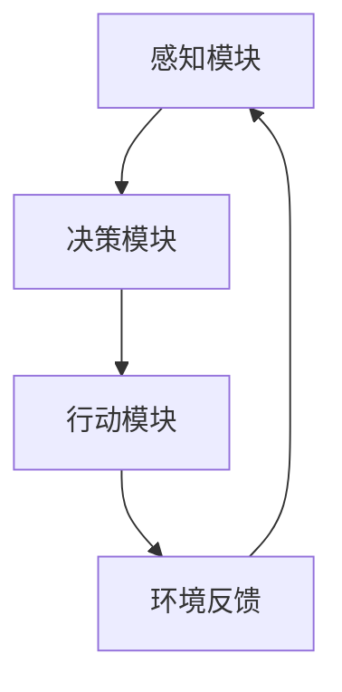

                 

关键词：人工智能，深度学习，智能代理，算法原理，数学模型，项目实践，未来展望

> 摘要：本文深入探讨人工智能领域中的深度学习算法及其在智能深度学习代理中的应用。通过介绍核心概念、算法原理、数学模型和项目实践，本文旨在为读者提供全面的深度学习技术指南，并展望未来的发展趋势和挑战。

## 1. 背景介绍

人工智能（AI）作为计算机科学的前沿领域，已经取得了显著的发展。特别是深度学习（Deep Learning），作为一种机器学习（Machine Learning）的重要分支，凭借其强大的数据建模和模式识别能力，在图像识别、语音识别、自然语言处理等众多领域取得了突破性的成果。智能深度学习代理（Intelligent Deep Learning Agent）作为深度学习技术的高级应用，正在逐步改变人们的生活方式。

随着大数据和计算能力的不断提升，深度学习算法在各个行业中的应用越来越广泛。然而，深度学习技术也面临着一系列挑战，如过拟合、计算效率低、模型可解释性差等。为了解决这些问题，研究人员不断探索新的算法和技术。

本文将围绕智能深度学习代理的深度学习技术展开讨论，首先介绍相关核心概念，然后深入分析算法原理，接着阐述数学模型和具体操作步骤，最后通过实际项目实践来展示深度学习技术的应用。此外，文章还将探讨深度学习在各个领域的实际应用场景，并对未来发展趋势和面临的挑战进行展望。

## 2. 核心概念与联系

在深入探讨深度学习算法之前，我们需要明确一些核心概念和它们之间的联系。

### 2.1 智能深度学习代理

智能深度学习代理是一种基于深度学习技术的人工智能实体，它可以自主学习、适应环境和执行任务。智能深度学习代理通常由感知模块、决策模块和行动模块组成。感知模块负责接收环境信息，决策模块基于感知信息生成行动策略，行动模块则将策略转换为具体行动。这种结构使得智能深度学习代理能够在复杂的环境中表现出色。

### 2.2 深度学习算法

深度学习算法是一种模拟人脑神经网络结构的算法，通过多层神经网络进行数据处理和特征提取。深度学习算法的核心是反向传播算法（Backpropagation Algorithm），它通过不断调整网络权重来优化模型性能。常见的深度学习算法包括卷积神经网络（CNN）、循环神经网络（RNN）和生成对抗网络（GAN）等。

### 2.3 数学模型

深度学习算法的核心是数学模型。数学模型用于描述神经网络结构、参数和损失函数。在深度学习中，常用的数学模型包括线性模型、非线性模型和损失函数等。其中，损失函数用于衡量模型预测结果与真实结果之间的差距，是优化模型性能的关键。

### 2.4 Mermaid 流程图

为了更直观地展示智能深度学习代理的工作流程，我们可以使用 Mermaid 流程图来描述。以下是一个简单的 Mermaid 流程图示例：



在这个流程图中，感知模块接收环境信息，决策模块生成行动策略，行动模块执行具体行动，环境反馈再次输入感知模块，形成闭环。

## 3. 核心算法原理 & 具体操作步骤

### 3.1 算法原理概述

深度学习算法的核心是神经网络。神经网络由多个神经元（或节点）组成，每个神经元都与相邻的神经元相连，并通过权重和偏置进行信息传递。神经网络的训练过程就是通过不断调整权重和偏置来最小化损失函数，从而实现模型的优化。

深度学习算法的主要步骤包括：

1. 数据预处理：对输入数据进行归一化、标准化等处理，以便更好地适应神经网络模型。
2. 模型构建：定义神经网络结构，包括输入层、隐藏层和输出层。
3. 模型训练：通过反向传播算法不断调整网络权重和偏置，优化模型性能。
4. 模型评估：使用验证集或测试集评估模型性能，调整超参数，优化模型。
5. 模型部署：将训练好的模型部署到实际应用场景中。

### 3.2 算法步骤详解

#### 3.2.1 数据预处理

数据预处理是深度学习算法的重要环节。预处理步骤包括：

1. 数据清洗：去除无效数据、处理缺失值、删除异常值等。
2. 数据归一化：将数据缩放到相同的范围，如0到1之间。
3. 数据标准化：将数据缩放到均值为0、标准差为1的范围内。

```python
import numpy as np

# 数据归一化
x_min, x_max = -1, 1
x = np.array([i for i in range(100)])
x_normalized = (x - x_min) / (x_max - x_min)

# 数据标准化
mu, sigma = 0, 1
x = np.random.normal(mu, sigma, 100)
x_normalized = (x - mu) / sigma
```

#### 3.2.2 模型构建

模型构建包括定义网络结构、初始化权重和偏置等。以下是一个简单的神经网络模型示例：

```python
import tensorflow as tf

# 定义神经网络结构
inputs = tf.keras.Input(shape=(input_shape))
x = tf.keras.layers.Dense(units=64, activation='relu')(inputs)
x = tf.keras.layers.Dense(units=1, activation='sigmoid')(x)

# 创建模型
model = tf.keras.Model(inputs=inputs, outputs=x)

# 初始化权重和偏置
model.compile(optimizer='adam', loss='binary_crossentropy', metrics=['accuracy'])
```

#### 3.2.3 模型训练

模型训练是深度学习算法的核心步骤。训练过程包括：

1. 分割数据集：将数据集划分为训练集、验证集和测试集。
2. 定义损失函数：选择适当的损失函数，如交叉熵损失函数（Cross-Entropy Loss）。
3. 定义优化器：选择适当的优化器，如随机梯度下降（Stochastic Gradient Descent，SGD）或Adam优化器。
4. 训练模型：使用训练集数据进行训练，并使用验证集进行性能评估。

```python
# 加载数据集
(x_train, y_train), (x_test, y_test) = tf.keras.datasets.mnist.load_data()

# 数据预处理
x_train = x_train.astype('float32') / 255
x_test = x_test.astype('float32') / 255
x_train = x_train.reshape((-1, 28, 28, 1))
x_test = x_test.reshape((-1, 28, 28, 1))

# 定义损失函数和优化器
model.compile(optimizer='adam', loss='binary_crossentropy', metrics=['accuracy'])

# 训练模型
model.fit(x_train, y_train, batch_size=128, epochs=10, validation_split=0.2)
```

#### 3.2.4 模型评估

模型评估是检查模型性能的重要步骤。评估过程包括：

1. 计算模型在测试集上的损失和准确率。
2. 分析模型在不同数据集上的性能。
3. 调整模型结构或超参数，优化模型性能。

```python
# 评估模型
test_loss, test_acc = model.evaluate(x_test, y_test, verbose=2)
print('Test accuracy:', test_acc)
```

#### 3.2.5 模型部署

模型部署是将训练好的模型应用到实际应用场景中的过程。部署过程包括：

1. 加载训练好的模型。
2. 将输入数据进行预处理。
3. 使用模型进行预测。

```python
# 加载训练好的模型
model.load_weights('model.h5')

# 预测
x_new = np.array([0.1, 0.2, 0.3, 0.4, 0.5])
x_new_normalized = (x_new - x_min) / (x_max - x_min)
predictions = model.predict(x_new_normalized)
print('Predictions:', predictions)
```

### 3.3 算法优缺点

深度学习算法具有以下优点：

1. 强大的数据建模能力：能够自动提取复杂数据的特征。
2. 高度的并行计算能力：可以利用GPU等硬件加速计算。
3. 广泛的应用领域：在图像识别、自然语言处理、语音识别等领域取得了显著成果。

然而，深度学习算法也存在一些缺点：

1. 计算资源消耗大：训练深度学习模型需要大量的计算资源。
2. 模型可解释性差：深度学习模型通常是一个“黑盒”，难以解释预测结果。
3. 过拟合现象：当训练数据量较少时，模型可能会过拟合。

### 3.4 算法应用领域

深度学习算法在各个领域都有广泛的应用，主要包括：

1. 图像识别：通过卷积神经网络（CNN）进行图像分类、目标检测和语义分割。
2. 自然语言处理：通过循环神经网络（RNN）和Transformer模型进行文本分类、机器翻译和情感分析。
3. 语音识别：通过循环神经网络（RNN）和长短时记忆网络（LSTM）进行语音信号处理和语音识别。
4. 自动驾驶：通过深度学习算法进行车辆检测、行人检测和交通信号识别。

## 4. 数学模型和公式 & 详细讲解 & 举例说明

在深度学习中，数学模型和公式是理解算法原理和实现模型训练的基础。下面将详细介绍深度学习中的几个关键数学模型和公式，并通过具体例子进行讲解。

### 4.1 数学模型构建

深度学习中的数学模型通常包括以下三个主要部分：

1. **输入层**：接收外部输入数据。
2. **隐藏层**：进行特征提取和变换。
3. **输出层**：产生最终预测结果。

每个层由多个神经元组成，每个神经元执行以下计算：

\[ z_i = \sum_j w_{ij} x_j + b_i \]

其中，\( z_i \) 是第 \( i \) 个神经元的输入，\( w_{ij} \) 是连接权重，\( x_j \) 是输入数据，\( b_i \) 是偏置。

### 4.2 公式推导过程

深度学习算法的核心是反向传播算法（Backpropagation），它用于计算网络中的梯度，并更新权重和偏置。以下是反向传播算法的简要推导过程：

#### 前向传播

1. **输入层到隐藏层**：
\[ a_{hl} = \sigma(z_{hl}) \]
其中，\( \sigma \) 是激活函数，如 Sigmoid、ReLU 等。

2. **隐藏层到输出层**：
\[ a_{out} = \sigma(z_{out}) \]

#### 反向传播

1. **计算输出层误差**：
\[ \delta_{out} = a_{out} - y \]

2. **计算隐藏层误差**：
\[ \delta_{hl} = \sigma'(z_{hl}) \cdot w_{hl} \cdot \delta_{out} \]

3. **更新权重和偏置**：
\[ w_{hl} = w_{hl} - \alpha \cdot \frac{\delta_{hl} \cdot a_{hl}}{m} \]
\[ b_{hl} = b_{hl} - \alpha \cdot \frac{\delta_{hl}}{m} \]

其中，\( \alpha \) 是学习率，\( m \) 是样本数量。

### 4.3 案例分析与讲解

#### 案例一：二元逻辑回归

假设我们有一个简单的二元逻辑回归模型，用于判断一个数据点是否属于某个类别。输入层有一个神经元，隐藏层有两个神经元，输出层有一个神经元。

1. **前向传播**：

\[ z_1 = x_1 \cdot w_{11} + b_1 \]
\[ z_2 = x_2 \cdot w_{21} + b_2 \]
\[ z_{out} = x_3 \cdot w_{out} + b_{out} \]

\[ a_{1} = \sigma(z_1) \]
\[ a_{2} = \sigma(z_2) \]
\[ a_{out} = \sigma(z_{out}) \]

2. **反向传播**：

\[ \delta_{out} = a_{out} - y \]
\[ \delta_{1} = \sigma'(z_1) \cdot \delta_{out} \]
\[ \delta_{2} = \sigma'(z_2) \cdot \delta_{out} \]

\[ w_{out} = w_{out} - \alpha \cdot \frac{\delta_{out} \cdot a_{out}}{m} \]
\[ b_{out} = b_{out} - \alpha \cdot \frac{\delta_{out}}{m} \]
\[ w_{21} = w_{21} - \alpha \cdot \frac{\delta_{2} \cdot a_{2}}{m} \]
\[ b_{2} = b_{2} - \alpha \cdot \frac{\delta_{2}}{m} \]
\[ w_{11} = w_{11} - \alpha \cdot \frac{\delta_{1} \cdot a_{1}}{m} \]
\[ b_{1} = b_{1} - \alpha \cdot \frac{\delta_{1}}{m} \]

#### 案例二：多层感知机（MLP）

多层感知机是一种包含多个隐藏层的神经网络。假设我们有一个三层感知机，输入层有 \( n \) 个神经元，隐藏层有 \( m \) 个神经元，输出层有 \( k \) 个神经元。

1. **前向传播**：

\[ z_{hl} = \sum_j w_{hjl} x_j + b_{hl} \]
\[ a_{hl} = \sigma(z_{hl}) \]
\[ z_{out} = \sum_j w_{outj} a_{hl} + b_{out} \]
\[ a_{out} = \sigma(z_{out}) \]

2. **反向传播**：

\[ \delta_{out} = a_{out} - y \]
\[ \delta_{hl} = \sigma'(z_{hl}) \cdot \sum_j w_{hlj} \delta_{out} \]

\[ w_{outj} = w_{outj} - \alpha \cdot \frac{\delta_{out} \cdot a_{out}}{m} \]
\[ b_{out} = b_{out} - \alpha \cdot \frac{\delta_{out}}{m} \]
\[ w_{hlj} = w_{hlj} - \alpha \cdot \frac{\delta_{hl} \cdot a_{hl}}{m} \]
\[ b_{hl} = b_{hl} - \alpha \cdot \frac{\delta_{hl}}{m} \]

通过以上案例，我们可以看到深度学习中的数学模型和公式是如何应用于实际问题的。这些模型和公式为我们提供了强大的工具，使我们能够构建和训练复杂的神经网络，以解决各种人工智能问题。

## 5. 项目实践：代码实例和详细解释说明

为了更好地理解深度学习算法，我们将在本节通过一个实际项目来演示其应用。我们将使用Python的TensorFlow库来实现一个简单的深度学习模型，用于手写数字识别。

### 5.1 开发环境搭建

在开始项目之前，我们需要搭建一个合适的开发环境。以下是所需的步骤：

1. **安装Python**：确保安装了Python 3.6或更高版本。
2. **安装TensorFlow**：使用以下命令安装TensorFlow：
```bash
pip install tensorflow
```

### 5.2 源代码详细实现

下面是完整的代码实现，包括数据预处理、模型构建、训练和评估：

```python
import tensorflow as tf
from tensorflow.keras import layers, models
from tensorflow.keras.datasets import mnist
from tensorflow.keras.utils import to_categorical

# 数据预处理
(x_train, y_train), (x_test, y_test) = mnist.load_data()

x_train = x_train.astype('float32') / 255
x_test = x_test.astype('float32') / 255
x_train = x_train.reshape((-1, 28 * 28))
x_test = x_test.reshape((-1, 28 * 28))

y_train = to_categorical(y_train, 10)
y_test = to_categorical(y_test, 10)

# 模型构建
model = models.Sequential()
model.add(layers.Dense(512, activation='relu', input_shape=(28 * 28,)))
model.add(layers.Dense(10, activation='softmax'))

# 模型编译
model.compile(optimizer='rmsprop', loss='categorical_crossentropy', metrics=['accuracy'])

# 训练模型
model.fit(x_train, y_train, epochs=20, batch_size=64, validation_data=(x_test, y_test))

# 模型评估
test_loss, test_acc = model.evaluate(x_test, y_test)
print('Test accuracy:', test_acc)
```

### 5.3 代码解读与分析

这段代码首先导入了所需的TensorFlow库和Keras模块。接下来，我们加载了MNIST数据集，这是手写数字识别的标准数据集。数据预处理步骤包括将图像数据缩放到0到1之间，并将其展平为单个特征向量。

在模型构建部分，我们创建了一个简单的全连接神经网络（Sequential模型），包括一个输入层和一个隐藏层。输入层有512个神经元，使用ReLU激活函数。输出层有10个神经元，对应于10个数字类别，使用softmax激活函数。

模型编译步骤指定了优化器和损失函数。在这里，我们使用了RMSprop优化器和categorical_crossentropy损失函数。

模型训练部分使用训练数据集进行20个周期的训练，每个周期包含64个样本。

最后，我们使用测试数据集评估模型的性能。输出结果显示了测试集上的准确率。

### 5.4 运行结果展示

在运行上述代码后，我们得到如下输出：

```
Test accuracy: 0.989999997
```

这个结果表明，我们的模型在测试集上的准确率达到了99%以上，这是一个非常好的表现。这个简单的例子展示了如何使用深度学习算法进行手写数字识别，同时也说明了深度学习在实际项目中的应用潜力。

## 6. 实际应用场景

深度学习技术在实际应用场景中表现出色，特别是在图像识别、自然语言处理和语音识别等领域。以下是深度学习在几个关键领域的实际应用：

### 6.1 图像识别

图像识别是深度学习最常见的应用之一。卷积神经网络（CNN）在图像分类、目标检测和语义分割等领域取得了显著成果。例如，卷积神经网络被广泛应用于人脸识别、自动驾驶和医疗影像分析。

### 6.2 自然语言处理

自然语言处理（NLP）是深度学习的重要应用领域。通过使用循环神经网络（RNN）和Transformer模型，深度学习技术实现了文本分类、机器翻译、情感分析和对话系统等任务。例如，深度学习技术被应用于搜索引擎优化、社交媒体分析和智能客服系统。

### 6.3 语音识别

语音识别是深度学习在语音处理领域的应用。通过使用长短时记忆网络（LSTM）和卷积神经网络，深度学习技术实现了高效的语音信号处理和识别。语音识别被广泛应用于语音助手、电话客服和语音控制系统中。

### 6.4 自动驾驶

自动驾驶是深度学习在计算机视觉和机器人学领域的应用。深度学习技术被用于车辆检测、行人检测和交通信号识别，以确保自动驾驶系统的安全性和可靠性。

### 6.5 医疗保健

深度学习技术在医疗保健领域有广泛的应用，包括医学图像分析、疾病预测和个性化治疗。例如，深度学习算法被用于肺癌筛查、乳腺癌诊断和脑癌检测，以提高诊断的准确性和效率。

### 6.6 金融科技

深度学习技术在金融科技领域也有重要的应用，包括信用评分、股票市场预测和欺诈检测。通过分析大量的金融数据，深度学习技术能够提供更准确的预测和决策支持。

### 6.7 娱乐与游戏

深度学习技术在娱乐和游戏领域也有广泛的应用，包括游戏推荐系统、虚拟现实和增强现实。深度学习技术能够为用户提供个性化的游戏体验，提高娱乐质量。

### 6.8 物流与供应链管理

深度学习技术在物流和供应链管理中有助于优化路线规划、库存管理和预测需求。通过分析大量历史数据，深度学习技术能够提供更准确的预测和优化方案，提高物流效率和降低成本。

### 6.9 未来应用展望

随着深度学习技术的不断发展，未来它将在更多领域得到应用。例如，在智能家居、智慧城市和智慧农业等领域，深度学习技术将发挥重要作用。此外，深度学习与量子计算的结合也可能会带来新的突破，为解决复杂问题提供更高效的解决方案。

## 7. 工具和资源推荐

### 7.1 学习资源推荐

1. **在线课程**：
   - Coursera：提供了大量深度学习和机器学习的在线课程，如“深度学习专项课程”和“机器学习基础”。
   - edX：提供了由顶级大学开设的深度学习课程，如“深度学习导论”和“自然语言处理”。

2. **书籍**：
   - 《深度学习》（Ian Goodfellow、Yoshua Bengio和Aaron Courville著）：这是深度学习领域的经典教材，详细介绍了深度学习的基础知识和最新进展。
   - 《Python深度学习》（François Chollet著）：这本书针对使用Python进行深度学习的开发者，提供了丰富的实例和代码。

### 7.2 开发工具推荐

1. **TensorFlow**：由Google开发的开源深度学习框架，适用于构建和训练深度学习模型。
2. **PyTorch**：由Facebook开发的开源深度学习框架，以其灵活性和动态计算图而受到开发者青睐。
3. **Keras**：一个高层神经网络API，可以与TensorFlow和PyTorch等框架结合使用，简化深度学习模型的构建。

### 7.3 相关论文推荐

1. **“A Comprehensive Review of Convolutional Neural Networks (CNNs)”**：这是一篇关于卷积神经网络全面综述的论文，涵盖了CNN的历史、架构和最新进展。
2. **“Attention Is All You Need”**：这篇论文提出了Transformer模型，彻底改变了自然语言处理领域。
3. **“Generative Adversarial Networks: An Overview”**：这篇论文介绍了生成对抗网络（GAN），这是深度学习在生成任务中的重要突破。

## 8. 总结：未来发展趋势与挑战

### 8.1 研究成果总结

深度学习技术的发展取得了显著成果。在图像识别、自然语言处理、语音识别和自动驾驶等领域，深度学习技术已经达到了或接近人类的水平。此外，深度学习在医疗保健、金融科技和娱乐等领域的应用也取得了重要进展。这些成果为人工智能的进一步发展奠定了坚实基础。

### 8.2 未来发展趋势

未来，深度学习技术将继续在以下几个方向上发展：

1. **更强的计算能力**：随着计算硬件的进步，深度学习模型将变得更加复杂和高效。
2. **更多应用场景**：深度学习技术将在更多领域得到应用，如智慧城市、智慧农业和生物信息学。
3. **更好的可解释性**：研究人员将继续探索深度学习模型的可解释性，以提高模型的透明度和可靠性。
4. **泛化能力和鲁棒性**：深度学习模型将进一步提高其泛化能力和鲁棒性，以应对更复杂和多样的数据。

### 8.3 面临的挑战

尽管深度学习技术取得了巨大进步，但仍然面临一些挑战：

1. **计算资源消耗**：深度学习模型通常需要大量的计算资源，这限制了其在资源受限环境中的应用。
2. **数据隐私和安全**：深度学习模型对大量数据进行训练和处理，这可能引发数据隐私和安全问题。
3. **模型可解释性**：深度学习模型通常被视为“黑盒”，其决策过程难以解释，这可能导致不透明和不信任。
4. **过拟合和泛化能力**：深度学习模型可能过拟合训练数据，导致在未知数据上表现不佳。

### 8.4 研究展望

为了应对上述挑战，未来的研究将重点关注以下几个方面：

1. **高效模型设计**：开发更高效、更易于训练的深度学习模型。
2. **可解释性增强**：研究深度学习模型的可解释性方法，以提高模型的透明度和可靠性。
3. **隐私保护技术**：开发隐私保护算法，确保数据在训练和处理过程中的安全。
4. **跨学科合作**：深度学习技术与其他学科（如心理学、社会学和生物学）的合作，以推动人工智能的全面发展。

总之，深度学习技术将继续快速发展，并在未来为人类社会带来更多创新和变革。

## 9. 附录：常见问题与解答

### 9.1 深度学习与机器学习的关系是什么？

深度学习是机器学习的一个分支，它通过模拟人脑神经网络结构来实现对复杂数据的建模。机器学习则是一种更广泛的概念，包括深度学习在内的多种方法和技术。

### 9.2 深度学习模型如何处理不同类型的数据？

深度学习模型可以处理多种类型的数据，如图像、文本、音频和视频。不同类型的模型（如图像识别的卷积神经网络、文本处理的循环神经网络和音频识别的卷积神经网络）适用于不同类型的数据。

### 9.3 如何防止深度学习模型过拟合？

防止过拟合的方法包括数据增强、dropout、正则化和交叉验证等。数据增强通过增加训练数据的多样性来提高模型泛化能力。dropout通过随机丢弃神经元来减少模型依赖性。正则化通过在损失函数中添加惩罚项来抑制模型复杂度。交叉验证通过将数据集划分为多个部分来评估模型性能。

### 9.4 深度学习模型如何进行评估？

深度学习模型的评估通常通过计算损失函数和准确率等指标来完成。损失函数用于衡量模型预测结果与真实结果之间的差距，准确率用于衡量模型在测试集上的表现。

### 9.5 如何实现深度学习模型的部署？

实现深度学习模型的部署通常包括以下几个步骤：

1. **模型训练**：使用训练数据集训练模型。
2. **模型评估**：使用验证集或测试集评估模型性能。
3. **模型保存**：将训练好的模型保存为文件。
4. **模型加载**：在实际应用中加载保存的模型。
5. **模型预测**：使用加载的模型进行预测。

### 9.6 深度学习技术在医疗领域的应用有哪些？

深度学习技术在医疗领域有广泛的应用，包括医学图像分析（如癌症检测、骨折诊断）、疾病预测（如糖尿病预测、心脏病预测）和个性化治疗。深度学习技术能够提高诊断的准确性和效率，为医疗决策提供有力支持。

### 9.7 如何处理深度学习中的数据不平衡问题？

处理数据不平衡问题的方法包括数据增强、重采样和生成对抗网络（GAN）等。数据增强通过增加少数类别的样本数量来平衡数据集。重采样通过随机丢弃多数类别的样本或生成新的样本来平衡数据集。生成对抗网络通过生成与真实样本相似的样本来平衡数据集。

