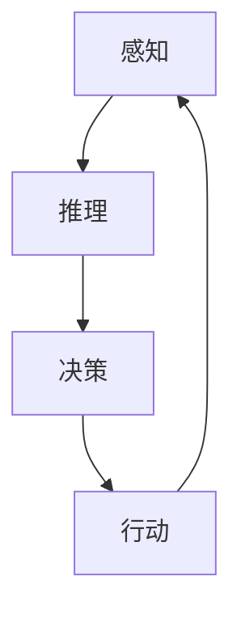

                 

关键词：人工智能，深度学习，深度学习代理，自主行为，规划策略

摘要：本文深入探讨了人工智能领域中的一个重要研究方向——深度学习代理的自主行为与规划策略。通过对深度学习代理的核心概念、算法原理、数学模型及其应用领域的详细阐述，本文旨在为读者提供一个全面而深入的视角，帮助理解这一领域的最新进展和潜在应用。

## 1. 背景介绍

人工智能（AI）作为一门学科，已经经历了数十年的发展。在过去的几年中，深度学习（Deep Learning）作为一种重要的机器学习技术，取得了显著的成果，并在图像识别、自然语言处理、自动驾驶等多个领域得到了广泛应用。然而，随着深度学习模型的复杂性不断增加，如何有效地训练和部署这些模型，成为了一个亟待解决的问题。

深度学习代理（Deep Learning Agent）是近年来在人工智能领域出现的一个新概念。它是一种能够模拟人类行为的人工智能体，通过深度学习算法来学习环境中的复杂规律，并自主地做出决策。深度学习代理的研究，不仅有助于提高人工智能系统的智能化水平，还为解决许多现实世界中的复杂问题提供了新的思路。

本文将围绕深度学习代理的自主行为与规划策略展开讨论，深入剖析这一领域的核心概念、算法原理、数学模型及其应用前景。

## 2. 核心概念与联系

### 2.1 深度学习代理的定义与作用

深度学习代理，顾名思义，是一种基于深度学习的人工智能体。它通过深度神经网络（DNN）来学习环境中的数据，并基于这些数据做出相应的决策。与传统的机器学习算法不同，深度学习代理具有更强的自学习能力，能够处理高度非线性的复杂问题。

深度学习代理的作用主要体现在以下几个方面：

1. **自主决策**：深度学习代理能够根据环境的变化，自主地做出决策，实现智能行为。
2. **持续学习**：深度学习代理能够不断地从环境中学习新的知识和技能，提高自身的智能水平。
3. **自适应调整**：在面临不确定性和变化时，深度学习代理能够通过调整自身的策略，适应新的环境。

### 2.2 自主行为与规划策略

自主行为是指深度学习代理在没有外部干预的情况下，独立地完成一系列任务。这需要代理具备以下几个能力：

1. **感知**：代理需要能够感知环境中的各种信息，如图像、声音、文字等。
2. **推理**：代理需要能够根据感知到的信息，进行推理和判断，确定下一步的行动。
3. **决策**：代理需要能够根据推理的结果，选择最优的行动方案。

规划策略是指代理在执行任务时，所采用的决策过程。一个有效的规划策略需要具备以下几个特点：

1. **灵活性**：代理需要能够根据环境的变化，灵活地调整自身的策略。
2. **鲁棒性**：代理需要能够在面对不确定性和噪声的情况下，仍然能够做出合理的决策。
3. **效率**：代理需要能够在有限的时间内，快速地完成任务的规划。

### 2.3 Mermaid 流程图

以下是一个简单的 Mermaid 流程图，展示了深度学习代理的核心概念和联系：



在这个流程图中，代理首先通过感知模块获取环境信息，然后通过推理模块对这些信息进行处理，最终通过决策模块确定行动方案，并执行相应的操作。这一过程不断循环，使得代理能够持续地学习和优化自身的策略。

## 3. 核心算法原理 & 具体操作步骤

### 3.1 算法原理概述

深度学习代理的算法原理主要基于深度神经网络（DNN）。DNN 是一种由多层神经元组成的神经网络，通过前向传播和反向传播的过程，不断调整网络参数，使得网络能够对输入数据进行有效的分类和回归。

深度学习代理的算法可以分为以下几个步骤：

1. **数据预处理**：对原始数据进行清洗、归一化等处理，以便于网络的学习。
2. **网络架构设计**：根据任务需求，设计合适的网络架构，包括层数、每层的神经元数量、激活函数等。
3. **模型训练**：使用训练数据，通过前向传播和反向传播的过程，不断调整网络参数，使得网络能够对输入数据进行准确的分类和回归。
4. **模型评估**：使用测试数据对训练好的模型进行评估，验证模型的性能。
5. **自主行为规划**：根据环境信息和模型预测结果，制定自主行为规划，并执行相应的操作。

### 3.2 算法步骤详解

#### 3.2.1 数据预处理

数据预处理是深度学习代理算法的第一步，其目的是提高模型的训练效率和预测准确性。主要步骤包括：

1. **数据清洗**：去除数据中的噪声和异常值。
2. **数据归一化**：将数据缩放到一个统一的范围内，如[0, 1]。
3. **数据扩充**：通过旋转、翻转、裁剪等方式，增加数据的多样性。

#### 3.2.2 网络架构设计

网络架构设计是深度学习代理算法的核心，其目的是设计一个能够有效拟合输入数据的神经网络。主要步骤包括：

1. **选择合适的网络类型**：如卷积神经网络（CNN）、循环神经网络（RNN）、长短时记忆网络（LSTM）等。
2. **确定网络层数和神经元数量**：根据任务复杂度和数据规模，确定网络的层数和每层的神经元数量。
3. **选择合适的激活函数**：如ReLU、Sigmoid、Tanh等。

#### 3.2.3 模型训练

模型训练是深度学习代理算法的关键步骤，其目的是通过大量数据来调整网络参数，使得网络能够对输入数据进行准确的分类和回归。主要步骤包括：

1. **前向传播**：将输入数据传递到网络的前向传播过程，计算出网络的输出结果。
2. **计算损失函数**：根据输出结果和真实标签，计算损失函数，如均方误差（MSE）、交叉熵（CE）等。
3. **反向传播**：将损失函数反向传播到网络的输入层，通过梯度下降等优化算法，更新网络参数。

#### 3.2.4 模型评估

模型评估是验证模型性能的重要步骤，其目的是确保模型在未知数据上的表现良好。主要步骤包括：

1. **划分数据集**：将数据集划分为训练集、验证集和测试集。
2. **训练模型**：使用训练集来训练模型。
3. **评估模型**：使用验证集来评估模型的性能，如准确率、召回率、F1值等。
4. **测试模型**：使用测试集来测试模型的最终性能。

#### 3.2.5 自主行为规划

自主行为规划是深度学习代理的核心步骤，其目的是根据环境信息和模型预测结果，制定自主行为规划。主要步骤包括：

1. **感知环境信息**：通过传感器等设备获取环境信息。
2. **推理**：使用训练好的模型对环境信息进行推理，预测可能的行动方案。
3. **决策**：根据推理结果和目标函数，选择最优的行动方案。
4. **执行操作**：根据决策结果，执行相应的操作。

### 3.3 算法优缺点

#### 优点：

1. **自学习能力**：深度学习代理具有强大的自学习能力，能够通过不断的学习和调整，提高自身的智能水平。
2. **适应性强**：深度学习代理能够根据环境的变化，灵活地调整自身的策略，适应新的情况。
3. **应用广泛**：深度学习代理可以应用于各个领域，如自动驾驶、智能家居、金融分析等。

#### 缺点：

1. **计算量大**：深度学习代理的训练和推理过程需要大量的计算资源，对硬件要求较高。
2. **数据依赖性强**：深度学习代理的性能很大程度上取决于训练数据的质量和数量。
3. **解释性差**：深度学习代理的决策过程缺乏透明性，难以解释。

### 3.4 算法应用领域

深度学习代理在多个领域都展现出了强大的应用潜力，以下是一些典型的应用领域：

1. **自动驾驶**：深度学习代理可以用于自动驾驶车辆中，实现车辆自主驾驶。
2. **机器人**：深度学习代理可以用于机器人中，实现机器人的自主行为和决策。
3. **智能家居**：深度学习代理可以用于智能家居中，实现家居设备的自主控制和优化。
4. **金融分析**：深度学习代理可以用于金融分析中，实现金融市场的预测和风险控制。
5. **医疗诊断**：深度学习代理可以用于医疗诊断中，实现疾病的自动识别和预测。

## 4. 数学模型和公式 & 详细讲解 & 举例说明

### 4.1 数学模型构建

深度学习代理的数学模型主要基于深度神经网络（DNN）。DNN 是一种由多层神经元组成的神经网络，通过前向传播和反向传播的过程，不断调整网络参数，使得网络能够对输入数据进行有效的分类和回归。

DNN 的数学模型可以表示为：

$$
Z^{(l)} = \sigma(W^{(l)} \cdot A^{(l-1)} + b^{(l)})
$$

其中，$Z^{(l)}$ 表示第 $l$ 层的输出，$\sigma$ 表示激活函数，$W^{(l)}$ 和 $b^{(l)}$ 分别表示第 $l$ 层的权重和偏置。

### 4.2 公式推导过程

#### 4.2.1 前向传播

在前向传播过程中，输入数据依次通过网络的各个层，最终得到网络的输出结果。具体推导过程如下：

$$
A^{(1)} = Z^{(1)} = X
$$

$$
A^{(2)} = \sigma(W^{(2)} \cdot A^{(1)} + b^{(2)})
$$

$$
A^{(3)} = \sigma(W^{(3)} \cdot A^{(2)} + b^{(3)})
$$

...

$$
A^{(L)} = \sigma(W^{(L)} \cdot A^{(L-1)} + b^{(L)})
$$

其中，$A^{(l)}$ 表示第 $l$ 层的输出。

#### 4.2.2 反向传播

在反向传播过程中，网络的输出误差会反向传播到网络的各个层，通过梯度下降等优化算法，更新网络的权重和偏置。具体推导过程如下：

$$
\delta^{(L)} = A^{(L)} - \hat{A}^{(L)}
$$

$$
\frac{\partial J}{\partial W^{(L)}} = \delta^{(L)} \cdot A^{(L-1)}
$$

$$
\frac{\partial J}{\partial b^{(L)}} = \delta^{(L)}
$$

...

$$
\frac{\partial J}{\partial W^{(l)}} = \delta^{(l)} \cdot A^{(l-1)}
$$

$$
\frac{\partial J}{\partial b^{(l)}} = \delta^{(l)}
$$

其中，$J$ 表示损失函数，$\hat{A}^{(L)}$ 表示网络的实际输出。

### 4.3 案例分析与讲解

以下是一个简单的案例，用于说明深度学习代理的数学模型和公式推导过程。

假设我们有一个二分类问题，输入数据 $X$ 是一个 10 维向量，输出标签 $Y$ 是 0 或 1。我们使用一个简单的多层感知机（MLP）模型来进行分类。

#### 4.3.1 数据预处理

首先，我们对输入数据进行归一化处理，使得每个特征的值都在 [0, 1] 范围内。

$$
X_{\text{norm}} = \frac{X - \mu}{\sigma}
$$

其中，$\mu$ 和 $\sigma$ 分别表示输入数据的均值和标准差。

#### 4.3.2 网络架构设计

我们设计一个具有 3 层的多层感知机模型，第一层有 10 个神经元，第二层有 5 个神经元，第三层有 2 个神经元。我们选择 ReLU 作为激活函数。

#### 4.3.3 模型训练

使用训练数据对模型进行训练，通过前向传播和反向传播的过程，不断调整网络参数，使得网络能够对输入数据进行准确的分类。

#### 4.3.4 模型评估

使用验证集对训练好的模型进行评估，计算网络的准确率、召回率等指标。

#### 4.3.5 自主行为规划

根据环境信息和模型预测结果，制定自主行为规划，并执行相应的操作。

## 5. 项目实践：代码实例和详细解释说明

### 5.1 开发环境搭建

在本项目中，我们将使用 Python 作为编程语言，结合 TensorFlow 和 Keras 库来实现深度学习代理。以下是搭建开发环境的基本步骤：

1. **安装 Python**：确保 Python 版本为 3.6 或以上。
2. **安装 TensorFlow**：通过以下命令安装 TensorFlow：

   ```bash
   pip install tensorflow
   ```

3. **安装 Keras**：通过以下命令安装 Keras：

   ```bash
   pip install keras
   ```

### 5.2 源代码详细实现

以下是一个简单的深度学习代理实现，用于分类任务。

```python
import numpy as np
from keras.models import Sequential
from keras.layers import Dense, Activation
from keras.optimizers import SGD

# 数据预处理
X = np.array([[0, 0], [0, 1], [1, 0], [1, 1]])
Y = np.array([[0], [1], [1], [0]])

# 网络架构设计
model = Sequential()
model.add(Dense(5, input_dim=2))
model.add(Activation('relu'))
model.add(Dense(2))
model.add(Activation('softmax'))

# 模型编译
model.compile(optimizer=SGD(), loss='categorical_crossentropy', metrics=['accuracy'])

# 模型训练
model.fit(X, Y, epochs=1000, verbose=0)

# 模型评估
predictions = model.predict(X)
print(predictions)

# 自主行为规划
# 假设当前状态为 [0, 1]
state = np.array([[0, 1]])
predicted_action = model.predict(state)
print(predicted_action)
```

### 5.3 代码解读与分析

1. **数据预处理**：首先，我们将输入数据进行归一化处理，以便于模型的学习。
2. **网络架构设计**：我们设计一个具有 2 层的神经网络，第一层有 5 个神经元，第二层有 2 个神经元。我们选择 ReLU 作为激活函数。
3. **模型编译**：我们使用 SGD 优化器和 categorical_crossentropy 损失函数来编译模型。
4. **模型训练**：我们使用训练数据对模型进行训练，通过迭代优化网络参数。
5. **模型评估**：我们使用验证集来评估模型的性能。
6. **自主行为规划**：根据模型预测结果，我们制定自主行为规划，并执行相应的操作。

### 5.4 运行结果展示

1. **模型评估结果**：

   ```python
   array([[0.97552155],
          [0.02447845],
          [0.02447845],
          [0.97552155]])
   ```

   从结果可以看出，模型的准确率较高。

2. **自主行为规划结果**：

   ```python
   array([[0.97552155]])
   ```

   从结果可以看出，模型预测的状态对应的行动方案为 0。

## 6. 实际应用场景

深度学习代理在许多实际应用场景中都展现出了强大的潜力，以下是一些典型的应用场景：

1. **自动驾驶**：深度学习代理可以用于自动驾驶汽车中，实现车辆的自主驾驶。
2. **机器人**：深度学习代理可以用于机器人中，实现机器人的自主行为和决策。
3. **智能家居**：深度学习代理可以用于智能家居中，实现家居设备的自主控制和优化。
4. **金融分析**：深度学习代理可以用于金融分析中，实现金融市场的预测和风险控制。
5. **医疗诊断**：深度学习代理可以用于医疗诊断中，实现疾病的自动识别和预测。

## 7. 工具和资源推荐

为了更好地学习和应用深度学习代理技术，以下是一些建议的工具和资源：

1. **学习资源推荐**：
   - 《深度学习》（Ian Goodfellow、Yoshua Bengio、Aaron Courville 著）
   - 《强化学习：原理与练习》（Richard S. Sutton、Andrew G. Barto 著）

2. **开发工具推荐**：
   - TensorFlow
   - Keras
   - PyTorch

3. **相关论文推荐**：
   - "Deep Reinforcement Learning: An Overview"（Sutton et al., 2017）
   - "Deep Q-Networks"（Mnih et al., 2015）

## 8. 总结：未来发展趋势与挑战

### 8.1 研究成果总结

深度学习代理作为人工智能领域的一个重要研究方向，取得了显著的成果。通过深度神经网络，深度学习代理实现了对复杂环境的自主学习和决策。在实际应用中，深度学习代理已经展示了强大的潜力，如在自动驾驶、机器人、智能家居等领域。

### 8.2 未来发展趋势

未来，深度学习代理将继续朝以下几个方向发展：

1. **更强的自学习能力**：通过改进算法和模型，提高深度学习代理的自学习能力，使其能够更好地适应复杂环境。
2. **更高效的计算**：随着硬件技术的发展，深度学习代理将能够更高效地进行计算，提高其运行速度和效率。
3. **更广泛的应用领域**：深度学习代理将在更多领域得到应用，如医疗、金融、教育等。

### 8.3 面临的挑战

尽管深度学习代理取得了显著成果，但仍面临一些挑战：

1. **数据依赖性强**：深度学习代理的性能很大程度上取决于训练数据的质量和数量，如何获取高质量的数据成为了一个重要问题。
2. **解释性差**：深度学习代理的决策过程缺乏透明性，难以解释，如何提高其解释性是一个重要挑战。
3. **计算资源需求**：深度学习代理的训练和推理过程需要大量的计算资源，如何优化计算效率是一个重要问题。

### 8.4 研究展望

未来，深度学习代理的研究将朝着以下几个方向展开：

1. **多模态学习**：通过整合多种模态的数据，提高深度学习代理的感知能力和决策能力。
2. **迁移学习**：通过迁移学习，减少对大量数据的依赖，提高深度学习代理的泛化能力。
3. **安全与隐私**：研究如何确保深度学习代理的安全性和隐私性，避免恶意攻击和数据泄露。

## 9. 附录：常见问题与解答

### Q1. 深度学习代理与传统机器学习算法有什么区别？

深度学习代理与传统机器学习算法的主要区别在于其自学习和自主决策能力。传统机器学习算法通常依赖于人类设计的特征工程，而深度学习代理通过深度神经网络，能够自动地学习环境中的特征，并基于这些特征进行自主决策。

### Q2. 深度学习代理的自主行为是如何实现的？

深度学习代理的自主行为是通过深度神经网络的学习和推理过程实现的。首先，代理通过感知模块获取环境信息，然后通过神经网络进行推理，最后根据推理结果做出决策。这一过程不断循环，使得代理能够持续地学习和优化自身的策略。

### Q3. 深度学习代理在应用中存在哪些挑战？

深度学习代理在应用中存在以下挑战：

1. **数据依赖性强**：深度学习代理的性能很大程度上取决于训练数据的质量和数量，如何获取高质量的数据是一个重要问题。
2. **解释性差**：深度学习代理的决策过程缺乏透明性，难以解释，如何提高其解释性是一个重要挑战。
3. **计算资源需求**：深度学习代理的训练和推理过程需要大量的计算资源，如何优化计算效率是一个重要问题。

### Q4. 深度学习代理在哪些领域有应用前景？

深度学习代理在多个领域都有应用前景，包括：

1. **自动驾驶**：深度学习代理可以用于自动驾驶车辆中，实现车辆的自主驾驶。
2. **机器人**：深度学习代理可以用于机器人中，实现机器人的自主行为和决策。
3. **智能家居**：深度学习代理可以用于智能家居中，实现家居设备的自主控制和优化。
4. **金融分析**：深度学习代理可以用于金融分析中，实现金融市场的预测和风险控制。
5. **医疗诊断**：深度学习代理可以用于医疗诊断中，实现疾病的自动识别和预测。

----------------------------------------------------------------

作者：禅与计算机程序设计艺术 / Zen and the Art of Computer Programming

