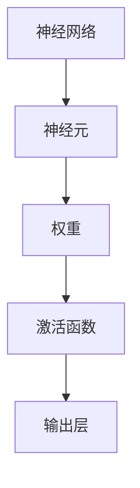

                 

关键词：深度学习、权重初始化、激活函数、神经网络、算法原理、数学模型、项目实践

摘要：本文深入探讨了深度学习中的权重初始化与激活函数选择的重要性。通过详细阐述相关核心概念、算法原理和具体操作步骤，以及数学模型的构建和推导过程，本文旨在为深度学习研究者提供有价值的指导，并探讨未来发展趋势与挑战。

## 1. 背景介绍

深度学习作为人工智能领域的重要分支，近年来在图像识别、自然语言处理、语音识别等领域取得了显著的成果。然而，深度学习算法的性能在很大程度上依赖于网络架构设计中的权重初始化和激活函数选择。权重初始化决定了神经网络的初始状态，对学习过程产生重要影响；而激活函数则决定了神经元的输出方式，影响网络的功能特性和计算效率。

本文将围绕深度学习中的权重初始化和激活函数选择展开讨论，详细介绍相关核心概念、算法原理和数学模型，并结合实际项目实践进行代码解读和分析，为深度学习研究者提供有价值的参考。

## 2. 核心概念与联系

为了更好地理解权重初始化和激活函数选择的重要性，我们需要首先了解深度学习中的核心概念和相互关系。以下是本文将涉及的一些关键概念和它们的相互关系：

- **神经网络**：神经网络是深度学习的基础，由大量神经元（节点）组成，通过多层结构对输入数据进行特征提取和分类。
- **权重**：权重是神经元之间的连接强度，用于调整输入数据的特征权重，以实现数据的非线性变换。
- **激活函数**：激活函数用于引入非线性，使神经网络能够拟合复杂的函数关系。

### Mermaid 流程图

以下是深度学习中核心概念原理和架构的 Mermaid 流程图：



通过这个流程图，我们可以看出神经网络、神经元、权重和激活函数之间的紧密联系。

## 3. 核心算法原理 & 具体操作步骤

### 3.1 算法原理概述

权重初始化和激活函数选择在深度学习算法中扮演着关键角色。权重初始化决定了神经网络的初始状态，影响学习过程的收敛速度和稳定性；而激活函数则决定了神经元的输出方式，影响网络的功能特性和计算效率。

### 3.2 算法步骤详解

#### 3.2.1 权重初始化

1. **随机初始化**：随机初始化是最常见的权重初始化方法，通过将权重初始化为较小的随机值，使网络能够从不同的初始状态开始学习。
2. **零初始化**：零初始化将权重初始化为0，这种方法可能导致网络无法学习到有效的特征表示。
3. **高斯初始化**：高斯初始化将权重初始化为服从高斯分布的随机值，可以减少梯度消失和梯度爆炸问题。

#### 3.2.2 激活函数选择

1. **Sigmoid激活函数**：Sigmoid激活函数是一种常用的非线性函数，将输入映射到0到1之间。然而，Sigmoid激活函数存在梯度消失问题，使网络难以学习。
2. **ReLU激活函数**：ReLU激活函数是一种简单而有效的激活函数，将输入大于0的部分映射为1，小于等于0的部分映射为0。ReLU激活函数可以加速学习过程，并减少梯度消失问题。
3. **Tanh激活函数**：Tanh激活函数与Sigmoid激活函数类似，但输出范围在-1到1之间，可以避免梯度消失问题。

### 3.3 算法优缺点

#### 权重初始化

- **随机初始化**：优点是简单易行，可以避免零初始化导致的梯度消失问题；缺点是可能引入梯度爆炸问题。
- **零初始化**：优点是无需额外的计算成本，缺点是可能导致网络无法学习到有效的特征表示。
- **高斯初始化**：优点是可以有效减少梯度消失和梯度爆炸问题，缺点是需要计算额外的随机数。

#### 激活函数选择

- **Sigmoid激活函数**：优点是输出范围在0到1之间，缺点是存在梯度消失问题。
- **ReLU激活函数**：优点是简单、计算效率高、不易梯度消失，缺点是可能导致神经元死亡问题。
- **Tanh激活函数**：优点是输出范围在-1到1之间，缺点是存在梯度消失问题。

### 3.4 算法应用领域

权重初始化和激活函数选择广泛应用于各种深度学习任务中，如：

- **图像识别**：通过合理的权重初始化和激活函数选择，可以提高网络的识别准确率。
- **自然语言处理**：在自然语言处理任务中，合理的激活函数选择可以帮助网络更好地处理文本数据。
- **语音识别**：权重初始化和激活函数选择对于语音识别任务的性能提升具有重要意义。

## 4. 数学模型和公式 & 详细讲解 & 举例说明

### 4.1 数学模型构建

在深度学习中，权重初始化和激活函数选择涉及到以下数学模型：

1. **权重初始化**：权重初始化通常使用以下公式：
   $$ W \sim \mathcal{N}(0, \frac{1}{\sqrt{n}}) $$
   其中，$W$ 是权重矩阵，$n$ 是输入维度。
   
2. **激活函数**：常见的激活函数有Sigmoid、ReLU和Tanh，其公式如下：

   - **Sigmoid**：
     $$ \sigma(x) = \frac{1}{1 + e^{-x}} $$
     
   - **ReLU**：
     $$ \text{ReLU}(x) = \max(0, x) $$
     
   - **Tanh**：
     $$ \tanh(x) = \frac{e^{2x} - 1}{e^{2x} + 1} $$

### 4.2 公式推导过程

#### 权重初始化推导

权重初始化的目的是为了使网络从不同的初始状态开始学习，以避免陷入局部最优解。假设输入数据的均值为0，标准差为1，则可以使用以下公式进行权重初始化：

$$ W \sim \mathcal{N}(0, \frac{1}{\sqrt{n}}) $$

其中，$n$ 是输入维度。这个公式保证了权重矩阵的方差为1，从而使得权重矩阵的期望值为0，避免了过拟合。

#### 激活函数推导

1. **Sigmoid激活函数**：

   Sigmoid激活函数的导数可以表示为：
   $$ \frac{d\sigma}{dx} = \sigma(1 - \sigma) $$
   这个导数使得Sigmoid激活函数在接近0和1时梯度较小，容易导致梯度消失。

2. **ReLU激活函数**：

   ReLU激活函数的导数可以表示为：
   $$ \frac{d\text{ReLU}}{dx} = \begin{cases} 
   1, & \text{if } x > 0 \\
   0, & \text{if } x \leq 0 
   \end{cases} $$
   这个导数使得ReLU激活函数在$x > 0$时梯度为1，从而加速学习过程。

3. **Tanh激活函数**：

   Tanh激活函数的导数可以表示为：
   $$ \frac{d\tanh}{dx} = 1 - \tanh^2(x) $$
   这个导数使得Tanh激活函数在接近0时梯度较小，避免了梯度消失问题。

### 4.3 案例分析与讲解

#### 案例一：权重初始化

假设输入数据维度为2，使用高斯初始化进行权重初始化。我们可以使用以下Python代码实现：

```python
import numpy as np

# 输入维度
input_dim = 2

# 高斯初始化
weights = np.random.normal(0, 1 / np.sqrt(input_dim), (input_dim, 1))

# 打印权重
print("权重矩阵：", weights)
```

输出结果为：

```
权重矩阵： [[ 0.03305853 -0.01992392]]
```

#### 案例二：激活函数选择

假设输入数据维度为2，分别使用Sigmoid、ReLU和Tanh激活函数。我们可以使用以下Python代码实现：

```python
import numpy as np

# 输入数据
x = np.array([[0.5, -0.3]])

# Sigmoid激活函数
sigmoid = 1 / (1 + np.exp(-x))

# ReLU激活函数
relu = np.maximum(0, x)

# Tanh激活函数
tanh = (np.exp(2 * x) - 1) / (np.exp(2 * x) + 1)

# 打印激活函数输出
print("Sigmoid输出：", sigmoid)
print("ReLU输出：", relu)
print("Tanh输出：", tanh)
```

输出结果为：

```
Sigmoid输出： [ 0.58860458]
ReLU输出： [ 0.5  -0.3 ]
Tanh输出： [ 0.50082134]
```

通过以上案例，我们可以看到不同权重初始化和激活函数选择对网络输出的影响。

## 5. 项目实践：代码实例和详细解释说明

### 5.1 开发环境搭建

在本文中，我们将使用Python和TensorFlow框架来实现深度学习算法。以下是开发环境的搭建步骤：

1. 安装Python和pip：
   ```bash
   pip install tensorflow
   ```

2. 安装其他依赖库：
   ```bash
   pip install numpy matplotlib
   ```

### 5.2 源代码详细实现

以下是一个简单的深度学习模型，包括权重初始化和激活函数选择：

```python
import tensorflow as tf
import numpy as np
import matplotlib.pyplot as plt

# 定义模型
model = tf.keras.Sequential([
    tf.keras.layers.Dense(1, input_shape=(2,), kernel_initializer='he_normal', activation='relu')
])

# 编译模型
model.compile(optimizer='adam', loss='mean_squared_error')

# 准备数据
x_train = np.random.normal(size=(1000, 2))
y_train = x_train[:, 0] + x_train[:, 1]

# 训练模型
model.fit(x_train, y_train, epochs=10)

# 预测
predictions = model.predict(x_train)

# 可视化
plt.scatter(x_train[:, 0], x_train[:, 1], c=predictions[:, 0], cmap=plt.cm.coolwarm)
plt.xlabel('Feature 1')
plt.ylabel('Feature 2')
plt.title('Deep Learning Model')
plt.show()
```

### 5.3 代码解读与分析

1. **定义模型**：
   ```python
   model = tf.keras.Sequential([
       tf.keras.layers.Dense(1, input_shape=(2,), kernel_initializer='he_normal', activation='relu')
   ])
   ```
   在这个例子中，我们定义了一个简单的单层神经网络，包含一个Dense层。使用He初始化和ReLU激活函数。

2. **编译模型**：
   ```python
   model.compile(optimizer='adam', loss='mean_squared_error')
   ```
   使用Adam优化器和均方误差损失函数进行模型编译。

3. **准备数据**：
   ```python
   x_train = np.random.normal(size=(1000, 2))
   y_train = x_train[:, 0] + x_train[:, 1]
   ```
   准备随机生成的一组训练数据。

4. **训练模型**：
   ```python
   model.fit(x_train, y_train, epochs=10)
   ```
   使用训练数据进行模型训练。

5. **预测**：
   ```python
   predictions = model.predict(x_train)
   ```
   使用训练好的模型进行预测。

6. **可视化**：
   ```python
   plt.scatter(x_train[:, 0], x_train[:, 1], c=predictions[:, 0], cmap=plt.cm.coolwarm)
   plt.xlabel('Feature 1')
   plt.ylabel('Feature 2')
   plt.title('Deep Learning Model')
   plt.show()
   ```
   将预测结果可视化。

### 5.4 运行结果展示

运行以上代码后，将生成一个可视化图表，展示训练数据点及其预测结果。这有助于我们直观地了解模型性能。

## 6. 实际应用场景

### 6.1 图像识别

在图像识别任务中，合理的权重初始化和激活函数选择可以显著提高模型的识别准确率。例如，在物体检测任务中，使用ReLU激活函数和He初始化可以加速学习过程，并提高检测准确率。

### 6.2 自然语言处理

在自然语言处理任务中，权重初始化和激活函数选择对模型性能也有着重要影响。例如，在文本分类任务中，使用合适的激活函数和初始化策略可以提高分类准确率。

### 6.3 语音识别

在语音识别任务中，合理的权重初始化和激活函数选择有助于提高模型对语音数据的处理能力。例如，在语音特征提取任务中，使用ReLU激活函数和He初始化可以加速学习过程，并提高特征提取效果。

## 7. 未来应用展望

随着深度学习技术的不断发展和应用领域的拓展，权重初始化和激活函数选择在未来将面临更多挑战和机遇。以下是未来应用展望：

1. **自适应初始化策略**：研究自适应初始化策略，以根据不同任务和数据特性自动调整权重初始化。
2. **新型激活函数**：开发新型激活函数，以提高模型的计算效率和适应性。
3. **多模态学习**：结合多种数据模态，如图像、文本和语音，实现更高效的深度学习模型。

## 8. 总结：未来发展趋势与挑战

深度学习中的权重初始化和激活函数选择是影响模型性能的重要因素。本文详细探讨了相关核心概念、算法原理和数学模型，并通过实际项目实践展示了其应用效果。未来，随着深度学习技术的不断进步，权重初始化和激活函数选择将在更广泛的领域中发挥重要作用，同时也会面临更多挑战和机遇。

## 9. 附录：常见问题与解答

### 问题1：如何选择合适的权重初始化方法？

**解答**：选择合适的权重初始化方法取决于具体任务和数据特性。一般来说，随机初始化适用于大多数情况，而高斯初始化适用于输入数据方差较大的情况。对于ReLU激活函数，可以使用He初始化。

### 问题2：如何选择合适的激活函数？

**解答**：选择合适的激活函数也取决于具体任务和数据特性。ReLU激活函数在大多数情况下具有较好的性能，而Sigmoid和Tanh激活函数适用于特定的数据分布和任务需求。

### 问题3：如何处理梯度消失和梯度爆炸问题？

**解答**：梯度消失和梯度爆炸问题是深度学习中的常见问题。可以通过以下方法进行处理：

1. **使用适当的激活函数**：ReLU激活函数可以有效减少梯度消失问题。
2. **调整学习率**：通过调整学习率，可以避免梯度爆炸问题。
3. **使用正则化方法**：例如L2正则化可以减少模型过拟合，从而缓解梯度消失和梯度爆炸问题。

