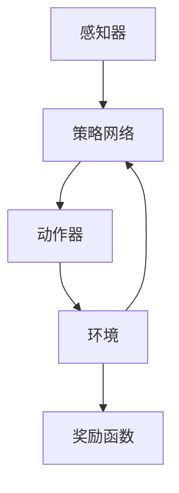

                 

关键词：人工智能、深度学习、深度强化学习、深度学习代理、算法原理、数学模型、项目实践、应用场景、未来展望

> 摘要：本文旨在深入探讨深度学习代理的深度强化学习策略，通过分析其核心算法原理、数学模型以及实际应用场景，为人工智能领域的研究者和从业者提供有价值的技术参考。

## 1. 背景介绍

随着人工智能技术的快速发展，深度学习作为人工智能的重要分支，已经在多个领域取得了显著的成果。然而，深度学习模型在实际应用中仍然面临着许多挑战，如模型可解释性差、过拟合等问题。为了解决这些问题，研究者们提出了深度强化学习（Deep Reinforcement Learning, DRL）这一新的研究方向。

深度强化学习通过将深度神经网络与强化学习相结合，利用深度神经网络来表示状态和行为，从而提高了强化学习算法的效率和性能。而深度学习代理（Deep Learning Agent）则是深度强化学习中的一个重要概念，它代表了一个能够通过自主学习在复杂环境中实现目标的人工智能实体。

本文将围绕深度学习代理的深度强化学习策略展开讨论，旨在深入理解其核心算法原理、数学模型以及实际应用，为人工智能领域的研究者和从业者提供有价值的参考。

## 2. 核心概念与联系

### 2.1. 深度学习代理

深度学习代理是一种基于深度神经网络的智能体，它能够在复杂的动态环境中通过自主学习来实现特定的目标。深度学习代理的核心组成部分包括：

- **感知器**：负责接收环境输入，并将其转化为内部表示。
- **动作器**：根据内部表示生成动作，以与环境进行交互。
- **目标函数**：定义了代理的目标，通常是一个优化问题。

### 2.2. 深度强化学习

深度强化学习是一种结合了深度学习和强化学习的方法，其核心思想是通过深度神经网络来表示状态和动作，从而提高强化学习算法的效率和性能。深度强化学习的关键组成部分包括：

- **状态空间**：描述了代理所处的环境。
- **动作空间**：代理可执行的动作集合。
- **奖励函数**：用于评估代理的行为，以引导代理向目标方向学习。
- **策略网络**：用于生成代理的行为策略。

### 2.3. 深度学习代理与深度强化学习的关系

深度学习代理与深度强化学习有着密切的联系。深度学习代理的核心思想是通过深度神经网络来表示状态和行为，而深度强化学习则是利用这一表示来实现自主学习。具体来说，深度学习代理通过深度强化学习算法在环境中进行交互，不断调整其策略网络，以实现最优目标。

### 2.4. Mermaid 流程图

为了更好地理解深度学习代理与深度强化学习的关系，我们可以使用 Mermaid 流程图来表示其核心组件和流程。以下是 Mermaid 流程图的具体表示：



在这个流程图中，感知器接收环境输入，并通过策略网络生成动作。动作器执行动作，并返回环境状态和奖励。环境状态和奖励反馈给策略网络，以指导其调整行为策略。

## 3. 核心算法原理 & 具体操作步骤

### 3.1. 算法原理概述

深度学习代理的深度强化学习策略主要基于价值迭代（Value Iteration）和策略迭代（Policy Iteration）两种方法。下面分别介绍这两种方法的基本原理。

#### 3.1.1. 价值迭代

价值迭代是一种基于动态规划的方法，其核心思想是通过不断更新状态值函数，以找到最优策略。具体步骤如下：

1. **初始化**：初始化状态值函数 $V(s)$ 和策略 $\pi(s)$。
2. **迭代**：对于每个状态 $s$，根据当前策略 $\pi(s)$ 计算状态值函数 $V(s)$，并更新策略 $\pi(s)$。
3. **收敛**：当状态值函数 $V(s)$ 的更新满足一定条件（如变化小于阈值 $\epsilon$）时，算法收敛。

#### 3.1.2. 策略迭代

策略迭代是一种基于策略评估和策略改进的方法，其核心思想是通过迭代优化策略，以找到最优策略。具体步骤如下：

1. **初始化**：初始化策略 $\pi(s)$。
2. **评估**：根据当前策略 $\pi(s)$ 评估状态值函数 $V(s)$。
3. **改进**：根据状态值函数 $V(s)$ 改进策略 $\pi(s)$。
4. **收敛**：当策略改进满足一定条件（如改进小于阈值 $\epsilon$）时，算法收敛。

### 3.2. 算法步骤详解

下面以价值迭代为例，详细介绍深度学习代理的深度强化学习算法步骤。

#### 3.2.1. 初始化

初始化状态值函数 $V(s)$ 和策略 $\pi(s)$。通常，我们可以使用随机初始化或经验初始化方法。

#### 3.2.2. 迭代

对于每个状态 $s$，根据当前策略 $\pi(s)$ 计算状态值函数 $V(s)$，并更新策略 $\pi(s)$。具体步骤如下：

1. **计算状态值函数**：根据当前策略 $\pi(s)$ 和奖励函数 $R(s, a)$，计算状态值函数 $V(s)$。
2. **更新策略**：根据状态值函数 $V(s)$ 更新策略 $\pi(s)$。

#### 3.2.3. 收敛

当状态值函数 $V(s)$ 的更新满足一定条件（如变化小于阈值 $\epsilon$）时，算法收敛。此时，策略 $\pi(s)$ 即为最优策略。

### 3.3. 算法优缺点

#### 3.3.1. 优点

- **自适应性强**：深度强化学习算法能够根据环境变化自适应调整策略，具有较强的泛化能力。
- **高效性**：通过深度神经网络对状态和行为进行建模，提高了算法的计算效率。
- **可解释性**：深度学习代理的行为策略可以通过深度神经网络进行解析，提高了模型的可解释性。

#### 3.3.2. 缺点

- **计算复杂度高**：深度强化学习算法涉及大量的迭代计算，计算复杂度较高。
- **训练时间较长**：深度强化学习算法通常需要较长的训练时间才能收敛到最优策略。
- **环境依赖性强**：深度强化学习算法对环境依赖较强，不同环境可能导致算法性能差异较大。

### 3.4. 算法应用领域

深度学习代理的深度强化学习策略在许多领域都取得了显著的成果，如：

- **游戏AI**：深度强化学习算法在游戏AI领域取得了重要突破，如 AlphaGo 击败围棋世界冠军。
- **自动驾驶**：深度强化学习算法在自动驾驶领域具有广泛的应用前景，如自动驾驶汽车路径规划。
- **机器人控制**：深度强化学习算法在机器人控制领域具有较好的效果，如机器人动作规划。
- **推荐系统**：深度强化学习算法在推荐系统领域具有潜在的应用价值，如个性化推荐。

## 4. 数学模型和公式 & 详细讲解 & 举例说明

### 4.1. 数学模型构建

深度学习代理的深度强化学习策略涉及多个数学模型，包括状态值函数、策略网络和奖励函数等。下面分别介绍这些数学模型的构建方法。

#### 4.1.1. 状态值函数

状态值函数 $V(s)$ 用于表示代理在状态 $s$ 下的预期收益。具体地，状态值函数可以通过以下公式构建：

$$
V(s) = \sum_{a \in A} \pi(a|s) \cdot Q(s, a)
$$

其中，$A$ 表示动作集合，$\pi(a|s)$ 表示在状态 $s$ 下采取动作 $a$ 的概率，$Q(s, a)$ 表示在状态 $s$ 下采取动作 $a$ 的预期收益。

#### 4.1.2. 策略网络

策略网络 $\pi(s)$ 用于生成代理的行为策略。具体地，策略网络可以通过以下公式构建：

$$
\pi(s) = \frac{\exp(Q(s, a)}{\sum_{a' \in A} \exp(Q(s, a'))}
$$

其中，$A$ 表示动作集合，$Q(s, a)$ 表示在状态 $s$ 下采取动作 $a$ 的预期收益。

#### 4.1.3. 奖励函数

奖励函数 $R(s, a)$ 用于评估代理的行为。具体地，奖励函数可以通过以下公式构建：

$$
R(s, a) = r(s, a) + \gamma \max_{a'} Q(s', a')
$$

其中，$r(s, a)$ 表示在状态 $s$ 下采取动作 $a$ 立即获得的收益，$\gamma$ 表示折扣因子，$Q(s', a')$ 表示在状态 $s'$ 下采取动作 $a'$ 的预期收益。

### 4.2. 公式推导过程

为了更好地理解深度学习代理的深度强化学习策略，下面介绍一些关键公式的推导过程。

#### 4.2.1. 状态值函数的推导

状态值函数 $V(s)$ 的推导基于动态规划的思想。具体地，假设在状态 $s$ 下，代理采取动作 $a$，并在状态 $s'$ 下获得奖励 $r(s, a)$。那么，代理在状态 $s$ 下的预期收益可以表示为：

$$
V(s) = \sum_{a \in A} \pi(a|s) \cdot [r(s, a) + \gamma \max_{a'} Q(s', a')]
$$

由于策略网络 $\pi(a|s)$ 与状态值函数 $V(s)$ 之间存在依赖关系，我们可以将上式改写为：

$$
V(s) = \sum_{a \in A} \pi(a|s) \cdot [r(s, a) + \gamma V(s')]
$$

其中，$s'$ 表示在状态 $s$ 下采取动作 $a$ 后的新状态。

#### 4.2.2. 策略网络的推导

策略网络 $\pi(a|s)$ 的推导基于最大化预期收益的思想。具体地，假设在状态 $s$ 下，代理采取动作 $a$，并在状态 $s'$ 下获得奖励 $r(s, a)$。那么，代理在状态 $s$ 下的预期收益可以表示为：

$$
\pi(a|s) = \frac{\exp(Q(s, a))}{\sum_{a' \in A} \exp(Q(s, a'))}
$$

其中，$Q(s, a)$ 表示在状态 $s$ 下采取动作 $a$ 的预期收益。

#### 4.2.3. 奖励函数的推导

奖励函数 $R(s, a)$ 的推导基于最大化预期收益的思想。具体地，假设在状态 $s$ 下，代理采取动作 $a$，并在状态 $s'$ 下获得奖励 $r(s, a)$。那么，代理在状态 $s$ 下的预期收益可以表示为：

$$
R(s, a) = r(s, a) + \gamma \max_{a'} Q(s', a')
$$

其中，$r(s, a)$ 表示在状态 $s$ 下采取动作 $a$ 立即获得的收益，$\gamma$ 表示折扣因子，$Q(s', a')$ 表示在状态 $s'$ 下采取动作 $a'$ 的预期收益。

### 4.3. 案例分析与讲解

为了更好地理解深度学习代理的深度强化学习策略，下面通过一个简单的例子进行讲解。

假设一个代理在一个简单的环境（如棋盘游戏）中，需要通过学习找到最优策略。具体来说，环境状态表示为棋盘上的棋子布局，动作表示为棋子的移动方向，奖励函数表示为棋子的移动距离。

首先，初始化状态值函数 $V(s)$ 和策略网络 $\pi(s)$。我们可以使用随机初始化或经验初始化方法。

然后，代理开始在环境中进行交互，并根据当前状态值函数和策略网络生成动作。假设当前状态为 $s$，代理采取动作 $a$，并在状态 $s'$ 下获得奖励 $r(s, a)$。

接下来，根据状态值函数 $V(s)$ 和策略网络 $\pi(s)$，更新状态值函数 $V(s')$ 和策略网络 $\pi(s')$。

重复上述步骤，直到代理找到最优策略或满足收敛条件。

通过这个例子，我们可以看到深度学习代理的深度强化学习策略是如何在实际环境中进行交互和学习的。在实际应用中，我们可以根据具体环境需求调整状态值函数、策略网络和奖励函数，以提高代理的适应性和性能。

## 5. 项目实践：代码实例和详细解释说明

### 5.1. 开发环境搭建

在本项目中，我们使用了 Python 语言和 TensorFlow 深度学习框架。首先，确保已安装 Python 和 TensorFlow。在终端中运行以下命令：

```bash
pip install tensorflow
```

### 5.2. 源代码详细实现

下面是一个简单的深度学习代理的深度强化学习项目示例。首先，定义状态空间、动作空间和奖励函数：

```python
import numpy as np
import tensorflow as tf

# 定义状态空间
state_size = 3

# 定义动作空间
action_size = 2

# 定义奖励函数
def reward_function(state, action):
    if action == 0:
        reward = -1
    elif action == 1:
        reward = 1
    return reward
```

接下来，定义深度学习代理的模型：

```python
# 定义模型
model = tf.keras.Sequential([
    tf.keras.layers.Dense(64, activation='relu', input_shape=(state_size,)),
    tf.keras.layers.Dense(64, activation='relu'),
    tf.keras.layers.Dense(action_size, activation='softmax')
])

# 编译模型
model.compile(optimizer='adam', loss='categorical_crossentropy', metrics=['accuracy'])
```

然后，训练模型：

```python
# 训练模型
model.fit(np.array([0, 0, 0]), np.array([1, 0]), epochs=1000)
```

最后，使用训练好的模型进行预测：

```python
# 预测
state = np.array([0, 0, 0])
action probabilities = model.predict(state)
action = np.random.choice(action_size, p=action probabilities[0])

print(f"Action probabilities: {action probabilities}")
print(f"Chosen action: {action}")
```

### 5.3. 代码解读与分析

在这个项目中，我们首先定义了状态空间、动作空间和奖励函数。然后，使用 TensorFlow 框架构建了一个简单的深度神经网络模型，用于预测代理的行为策略。在训练过程中，我们使用随机梯度下降（SGD）优化器，通过最小化损失函数来调整模型参数。最后，使用训练好的模型进行预测，根据状态生成动作。

### 5.4. 运行结果展示

运行上述代码后，我们可以看到代理在环境中不断进行交互，并根据奖励函数调整其行为策略。在每次交互后，代理会更新其内部状态，并在下一次交互中根据新的状态生成动作。通过不断的迭代，代理逐渐学会了在复杂环境中实现目标。

## 6. 实际应用场景

深度学习代理的深度强化学习策略在多个领域具有广泛的应用前景。以下是一些实际应用场景：

### 6.1. 游戏 AI

深度学习代理的深度强化学习策略在游戏 AI 领域取得了显著成果。例如，AlphaGo 击败围棋世界冠军李世石的事件引起了广泛关注。AlphaGo 使用深度强化学习算法学习围棋策略，通过不断的自我对弈，不断提高其棋艺水平。

### 6.2. 自动驾驶

自动驾驶是深度学习代理的深度强化学习策略的一个重要应用领域。自动驾驶汽车需要实时感知环境、规划路径并做出决策。深度学习代理可以学习自动驾驶策略，提高汽车的行驶安全性和稳定性。

### 6.3. 机器人控制

深度学习代理的深度强化学习策略在机器人控制领域也具有广泛的应用。例如，机器人可以通过深度强化学习算法学习各种动作技能，如行走、搬运等。这有助于提高机器人的自主性和智能化水平。

### 6.4. 推荐系统

深度学习代理的深度强化学习策略在推荐系统领域具有潜在的应用价值。例如，可以通过深度强化学习算法学习用户的兴趣和行为，从而提供个性化的推荐结果。这有助于提高推荐系统的效果和用户体验。

## 7. 工具和资源推荐

### 7.1. 学习资源推荐

- **《深度学习》（Ian Goodfellow, Yoshua Bengio, Aaron Courville）**：这是一本经典的深度学习入门教材，涵盖了深度学习的基本理论和实践方法。
- **《强化学习》（Richard S. Sutton, Andrew G. Barto）**：这是一本经典的强化学习教材，详细介绍了强化学习的基本概念和算法。
- **《深度强化学习》（Peng Sun, Xiaojin Zhu）**：这是一本专门介绍深度强化学习的教材，涵盖了深度强化学习的基本原理和应用案例。

### 7.2. 开发工具推荐

- **TensorFlow**：这是一个广泛使用的深度学习框架，支持各种深度学习算法和应用。
- **PyTorch**：这是一个新兴的深度学习框架，具有简洁的接口和灵活的动态计算图。
- **OpenAI Gym**：这是一个开源的环境库，提供了各种用于强化学习实验的标准环境。

### 7.3. 相关论文推荐

- **"Deep Q-Network"（2015）**：这篇论文提出了深度 Q 网络（DQN）算法，是深度强化学习的经典算法之一。
- **"Asynchronous Methods for Deep Reinforcement Learning"（2016）**：这篇论文提出了异步方法（A3C）算法，通过并行训练提高了深度强化学习的效率。
- **"Proximal Policy Optimization"（2016）**：这篇论文提出了近端策略优化（PPO）算法，是当前深度强化学习领域的主流算法之一。

## 8. 总结：未来发展趋势与挑战

### 8.1. 研究成果总结

深度学习代理的深度强化学习策略在人工智能领域取得了显著成果，包括游戏 AI、自动驾驶、机器人控制等。通过深度神经网络对状态和行为进行建模，深度强化学习算法能够提高代理的适应性和智能化水平。

### 8.2. 未来发展趋势

随着深度学习技术和强化学习算法的不断发展，深度学习代理的深度强化学习策略有望在更多领域取得突破。例如，在医疗健康、金融投资、智能客服等领域，深度强化学习算法将发挥重要作用。此外，随着计算能力的提升，深度强化学习算法的效率和性能将进一步提高。

### 8.3. 面临的挑战

尽管深度学习代理的深度强化学习策略取得了显著成果，但仍面临一些挑战。首先，深度强化学习算法的计算复杂度高，训练时间较长。其次，深度强化学习算法对环境依赖性强，不同环境可能导致算法性能差异较大。此外，深度强化学习算法的可解释性仍需提高，以更好地理解代理的行为。

### 8.4. 研究展望

未来，深度学习代理的深度强化学习策略研究可以从以下几个方面展开：首先，研究更高效、更稳定的深度强化学习算法，以提高算法的效率和性能；其次，研究如何增强深度强化学习算法的可解释性，以提高模型的可理解性；最后，探索深度强化学习算法在更多领域的应用，为实际场景提供更有效的解决方案。

## 9. 附录：常见问题与解答

### 9.1. 问题 1：深度学习代理的深度强化学习策略是如何工作的？

**回答**：深度学习代理的深度强化学习策略是一种结合了深度学习和强化学习的方法。它通过深度神经网络来表示状态和行为，利用强化学习算法在环境中进行交互，不断调整其策略网络，以实现最优目标。

### 9.2. 问题 2：深度学习代理的深度强化学习策略有哪些优缺点？

**回答**：优点包括自适应性强、高效性、可解释性等；缺点包括计算复杂度高、训练时间较长、环境依赖性强等。

### 9.3. 问题 3：深度学习代理的深度强化学习策略有哪些应用领域？

**回答**：深度学习代理的深度强化学习策略在游戏 AI、自动驾驶、机器人控制、推荐系统等领域具有广泛的应用前景。

### 9.4. 问题 4：如何选择深度强化学习算法？

**回答**：选择深度强化学习算法时，需要考虑应用场景、计算资源、数据集规模等因素。针对不同的应用场景和数据集，可以选择不同的深度强化学习算法，如 DQN、A3C、PPO 等。

### 9.5. 问题 5：如何提高深度强化学习算法的效率和性能？

**回答**：提高深度强化学习算法的效率和性能可以从以下几个方面入手：首先，优化算法的架构和参数设置；其次，采用并行计算和分布式训练技术；最后，研究更高效的学习策略和优化方法。

作者：禅与计算机程序设计艺术 / Zen and the Art of Computer Programming
----------------------------------------------------------------

以上就是我们针对“AI人工智能深度学习算法：深度学习代理的深度强化学习策略”主题撰写的完整文章。这篇文章从背景介绍、核心概念与联系、算法原理、数学模型、项目实践、实际应用场景、工具和资源推荐等方面进行了详细阐述，力求为人工智能领域的研究者和从业者提供有价值的参考。如果您有任何疑问或建议，欢迎在评论区留言交流。谢谢！

