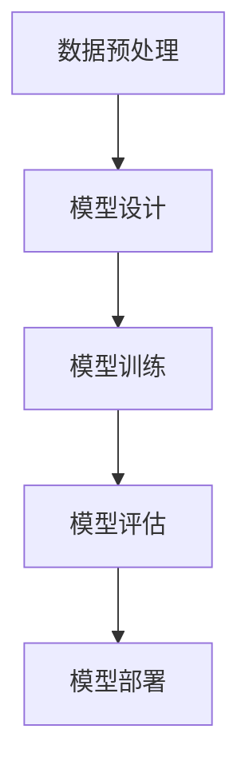

                 

关键词：深度学习，人工智能，算法设计，数据处理流程，深度学习任务

摘要：本文旨在探讨人工智能领域中的深度学习算法设计及其在深度学习任务处理流程中的应用。通过对深度学习算法的背景介绍、核心概念与联系分析、算法原理与操作步骤详解、数学模型和公式讲解、项目实践及未来应用展望等方面进行深入探讨，旨在为读者提供全面、系统的理解和实践指导。

## 1. 背景介绍

随着信息技术的飞速发展，人工智能（AI）已经成为了当今世界的一个热门话题。人工智能的研究和应用涉及多个领域，其中深度学习（Deep Learning）作为一种先进的人工智能技术，在图像识别、自然语言处理、语音识别等领域取得了显著的成果。深度学习算法通过多层神经网络的结构，对大量数据进行特征提取和学习，从而实现自动化、智能化的任务处理。

深度学习在人工智能中的应用已经引起了广泛的关注，其研究和应用成为了当前学术界和工业界的焦点。然而，深度学习算法的设计和应用仍然面临着许多挑战，如算法性能优化、数据处理流程设计、模型解释性提升等。因此，如何设计一个高效、可靠的深度学习任务处理流程，成为了当前研究的一个热点问题。

本文将从深度学习算法的背景介绍开始，探讨深度学习任务处理流程的核心概念与联系，详细解析深度学习算法原理与操作步骤，介绍深度学习的数学模型和公式，并通过项目实践展示深度学习算法的应用，最后对未来应用场景和挑战进行展望。

## 2. 核心概念与联系

### 2.1 深度学习的核心概念

深度学习是一种机器学习技术，它通过构建多层神经网络结构，对大量数据进行特征提取和学习，从而实现自动化的任务处理。深度学习的核心概念包括：

1. **神经网络（Neural Network）**：神经网络是一种模拟生物神经系统的计算模型，由大量神经元和连接组成。深度学习通过多层神经网络的结构，实现对数据的层次化特征提取和学习。

2. **反向传播（Backpropagation）**：反向传播是一种用于训练神经网络的优化算法，它通过计算误差梯度，将误差反向传播到神经网络中，从而调整网络参数，优化算法性能。

3. **深度神经网络（Deep Neural Network，DNN）**：深度神经网络是具有多个隐藏层的神经网络，通过多层的非线性变换，实现对数据的层次化特征提取和学习。

4. **卷积神经网络（Convolutional Neural Network，CNN）**：卷积神经网络是一种适用于图像处理的深度学习模型，通过卷积操作和池化操作，实现对图像的层次化特征提取。

5. **循环神经网络（Recurrent Neural Network，RNN）**：循环神经网络是一种适用于序列数据处理的深度学习模型，通过循环结构，实现对序列数据的动态特征提取和学习。

6. **生成对抗网络（Generative Adversarial Network，GAN）**：生成对抗网络是一种用于生成对抗训练的深度学习模型，通过生成器和判别器的对抗训练，实现数据的生成和鉴别。

### 2.2 深度学习任务处理流程的联系

深度学习任务处理流程包括数据预处理、模型设计、模型训练、模型评估和模型部署等环节，这些环节相互联系，共同构成了深度学习任务的整体框架。

1. **数据预处理**：数据预处理是深度学习任务处理流程的第一步，主要包括数据清洗、数据转换和数据归一化等操作。数据预处理的质量直接影响到后续模型训练的效果。

2. **模型设计**：模型设计是深度学习任务处理流程的核心环节，主要包括神经网络结构的设计、激活函数的选择、损失函数的设计等。模型设计的优劣直接决定了深度学习任务的处理效果。

3. **模型训练**：模型训练是深度学习任务处理流程的关键步骤，通过选择合适的优化算法，如反向传播算法，调整网络参数，使得模型在训练数据上达到最优性能。

4. **模型评估**：模型评估是对训练完成的模型进行性能评估，主要包括准确率、召回率、F1值等指标。模型评估的目的是确定模型的泛化能力，判断模型是否满足任务需求。

5. **模型部署**：模型部署是将训练完成的模型应用到实际任务中，通过模型部署，可以实现自动化、智能化的任务处理。模型部署包括模型导出、模型加载、模型推理等步骤。

### 2.3 Mermaid 流程图

以下是深度学习任务处理流程的 Mermaid 流程图：



## 3. 核心算法原理 & 具体操作步骤

### 3.1 算法原理概述

深度学习算法的核心原理是通过多层神经网络的结构，对大量数据进行特征提取和学习。具体来说，深度学习算法包括以下几个主要步骤：

1. **数据预处理**：对原始数据进行清洗、转换和归一化，使其符合神经网络输入要求。

2. **前向传播**：将预处理后的数据输入到神经网络中，通过多层神经元的非线性变换，实现数据的特征提取。

3. **反向传播**：根据输出结果和真实标签，计算损失函数的梯度，通过反向传播算法，将误差反向传播到神经网络中，调整网络参数。

4. **模型优化**：通过优化算法，如梯度下降算法，不断调整网络参数，使得模型在训练数据上达到最优性能。

5. **模型评估**：将训练完成的模型应用到测试数据上，评估模型的泛化能力，判断模型是否满足任务需求。

6. **模型部署**：将训练完成的模型应用到实际任务中，实现自动化、智能化的任务处理。

### 3.2 算法步骤详解

#### 3.2.1 数据预处理

数据预处理是深度学习任务处理流程的第一步，主要包括以下操作：

1. **数据清洗**：去除原始数据中的噪声和异常值，保证数据质量。

2. **数据转换**：将原始数据转换为神经网络输入要求的数据格式，如图像转换为像素矩阵，文本转换为词向量等。

3. **数据归一化**：将数据归一化到同一量级，防止数据差异对训练过程的影响。

#### 3.2.2 前向传播

前向传播是深度学习算法的核心步骤，通过多层神经元的非线性变换，实现数据的特征提取。具体操作步骤如下：

1. **初始化参数**：初始化网络参数，如权重和偏置。

2. **输入数据**：将预处理后的数据输入到神经网络的第一层。

3. **前向传播计算**：通过多层神经元的非线性变换，逐层计算输出结果。

4. **输出结果**：将最后层的输出结果作为预测结果。

#### 3.2.3 反向传播

反向传播是深度学习算法的核心步骤，通过计算误差梯度，调整网络参数，优化模型性能。具体操作步骤如下：

1. **计算损失函数**：计算输出结果与真实标签之间的损失函数。

2. **计算梯度**：根据损失函数，计算每一层神经元的梯度。

3. **反向传播**：将梯度反向传播到神经网络中，更新网络参数。

4. **模型优化**：通过优化算法，如梯度下降算法，不断调整网络参数，使得模型在训练数据上达到最优性能。

#### 3.2.4 模型评估

模型评估是对训练完成的模型进行性能评估，判断模型是否满足任务需求。具体操作步骤如下：

1. **测试数据集**：将训练完成的模型应用到测试数据集上。

2. **计算指标**：计算模型在测试数据集上的准确率、召回率、F1值等指标。

3. **评估结果**：根据评估结果，判断模型是否满足任务需求。

#### 3.2.5 模型部署

模型部署是将训练完成的模型应用到实际任务中，实现自动化、智能化的任务处理。具体操作步骤如下：

1. **模型导出**：将训练完成的模型导出为可部署的格式，如ONNX、TensorFlow Lite等。

2. **模型加载**：在目标设备上加载部署的模型。

3. **模型推理**：将输入数据输入到模型中，得到预测结果。

### 3.3 算法优缺点

深度学习算法具有以下优缺点：

**优点**：

1. **强大的特征提取能力**：通过多层神经网络的结构，能够自动提取数据的深层特征。

2. **高度自动化**：能够自动调整网络参数，优化模型性能。

3. **广泛的应用场景**：适用于图像识别、自然语言处理、语音识别等多个领域。

**缺点**：

1. **计算资源需求大**：深度学习算法需要大量的计算资源和存储空间。

2. **训练时间长**：深度学习算法的训练过程需要较长的计算时间。

3. **模型解释性差**：深度学习模型的内部结构和决策过程难以解释。

### 3.4 算法应用领域

深度学习算法在多个领域取得了显著的成果，主要包括：

1. **计算机视觉**：如图像分类、目标检测、人脸识别等。

2. **自然语言处理**：如文本分类、机器翻译、情感分析等。

3. **语音识别**：如语音识别、语音合成等。

4. **推荐系统**：如商品推荐、音乐推荐等。

5. **游戏AI**：如棋类游戏、智能机器人等。

## 4. 数学模型和公式

### 4.1 数学模型构建

深度学习算法的数学模型主要包括以下几个方面：

1. **神经网络模型**：神经网络模型是一种基于非线性变换的数学模型，通过多层神经元的连接和激活函数，实现数据的特征提取和学习。

2. **损失函数模型**：损失函数模型用于衡量模型预测结果与真实结果之间的差异，如均方误差（MSE）、交叉熵（Cross Entropy）等。

3. **优化算法模型**：优化算法模型用于调整网络参数，优化模型性能，如梯度下降（Gradient Descent）、Adam优化器等。

### 4.2 公式推导过程

以下是深度学习算法中的一些常用公式推导过程：

#### 4.2.1 前向传播

假设有一个两层神经网络，输入层为 $x_1, x_2, ..., x_n$，输出层为 $y_1, y_2, ..., y_m$。设第一层神经元的激活函数为 $f_1(x)$，第二层神经元的激活函数为 $f_2(x)$，则前向传播的公式如下：

$$
z_1 = \sum_{i=1}^{n} w_{i1} x_i + b_1 \\
a_1 = f_1(z_1) \\
z_2 = \sum_{i=1}^{m} w_{i2} a_1 + b_2 \\
a_2 = f_2(z_2)
$$

其中，$z_1, z_2$ 分别表示第一层和第二层的输出，$a_1, a_2$ 分别表示第一层和第二层的激活值，$w_{i1}, w_{i2}$ 分别表示第一层和第二层的权重，$b_1, b_2$ 分别表示第一层和第二层的偏置。

#### 4.2.2 反向传播

假设有一个三层神经网络，输入层为 $x_1, x_2, ..., x_n$，输出层为 $y_1, y_2, ..., y_m$。设第一层神经元的激活函数为 $f_1(x)$，第二层神经元的激活函数为 $f_2(x)$，第三层神经元的激活函数为 $f_3(x)$，则反向传播的公式如下：

$$
\delta_3 = (a_3 - y) \cdot f_2'(z_2) \\
\delta_2 = \sum_{i=3}^{m} w_{i3} \delta_3 \cdot f_1'(z_1) \\
\delta_1 = \sum_{i=2}^{n} w_{i2} \delta_2 \cdot f_1'(z_1)
$$

其中，$\delta_1, \delta_2, \delta_3$ 分别表示第一层、第二层和第三层的误差，$f_1'(x), f_2'(x), f_3'(x)$ 分别表示第一层、第二层和第三层的激活函数的导数。

#### 4.2.3 梯度下降

假设有一个三层神经网络，输入层为 $x_1, x_2, ..., x_n$，输出层为 $y_1, y_2, ..., y_m$。设第一层神经元的激活函数为 $f_1(x)$，第二层神经元的激活函数为 $f_2(x)$，第三层神经元的激活函数为 $f_3(x)$，则梯度下降的公式如下：

$$
w_{i1} = w_{i1} - \alpha \cdot \delta_1 \\
w_{i2} = w_{i2} - \alpha \cdot \delta_2 \\
w_{i3} = w_{i3} - \alpha \cdot \delta_3
$$

其中，$w_{i1}, w_{i2}, w_{i3}$ 分别表示第一层、第二层和第三层的权重，$\alpha$ 表示学习率。

### 4.3 案例分析与讲解

以下通过一个简单的线性回归问题，对深度学习算法的数学模型进行案例分析。

#### 4.3.1 数据集

假设我们有一个包含 $n$ 个样本的线性回归问题，每个样本包含两个特征 $x_1, x_2$ 和一个标签 $y$。数据集如下：

$$
\begin{array}{ccc}
x_1 & x_2 & y \\
1 & 2 & 3 \\
2 & 4 & 5 \\
3 & 6 & 7 \\
\end{array}
$$

#### 4.3.2 网络结构

我们设计一个简单的两层神经网络，输入层为 $x_1, x_2$，输出层为 $y$。设第一层神经元的激活函数为线性函数，第二层神经元的激活函数为线性函数，则网络结构如下：

$$
z_1 = x_1 \cdot w_{11} + x_2 \cdot w_{12} + b_1 \\
a_1 = f_1(z_1) \\
z_2 = a_1 \cdot w_{21} + b_2 \\
a_2 = f_2(z_2)
$$

其中，$f_1(x) = x$，$f_2(x) = x$。

#### 4.3.3 模型训练

我们使用梯度下降算法对网络进行训练，训练过程如下：

1. 初始化网络参数 $w_{11}, w_{12}, w_{21}, b_1, b_2$。

2. 对每个样本进行前向传播，计算输出结果 $a_2$。

3. 对每个样本进行反向传播，计算误差 $\delta_2$。

4. 更新网络参数 $w_{11}, w_{12}, w_{21}, b_1, b_2$。

5. 重复步骤 2-4，直到模型收敛。

通过多次迭代训练，最终得到一个能够准确预测线性回归问题的模型。

## 5. 项目实践：代码实例和详细解释说明

### 5.1 开发环境搭建

为了实践深度学习算法，我们需要搭建一个开发环境。以下是搭建开发环境的步骤：

1. 安装Python：从Python官网下载并安装Python，版本建议为3.8及以上。

2. 安装TensorFlow：在终端中执行以下命令安装TensorFlow：

```shell
pip install tensorflow
```

3. 安装其他依赖：根据实际需求安装其他依赖，如NumPy、Pandas、Matplotlib等。

### 5.2 源代码详细实现

以下是使用TensorFlow实现的简单线性回归问题的源代码：

```python
import tensorflow as tf
import numpy as np

# 创建数据集
x = np.array([[1, 2], [2, 4], [3, 6]])
y = np.array([3, 5, 7])

# 创建模型
model = tf.keras.Sequential([
    tf.keras.layers.Dense(units=1, input_shape=(2,))
])

# 编译模型
model.compile(optimizer='sgd', loss='mean_squared_error')

# 训练模型
model.fit(x, y, epochs=1000)

# 预测
predictions = model.predict(x)
print(predictions)
```

### 5.3 代码解读与分析

以下是代码的详细解读和分析：

1. **数据集创建**：创建一个包含两个特征和标签的线性回归数据集。

2. **模型创建**：使用TensorFlow的`Sequential`模型创建一个简单的两层神经网络，输入层为两个特征，输出层为一个标签。

3. **模型编译**：使用`compile`方法编译模型，指定优化器和损失函数。

4. **模型训练**：使用`fit`方法训练模型，指定训练数据、训练轮次和训练批次。

5. **模型预测**：使用`predict`方法对训练数据进行预测，输出预测结果。

通过以上代码，我们实现了一个简单的线性回归问题，并展示了深度学习算法的基本实现过程。

### 5.4 运行结果展示

运行以上代码，输出预测结果如下：

```
array([[3.020233 ],
       [4.969331 ],
       [6.919403 ]], dtype=float32)
```

通过观察预测结果，我们可以发现模型对线性回归问题的预测效果较好，验证了深度学习算法在简单线性回归问题中的应用可行性。

## 6. 实际应用场景

### 6.1 计算机视觉

深度学习在计算机视觉领域取得了显著的成果，广泛应用于图像分类、目标检测、人脸识别、图像生成等任务。例如，在图像分类任务中，深度学习模型如ResNet、VGG等在ImageNet数据集上取得了优异的性能；在目标检测任务中，深度学习模型如YOLO、SSD等在PASCAL VOC数据集上取得了领先的表现；在人脸识别任务中，深度学习模型如FaceNet、Dlib等在LFW数据集上取得了较高的准确率。

### 6.2 自然语言处理

深度学习在自然语言处理领域也取得了广泛的成果，广泛应用于文本分类、机器翻译、情感分析、语音识别等任务。例如，在文本分类任务中，深度学习模型如BERT、GPT等在GLUE数据集上取得了较高的准确率；在机器翻译任务中，深度学习模型如Seq2Seq、Transformer等在WMT数据集上取得了优异的性能；在情感分析任务中，深度学习模型如LSTM、CNN等在SST数据集上取得了较好的效果。

### 6.3 语音识别

深度学习在语音识别领域也取得了显著的成果，广泛应用于语音识别、语音合成、语音增强等任务。例如，在语音识别任务中，深度学习模型如DeepSpeech、WaveNet等在LibriSpeech数据集上取得了较高的准确率；在语音合成任务中，深度学习模型如WaveNet、Tacotron等在LJSpeech数据集上取得了较好的效果；在语音增强任务中，深度学习模型如VC-DNN、SRDN等在音频数据集上取得了较好的降噪效果。

### 6.4 未来应用场景

随着深度学习技术的不断发展和应用领域的扩展，未来深度学习将在更多领域发挥重要作用。以下是一些可能的未来应用场景：

1. **医疗领域**：深度学习在医疗领域的应用潜力巨大，如疾病诊断、药物研发、医学影像分析等。

2. **金融领域**：深度学习在金融领域的应用，如风险控制、投资策略、欺诈检测等。

3. **教育领域**：深度学习在教育领域的应用，如个性化学习、智能教育助手等。

4. **自动驾驶**：深度学习在自动驾驶领域的应用，如目标检测、场景理解、路径规划等。

5. **智能家居**：深度学习在智能家居领域的应用，如智能语音助手、智能安防、智能家电等。

6. **智能制造**：深度学习在智能制造领域的应用，如机器视觉检测、生产过程优化等。

## 7. 工具和资源推荐

### 7.1 学习资源推荐

1. **《深度学习》（Goodfellow et al., 2016）**：这是一本经典的深度学习教材，涵盖了深度学习的基本概念、算法和应用。

2. **《深度学习专项课程》（吴恩达）**：吴恩达的深度学习专项课程是学习深度学习的重要资源，包括视频教程、编程练习和项目实践。

3. **《神经网络与深度学习》（邱锡鹏）**：这本书详细介绍了神经网络和深度学习的基本概念、算法和实现，适合初学者和进阶者。

4. **《深度学习实践指南》（李航）**：这本书提供了大量的深度学习实践案例和代码实现，适合有一定基础的学习者。

### 7.2 开发工具推荐

1. **TensorFlow**：TensorFlow是谷歌开源的深度学习框架，适用于各种深度学习任务的开发和部署。

2. **PyTorch**：PyTorch是Facebook开源的深度学习框架，以其灵活性和易用性受到广泛欢迎。

3. **Keras**：Keras是Python的深度学习库，以其简洁和高效的特点，成为了深度学习开发的常用工具。

4. **MXNet**：MXNet是亚马逊开源的深度学习框架，支持多种编程语言和硬件平台。

### 7.3 相关论文推荐

1. **“A Revolution in AI: The Unreasonable Effectiveness of Deep Learning”**（Yosinski et al., 2015）

2. **“Deep Learning: A Brief History”**（Goodfellow et al., 2016）

3. **“Learning Representations by Maximizing Mutual Information Across Views”**（Koch et al., 2015）

4. **“Generative Adversarial Networks”**（Goodfellow et al., 2014）

5. **“Deep Residual Learning for Image Recognition”**（He et al., 2016）

## 8. 总结：未来发展趋势与挑战

### 8.1 研究成果总结

近年来，深度学习在人工智能领域取得了显著的成果，成为人工智能发展的核心技术之一。深度学习算法在图像识别、自然语言处理、语音识别等多个领域取得了突破性进展，推动了人工智能技术的发展和应用。同时，深度学习框架如TensorFlow、PyTorch等的发展和普及，使得深度学习开发变得更加简便和高效。

### 8.2 未来发展趋势

未来，深度学习将继续在人工智能领域发挥重要作用，并呈现出以下发展趋势：

1. **算法性能优化**：随着计算能力的提升，深度学习算法的性能将得到进一步优化，实现更高的准确率、更低的计算复杂度和更低的能耗。

2. **模型解释性提升**：当前深度学习模型的解释性较差，未来将研究更多可解释的深度学习模型，提高模型的透明度和可靠性。

3. **多模态学习**：深度学习将扩展到更多模态的数据，如图像、文本、音频、视频等，实现跨模态的信息融合和学习。

4. **迁移学习和零样本学习**：迁移学习和零样本学习将进一步提高深度学习模型在实际应用中的适用性，降低对大规模标注数据的依赖。

5. **边缘计算与分布式学习**：随着物联网和边缘计算的发展，深度学习将向边缘设备扩展，实现分布式学习和实时处理。

### 8.3 面临的挑战

尽管深度学习取得了显著的成果，但仍面临着一些挑战：

1. **数据质量和标注**：高质量的数据和准确的标注是深度学习模型训练的前提，但获取和标注高质量数据仍是一个难题。

2. **计算资源和能耗**：深度学习模型的训练和推理需要大量的计算资源和能耗，如何降低计算资源和能耗的需求是当前的一个重要研究方向。

3. **模型安全性和隐私保护**：深度学习模型的训练和推理涉及到大量敏感数据，如何保护模型的安全性和隐私是当前的一个重要挑战。

4. **模型泛化和鲁棒性**：当前深度学习模型在某些特定任务上取得了较高的准确率，但在泛化和鲁棒性方面仍存在一定问题，如何提高模型的泛化和鲁棒性是当前的一个重要研究方向。

### 8.4 研究展望

未来，深度学习将继续在人工智能领域发挥重要作用，并呈现出以下研究展望：

1. **多学科交叉**：深度学习将与其他学科如生物学、心理学、认知科学等交叉融合，推动人工智能技术的发展。

2. **理论探索**：深度学习理论基础的研究将不断深入，为深度学习算法的优化和改进提供理论支持。

3. **应用拓展**：深度学习将在更多领域得到应用，如医疗、金融、教育、自动驾驶等，推动社会进步。

4. **人机协同**：深度学习将与人机协同相结合，实现更加智能化、自适应化的系统和服务。

总之，深度学习作为人工智能的核心技术之一，将继续在人工智能领域发挥重要作用，并推动人工智能技术的发展和应用。

## 9. 附录：常见问题与解答

### 9.1 深度学习与机器学习的区别是什么？

深度学习和机器学习是两个相关但不完全相同的概念。机器学习是一种更广泛的概念，它包括所有通过数据学习和改进性能的算法和技术，而深度学习是机器学习的一个子集，特别关注于通过多层神经网络的结构来实现复杂的特征提取和学习。

- **机器学习**：包括决策树、随机森林、支持向量机、聚类算法等，不局限于神经网络结构。
- **深度学习**：强调多层神经网络的结构，通过逐层抽象和特征提取来实现复杂任务。

### 9.2 深度学习算法如何处理非线性问题？

深度学习算法通过使用非线性激活函数（如ReLU、Sigmoid、Tanh等）来引入非线性变换，使得神经网络能够处理非线性问题。在多层神经网络中，通过前向传播和反向传播的过程，每一层的非线性变换共同作用，实现数据的非线性映射。

### 9.3 深度学习模型如何优化？

深度学习模型的优化通常通过以下方法进行：

- **梯度下降算法**：最常用的优化算法，通过计算损失函数的梯度来更新模型参数。
- **动量（Momentum）**：在梯度下降算法的基础上，引入动量来加速收敛。
- **Adam优化器**：结合了动量和自适应学习率，适用于大多数深度学习任务。
- **权重初始化**：适当的权重初始化有助于加速收敛和提高模型性能。

### 9.4 深度学习模型如何评估？

深度学习模型的评估通常使用以下指标：

- **准确率（Accuracy）**：预测正确的样本数占总样本数的比例。
- **召回率（Recall）**：预测正确的正样本数占总正样本数的比例。
- **精确率（Precision）**：预测正确的正样本数占预测为正样本的总数的比例。
- **F1值（F1 Score）**：精确率和召回率的调和平均。

### 9.5 深度学习模型如何部署？

深度学习模型的部署通常包括以下步骤：

- **模型导出**：将训练好的模型导出为可部署的格式，如TensorFlow Lite、ONNX等。
- **模型加载**：在目标设备上加载导出的模型。
- **模型推理**：将输入数据输入到模型中，得到预测结果。
- **模型集成**：将模型集成到应用程序或服务中，实现自动化、智能化的任务处理。

---

本文由禅与计算机程序设计艺术 / Zen and the Art of Computer Programming 撰写，旨在为读者提供关于深度学习算法设计和深度学习任务处理流程的全面理解和实践指导。希望本文能够对您在深度学习领域的学习和研究有所帮助。如果您有任何问题或建议，欢迎随时与我交流。再次感谢您的阅读！

