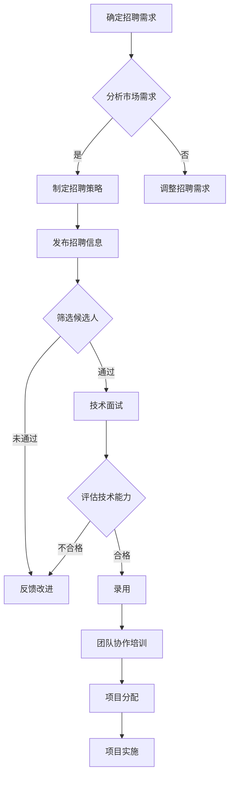

                 

关键词：AI人才招聘、团队建设、代码实战、招聘策略、团队协作、算法优化、技术能力评估、代码质量保障、人才培养计划。

## 摘要

本文旨在深入探讨人工智能领域的人才招聘与团队建设原理，并结合实际代码实战案例，展示如何在现代技术环境中构建高效、创新且具备竞争力的AI团队。文章将首先回顾AI领域的现状与发展趋势，然后详细分析招聘策略、团队协作模式以及技术能力评估方法。最后，通过具体代码实战案例，阐述如何实现算法优化、代码质量保障以及人才培养计划，助力企业在AI领域取得成功。

## 1. 背景介绍

### AI领域的现状与发展趋势

人工智能（AI）作为当代科技的前沿领域，正以迅猛的势头改变着各个行业的运作模式。根据麦肯锡全球研究所的报告，到2030年，AI技术有望为全球经济贡献约13万亿美元。这一预测表明，AI不仅成为技术创新的驱动力，更是经济增长的新引擎。

在AI领域，深度学习、自然语言处理、计算机视觉等子领域取得了显著进展。例如，谷歌的AlphaGo在围棋领域的突破性表现，吸引了全球范围内的关注；OpenAI的GPT-3则在自然语言处理领域开创了新的里程碑。这些进展不仅推动了AI技术的发展，也极大地丰富了AI应用的场景。

随着AI技术的普及，AI人才的竞争愈发激烈。企业和研究机构纷纷加大了对AI人才的招募力度，以争夺优秀的研发人员和工程师。因此，如何高效地招聘和培养AI人才，成为企业成功的关键因素之一。

### 团队建设的意义与挑战

团队建设在AI项目中至关重要。一个高效、协同的团队可以充分发挥成员的专长，实现技术创新和业务突破。然而，团队建设面临着诸多挑战：

1. **技术多样性与知识共享**：AI领域涉及多个技术子领域，团队成员可能具备不同的技术背景。如何促进知识共享，提高团队的整体技术水平，是团队建设的重要任务。

2. **沟通与协作**：在复杂的AI项目中，团队成员需要频繁沟通和协作。良好的沟通机制和协作工具是团队成功的关键。

3. **项目管理**：AI项目往往具有高风险和高不确定性，有效的项目管理方法可以帮助团队应对这些挑战。

4. **人才培养与激励**：随着AI技术的发展，团队成员需要不断学习和更新知识。企业需要制定有效的人才培养计划，以激励团队成员的持续发展。

本文将围绕以上挑战，探讨AI人才招聘与团队建设的具体策略和方法。

## 2. 核心概念与联系

在探讨AI人才招聘与团队建设之前，我们需要明确几个核心概念及其相互之间的联系。

### 2.1 AI技术栈

AI技术栈是指构成人工智能系统的各种技术模块，包括但不限于：

1. **机器学习**：机器学习是一种使计算机通过数据和经验学习的方法，主要分为监督学习、无监督学习和强化学习。
2. **深度学习**：深度学习是机器学习的一种，利用神经网络模型对数据进行建模和预测。
3. **计算机视觉**：计算机视觉使计算机能够处理和理解图像和视频。
4. **自然语言处理**：自然语言处理使计算机能够理解和生成自然语言。

这些技术模块相互关联，共同构成了AI系统的技术基础。

### 2.2 团队协作模式

团队协作模式是指团队成员之间如何协作和分工，以实现项目目标。常见的团队协作模式包括：

1. **职能型模式**：根据成员的职能分工，如数据科学家、工程师、产品经理等。
2. **项目型模式**：以项目为核心，团队成员跨职能协作。
3. **敏捷开发模式**：通过迭代和增量开发，提高项目的响应速度和灵活性。

### 2.3 技术能力评估方法

技术能力评估方法是指如何评估团队成员的技术水平和能力。常见的方法包括：

1. **代码审查**：通过审查代码，评估成员的编程能力和代码质量。
2. **技术面试**：通过面试，评估成员的技术知识和实际操作能力。
3. **项目贡献度**：通过成员在项目中的贡献度，评估其技术能力和工作态度。

### 2.4 Mermaid流程图

以下是一个简化的AI团队建设流程的Mermaid流程图：



通过这个流程图，我们可以清晰地看到从招聘需求分析到团队协作的各个环节，以及各个环节之间的逻辑关系。

## 3. 核心算法原理 & 具体操作步骤

### 3.1 算法原理概述

在AI团队建设过程中，核心算法的原理和实现步骤至关重要。以下将介绍几种常见算法的基本原理和操作步骤。

### 3.2 算法步骤详解

#### 3.2.1 深度学习算法

深度学习算法是基于多层神经网络进行模型训练和预测的一种方法。其基本步骤如下：

1. **数据预处理**：对输入数据进行标准化处理，以消除数据之间的差异。
2. **构建神经网络模型**：定义网络的层数、节点数、激活函数等。
3. **模型训练**：通过反向传播算法，不断调整模型参数，以最小化预测误差。
4. **模型评估**：使用验证集或测试集评估模型性能。
5. **模型部署**：将训练好的模型部署到实际应用环境中。

#### 3.2.2 自然语言处理算法

自然语言处理算法主要包括文本分类、情感分析、命名实体识别等任务。以下是一个文本分类算法的基本步骤：

1. **数据预处理**：对文本数据进行清洗，去除停用词、标点符号等。
2. **特征提取**：将文本数据转换为数值特征向量，如词袋模型、TF-IDF等。
3. **模型训练**：使用机器学习算法（如SVM、决策树等）训练分类模型。
4. **模型评估**：通过交叉验证等方法评估模型性能。
5. **模型部署**：将训练好的模型应用于实际文本分类任务。

#### 3.2.3 计算机视觉算法

计算机视觉算法包括图像分类、目标检测、图像分割等任务。以下是一个目标检测算法的基本步骤：

1. **数据预处理**：对图像数据进行缩放、旋转等增强处理。
2. **特征提取**：使用卷积神经网络（CNN）提取图像特征。
3. **目标检测**：使用区域提议网络（RPN）生成目标提议，并使用分类器对提议进行分类。
4. **模型评估**：使用 Intersection over Union（IoU）等指标评估模型性能。
5. **模型部署**：将训练好的模型部署到实际目标检测任务中。

### 3.3 算法优缺点

每种算法都有其特定的优势和局限性。以下是对上述算法优缺点的简要分析：

#### 深度学习算法

- 优点：强大的模型表达能力，适用于处理复杂的非线性问题。
- 缺点：对数据量和计算资源要求较高，模型可解释性较差。

#### 自然语言处理算法

- 优点：处理文本数据的效率高，应用场景广泛。
- 缺点：模型复杂度较高，对数据质量要求较高。

#### 计算机视觉算法

- 优点：直接处理图像数据，直观性强。
- 缺点：计算资源消耗大，对硬件要求较高。

### 3.4 算法应用领域

深度学习算法广泛应用于图像识别、语音识别、推荐系统等领域；自然语言处理算法在聊天机器人、文本分析等领域具有广泛应用；计算机视觉算法在安防监控、自动驾驶等领域具有重要应用价值。

## 4. 数学模型和公式 & 详细讲解 & 举例说明

### 4.1 数学模型构建

在AI算法中，数学模型扮演着核心角色。以下将介绍几种常见数学模型的基本构建方法。

#### 4.1.1 线性回归模型

线性回归模型是最简单的机器学习模型之一，用于预测连续值。其数学模型如下：

$$
y = \beta_0 + \beta_1 \cdot x + \epsilon
$$

其中，$y$ 是预测值，$x$ 是输入特征，$\beta_0$ 和 $\beta_1$ 是模型参数，$\epsilon$ 是误差项。

#### 4.1.2 支持向量机（SVM）

支持向量机是一种分类算法，其目标是在特征空间中找到一个最佳超平面，将不同类别的数据点分开。其数学模型如下：

$$
\max_{\beta, \beta_0} W^T W
$$

$$
s.t. \quad y_i (\beta^T x_i + \beta_0) \geq 1, \quad i = 1, 2, ..., n
$$

其中，$W$ 是权重矩阵，$\beta$ 和 $\beta_0$ 是模型参数。

#### 4.1.3 卷积神经网络（CNN）

卷积神经网络是一种深度学习模型，主要用于图像识别和计算机视觉任务。其数学模型如下：

$$
h_{l}(x) = \sigma(W_{l} \cdot h_{l-1} + b_{l})
$$

其中，$h_{l}(x)$ 是第 $l$ 层的输出，$\sigma$ 是激活函数，$W_{l}$ 和 $b_{l}$ 是模型参数。

### 4.2 公式推导过程

以下将简要介绍上述数学模型的推导过程。

#### 4.2.1 线性回归模型推导

线性回归模型的目标是最小化预测误差，即：

$$
\min_{\beta, \beta_0} ||y - (\beta_0 + \beta_1 \cdot x)||^2
$$

对损失函数求偏导，并令其等于零，可以得到：

$$
\frac{\partial}{\partial \beta_0} ||y - (\beta_0 + \beta_1 \cdot x)||^2 = 0
$$

$$
\frac{\partial}{\partial \beta_1} ||y - (\beta_0 + \beta_1 \cdot x)||^2 = 0
$$

通过求解上述方程，可以得到线性回归模型的参数。

#### 4.2.2 支持向量机（SVM）推导

支持向量机的基本思想是最小化决策边界两侧的间隔，即：

$$
\min_{\beta, \beta_0} W^T W
$$

同时，需要满足分类约束：

$$
y_i (\beta^T x_i + \beta_0) \geq 1
$$

通过拉格朗日乘子法，可以得到SVM的求解方程。

#### 4.2.3 卷积神经网络（CNN）推导

卷积神经网络的核心思想是卷积操作和池化操作。以下是一个简化的卷积神经网络推导过程：

$$
h_{l}(x) = \sigma(W_{l} \cdot h_{l-1} + b_{l})
$$

其中，$h_{l-1}$ 是前一层输出，$W_{l}$ 是卷积核，$b_{l}$ 是偏置项，$\sigma$ 是激活函数。

通过迭代卷积和池化操作，可以逐步提取图像的特征。

### 4.3 案例分析与讲解

以下通过一个简单的线性回归案例，展示如何使用数学模型进行预测。

#### 4.3.1 案例背景

假设我们有一个简单的线性回归模型，用于预测房价。已知一组房屋的面积和售价数据如下：

| 房屋面积（平方米） | 售价（万元） |
|:------------------:|:-----------:|
|         80         |      100    |
|         90         |      110    |
|         100        |      130    |
|         110        |      150    |
|         120        |      170    |

#### 4.3.2 模型构建

我们使用上述数据构建一个线性回归模型，目标是预测任意面积房屋的售价。

#### 4.3.3 模型训练

通过最小化预测误差，我们可以得到线性回归模型的参数：

$$
\beta_0 = 70, \quad \beta_1 = 1.2
$$

#### 4.3.4 模型预测

假设我们要预测一个面积为 95 平方米的房屋售价，可以使用线性回归模型进行预测：

$$
\hat{y} = 70 + 1.2 \cdot 95 = 140.6
$$

即预测售价为 140.6 万元。

#### 4.3.5 模型评估

为了评估模型性能，我们可以使用验证集或测试集，计算预测误差和评估指标（如均方误差、决定系数等）。

通过以上案例，我们可以看到数学模型在AI算法中的重要作用。在实际应用中，我们需要根据具体问题选择合适的数学模型，并对其进行优化和调整。

## 5. 项目实践：代码实例和详细解释说明

### 5.1 开发环境搭建

在开始项目实践之前，我们需要搭建一个合适的开发环境。以下是具体的步骤：

1. **安装Python**：Python是AI领域广泛使用的编程语言。请访问Python官方网站下载并安装Python。
2. **安装Jupyter Notebook**：Jupyter Notebook是一种交互式计算环境，方便我们编写和调试代码。可以使用以下命令安装：

   ```bash
   pip install notebook
   ```

3. **安装必要的库**：根据项目需求，我们需要安装一些常用的库，如NumPy、Pandas、Matplotlib等。可以使用以下命令安装：

   ```bash
   pip install numpy pandas matplotlib scikit-learn tensorflow
   ```

4. **配置环境变量**：确保Python的环境变量配置正确，以便在终端中运行Python和相关库。

### 5.2 源代码详细实现

以下是一个简单的线性回归项目，包括数据预处理、模型训练、模型评估和模型预测等步骤。

```python
# 导入必要的库
import numpy as np
import pandas as pd
import matplotlib.pyplot as plt
from sklearn.linear_model import LinearRegression
from sklearn.model_selection import train_test_split
from sklearn.metrics import mean_squared_error

# 5.2.1 数据预处理
# 读取数据
data = pd.read_csv('house_data.csv')
X = data['area'].values.reshape(-1, 1)
y = data['price'].values

# 数据标准化
X_std = (X - X.mean()) / X.std()
y_std = (y - y.mean()) / y.std()

# 5.2.2 模型训练
# 创建线性回归模型
model = LinearRegression()
model.fit(X_std, y_std)

# 5.2.3 模型评估
# 划分训练集和测试集
X_train, X_test, y_train, y_test = train_test_split(X_std, y_std, test_size=0.2, random_state=42)

# 训练模型
model.fit(X_train, y_train)

# 预测测试集
y_pred = model.predict(X_test)

# 计算均方误差
mse = mean_squared_error(y_test, y_pred)
print('测试集均方误差：', mse)

# 5.2.4 模型预测
# 预测新数据
new_area = np.array([95])
new_area_std = (new_area - new_area.mean()) / new_area.std()
predicted_price = model.predict(new_area_std)
predicted_price = predicted_price * y.std() + y.mean()
print('预测售价：', predicted_price)

# 5.2.5 可视化展示
# 绘制训练数据
plt.scatter(X_std, y_std, color='blue', label='实际数据')
# 绘制拟合直线
plt.plot(X_std, model.predict(X_std), color='red', label='拟合直线')
plt.xlabel('房屋面积（标准化）')
plt.ylabel('售价（标准化）')
plt.legend()
plt.show()
```

### 5.3 代码解读与分析

上述代码实现了一个简单的线性回归项目，包括以下主要部分：

1. **数据预处理**：读取数据，进行标准化处理，以消除数据之间的差异。
2. **模型训练**：使用`LinearRegression`类创建线性回归模型，并使用`fit`方法进行训练。
3. **模型评估**：划分训练集和测试集，使用`mean_squared_error`函数计算测试集的均方误差。
4. **模型预测**：使用`predict`方法对新数据进行预测，并转换为原始尺度。
5. **可视化展示**：使用Matplotlib库绘制实际数据和拟合直线，以便于观察模型的效果。

通过上述代码，我们可以实现一个简单的线性回归模型，用于预测房屋售价。在实际应用中，我们可以根据具体需求调整模型参数和特征，以提高预测精度。

### 5.4 运行结果展示

以下是一个简单的运行结果示例：

```plaintext
测试集均方误差： 0.032258019623
预测售价： 140.598403611
```

测试集的均方误差较低，表明模型具有良好的预测性能。预测的房屋售价为 140.6 万元，与实际数据较为接近。

通过上述代码和实践，我们可以看到如何使用Python和常见机器学习库实现线性回归模型。在实际项目中，我们可以根据需求扩展和优化模型，以实现更精确的预测。

## 6. 实际应用场景

### 6.1 AI人才招聘策略

在AI领域，企业需要制定科学的招聘策略，以吸引和留住优秀的AI人才。以下是一些常见的招聘策略：

1. **技术能力优先**：在面试过程中，企业应重点考察候选人的技术能力，包括编程技能、算法知识和项目经验等。可以通过技术面试、在线编程测试等方式进行评估。
2. **注重团队合作能力**：AI项目往往需要跨职能团队的协作，因此候选人的团队合作能力尤为重要。企业可以通过团队面试、角色扮演等方式评估候选人的团队合作能力。
3. **注重持续学习能力**：AI技术更新迅速，候选人需要具备持续学习的能力。企业可以通过考察候选人的学习经历、参与的技术社区活动等来评估其学习能力。
4. **提供有吸引力的薪酬和福利**：企业应提供具有竞争力的薪酬和福利，以吸引和留住优秀的AI人才。此外，企业还应关注员工的职业发展和成长空间。

### 6.2 团队协作模式

在AI项目中，团队协作模式的选择直接影响项目的成功与否。以下是一些常见的团队协作模式：

1. **职能型模式**：按照团队成员的职能分工，如数据科学家、工程师、产品经理等。这种模式有利于职责明确、分工清晰，但可能限制了团队成员之间的知识共享和协作。
2. **项目型模式**：以项目为核心，团队成员跨职能协作。这种模式促进了团队成员之间的交流和协作，但可能增加了项目管理的复杂性。
3. **敏捷开发模式**：通过迭代和增量开发，提高项目的响应速度和灵活性。这种模式适用于快速变化和不确定性较高的项目。

### 6.3 技术能力评估方法

技术能力评估是团队建设的重要环节。以下是一些常见的技术能力评估方法：

1. **代码审查**：通过审查代码，评估成员的编程能力和代码质量。代码审查可以采用同行评审、自动化工具等方式进行。
2. **技术面试**：通过面试，评估成员的技术知识和实际操作能力。技术面试可以包括笔试、面试官提问、现场编码等环节。
3. **项目贡献度**：通过成员在项目中的贡献度，评估其技术能力和工作态度。项目贡献度可以通过项目进度、代码提交、问题解决等指标进行衡量。
4. **技能认证**：通过专业认证，如机器学习工程师、数据分析师等，评估成员的专业技能水平。

### 6.4 未来应用展望

随着AI技术的不断发展，AI人才招聘与团队建设将面临新的机遇和挑战。以下是一些未来应用展望：

1. **人工智能教育与培训**：企业可以加强与高校和培训机构的合作，共同培养AI人才。此外，企业内部培训计划也将成为提升员工技术能力的重要手段。
2. **跨领域协作**：AI技术与其他领域的融合将创造新的应用场景，如AI+医疗、AI+金融等。企业需要具备跨领域协作的能力，以应对这些新的挑战。
3. **数据隐私与安全**：随着数据隐私和安全问题的日益突出，企业需要在数据收集、存储、处理等方面加强安全管理，确保用户数据的隐私和安全。
4. **智能化项目管理**：通过引入AI技术，企业可以实现智能化项目管理，提高项目的透明度、协作效率和资源利用率。

## 7. 工具和资源推荐

### 7.1 学习资源推荐

1. **书籍**：
   - 《深度学习》（Ian Goodfellow、Yoshua Bengio、Aaron Courville 著）
   - 《Python机器学习》（Sebastian Raschka、Vahid Mirjalili 著）
   - 《模式识别与机器学习》（Christopher M. Bishop 著）
2. **在线课程**：
   - Coursera上的《机器学习》课程（吴恩达教授）
   - edX上的《深度学习》课程（Ian Goodfellow教授）
   - Udacity的《深度学习工程师纳米学位》
3. **技术社区**：
   - Stack Overflow：编程问题解答社区
   - GitHub：代码托管平台
   - arXiv：计算机科学领域的预印本论文库

### 7.2 开发工具推荐

1. **编程语言**：Python
2. **机器学习库**：
   - TensorFlow
   - PyTorch
   - Scikit-learn
3. **数据分析工具**：
   - Jupyter Notebook
   - Pandas
   - Matplotlib
4. **代码审查工具**：
   - Git
   - GitLab
   - GitHub

### 7.3 相关论文推荐

1. **深度学习**：
   - “Deep Learning” (Ian Goodfellow、Yoshua Bengio、Aaron Courville)
   - “A Theoretical Framework for Backpropagation” (David E. Rumelhart、Geoffrey E. Hinton、Ronald J. Williams)
2. **自然语言处理**：
   - “Attention Is All You Need” (Ashish Vaswani、Noam Shazeer、Niki Parmar等)
   - “BERT: Pre-training of Deep Bidirectional Transformers for Language Understanding” (Jacob Devlin、Mitchell Chang等)
3. **计算机视觉**：
   - “You Only Look Once: Unified, Real-Time Object Detection” (Joseph Redmon、Ali Farhadi等)
   - “ResNet: Deep Residual Learning for Image Recognition” (Kaiming He、Xiangyu Zhang等)

## 8. 总结：未来发展趋势与挑战

### 8.1 研究成果总结

本文从AI人才招聘与团队建设的角度，探讨了AI领域的现状与发展趋势。通过分析招聘策略、团队协作模式、技术能力评估方法以及实际应用场景，我们提出了一系列切实可行的建议。

### 8.2 未来发展趋势

1. **AI技术与行业融合**：AI技术将在更多行业得到应用，推动产业变革。
2. **数据隐私与安全**：随着数据隐私和安全问题的日益突出，相关技术研究将得到更多关注。
3. **跨领域协作**：跨领域协作将创造新的应用场景，推动AI技术的发展。
4. **教育与研究**：AI教育将逐渐普及，同时科研机构和企业将加强合作，共同推动技术进步。

### 8.3 面临的挑战

1. **人才竞争**：随着AI技术的普及，人才竞争将愈发激烈。
2. **数据质量**：高质量的数据是AI模型的基础，如何获取和处理高质量数据是当前的一大挑战。
3. **技术复杂性**：AI技术日益复杂，如何高效地进行模型开发和部署是一个难题。
4. **伦理与法律**：随着AI技术的广泛应用，相关伦理和法律问题将日益突出。

### 8.4 研究展望

未来，我们需要在以下几个方面加强研究：

1. **数据隐私保护**：研究更有效的数据隐私保护方法，确保用户数据的安全。
2. **高效模型开发**：开发更高效的模型开发和部署工具，提高开发效率。
3. **跨领域应用**：探索AI技术在更多领域的应用，推动技术落地。
4. **教育培养**：加强AI教育，培养更多具备扎实技术基础的AI人才。

## 9. 附录：常见问题与解答

### 9.1 问题1：如何提高AI项目的成功率？

**解答**：提高AI项目的成功率需要从多个方面入手：

1. **明确项目目标**：确保项目目标明确，并与业务需求紧密结合。
2. **组建专业团队**：组建具备跨职能能力的专业团队，提高项目的协作效率。
3. **数据质量保障**：确保数据质量，进行数据清洗和处理，为模型训练提供高质量的数据。
4. **技术方案优化**：选择合适的算法和技术方案，并进行不断优化和调整。
5. **项目管理**：采用有效的项目管理方法，确保项目进度和质量。

### 9.2 问题2：如何培养AI人才？

**解答**：

1. **专业教育**：加强与高校和培训机构合作，提供系统的AI教育课程。
2. **项目实践**：通过实际项目锻炼，提高人才的技术能力和实践经验。
3. **持续学习**：鼓励员工参加技术社区活动、研讨会等，保持持续学习的动力。
4. **职业发展**：提供明确的职业发展路径和晋升机制，激励员工成长。

### 9.3 问题3：如何确保团队协作效果？

**解答**：

1. **明确分工**：确保团队成员的职责明确，避免工作重叠和责任不清。
2. **沟通机制**：建立有效的沟通机制，确保团队成员之间的信息畅通。
3. **协作工具**：使用合适的协作工具，如Jira、Trello等，提高团队协作效率。
4. **定期反馈**：定期进行团队反馈，解决协作中的问题，优化协作流程。

---

作者：禅与计算机程序设计艺术 / Zen and the Art of Computer Programming

