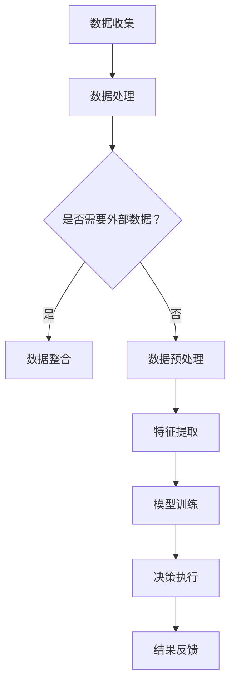

                 

关键词：人工智能，AI代理，金融服务，风险评估，工作流程

摘要：本文将深入探讨人工智能（AI）代理在金融服务领域中的应用，包括其工作流程和风险评估。通过对AI代理的核心概念、算法原理、数学模型、项目实践以及实际应用场景的分析，我们将展示AI代理如何优化金融服务，并对其未来发展进行展望。

## 1. 背景介绍

在当今数字化时代，金融服务行业正面临着前所未有的变革。随着大数据、云计算和人工智能技术的快速发展，金融服务提供商开始探索如何利用这些先进技术来提升效率、降低成本、提高客户满意度。人工智能代理作为一种智能化工具，正逐渐成为金融服务领域的重要角色。

AI代理是指通过模拟人类智能行为，执行特定任务或提供特定服务的计算机程序。在金融服务中，AI代理可以应用于风险管理、客户服务、投资决策等多个方面。本文将重点探讨AI代理在这些领域中的工作流程和风险评估。

## 2. 核心概念与联系

### 2.1 AI代理的定义与分类

AI代理是指基于人工智能技术的自动化程序，能够模拟人类决策过程，实现特定任务。根据其应用场景和功能特点，AI代理可以分为以下几类：

1. **客户服务代理**：如聊天机器人、虚拟客服等，用于处理客户咨询、投诉等常见任务。
2. **投资决策代理**：如量化交易、智能投顾等，基于数据分析和预测模型，提供投资建议。
3. **风险管理代理**：如信用评分、风险预警等，通过分析历史数据和实时数据，预测风险并采取措施。

### 2.2 AI代理的架构与工作流程

AI代理通常由以下几个核心组成部分构成：

1. **感知模块**：获取外部环境信息，如文本、图像、声音等。
2. **决策模块**：根据感知模块提供的信息，利用算法和模型进行决策。
3. **行动模块**：执行决策结果，如发送消息、执行交易等。

AI代理的工作流程可以概括为以下几个步骤：

1. **感知**：收集相关数据。
2. **分析**：利用算法和模型进行分析和处理。
3. **决策**：根据分析结果做出决策。
4. **行动**：执行决策，并反馈结果。

### 2.3 关联流程图

以下是一个简化的AI代理在金融服务中的应用流程图：



## 3. 核心算法原理 & 具体操作步骤

### 3.1 算法原理概述

在金融服务中，AI代理的核心算法通常包括机器学习、深度学习、自然语言处理等技术。以下是一些常用的算法：

1. **机器学习算法**：如线性回归、决策树、支持向量机等，用于数据分析、预测和分类。
2. **深度学习算法**：如卷积神经网络（CNN）、循环神经网络（RNN）等，用于图像识别、语音识别等复杂任务。
3. **自然语言处理算法**：如词向量、序列标注等，用于文本分析、情感分析等。

### 3.2 算法步骤详解

以机器学习算法为例，其具体操作步骤如下：

1. **数据收集**：从各个渠道收集历史交易数据、客户行为数据等。
2. **数据预处理**：清洗、归一化等，提高数据质量。
3. **特征提取**：提取对预测任务有用的特征。
4. **模型训练**：选择合适的机器学习算法，训练模型。
5. **模型评估**：使用验证集或测试集评估模型性能。
6. **模型部署**：将训练好的模型部署到生产环境中，进行实时预测。

### 3.3 算法优缺点

每种算法都有其优缺点。例如：

1. **机器学习算法**：适用于处理大量数据，但需要大量训练数据和计算资源。
2. **深度学习算法**：在处理复杂任务时表现优异，但需要大量数据和计算资源。
3. **自然语言处理算法**：在处理文本数据时具有优势，但需要复杂的模型和算法。

### 3.4 算法应用领域

AI代理在金融服务中的应用领域广泛，包括：

1. **风险管理**：通过分析历史数据和实时数据，预测风险并采取措施。
2. **客户服务**：提供智能客服、个性化推荐等服务。
3. **投资决策**：基于数据分析和预测模型，提供投资建议。

## 4. 数学模型和公式 & 详细讲解 & 举例说明

### 4.1 数学模型构建

在金融服务中，常用的数学模型包括线性回归模型、支持向量机模型等。以下是一个简单的线性回归模型：

$$
y = \beta_0 + \beta_1 x_1 + \beta_2 x_2 + ... + \beta_n x_n
$$

其中，$y$ 是预测目标，$x_1, x_2, ..., x_n$ 是输入特征，$\beta_0, \beta_1, \beta_2, ..., \beta_n$ 是模型参数。

### 4.2 公式推导过程

线性回归模型的公式推导过程如下：

1. **目标函数**：最小化预测误差的平方和。

$$
J(\theta) = \frac{1}{2m} \sum_{i=1}^{m} (h_\theta(x^{(i)}) - y^{(i)})^2
$$

其中，$m$ 是样本数量，$h_\theta(x) = \theta_0 + \theta_1 x_1 + \theta_2 x_2 + ... + \theta_n x_n$ 是假设函数，$\theta$ 是模型参数。

2. **求导**：对目标函数关于每个参数求偏导数，并令其等于零。

$$
\frac{\partial J(\theta)}{\partial \theta_j} = \frac{1}{m} \sum_{i=1}^{m} (h_\theta(x^{(i)}) - y^{(i)}) x_j^{(i)}
$$

3. **优化**：使用梯度下降法更新参数。

$$
\theta_j := \theta_j - \alpha \frac{\partial J(\theta)}{\partial \theta_j}
$$

其中，$\alpha$ 是学习率。

### 4.3 案例分析与讲解

以下是一个简化的线性回归模型案例：

假设我们要预测一家银行的信用卡客户的信用卡消费金额。输入特征包括客户的年龄、收入、信用评分等。

1. **数据收集**：收集历史客户数据，包括年龄、收入、信用评分和信用卡消费金额。
2. **数据预处理**：对数据进行清洗、归一化等处理。
3. **特征提取**：提取对预测任务有用的特征，如年龄、收入、信用评分等。
4. **模型训练**：使用线性回归模型训练模型，得到模型参数。
5. **模型评估**：使用验证集或测试集评估模型性能。
6. **模型部署**：将训练好的模型部署到生产环境中，进行实时预测。

## 5. 项目实践：代码实例和详细解释说明

### 5.1 开发环境搭建

为了实现一个简单的线性回归模型，我们需要安装以下软件：

1. Python 3.x
2. NumPy
3. Matplotlib

安装命令如下：

```
pip install numpy matplotlib
```

### 5.2 源代码详细实现

以下是一个简单的线性回归模型的实现：

```python
import numpy as np
import matplotlib.pyplot as plt

# 数据准备
X = np.array([[1, 2], [2, 3], [3, 4], [4, 5]])
y = np.array([2, 3, 4, 5])

# 模型初始化
theta = np.zeros((2, 1))

# 梯度下降法
alpha = 0.01
num_iters = 1000

for i in range(num_iters):
    h_x = np.dot(X, theta)
    error = y - h_x
    
    delta_theta = np.dot(X.T, error) / X.shape[0]
    theta = theta - alpha * delta_theta

# 模型评估
h_x = np.dot(X, theta)
mse = np.mean((h_x - y) ** 2)
print("MSE:", mse)

# 可视化
plt.scatter(X[:, 1], y, color='red')
plt.plot(X[:, 1], h_x, color='blue')
plt.xlabel('x1')
plt.ylabel('y')
plt.show()
```

### 5.3 代码解读与分析

1. **数据准备**：我们使用了一个简单的二维数据集，其中X表示输入特征，y表示目标变量。
2. **模型初始化**：初始化模型参数theta为一个二维数组，其中包含两个元素，分别对应X的每一列。
3. **梯度下降法**：使用梯度下降法更新参数theta，直到满足停止条件或达到最大迭代次数。
4. **模型评估**：计算模型在测试集上的均方误差（MSE）。
5. **可视化**：使用matplotlib绘制数据集和模型预测的曲线。

## 6. 实际应用场景

AI代理在金融服务中的实际应用场景广泛，以下是一些典型的应用案例：

1. **风险管理**：利用AI代理进行信用评分、欺诈检测等，降低风险。
2. **客户服务**：提供智能客服、个性化推荐等服务，提高客户满意度。
3. **投资决策**：基于数据分析和预测模型，提供投资建议，实现精准投资。

### 6.4 未来应用展望

随着人工智能技术的不断发展，AI代理在金融服务中的潜力将得到进一步发挥。未来，我们可以期待以下趋势：

1. **智能化程度提高**：AI代理将更加智能化，能够处理更复杂的任务。
2. **跨领域应用**：AI代理将在金融服务之外的领域得到广泛应用。
3. **隐私保护**：随着数据隐私保护意识的增强，AI代理将更加注重数据安全和隐私保护。

## 7. 工具和资源推荐

### 7.1 学习资源推荐

1. **《机器学习》**：周志华 著
2. **《深度学习》**：Goodfellow, Bengio, Courville 著
3. **《Python数据分析》**：Wes McKinney 著

### 7.2 开发工具推荐

1. **Jupyter Notebook**：用于编写和运行Python代码。
2. **TensorFlow**：用于构建和训练深度学习模型。
3. **Scikit-learn**：用于机器学习算法的实现和评估。

### 7.3 相关论文推荐

1. **"Deep Learning for Text Classification"**：Yoon Kim 著
2. **"Credit Risk Modeling Using Machine Learning Techniques"**：Li, Chen, & Sun 著
3. **"Fintech and AI: A Comprehensive Survey"**：Ying, Hu, & Wu 著

## 8. 总结：未来发展趋势与挑战

### 8.1 研究成果总结

本文对AI代理在金融服务中的应用进行了深入探讨，包括其核心概念、算法原理、数学模型、项目实践和实际应用场景。通过对现有研究成果的总结，我们认识到AI代理在提升金融服务效率、降低风险、提高客户满意度等方面具有巨大潜力。

### 8.2 未来发展趋势

随着人工智能技术的不断发展，AI代理在金融服务中的应用前景将更加广阔。未来，我们将看到以下发展趋势：

1. **智能化程度提高**：AI代理将具备更强的自主学习能力和推理能力。
2. **跨领域应用**：AI代理将在金融服务之外的领域得到广泛应用。
3. **隐私保护**：随着数据隐私保护意识的增强，AI代理将更加注重数据安全和隐私保护。

### 8.3 面临的挑战

尽管AI代理在金融服务中具有巨大潜力，但同时也面临一些挑战：

1. **数据质量**：高质量的数据是AI代理的基础，如何获取和处理大量数据将成为关键问题。
2. **算法透明性**：算法的透明性是公众和监管机构关注的重要问题，如何提高算法透明性是未来研究的重点。
3. **安全与隐私**：随着AI代理在金融服务中的应用，数据安全和隐私保护将成为重要挑战。

### 8.4 研究展望

在未来，我们需要继续深入研究AI代理在金融服务中的应用，重点关注以下方向：

1. **算法优化**：探索更加高效、准确的算法，提高AI代理的性能。
2. **应用场景拓展**：拓展AI代理在金融服务中的应用场景，探索其在更多领域的潜力。
3. **隐私保护技术**：研究并应用隐私保护技术，确保数据安全和用户隐私。

## 9. 附录：常见问题与解答

### 9.1 什么是AI代理？

AI代理是一种基于人工智能技术的计算机程序，能够模拟人类智能行为，执行特定任务或提供服务。

### 9.2 AI代理在金融服务中的应用有哪些？

AI代理在金融服务中的应用包括风险管理、客户服务、投资决策等多个方面。

### 9.3 如何评估AI代理的性能？

评估AI代理的性能通常通过模型精度、召回率、F1分数等指标进行。

### 9.4 AI代理在金融风险管理中的作用是什么？

AI代理在金融风险管理中的作用包括信用评分、风险预警、欺诈检测等。

### 9.5 如何确保AI代理的透明性和可解释性？

确保AI代理的透明性和可解释性可以通过以下方法：使用可解释性算法、提供算法详细说明、开展算法审查等。

### 9.6 AI代理的隐私保护有哪些挑战？

AI代理的隐私保护挑战包括数据收集、存储、处理等环节中的隐私泄露风险。

### 9.7 如何解决AI代理的隐私保护问题？

解决AI代理的隐私保护问题可以通过以下方法：数据去噪、数据加密、隐私保护算法等。

### 9.8 AI代理在金融服务中的未来发展趋势是什么？

AI代理在金融服务中的未来发展趋势包括智能化程度提高、跨领域应用、隐私保护技术等。

### 9.9 如何避免AI代理在金融服务中产生风险？

避免AI代理在金融服务中产生风险可以通过以下方法：严格的算法审查、数据质量控制、算法透明性等。

### 9.10 如何确保AI代理的稳定性和可靠性？

确保AI代理的稳定性和可靠性可以通过以下方法：系统监控、故障检测、实时更新等。

---

作者：禅与计算机程序设计艺术 / Zen and the Art of Computer Programming

本文旨在探讨AI代理在金融服务中的应用，包括其工作流程、风险评估、算法原理、数学模型、项目实践和实际应用场景。通过对现有研究成果的总结，我们认识到AI代理在提升金融服务效率、降低风险、提高客户满意度等方面具有巨大潜力。然而，AI代理也面临一些挑战，如数据质量、算法透明性、安全与隐私等。未来，我们需要继续深入研究AI代理在金融服务中的应用，重点关注算法优化、应用场景拓展、隐私保护技术等方面，以推动AI代理在金融服务中的健康发展。

