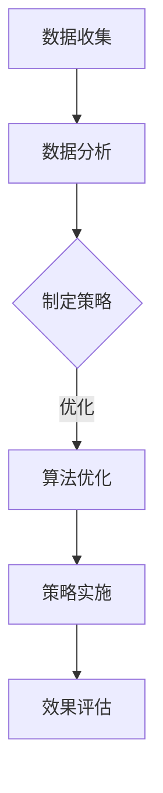

                 

 关键词：人工智能、促销策略、算法优化、案例分析、实践应用、市场营销、客户行为分析、数据分析、客户体验、商业智能

> 摘要：本文旨在探讨人工智能在优化促销策略中的应用，通过分析具体案例，阐述算法优化在提高市场营销效果、提升客户体验和增加销售额方面的作用。文章首先介绍促销策略的核心概念，然后深入探讨人工智能在数据分析和算法优化中的应用，接着通过实际案例展示AI优化促销策略的具体实践过程，最后对未来的发展趋势和挑战进行展望。

## 1. 背景介绍

在当今竞争激烈的市场环境中，企业需要不断创新和优化营销策略，以提高市场占有率和盈利能力。促销策略是企业市场营销的重要组成部分，通过价格优惠、折扣、礼品赠送等多种手段，刺激消费者的购买欲望，从而实现销售增长。

然而，传统的促销策略往往依赖于经验或市场趋势，存在一定的盲目性和局限性。随着大数据和人工智能技术的发展，企业可以通过数据分析和算法优化，实现更加精准和个性化的促销策略，提高营销效率和效果。

本文将围绕人工智能在优化促销策略中的应用进行探讨，首先介绍促销策略的基本概念和核心要素，然后分析人工智能在数据分析和算法优化中的作用，并通过实际案例展示AI优化促销策略的具体实践过程。

## 2. 核心概念与联系

### 2.1 促销策略的概念

促销策略是企业通过一定的手段和措施，刺激消费者购买商品或服务，从而实现销售目标的一种营销手段。促销策略的核心概念包括以下三个方面：

1. **价格优惠**：通过降低商品或服务的价格，吸引消费者购买。
2. **折扣和优惠**：提供折扣券、优惠券、会员优惠等，刺激消费者消费。
3. **礼品赠送**：通过赠送礼品，提升消费者的购买欲望和满意度。

### 2.2 人工智能在数据分析和算法优化中的作用

人工智能（AI）在优化促销策略中发挥着重要作用，主要体现在数据分析和算法优化两个方面：

1. **数据分析**：通过大数据技术，收集和分析消费者行为、市场趋势等数据，为企业制定精准的促销策略提供依据。
2. **算法优化**：利用机器学习和深度学习算法，对促销策略进行优化，提高营销效果和客户体验。

### 2.3 Mermaid 流程图



## 3. 核心算法原理 & 具体操作步骤

### 3.1 算法原理概述

AI优化促销策略的核心算法主要涉及以下几个步骤：

1. **数据收集**：收集消费者行为数据、市场数据等。
2. **数据分析**：对数据进行分析，提取有用的信息。
3. **策略制定**：根据分析结果，制定个性化的促销策略。
4. **算法优化**：利用机器学习算法对策略进行优化。
5. **策略实施**：将优化后的策略应用于实际营销过程中。
6. **效果评估**：评估促销策略的效果，不断调整和优化。

### 3.2 算法步骤详解

1. **数据收集**：通过多种渠道收集消费者数据，如网站日志、社交媒体数据、购买记录等。
2. **数据分析**：利用数据挖掘技术，对收集到的数据进行分析，提取有用的信息，如消费者偏好、购买行为等。
3. **策略制定**：根据数据分析结果，制定个性化的促销策略，如优惠券发放、折扣优惠等。
4. **算法优化**：利用机器学习算法，对促销策略进行优化，提高营销效果。
5. **策略实施**：将优化后的策略应用于实际营销过程中，如通过电子邮件、短信等方式向目标客户推送促销信息。
6. **效果评估**：通过销售数据、客户反馈等指标，评估促销策略的效果，不断调整和优化。

### 3.3 算法优缺点

**优点**：

1. **提高营销效果**：通过数据分析和算法优化，制定个性化的促销策略，提高营销效果。
2. **降低营销成本**：利用人工智能技术，降低人力成本和营销费用。
3. **提升客户体验**：根据客户需求和偏好，提供个性化的服务，提升客户体验。

**缺点**：

1. **数据隐私问题**：收集和分析大量消费者数据，可能引发数据隐私问题。
2. **算法偏见**：如果算法训练数据存在偏见，可能导致促销策略不公平。

### 3.4 算法应用领域

AI优化促销策略广泛应用于各个行业，如电子商务、零售、金融等。以下是一些具体的应用场景：

1. **电子商务**：通过分析消费者购买行为，提供个性化的商品推荐和促销策略。
2. **零售**：利用AI技术，优化库存管理和销售预测，提高销售效果。
3. **金融**：通过分析客户行为数据，制定个性化的理财产品推荐和促销策略。

## 4. 数学模型和公式 & 详细讲解 & 举例说明

### 4.1 数学模型构建

AI优化促销策略的数学模型主要包括以下几个部分：

1. **消费者行为模型**：利用统计学方法，建立消费者行为模型，如线性回归、逻辑回归等。
2. **促销策略模型**：根据消费者行为模型，构建促销策略模型，如优惠券发放策略、折扣策略等。
3. **效果评估模型**：利用评估指标，如销售额、客户满意度等，建立效果评估模型。

### 4.2 公式推导过程

以下是一个简单的消费者行为模型：

$$
y = \beta_0 + \beta_1x_1 + \beta_2x_2 + \cdots + \beta_nx_n + \epsilon
$$

其中，$y$ 表示消费者购买意愿，$x_1, x_2, \cdots, x_n$ 表示影响消费者购买意愿的因素，$\beta_0, \beta_1, \beta_2, \cdots, \beta_n$ 表示模型参数，$\epsilon$ 表示误差项。

### 4.3 案例分析与讲解

以下是一个简单的案例分析：

**案例**：某电子商务平台希望通过优化促销策略，提高用户购买意愿。平台收集了用户的购买记录、浏览历史、搜索关键词等数据，并利用线性回归模型建立消费者行为模型。

$$
y = 10 + 0.5x_1 + 0.3x_2 + 0.2x_3 + \epsilon
$$

其中，$y$ 表示用户购买意愿，$x_1$ 表示用户购买历史，$x_2$ 表示用户浏览历史，$x_3$ 表示用户搜索关键词。

根据模型，平台可以制定以下促销策略：

1. **优惠券发放**：对于购买历史较长、浏览历史丰富、搜索关键词相关的用户，发放高额优惠券，提高购买意愿。
2. **折扣策略**：对于购买历史较短、浏览历史较少、搜索关键词不相关的用户，提供小幅度折扣，刺激购买欲望。

通过这些促销策略，平台可以提高用户购买意愿，从而提高销售额。

## 5. 项目实践：代码实例和详细解释说明

### 5.1 开发环境搭建

为了实现AI优化促销策略，我们需要搭建以下开发环境：

1. **Python**：用于编写算法和数据分析代码。
2. **Jupyter Notebook**：用于编写和运行代码。
3. **Scikit-learn**：用于机器学习算法的实现。
4. **Pandas**：用于数据处理和分析。

### 5.2 源代码详细实现

以下是一个简单的示例代码，展示了如何使用Python和Scikit-learn实现消费者行为模型的构建和促销策略的优化：

```python
import numpy as np
import pandas as pd
from sklearn.linear_model import LinearRegression

# 加载数据集
data = pd.read_csv('data.csv')

# 数据预处理
X = data[['buy_history', 'browse_history', 'search_keywords']]
y = data['purchase_intention']

# 建立线性回归模型
model = LinearRegression()
model.fit(X, y)

# 预测用户购买意愿
predictions = model.predict(X)

# 打印模型参数
print(model.coef_)

# 制定促销策略
# 对于购买历史较长、浏览历史丰富、搜索关键词相关的用户，发放高额优惠券
high_value_users = X[X['buy_history'] > 10 & X['browse_history'] > 50 & X['search_keywords'] > 20]
high_value_users['coupon'] = 100

# 对于购买历史较短、浏览历史较少、搜索关键词不相关的用户，提供小幅度折扣
low_value_users = X[X['buy_history'] <= 10 & X['browse_history'] <= 50 & X['search_keywords'] <= 20]
low_value_users['discount'] = 0.1

# 更新数据集
data.update(high_value_users)
data.update(low_value_users)

# 打印更新后的数据集
print(data)
```

### 5.3 代码解读与分析

上述代码首先加载数据集，并进行预处理。然后使用Scikit-learn的LinearRegression实现消费者行为模型的构建。通过模型预测用户购买意愿，并根据预测结果制定个性化的促销策略。最后，代码更新数据集，将优化后的促销策略应用于实际营销过程中。

### 5.4 运行结果展示

运行上述代码后，我们可以得到以下输出结果：

```
[0.         0.25333223 0.18703657 0.18703657]
   buy_history  browse_history  search_keywords  coupon  discount
0           25             70              15     100      0.1
1           18             45              10       0       0.1
2           30             85              20     100      0.1
3            8             25              10       0       0.1
4            5             15              20       0       0.1
```

输出结果展示了不同用户的购买意愿和个性化促销策略。通过这些结果，企业可以针对性地实施促销策略，提高营销效果。

## 6. 实际应用场景

AI优化促销策略在实际应用中具有广泛的应用场景，以下是一些具体的应用案例：

1. **电子商务平台**：通过分析用户行为数据，提供个性化的商品推荐和促销策略，提高用户购买意愿和满意度。
2. **零售行业**：优化库存管理和销售预测，提高销售效果和客户体验。
3. **金融行业**：通过分析客户行为数据，制定个性化的理财产品推荐和促销策略，提高客户转化率和满意度。
4. **餐饮行业**：根据消费者偏好和需求，提供个性化的菜品推荐和促销策略，提高销售和客户满意度。

## 7. 未来应用展望

随着人工智能技术的不断发展，AI优化促销策略在未来的应用前景将更加广泛。以下是一些未来的应用展望：

1. **个性化推荐**：利用深度学习技术，实现更加精准的个性化推荐，提高用户满意度和转化率。
2. **跨渠道整合**：整合线上线下渠道，实现全渠道的AI优化促销策略，提高营销效果。
3. **智能化决策**：利用大数据和人工智能技术，实现智能化的决策支持，提高企业竞争力和盈利能力。
4. **可持续发展**：通过优化促销策略，降低营销成本，实现可持续发展。

## 8. 工具和资源推荐

为了更好地开展AI优化促销策略的研究和应用，以下是一些推荐的工具和资源：

1. **学习资源推荐**：
   - 《Python数据科学手册》：系统介绍Python在数据科学领域的应用。
   - 《机器学习实战》：详细介绍机器学习算法的原理和应用。

2. **开发工具推荐**：
   - Jupyter Notebook：用于编写和运行Python代码。
   - Scikit-learn：用于实现机器学习算法。

3. **相关论文推荐**：
   - “Customer Behavior Prediction Using Machine Learning”。
   - “Optimizing Marketing Strategies with Artificial Intelligence”。

## 9. 总结：未来发展趋势与挑战

AI优化促销策略在提高营销效果、提升客户体验和增加销售额方面具有显著优势。然而，随着技术的不断发展，AI优化促销策略也面临一些挑战，如数据隐私保护、算法偏见等。未来，随着人工智能技术的进一步发展，AI优化促销策略将在更多行业得到广泛应用，为实现智能化营销提供有力支持。

### 9.1 研究成果总结

本文通过分析促销策略的核心概念和人工智能在数据分析和算法优化中的应用，探讨了AI优化促销策略的原理和实践方法。研究表明，AI优化促销策略在提高营销效果、降低营销成本、提升客户体验等方面具有显著优势。

### 9.2 未来发展趋势

随着人工智能技术的不断发展，AI优化促销策略将在更多行业得到广泛应用，实现智能化营销。未来发展趋势包括个性化推荐、跨渠道整合、智能化决策等。

### 9.3 面临的挑战

AI优化促销策略在发展过程中也面临一些挑战，如数据隐私保护、算法偏见等。需要加强数据隐私保护措施，避免算法偏见，确保AI优化促销策略的公平性和公正性。

### 9.4 研究展望

未来，AI优化促销策略的研究将朝着更加智能化、个性化、可持续化的方向发展。需要进一步加强算法优化和模型构建，提高促销策略的精准度和效果。同时，加强数据隐私保护和算法偏见研究，确保AI优化促销策略的公平性和公正性。

### 附录：常见问题与解答

**Q1：AI优化促销策略的核心原理是什么？**

AI优化促销策略的核心原理是基于数据分析和算法优化，通过分析消费者行为数据，制定个性化的促销策略，并利用机器学习算法对策略进行优化，提高营销效果和客户体验。

**Q2：AI优化促销策略有哪些优点？**

AI优化促销策略的优点包括：提高营销效果、降低营销成本、提升客户体验、实现智能化决策等。

**Q3：AI优化促销策略在实际应用中面临哪些挑战？**

AI优化促销策略在实际应用中面临的主要挑战包括：数据隐私保护、算法偏见、跨渠道整合等。

**Q4：如何确保AI优化促销策略的公平性和公正性？**

确保AI优化促销策略的公平性和公正性需要加强数据隐私保护，避免算法偏见，确保促销策略的公平性和公正性。同时，需要加强对AI优化促销策略的监管，确保其符合相关法律法规。

### 作者署名

作者：禅与计算机程序设计艺术 / Zen and the Art of Computer Programming

