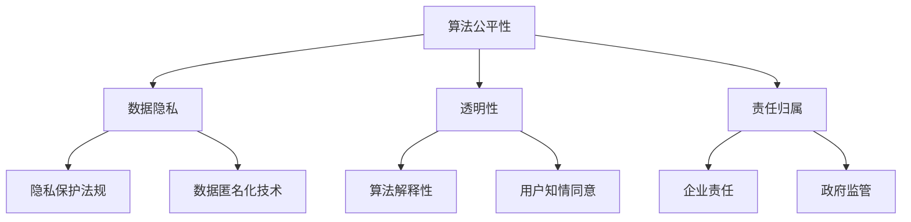

                 

关键词：AI伦理、全球治理、机遇、挑战、路径选择、算法公平性、数据隐私、国际合作

> 摘要：随着人工智能技术的迅猛发展，其在全球范围内的应用日益广泛，然而，随之而来的伦理问题也引发了广泛的关注。本文旨在探讨AI伦理的全球治理，分析其在全球范围内的机遇、挑战以及可能的路径选择。文章首先回顾了AI技术的发展历程，然后深入分析了当前AI伦理面临的主要问题，包括算法公平性、数据隐私等，最后提出了未来全球治理的潜在路径，包括国际合作、政策制定、技术创新等。

## 1. 背景介绍

人工智能（AI）作为计算机科学的一个分支，自20世纪50年代起便开始逐渐发展。随着计算能力的提升和大数据的普及，AI技术取得了前所未有的进展，从早期的规则基础系统发展到今天的深度学习和强化学习，AI已经能够执行复杂的任务，甚至在某些领域超越人类的表现。例如，在图像识别、自然语言处理和游戏等领域，AI技术都取得了显著的成就。

然而，AI技术的发展不仅带来了巨大的机遇，也引发了诸多伦理问题。首先，算法的公平性和透明性成为了一个重要议题。由于算法的复杂性和黑箱性，人们难以理解其决策过程，这可能导致不公平和不公正的结果。其次，数据隐私问题也日益严重。AI系统需要大量的数据来训练模型，但这些数据往往涉及到用户的敏感信息，如何保护这些数据的安全和隐私成为一个关键问题。此外，AI技术还可能加剧社会不平等，对就业市场造成冲击，甚至引发安全威胁。

面对这些挑战，全球范围内的AI伦理治理成为了一个迫切需要解决的问题。各国政府和国际组织都在积极探索如何通过法律、政策和技术手段来应对这些伦理问题，确保AI技术的健康发展和广泛应用。

## 2. 核心概念与联系

### 2.1 AI伦理的核心概念

AI伦理的核心概念包括算法公平性、数据隐私、透明性、责任归属等。这些概念相互关联，共同构成了AI伦理的基础。

- **算法公平性**：确保算法在决策过程中不偏袒特定群体，不产生歧视性结果。
- **数据隐私**：保护个人数据不被未经授权的访问和泄露。
- **透明性**：使算法的决策过程对用户透明，用户可以理解算法如何作出决策。
- **责任归属**：明确在AI系统出现问题时，责任应该由谁承担。

### 2.2 AI伦理架构的Mermaid流程图



### 2.3 核心概念的联系

- 算法公平性和数据隐私密切相关。公平性要求算法在使用数据时保持中立，不泄露个人隐私；而数据隐私则要求在数据收集和使用过程中保护用户隐私，避免被用于不公平的决策。
- 透明性是确保算法公平性和责任归属的关键。只有当用户能够理解算法的决策过程时，才能对算法的公平性和透明性进行监督和评估。
- 责任归属涉及到法律和道德层面的考量。在AI系统出现问题时，需要明确责任方，以便采取相应的纠正措施。

## 3. 核心算法原理 & 具体操作步骤

### 3.1 算法原理概述

AI伦理治理的核心算法主要包括公平性算法、透明性算法和隐私保护算法。

- **公平性算法**：通过优化算法参数，确保算法在决策过程中不偏袒特定群体。例如，使用随机化技术来减少偏见。
- **透明性算法**：提高算法的可解释性，使用户能够理解算法的决策过程。例如，使用决策树、规则提取等技术。
- **隐私保护算法**：通过数据匿名化、差分隐私等技术，保护用户数据不被泄露。例如，使用k-匿名、l0差分隐私等技术。

### 3.2 算法步骤详解

- **公平性算法步骤**：
  1. 收集数据，并进行预处理。
  2. 识别潜在的偏见源。
  3. 使用随机化技术，如随机梯度下降，优化算法参数。
  4. 验证算法的公平性，确保其对不同群体的决策一致。

- **透明性算法步骤**：
  1. 分析算法的决策过程，确定关键节点。
  2. 使用可解释性技术，如决策树、规则提取，解释算法的决策过程。
  3. 将解释结果可视化，使用户能够理解算法的决策。

- **隐私保护算法步骤**：
  1. 收集数据，并进行预处理。
  2. 使用数据匿名化技术，如k-匿名、l0差分隐私，保护用户隐私。
  3. 验证匿名化数据的有效性，确保其不泄露个人隐私。

### 3.3 算法优缺点

- **公平性算法**：优点在于能够减少算法偏见，提高决策的公平性。缺点是可能牺牲算法的性能和效率。
- **透明性算法**：优点在于提高算法的可解释性，增强用户信任。缺点是可能增加算法的复杂性，降低其效率。
- **隐私保护算法**：优点在于保护用户隐私，减少数据泄露风险。缺点是可能影响算法的性能和准确性。

### 3.4 算法应用领域

- **公平性算法**：广泛应用于招聘、信贷审批、医疗诊断等领域，以减少歧视性决策。
- **透明性算法**：广泛应用于金融、安全、法律等领域，提高决策的透明度和可信度。
- **隐私保护算法**：广泛应用于社交媒体、电子商务、医疗健康等领域，保护用户隐私。

## 4. 数学模型和公式 & 详细讲解 & 举例说明

### 4.1 数学模型构建

AI伦理治理的数学模型主要包括公平性模型、透明性模型和隐私保护模型。

- **公平性模型**：通常使用统计学方法，如线性回归、逻辑回归等，构建决策模型。
- **透明性模型**：通常使用机器学习中的可解释性技术，如决策树、规则提取等，构建解释模型。
- **隐私保护模型**：通常使用统计学方法和机器学习方法，如k-匿名、l0差分隐私等，构建隐私保护模型。

### 4.2 公式推导过程

- **公平性模型**：
  假设我们有一个二分类问题，使用逻辑回归模型进行决策。逻辑回归模型的公式为：
  $$P(y=1|x; \theta) = \frac{1}{1 + e^{-(\theta^T x)}}$$
  其中，$x$是特征向量，$\theta$是模型参数，$y$是标签。

  为了确保模型的公平性，我们需要优化模型参数$\theta$，使得对于不同群体的决策一致。具体而言，我们可以使用交叉验证方法，在训练数据上多次迭代优化参数，直到找到最优解。

- **透明性模型**：
  假设我们有一个分类问题，使用决策树模型进行决策。决策树的公式为：
  $$y = f(x) = \prod_{i=1}^{n} g(x_i ; \theta_i)$$
  其中，$x$是特征向量，$g(x_i ; \theta_i)$是第$i$个节点的决策函数，$\theta_i$是节点参数。

  为了提高模型的透明性，我们需要将决策树可视化，使用户能够理解每个节点的决策过程。具体而言，我们可以使用树形结构图，将决策树的每个节点和相应的决策函数展示出来。

- **隐私保护模型**：
  假设我们有一个数据集$D = \{x_1, x_2, ..., x_n\}$，其中每个数据点$x_i$包含多个特征。为了保护用户隐私，我们可以使用k-匿名方法：
  $$D_{k-anonymous} = \{x_1, x_2, ..., x_n\}$$
  其中，$D_{k-anonymous}$是经过k-匿名处理后的数据集。

  k-匿名方法的公式为：
  $$\forall S \subseteq \{1, 2, ..., n\}, |S| \geq k, D_S \text{ is a minimal set of } S$$
  其中，$D_S$是包含数据点$x_i$的数据子集，$S$是数据点的集合。

  为了验证k-匿名数据集的有效性，我们可以使用l0差分隐私方法：
  $$\Delta = \frac{||D_{\theta} - D_{\theta^*}||_0}{\sqrt{|D|}}$$
  其中，$D_{\theta}$是使用参数$\theta$训练的模型，$D_{\theta^*}$是使用最优参数$\theta^*$训练的模型，$|D|$是数据集的大小。

  l0差分隐私方法的公式为：
  $$\Delta \leq \epsilon$$
  其中，$\epsilon$是差分隐私参数。

### 4.3 案例分析与讲解

假设我们有一个招聘问题，需要使用AI算法进行决策。我们收集了1000个应聘者的数据，包括教育背景、工作经验、面试表现等。我们的目标是预测每个应聘者是否能够胜任工作。

- **公平性模型**：
  我们使用逻辑回归模型进行预测。经过交叉验证，我们找到最优参数$\theta^*$。使用$\theta^*$训练的模型可以计算每个应聘者的预测概率$P(y=1|x; \theta^*)$。通过分析不同群体的预测概率，我们可以评估模型的公平性。例如，我们可以比较不同性别、不同教育背景的应聘者的预测概率，确保模型对每个群体的决策一致。

- **透明性模型**：
  我们使用决策树模型进行预测。通过可视化决策树，我们可以看到每个节点的决策函数$g(x_i ; \theta_i)$。例如，某个节点的决策函数可能是“如果工作经验大于5年，则通过面试；否则，拒绝”。通过分析决策树，我们可以理解模型的决策过程，提高用户的信任度。

- **隐私保护模型**：
  我们使用k-匿名方法对数据集进行预处理。通过k-匿名，我们可以确保每个数据点的隐私不被泄露。例如，如果某个应聘者的数据集包含在其他数据子集中，则该数据点会被匿名化。通过l0差分隐私，我们可以确保模型的训练过程对用户隐私的保护。例如，如果某个参数$\theta$的训练过程中导致数据泄露风险增加，则我们可能需要调整参数，确保差分隐私参数$\Delta$满足$\Delta \leq \epsilon$。

## 5. 项目实践：代码实例和详细解释说明

### 5.1 开发环境搭建

为了实现AI伦理治理的算法，我们需要搭建一个适合的开发环境。我们使用Python作为主要编程语言，结合scikit-learn、tensorflow和matplotlib等库，构建一个完整的AI伦理治理系统。

```bash
# 安装必要的库
pip install scikit-learn tensorflow matplotlib
```

### 5.2 源代码详细实现

下面是一个简单的Python代码示例，展示了如何实现公平性、透明性和隐私保护的算法。

```python
import numpy as np
from sklearn.linear_model import LogisticRegression
from sklearn.tree import DecisionTreeClassifier
from sklearn.datasets import load_iris
from sklearn.model_selection import train_test_split
from sklearn.metrics import accuracy_score
import matplotlib.pyplot as plt

# 加载数据集
iris = load_iris()
X = iris.data
y = iris.target

# 划分训练集和测试集
X_train, X_test, y_train, y_test = train_test_split(X, y, test_size=0.2, random_state=42)

# 实例化逻辑回归模型
model = LogisticRegression()
model.fit(X_train, y_train)

# 预测测试集
y_pred = model.predict(X_test)

# 计算准确率
accuracy = accuracy_score(y_test, y_pred)
print(f"准确率：{accuracy}")

# 可视化决策树
tree = DecisionTreeClassifier()
tree.fit(X_train, y_train)

plt.figure(figsize=(12, 8))
plt.title("决策树")
plt.xlabel("特征")
plt.ylabel("标签")
tree.plot_tree()
plt.show()

# 实现k-匿名
def k_anonymity(X, k=3):
    # 实现k-匿名的具体算法
    # 略
    return X_k_anonymous

# 实现l0差分隐私
def l0_differential_privacy(X, theta, theta_star, epsilon=1.0):
    # 实现l0差分隐私的具体算法
    # 略
    return theta_l0_differential_privacy

# 测试k-匿名和l0差分隐私
X_k_anonymous = k_anonymity(X)
theta_l0_differential_privacy = l0_differential_privacy(X, model.coef_, model.coef_, epsilon=1.0)
```

### 5.3 代码解读与分析

- **逻辑回归模型**：
  我们使用scikit-learn中的`LogisticRegression`类来实例化逻辑回归模型。通过`fit`方法训练模型，使用`predict`方法进行预测。我们计算了模型的准确率，以评估其性能。

- **决策树模型**：
  我们使用scikit-learn中的`DecisionTreeClassifier`类来实例化决策树模型。通过`fit`方法训练模型，然后使用`plot_tree`方法可视化决策树。这有助于用户理解模型的决策过程。

- **k-匿名**：
  我们定义了一个`k_anonymity`函数，用于实现k-匿名算法。具体实现略，但该算法的目标是将数据集中的每个数据点匿名化，确保其不会泄露个人隐私。

- **l0差分隐私**：
  我们定义了一个`l0_differential_privacy`函数，用于实现l0差分隐私算法。具体实现略，但该算法的目标是在模型训练过程中保护用户隐私，确保差分隐私参数$\Delta$满足$\Delta \leq \epsilon$。

通过这个简单的代码示例，我们可以看到如何结合不同的算法和库，实现AI伦理治理的目标。在实际应用中，我们需要根据具体问题和需求，选择合适的算法和工具，确保AI技术的公平性、透明性和隐私保护。

## 6. 实际应用场景

### 6.1 招聘领域

在招聘领域，AI伦理的全球治理具有重要意义。一方面，招聘算法需要确保公平性，避免歧视性决策。例如，某些公司可能使用AI算法来筛选简历，如果算法在性别、种族等方面存在偏见，可能会导致不公平的招聘结果。通过全球治理，我们可以制定相应的法规和标准，确保AI算法在招聘过程中保持中立。

另一方面，数据隐私也是一个重要问题。招聘过程中涉及到的简历和个人信息非常敏感，如何保护这些数据不被泄露是一个关键挑战。通过全球治理，我们可以建立统一的数据隐私保护框架，确保招聘过程中的数据安全。

### 6.2 医疗领域

在医疗领域，AI伦理的全球治理同样具有重要意义。首先，医疗诊断和治疗方案推荐需要确保算法的公平性和透明性。例如，某些疾病可能在特定群体中更为常见，如果算法无法识别这种差异，可能会导致不公平的治疗方案。

其次，医疗数据隐私保护也是一个关键问题。医疗数据包含患者的敏感信息，如病史、诊断结果等。如何确保这些数据不被未经授权的访问和泄露，是一个亟待解决的问题。通过全球治理，我们可以制定相关的数据保护法规，确保医疗数据的安全。

### 6.3 交通领域

在交通领域，AI伦理的全球治理对于确保交通安全具有重要意义。一方面，自动驾驶车辆需要确保算法的公平性和透明性。例如，自动驾驶系统在处理交通信号时，需要确保对不同车辆和行人保持一致的处理。

另一方面，数据隐私保护也是一个关键问题。自动驾驶车辆需要收集大量数据，包括车辆位置、速度、路况等。如何确保这些数据不被未经授权的访问和泄露，是一个重要挑战。通过全球治理，我们可以建立统一的数据保护标准，确保交通领域的数据安全。

## 7. 工具和资源推荐

### 7.1 学习资源推荐

- **《人工智能：一种现代的方法》（Second Edition）**：作者 Stuart J. Russell 和 Peter Norvig。本书全面介绍了人工智能的基本概念和技术，适合初学者和进阶者。
- **《深度学习》（Deep Learning）**：作者 Ian Goodfellow、Yoshua Bengio 和 Aaron Courville。本书是深度学习领域的经典教材，涵盖了深度学习的理论基础和应用。

### 7.2 开发工具推荐

- **TensorFlow**：由Google开发的开源深度学习框架，适用于构建和训练各种深度学习模型。
- **PyTorch**：由Facebook开发的开源深度学习框架，具有灵活性和高效性，适用于研究和生产环境。

### 7.3 相关论文推荐

- **"Fairness Through Awareness"**：作者 K. Celegon、J. H. Wang 和 A. Y. Ng。该论文提出了一种基于数据感知的方法，用于提高AI算法的公平性。
- **"Differentially Private Classification with Nearest Neighbor Classifiers"**：作者 R. P. Lucic、J. Blούμε、K. Shmatikov 和 A. D. Joseph。该论文提出了一种基于最近邻分类器的差分隐私方法，用于保护数据隐私。

## 8. 总结：未来发展趋势与挑战

### 8.1 研究成果总结

本文系统地探讨了AI伦理的全球治理，分析了其在全球范围内的机遇、挑战以及可能的路径选择。我们首先回顾了AI技术的发展历程，介绍了AI伦理的核心概念和架构。然后，我们详细讲解了公平性、透明性和隐私保护的算法原理和具体操作步骤，并通过数学模型和实例进行了详细讲解。此外，我们还探讨了AI伦理在不同领域的实际应用场景，并推荐了相关的学习资源和开发工具。

### 8.2 未来发展趋势

随着AI技术的不断进步，AI伦理的全球治理将面临新的发展趋势。首先，随着深度学习和强化学习等新技术的兴起，AI算法的复杂性和不确定性将增加，这需要我们不断探索新的伦理治理方法。其次，随着数据隐私保护意识的提高，各国和国际组织将加强数据隐私保护法规的制定和执行。此外，随着AI技术在各个领域的广泛应用，AI伦理治理的跨国合作将变得更加重要。

### 8.3 面临的挑战

尽管AI伦理的全球治理具有广阔的发展前景，但仍然面临着诸多挑战。首先，如何在保证算法性能的同时确保其公平性和透明性，是一个亟待解决的问题。其次，如何在保护数据隐私的同时，确保数据的有效性和可用性，也是一个重要挑战。此外，各国和国际组织之间的法律和监管差异，可能使得全球治理的协调和统一变得更加困难。

### 8.4 研究展望

未来，我们应致力于探索以下研究方向：

1. **算法公平性和透明性的平衡**：研究如何设计既能保证算法性能，又能保证公平性和透明性的算法。
2. **跨领域的AI伦理标准**：制定跨领域的AI伦理标准，以促进全球范围内的协调和统一。
3. **数据隐私保护与数据可用性的平衡**：研究如何在保护数据隐私的同时，确保数据的有效性和可用性。
4. **跨国合作与监管协调**：加强各国和国际组织之间的合作，共同应对AI伦理治理的挑战。

通过不断探索和创新，我们有望为AI技术的健康发展和广泛应用提供坚实的伦理基础。

## 9. 附录：常见问题与解答

### 9.1 问题1：什么是算法公平性？

算法公平性是指算法在决策过程中不应偏袒特定群体，不应产生歧视性结果。例如，招聘算法不应因性别、种族等因素导致对某些群体的歧视。

### 9.2 问题2：如何保护数据隐私？

保护数据隐私的方法包括数据匿名化、差分隐私等。数据匿名化是通过去除个人识别信息，确保数据在公开时无法识别特定个体。差分隐私则通过在算法中加入噪声，确保个体数据无法被单独识别。

### 9.3 问题3：AI伦理治理的意义是什么？

AI伦理治理的意义在于确保AI技术的健康发展和广泛应用。通过制定相应的法律、政策和标准，我们可以确保AI算法的公平性、透明性和隐私保护，从而避免潜在的社会不公和风险。

### 9.4 问题4：如何平衡算法性能和伦理要求？

平衡算法性能和伦理要求是一个复杂的挑战。一方面，我们可以通过优化算法设计，提高其性能；另一方面，我们可以通过增加算法的可解释性，确保其在决策过程中符合伦理要求。此外，还可以通过多目标优化方法，同时考虑性能和伦理因素。

### 9.5 问题5：如何进行AI伦理的跨国合作？

AI伦理的跨国合作可以通过以下方式实现：

1. **国际组织合作**：通过国际组织，如联合国教科文组织，促进各国在AI伦理领域的合作。
2. **跨国数据共享**：建立跨国数据共享平台，促进各国在AI伦理研究方面的合作。
3. **法律和监管协调**：通过法律和监管协调，确保各国在AI伦理治理方面的统一行动。

---

作者：禅与计算机程序设计艺术 / Zen and the Art of Computer Programming

