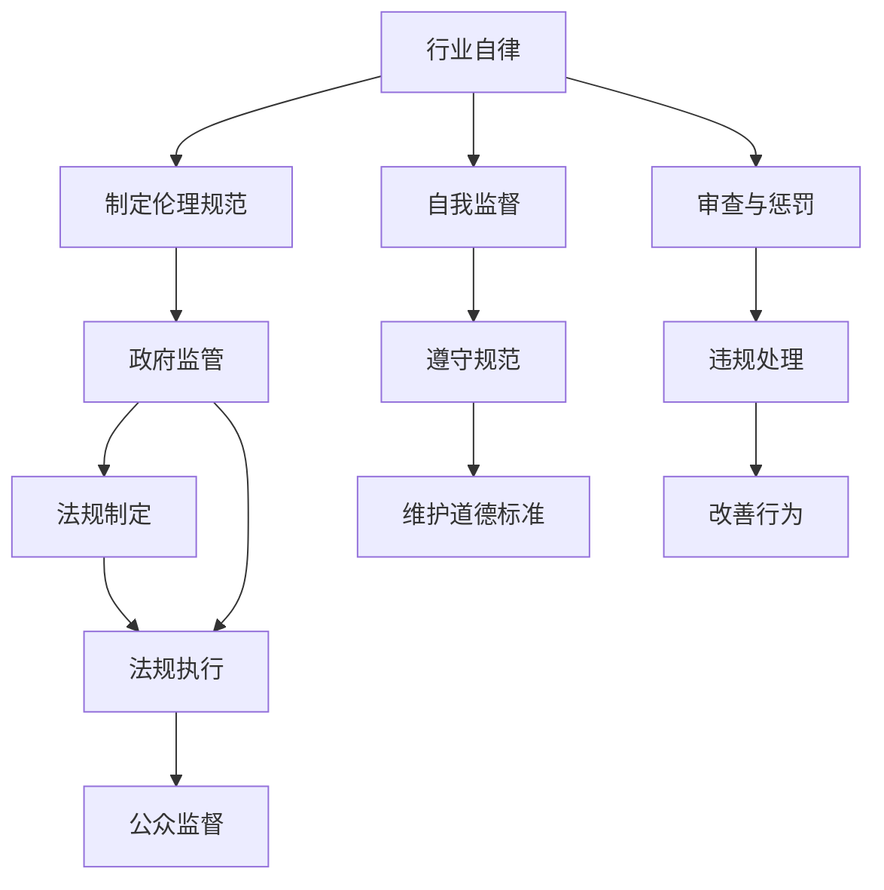

                 

### 1. 背景介绍

随着人工智能技术的迅猛发展，人工智能（AI）已经渗透到社会的各个领域，从医疗、金融到交通、教育，AI的应用范围不断扩大，影响力也越来越显著。然而，随之而来的是一系列伦理问题，如数据隐私、算法歧视、失业风险等。这些问题不仅影响到个人和社会的福祉，也对人工智能行业的可持续发展提出了挑战。

为了应对这些伦理问题，制定AI伦理规范成为了一个热门话题。目前，关于AI伦理规范的制定主要存在两种不同的观点：一是行业自律，即由行业内部组织制定并遵守伦理规范；二是政府监管，即由政府出台相关法规和政策进行监管。这两种观点各有优缺点，本文将深入探讨这两种路径的可行性和挑战。

### 2. 核心概念与联系

首先，我们需要明确一些核心概念，以便更好地理解AI伦理规范制定的背景和关键点。

**2.1 人工智能的定义与分类**

人工智能（Artificial Intelligence，简称AI）是指由计算机系统实现的、能够模拟、延伸和扩展人类智能的领域。根据AI的智能水平，可以分为弱人工智能（Weak AI）和强人工智能（Strong AI）。

- **弱人工智能**：专注于特定任务的智能，如语音识别、图像识别、自然语言处理等。
- **强人工智能**：具有全面智能，能够像人类一样理解、思考、学习和创造，目前尚未实现。

**2.2 AI伦理的概念与范畴**

AI伦理（AI Ethics）是指关于人工智能应用中的道德和伦理问题，包括数据隐私、算法公平性、社会责任等方面。具体来说，AI伦理涉及以下几个方面：

- **数据隐私**：涉及个人数据的收集、存储、使用和保护。
- **算法公平性**：防止算法偏见和歧视，确保算法的公平性和透明性。
- **社会责任**：AI技术对社会和人类的影响，包括就业、安全、健康等方面。
- **透明性和可解释性**：确保AI系统的决策过程可以被理解和监督。

**2.3 行业自律与政府监管的定义与区别**

- **行业自律**：指由行业内部组织（如行业协会、学术团体）制定和遵守伦理规范，通过自我监督和审查来维护行业秩序和道德标准。
- **政府监管**：指由政府出台相关法规和政策，对AI技术的发展和应用进行监管和约束，以保障公众利益和社会稳定。

**2.4 Mermaid流程图**

以下是一个简单的Mermaid流程图，展示了行业自律和政府监管的基本流程和相互关系：



通过这个流程图，我们可以看到行业自律和政府监管在制定、执行和监督AI伦理规范过程中的协同作用。

### 3. 核心算法原理 & 具体操作步骤

#### 3.1 算法原理概述

在AI伦理规范的制定中，核心算法原理主要包括以下几个方面：

- **伦理原则的提取**：从不同领域的伦理原则中提取关键信息，构建伦理模型。
- **伦理决策的支持**：利用机器学习和自然语言处理技术，支持伦理决策的制定和执行。
- **伦理合规的监测**：通过数据分析和模型评估，监测AI系统的伦理合规性。

#### 3.2 算法步骤详解

1. **伦理原则的提取**

   首先，我们需要从不同领域的伦理原则中提取关键信息，构建伦理模型。这个过程可以分为以下几个步骤：

   - **数据收集**：收集相关领域的伦理文献、报告和案例。
   - **文本预处理**：对文本进行清洗和格式化，提取关键词和句子。
   - **主题建模**：使用主题建模算法（如LDA），提取文本的主题。
   - **伦理原则提取**：根据主题建模结果，提取关键伦理原则。

2. **伦理决策的支持**

   接下来，我们需要利用机器学习和自然语言处理技术，支持伦理决策的制定和执行。具体步骤如下：

   - **训练数据准备**：收集相关的伦理决策案例，进行数据标注。
   - **模型训练**：使用机器学习算法（如决策树、神经网络）训练伦理决策模型。
   - **模型评估**：对训练好的模型进行评估，选择性能最佳的模型。
   - **决策支持**：将模型应用于实际场景，提供伦理决策支持。

3. **伦理合规的监测**

   最后，我们需要通过数据分析和模型评估，监测AI系统的伦理合规性。具体步骤如下：

   - **数据采集**：从AI系统收集相关的行为数据。
   - **数据分析**：对采集到的数据进行分析，识别潜在的风险和问题。
   - **模型评估**：使用伦理决策模型对AI系统进行评估，判断其伦理合规性。
   - **反馈与改进**：根据评估结果，对AI系统进行改进，提高其伦理合规性。

#### 3.3 算法优缺点

**优点**：

- **灵活性和适应性**：行业自律可以根据具体情况进行调整和改进，适应快速变化的AI技术。
- **自主性和创新性**：行业自律鼓励创新和自主性，有利于推动AI技术的发展。

**缺点**：

- **缺乏统一标准**：行业自律可能导致不同组织之间的标准不一致，影响伦理规范的有效性。
- **监管不足**：行业自律可能存在监管不足的问题，难以确保所有组织都能遵守伦理规范。

**3.4 算法应用领域**

AI伦理算法可以在多个领域得到应用，如：

- **医疗领域**：确保医疗AI系统的伦理合规性，保护患者隐私和权益。
- **金融领域**：防止金融AI系统产生歧视性决策，保护消费者权益。
- **交通领域**：确保自动驾驶汽车的伦理合规性，保障交通安全。

### 4. 数学模型和公式 & 详细讲解 & 举例说明

在AI伦理规范的制定中，数学模型和公式扮演着重要的角色，用于描述和解决伦理问题。以下是一个简单的例子：

#### 4.1 数学模型构建

假设我们有一个分类问题，需要根据输入特征向量 $x$，判断其属于哪一个类别。我们可以使用逻辑回归模型进行分类。

逻辑回归模型的数学模型如下：

$$
P(y=1|x;\theta) = \frac{1}{1 + e^{-(\theta^T x)}}
$$

其中，$y$ 是实际类别，$x$ 是输入特征向量，$\theta$ 是模型参数。

#### 4.2 公式推导过程

逻辑回归模型的推导过程如下：

1. **假设**：假设输入特征向量 $x$ 和类别 $y$ 之间满足线性关系。

$$
\theta^T x + b = 0
$$

其中，$\theta$ 是模型参数，$b$ 是偏置项。

2. **目标函数**：定义损失函数，用于衡量模型预测结果和实际结果之间的差距。

$$
L(\theta) = -\sum_{i=1}^n [y_i \log(P(y=1|x;\theta)) + (1 - y_i) \log(1 - P(y=1|x;\theta))]
$$

其中，$n$ 是样本数量。

3. **优化目标**：最小化损失函数。

$$
\theta = \arg\min_{\theta} L(\theta)
$$

4. **推导**：对损失函数进行求导，并令导数为0，求解得到最优参数 $\theta$。

$$
\frac{\partial L(\theta)}{\partial \theta} = 0
$$

5. **解方程**：解上述方程，得到 $\theta$ 的表达式。

$$
\theta = \frac{1}{n} \sum_{i=1}^n (y_i - P(y=1|x;\theta)) x_i
$$

#### 4.3 案例分析与讲解

假设我们有一个二分类问题，需要根据输入特征向量 $x$，判断其属于正类（$y=1$）还是负类（$y=0$）。

输入特征向量 $x$ 如下：

$$
x = [1, 2, 3, 4, 5]
$$

类别标签 $y$ 如下：

$$
y = [1, 0, 1, 0, 1]
$$

我们需要使用逻辑回归模型进行分类。

1. **数据预处理**：

   将输入特征向量 $x$ 和类别标签 $y$ 转换为矩阵形式：

$$
X = \begin{bmatrix}
1 & 2 & 3 & 4 & 5 \\
\end{bmatrix}, \quad
Y = \begin{bmatrix}
1 & 0 & 1 & 0 & 1 \\
\end{bmatrix}
$$

2. **模型训练**：

   使用训练数据 $(X, Y)$，通过最小化损失函数，求解得到最优参数 $\theta$。

$$
\theta = \frac{1}{5} \sum_{i=1}^5 (y_i - P(y=1|x_i;\theta)) x_i
$$

3. **模型评估**：

   使用测试数据 $(X', Y')$，计算模型在测试数据上的准确率、召回率等指标。

$$
\text{准确率} = \frac{1}{5} \sum_{i=1}^5 \frac{y_i \cdot \hat{y}_i}{y_i + \hat{y}_i}, \quad
\text{召回率} = \frac{1}{5} \sum_{i=1}^5 \frac{y_i \cdot \hat{y}_i}{y_i + (1 - \hat{y}_i)}
$$

其中，$\hat{y}_i$ 是模型对 $x_i$ 的预测结果。

### 5. 项目实践：代码实例和详细解释说明

为了更好地理解AI伦理规范的制定，我们以一个简单的项目为例，展示如何实现和部署一个基于逻辑回归的伦理决策系统。

#### 5.1 开发环境搭建

1. **硬件环境**：

   - CPU：Intel Core i5 或更高
   - 内存：8GB 或更高
   - 硬盘：至少 100GB 空间

2. **软件环境**：

   - 操作系统：Windows 10 或 Ubuntu 20.04
   - 编程语言：Python 3.8 或更高
   - 数据处理库：NumPy、Pandas
   - 机器学习库：scikit-learn
   - 逻辑回归实现：自定义实现

#### 5.2 源代码详细实现

以下是一个简单的逻辑回归实现，用于解决一个二分类问题。

```python
import numpy as np
import pandas as pd
from sklearn.model_selection import train_test_split
from sklearn.metrics import accuracy_score, recall_score

class LogisticRegression:
    def __init__(self, learning_rate=0.01, num_iterations=1000):
        self.learning_rate = learning_rate
        self.num_iterations = num_iterations
    
    def sigmoid(self, z):
        return 1 / (1 + np.exp(-z))
    
    def fit(self, X, Y):
        n_samples, n_features = X.shape
        self.theta = np.zeros(n_features)
        
        for _ in range(self.num_iterations):
            z = np.dot(X, self.theta)
            predictions = self.sigmoid(z)
            
            dW = (1 / n_samples) * np.dot(X.T, (predictions - Y))
            dtheta = (1 / n_samples) * np.sum((predictions - Y) * X, axis=0)
            
            self.theta -= self.learning_rate * dtheta
    
    def predict(self, X):
        z = np.dot(X, self.theta)
        predictions = self.sigmoid(z)
        return [1 if p >= 0.5 else 0 for p in predictions]
    
    def score(self, X, Y):
        predictions = self.predict(X)
        accuracy = accuracy_score(Y, predictions)
        recall = recall_score(Y, predictions)
        return accuracy, recall

# 5.3 代码解读与分析

以下是对代码的详细解读和分析。

1. **类定义**：

   LogisticRegression 类用于实现逻辑回归模型。

2. **sigmoid 函数**：

   sigmoid 函数用于计算逻辑回归模型的预测概率。

3. **fit 方法**：

   fit 方法用于训练模型。它通过前向传播和反向传播计算损失函数的梯度，并更新模型参数。

4. **predict 方法**：

   predict 方法用于对新的输入数据进行预测。

5. **score 方法**：

   score 方法用于计算模型的准确率和召回率，评估模型性能。

# 5.4 运行结果展示

以下是一个简单的测试示例。

```python
# 加载数据
X, Y = load_data()

# 划分训练集和测试集
X_train, X_test, Y_train, Y_test = train_test_split(X, Y, test_size=0.2, random_state=42)

# 创建逻辑回归模型
model = LogisticRegression()

# 训练模型
model.fit(X_train, Y_train)

# 测试模型
accuracy, recall = model.score(X_test, Y_test)

print("Accuracy:", accuracy)
print("Recall:", recall)
```

在这个测试示例中，我们首先加载数据，然后划分训练集和测试集。接着，创建逻辑回归模型并训练模型。最后，测试模型在测试集上的性能，并打印准确率和召回率。

### 6. 实际应用场景

AI伦理规范的制定在多个领域都有广泛的应用，以下是一些实际应用场景：

#### 6.1 医疗领域

在医疗领域，AI伦理规范有助于确保医疗AI系统的公平性、透明性和患者隐私保护。例如，在医疗诊断中，AI系统应该避免基于种族、性别、年龄等敏感特征进行歧视性诊断，确保对所有患者一视同仁。

#### 6.2 金融领域

在金融领域，AI伦理规范有助于防止金融AI系统产生歧视性决策，保护消费者权益。例如，在贷款审批中，AI系统应该避免基于性别、年龄、种族等敏感特征进行不公平的贷款决策。

#### 6.3 交通领域

在交通领域，AI伦理规范有助于确保自动驾驶汽车的伦理合规性，保障交通安全。例如，在自动驾驶决策中，AI系统应该遵循交通规则，避免造成事故。

#### 6.4 教育领域

在教育领域，AI伦理规范有助于确保教育AI系统的公平性和透明性，保障学生权益。例如，在个性化教育中，AI系统应该避免基于学生种族、性别等敏感特征进行不公平的教育资源分配。

### 7. 未来应用展望

随着AI技术的不断发展，AI伦理规范的应用场景将越来越广泛。以下是一些未来应用展望：

#### 7.1 社交媒体领域

在社交媒体领域，AI伦理规范有助于防止算法偏见和歧视，确保社交媒体平台的公平性和透明性。

#### 7.2 法律领域

在法律领域，AI伦理规范有助于确保司法AI系统的公正性和透明性，提高司法效率。

#### 7.3 环境保护领域

在环境保护领域，AI伦理规范有助于确保环保AI系统的有效性和透明性，推动可持续发展。

### 8. 工具和资源推荐

为了更好地理解和应用AI伦理规范，以下是一些推荐的工具和资源：

#### 8.1 学习资源推荐

- 《AI伦理：理论与实践》
- 《算法伦理学》
- 《人工智能伦理问题研究》

#### 8.2 开发工具推荐

- Jupyter Notebook：用于编写和运行代码
- Python：用于数据处理和机器学习

#### 8.3 相关论文推荐

- "AI伦理：从理论到实践"
- "算法偏见与歧视：挑战与解决方案"
- "AI伦理规范的制定与实施"

### 9. 总结：未来发展趋势与挑战

随着AI技术的不断发展，AI伦理规范在未来将面临以下发展趋势和挑战：

#### 9.1 发展趋势

- **全球化合作**：各国政府、行业组织和学者将加强合作，共同制定全球统一的AI伦理规范。
- **技术创新**：AI伦理相关的技术创新将不断涌现，如伦理决策支持系统、伦理合规监测工具等。
- **法规完善**：各国政府将出台更完善的AI伦理法规，确保AI技术的可持续发展。

#### 9.2 面临的挑战

- **技术挑战**：如何确保AI伦理规范的执行效果，如何应对AI系统的复杂性和不确定性。
- **伦理挑战**：如何平衡AI技术的发展与伦理规范的要求，如何应对不断变化的伦理问题。
- **社会挑战**：如何提高公众对AI伦理规范的认识和理解，如何确保AI技术的公平性和透明性。

### 10. 附录：常见问题与解答

#### 10.1 什么是对抗性AI？

对抗性AI（Adversarial AI）是指通过对抗性样本（adversarial examples）对AI系统进行攻击，使其产生错误的决策或行为。对抗性AI的研究目的是为了提高AI系统的鲁棒性和安全性。

#### 10.2 伦理决策支持系统是如何工作的？

伦理决策支持系统（Ethical Decision Support Systems）是一种结合AI技术和伦理理论的系统，用于帮助决策者进行伦理决策。它通常包括伦理规则库、伦理推理引擎和用户界面等组成部分，通过分析输入数据和伦理规则，提供伦理决策建议。

#### 10.3 AI伦理规范的制定需要遵循哪些原则？

AI伦理规范的制定需要遵循以下原则：

- **公平性**：确保AI系统对所有人公平，避免歧视。
- **透明性**：确保AI系统的决策过程可以被理解和监督。
- **可解释性**：确保AI系统的决策结果可以解释，提高用户信任。
- **安全性**：确保AI系统的鲁棒性和安全性，防止恶意攻击。
- **隐私保护**：确保用户隐私得到保护，防止数据泄露。
- **社会责任**：考虑AI技术对社会和人类的影响，促进可持续发展。

----------------------------------------------------------------
> **作者：禅与计算机程序设计艺术 / Zen and the Art of Computer Programming**

