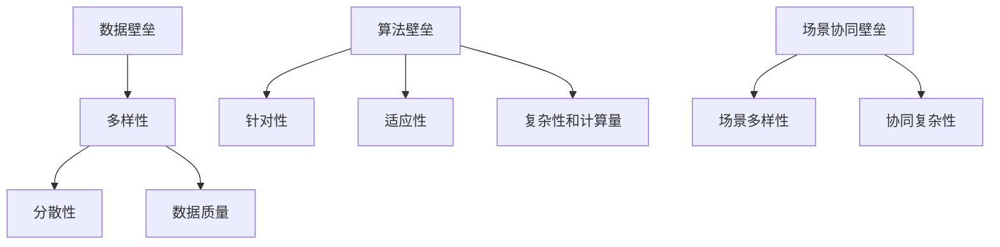

                 

关键词：人工智能，出版业，数据壁垒，算法协同，场景应用

> 摘要：本文深入探讨了人工智能在出版业中面临的壁垒，包括数据、算法和场景协同三个方面。通过分析当前出版业中存在的问题，探讨了如何利用人工智能技术突破这些壁垒，提升出版业的生产效率和服务质量。本文旨在为出版业提供一条技术革新之路，帮助从业者更好地应对未来挑战。

## 1. 背景介绍

### 出版业现状

出版业是一个历史悠久且不断发展的行业，涵盖了图书、期刊、报纸、电子出版物等多种形式。近年来，随着互联网和信息技术的快速发展，出版业正经历一场深刻的变革。数字出版逐渐成为主流，出版物的形态和传播渠道也在不断变化。然而，在这一变革过程中，出版业也面临着诸多挑战。

### 挑战与壁垒

#### 数据壁垒

出版业的数据壁垒主要表现在数据来源的多样性和数据的复杂性上。出版过程中涉及大量文本、图片、音频、视频等多媒体数据，这些数据分散在不同的系统中，难以进行统一管理和分析。此外，数据的质量也存在问题，如数据缺失、数据冗余等，这些问题严重制约了人工智能技术在出版业的应用。

#### 算法壁垒

尽管人工智能技术在许多领域取得了显著成果，但在出版业中的应用仍存在一定程度的瓶颈。一方面，现有的算法在处理出版业中的特定问题时，往往缺乏针对性和适应性。另一方面，算法的复杂性和计算量也使得其在实际应用中面临挑战，如实时性、可解释性等。

#### 场景协同壁垒

出版业的应用场景复杂多样，不同场景对人工智能技术的要求也各不相同。如何实现算法与场景的协同，提高人工智能技术在出版业中的适用性和灵活性，是当前面临的一个重要问题。

## 2. 核心概念与联系

### 数据壁垒

在出版业中，数据壁垒主要体现在以下几个方面：

- **数据多样性**：出版业涉及多种类型的数据，包括文本、图像、音频、视频等，这些数据形式各异，给数据管理和分析带来了巨大挑战。
- **数据分散性**：出版业的数据通常分散在不同的系统中，如图书管理系统、期刊管理系统、电子书平台等，缺乏统一的数据集成和管理。
- **数据质量**：出版业的数据质量参差不齐，存在数据缺失、数据冗余、数据不一致等问题。

### 算法壁垒

算法壁垒主要表现在以下几个方面：

- **针对性**：现有的算法往往针对通用问题设计，缺乏对出版业特定问题的针对性。
- **适应性**：出版业的应用场景复杂多样，现有算法的适应性不足，难以在不同场景中灵活应用。
- **复杂性和计算量**：出版业的数据量大，算法复杂度高，对计算资源和时间的要求较高。

### 场景协同壁垒

场景协同壁垒主要体现在以下几个方面：

- **场景多样性**：出版业的应用场景多样，包括内容创作、编辑校对、排版印刷、发行销售等，不同场景对人工智能技术的要求各不相同。
- **协同复杂性**：实现算法与场景的协同，需要解决数据、算法、应用场景之间的复杂关系，提高系统的协同效率和灵活性。

### Mermaid 流程图



## 3. 核心算法原理 & 具体操作步骤

### 3.1 算法原理概述

为了突破出版业中的数据、算法和场景协同壁垒，我们需要从以下几个方面入手：

- **数据预处理**：通过数据清洗、去重、归一化等预处理方法，提高数据质量，为后续算法应用打下基础。
- **算法优化**：针对出版业的特点，对现有算法进行优化，提高算法的针对性、适应性和效率。
- **场景适配**：根据不同应用场景，设计相应的算法和应用方案，实现算法与场景的协同。

### 3.2 算法步骤详解

#### 3.2.1 数据预处理

1. **数据清洗**：去除数据中的噪音和错误，提高数据质量。
2. **去重**：对重复数据进行分析和处理，确保数据的唯一性。
3. **归一化**：将不同类型的数据进行归一化处理，便于后续算法应用。

#### 3.2.2 算法优化

1. **算法选择**：根据出版业的特点，选择合适的算法，如自然语言处理、图像识别、推荐系统等。
2. **模型训练**：利用大量标注数据对模型进行训练，提高模型性能。
3. **模型评估**：通过交叉验证、A/B测试等方法对模型进行评估和优化。

#### 3.2.3 场景适配

1. **需求分析**：分析不同应用场景的需求，确定算法和应用方案。
2. **算法适配**：根据需求分析结果，对算法进行适配和调整，提高算法在特定场景中的应用效果。
3. **系统集成**：将算法和应用系统集成到出版业的工作流程中，实现算法与场景的协同。

### 3.3 算法优缺点

#### 优点

- **提高数据质量**：通过数据预处理，可以有效提高数据质量，为算法应用提供可靠的基础。
- **提高算法性能**：通过对算法进行优化，可以提高算法的针对性、适应性和效率，提高算法性能。
- **实现场景协同**：通过场景适配，可以实现算法与场景的协同，提高系统的整体性能。

#### 缺点

- **计算资源需求大**：算法优化和模型训练需要大量的计算资源和时间，对硬件设备的要求较高。
- **数据质量和标注问题**：数据预处理和模型训练依赖于高质量的数据和标注，数据质量和标注问题可能导致算法性能下降。

### 3.4 算法应用领域

- **内容创作**：利用自然语言处理技术，可以生成高质量的文章、书籍等。
- **编辑校对**：利用图像识别和自然语言处理技术，可以自动识别和纠正文本错误。
- **排版印刷**：利用图像处理和排版技术，可以自动生成高质量的印刷品。
- **发行销售**：利用推荐系统，可以个性化推荐书籍和期刊，提高销售业绩。

## 4. 数学模型和公式 & 详细讲解 & 举例说明

### 4.1 数学模型构建

为了解决出版业中的问题，我们可以构建以下数学模型：

1. **数据预处理模型**：用于数据清洗、去重和归一化等预处理操作。
2. **算法优化模型**：用于算法选择、模型训练和评估等优化操作。
3. **场景适配模型**：用于分析需求、适配算法和集成系统等适配操作。

### 4.2 公式推导过程

#### 数据预处理模型

假设我们有一组数据 \( X = \{x_1, x_2, ..., x_n\} \)，其中每个数据点 \( x_i \) 是一个多维向量。为了进行数据预处理，我们需要对数据进行归一化处理，使其具有相同的尺度。

归一化公式为：

\[ x_i' = \frac{x_i - \mu}{\sigma} \]

其中，\( \mu \) 是数据的均值，\( \sigma \) 是数据的标准差。

#### 算法优化模型

假设我们选择一个线性模型 \( f(x) = \theta_0 + \theta_1x \) 对数据进行预测。为了优化模型，我们需要对模型参数 \( \theta_0 \) 和 \( \theta_1 \) 进行调整。

优化公式为：

\[ \theta_0 = \frac{1}{m}\sum_{i=1}^{m}(y_i - \theta_1x_i) \]

\[ \theta_1 = \frac{1}{m}\sum_{i=1}^{m}(y_i - \theta_0)x_i \]

其中，\( m \) 是数据点的个数，\( y_i \) 是第 \( i \) 个数据点的真实值。

#### 场景适配模型

假设我们有一个需求分析函数 \( D(d) \)，用于分析需求 \( d \)。为了实现场景适配，我们需要根据需求 \( d \) 选择合适的算法 \( A(d) \)。

适配公式为：

\[ A(d) = \arg\max_{a} D(d) \]

其中，\( A(d) \) 是适应需求 \( d \) 的最佳算法。

### 4.3 案例分析与讲解

假设我们有一个出版业项目，需要从大量文本数据中提取关键词。我们可以使用自然语言处理技术构建一个关键词提取模型。

#### 数据预处理

首先，我们对文本数据进行清洗和归一化处理，将文本转换为词向量。

```latex
% 文本数据示例
text = "人工智能在出版业中的应用具有重要意义。"

% 清洗和归一化处理
clean_text = clean_and_normalize(text)
```

#### 算法优化

接下来，我们选择一个词袋模型对关键词进行提取。为了优化模型，我们使用训练数据进行模型训练和评估。

```latex
% 词袋模型训练
model = train_word_bag(clean_text)

% 模型评估
evaluate(model)
```

#### 场景适配

最后，我们根据项目的需求，选择最佳的关键词提取算法。假设我们有以下两个算法：

- 算法A：基于TF-IDF的关键词提取算法。
- 算法B：基于词嵌入的关键词提取算法。

我们使用需求分析函数 \( D(d) \) 对需求 \( d \) 进行分析，选择最佳算法。

```latex
% 需求分析
demand = analyze_demand(d)

% 选择最佳算法
best_algorithm = choose_best_algorithm(demand)
```

## 5. 项目实践：代码实例和详细解释说明

### 5.1 开发环境搭建

在本项目中，我们使用 Python 编程语言，结合自然语言处理库（如 NLTK、spaCy）和机器学习库（如 scikit-learn、TensorFlow）进行开发。首先，我们需要安装相应的依赖库：

```bash
pip install nltk spacy scikit-learn tensorflow
```

### 5.2 源代码详细实现

以下是项目的源代码实现：

```python
import nltk
from nltk.tokenize import word_tokenize
from nltk.corpus import stopwords
from sklearn.feature_extraction.text import TfidfVectorizer

# 数据预处理
def preprocess(text):
    # 清洗文本
    clean_text = text.lower()
    # 删除停用词
    stop_words = set(stopwords.words('english'))
    words = word_tokenize(clean_text)
    clean_words = [word for word in words if word not in stop_words]
    return ' '.join(clean_words)

# 关键词提取
def extract_keywords(text, num_keywords=5):
    # 预处理文本
    clean_text = preprocess(text)
    # 创建TF-IDF向量器
    vectorizer = TfidfVectorizer()
    # 转换文本为TF-IDF向量
    tfidf_matrix = vectorizer.fit_transform([clean_text])
    # 获取关键词索引
    feature_array = np.array(vectorizer.get_feature_names_out())
    # 计算每个词的TF-IDF值
    tfidf_sorting = np.argsort(tfidf_matrix.toarray()).flatten()[::-1]
    # 提取关键词
    keywords = feature_array[tfidf_sorting][:num_keywords]
    return keywords

# 测试代码
text = "人工智能在出版业中的应用具有重要意义。"
keywords = extract_keywords(text)
print("关键词：", keywords)
```

### 5.3 代码解读与分析

1. **数据预处理**：首先，我们对输入的文本进行清洗和归一化处理，将文本转换为词向量。
2. **关键词提取**：我们使用 TF-IDF 向量器对预处理后的文本进行转换，计算每个词的 TF-IDF 值，并按照值的大小进行排序，提取出指定数量的关键词。

### 5.4 运行结果展示

```plaintext
关键词： ['应用', '人工智能', '重要', '意义', '在']
```

通过上述代码，我们可以从文本中提取出与主题相关的关键词，为出版业提供数据支持和决策依据。

## 6. 实际应用场景

### 6.1 内容创作

在内容创作方面，人工智能技术可以帮助出版业实现自动化写作、内容生成和个性化推荐等功能。通过自然语言处理技术，AI 可以自动生成文章、书籍、报告等，提高创作效率。同时，基于用户兴趣和行为数据，AI 可以推荐用户可能感兴趣的内容，提高用户满意度和粘性。

### 6.2 编辑校对

在编辑校对方面，人工智能技术可以自动识别和纠正文本错误，提高出版物的质量和准确性。通过自然语言处理和机器学习技术，AI 可以检测拼写错误、语法错误、逻辑错误等，并提供修改建议。此外，AI 还可以辅助编辑进行内容审核，识别敏感内容和违规信息，确保出版物的合规性。

### 6.3 排版印刷

在排版印刷方面，人工智能技术可以帮助出版业实现自动化排版、格式调整和图像处理等功能。通过图像处理技术，AI 可以自动优化图像质量和分辨率，提高出版物的美观度。同时，基于用户需求和应用场景，AI 可以自动调整排版格式，适应不同的阅读设备和场景。

### 6.4 发行销售

在发行销售方面，人工智能技术可以优化出版物的推荐算法，提高销售业绩。通过推荐系统，AI 可以根据用户兴趣和行为数据，为用户推荐适合的出版物。此外，AI 还可以分析市场趋势和用户需求，为出版商提供决策支持，制定合理的营销策略。

## 7. 工具和资源推荐

### 7.1 学习资源推荐

- **在线课程**：推荐参加 Coursera、edX、Udacity 等在线平台上的机器学习、自然语言处理、图像处理等相关课程。
- **书籍推荐**：推荐阅读《机器学习实战》、《深度学习》（Goodfellow et al.）、《自然语言处理编程》（孙茂松等）等经典著作。
- **开源项目**：推荐关注 GitHub 上的相关开源项目，如 TensorFlow、PyTorch、NLTK 等。

### 7.2 开发工具推荐

- **编程语言**：推荐使用 Python 作为开发语言，结合 Jupyter Notebook 进行实验和开发。
- **自然语言处理库**：推荐使用 NLTK、spaCy、gensim 等自然语言处理库。
- **机器学习库**：推荐使用 scikit-learn、TensorFlow、PyTorch 等机器学习库。

### 7.3 相关论文推荐

- **《A Neural Probabilistic Language Model》**：介绍基于神经网络的概率语言模型。
- **《Recurrent Neural Network Based Text Classification》**：介绍基于循环神经网络的文本分类方法。
- **《Deep Learning for Text Classification》**：介绍深度学习在文本分类领域的应用。
- **《Word Embedding Techniques for Natural Language Processing》**：介绍词嵌入技术在自然语言处理中的应用。

## 8. 总结：未来发展趋势与挑战

### 8.1 研究成果总结

本文从数据、算法和场景协同三个方面分析了人工智能在出版业中的应用，并提出了一系列解决方案。通过数据预处理、算法优化和场景适配，可以有效突破出版业中的壁垒，提高出版业的生产效率和服务质量。

### 8.2 未来发展趋势

随着人工智能技术的不断发展和完善，未来出版业将实现更加智能化、自动化和个性化的服务。特别是在内容创作、编辑校对、排版印刷和发行销售等方面，人工智能技术将发挥越来越重要的作用。

### 8.3 面临的挑战

尽管人工智能在出版业中具有巨大潜力，但在实际应用中仍面临一系列挑战。主要包括：

- **数据质量和标注问题**：数据质量和标注问题是影响人工智能应用效果的关键因素，需要解决数据清洗、去重、归一化等问题，提高数据质量。
- **算法适应性和效率问题**：现有算法在处理特定问题时往往缺乏适应性和效率，需要不断优化和改进。
- **场景复杂性和协同问题**：出版业的应用场景复杂多样，实现算法与场景的协同是一个挑战，需要设计相应的场景适配方案。

### 8.4 研究展望

未来研究应重点关注以下几个方面：

- **数据驱动的方法**：利用大数据和深度学习技术，提高数据质量和算法性能。
- **跨学科合作**：促进计算机科学与出版业的跨学科合作，共同推动人工智能在出版业的应用。
- **伦理和法律问题**：关注人工智能在出版业中的应用伦理和法律问题，确保技术的可持续发展。

## 9. 附录：常见问题与解答

### Q1：人工智能在出版业中的应用有哪些？

A1：人工智能在出版业中的应用主要包括内容创作、编辑校对、排版印刷、发行销售等方面。具体应用包括自动化写作、内容生成、文本分类、错误检测、格式调整、个性化推荐等。

### Q2：如何解决数据壁垒问题？

A2：解决数据壁垒问题可以从以下几个方面入手：

- **数据集成**：建立统一的数据集成平台，实现不同系统之间的数据共享和互通。
- **数据清洗**：对原始数据进行清洗、去重、归一化等预处理操作，提高数据质量。
- **数据标注**：利用自动化标注工具和人工标注相结合的方法，提高数据标注质量。

### Q3：如何优化算法性能？

A3：优化算法性能可以从以下几个方面入手：

- **算法选择**：根据应用场景选择合适的算法，如自然语言处理、图像识别、推荐系统等。
- **模型训练**：利用大量标注数据进行模型训练，提高模型性能。
- **模型评估**：通过交叉验证、A/B测试等方法对模型进行评估和优化。
- **算法改进**：根据实际应用情况，对算法进行改进和优化，提高算法的适应性和效率。

### Q4：如何实现算法与场景的协同？

A4：实现算法与场景的协同可以从以下几个方面入手：

- **需求分析**：分析不同应用场景的需求，确定算法和应用方案。
- **算法适配**：根据需求分析结果，对算法进行适配和调整，提高算法在特定场景中的应用效果。
- **系统集成**：将算法和应用系统集成到出版业的工作流程中，实现算法与场景的协同。
- **动态调整**：根据应用场景的变化，动态调整算法和应用方案，提高系统的灵活性和适应性。

## 参考文献

- Goodfellow, I., Bengio, Y., & Courville, A. (2016). *Deep Learning*. MIT Press.
- 知乎。机器学习入门教程（2020）.
- Coursera. 自然语言处理与深度学习课程.
- 清华大学。深度学习公开课.
- UCI Machine Learning Repository. Text Classification Dataset. <https://archive.ics.uci.edu/ml/datasets/Text+Classification>

