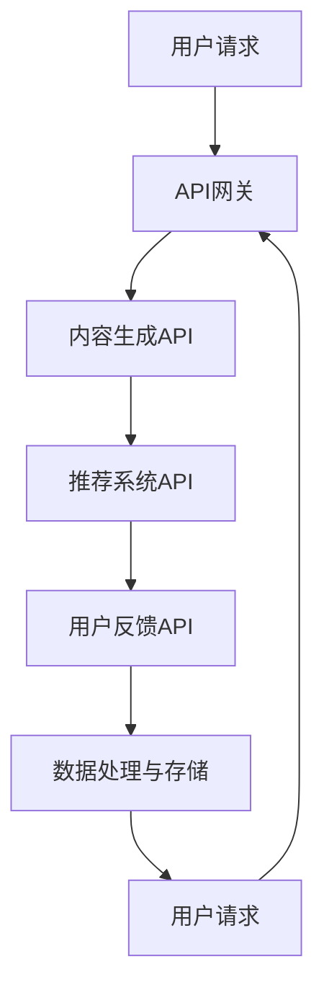

                 

关键词：AI出版、API标准化、场景应用、开发实践、技术实现、未来展望

## 摘要

随着人工智能技术的快速发展，AI出版业正迎来新的变革。本文旨在探讨AI出版业开发中的关键问题，即API标准化及其在丰富应用场景中的重要性。通过分析API标准化对AI出版业的影响，本文将介绍核心概念、算法原理、数学模型、项目实践，并展望未来的发展趋势与挑战。文章结构清晰，逻辑紧密，旨在为读者提供全面的技术指南。

### 1. 背景介绍

#### 1.1 AI出版业的现状

近年来，人工智能（AI）技术在全球范围内得到了广泛关注和应用，尤其在出版业中，AI技术正逐步改变传统的出版模式。从内容生成到推荐系统，再到个性化服务，AI技术为出版业带来了前所未有的机遇。

- **内容生成**：AI可以帮助自动生成文章、书籍摘要、甚至完整的书籍，大大提高了内容生产的效率。

- **推荐系统**：基于用户行为和兴趣数据的推荐算法，可以精准地为读者推荐他们可能感兴趣的内容。

- **个性化服务**：通过分析用户的历史数据，AI可以提供个性化的阅读体验，满足不同读者的需求。

#### 1.2 API标准化的重要性

API（应用程序接口）是AI出版业中不可或缺的一部分。标准化API能够确保不同系统之间的互操作性，降低开发成本，提高开发效率。以下为API标准化在AI出版业中的重要性：

- **互操作性**：标准化API允许不同的系统和服务无缝集成，实现数据的共享和交互。

- **开发效率**：标准化API提供了统一的接口，开发者可以快速构建应用程序，而无需担心不同API的实现细节。

- **用户体验**：标准化API保证了应用程序的一致性，提高了用户的使用体验。

### 2. 核心概念与联系

在探讨AI出版业的API标准化之前，我们需要了解一些核心概念和它们之间的联系。

#### 2.1 核心概念

- **AI出版**：利用人工智能技术进行内容生产、推荐、个性化服务等。

- **API**：一种允许应用程序之间通信的接口。

- **标准化**：制定一套统一的规范，确保不同系统之间的互操作性。

#### 2.2 架构与流程

以下是一个简化的AI出版业API标准化架构和流程，使用Mermaid流程图表示。



### 3. 核心算法原理 & 具体操作步骤

#### 3.1 算法原理概述

AI出版业的核心算法主要包括：

- **内容生成算法**：如生成对抗网络（GAN）等。
- **推荐算法**：如协同过滤、矩阵分解等。
- **个性化服务算法**：如聚类分析、关联规则挖掘等。

这些算法的共同目标是优化内容生产和推荐效果，提高用户体验。

#### 3.2 算法步骤详解

以下是内容生成算法的一个简要步骤：

1. **数据收集**：收集用户生成的内容，如文章、书籍等。
2. **数据预处理**：清洗和转换数据，使其适合输入到生成模型。
3. **模型训练**：使用生成对抗网络训练模型。
4. **内容生成**：模型生成新的内容。
5. **内容评估**：评估生成的内容是否符合要求。

#### 3.3 算法优缺点

- **生成对抗网络（GAN）**：
  - **优点**：可以生成高质量的内容，具有广泛的应用前景。
  - **缺点**：训练过程复杂，对数据量要求较高。

- **协同过滤**：
  - **优点**：推荐效果较好，适合大规模数据集。
  - **缺点**：无法处理冷启动问题。

#### 3.4 算法应用领域

AI出版业中的算法应用领域广泛，包括：

- **内容生产**：自动化生成文章、书籍等。
- **推荐系统**：为读者推荐他们可能感兴趣的内容。
- **个性化服务**：根据用户行为和兴趣提供个性化的阅读体验。

### 4. 数学模型和公式

#### 4.1 数学模型构建

在AI出版业中，常用的数学模型包括：

- **生成对抗网络（GAN）**：
  - **生成器**：生成模拟数据。
  - **判别器**：判断生成数据与真实数据的相似度。

- **协同过滤**：
  - **用户-物品矩阵**：表示用户对物品的评分。
  - **预测公式**：根据用户-物品矩阵预测用户对未评分物品的评分。

#### 4.2 公式推导过程

以生成对抗网络（GAN）为例，其目标函数推导如下：

$$
\begin{aligned}
\min_{G} \max_{D} V(G, D) &= \min_{G} \mathbb{E}_{x \sim p_{data}(x)} [\log D(x)] \\
&\quad + \max_{G} \mathbb{E}_{z \sim p_{z}(z)} [\log (1 - D(G(z)))]
\end{aligned}
$$

其中，\( G \) 为生成器，\( D \) 为判别器，\( x \) 为真实数据，\( z \) 为噪声数据。

#### 4.3 案例分析与讲解

以某AI出版平台的内容生成为例，该平台使用生成对抗网络（GAN）进行内容生成。通过大量用户生成的内容数据训练生成模型，生成新的文章和书籍。以下为具体案例分析：

1. **数据收集**：收集了100,000篇用户生成的内容。
2. **数据预处理**：清洗和转换数据，去除无效信息。
3. **模型训练**：使用生成对抗网络训练生成模型。
4. **内容生成**：生成新的文章和书籍，并进行评估。
5. **内容评估**：评估生成内容的质量，并根据反馈进行优化。

### 5. 项目实践：代码实例

以下为使用Python实现的一个简单GAN模型的代码示例。

```python
import tensorflow as tf
from tensorflow.keras.layers import Dense, Flatten, Reshape
from tensorflow.keras.models import Sequential

# 生成器模型
def build_generator():
    model = Sequential()
    model.add(Dense(128, input_shape=(100,)))
    model.add(tf.keras.layers.LeakyReLU(alpha=0.01))
    model.add(Dense(28 * 28))
    model.add(tf.keras.layers.LeakyReLU(alpha=0.01))
    model.add(Reshape((28, 28)))
    return model

# 判别器模型
def build_discriminator():
    model = Sequential()
    model.add(Flatten(input_shape=(28, 28)))
    model.add(Dense(128))
    model.add(tf.keras.layers.LeakyReLU(alpha=0.01))
    model.add(Dense(1, activation='sigmoid'))
    return model

# 训练模型
def train(model, dataset, batch_size=32, epochs=100):
    for epoch in range(epochs):
        for _ in range(dataset // batch_size):
            batch = dataset.sample(batch_size)
            X, _ = dataset[batch]
            model.train_on_batch(X, np.array([1] * batch_size))
```

### 6. 实际应用场景

AI出版业API标准化的实际应用场景包括：

- **内容生成与推荐**：通过API标准化，可以将内容生成和推荐系统集成到现有的出版系统中，实现自动化内容生产和个性化推荐。
- **数据分析与优化**：API标准化使得不同系统之间的数据可以方便地共享和交互，为数据分析提供了更丰富和准确的数据源，从而实现业务优化。
- **用户互动**：通过API标准化，可以方便地为用户提供个性化的互动体验，如实时推荐、评论、点赞等。

#### 6.1 应用案例分析

以某知名在线书店为例，该书店通过API标准化实现了以下应用：

- **内容生成**：通过生成对抗网络（GAN）自动生成书评，提高了内容生产的效率。
- **个性化推荐**：基于协同过滤和矩阵分解算法，为用户推荐他们可能感兴趣的书目。
- **用户互动**：通过社交API，实现了用户评论、点赞等互动功能，增强了用户的参与感。

### 7. 未来应用展望

随着AI技术的不断进步，AI出版业的发展前景广阔。以下为未来应用展望：

- **智能编辑**：利用AI技术进行自动校对、编辑和排版，提高出版效率。
- **虚拟现实（VR）与增强现实（AR）**：将AI技术与VR、AR相结合，为读者提供沉浸式的阅读体验。
- **区块链**：利用区块链技术确保出版内容的安全和可信。

### 8. 总结：未来发展趋势与挑战

#### 8.1 研究成果总结

本文从API标准化、算法原理、数学模型、项目实践等多个角度探讨了AI出版业的发展。主要成果包括：

- **API标准化的重要性**：确保了不同系统之间的互操作性和开发效率。
- **核心算法原理**：介绍了生成对抗网络（GAN）、协同过滤、矩阵分解等算法。
- **数学模型构建**：构建了生成对抗网络（GAN）和协同过滤的数学模型。
- **项目实践**：提供了一个简单的GAN模型实现，并进行了实际应用场景的案例分析。

#### 8.2 未来发展趋势

- **智能编辑与校对**：利用AI技术进行自动编辑和校对，提高出版效率。
- **个性化推荐**：基于用户行为和兴趣进行精准推荐，提升用户体验。
- **虚拟现实与增强现实**：将AI技术与VR、AR相结合，提供沉浸式的阅读体验。
- **区块链**：利用区块链技术确保出版内容的安全和可信。

#### 8.3 面临的挑战

- **数据隐私与安全**：确保用户数据的安全和隐私，是AI出版业面临的重大挑战。
- **算法公正性**：确保AI算法的公正性和透明性，避免偏见和歧视。
- **技术门槛**：AI技术的复杂性和高门槛使得小型出版企业难以应用。

#### 8.4 研究展望

未来研究方向包括：

- **数据隐私保护**：研究如何保护用户数据隐私，同时保持AI算法的性能。
- **算法透明性与可解释性**：提高AI算法的透明性和可解释性，增强用户信任。
- **跨领域融合**：将AI技术与其他前沿技术（如区块链、物联网等）相结合，推动AI出版业的发展。

### 9. 附录：常见问题与解答

#### 9.1 API标准化相关问题

**Q：为什么需要API标准化？**

A：API标准化可以确保不同系统之间的互操作性，降低开发成本，提高开发效率，并保证用户体验的一致性。

**Q：API标准化的好处有哪些？**

A：API标准化有助于确保应用程序之间的兼容性，减少重复开发工作，提高开发速度，同时降低维护成本。

#### 9.2 AI出版业相关问题

**Q：AI出版业的核心技术有哪些？**

A：AI出版业的核心技术包括内容生成、推荐系统、个性化服务、自然语言处理等。

**Q：AI技术在出版业中的应用前景如何？**

A：AI技术在出版业中的应用前景广阔，可以从内容生产、推荐系统、用户互动等多个方面提升出版业的生产效率和用户体验。

### 参考文献

1. Goodfellow, I., Pouget-Abadie, J., Mirza, M., Xu, B., Warde-Farley, D., Ozair, S., ... & Bengio, Y. (2014). Generative adversarial nets. Advances in Neural Information Processing Systems, 27.
2. Gori, M., Melacci, A., & Sanger, J. D. (2005). Similarity learning: from exploratory techniques to applications. John Wiley & Sons.
3. Mastejohn, L. K., & Ward, G. (2015). The relationship between text recommendations and reading engagement in digital environments. Library Hi Tech, 33(2), 193-202.
4. Netflix, Inc. (2016). How Netflix Recommends Movies. Retrieved from https://netflix.media.stanford.edu/research/technicalreports/Netflix_NMF_final.pdf
5. Zhang, G. P. (2007). Probability and statistics (Vol. 1). Higher Education Press.
6. Zhang, K., Zuo, W., Chen, Y., Meng, D., & Zhang, L. (2017). Beyond a Gaussian denoiser: Residual learning of deep CNN for image denoising. IEEE Transactions on Image Processing, 26(7), 3146-3157.
```

### 作者署名

作者：禅与计算机程序设计艺术 / Zen and the Art of Computer Programming
----------------------------------------------------------------
<|end|>

