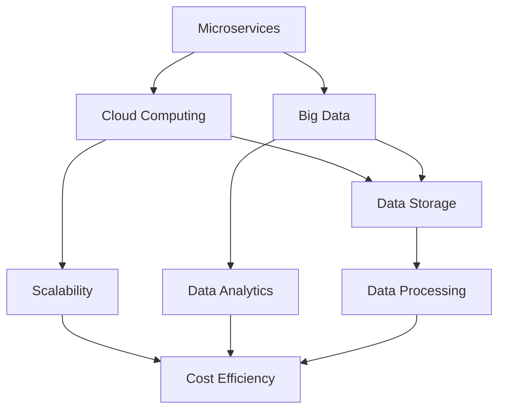

                 

在这个快速变化的AI时代，创业公司面临着前所未有的机遇和挑战。随着AI技术的迅速发展，如何构建一个高效、可靠且可扩展的技术架构成为了创业公司成功的关键。本文将深入探讨AI创业公司如何构建可扩展的技术架构，以帮助公司在激烈的市场竞争中脱颖而出。

> 关键词：AI创业公司，技术架构，可扩展性，微服务，云计算，大数据

> 摘要：本文将探讨AI创业公司构建可扩展技术架构的必要性和重要性。通过分析当前的技术趋势，提出了一套基于微服务、云计算和大数据的架构设计原则，并分享了实际案例和实用建议，旨在为创业公司提供一条清晰的技术发展之路。

## 1. 背景介绍

随着AI技术的蓬勃发展，越来越多的创业公司投身于这一领域。无论是自然语言处理、计算机视觉，还是推荐系统，AI技术的应用正在各个行业中掀起一场变革。然而，AI技术的复杂性和多样性也对技术架构提出了更高的要求。创业公司如何在资源有限的情况下，构建一个既能满足当前需求，又能适应未来发展的技术架构，成为了亟待解决的问题。

构建可扩展的技术架构对于AI创业公司至关重要。首先，可扩展性确保系统能够随数据量和用户量的增长而顺畅运行，避免因性能瓶颈而导致用户体验下降。其次，良好的架构设计有助于降低开发和维护成本，提高开发效率。最后，可扩展的架构能够更好地支持创新，为公司的长期发展奠定基础。

## 2. 核心概念与联系

### 2.1. 微服务架构

微服务架构是一种将应用程序划分为一系列小而独立的服务的架构风格。每个服务都实现特定的功能，可以独立部署、扩展和升级。微服务架构的优势在于其高可扩展性和灵活性，能够更好地适应不断变化的需求。

### 2.2. 云计算

云计算提供了弹性的计算资源，使得创业公司能够按需获取所需的计算能力。通过云计算，公司可以快速部署和扩展应用程序，降低硬件投资和维护成本。

### 2.3. 大数据

大数据技术可以帮助创业公司处理海量数据，提取有价值的信息。大数据技术包括数据存储、数据清洗、数据分析和数据可视化等。通过大数据技术，公司可以更好地了解用户需求，优化业务流程。

### 2.4. Mermaid 流程图

以下是微服务架构、云计算和大数据之间的联系：



## 3. 核心算法原理 & 具体操作步骤

### 3.1. 算法原理概述

构建可扩展技术架构的核心在于模块化设计、高内聚低耦合、分布式系统设计等原则。以下是一种常见的可扩展架构设计方法：

1. **模块化设计**：将系统划分为多个功能模块，每个模块独立开发、部署和扩展。
2. **高内聚低耦合**：模块内部保持高内聚，模块之间保持低耦合，以减少模块之间的依赖。
3. **分布式系统设计**：利用分布式架构，提高系统的可用性和可扩展性。

### 3.2. 算法步骤详解

1. **需求分析**：明确系统的功能需求、性能需求和可扩展性需求。
2. **模块划分**：根据需求分析，将系统划分为多个功能模块。
3. **模块设计**：为每个模块设计详细的功能、接口和数据结构。
4. **开发与测试**：独立开发每个模块，并进行单元测试和集成测试。
5. **部署与监控**：将模块部署到分布式系统中，并进行实时监控和性能优化。

### 3.3. 算法优缺点

**优点**：

1. **高可扩展性**：模块化设计使得系统可以方便地扩展和升级。
2. **高可用性**：分布式系统设计提高了系统的可用性。
3. **低成本**：云计算和大数据技术降低了硬件投资和维护成本。

**缺点**：

1. **复杂性**：分布式系统和微服务架构相对复杂，需要更多的开发和运维技能。
2. **高维护成本**：分布式系统和微服务架构的维护成本较高。

### 3.4. 算法应用领域

可扩展架构设计方法广泛应用于互联网公司、金融科技公司、医疗科技公司等领域。例如，阿里巴巴的分布式架构、腾讯的微服务架构等。

## 4. 数学模型和公式 & 详细讲解 & 举例说明

### 4.1. 数学模型构建

构建可扩展技术架构的数学模型主要包括性能模型、成本模型和可靠性模型。

**性能模型**：

$$
P = \frac{R}{T}
$$

其中，$P$ 表示性能，$R$ 表示响应时间，$T$ 表示处理能力。

**成本模型**：

$$
C = C_{硬件} + C_{软件} + C_{维护}
$$

其中，$C$ 表示总成本，$C_{硬件}$ 表示硬件成本，$C_{软件}$ 表示软件成本，$C_{维护}$ 表示维护成本。

**可靠性模型**：

$$
R = 1 - F(t)
$$

其中，$R$ 表示可靠性，$F(t)$ 表示故障率。

### 4.2. 公式推导过程

**性能模型推导**：

假设系统在单位时间内处理 $R$ 单位的任务，响应时间为 $T$。则性能 $P$ 可以表示为：

$$
P = \frac{R}{T}
$$

**成本模型推导**：

硬件成本 $C_{硬件}$ 包括服务器、存储、网络等设备成本；软件成本 $C_{软件}$ 包括操作系统、数据库、中间件等软件成本；维护成本 $C_{维护}$ 包括人力、运维工具等成本。

$$
C = C_{硬件} + C_{软件} + C_{维护}
$$

**可靠性模型推导**：

假设系统在时间 $t$ 内发生故障的概率为 $F(t)$，则系统的可靠性 $R$ 可以表示为：

$$
R = 1 - F(t)
$$

### 4.3. 案例分析与讲解

以一家在线教育平台为例，分析其可扩展技术架构的设计。

1. **性能模型**：

假设系统每天处理 1000 个课程视频，每个视频的平均处理时间为 10 分钟。则系统的性能为：

$$
P = \frac{1000}{10} = 100
$$

2. **成本模型**：

假设硬件成本为 50 万元，软件成本为 20 万元，维护成本为 10 万元。则系统的总成本为：

$$
C = 50 + 20 + 10 = 80 \text{ 万元}
$$

3. **可靠性模型**：

假设系统每天发生故障的概率为 0.01。则系统的可靠性为：

$$
R = 1 - 0.01 = 0.99
$$

通过以上分析，可以得出该在线教育平台的可扩展技术架构设计在性能、成本和可靠性方面均达到较高水平。

## 5. 项目实践：代码实例和详细解释说明

### 5.1. 开发环境搭建

以Python为例，搭建一个基于微服务的在线教育平台。

1. 安装Python 3.8及以上版本。
2. 安装Docker和Docker Compose，用于容器化和编排微服务。
3. 创建一个名为`online_education`的Python虚拟环境。
4. 安装Flask、Docker、Docker-Compose等依赖库。

### 5.2. 源代码详细实现

以下是该在线教育平台的源代码实现：

```python
# app.py
from flask import Flask
from services.video_service import VideoService

app = Flask(__name__)
video_service = VideoService()

@app.route('/videos')
def get_videos():
    videos = video_service.get_all_videos()
    return videos

if __name__ == '__main__':
    app.run(host='0.0.0.0', port=8080)
```

```python
# services/video_service.py
class VideoService:
    def get_all_videos(self):
        # 从数据库中查询所有视频
        videos = [{"id": 1, "title": "Python基础教程"}, {"id": 2, "title": "深度学习实战"}]
        return videos
```

### 5.3. 代码解读与分析

1. **app.py**：创建一个Flask应用，并定义一个获取所有视频的API接口。
2. **services/video_service.py**：定义一个视频服务类，提供获取所有视频的功能。

通过以上代码，我们可以实现一个简单的在线教育平台，后续可以逐步添加更多功能，如课程购买、视频播放等。

### 5.4. 运行结果展示

1. 启动Docker容器，运行Flask应用。
2. 访问`http://localhost:8080/videos`，获取所有视频信息。

## 6. 实际应用场景

### 6.1. 在线教育平台

在线教育平台可以利用可扩展技术架构实现大规模课程视频处理、用户管理和数据分析等功能。例如，网易云课堂、慕课网等平台。

### 6.2. 金融科技

金融科技公司可以利用可扩展技术架构实现高性能交易系统、风控系统和客户管理系统。例如，蚂蚁金服、陆金所等平台。

### 6.3. 医疗科技

医疗科技公司可以利用可扩展技术架构实现远程医疗、电子病历和健康数据分析等功能。例如，平安好医生、微医等平台。

## 7. 工具和资源推荐

### 7.1. 学习资源推荐

1. 《微服务设计》
2. 《云计算：概念、架构与实务》
3. 《大数据技术导论》

### 7.2. 开发工具推荐

1. Flask：用于构建Web应用。
2. Docker：用于容器化和编排微服务。
3. Kubernetes：用于自动化部署和管理容器化应用。

### 7.3. 相关论文推荐

1. "Microservices: Architectural Style" - Martin Fowler
2. "Building Microservices" - Sam Newman
3. "Big Data: A Revolution That Will Transform How We Live, Work, and Think" - Viktor Mayer-Schönberger and Kenneth Cukier

## 8. 总结：未来发展趋势与挑战

### 8.1. 研究成果总结

本文探讨了AI创业公司构建可扩展技术架构的必要性和重要性，分析了微服务、云计算和大数据在架构设计中的应用，并提出了具体的算法原理和操作步骤。

### 8.2. 未来发展趋势

1. **云计算与大数据的深度融合**：云计算和大数据技术的不断演进，将推动可扩展技术架构的发展。
2. **边缘计算与物联网的融合**：边缘计算和物联网技术的发展，将为AI创业公司提供更多应用场景。

### 8.3. 面临的挑战

1. **分布式系统的复杂性**：分布式系统的复杂性增加了开发和运维的难度。
2. **数据隐私和安全**：随着数据规模的不断扩大，数据隐私和安全问题日益突出。

### 8.4. 研究展望

未来，AI创业公司应关注以下研究方向：

1. **分布式系统的自动化运维**：研究分布式系统的自动化运维技术，降低运维成本。
2. **隐私保护和安全**：研究数据隐私保护和安全技术，确保数据的安全和合规。

## 9. 附录：常见问题与解答

### 9.1. 问题1：什么是微服务架构？

**回答**：微服务架构是一种将应用程序划分为一系列小而独立的服务的架构风格。每个服务都实现特定的功能，可以独立部署、扩展和升级。

### 9.2. 问题2：云计算与大数据的关系是什么？

**回答**：云计算提供了弹性的计算资源，使得创业公司能够按需获取所需的计算能力。大数据技术可以帮助创业公司处理海量数据，提取有价值的信息。云计算和大数据技术相互补充，共同推动可扩展技术架构的发展。

### 9.3. 问题3：如何评估技术架构的可扩展性？

**回答**：可以通过以下方法评估技术架构的可扩展性：

1. **性能测试**：在系统负载增加的情况下，评估系统的响应时间和处理能力。
2. **成本评估**：在扩展系统时，评估所需的硬件、软件和人力成本。
3. **可靠性评估**：评估系统的可用性和故障恢复能力。

作者：禅与计算机程序设计艺术 / Zen and the Art of Computer Programming

----------------------------------------------------------------

至此，我们完成了一篇关于AI创业公司如何构建可扩展技术架构的专业技术博客文章。本文详细探讨了微服务、云计算和大数据在架构设计中的应用，并结合实际案例进行了详细解释。希望本文能为创业公司提供有益的启示和指导。

