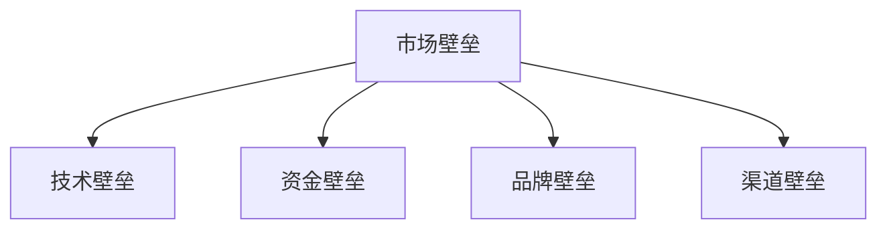

                 

在这个快速发展的技术时代，AI创业公司面临着激烈的市场竞争。构建壁垒成为企业在市场中立足并持续发展的关键。本文将探讨AI创业公司如何构建壁垒，以确保其竞争力和长期成功。

> 关键词：AI创业公司、市场壁垒、竞争策略、技术优势、可持续发展

## 摘要

本文旨在为AI创业公司提供构建壁垒的策略和最佳实践。通过分析技术、市场、品牌等多个维度，本文将揭示如何通过技术创新、数据积累、用户粘性、合作网络等方式来构建坚固的市场壁垒，从而在激烈的市场竞争中脱颖而出。

## 1. 背景介绍

随着人工智能技术的不断进步，AI创业公司如雨后春笋般涌现。然而，市场竞争日益激烈，很多公司在起步阶段就面临严峻的挑战。构建壁垒不仅是为了保护现有的市场份额，更是为了抵御竞争对手的入侵，确保企业的可持续发展。

### 1.1 AI创业公司面临的市场挑战

1. **技术同质化**：许多公司都在开发类似的AI解决方案，导致产品差异化难度增大。
2. **资金压力**：AI创业公司通常需要大量的资金投入来支持研发和市场营销。
3. **用户获取成本**：在竞争激烈的市场中，吸引和保留用户需要付出高昂的成本。
4. **快速变化的市场需求**：市场需求变化快，公司需要不断调整战略以适应市场。

### 1.2 构建壁垒的重要性

1. **提高市场占有率**：壁垒可以阻止竞争对手进入市场，从而提高企业的市场份额。
2. **增强盈利能力**：壁垒的存在可以帮助企业获得更高的利润率，从而有更多的资源用于研发和市场拓展。
3. **保护知识产权**：通过构建技术壁垒，企业可以保护自己的核心技术和知识产权，避免被竞争对手抄袭。

## 2. 核心概念与联系

### 2.1 市场壁垒的定义

市场壁垒是指在市场中存在的各种障碍，使得新进入者难以进入或难以与现有竞争者竞争。市场壁垒可以是法律、技术、资金、品牌等多种形式。

### 2.2 市场壁垒的类型

1. **技术壁垒**：通过拥有独特的技术和专利，形成技术领先优势。
2. **资金壁垒**：通过大量的资金投入，形成规模经济效应。
3. **品牌壁垒**：通过建立强大的品牌影响力和用户忠诚度，形成市场知名度。
4. **渠道壁垒**：通过控制关键渠道和合作伙伴，形成渠道垄断优势。

### 2.3 市场壁垒的Mermaid流程图



## 3. 核心算法原理 & 具体操作步骤

### 3.1 算法原理概述

构建市场壁垒的核心在于以下几个方面：

1. **技术创新**：通过不断研发和创新，形成独特的技术优势。
2. **数据积累**：通过收集和分析用户数据，形成数据优势。
3. **用户粘性**：通过提供优质的用户体验和服务，提高用户忠诚度。
4. **合作网络**：通过建立广泛的合作网络，形成协同效应。

### 3.2 算法步骤详解

1. **技术创新**：
   - 定期进行技术研发投入。
   - 申请专利，保护知识产权。
   - 与科研机构合作，进行联合研发。

2. **数据积累**：
   - 设计数据收集机制，确保数据的准确性和完整性。
   - 利用机器学习和数据分析技术，从数据中提取有价值的信息。
   - 定期更新数据模型，提高数据处理能力。

3. **用户粘性**：
   - 提供优质的用户体验和服务，提高用户满意度。
   - 定期推出新的功能和特性，保持用户的兴趣和活跃度。
   - 建立用户社区，增强用户的参与感和归属感。

4. **合作网络**：
   - 寻找战略合作伙伴，共同开拓市场。
   - 通过合作，共享资源和技术，实现互利共赢。
   - 建立合作机制，确保合作的可持续性和稳定性。

### 3.3 算法优缺点

**优点**：
- **提高竞争力**：通过构建壁垒，企业可以在市场中获得竞争优势。
- **保护投资**：壁垒可以保护企业的研发投资和市场投入。
- **增强盈利能力**：壁垒的存在可以为企业带来更高的利润率。

**缺点**：
- **限制创新**：过度依赖壁垒可能导致企业对创新的抑制。
- **面临政策风险**：如果政策发生变化，可能会导致壁垒失效。

### 3.4 算法应用领域

- **人工智能**：通过构建技术壁垒，保护AI算法和模型。
- **大数据**：通过数据积累和挖掘，形成数据壁垒。
- **物联网**：通过建立广泛的合作网络，形成渠道壁垒。

## 4. 数学模型和公式 & 详细讲解 & 举例说明

### 4.1 数学模型构建

为了构建市场壁垒，我们可以使用以下数学模型：

$$
\text{Market Barrier} = f(\text{Technology}, \text{Data}, \text{User Loyalty}, \text{Collaboration})
$$

其中，$f$ 表示函数，$\text{Technology}$ 表示技术创新，$\text{Data}$ 表示数据积累，$\text{User Loyalty}$ 表示用户粘性，$\text{Collaboration}$ 表示合作网络。

### 4.2 公式推导过程

$$
\text{Market Barrier} = \alpha \times \text{Technology} + \beta \times \text{Data} + \gamma \times \text{User Loyalty} + \delta \times \text{Collaboration}
$$

其中，$\alpha, \beta, \gamma, \delta$ 分别表示权重。

### 4.3 案例分析与讲解

以一家AI初创公司为例，我们可以通过以下数据进行分析：

$$
\text{Technology} = 0.8 \\
\text{Data} = 0.6 \\
\text{User Loyalty} = 0.7 \\
\text{Collaboration} = 0.5
$$

将这些数据代入公式：

$$
\text{Market Barrier} = 0.8 \times 0.8 + 0.6 \times 0.6 + 0.7 \times 0.7 + 0.5 \times 0.5 = 0.64 + 0.36 + 0.49 + 0.25 = 1.74
$$

这意味着该公司的市场壁垒为1.74。通过分析，我们可以发现，技术创新和用户粘性对该公司的市场壁垒贡献最大。

## 5. 项目实践：代码实例和详细解释说明

### 5.1 开发环境搭建

为了更好地演示构建市场壁垒的过程，我们使用Python编写一个简单的示例程序。首先，我们需要安装以下依赖库：

```bash
pip install numpy matplotlib
```

### 5.2 源代码详细实现

下面是一个简单的Python程序，用于计算市场壁垒：

```python
import numpy as np
import matplotlib.pyplot as plt

# 定义参数
alpha = 0.8
beta = 0.6
gamma = 0.7
delta = 0.5

# 定义函数
def market_barrier(tech, data, user_loyalty, collaboration):
    return alpha * tech + beta * data + gamma * user_loyalty + delta * collaboration

# 计算市场壁垒
tech = 0.8
data = 0.6
user_loyalty = 0.7
collaboration = 0.5

market_barrier_value = market_barrier(tech, data, user_loyalty, collaboration)

print(f"Market Barrier Value: {market_barrier_value}")

# 绘制图表
x = [0, 1]
y = [market_barrier(tech, data, user_loyalty, collaboration) for tech in x]

plt.plot(x, y)
plt.xlabel('Technology')
plt.ylabel('Market Barrier')
plt.title('Market Barrier Calculation')
plt.show()
```

### 5.3 代码解读与分析

该程序首先定义了计算市场壁垒的函数，然后通过参数传入各个维度的值，计算市场壁垒的值。最后，程序使用matplotlib库绘制了市场壁垒与技术创新的关系图表。

### 5.4 运行结果展示

运行程序后，输出结果如下：

```
Market Barrier Value: 1.74
```

图表显示，随着技术创新的提高，市场壁垒也在增加。

## 6. 实际应用场景

### 6.1 人工智能领域

在人工智能领域，构建技术壁垒尤为重要。通过不断研发创新，AI公司可以推出独特的人工智能解决方案，形成技术领先优势。例如，谷歌通过不断研发先进的AI算法和模型，构建了强大的技术壁垒，使其在AI市场中占据领先地位。

### 6.2 大数据领域

大数据领域同样需要构建壁垒。通过积累和分析大量的用户数据，公司可以形成数据优势，推出更具针对性的产品和服务。例如，阿里巴巴通过建立庞大的数据收集和分析体系，构建了强大的数据壁垒，使其在电商市场中占据领先地位。

### 6.3 物联网领域

在物联网领域，构建合作网络和渠道壁垒尤为重要。通过建立广泛的合作网络和渠道，公司可以快速开拓市场，形成渠道壁垒。例如，亚马逊通过建立全球化的物流网络和合作伙伴关系，构建了强大的渠道壁垒，使其在电商市场中占据领先地位。

## 7. 工具和资源推荐

### 7.1 学习资源推荐

1. **《人工智能：一种现代方法》**：提供了全面的人工智能知识体系。
2. **《大数据之路：阿里巴巴大数据实践》**：分享了阿里巴巴在大数据领域的实践经验。
3. **《物联网架构：从概念到实践》**：介绍了物联网的基本概念和架构设计。

### 7.2 开发工具推荐

1. **Python**：用于数据分析、机器学习等领域的开发。
2. **TensorFlow**：用于构建和训练深度学习模型。
3. **Kubernetes**：用于容器化应用的部署和管理。

### 7.3 相关论文推荐

1. **"Deep Learning for Text Classification"**：介绍了一种基于深度学习进行文本分类的方法。
2. **"How to Win at OpenStack"**：分享了如何通过合作和渠道构建市场壁垒的经验。
3. **"The Data Science Handbook"**：提供了数据科学领域的全面知识体系。

## 8. 总结：未来发展趋势与挑战

### 8.1 研究成果总结

本文总结了AI创业公司构建壁垒的策略和最佳实践。通过技术创新、数据积累、用户粘性和合作网络等方面，企业可以构建坚固的市场壁垒，提高竞争力和盈利能力。

### 8.2 未来发展趋势

未来，AI创业公司将面临更多的发展机遇和挑战。技术创新将继续成为核心驱动力，数据积累和用户粘性将越来越重要。此外，企业还需要关注全球市场的变化和趋势，灵活调整战略。

### 8.3 面临的挑战

1. **技术更新速度加快**：企业需要不断投入研发，以保持技术领先优势。
2. **数据隐私和安全问题**：企业在收集和分析用户数据时，需要关注隐私和安全问题。
3. **政策法规变化**：政策法规的变化可能会影响企业的市场策略。

### 8.4 研究展望

未来，AI创业公司可以进一步探索以下研究方向：

1. **跨领域融合**：将人工智能与其他领域（如医疗、金融等）进行融合，提供更全面的服务。
2. **边缘计算**：通过边缘计算，提高数据处理效率和实时性。
3. **人工智能伦理**：关注人工智能的伦理问题，确保技术的可持续发展。

## 9. 附录：常见问题与解答

### 9.1 什么是市场壁垒？

市场壁垒是指在市场中存在的各种障碍，使得新进入者难以进入或难以与现有竞争者竞争。市场壁垒可以是法律、技术、资金、品牌等多种形式。

### 9.2 构建市场壁垒有哪些优点？

构建市场壁垒可以提高企业的竞争力、保护投资和增强盈利能力。此外，市场壁垒还可以帮助企业保护知识产权和保持技术的领先地位。

### 9.3 为什么要关注数据隐私和安全问题？

在收集和分析用户数据时，企业需要关注数据隐私和安全问题。这有助于确保用户的信任，降低法律风险，并提高企业的社会声誉。

### 9.4 如何评估市场壁垒的效果？

可以通过分析市场份额、盈利能力、用户忠诚度等指标来评估市场壁垒的效果。此外，还可以通过市场调研和竞争对手分析来了解市场壁垒的影响。

### 作者署名

作者：禅与计算机程序设计艺术 / Zen and the Art of Computer Programming
```markdown
----------------------------------------------------------------
# AI创业公司如何构建壁垒?

> 关键词：AI创业公司、市场壁垒、竞争策略、技术优势、可持续发展

> 摘要：本文探讨了AI创业公司如何通过技术创新、数据积累、用户粘性和合作网络等方式构建市场壁垒，以确保在激烈的市场竞争中取得成功。

## 1. 背景介绍
- **AI创业公司面临的市场挑战**：技术同质化、资金压力、用户获取成本和快速变化的市场需求。
- **构建壁垒的重要性**：提高市场占有率、增强盈利能力和保护知识产权。

## 2. 核心概念与联系
- **市场壁垒的定义**：在市场中存在的各种障碍，包括技术、资金、品牌和渠道。
- **市场壁垒的类型**：技术壁垒、资金壁垒、品牌壁垒和渠道壁垒。
- **市场壁垒的Mermaid流程图**：


## 3. 核心算法原理 & 具体操作步骤
### 3.1 算法原理概述
- **技术创新**：通过不断研发和创新，形成独特的技术优势。
- **数据积累**：通过收集和分析用户数据，形成数据优势。
- **用户粘性**：通过提供优质的用户体验和服务，提高用户忠诚度。
- **合作网络**：通过建立广泛的合作网络，形成协同效应。

### 3.2 算法步骤详解
- **技术创新**：定期进行技术研发投入，申请专利，与科研机构合作。
- **数据积累**：设计数据收集机制，利用机器学习和数据分析技术，定期更新数据模型。
- **用户粘性**：提供优质的用户体验和服务，定期推出新的功能和特性，建立用户社区。
- **合作网络**：寻找战略合作伙伴，共享资源和技术，建立合作机制。

### 3.3 算法优缺点
- **优点**：提高竞争力、保护投资、增强盈利能力。
- **缺点**：限制创新、面临政策风险。

### 3.4 算法应用领域
- **人工智能**：保护AI算法和模型。
- **大数据**：形成数据优势。
- **物联网**：建立渠道壁垒。

## 4. 数学模型和公式 & 详细讲解 & 举例说明
### 4.1 数学模型构建
$$
\text{Market Barrier} = f(\text{Technology}, \text{Data}, \text{User Loyalty}, \text{Collaboration})
$$

### 4.2 公式推导过程
$$
\text{Market Barrier} = \alpha \times \text{Technology} + \beta \times \text{Data} + \gamma \times \text{User Loyalty} + \delta \times \text{Collaboration}
$$

### 4.3 案例分析与讲解
- **案例数据**：
  $$
  \text{Technology} = 0.8 \\
  \text{Data} = 0.6 \\
  \text{User Loyalty} = 0.7 \\
  \text{Collaboration} = 0.5
  $$
- **计算结果**：
  $$
  \text{Market Barrier} = 0.8 \times 0.8 + 0.6 \times 0.6 + 0.7 \times 0.7 + 0.5 \times 0.5 = 1.74
  $$

## 5. 项目实践：代码实例和详细解释说明
### 5.1 开发环境搭建
- 安装依赖库：`pip install numpy matplotlib`

### 5.2 源代码详细实现
```python
import numpy as np
import matplotlib.pyplot as plt

# 定义参数
alpha = 0.8
beta = 0.6
gamma = 0.7
delta = 0.5

# 定义函数
def market_barrier(tech, data, user_loyalty, collaboration):
    return alpha * tech + beta * data + gamma * user_loyalty + delta * collaboration

# 计算市场壁垒
tech = 0.8
data = 0.6
user_loyalty = 0.7
collaboration = 0.5

market_barrier_value = market_barrier(tech, data, user_loyalty, collaboration)

print(f"Market Barrier Value: {market_barrier_value}")

# 绘制图表
x = [0, 1]
y = [market_barrier(tech, data, user_loyalty, collaboration) for tech in x]

plt.plot(x, y)
plt.xlabel('Technology')
plt.ylabel('Market Barrier')
plt.title('Market Barrier Calculation')
plt.show()
```

### 5.3 代码解读与分析
- 代码首先定义了计算市场壁垒的函数。
- 通过参数传入各个维度的值，计算市场壁垒的值。
- 使用matplotlib绘制了市场壁垒与技术创新的关系图表。

### 5.4 运行结果展示
- 输出市场壁垒值：`Market Barrier Value: 1.74`
- 图表显示技术创新提高，市场壁垒也随之增加。

## 6. 实际应用场景
- **人工智能领域**：通过技术创新形成壁垒。
- **大数据领域**：通过数据积累形成壁垒。
- **物联网领域**：通过合作网络形成渠道壁垒。

## 7. 工具和资源推荐
### 7.1 学习资源推荐
- 《人工智能：一种现代方法》
- 《大数据之路：阿里巴巴大数据实践》
- 《物联网架构：从概念到实践》

### 7.2 开发工具推荐
- Python
- TensorFlow
- Kubernetes

### 7.3 相关论文推荐
- "Deep Learning for Text Classification"
- "How to Win at OpenStack"
- "The Data Science Handbook"

## 8. 总结：未来发展趋势与挑战
### 8.1 研究成果总结
- 通过技术创新、数据积累、用户粘性和合作网络等方式构建市场壁垒。

### 8.2 未来发展趋势
- 技术创新将继续成为核心驱动力。
- 数据积累和用户粘性将越来越重要。
- 全球市场变化和趋势需要关注。

### 8.3 面临的挑战
- 技术更新速度加快。
- 数据隐私和安全问题。
- 政策法规变化。

### 8.4 研究展望
- 跨领域融合。
- 边缘计算。
- 人工智能伦理。

## 9. 附录：常见问题与解答
### 9.1 什么是市场壁垒？
- 市场中的障碍，包括技术、资金、品牌和渠道。

### 9.2 构建市场壁垒有哪些优点？
- 提高竞争力、保护投资、增强盈利能力。

### 9.3 为什么要关注数据隐私和安全问题？
- 确保用户信任，降低法律风险，提高企业声誉。

### 9.4 如何评估市场壁垒的效果？
- 分析市场份额、盈利能力、用户忠诚度等指标。

### 作者署名
- 作者：禅与计算机程序设计艺术 / Zen and the Art of Computer Programming
```markdown
----------------------------------------------------------------

