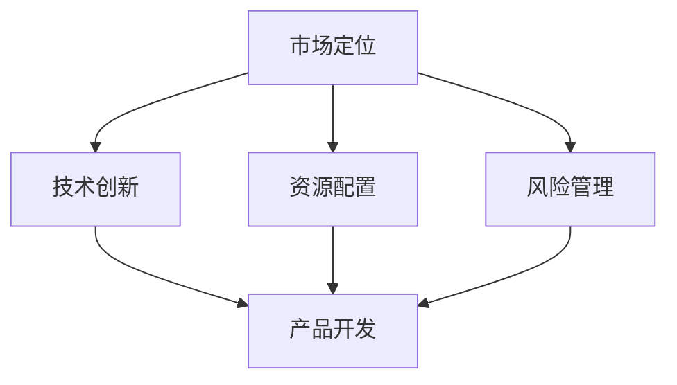

                 

在当今快速变化的技术时代，人工智能（AI）正成为驱动创新和增长的关键力量。对于AI创业公司来说，如何制定有效的战略规划，以确保公司在激烈的市场竞争中脱颖而出，成为了至关重要的课题。本文将探讨AI创业公司进行战略规划的方法、关键步骤和成功要素。

## 关键词
- AI创业公司
- 战略规划
- 市场定位
- 技术创新
- 资源配置
- 风险管理

## 摘要
本文旨在为AI创业公司提供战略规划的指导，通过分析市场环境、技术趋势、资源需求和风险管理等方面，帮助创业者制定清晰的战略目标，并采取相应的策略实现公司的长期发展。

## 1. 背景介绍
AI技术的迅猛发展为各行各业带来了前所未有的变革机遇。AI创业公司在这一背景下应运而生，但同时也面临着诸多挑战。市场的不确定性、技术的不成熟以及资金链的稳定性等问题，都是初创公司必须面对的挑战。因此，制定有效的战略规划，对于确保公司在竞争激烈的市场中生存并发展壮大至关重要。

## 2. 核心概念与联系
在战略规划中，理解以下几个核心概念是至关重要的：

- **市场定位**：确定公司目标市场，包括目标客户群体和市场需求。
- **技术创新**：围绕核心技术进行研发，以保持竞争力。
- **资源配置**：合理安排人力、资金和其他资源，支持公司战略目标的实现。
- **风险管理**：识别潜在风险，并采取预防措施降低风险对公司的影响。

以下是一个Mermaid流程图，展示了这些核心概念之间的联系：



## 3. 核心算法原理 & 具体操作步骤

### 3.1 算法原理概述
战略规划可以被视为一种算法，它通过一系列步骤和决策，帮助公司实现既定的目标。这个算法的基本原理是：

1. **目标设定**：明确公司的长期和短期目标。
2. **环境分析**：评估外部市场环境，包括竞争对手、市场趋势等。
3. **资源评估**：分析公司内部资源，如资金、技术、人才等。
4. **策略制定**：基于目标和环境分析，制定实现目标的策略。
5. **执行与监控**：执行策略，并通过定期监控调整策略。

### 3.2 算法步骤详解

#### 3.2.1 目标设定
目标设定是战略规划的第一步。公司需要明确长期愿景和短期目标。长期目标通常包括市场领导地位、技术创新等，而短期目标则更加具体，如年度收入目标、产品上市时间表等。

#### 3.2.2 环境分析
环境分析是了解公司所处的外部市场环境。这包括：

- 市场趋势：了解市场的增长速度、需求变化等。
- 竞争对手：分析竞争对手的产品、市场定位、市场份额等。
- 技术趋势：关注最新的技术动态，了解哪些技术可能对公司产生重大影响。

#### 3.2.3 资源评估
资源评估是了解公司内部资源的过程，包括：

- 资金：评估公司的资金状况，包括现金流、投资计划等。
- 技术：评估公司的技术实力，包括核心专利、技术团队等。
- 人才：评估公司的人才结构，包括关键岗位的人员配置等。

#### 3.2.4 策略制定
策略制定是基于目标和环境分析的结果，制定实现目标的策略。这包括：

- 市场策略：确定目标市场，制定市场进入策略。
- 产品策略：确定产品定位、功能、价格等。
- 营销策略：制定营销计划，包括广告、公关、社交媒体等。

#### 3.2.5 执行与监控
执行与监控是确保策略有效实施的过程。这包括：

- 制定执行计划：明确每项任务的负责人、时间表等。
- 定期监控：通过KPI等指标监控执行进度，并根据实际情况进行调整。

### 3.3 算法优缺点

#### 优点
- 系统性：战略规划提供了一个系统的方法，确保所有决策都是基于对整个公司状况的全面考虑。
- 可预测性：通过明确的目标和策略，公司可以更好地预测未来趋势，并做出相应的准备。

#### 缺点
- 时效性：市场和技术环境变化迅速，战略规划可能无法及时适应这些变化。
- 复杂性：战略规划涉及多个方面，需要大量的时间和资源。

### 3.4 算法应用领域
战略规划算法在AI创业公司中具有广泛的应用，包括：

- **市场进入策略**：帮助公司选择最佳的市场进入策略，如并购、合作、独立开发等。
- **产品开发计划**：指导产品开发的每个阶段，确保产品符合市场需求和公司战略。
- **资源分配**：优化公司资源，确保资源得到最有效的利用。

## 4. 数学模型和公式 & 详细讲解 & 举例说明

### 4.1 数学模型构建
战略规划中的数学模型通常涉及以下方面：

- **目标函数**：定义公司追求的目标，如最大化利润、最小化成本等。
- **决策变量**：影响目标函数的因素，如产品定价、资源分配、市场策略等。
- **约束条件**：限制决策变量取值的条件，如预算限制、技术能力限制等。

以下是一个简单的数学模型示例：

$$
\text{Maximize } Z = c_1x_1 + c_2x_2 + \ldots + c_nx_n
$$

$$
\text{subject to } a_{11}x_1 + a_{12}x_2 + \ldots + a_{1n}x_n \leq b_1
$$

$$
a_{21}x_1 + a_{22}x_2 + \ldots + a_{2n}x_n \leq b_2
$$

$$
\ldots
$$

$$
a_{m1}x_1 + a_{m2}x_2 + \ldots + a_{mn}x_n \leq b_m
$$

$$
x_1, x_2, \ldots, x_n \geq 0
$$

### 4.2 公式推导过程
以上模型是一个线性规划问题，可以通过单纯形法求解。单纯形法的推导过程如下：

1. **初始可行解**：选择决策变量的一个初始组合，使得所有约束条件都得到满足。
2. **迭代过程**：根据目标函数的斜率，找到当前可行解的一个改进方向，并更新可行解。
3. **停止条件**：当无法进一步改进可行解时，停止迭代。

### 4.3 案例分析与讲解
假设一家AI创业公司希望优化其资源分配，以最大化利润。公司有三种产品A、B、C，每种产品所需的资源不同，其目标函数为：

$$
\text{Maximize } Z = 100x_1 + 200x_2 + 300x_3
$$

约束条件为：

$$
2x_1 + 3x_2 + x_3 \leq 100
$$

$$
4x_1 + 5x_2 + 2x_3 \leq 150
$$

$$
x_1, x_2, x_3 \geq 0
$$

通过线性规划求解，可以得到最优解为 $x_1 = 25, x_2 = 10, x_3 = 5$，最大利润为 $Z = 8750$。

## 5. 项目实践：代码实例和详细解释说明

### 5.1 开发环境搭建
为了进行战略规划的实践，我们需要搭建一个合适的技术环境。以下是一个基本的开发环境搭建步骤：

1. 安装Python环境，版本3.8及以上。
2. 安装线性规划求解器，如scipy。
3. 安装可视化工具，如matplotlib。

### 5.2 源代码详细实现
以下是一个简单的Python代码实例，用于求解线性规划问题：

```python
import numpy as np
from scipy.optimize import linprog

# 目标函数系数
c = [-100, -200, -300]

# 约束条件系数
A = [[2, 3, 1], [4, 5, 2]]

# 约束条件右侧值
b = [100, 150]

# 边界条件
x0_bounds = (0, None)
x1_bounds = (0, None)
x2_bounds = (0, None)

# 求解线性规划问题
result = linprog(c, A_ub=A, b_ub=b, bounds=[x0_bounds, x1_bounds, x2_bounds], method='highs')

# 输出结果
print("最优解：", result.x)
print("最大利润：", -result.fun)
```

### 5.3 代码解读与分析
上述代码使用scipy的linprog函数求解线性规划问题。其中：

- `c` 为目标函数系数。
- `A` 和 `b` 为约束条件系数和右侧值。
- `bounds` 定义了决策变量的边界条件。

运行代码后，我们可以得到最优解和最大利润。

## 6. 实际应用场景

### 6.1 市场进入策略
在进入新市场时，AI创业公司可以采用以下策略：

- **市场细分**：根据市场需求，将市场划分为不同的细分市场。
- **定位策略**：选择一个或多个细分市场，制定针对性的产品和服务策略。
- **差异化营销**：通过提供独特的产品或服务，吸引目标客户。

### 6.2 产品开发计划
在产品开发过程中，AI创业公司可以采用以下策略：

- **快速迭代**：通过快速迭代，不断优化产品，以适应市场变化。
- **用户反馈**：收集用户反馈，将用户需求融入产品开发中。
- **技术创新**：持续投资于技术创新，以保持产品竞争力。

### 6.3 资源配置
在资源配置方面，AI创业公司可以采用以下策略：

- **优先级排序**：根据公司战略目标，确定各项任务的优先级。
- **预算分配**：合理分配预算，确保关键项目得到足够支持。
- **团队建设**：招聘和培养关键人才，支持公司长期发展。

### 6.4 未来应用展望
随着AI技术的不断进步，AI创业公司的战略规划也将面临新的挑战和机遇。未来，AI创业公司可以关注以下领域：

- **自动化决策**：通过AI技术，实现自动化决策，提高运营效率。
- **个性化服务**：利用AI技术，提供更加个性化的产品和服务。
- **跨界合作**：与其他行业进行跨界合作，开拓新的市场空间。

## 7. 工具和资源推荐

### 7.1 学习资源推荐
- **书籍**：《人工智能：一种现代方法》
- **在线课程**：Coursera上的《深度学习》课程
- **学术论文库**：ArXiv、Google Scholar

### 7.2 开发工具推荐
- **编程语言**：Python、JavaScript
- **开发框架**：TensorFlow、PyTorch
- **数据可视化**：Matplotlib、D3.js

### 7.3 相关论文推荐
- "Deep Learning for Computer Vision: A Review"
- "Reinforcement Learning: An Introduction"
- "Generative Adversarial Networks: An Overview"

## 8. 总结：未来发展趋势与挑战

### 8.1 研究成果总结
本文总结了AI创业公司在战略规划中的关键步骤和方法，包括市场定位、技术创新、资源配置和风险管理等方面。同时，通过数学模型和代码实例，展示了战略规划的实践方法。

### 8.2 未来发展趋势
随着AI技术的不断进步，AI创业公司的战略规划也将面临新的机遇和挑战。未来，AI创业公司可以关注自动化决策、个性化服务和跨界合作等领域，以保持竞争力。

### 8.3 面临的挑战
AI创业公司在战略规划中面临的主要挑战包括市场不确定性、技术风险和资金链稳定性等。因此，公司需要建立灵活的战略规划体系，以应对快速变化的市场环境。

### 8.4 研究展望
未来的研究可以进一步探讨AI技术在战略规划中的应用，如如何利用AI优化资源配置、如何通过AI预测市场变化等。同时，研究可以关注AI创业公司的成长路径和成功模式，为创业者提供更有效的指导。

## 9. 附录：常见问题与解答

### 问题1：如何确保战略规划的时效性？
**解答**：定期进行战略规划回顾和调整，确保战略与市场和技术环境的变化保持同步。

### 问题2：如何管理技术风险？
**解答**：建立技术风险管理机制，包括技术评估、风险预测和应急响应等。

### 问题3：如何筹集资金？
**解答**：通过多种渠道筹集资金，如天使投资、风险投资、政府资助等。

---

作者：禅与计算机程序设计艺术 / Zen and the Art of Computer Programming

