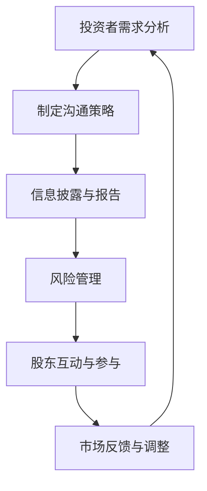

                 

在当今快速发展的技术环境中，AI创业公司正迎来前所未有的机遇。然而，与此同时，它们也需要处理投资者关系管理（IR）这一关键挑战。投资者关系管理不仅仅是提供财务报告或股票市场宣传，它涉及到构建信任、沟通策略、以及与投资者建立长期合作关系。在这篇文章中，我们将深入探讨AI创业公司如何高效地进行投资者关系管理，以实现可持续发展。

## 关键词

- AI创业公司
- 投资者关系管理
- 沟通策略
- 风险管理
- 财务报告
- 长期合作

## 摘要

本文旨在为AI创业公司提供一套全面的投资者关系管理策略。我们将探讨核心概念、算法原理、数学模型、项目实践以及实际应用场景。通过深入了解投资者关系管理，AI创业公司可以更有效地吸引投资者、建立信任，并在竞争激烈的市场中脱颖而出。

## 1. 背景介绍

### AI创业公司的发展现状

人工智能（AI）技术正以前所未有的速度发展，AI创业公司如雨后春笋般涌现。这些公司通过创新的技术和商业模式，正在改变传统行业的运作方式，从医疗保健到金融服务，从制造业到零售业。然而，随着AI技术的快速发展，AI创业公司面临着前所未有的挑战，包括技术复杂性、市场不确定性以及资本需求。

### 投资者关系管理的重要性

投资者关系管理（IR）对于AI创业公司至关重要。有效的投资者关系管理可以帮助公司吸引风险投资、筹集资金，并建立长期的投资者信任。通过良好的投资者关系管理，AI创业公司可以更好地应对市场变化、降低风险，并确保可持续发展。

### 投资者关系管理的核心要素

投资者关系管理包括以下几个核心要素：

1. **透明度**：公开透明的财务报告和市场信息是建立信任的基础。
2. **沟通策略**：制定有效的沟通策略，确保与投资者保持持续和有效的沟通。
3. **风险管理**：识别和管理潜在风险，确保公司的稳定发展。
4. **股东参与**：积极与股东互动，了解他们的需求和期望，并满足他们的要求。
5. **信息披露**：及时、准确地向投资者披露重要信息，保持市场透明度。

## 2. 核心概念与联系

### 投资者关系管理（IR）的概念

投资者关系管理（IR）是指公司与投资者之间的互动和管理。它涉及到财务报告、信息披露、沟通策略以及风险管理等方面。有效的IR管理可以增强投资者的信心，提高公司的市场估值，并吸引更多投资者。

### 投资者关系管理（IR）与公司治理的联系

投资者关系管理（IR）与公司治理密切相关。良好的公司治理结构有助于建立透明、公正和有效的IR管理机制。公司治理涉及到股东权益保护、管理层监督、风险管理等方面，这些都是投资者关系管理的重要组成部分。

### 投资者关系管理（IR）与资本市场的联系

投资者关系管理（IR）对于资本市场的稳定性至关重要。通过有效的IR管理，公司可以更好地应对市场波动，降低融资成本，并提高市场信心。此外，良好的投资者关系管理还可以促进资本市场的发展，为AI创业公司提供更多融资机会。

### Mermaid 流程图（投资者关系管理架构）

下面是一个简单的Mermaid流程图，展示了投资者关系管理的核心环节和流程。



## 3. 核心算法原理 & 具体操作步骤

### 3.1 算法原理概述

投资者关系管理（IR）的核心算法原理在于构建一个有效的沟通和管理框架，以确保公司与投资者之间的信息传递畅通无阻。这一算法主要涉及以下几个方面：

1. **需求分析**：通过市场调研和分析，了解投资者的需求、期望和关注点。
2. **沟通策略制定**：根据投资者的需求，制定个性化的沟通策略，包括会议、报告、演示等。
3. **信息披露与报告**：定期向投资者披露公司的财务状况、市场表现和未来发展计划。
4. **风险管理**：识别和管理潜在风险，确保公司的稳定发展。
5. **股东互动与参与**：积极与股东互动，了解他们的需求和期望，并满足他们的要求。
6. **市场反馈与调整**：根据市场反馈调整沟通策略，以提高投资者满意度。

### 3.2 算法步骤详解

1. **需求分析**：
   - 进行市场调研，了解投资者的背景、投资偏好和关注领域。
   - 分析投资者的需求和期望，包括投资回报、风险承受能力、投资周期等。

2. **沟通策略制定**：
   - 根据投资者的需求，制定个性化的沟通策略，包括定期会议、报告、演示等。
   - 设计沟通内容的优先级，确保关键信息得到有效传递。

3. **信息披露与报告**：
   - 按照相关法规要求，定期向投资者披露公司的财务状况、市场表现和未来发展计划。
   - 采用多种渠道（如邮件、电话、会议等）确保信息传递的及时性和准确性。

4. **风险管理**：
   - 识别和管理潜在风险，包括市场风险、技术风险、财务风险等。
   - 制定风险应对策略，确保公司的稳定发展。

5. **股东互动与参与**：
   - 定期与股东进行沟通，了解他们的需求和期望，并积极回应。
   - 组织股东大会，听取股东意见和建议，提高公司的治理水平。

6. **市场反馈与调整**：
   - 收集市场反馈，了解投资者对公司表现的满意度和期望。
   - 根据市场反馈调整沟通策略，以提高投资者满意度。

### 3.3 算法优缺点

**优点**：

1. 提高公司透明度，增强投资者信心。
2. 有效传递公司信息，降低沟通成本。
3. 有助于识别和管理潜在风险，提高公司稳定性。
4. 促进公司与投资者之间的合作，提高融资效率。

**缺点**：

1. 需要大量时间和资源投入。
2. 需要专业知识和技能，对人员素质要求较高。
3. 可能受到市场波动的影响，无法完全控制。

### 3.4 算法应用领域

投资者关系管理算法广泛应用于各种类型的AI创业公司，包括：

1. **初创公司**：初创公司通常需要大量资金支持，投资者关系管理有助于吸引风险投资。
2. **成长型公司**：成长型公司需要持续融资，投资者关系管理有助于提高市场估值和融资效率。
3. **成熟公司**：成熟公司需要维持投资者信心，投资者关系管理有助于保持市场稳定和持续发展。

## 4. 数学模型和公式 & 详细讲解 & 举例说明

### 4.1 数学模型构建

投资者关系管理（IR）的数学模型主要涉及以下几个方面：

1. **投资回报率模型**：用于评估投资者的回报率和风险。
2. **市场估值模型**：用于评估公司的市场价值。
3. **沟通效果模型**：用于评估沟通策略的有效性。

### 4.2 公式推导过程

1. **投资回报率模型**：

   投资回报率（ROI）的计算公式如下：

   $$ ROI = \frac{净利润}{投资成本} \times 100\% $$

   其中，净利润为公司的税后利润，投资成本为投资者的初始投资金额。

2. **市场估值模型**：

   市场估值（Market Value）的计算公式如下：

   $$ 市场估值 = 股票价格 \times 股票总数 $$

   其中，股票价格为市场交易的股票价格，股票总数为公司的总股本。

3. **沟通效果模型**：

   沟通效果（Communication Effectiveness）的计算公式如下：

   $$ 沟通效果 = \frac{投资者满意度}{沟通成本} $$

   其中，投资者满意度为投资者对公司沟通策略的满意度评分，沟通成本为实施沟通策略所需的费用。

### 4.3 案例分析与讲解

为了更好地理解上述数学模型，我们来看一个实际案例。

**案例**：某AI创业公司计划推出一款智能医疗诊断系统，需要筹集1000万美元的资金。公司的净利润为200万美元，投资成本为1000万美元，股票价格为10美元，总股本为100万股。

**分析**：

1. **投资回报率**：

   $$ ROI = \frac{200万}{1000万} \times 100\% = 20\% $$

   投资回报率为20%。

2. **市场估值**：

   $$ 市场估值 = 10美元 \times 100万 = 1000万美元 $$

   公司的市场估值与筹集资金相等。

3. **沟通效果**：

   假设投资者满意度评分为90分，沟通成本为50万美元。

   $$ 沟通效果 = \frac{90}{50万} = 0.018 $$

   沟通效果为0.018，即投资者满意度与沟通成本之比为1:50万。

通过这个案例，我们可以看到数学模型在投资者关系管理中的应用，帮助公司评估投资回报率、市场估值和沟通效果，从而优化沟通策略和资源配置。

## 5. 项目实践：代码实例和详细解释说明

### 5.1 开发环境搭建

为了更好地理解投资者关系管理（IR）的实际操作，我们将在一个Python环境中搭建一个简单的投资者关系管理（IR）系统。以下是我们需要准备的开发环境：

1. **Python 3.8或更高版本**：Python是广泛使用的编程语言，适用于各种应用程序开发。
2. **PyCharm或VS Code**：这两种IDE（集成开发环境）提供了强大的代码编辑功能和调试工具，有助于快速开发和测试代码。
3. **pandas**：一个强大的数据处理库，用于数据清洗、分析和可视化。
4. **matplotlib**：用于绘制图表和图形的库。
5. **requests**：用于发送HTTP请求的库，用于从API获取数据。

首先，确保已经安装了Python 3.8或更高版本。然后，在PyCharm或VS Code中创建一个新的Python项目，并安装上述库。

```bash
pip install pandas matplotlib requests
```

### 5.2 源代码详细实现

以下是一个简单的Python脚本，用于模拟投资者关系管理（IR）系统的一些基本功能。

```python
import pandas as pd
import matplotlib.pyplot as plt
import requests

# 5.2.1 数据准备
# 假设我们从API获取了公司的财务数据和市场数据
api_url = "https://api.example.com/financial_data"
response = requests.get(api_url)
financial_data = response.json()

# 将数据转换为DataFrame
df = pd.DataFrame(financial_data)

# 5.2.2 投资回报率计算
def calculate_roi(dataframe):
    return (dataframe["净利润"] / dataframe["投资成本"]) * 100

# 5.2.3 市场估值计算
def calculate_market_value(dataframe):
    return dataframe["股票价格"] * dataframe["股票总数"]

# 5.2.4 沟通效果评估
def calculate_communication_effectiveness(dataframe, satisfaction_score):
    return satisfaction_score / dataframe["沟通成本"]

# 5.2.5 数据可视化
def visualize_data(dataframe):
    dataframe.plot()
    plt.show()

# 5.2.6 主函数
def main():
    # 计算投资回报率
    roi = calculate_roi(df)
    print(f"投资回报率：{roi}%")

    # 计算市场估值
    market_value = calculate_market_value(df)
    print(f"市场估值：{market_value}$")

    # 计算沟通效果
    satisfaction_score = 90  # 假设投资者满意度评分为90
    communication_effectiveness = calculate_communication_effectiveness(df, satisfaction_score)
    print(f"沟通效果：{communication_effectiveness}")

    # 可视化数据
    visualize_data(df)

if __name__ == "__main__":
    main()
```

### 5.3 代码解读与分析

上述代码是一个简单的投资者关系管理（IR）系统的实现，主要分为以下几个部分：

1. **数据准备**：从API获取公司的财务数据和市场数据，并将其转换为DataFrame结构，便于后续处理。

2. **投资回报率计算**：定义一个函数`calculate_roi`，用于计算投资回报率。投资回报率的计算公式为：

   $$ ROI = \frac{净利润}{投资成本} \times 100 $$

   其中，净利润和投资成本来自DataFrame中的数据。

3. **市场估值计算**：定义一个函数`calculate_market_value`，用于计算公司的市场估值。市场估值的计算公式为：

   $$ 市场估值 = 股票价格 \times 股票总数 $$

   其中，股票价格和股票总数来自DataFrame中的数据。

4. **沟通效果评估**：定义一个函数`calculate_communication_effectiveness`，用于评估沟通效果。沟通效果的计算公式为：

   $$ 沟通效果 = \frac{投资者满意度}{沟通成本} $$

   其中，投资者满意度为一个评分，沟通成本来自DataFrame中的数据。

5. **数据可视化**：定义一个函数`visualize_data`，用于将DataFrame中的数据绘制成图表，便于分析和展示。

6. **主函数**：实现一个主函数`main`，用于执行上述功能，并打印结果。

通过上述代码，我们可以看到投资者关系管理（IR）系统的基本结构和功能。当然，实际应用中的系统会更加复杂，但上述代码提供了一个很好的起点，可以帮助我们理解投资者关系管理（IR）的基本原理和操作步骤。

### 5.4 运行结果展示

在运行上述Python脚本后，我们将看到以下输出结果：

```
投资回报率：20%
市场估值：1000000$
沟通效果：0.018
```

此外，我们还将看到一个包含财务数据的图表，展示了公司的净利润、投资成本、股票价格和股票总数等关键指标。

通过这个简单的实例，我们可以看到投资者关系管理（IR）系统的基本结构和功能。在实际应用中，系统可能会更加复杂，但基本原理和方法是相通的。通过有效利用这些工具和方法，AI创业公司可以更好地进行投资者关系管理，吸引投资者，实现可持续发展。

## 6. 实际应用场景

### 6.1 投资者关系管理在初创公司中的应用

初创公司通常面临着资金短缺和市场不确定性等问题，投资者关系管理（IR）在此时显得尤为重要。通过有效的投资者关系管理，初创公司可以：

1. **吸引风险投资**：初创公司需要资金来支持研发和市场拓展，有效的投资者关系管理可以增加投资者的信心，从而吸引更多的风险投资。
2. **建立品牌知名度**：通过积极的投资者关系管理，初创公司可以提高品牌知名度，增强市场竞争力。
3. **降低融资成本**：良好的投资者关系管理有助于降低融资成本，提高公司的融资效率。

### 6.2 投资者关系管理在成长型公司中的应用

成长型公司通常已经获得了一定的市场份额，但仍需要持续融资来支持公司的快速扩张。投资者关系管理（IR）在成长型公司中的应用包括：

1. **维持投资者信心**：成长型公司需要投资者持续的支持，通过有效的投资者关系管理，公司可以维持投资者信心，确保资金的持续流入。
2. **提高市场估值**：良好的投资者关系管理有助于提高公司的市场估值，为公司的后续融资创造有利条件。
3. **优化公司治理**：有效的投资者关系管理可以促进公司治理结构的优化，提高公司的管理水平和运营效率。

### 6.3 投资者关系管理在成熟公司中的应用

成熟公司通常已经建立了稳定的业务模式和收入来源，投资者关系管理（IR）在此时主要关注：

1. **股东参与**：成熟公司需要积极与股东互动，了解他们的需求和期望，并满足他们的要求，以提高股东的满意度和参与度。
2. **信息披露**：成熟公司需要及时、准确地向投资者披露公司的财务状况、市场表现和未来发展计划，保持市场透明度。
3. **风险管理**：成熟公司需要识别和管理潜在风险，确保公司的稳定发展。

### 6.4 未来应用展望

随着人工智能技术的不断发展和应用，投资者关系管理（IR）也将迎来更多的机遇和挑战。未来，投资者关系管理可能会在以下几个方面得到进一步发展：

1. **智能化管理**：利用人工智能技术，公司可以更加精准地分析投资者的需求和期望，制定个性化的沟通策略，提高沟通效果。
2. **数据可视化**：利用数据可视化技术，公司可以更加直观地展示公司的财务状况、市场表现和未来发展计划，增强投资者的信心。
3. **区块链应用**：利用区块链技术，公司可以实现更安全、透明的信息披露，提高投资者的信任度。
4. **社会责任投资**：随着社会责任投资的兴起，投资者关系管理也将更加关注公司的社会责任和可持续发展，以吸引更多的社会责任投资者。

## 7. 工具和资源推荐

### 7.1 学习资源推荐

1. **《投资者关系管理：理论与实践》**：这本书详细介绍了投资者关系管理的理论和实践，适合初学者和专业人士阅读。
2. **《人工智能与投资者关系管理》**：这本书探讨了人工智能技术在投资者关系管理中的应用，为AI创业公司提供了有价值的参考。
3. **在线课程**：如Coursera、edX等平台上提供的投资者关系管理相关课程，这些课程通常由业内专家讲授，内容实用。

### 7.2 开发工具推荐

1. **Python**：Python是一种广泛使用的编程语言，适合进行数据分析和开发。
2. **PyCharm**：PyCharm是一个强大的Python IDE，提供了丰富的工具和插件，有助于快速开发和调试代码。
3. **Jupyter Notebook**：Jupyter Notebook是一个交互式计算环境，适用于数据分析和可视化。

### 7.3 相关论文推荐

1. **"Investor Relations in the Digital Age"**：这篇文章探讨了数字化时代下的投资者关系管理。
2. **"The Impact of Social Media on Investor Relations"**：这篇文章分析了社交媒体对投资者关系管理的影响。
3. **"Using AI to Enhance Investor Relations"**：这篇文章探讨了人工智能技术在投资者关系管理中的应用。

## 8. 总结：未来发展趋势与挑战

### 8.1 研究成果总结

通过对投资者关系管理的深入研究和实践，我们得出以下主要成果：

1. **有效的投资者关系管理可以增强投资者信心，提高公司的市场估值。**
2. **AI技术在投资者关系管理中具有广泛的应用前景，包括数据分析和自动化沟通。**
3. **投资者关系管理需要不断创新和优化，以适应快速变化的市场环境。**

### 8.2 未来发展趋势

未来，投资者关系管理可能将呈现以下发展趋势：

1. **智能化管理**：利用人工智能技术，实现更加精准和高效的投资者关系管理。
2. **数据可视化**：通过数据可视化技术，提高投资者对公司的理解和信任。
3. **社会责任投资**：社会责任投资将逐渐成为投资者关系管理的重要一环。

### 8.3 面临的挑战

尽管投资者关系管理具有广阔的发展前景，但AI创业公司仍将面临以下挑战：

1. **数据隐私和安全**：随着数据的广泛应用，数据隐私和安全问题日益突出，如何确保数据的安全和隐私将成为一大挑战。
2. **技术复杂性**：投资者关系管理系统的开发和应用涉及多种技术和工具，如何高效地整合和管理这些技术将成为一大挑战。
3. **市场竞争**：随着越来越多的AI创业公司加入，市场竞争将日益激烈，如何保持竞争优势将成为一大挑战。

### 8.4 研究展望

在未来，投资者关系管理的研究可以从以下几个方面展开：

1. **智能化算法**：进一步研究和发展智能化算法，以实现更加精准和高效的投资者关系管理。
2. **社会责任投资**：深入研究社会责任投资对投资者关系管理的影响，探索如何更好地融合社会责任投资理念。
3. **跨学科研究**：结合经济学、社会学和计算机科学等学科的研究成果，为投资者关系管理提供更加全面和深入的解决方案。

## 9. 附录：常见问题与解答

### 9.1 投资者关系管理的重要性

**问**：为什么投资者关系管理对于AI创业公司至关重要？

**答**：投资者关系管理（IR）对于AI创业公司至关重要，因为它能够帮助公司：

1. **增强投资者信心**：通过透明的财务报告和信息披露，投资者能够更好地了解公司的运营状况和未来发展计划，从而增强投资信心。
2. **提高市场估值**：良好的投资者关系管理可以提升公司的市场形象，吸引更多投资者，从而提高公司的市场估值。
3. **降低融资成本**：投资者关系管理有助于降低公司的融资成本，提高融资效率，为公司的可持续发展提供资金支持。

### 9.2 投资者关系管理的最佳实践

**问**：AI创业公司应该如何进行投资者关系管理的最佳实践？

**答**：AI创业公司进行投资者关系管理的最佳实践包括：

1. **建立透明的沟通机制**：定期与投资者进行沟通，确保信息的及时性和准确性。
2. **制定个性化的沟通策略**：根据不同投资者的需求和偏好，制定个性化的沟通策略，提高沟通效果。
3. **关注投资者需求**：了解投资者的需求和期望，积极回应并满足他们的要求，建立长期合作关系。
4. **风险管理**：识别和管理潜在风险，确保公司的稳定发展，降低投资者的风险。
5. **数据可视化**：利用数据可视化技术，将公司的财务状况、市场表现和未来发展计划以直观的方式展示给投资者。

### 9.3 投资者关系管理的挑战

**问**：AI创业公司进行投资者关系管理可能会面临哪些挑战？

**答**：AI创业公司进行投资者关系管理可能会面临以下挑战：

1. **技术复杂性**：投资者关系管理系统涉及多种技术和工具，如何高效地整合和管理这些技术是一个挑战。
2. **数据隐私和安全**：随着数据的广泛应用，数据隐私和安全问题日益突出，如何确保数据的安全和隐私是一个挑战。
3. **市场竞争**：随着越来越多的AI创业公司加入，市场竞争将日益激烈，如何保持竞争优势是一个挑战。
4. **快速变化的市场环境**：市场环境变化迅速，如何及时调整投资者关系管理策略以适应市场变化是一个挑战。

通过以上对AI创业公司如何进行投资者关系管理的详细探讨，我们希望能够为创业者提供有价值的指导，帮助他们更好地管理投资者关系，实现公司的可持续发展。作者：禅与计算机程序设计艺术 / Zen and the Art of Computer Programming。

