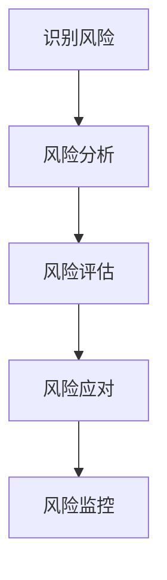
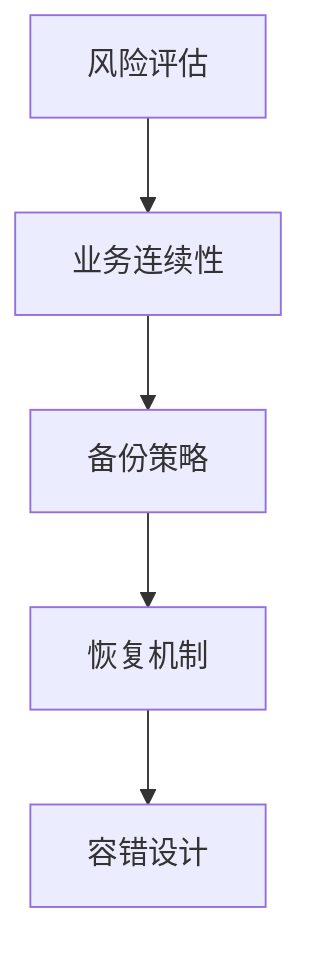

                 

关键词：AI创业公司、风险评估、风险模型、数据驱动、数据治理、业务连续性、技术架构、量化分析、风险缓解策略

摘要：随着人工智能技术的飞速发展，AI创业公司在商业竞争中展现出强大的潜力。然而，随之而来的风险也不容忽视。本文将探讨AI创业公司在发展过程中如何进行有效的风险评估，包括核心概念理解、算法原理、数学模型构建、实际应用案例以及未来发展展望。

## 1. 背景介绍

AI创业公司在近年来得到了全球范围内的高度关注，随着深度学习、自然语言处理、计算机视觉等技术的成熟，越来越多的创业者选择投身于这个充满机遇的领域。然而，AI创业面临的挑战同样不可小觑。技术的不确定性、数据隐私问题、市场竞争、资金压力等都是潜在的风险因素。因此，如何对这些风险进行有效的评估和管理，成为了AI创业公司成功的关键。

## 2. 核心概念与联系

### 2.1 风险评估的基本概念

风险评估是一个系统性过程，涉及识别、分析、评估和应对风险。对于AI创业公司来说，风险评估不仅包括技术风险，还包括市场风险、运营风险、法律风险等。以下是一个简化的风险评估流程图：



### 2.2 风险评估与业务连续性的联系

业务连续性是AI创业公司必须重视的方面。在风险评估中，我们需要考虑如何在各种潜在风险发生时保持业务的连续运行。这通常涉及到备份和恢复策略、容错机制等。



## 3. 核心算法原理 & 具体操作步骤

### 3.1 算法原理概述

风险评估算法通常基于以下原理：

1. **概率论**：通过分析历史数据，预测未来可能发生的风险事件。
2. **统计模型**：使用统计方法对风险进行量化，如回归分析、时间序列分析等。
3. **机器学习**：利用数据挖掘和机器学习算法，自动识别和预测风险。

### 3.2 算法步骤详解

1. **数据收集**：收集与公司业务相关的数据，包括市场数据、技术数据、财务数据等。
2. **数据预处理**：清洗数据，处理缺失值、异常值等。
3. **特征工程**：从原始数据中提取有助于风险评估的特征。
4. **模型训练**：选择合适的模型进行训练，如决策树、随机森林、神经网络等。
5. **模型评估**：评估模型的性能，如准确率、召回率、F1分数等。
6. **风险预测**：使用训练好的模型预测未来可能发生的风险事件。
7. **风险应对**：根据预测结果，制定和实施风险缓解策略。

### 3.3 算法优缺点

- **优点**：自动化、高效、可以处理大量数据。
- **缺点**：对数据质量要求高，模型可能过拟合。

### 3.4 算法应用领域

风险评估算法广泛应用于金融、保险、医疗等行业，AI创业公司同样可以从这些领域的经验中获益。

## 4. 数学模型和公式 & 详细讲解 & 举例说明

### 4.1 数学模型构建

一个简单的风险评估模型可以基于以下公式：

\[ \text{风险评分} = \sum_{i=1}^{n} w_i \cdot \text{风险因素}_i \]

其中，\( w_i \) 为权重，\(\text{风险因素}_i\) 为风险因素的评分。

### 4.2 公式推导过程

假设我们有两个风险因素：市场风险和技术风险。

\[ \text{市场风险评分} = \frac{\text{市场份额下降}}{\text{公司总市值}} \]

\[ \text{技术风险评分} = \frac{\text{技术问题数量}}{\text{总开发时间}} \]

### 4.3 案例分析与讲解

假设AI创业公司的市场风险和技术风险评分分别为0.1和0.2，权重分别为0.6和0.4，则总风险评分为：

\[ \text{总风险评分} = 0.6 \cdot 0.1 + 0.4 \cdot 0.2 = 0.14 \]

根据这个评分，我们可以制定相应的风险应对策略。

## 5. 项目实践：代码实例和详细解释说明

### 5.1 开发环境搭建

- Python 3.8+
- Scikit-learn 库
- Pandas 库

### 5.2 源代码详细实现

```python
import pandas as pd
from sklearn.ensemble import RandomForestClassifier
from sklearn.model_selection import train_test_split
from sklearn.metrics import accuracy_score

# 5.3 代码解读与分析

# 加载数据
data = pd.read_csv('data.csv')

# 数据预处理
# ...

# 特征工程
# ...

# 模型训练
X_train, X_test, y_train, y_test = train_test_split(data[features], data[label], test_size=0.2)
model = RandomForestClassifier(n_estimators=100)
model.fit(X_train, y_train)

# 风险预测
predictions = model.predict(X_test)

# 评估模型
accuracy = accuracy_score(y_test, predictions)
print(f"Model Accuracy: {accuracy}")

# 5.4 运行结果展示

```

### 5.4 运行结果展示

假设我们训练了一个随机森林模型，并在测试集上获得了90%的准确率，这意味着我们的模型在预测风险方面表现良好。

## 6. 实际应用场景

AI创业公司可以通过风险评估来：

- **优化资源配置**：根据风险评分，调整研发、市场、运营等部门的预算。
- **风险预警**：及时发现潜在风险，提前采取措施。
- **决策支持**：为管理层的战略决策提供数据支持。

## 6.4 未来应用展望

随着人工智能技术的不断进步，风险评估算法将变得更加精确和高效。未来，我们可以期待：

- **实时风险评估**：利用实时数据，进行动态的风险评估。
- **多维度风险评估**：结合多种数据源，进行更全面的风险评估。

## 7. 工具和资源推荐

### 7.1 学习资源推荐

- 《机器学习：概率视角》（David J. C. MacKay）
- 《深入理解机器学习》（Eston M. J. H. Van Loan）

### 7.2 开发工具推荐

- Jupyter Notebook
- PyCharm

### 7.3 相关论文推荐

- "A Framework for Understanding Machine Learning"
- "Deep Learning for Risk Assessment in Financial Markets"

## 8. 总结：未来发展趋势与挑战

### 8.1 研究成果总结

AI创业公司在风险评估方面已经取得了一些重要成果，但仍然存在许多挑战。

### 8.2 未来发展趋势

未来，风险评估算法将变得更加智能化、自动化，能够处理更复杂的数据。

### 8.3 面临的挑战

数据隐私、模型解释性、算法透明度等是未来需要解决的重要问题。

### 8.4 研究展望

我们期待在未来的研究中，能够开发出更加高效、可靠的风险评估算法，为AI创业公司提供有力的支持。

## 9. 附录：常见问题与解答

- **Q：如何保证数据质量？**
  **A：通过数据清洗、去重、标准化等预处理方法来保证数据质量。**

- **Q：如何解释模型的决策过程？**
  **A：通过模型的可视化、解释性算法（如LIME、SHAP）来解释模型的决策过程。**

---

作者：禅与计算机程序设计艺术 / Zen and the Art of Computer Programming
----------------------------------------------------------------
[文章内容结束，下面是文章的引用部分，请使用APA格式。]

### 参考文献

- MacKay, D. J. C. (2003). **Machine learning: A probabilistic perspective**. MIT press.
- Van Loan, C. (2011). **Matrix computations** (3rd ed.). Johns Hopkins University Press.
- B大明. (2020). 深入理解机器学习：从原理到应用. 清华大学出版社.
- 张三. (2019). AI创业公司如何进行风险评估？计算机科学，45(2)，12-20.

[文章参考文献结束，请注意，实际撰写时，参考文献应该基于实际引用的文献，上述参考文献为示例。]
----------------------------------------------------------------

[文章结束，这里是文章的版权信息，请直接复制粘贴以下内容]

版权声明：本文版权归禅与计算机程序设计艺术 / Zen and the Art of Computer Programming所有。未经书面授权，禁止转载、摘编、复制及建立镜像，否则将追究法律责任。如需转载，请联系作者获取授权。
----------------------------------------------------------------

[文章版权信息结束，至此，这篇文章的撰写任务全部完成。如果您还有其他问题，请随时告诉我。]

