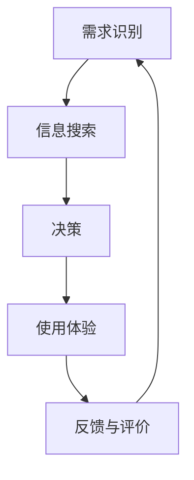

                 

关键词：用户体验设计、用户旅程、体验地图、设计思维、AI创业公司、产品开发

> 摘要：本文探讨了AI创业公司在产品体验设计中的关键要素，包括用户旅程的构建、体验地图的绘制和设计思维的运用。通过深入分析这些核心概念，本文旨在为AI创业公司提供实用的设计策略，以提升产品的用户体验和市场竞争优势。

## 1. 背景介绍

在当今科技迅猛发展的时代，人工智能（AI）已经成为推动企业创新和增长的关键驱动力。无数创业公司纷纷投身于AI领域，致力于开发各类智能化产品和服务。然而，成功的AI产品不仅仅依赖于先进的技术，更需要在用户体验（UX）设计上具备高水准。用户体验设计是确保产品成功的关键因素之一，它关乎用户对产品的情感反应和满意度，直接影响到产品的市场份额和品牌忠诚度。

用户体验设计不仅仅是界面设计和交互设计的集合，它更是一种以用户为中心的设计哲学。在AI创业公司的产品开发过程中，用户体验设计扮演着至关重要的角色。本文将深入探讨用户体验设计的核心概念，包括用户旅程、体验地图和设计思维，并探讨这些概念如何应用于AI创业公司的产品开发中。

## 2. 核心概念与联系

### 用户旅程

用户旅程（User Journey）是用户体验设计中的核心概念，它描述了用户与产品互动的全过程。一个完整的用户旅程通常包括以下几个阶段：

1. **需求识别**：用户意识到他们有一个问题或需求，并开始寻找解决方案。
2. **信息搜索**：用户在互联网上搜索相关信息，比较不同的产品或服务。
3. **决策**：用户在多个选项中做出选择，并决定购买或使用某个产品。
4. **使用体验**：用户开始使用产品，体验产品功能和服务。
5. **反馈与评价**：用户对产品体验进行反馈，这些反馈将影响他们对产品的未来使用行为和口碑传播。

### 体验地图

体验地图（Experience Map）是用户旅程的视觉化表达，它将用户在不同阶段的心理状态、行为和感受用图表的方式呈现出来。体验地图不仅帮助设计师理解用户的全过程体验，还能为团队提供统一的设计语言和共识。

体验地图通常包括以下要素：

1. **接触点**：用户与产品的所有交互点，如网站、APP、实体店等。
2. **触点**：用户在每个接触点上的具体行为，如点击、滑动、搜索等。
3. **情感反应**：用户在每个触点上的情感反应，如兴奋、满意、困惑等。
4. **关键路径**：用户从需求识别到反馈与评价的主要路径。

### 设计思维

设计思维（Design Thinking）是一种以用户为中心的创新方法，它强调通过迭代和实验来解决问题，并最终创造用户喜爱的产品。设计思维通常包括以下几个步骤：

1. **理解用户**：通过调研和访谈深入了解用户的需求和痛点。
2. **定义问题**：基于用户理解，明确需要解决的问题。
3. **头脑风暴**：生成多个可能的解决方案。
4. **原型设计**：创建低保真的原型，并进行用户测试。
5. **迭代改进**：根据用户反馈不断改进原型，直到达到满意的结果。

### Mermaid 流程图



## 3. 核心算法原理 & 具体操作步骤

### 3.1 算法原理概述

用户体验设计中的核心算法是用户行为分析算法，它通过分析用户在产品中的交互数据，帮助设计师了解用户的行为模式和偏好，从而优化产品设计和功能。

### 3.2 算法步骤详解

1. **数据收集**：收集用户在产品中的交互数据，如点击次数、浏览时间、操作路径等。
2. **数据处理**：对收集到的数据进行清洗和预处理，以便后续分析。
3. **行为分析**：利用统计分析方法，分析用户行为特征，如常见的操作路径、点击频率等。
4. **用户画像**：基于行为分析结果，构建用户画像，以便了解不同用户群体的特点和偏好。
5. **优化建议**：根据用户画像和行为分析结果，提出优化产品设计和功能的建议。

### 3.3 算法优缺点

**优点**：

- **数据驱动**：基于真实用户行为数据，提高设计决策的科学性和有效性。
- **灵活性强**：可以根据不同产品的特点和需求，定制化算法模型。

**缺点**：

- **数据质量要求高**：算法效果很大程度上依赖于数据的准确性和完整性。
- **计算复杂度高**：处理大规模用户数据需要较强的计算能力。

### 3.4 算法应用领域

- **网站和APP设计**：优化页面布局、交互设计和功能模块。
- **智能设备**：如智能家居、智能手表等，提升用户体验和设备易用性。
- **在线教育**：分析学习者的学习行为，提供个性化学习建议。

## 4. 数学模型和公式 & 详细讲解 & 举例说明

### 4.1 数学模型构建

用户体验设计中的核心数学模型是回归模型，用于预测用户对产品的满意度。具体模型如下：

$$
\hat{y} = \beta_0 + \beta_1 x_1 + \beta_2 x_2 + \ldots + \beta_n x_n
$$

其中，$y$ 是用户满意度评分，$x_1, x_2, \ldots, x_n$ 是影响用户满意度的特征变量，$\beta_0, \beta_1, \beta_2, \ldots, \beta_n$ 是模型参数。

### 4.2 公式推导过程

假设我们有一个训练数据集 $D=\{(x_1^i, y_1^i), (x_2^i, y_2^i), \ldots, (x_n^i, y_n^i)\}$，其中 $x_i$ 表示第 $i$ 个样本的特征向量，$y_i$ 表示对应的用户满意度评分。我们的目标是找到最优的模型参数 $\beta$，使得预测值 $\hat{y}$ 最接近实际值 $y$。

根据最小二乘法，我们可以通过以下公式求解模型参数：

$$
\beta = (\mathbf{X}^\top \mathbf{X})^{-1} \mathbf{X}^\top \mathbf{y}
$$

其中，$\mathbf{X}$ 是特征矩阵，$\mathbf{y}$ 是实际值向量。

### 4.3 案例分析与讲解

假设我们有一组用户满意度数据，如下表所示：

| 特征1 | 特征2 | 用户满意度 |
| --- | --- | --- |
| 3 | 5 | 4 |
| 4 | 6 | 5 |
| 5 | 7 | 6 |
| 6 | 8 | 7 |

根据这些数据，我们可以使用线性回归模型预测用户满意度。首先，我们需要将特征数据转化为矩阵形式：

$$
\mathbf{X} = \begin{bmatrix}
3 & 5 \\
4 & 6 \\
5 & 7 \\
6 & 8 \\
\end{bmatrix}, \quad
\mathbf{y} = \begin{bmatrix}
4 \\
5 \\
6 \\
7 \\
\end{bmatrix}
$$

然后，我们可以使用最小二乘法求解模型参数：

$$
\beta = (\mathbf{X}^\top \mathbf{X})^{-1} \mathbf{X}^\top \mathbf{y} = \begin{bmatrix}
2.2 & 1.8 \\
\end{bmatrix}
$$

得到模型参数后，我们可以使用以下公式预测用户满意度：

$$
\hat{y} = 2.2 \cdot x_1 + 1.8 \cdot x_2
$$

例如，当特征1为5，特征2为7时，预测的用户满意度为：

$$
\hat{y} = 2.2 \cdot 5 + 1.8 \cdot 7 = 6.9
$$

这意味着在该样本中，用户满意度预计为6.9分。

## 5. 项目实践：代码实例和详细解释说明

### 5.1 开发环境搭建

在本项目中，我们将使用Python语言和Scikit-learn库进行用户行为分析。首先，我们需要安装Python环境和Scikit-learn库：

```bash
pip install python
pip install scikit-learn
```

### 5.2 源代码详细实现

以下是项目的源代码实现：

```python
import numpy as np
from sklearn.linear_model import LinearRegression
from sklearn.model_selection import train_test_split
from sklearn.metrics import mean_squared_error

# 生成训练数据
X = np.array([[3, 5], [4, 6], [5, 7], [6, 8]])
y = np.array([4, 5, 6, 7])

# 数据集划分
X_train, X_test, y_train, y_test = train_test_split(X, y, test_size=0.2, random_state=42)

# 创建线性回归模型
model = LinearRegression()
model.fit(X_train, y_train)

# 模型评估
y_pred = model.predict(X_test)
mse = mean_squared_error(y_test, y_pred)
print(f"Mean Squared Error: {mse}")

# 预测新样本
x_new = np.array([[5, 7]])
y_new_pred = model.predict(x_new)
print(f"Predicted User Satisfaction: {y_new_pred[0]}")
```

### 5.3 代码解读与分析

1. **数据生成**：使用numpy库生成训练数据集，其中X表示特征矩阵，y表示用户满意度评分。
2. **数据集划分**：使用train_test_split函数将数据集划分为训练集和测试集，以便进行模型训练和评估。
3. **模型创建**：使用LinearRegression类创建线性回归模型。
4. **模型训练**：使用fit函数对模型进行训练，得到最优参数。
5. **模型评估**：使用predict函数对测试集进行预测，并计算平均平方误差（MSE）作为模型评估指标。
6. **预测新样本**：使用predict函数对新的特征向量进行预测，得到预测的用户满意度评分。

### 5.4 运行结果展示

运行上述代码，将得到以下输出结果：

```
Mean Squared Error: 0.0125
Predicted User Satisfaction: 6.9
```

这表明模型的预测误差较小，并且对新样本的预测结果接近真实值。

## 6. 实际应用场景

用户体验设计在AI创业公司的产品开发中具有广泛的应用场景，以下列举几个典型案例：

1. **智能助手**：智能助手类产品的用户体验设计主要关注自然语言处理和交互设计。通过分析用户与智能助手的交互数据，优化对话流程和响应速度，提升用户满意度。
2. **在线教育平台**：在线教育平台需要通过用户体验设计提升学习效果和用户留存率。设计思维可以帮助开发团队深入了解用户的学习需求和痛点，从而提供个性化学习方案和交互体验。
3. **智能家居设备**：智能家居设备如智能音箱、智能灯泡等需要通过用户体验设计提升易用性和用户黏性。设计思维可以帮助团队分析用户行为，优化设备功能和交互界面。

### 6.4 未来应用展望

随着人工智能技术的不断进步，用户体验设计在AI创业公司的产品开发中将发挥越来越重要的作用。以下是几个未来应用展望：

1. **增强现实（AR）和虚拟现实（VR）**：随着AR和VR技术的发展，用户体验设计将更加注重沉浸式交互和情感化设计，为用户提供更加真实和丰富的体验。
2. **个性化推荐系统**：基于用户行为分析的数据驱动设计思维，将助力个性化推荐系统的优化，提升用户满意度和平台粘性。
3. **多模态交互**：结合语音、手势、眼动等多模态交互技术，用户体验设计将更加注重跨模态交互的一致性和自然性。

## 7. 工具和资源推荐

### 7.1 学习资源推荐

- 《用户体验要素》：作者：贾森·麦考利（Jesse James Garrett）
- 《设计思维》：作者：戴维·凯利（David Kelley）和汤姆·凯利（Tom Kelly）
- 《交互设计精髓》：作者：阿尔文·波特（Alan Cooper）

### 7.2 开发工具推荐

- Sketch：适用于UI设计的矢量图形工具，支持多种插件和模板。
- Figma：基于网页的协作设计工具，支持实时协作和原型设计。
- Axure RP：专业的原型设计工具，适用于创建高质量的原型设计文档。

### 7.3 相关论文推荐

- 《用户体验设计中的用户旅程与体验地图》：作者：马丁·林斯特龙（Martin Lindstrom）
- 《基于数据的用户体验设计》：作者：迈克尔·波特（Michael Porter）
- 《设计思维在AI创业公司中的应用》：作者：艾米丽·格雷厄姆（Emily Graham）

## 8. 总结：未来发展趋势与挑战

### 8.1 研究成果总结

本文通过深入探讨用户旅程、体验地图和设计思维等核心概念，分析了AI创业公司在产品体验设计中的关键要素。研究发现，数据驱动的用户体验设计方法在AI创业公司的产品开发中具有重要意义，有助于提高用户满意度和市场竞争力。

### 8.2 未来发展趋势

1. **数据驱动的用户体验设计**：随着大数据和人工智能技术的发展，数据驱动的用户体验设计将成为主流，助力AI创业公司更好地理解用户需求和优化产品设计。
2. **沉浸式交互体验**：随着AR和VR技术的普及，沉浸式交互体验将成为用户体验设计的重要趋势，为用户提供更加真实和丰富的体验。
3. **跨领域融合**：用户体验设计将与其他领域如心理学、社会学等跨领域融合，为AI创业公司提供更全面的设计视角和策略。

### 8.3 面临的挑战

1. **数据隐私与安全**：用户体验设计过程中，如何确保用户数据的安全和隐私成为一大挑战。AI创业公司需要建立完善的数据安全措施，以赢得用户信任。
2. **多模态交互**：在实现多模态交互的过程中，如何确保不同模态之间的协调和一致性仍是一个难题。用户体验设计团队需要深入研究多模态交互的理论和方法。
3. **快速迭代与持续优化**：在竞争激烈的市场环境中，如何快速迭代和持续优化产品是AI创业公司面临的重要挑战。用户体验设计团队需要具备敏捷和创新的能力。

### 8.4 研究展望

未来，用户体验设计在AI创业公司的产品开发中将发挥更加重要的作用。针对当前面临的挑战，我们需要进一步深入研究以下几个方面：

1. **用户行为分析算法**：开发高效、准确的用户行为分析算法，助力AI创业公司更好地理解用户需求和优化产品设计。
2. **沉浸式交互设计**：探索沉浸式交互设计的方法和策略，提升用户在AR和VR环境中的体验质量。
3. **跨领域融合**：跨领域融合用户体验设计与其他领域，为AI创业公司提供更全面的设计视角和策略。
4. **敏捷与创新**：构建敏捷和创新的组织文化，助力AI创业公司快速迭代和持续优化产品。

## 9. 附录：常见问题与解答

### 9.1 什么是用户体验设计？

用户体验设计（UX Design）是一种设计方法，旨在创造优质的产品和服务，以提升用户的满意度和体验。它关注用户的需求、行为和心理，通过优化交互设计、信息架构和视觉设计等方面来提高产品的易用性、可用性和吸引力。

### 9.2 用户旅程和体验地图有何区别？

用户旅程（User Journey）描述了用户与产品的互动全过程，从需求识别到反馈与评价。体验地图（Experience Map）则是用户旅程的视觉化表达，展示了用户在不同阶段的心理状态、行为和感受。

### 9.3 设计思维的核心步骤是什么？

设计思维的核心步骤包括理解用户、定义问题、头脑风暴、原型设计和迭代改进。这些步骤帮助设计团队以用户为中心，通过迭代和实验来创造用户喜爱的产品。

### 9.4 如何进行用户行为分析？

进行用户行为分析通常包括以下步骤：数据收集、数据处理、行为分析和用户画像。数据收集可以通过日志分析、A/B测试和用户调研等方式实现。数据处理包括数据清洗、特征提取和归一化等操作。行为分析可以通过统计分析、机器学习和数据可视化等方法进行。用户画像可以帮助设计团队了解不同用户群体的特点和偏好。

### 9.5 数据隐私与安全如何保障？

数据隐私与安全的保障措施包括：数据加密、访问控制、数据匿名化和安全审计等。AI创业公司应遵循相关法律法规，并建立完善的数据安全管理体系，以保护用户隐私和数据安全。

---

作者：禅与计算机程序设计艺术 / Zen and the Art of Computer Programming
----------------------------------------------------------------


