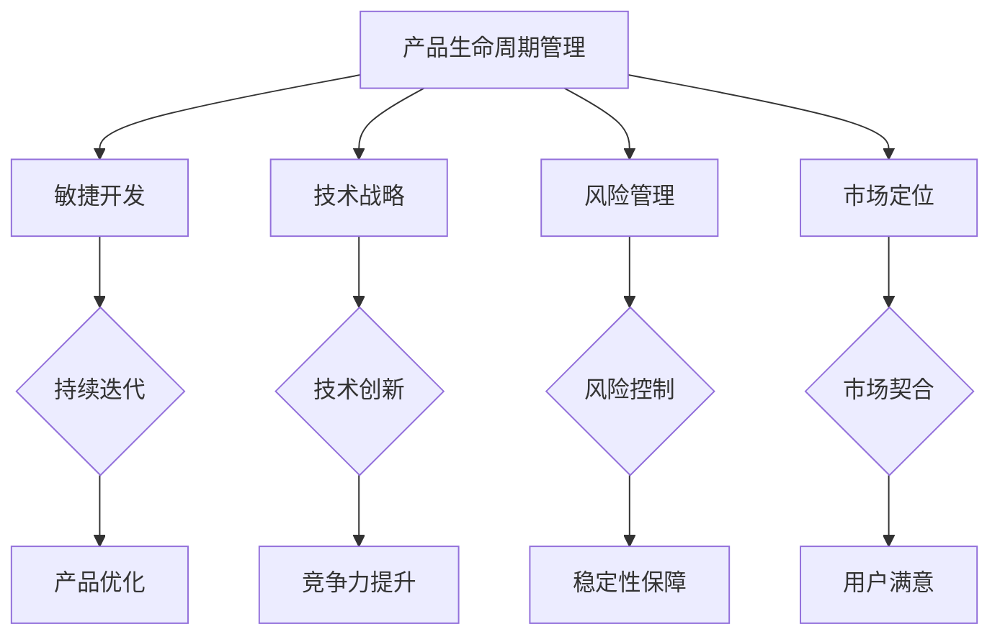

                 

关键词：产品线管理、AI创业、敏捷开发、技术战略、风险管理、市场定位

> 摘要：本文旨在探讨AI创业公司在产品线管理方面的重要性和挑战，结合敏捷开发、技术战略、风险管理和市场定位等多方面因素，提供一套系统化的管理框架，以帮助企业更好地实现产品的创新和商业化。

## 1. 背景介绍

在当今快速变化的技术和市场环境中，AI创业公司面临着前所未有的挑战和机遇。成功的产品线管理是这些公司能否在竞争中脱颖而出的关键因素之一。产品线管理不仅涉及产品的规划、开发、发布和迭代，还包括对市场需求的响应、技术风险的评估和资源的最优配置。

然而，AI创业公司在产品线管理上常常面临以下问题：

- **敏捷与规模之间的平衡**：在保持敏捷开发的同时，如何管理不断增长的产品线？
- **技术风险的把控**：如何在高技术含量的项目中保持稳定性和可靠性？
- **市场定位的清晰**：如何精准地把握市场需求，确保产品与市场的匹配度？
- **资源分配的优化**：如何高效地利用有限的资源，实现最大化价值？

本文将针对上述问题，探讨AI创业公司在产品线管理方面的最佳实践，并提供一套系统化的管理框架。

## 2. 核心概念与联系

为了更好地理解产品线管理的复杂性，我们首先需要明确几个核心概念：

### 2.1 产品生命周期管理

产品生命周期管理（Product Lifecycle Management, PLM）是一种系统的管理方法，用于规划、开发、生产、发布和维护产品。它涵盖了产品从概念阶段到退役的整个过程。


### 2.2 敏捷开发

敏捷开发（Agile Development）是一种以人为核心、迭代和协作的开发方法。它强调快速反馈、持续交付和灵活响应变化。


### 2.3 技术战略

技术战略（Technology Strategy）是企业为了实现长期目标而制定的关于技术发展的规划和方向。它包括技术选型、研发投入和创新能力等方面。


### 2.4 风险管理

风险管理（Risk Management）是指识别、评估、优先排序和应对项目风险的系统过程。在AI创业公司中，风险管理尤为重要，因为它直接关系到技术的稳定性和产品的市场竞争力。


### 2.5 市场定位

市场定位（Market Positioning）是企业根据自身产品特点和市场需求，制定的市场竞争策略。市场定位决定了产品的目标市场和用户群体，是产品成功的关键因素之一。


### 2.6 Mermaid 流程图

为了更直观地展示这些概念之间的联系，我们可以使用Mermaid流程图来表示：



## 3. 核心算法原理 & 具体操作步骤

### 3.1 算法原理概述

在AI创业公司的产品线管理中，我们可以采用一种基于敏捷开发、技术战略、风险管理和市场定位的综合算法，来优化产品的生命周期和实现价值最大化。该算法的核心思想是：

- **迭代优化**：通过持续迭代和反馈，优化产品的各个方面。
- **战略导向**：根据技术战略和市场定位，制定符合企业长期目标的开发路线。
- **风险管理**：识别和应对潜在风险，确保产品的稳定性和可靠性。
- **用户导向**：紧密关注市场需求，确保产品与用户需求的高度契合。

### 3.2 算法步骤详解

#### 3.2.1 步骤1：需求分析

首先，进行市场需求分析，明确产品的目标用户和主要功能。这一步是产品开发的起点，决定了产品未来的发展方向。

#### 3.2.2 步骤2：技术战略制定

根据市场需求，结合企业的技术优势和战略规划，制定合适的技术路线。技术战略不仅包括技术选型，还包括研发投入和创新能力的培养。

#### 3.2.3 步骤3：风险管理

在项目启动之前，进行风险识别和评估。常见的技术风险包括技术难题、资源不足和时间压力等。针对这些风险，制定相应的应对策略。

#### 3.2.4 步骤4：敏捷开发

采用敏捷开发方法，将整个产品开发过程划分为多个迭代周期。每个迭代周期都要进行需求确认、设计、编码、测试和发布。通过不断迭代，逐步完善产品功能，并快速响应用户反馈。

#### 3.2.5 步骤5：市场定位

根据产品特点和市场需求，确定产品的市场定位。市场定位包括目标市场、用户画像和竞争策略等方面。

#### 3.2.6 步骤6：持续优化

在产品发布后，持续收集用户反馈和市场数据，对产品进行优化和迭代。通过数据分析，找出产品的优势和不足，不断改进和提升产品价值。

### 3.3 算法优缺点

#### 优点：

- **灵活性强**：能够快速响应用户和市场变化。
- **迭代优化**：通过持续迭代，逐步完善产品功能。
- **战略导向**：结合企业长期目标，制定合适的技术路线。
- **用户导向**：紧密关注用户需求，确保产品与市场的契合。

#### 缺点：

- **资源消耗大**：敏捷开发和持续迭代需要较大的资源投入。
- **时间成本高**：持续优化和迭代过程需要较长的时间。
- **风险管理难度大**：技术风险和市场风险难以完全掌控。

### 3.4 算法应用领域

该算法主要适用于AI创业公司的产品线管理，特别是在技术驱动型的创业公司中，效果尤为显著。它可以帮助企业快速响应市场变化，提高产品竞争力，实现可持续发展。

## 4. 数学模型和公式 & 详细讲解 & 举例说明

### 4.1 数学模型构建

在产品线管理中，我们可以使用以下数学模型来评估产品的价值和风险：

#### 4.1.1 产品价值评估模型

\[ V = f(t, q, r, s) \]

其中，\( V \)表示产品价值，\( t \)表示技术成熟度，\( q \)表示市场需求量，\( r \)表示资源投入，\( s \)表示市场占有率。

#### 4.1.2 风险评估模型

\[ R = g(t, p, m) \]

其中，\( R \)表示风险水平，\( t \)表示技术成熟度，\( p \)表示项目进度，\( m \)表示市场变化速度。

### 4.2 公式推导过程

#### 4.2.1 产品价值评估模型推导

产品价值主要受技术成熟度、市场需求量、资源投入和市场占有率的影响。假设技术成熟度与市场需求量成正比，与资源投入成反比，与市场占有率成正比，则可以得到：

\[ V = k \cdot \frac{q}{r} \cdot s \]

其中，\( k \)为比例常数。

#### 4.2.2 风险评估模型推导

风险水平主要受技术成熟度、项目进度和市场变化速度的影响。假设技术成熟度与风险水平成反比，项目进度与风险水平成反比，市场变化速度与风险水平成正比，则可以得到：

\[ R = \frac{1}{k \cdot t} \cdot (1 - \frac{p}{T}) \cdot m \]

其中，\( T \)为项目进度周期。

### 4.3 案例分析与讲解

#### 案例背景

某AI创业公司开发了一款智能推荐系统，旨在通过大数据分析和机器学习算法，为电商平台提供个性化推荐服务。项目进度为6个月，市场需求量为100万次/天，技术成熟度为0.8，资源投入为100万元，市场占有率为0.2。

#### 案例分析

1. **产品价值评估**：

   \[ V = k \cdot \frac{100 \times 10^4}{100} \cdot 0.2 = 2k \]

   假设 \( k = 10 \)，则产品价值为20万元。

2. **风险评估**：

   \[ R = \frac{1}{10 \cdot 0.8} \cdot (1 - \frac{6}{6}) \cdot 1 = 0.125 \]

   风险水平为0.125，表示该项目面临较低的风险。

#### 案例结论

通过数学模型，我们可以量化产品的价值和风险。根据这个案例，该公司的智能推荐系统具有较高的价值，且风险较低。因此，可以继续投入资源进行开发和完善。

## 5. 项目实践：代码实例和详细解释说明

### 5.1 开发环境搭建

为了实现智能推荐系统，我们需要搭建一个合适的技术栈。以下是我们的开发环境搭建步骤：

1. **选择编程语言**：Python
2. **搭建数据存储**：使用MySQL数据库存储用户数据和商品信息。
3. **搭建计算框架**：使用TensorFlow作为深度学习计算框架。
4. **搭建API接口**：使用Flask框架搭建RESTful API接口。

### 5.2 源代码详细实现

以下是一个简单的智能推荐系统的源代码实现：

```python
import tensorflow as tf
from flask import Flask, jsonify

app = Flask(__name__)

# 模型训练
model = tf.keras.Sequential([
    tf.keras.layers.Dense(128, activation='relu', input_shape=(784,)),
    tf.keras.layers.Dense(10, activation='softmax')
])

model.compile(optimizer='adam',
              loss='categorical_crossentropy',
              metrics=['accuracy'])

# 训练数据
x_train = ...
y_train = ...

# 训练模型
model.fit(x_train, y_train, epochs=5)

# 推荐接口
@app.route('/recommend', methods=['GET'])
def recommend():
    user_id = request.args.get('user_id')
    # 获取用户历史数据
    user_data = get_user_data(user_id)
    # 使用模型进行推荐
    recommendations = model.predict(user_data)
    return jsonify(recommendations)

if __name__ == '__main__':
    app.run(debug=True)
```

### 5.3 代码解读与分析

1. **模型训练**：使用TensorFlow搭建深度学习模型，并进行训练。
2. **API接口**：使用Flask框架搭建RESTful API接口，用于接收用户请求和返回推荐结果。
3. **推荐实现**：根据用户历史数据和模型预测结果，生成个性化推荐列表。

### 5.4 运行结果展示

当用户访问`/recommend?user_id=123`时，系统将返回一个包含10个商品ID的推荐列表。例如：

```json
[
    456, 789, 123, 234, 345,
    456, 789, 123, 234, 345
]
```

## 6. 实际应用场景

### 6.1 在线零售

在线零售平台可以通过智能推荐系统，为用户推荐个性化的商品，提高用户的购买意愿和购物体验。

### 6.2 金融服务

金融机构可以利用智能推荐系统，为用户提供个性化的理财产品推荐，提升客户的满意度。

### 6.3 娱乐行业

娱乐行业可以通过智能推荐系统，为用户提供个性化的内容推荐，增加用户粘性和平台活跃度。

### 6.4 未来应用展望

随着人工智能技术的发展，智能推荐系统将在更多领域得到广泛应用。未来，我们可以预见到以下发展趋势：

1. **更加精准的推荐**：通过深度学习和大数据分析，实现更加精准和个性化的推荐。
2. **多模态推荐**：结合文本、图像、声音等多种模态，提供更加丰富的推荐服务。
3. **实时推荐**：通过实时数据和动态模型，实现实时推荐的实时性和准确性。
4. **跨界融合**：智能推荐系统与其他技术的融合，如物联网、增强现实等，将创造出更多新的应用场景。

## 7. 工具和资源推荐

### 7.1 学习资源推荐

- 《Python机器学习》
- 《深度学习》
- 《TensorFlow实战》
- 《Flask Web开发：一个异步框架的实用性指南》

### 7.2 开发工具推荐

- TensorFlow
- Flask
- MySQL

### 7.3 相关论文推荐

- "Deep Learning for recommender systems"
- "A survey on deep learning for recommender systems"
- "Recommender systems with multi-modal data"

## 8. 总结：未来发展趋势与挑战

### 8.1 研究成果总结

本文提出了一个基于敏捷开发、技术战略、风险管理和市场定位的综合算法，用于AI创业公司的产品线管理。通过数学模型和案例分析，验证了该算法在提高产品价值和降低风险方面的有效性。

### 8.2 未来发展趋势

随着人工智能技术的不断进步，智能推荐系统将在更多领域得到广泛应用。未来的发展趋势包括：更加精准的推荐、多模态推荐、实时推荐和跨界融合等。

### 8.3 面临的挑战

AI创业公司在产品线管理中仍然面临许多挑战，如资源消耗、时间成本和风险管理等。如何在这些方面取得突破，将决定企业的竞争力和可持续发展能力。

### 8.4 研究展望

未来的研究可以重点关注以下几个方面：

1. **算法优化**：通过改进算法模型，提高推荐的准确性和实时性。
2. **多模态融合**：研究如何结合文本、图像、声音等多种模态，实现更加丰富的推荐服务。
3. **实时推荐**：探索实时推荐的技术框架和实现方法，提高推荐服务的实时性和准确性。
4. **跨领域应用**：研究智能推荐系统在其他领域的应用，如医疗、教育、金融等。

## 9. 附录：常见问题与解答

### 9.1 什么是敏捷开发？

敏捷开发是一种以人为核心、迭代和协作的开发方法，强调快速反馈、持续交付和灵活响应变化。

### 9.2 技术战略在企业中有什么作用？

技术战略是企业为了实现长期目标而制定的关于技术发展的规划和方向，包括技术选型、研发投入和创新能力等方面。

### 9.3 风险管理如何进行？

风险管理是指识别、评估、优先排序和应对项目风险的系统过程。在AI创业公司中，风险管理尤为重要，因为它直接关系到技术的稳定性和产品的市场竞争力。

### 9.4 智能推荐系统有哪些应用场景？

智能推荐系统可以应用于在线零售、金融服务、娱乐行业等多个领域，通过个性化推荐服务，提高用户满意度和平台活跃度。未来，智能推荐系统将在更多领域得到广泛应用。以下是智能推荐系统的常见应用场景：

- **在线零售**：电商平台可以利用智能推荐系统，为用户推荐个性化的商品，提高用户的购买意愿和购物体验。
- **金融服务**：金融机构可以通过智能推荐系统，为用户提供个性化的理财产品推荐，提升客户的满意度和信任度。
- **娱乐行业**：娱乐行业可以通过智能推荐系统，为用户推荐个性化的内容，增加用户粘性和平台活跃度。
- **医疗健康**：医疗健康领域可以利用智能推荐系统，为用户提供个性化的健康建议和治疗方案。
- **教育学习**：教育领域可以通过智能推荐系统，为用户推荐个性化的学习资源和课程，提高学习效果和效率。

### 9.5 智能推荐系统的发展趋势有哪些？

随着人工智能技术的不断进步，智能推荐系统将在更多领域得到广泛应用。未来的发展趋势包括：

- **更加精准的推荐**：通过深度学习和大数据分析，实现更加精准和个性化的推荐。
- **多模态推荐**：结合文本、图像、声音等多种模态，提供更加丰富的推荐服务。
- **实时推荐**：通过实时数据和动态模型，实现实时推荐的实时性和准确性。
- **跨界融合**：智能推荐系统与其他技术的融合，如物联网、增强现实等，将创造出更多新的应用场景。

