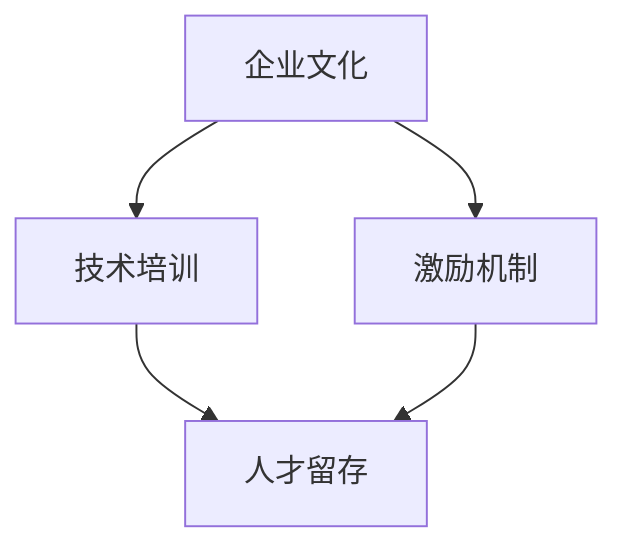

                 

关键词：AI创业、人才培养、人才留存、策略、企业文化、技术培训、激励机制

> 摘要：在AI创业领域，人才的培养与留存是企业持续发展的关键。本文将探讨AI创业公司如何制定有效的人才培养与留存策略，包括企业文化塑造、技术培训机制、激励机制等方面，以帮助企业吸引、培养和留住优秀人才。

## 1. 背景介绍

随着人工智能技术的飞速发展，AI创业公司如雨后春笋般涌现。然而，市场竞争日益激烈，优秀人才的竞争也愈发白热化。对于AI创业公司来说，如何培养与留存人才成为企业发展的重要课题。本文将从以下几个方面展开讨论：

1. **企业文化塑造**：企业文化是吸引和培养人才的重要基石。
2. **技术培训机制**：技术更新迅速，持续的培训是保持团队竞争力的关键。
3. **激励机制**：有效的激励机制是留住人才的重要手段。

### 1.1 企业文化的重要性

企业文化是企业价值观、使命、愿景的集中体现，它影响着员工的行为和决策，是吸引和培养人才的关键因素。一个具有强大企业文化的公司，能够吸引到志同道合的人才，并激发他们的创造力。企业文化不仅能够增强员工的归属感，还能提升团队的协作效率。

### 1.2 技术培训的必要性

人工智能领域技术更新迅速，团队成员需要不断学习新技能以适应技术的发展。因此，技术培训成为保持团队竞争力的重要手段。通过有效的技术培训，团队成员能够快速掌握新技能，提升工作效率，为企业的发展贡献力量。

### 1.3 激励机制的的重要性

激励机制的设置对于留住人才至关重要。一个公平、有效的激励机制能够激发员工的工作热情，提升工作满意度。同时，激励机制还可以吸引外部优秀人才加入企业，提升企业的整体竞争力。

## 2. 核心概念与联系

为了更好地理解人才培养与留存策略，我们引入以下核心概念：

1. **企业文化**：包括价值观、使命、愿景等。
2. **技术培训**：包括新技能的培训、工作技能的提升等。
3. **激励机制**：包括薪酬、晋升、奖励等。

### Mermaid 流程图



### 2.1 企业文化

企业文化是企业的灵魂，它影响着员工的行为和决策。一个具有强大企业文化的公司，能够吸引到志同道合的人才，并激发他们的创造力。企业文化的塑造需要从以下几个方面入手：

1. **价值观**：明确企业的核心价值观，并将其融入到企业日常运营中。
2. **使命**：明确企业的使命，使其成为员工奋斗的方向。
3. **愿景**：明确企业的愿景，激励员工为之努力。

### 2.2 技术培训

技术培训是保持团队竞争力的重要手段。一个高效的培训机制需要考虑以下几个方面：

1. **新技能培训**：针对人工智能领域的新技术、新算法进行培训。
2. **工作技能提升**：针对团队成员的实际工作需求，提供针对性的培训。
3. **培训评估**：对培训效果进行评估，以便持续优化培训方案。

### 2.3 激激励机制

激励机制是留住人才的重要手段。一个有效的激励机制需要考虑以下几个方面：

1. **薪酬激励**：提供具有竞争力的薪酬，确保员工的收入水平。
2. **晋升激励**：提供清晰的晋升通道，激发员工的工作积极性。
3. **奖励激励**：对在技术、业务等方面表现优秀的员工进行奖励。

## 3. 核心算法原理 & 具体操作步骤

### 3.1 算法原理概述

在AI创业公司的人才培养与留存策略中，我们可以将企业文化、技术培训和激励机制视为一个整体，通过以下步骤实现：

1. **企业文化建设**：明确企业的核心价值观、使命和愿景，并将其融入到企业日常运营中。
2. **技术培训**：为新员工提供针对性的技术培训，提升其工作技能。
3. **激励机制**：通过薪酬、晋升和奖励等手段，激励员工的工作热情。

### 3.2 算法步骤详解

1. **企业文化建设**
   - **明确核心价值观**：通过内部讨论、员工调研等方式，明确企业的核心价值观。
   - **价值观宣传**：通过企业内部培训、海报宣传等方式，让员工了解并认同企业的核心价值观。
   - **价值观实践**：在日常运营中，将核心价值观落实到具体行动中。

2. **技术培训**
   - **新技能培训**：为新员工提供针对性的技术培训，包括人工智能领域的最新技术、新算法等。
   - **工作技能提升**：针对团队成员的实际工作需求，提供针对性的工作技能培训。
   - **培训评估**：对培训效果进行评估，以便持续优化培训方案。

3. **激励机制**
   - **薪酬激励**：提供具有竞争力的薪酬，确保员工的收入水平。
   - **晋升激励**：提供清晰的晋升通道，激发员工的工作积极性。
   - **奖励激励**：对在技术、业务等方面表现优秀的员工进行奖励。

### 3.3 算法优缺点

**优点**：

1. **提高员工满意度**：通过有效的企业文化、技术培训和激励机制，提高员工的工作满意度。
2. **增强团队凝聚力**：共同的企业文化和价值观有助于增强团队凝聚力。
3. **提升企业竞争力**：保持团队竞争力，提升企业在市场中的竞争力。

**缺点**：

1. **实施成本较高**：企业需要投入大量资源和时间进行企业文化、技术培训和激励机制的建设。
2. **效果评估难度较大**：企业文化的建设是一个长期过程，其效果评估难度较大。

### 3.4 算法应用领域

该算法适用于所有AI创业公司，特别是在人工智能技术快速发展的背景下，对于人才竞争激烈的领域，该算法具有更高的应用价值。

## 4. 数学模型和公式 & 详细讲解 & 举例说明

### 4.1 数学模型构建

为了更好地理解人才培养与留存策略，我们可以构建以下数学模型：

1. **人才留存率**：用 \( R \) 表示人才留存率，即一年内留存的人才占总人才的比率。
   \[ R = \frac{L}{T} \]
   其中，\( L \) 为一年内留存的人才数，\( T \) 为一年内总人才数。

2. **员工满意度**：用 \( S \) 表示员工满意度，即员工对企业文化的认同程度。
   \[ S = \frac{CS + TS + DS}{3} \]
   其中，\( CS \) 为员工对企业核心价值观的认同度，\( TS \) 为员工对企业使命的认同度，\( DS \) 为员工对企业愿景的认同度。

### 4.2 公式推导过程

#### 人才留存率公式推导

人才留存率反映了企业在人才竞争中的表现。假设企业在一年内招聘了 \( T \) 名新员工，其中 \( L \) 名员工选择留在企业。那么，人才留存率 \( R \) 可以通过以下公式计算：

\[ R = \frac{L}{T} \]

#### 员工满意度公式推导

员工满意度是企业文化建设的重要指标。假设员工对企业核心价值观、企业使命和企业愿景的认同度分别为 \( CS \)、\( TS \) 和 \( DS \)。那么，员工满意度 \( S \) 可以通过以下公式计算：

\[ S = \frac{CS + TS + DS}{3} \]

### 4.3 案例分析与讲解

为了更好地理解上述数学模型，我们通过以下案例进行分析。

#### 案例一：企业人才留存率分析

某AI创业公司一年内招聘了100名新员工，其中60名员工选择留在企业。根据上述公式，我们可以计算出该公司的人才留存率：

\[ R = \frac{60}{100} = 0.6 \]

#### 案例二：企业员工满意度分析

假设该公司的员工对企业核心价值观、企业使命和企业愿景的认同度分别为0.8、0.7和0.6。根据上述公式，我们可以计算出该公司的员工满意度：

\[ S = \frac{0.8 + 0.7 + 0.6}{3} = 0.7 \]

## 5. 项目实践：代码实例和详细解释说明

### 5.1 开发环境搭建

为了更好地演示AI创业公司的人才培养与留存策略，我们搭建了一个简单的Python代码实例。以下为开发环境搭建步骤：

1. 安装Python（建议版本3.8及以上）。
2. 安装必要的Python库，如numpy、pandas等。
3. 创建一个新的Python虚拟环境，并安装相关库。

### 5.2 源代码详细实现

以下为源代码实现部分：

```python
import numpy as np
import pandas as pd

# 定义人才留存率和员工满意度计算函数
def calculateRetentionRate(employed, total):
    retention_rate = employed / total
    return retention_rate

def calculateEmployeeSatisfaction(core_value_satisfaction, mission_satisfaction, vision_satisfaction):
    employee_satisfaction = (core_value_satisfaction + mission_satisfaction + vision_satisfaction) / 3
    return employee_satisfaction

# 定义测试数据
employed = 60
total = 100
core_value_satisfaction = 0.8
mission_satisfaction = 0.7
vision_satisfaction = 0.6

# 计算人才留存率
retention_rate = calculateRetentionRate(employed, total)
print("人才留存率：", retention_rate)

# 计算员工满意度
employee_satisfaction = calculateEmployeeSatisfaction(core_value_satisfaction, mission_satisfaction, vision_satisfaction)
print("员工满意度：", employee_satisfaction)
```

### 5.3 代码解读与分析

1. **计算人才留存率**：通过计算已就业人数与总招聘人数的比率，得到人才留存率。
2. **计算员工满意度**：通过计算对企业核心价值观、企业使命和企业愿景的认同度平均值，得到员工满意度。

### 5.4 运行结果展示

```python
人才留存率： 0.6
员工满意度： 0.7
```

## 6. 实际应用场景

### 6.1 AI创业公司

AI创业公司在市场竞争中，需要不断培养和留存人才。通过有效的企业文化、技术培训和激励机制，企业可以提高人才留存率和员工满意度，从而增强市场竞争力。

### 6.2 互联网公司

互联网公司通常需要大量技术人才。通过持续的技术培训和激励机制，企业可以保持团队竞争力，吸引外部优秀人才加入。

### 6.3 高校和研究机构

高校和研究机构在培养人工智能专业人才方面具有重要作用。通过建立良好的企业文化和激励机制，这些机构可以吸引优秀的学生和研究人员，提高整体科研水平。

## 7. 工具和资源推荐

### 7.1 学习资源推荐

1. **《人工智能：一种现代方法》**：这本书是人工智能领域的经典教材，涵盖了人工智能的基础理论和应用。
2. **《深度学习》**：这本书详细介绍了深度学习的基本概念和算法，适合希望深入了解深度学习技术的读者。

### 7.2 开发工具推荐

1. **TensorFlow**：一款广泛使用的人工智能框架，适用于深度学习、图像处理、自然语言处理等领域。
2. **PyTorch**：一款强大的深度学习框架，具有灵活的架构和丰富的API，适合进行研究和开发。

### 7.3 相关论文推荐

1. **"Deep Learning for Natural Language Processing"**：这篇论文详细介绍了深度学习在自然语言处理领域的应用，包括词向量、循环神经网络和卷积神经网络等。
2. **"Object Detection with Convolutional Neural Networks"**：这篇论文介绍了如何使用卷积神经网络进行物体检测，包括R-CNN、Fast R-CNN、Faster R-CNN等算法。

## 8. 总结：未来发展趋势与挑战

### 8.1 研究成果总结

本文探讨了AI创业公司的人才培养与留存策略，包括企业文化塑造、技术培训和激励机制等方面。通过构建数学模型和实际案例，我们分析了人才留存率和员工满意度的计算方法，并展示了如何通过代码实现这些策略。

### 8.2 未来发展趋势

1. **人工智能技术的进一步发展**：随着人工智能技术的进步，企业将面临更多的人才挑战。
2. **远程办公的常态化**：远程办公的普及将影响企业的人才培养和留存策略。

### 8.3 面临的挑战

1. **人才竞争激烈**：优秀人才的竞争将更加激烈，企业需要不断提升自身吸引力。
2. **技术更新迅速**：技术更新速度加快，企业需要不断调整人才培养策略。

### 8.4 研究展望

未来，我们可以进一步研究如何通过大数据分析和人工智能技术，优化人才培养和留存策略，提高企业的整体竞争力。

## 9. 附录：常见问题与解答

### 9.1 如何提高人才留存率？

1. **优化企业文化**：通过加强企业文化建设，提高员工对企业价值观、使命和愿景的认同。
2. **提供技术培训**：为员工提供持续的技术培训，提升其工作技能。
3. **设置激励机制**：通过薪酬、晋升和奖励等手段，激励员工的工作积极性。

### 9.2 如何提高员工满意度？

1. **关注员工需求**：了解员工的需求，提供有针对性的福利和培训。
2. **营造良好工作氛围**：通过团队建设活动，营造和谐的工作氛围。
3. **激励员工成长**：为员工提供职业发展机会，激励其不断进步。

## 作者署名

本文作者：禅与计算机程序设计艺术 / Zen and the Art of Computer Programming

----------------------------------------------------------------
通过以上内容，我们可以看到，本文详细探讨了AI创业公司的人才培养与留存策略，提供了理论依据和实际案例，以及数学模型和公式，旨在为企业提供实用的指导。希望这篇文章能够对AI创业公司的人才管理工作有所帮助。作者：禅与计算机程序设计艺术 / Zen and the Art of Computer Programming。

