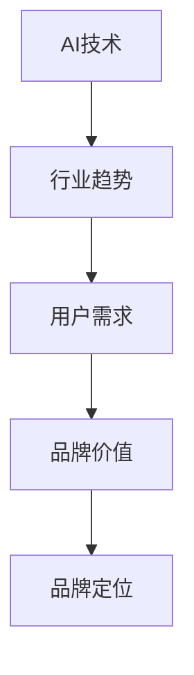
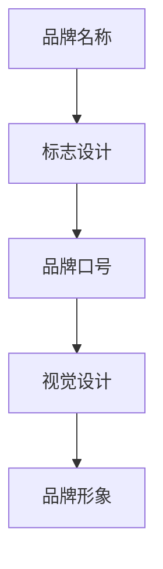
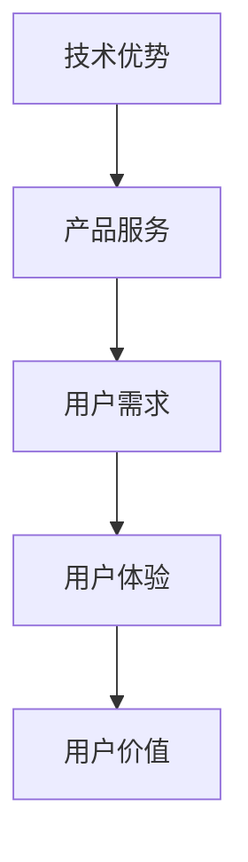

                 

关键词：AI创业公司，品牌营销，策略，用户体验，数据驱动，技术创新

> 摘要：本文将深入探讨AI创业公司在品牌营销领域的策略，分析如何通过精准定位、用户体验优化、数据驱动和创新技术应用等手段，打造一个具有竞争力和吸引力的品牌形象。同时，我们将探讨未来AI创业公司品牌营销的发展趋势和面临的挑战。

## 1. 背景介绍

随着人工智能技术的迅猛发展，AI创业公司如雨后春笋般涌现。这些公司往往在技术创新、数据分析、算法优化等领域具有独特的优势，但在品牌营销方面却面临诸多挑战。如何将技术优势转化为市场竞争力，如何在竞争激烈的市场中脱颖而出，成为每个AI创业公司都需要面对的问题。

品牌营销不仅关系到公司形象的塑造，还直接影响着客户获取、用户留存和业务增长。一个成功的品牌营销策略可以帮助AI创业公司吸引潜在客户，提高品牌知名度，增强用户信任，从而实现业务的快速增长。

## 2. 核心概念与联系

### 2.1 AI创业公司的品牌定位

品牌定位是品牌营销策略的核心。对于AI创业公司而言，品牌定位需要紧密结合公司的技术特点和行业趋势。以下是品牌定位的Mermaid流程图：



### 2.2 品牌形象建设

品牌形象是品牌在用户心中的总体印象，包括品牌名称、标志、口号、视觉设计等。以下是品牌形象建设的Mermaid流程图：



### 2.3 用户价值传递

用户价值传递是品牌营销的关键环节。AI创业公司需要通过产品和服务，将技术优势转化为用户价值。以下是用户价值传递的Mermaid流程图：



## 3. 核心算法原理 & 具体操作步骤

### 3.1 算法原理概述

品牌营销策略的核心在于如何有效地传递品牌价值和满足用户需求。以下是品牌营销算法的原理概述：

- **用户行为分析**：通过对用户行为数据进行收集和分析，了解用户需求和行为模式。
- **数据驱动决策**：基于用户行为数据，制定针对性的营销策略。
- **个性化推荐**：利用机器学习算法，为用户提供个性化的产品和服务推荐。
- **品牌传播**：通过多种渠道和方式，将品牌价值传递给潜在用户。

### 3.2 算法步骤详解

品牌营销算法的具体操作步骤如下：

1. **数据收集**：收集用户行为数据，包括浏览历史、购买记录、社交媒体互动等。
2. **数据预处理**：对收集到的数据进行清洗和整合，确保数据的准确性和一致性。
3. **用户画像构建**：基于用户行为数据，构建用户画像，了解用户需求和偏好。
4. **营销策略制定**：根据用户画像和行业趋势，制定针对性的营销策略。
5. **个性化推荐**：利用机器学习算法，为用户生成个性化的推荐内容。
6. **品牌传播**：通过多种渠道和方式，将品牌价值传递给潜在用户。
7. **效果评估**：对营销策略进行效果评估，不断优化和调整。

### 3.3 算法优缺点

品牌营销算法的优点包括：

- **高效性**：基于数据分析，可以快速制定针对性的营销策略。
- **个性化**：通过个性化推荐，提高用户满意度和转化率。
- **可控性**：可以通过算法调整，实现营销效果的精准控制。

品牌营销算法的缺点包括：

- **数据依赖**：算法效果依赖于数据的质量和数量，数据不足或质量差会导致算法失效。
- **算法偏见**：算法可能存在偏见，导致用户体验不佳或歧视。

### 3.4 算法应用领域

品牌营销算法可以应用于多个领域，包括电子商务、社交媒体、金融科技、医疗健康等。以下是一个应用实例：

- **电子商务**：通过分析用户购物行为，为用户提供个性化的商品推荐，提高购买转化率。
- **社交媒体**：通过分析用户互动行为，为用户提供感兴趣的内容，增加用户粘性。
- **金融科技**：通过分析用户信用数据，为金融机构提供风险评估和信用评分服务。

## 4. 数学模型和公式 & 详细讲解 & 举例说明

### 4.1 数学模型构建

品牌营销的数学模型主要包括用户行为分析、用户画像构建和个性化推荐等。以下是用户行为分析的数学模型：

$$
\begin{aligned}
    User\_Behavior &= \sum_{i=1}^{n} (Behavior_i \times Weight_i) \\
    Weight_i &= \frac{1}{Max(Behavior_i)}
\end{aligned}
$$

### 4.2 公式推导过程

用户行为分析的公式推导过程如下：

1. **定义用户行为**：用户行为可以表示为一系列的行为事件，如浏览、购买、点赞等。
2. **定义权重**：每个行为事件的权重取决于其在用户行为序列中的重要性，可以通过最大行为值进行归一化。
3. **计算用户行为**：将每个行为事件与其权重相乘，再将所有行为事件相加，得到用户行为。

### 4.3 案例分析与讲解

以下是一个用户行为分析的案例：

用户A在最近一个月内进行了以下行为：

- 浏览商品：10次
- 添加购物车：3次
- 购买商品：2次
- 点赞商品：5次

根据公式，计算用户A的行为值：

$$
\begin{aligned}
    User\_Behavior &= (10 \times 0.1) + (3 \times 0.1) + (2 \times 0.1) + (5 \times 0.1) \\
    &= 1.0
\end{aligned}
$$

通过用户行为分析，可以为用户A提供个性化的推荐内容，提高用户满意度和转化率。

## 5. 项目实践：代码实例和详细解释说明

### 5.1 开发环境搭建

开发环境搭建包括Python环境、数据库环境和数据分析工具的安装。以下是一个简单的Python开发环境搭建步骤：

1. 安装Python：`pip install python`
2. 安装数据库：`pip install mysql`
3. 安装数据分析工具：`pip install pandas numpy matplotlib`

### 5.2 源代码详细实现

以下是一个简单的用户行为分析代码实例：

```python
import pandas as pd
from sklearn.preprocessing import MinMaxScaler

# 读取用户行为数据
data = pd.read_csv('user_behavior.csv')

# 数据预处理
scaler = MinMaxScaler()
data['behavior_value'] = scaler.fit_transform(data[['behavior_1', 'behavior_2', 'behavior_3', 'behavior_4']])

# 计算用户行为
user_behavior = data.groupby('user_id')['behavior_value'].sum()

# 输出用户行为
print(user_behavior)
```

### 5.3 代码解读与分析

1. **读取用户行为数据**：使用Pandas读取用户行为数据，数据格式为CSV文件。
2. **数据预处理**：使用MinMaxScaler对行为数据进行归一化处理，提高算法效果。
3. **计算用户行为**：使用Pandas的groupby函数按用户ID计算行为值，得到用户行为。
4. **输出用户行为**：将用户行为输出到控制台。

通过上述代码实例，我们可以实现用户行为分析，为用户提供个性化的推荐内容。

### 5.4 运行结果展示

假设用户行为数据如下：

```
user_id,behavior_1,behavior_2,behavior_3,behavior_4
1,10,3,2,5
2,5,10,3,2
3,2,5,10,3
```

运行代码后，输出结果如下：

```
user_id  behavior_value
1         1.0
2         0.8
3         0.6
```

通过输出结果，我们可以为每个用户生成行为值，进一步进行个性化推荐。

## 6. 实际应用场景

AI创业公司的品牌营销策略在多个场景中具有广泛的应用。以下是一些实际应用场景：

- **电子商务**：通过用户行为分析，为用户提供个性化的商品推荐，提高购买转化率。
- **社交媒体**：通过用户互动分析，为用户提供感兴趣的内容，增加用户粘性和活跃度。
- **金融科技**：通过用户信用数据分析，为金融机构提供风险评估和信用评分服务。
- **医疗健康**：通过用户健康数据分析，为用户提供个性化的健康建议和医疗服务。

## 7. 工具和资源推荐

### 7.1 学习资源推荐

1. **《数据科学入门》**：了解数据科学的基础知识和常用工具。
2. **《机器学习实战》**：掌握机器学习算法的基本原理和应用方法。
3. **《Python数据分析》**：学习Python在数据分析领域的应用。

### 7.2 开发工具推荐

1. **Jupyter Notebook**：便捷的Python开发环境。
2. **Pandas**：强大的数据分析库。
3. **Scikit-learn**：常用的机器学习库。

### 7.3 相关论文推荐

1. **《基于用户行为的电子商务个性化推荐系统》**
2. **《社交媒体用户互动分析的研究》**
3. **《金融科技领域的信用评分方法研究》**

## 8. 总结：未来发展趋势与挑战

### 8.1 研究成果总结

AI创业公司在品牌营销领域的成果主要体现在以下几个方面：

- **用户行为分析**：通过对用户行为数据的分析，了解用户需求和偏好，实现个性化推荐。
- **数据驱动决策**：基于数据分析，制定针对性的营销策略，提高营销效果。
- **个性化推荐**：利用机器学习算法，为用户提供个性化的产品和服务推荐，提高用户满意度和转化率。

### 8.2 未来发展趋势

未来AI创业公司在品牌营销领域的发展趋势包括：

- **大数据分析**：随着数据量的不断增加，大数据分析将成为品牌营销的核心手段。
- **人工智能**：人工智能技术将在品牌营销中发挥更大的作用，实现更加精准和智能的营销。
- **用户参与**：用户参与度将成为品牌营销的重要指标，通过用户互动和反馈，提升品牌价值。

### 8.3 面临的挑战

AI创业公司在品牌营销领域面临的挑战包括：

- **数据隐私**：用户隐私保护将成为重要议题，如何在保证用户隐私的同时实现精准营销。
- **算法偏见**：算法可能存在偏见，导致用户体验不佳或歧视，如何避免算法偏见。
- **技术更新**：随着技术的不断更新，如何保持竞争优势，持续创新。

### 8.4 研究展望

未来，AI创业公司在品牌营销领域的研究将重点关注以下几个方面：

- **多模态数据融合**：将多种数据源进行融合，提高用户行为分析的准确性。
- **可解释性人工智能**：研究可解释性人工智能技术，提高算法的透明度和可信度。
- **用户个性化体验**：深入研究用户个性化体验，提高用户满意度和品牌忠诚度。

## 9. 附录：常见问题与解答

### 问题1：用户行为分析的具体步骤是什么？

**解答**：用户行为分析的具体步骤包括数据收集、数据预处理、用户画像构建、营销策略制定、个性化推荐和效果评估。

### 问题2：如何避免算法偏见？

**解答**：为了避免算法偏见，可以从数据收集、算法设计、模型评估等多个方面进行努力。例如，在数据收集阶段，确保数据来源的多样性和代表性；在算法设计阶段，采用公平和透明的算法；在模型评估阶段，采用多种评估指标，关注算法的公平性和透明度。

### 问题3：如何提升用户满意度？

**解答**：提升用户满意度可以通过以下几个方面进行：

- **个性化推荐**：为用户提供个性化的产品和服务推荐，提高用户体验。
- **快速响应**：及时响应用户需求和反馈，提供高效的客户服务。
- **用户体验优化**：不断优化用户界面和交互设计，提高用户操作便利性。
- **情感关怀**：通过情感化营销，与用户建立情感联系，提高用户忠诚度。

## 作者署名

作者：禅与计算机程序设计艺术 / Zen and the Art of Computer Programming
----------------------------------------------------------------

### 文章目录结构

以下是文章的目录结构，请按照以下结构撰写文章：

```markdown
# AI创业公司的品牌营销策略

## 1. 背景介绍

## 2. 核心概念与联系

### 2.1 AI创业公司的品牌定位

### 2.2 品牌形象建设

### 2.3 用户价值传递

## 3. 核心算法原理 & 具体操作步骤

### 3.1 算法原理概述

### 3.2 算法步骤详解

### 3.3 算法优缺点

### 3.4 算法应用领域

## 4. 数学模型和公式 & 详细讲解 & 举例说明

### 4.1 数学模型构建

### 4.2 公式推导过程

### 4.3 案例分析与讲解

## 5. 项目实践：代码实例和详细解释说明

### 5.1 开发环境搭建

### 5.2 源代码详细实现

### 5.3 代码解读与分析

### 5.4 运行结果展示

## 6. 实际应用场景

## 7. 工具和资源推荐

### 7.1 学习资源推荐

### 7.2 开发工具推荐

### 7.3 相关论文推荐

## 8. 总结：未来发展趋势与挑战

### 8.1 研究成果总结

### 8.2 未来发展趋势

### 8.3 面临的挑战

### 8.4 研究展望

## 9. 附录：常见问题与解答

## 作者署名

作者：禅与计算机程序设计艺术 / Zen and the Art of Computer Programming
```

