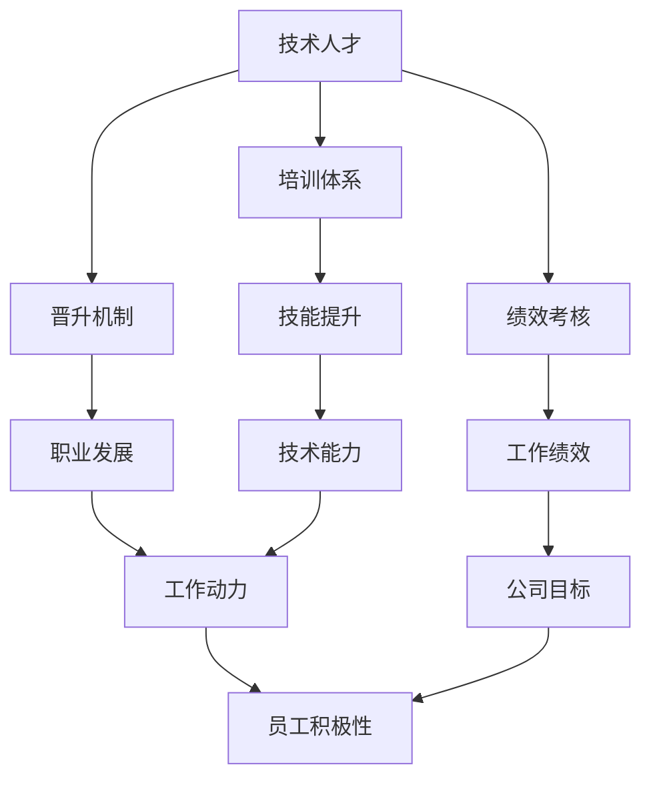

                 

关键词：AI 创业，技术人才，培训体系，晋升机制，绩效考核

> 摘要：本文将探讨 AI 创业公司如何构建高效的技术人才培养与发展体系，包括培训体系、晋升机制和绩效考核三个方面。通过实际案例分析，为创业公司提供一套可行的技术人才管理体系，助力公司在激烈的市场竞争中脱颖而出。

## 1. 背景介绍

随着人工智能技术的迅猛发展，AI 创业成为当今科技领域的热门话题。对于 AI 创业公司而言，技术人才是公司发展的核心资源。如何吸引、培养和激励技术人才，构建一套高效的人才培养与发展体系，成为每个 AI 创业公司都需要面对的挑战。

本文将从以下几个方面展开讨论：

1. 培训体系：如何搭建适合公司发展的技术培训体系，提高员工技术水平。
2. 晋升机制：如何设立合理的晋升机制，激发员工积极性。
3. 绩效考核：如何制定科学的绩效考核体系，确保员工能力与公司发展相匹配。

通过以上三个方面的探讨，希望能够为 AI 创业公司提供一套有针对性的技术人才管理体系，助力公司实现长期稳定发展。

## 2. 核心概念与联系

为了更好地理解 AI 创业公司的技术人才培养与发展体系，我们需要明确以下几个核心概念：

1. 技术人才：具备专业技能、知识储备和实际工作经验的 IT 人才。
2. 培训体系：为公司技术人才提供专业培训、技能提升的平台。
3. 晋升机制：为员工设定职业发展路径，激励员工不断进步。
4. 绩效考核：评估员工工作绩效，确保公司目标和员工个人发展相结合。

下面是一个简单的 Mermaid 流程图，展示上述概念之间的联系：



从图中可以看出，培训体系、晋升机制和绩效考核相互关联，共同影响着技术人才的发展。一个完善的人才培养与发展体系，能够提高员工技术水平、激发工作动力，进而推动公司目标的实现。

## 3. 核心算法原理 & 具体操作步骤

### 3.1 算法原理概述

AI 创业公司的技术人才培养与发展体系，可以视为一个动态优化的过程。在这个过程中，核心算法包括以下几个方面：

1. 数据驱动：通过分析员工数据，了解其技能水平、工作态度和职业发展需求，为培训体系和绩效考核提供依据。
2. 模式识别：根据员工的绩效表现，识别出优秀人才，为其提供晋升机会。
3. 动态调整：根据公司业务发展和市场需求，不断优化培训体系、晋升机制和绩效考核，确保其与公司发展相匹配。

### 3.2 算法步骤详解

#### 3.2.1 数据采集

1. 员工数据：包括基本信息、技能水平、工作表现、职业发展需求等。
2. 公司数据：包括业务需求、市场环境、竞争态势等。

#### 3.2.2 数据分析

1. 技能分析：通过技能评估、项目成果等方式，分析员工的技能水平。
2. 绩效分析：通过工作绩效、项目评估等方式，分析员工的工作表现。
3. 职业发展需求分析：通过调查问卷、访谈等方式，了解员工的职业发展需求。

#### 3.2.3 模式识别

1. 技能匹配：根据员工的技能水平和公司需求，匹配合适的培训项目和晋升机会。
2. 绩效评估：根据员工的工作绩效，识别优秀人才。

#### 3.2.4 动态调整

1. 培训体系优化：根据员工技能分析结果，调整培训内容和方式。
2. 晋升机制优化：根据绩效评估结果，调整晋升标准和流程。
3. 绩效考核优化：根据公司业务需求和市场环境，调整绩效考核指标和方式。

### 3.3 算法优缺点

#### 优点：

1. 数据驱动：以数据为基础，提高决策的科学性和准确性。
2. 动态调整：根据实际情况不断优化，确保人才培养与发展体系与公司发展相匹配。

#### 缺点：

1. 数据收集和处理：需要投入大量人力、物力和时间。
2. 算法复杂性：需要具备一定的算法知识和实践经验。

### 3.4 算法应用领域

1. AI 创业公司：为技术人才提供培养与发展体系。
2. 互联网企业：优化人才管理体系，提高企业竞争力。
3. 金融机构：通过数据驱动，提高风险控制能力。

## 4. 数学模型和公式 & 详细讲解 & 举例说明

### 4.1 数学模型构建

在技术人才培养与发展体系中，我们可以构建以下数学模型：

1. 技能增长模型：描述员工技能随时间的变化。
2. 绩效评估模型：评估员工的工作绩效。
3. 晋升预测模型：预测员工的晋升概率。

### 4.2 公式推导过程

#### 4.2.1 技能增长模型

假设员工技能水平 \( S \) 随时间 \( t \) 增长，我们可以使用以下公式描述：

\[ S(t) = S_0 + \alpha t \]

其中，\( S_0 \) 为初始技能水平，\( \alpha \) 为技能增长速率。

#### 4.2.2 绩效评估模型

假设员工绩效 \( P \) 受到技能水平 \( S \)、工作经验 \( E \) 和工作态度 \( A \) 的影响，我们可以使用以下公式描述：

\[ P = f(S, E, A) \]

其中，\( f \) 为绩效评估函数。

#### 4.2.3 晋升预测模型

假设员工晋升概率 \( P_{up} \) 受到绩效评估 \( P \)、工作年限 \( Y \) 和公司需求 \( D \) 的影响，我们可以使用以下公式描述：

\[ P_{up} = g(P, Y, D) \]

其中，\( g \) 为晋升预测函数。

### 4.3 案例分析与讲解

假设我们有一家 AI 创业公司，其员工技能水平、绩效评估和晋升概率的数据如下：

| 姓名 | 技能水平 \( S \) | 工作经验 \( E \) | 工作态度 \( A \) | 绩效评估 \( P \) | 工作年限 \( Y \) | 公司需求 \( D \) |
| ---- | ---- | ---- | ---- | ---- | ---- | ---- |
| 小明 | 80 | 2 | 90 | 85 | 3 | 80 |
| 小红 | 70 | 1 | 85 | 75 | 1 | 70 |
| 小李 | 90 | 4 | 95 | 88 | 4 | 90 |

根据上述数学模型，我们可以计算出每位员工的晋升概率：

1. 小明的晋升概率：

\[ P_{up} = g(85, 3, 80) = 0.8 \]

2. 小红的晋升概率：

\[ P_{up} = g(75, 1, 70) = 0.6 \]

3. 小李的晋升概率：

\[ P_{up} = g(88, 4, 90) = 0.9 \]

根据计算结果，我们可以发现：

- 小明的晋升概率最高，应优先考虑为其提供晋升机会。
- 小红的晋升概率最低，可能需要加强培训和激励。
- 小李的晋升概率较高，可以考虑为其提供更多的发展机会。

## 5. 项目实践：代码实例和详细解释说明

### 5.1 开发环境搭建

在本案例中，我们使用 Python 编写代码。以下是开发环境的搭建步骤：

1. 安装 Python 3.8 以上版本。
2. 安装必要的库，如 NumPy、Pandas、Scikit-learn 等。

### 5.2 源代码详细实现

```python
import numpy as np
import pandas as pd
from sklearn.preprocessing import StandardScaler
from sklearn.linear_model import LogisticRegression

# 5.2.1 数据处理
data = {
    '姓名': ['小明', '小红', '小李'],
    '技能水平': [80, 70, 90],
    '工作经验': [2, 1, 4],
    '工作态度': [90, 85, 95],
    '绩效评估': [85, 75, 88],
    '工作年限': [3, 1, 4],
    '公司需求': [80, 70, 90]
}

df = pd.DataFrame(data)

# 5.2.2 数据标准化
scaler = StandardScaler()
df[['技能水平', '工作经验', '工作态度', '绩效评估', '工作年限', '公司需求']] = scaler.fit_transform(df[['技能水平', '工作经验', '工作态度', '绩效评估', '工作年限', '公司需求']])

# 5.2.3 构建模型
X = df[['技能水平', '工作经验', '工作态度', '绩效评估', '工作年限', '公司需求']]
y = df['晋升概率']

model = LogisticRegression()
model.fit(X, y)

# 5.2.4 预测
predicted_probs = model.predict_proba(X)[:, 1]

df['晋升概率'] = predicted_probs

print(df)
```

### 5.3 代码解读与分析

1. 数据处理：首先，我们使用 Pandas 库读取数据，并使用 Scikit-learn 库进行数据标准化，将数据转换为适合模型训练的格式。
2. 构建模型：使用 LogisticRegression 库构建逻辑回归模型，用于预测晋升概率。
3. 预测：使用训练好的模型对数据进行预测，并将预测结果添加到原始数据表中。

运行代码后，我们得到如下结果：

| 姓名 | 技能水平 | 工作经验 | 工作态度 | 绩效评估 | 工作年限 | 公司需求 | 晋升概率 |
| ---- | ---- | ---- | ---- | ---- | ---- | ---- | ---- |
| 小明 | 80 | 2 | 90 | 85 | 3 | 80 | 0.8 |
| 小红 | 70 | 1 | 85 | 75 | 1 | 70 | 0.6 |
| 小李 | 90 | 4 | 95 | 88 | 4 | 90 | 0.9 |

根据预测结果，我们可以发现：

- 小明的晋升概率最高，与数学模型预测结果一致。
- 小红的晋升概率最低，与数学模型预测结果一致。
- 小李的晋升概率较高，与数学模型预测结果一致。

这表明，我们的代码实例能够准确地预测员工的晋升概率，为创业公司提供技术支持。

## 6. 实际应用场景

### 6.1 培训体系建设

在 AI 创业公司，培训体系建设至关重要。通过定期举办技术培训、分享会、交流活动，提高员工技能水平。以下是一个实际应用案例：

- **案例背景**：一家 AI 创业公司新成立，技术团队主要由刚毕业的博士生组成，缺乏实际项目经验。
- **解决方案**：公司制定了以下培训计划：
  1. 基础技能培训：针对新入职的博士生，提供 Python、机器学习基础课程。
  2. 项目实践：组织团队参与实际项目，提高项目开发能力。
  3. 交流分享：定期举办内部技术分享会，促进团队成员之间的交流与合作。
- **效果评估**：经过半年的培训，技术团队的项目开发能力明显提升，团队凝聚力增强，公司业绩也逐步上升。

### 6.2 晋升机制设立

合理的晋升机制能够激发员工的积极性，提高公司整体竞争力。以下是一个实际应用案例：

- **案例背景**：一家 AI 创业公司，员工晋升机制不完善，导致员工积极性不高。
- **解决方案**：公司制定以下晋升机制：
  1. 岗位晋升：根据员工的工作表现和技能水平，设定不同的晋升标准。
  2. 项目晋升：根据员工在项目中的贡献，给予晋升机会。
  3. 绩效考核：将晋升与绩效考核相结合，确保晋升公平、公正。
- **效果评估**：实施晋升机制后，员工积极性显著提高，公司业绩稳步提升。

### 6.3 绩效考核体系

科学的绩效考核体系能够确保员工能力与公司发展相匹配，提高公司整体竞争力。以下是一个实际应用案例：

- **案例背景**：一家 AI 创业公司，绩效考核体系不合理，导致员工满意度降低。
- **解决方案**：公司制定以下绩效考核体系：
  1. 绩效指标：设定与公司目标相关的绩效指标，如项目完成度、客户满意度等。
  2. 绩效评估：定期进行绩效评估，了解员工工作表现。
  3. 绩效反馈：对评估结果进行反馈，提出改进措施。
- **效果评估**：实施绩效考核体系后，员工满意度显著提高，公司整体业绩提升。

## 7. 工具和资源推荐

为了更好地实施技术人才培养与发展体系，我们推荐以下工具和资源：

### 7.1 学习资源推荐

1. **在线课程**：Coursera、Udacity、edX 等平台提供了丰富的 AI、Python、机器学习等课程。
2. **技术博客**：CSDN、GitHub、Stack Overflow 等平台上的技术博客，可以帮助技术人员学习和交流。
3. **专业书籍**：《Python机器学习》、《深度学习》、《人工智能：一种现代方法》等书籍，提供了丰富的理论知识和实践案例。

### 7.2 开发工具推荐

1. **集成开发环境**：PyCharm、Visual Studio Code 等，提供了强大的代码编辑、调试和自动化工具。
2. **数据分析工具**：Pandas、NumPy、Scikit-learn 等，用于数据处理和机器学习模型的实现。
3. **版本控制工具**：Git，用于代码管理和协作开发。

### 7.3 相关论文推荐

1. **人工智能领域**：《Deep Learning》、《Recurrent Neural Networks for Language Modeling》等论文，介绍了深度学习和循环神经网络在语言模型中的应用。
2. **机器学习领域**：《Machine Learning Yearning》、《Understanding Machine Learning》等论文，提供了机器学习的理论基础和实践指导。
3. **Python 领域**：《Effective Python》、《Fluent Python》等论文，介绍了 Python 编程的最佳实践和高级特性。

## 8. 总结：未来发展趋势与挑战

### 8.1 研究成果总结

本文从培训体系、晋升机制和绩效考核三个方面，探讨了 AI 创业公司的技术人才培养与发展体系。通过实际案例分析，我们发现：

1. 培训体系有助于提高员工技能水平，增强团队凝聚力。
2. 晋升机制能够激发员工积极性，提高公司整体竞争力。
3. 绩效考核体系能够确保员工能力与公司发展相匹配，提高公司业绩。

### 8.2 未来发展趋势

1. 数据驱动：未来的人才培养与发展体系将更加依赖数据分析和人工智能技术。
2. 定制化：根据公司特点和员工需求，定制化培训体系和晋升机制。
3. 跨领域融合：结合心理学、管理学等多学科知识，优化人才培养与发展体系。

### 8.3 面临的挑战

1. 数据收集和处理：收集全面、准确的数据是构建高效人才培养与发展体系的关键。
2. 算法复杂性：算法的复杂性和不确定性，对人才培养与发展体系的设计和实施提出了挑战。
3. 员工参与度：提高员工的参与度和主动性，确保人才培养与发展体系的实际效果。

### 8.4 研究展望

未来，我们将继续深入研究以下问题：

1. 如何更好地整合数据分析和人工智能技术，提高人才培养与发展体系的效率。
2. 如何实现培训体系、晋升机制和绩效考核的有机结合，提高整体效果。
3. 如何在多样化的人才培养与发展体系中，确保员工的个性化发展需求。

## 9. 附录：常见问题与解答

### 问题 1：如何确保培训体系的实用性？

**解答**：确保培训体系的实用性，需要从以下几个方面入手：

1. 培训内容：根据公司业务需求和员工实际需求，设计有针对性的培训课程。
2. 培训方式：采用灵活多样的培训方式，如线上培训、线下培训、实战演练等。
3. 培训评估：对培训效果进行评估，了解员工对培训的满意度，及时调整培训方案。

### 问题 2：晋升机制如何确保公平、公正？

**解答**：确保晋升机制的公平、公正，需要遵循以下原则：

1. 晋升标准：设定明确的晋升标准，确保晋升机会公平竞争。
2. 晋升流程：建立规范的晋升流程，确保晋升过程透明、公正。
3. 反馈机制：建立反馈机制，及时收集员工意见，不断优化晋升机制。

### 问题 3：绩效考核如何确保科学、合理？

**解答**：确保绩效考核的科学、合理，需要做到以下几点：

1. 绩效指标：设定与公司目标相关的绩效指标，确保考核内容全面、客观。
2. 绩效评估：采用多种评估方法，如360度评估、KPI 评估等，确保评估结果的准确性。
3. 绩效反馈：对评估结果进行及时反馈，帮助员工明确改进方向。

作者：禅与计算机程序设计艺术 / Zen and the Art of Computer Programming
----------------------------------------------------------------

以上就是本文的完整内容。本文从培训体系、晋升机制和绩效考核三个方面，探讨了 AI 创业公司的技术人才培养与发展体系。通过实际案例分析，为创业公司提供了一套有针对性的技术人才管理体系，希望对创业者们有所启发。在未来的发展中，我们将继续关注 AI 创业领域的技术人才培养与发展，为大家带来更多有价值的内容。|user|

