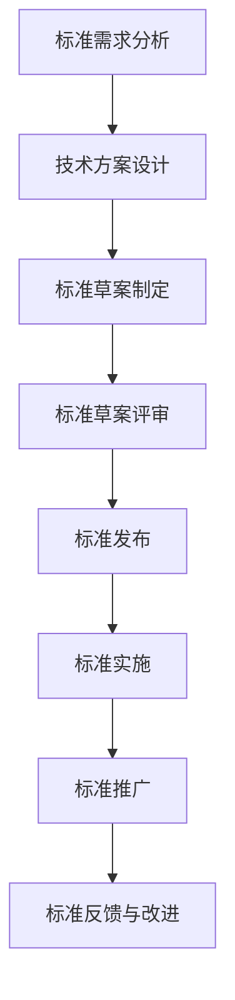

                 

关键词：AI创业公司，技术标准化，标准制定，标准实施，标准推广，AI技术发展

摘要：随着人工智能（AI）技术的快速发展，创业公司在技术标准化方面扮演着越来越重要的角色。本文从标准制定、标准实施与标准推广三个方面，探讨了AI创业公司的技术标准化参与策略，为创业公司提供了实用的指导建议。

## 1. 背景介绍

近年来，人工智能（AI）技术取得了飞速发展，已经渗透到各个领域，从医疗、金融到自动驾驶、智能家居等。在这个快速发展的背景下，技术标准化成为了一个备受关注的话题。标准化不仅有助于提高技术成熟度和互操作性，还能促进产业协同和资源整合，从而推动整个行业的健康发展。

AI创业公司在技术标准化方面具有独特的优势和挑战。一方面，它们往往具有创新精神和快速迭代的能力，能够及时响应市场需求和技术变化；另一方面，由于资源有限，创业公司可能面临技术积累不足、行业标准不明确等挑战。因此，如何制定有效的技术标准化参与策略，对于AI创业公司来说至关重要。

本文将从标准制定、标准实施与标准推广三个方面，探讨AI创业公司的技术标准化参与策略，以期为其提供一些实用的指导建议。

## 2. 核心概念与联系

在探讨AI创业公司的技术标准化参与策略之前，我们需要明确几个核心概念，并理解它们之间的联系。

### 2.1 标准的定义

标准是指在一定范围内，对活动或其结果规定共同的和重复使用的规则、导则或特性文件。它以科学、技术和经验的综合成果为基础，经有关方面协商一致制定并公开发布。

### 2.2 技术标准

技术标准是指针对特定技术领域制定的一系列规范、规则和指南，用于指导产品或服务的开发、生产、测试和验证等过程。技术标准通常包括技术规范、测试方法、评估指标等。

### 2.3 标准化组织

标准化组织是指负责制定、发布和维护技术标准的机构。国际标准化组织（ISO）、国际电信联盟（ITU）、美国国家标准协会（ANSI）等是典型的标准化组织。

### 2.4 标准制定、实施与推广

标准制定是指从市场需求、技术发展等方面出发，提出并制定技术标准的过程。标准实施是指将制定好的技术标准应用于产品或服务的开发、生产、测试和验证等过程。标准推广是指通过各种渠道和手段，宣传、推广和应用技术标准，以提高其普及度和影响力。

### 2.5 Mermaid 流程图

下面是一个用Mermaid绘制的流程图，展示了标准制定、实施与推广的基本流程：



### 2.6 核心概念与联系

在AI创业公司的技术标准化过程中，上述核心概念之间的联系如下：

- **标准需求分析**：创业公司需要根据市场需求、技术发展趋势等因素，分析技术标准的需求，确定需要制定的标准。
- **技术方案设计**：在标准需求分析的基础上，创业公司需要设计符合标准的技术方案，包括技术规范、测试方法等。
- **标准草案制定**：根据技术方案设计，创业公司可以制定标准草案，包括标准文本、技术规范、测试方法等。
- **标准草案评审**：标准草案制定完成后，需要提交给相关领域的技术专家和标准化组织进行评审，确保标准的科学性、合理性和可操作性。
- **标准发布**：经过评审通过的标准，会被标准化组织发布，成为正式的标准文件。
- **标准实施**：创业公司需要将发布后的标准应用于产品或服务的开发、生产、测试和验证等过程。
- **标准推广**：创业公司需要通过各种渠道和手段，宣传、推广和应用技术标准，以提高其普及度和影响力。
- **标准反馈与改进**：在标准实施过程中，创业公司需要收集反馈意见，对标准进行持续改进和完善。

## 3. 核心算法原理 & 具体操作步骤

### 3.1 算法原理概述

在AI创业公司的技术标准化过程中，算法原理起着至关重要的作用。算法原理决定了技术标准的科学性和可操作性。下面，我们将介绍一种常用的算法原理——基于数据驱动的标准制定方法。

基于数据驱动的标准制定方法是指通过收集和分析大量数据，提取出技术标准的关键指标和参数，从而制定出科学、合理的标准。这种方法具有以下优点：

1. **数据驱动的标准制定**：基于数据驱动的标准制定方法，能够充分利用现有数据资源，提高标准的科学性和准确性。
2. **实时性**：数据驱动的标准制定方法能够实时收集和分析数据，及时调整标准，以适应技术发展的变化。
3. **可操作性**：基于数据驱动的标准制定方法，能够将标准细化为具体的操作步骤和指标，提高标准的可操作性。

### 3.2 算法步骤详解

基于数据驱动的标准制定方法可以分为以下几个步骤：

#### 3.2.1 数据收集

数据收集是标准制定的基础。创业公司需要从多个渠道收集相关数据，包括市场数据、技术数据、用户反馈等。数据收集的过程需要确保数据的全面性和准确性。

#### 3.2.2 数据处理

在数据收集完成后，需要对数据进行处理，包括数据清洗、数据预处理和数据归一化等。数据处理的目的是提高数据的可用性和一致性。

#### 3.2.3 数据分析

在数据处理完成后，需要对数据进行分析，提取出技术标准的关键指标和参数。数据分析的方法包括统计分析、机器学习、深度学习等。

#### 3.2.4 标准制定

在数据分析的基础上，创业公司可以根据提取的关键指标和参数，制定出科学、合理的标准。标准制定的过程需要结合技术实际和市场需求，确保标准的可操作性和实用性。

#### 3.2.5 标准评审

制定好的标准需要提交给相关领域的技术专家和标准化组织进行评审。评审过程包括标准文本的审核、技术规范的评估和测试方法的验证等。

#### 3.2.6 标准发布

经过评审通过的标准，会被标准化组织发布，成为正式的标准文件。创业公司需要及时获取标准文件，并将其应用于产品或服务的开发、生产、测试和验证等过程。

### 3.3 算法优缺点

基于数据驱动的标准制定方法具有以下优点：

1. **科学性**：基于数据驱动的标准制定方法，能够充分利用数据资源，提高标准的科学性和准确性。
2. **实时性**：数据驱动的标准制定方法能够实时收集和分析数据，及时调整标准，以适应技术发展的变化。
3. **可操作性**：基于数据驱动的标准制定方法，能够将标准细化为具体的操作步骤和指标，提高标准的可操作性。

然而，基于数据驱动的标准制定方法也存在一些缺点：

1. **数据依赖性**：基于数据驱动的标准制定方法，需要大量数据支持，数据质量直接影响标准的科学性和准确性。
2. **计算成本**：数据分析过程需要大量计算资源，对创业公司的硬件设施和数据处理能力提出了较高要求。
3. **时间成本**：数据收集、处理和分析的过程较长，可能导致标准制定的周期延长。

### 3.4 算法应用领域

基于数据驱动的标准制定方法在多个领域具有广泛应用，包括但不限于：

1. **人工智能领域**：在人工智能领域，基于数据驱动的标准制定方法可以用于算法性能评估、模型优化和标准化测试等。
2. **物联网领域**：在物联网领域，基于数据驱动的标准制定方法可以用于设备互联标准、数据格式标准和安全性标准等。
3. **云计算领域**：在云计算领域，基于数据驱动的标准制定方法可以用于服务质量标准、数据安全和云计算性能标准等。

## 4. 数学模型和公式 & 详细讲解 & 举例说明

### 4.1 数学模型构建

在技术标准制定过程中，数学模型起着至关重要的作用。一个有效的数学模型可以帮助我们理解和描述技术特征、性能指标和评估方法。下面，我们将介绍一种常用的数学模型——回归分析模型。

回归分析模型是一种用来描述变量之间关系的统计模型。它可以用来预测某个变量的取值，或者评估其他变量的影响。在技术标准制定中，回归分析模型可以用于性能评估、指标预测和优化等。

### 4.2 公式推导过程

回归分析模型的基本公式如下：

$$
Y = \beta_0 + \beta_1X_1 + \beta_2X_2 + ... + \beta_nX_n + \varepsilon
$$

其中，$Y$ 是因变量，$X_1, X_2, ..., X_n$ 是自变量，$\beta_0, \beta_1, \beta_2, ..., \beta_n$ 是回归系数，$\varepsilon$ 是误差项。

推导过程如下：

1. **线性化**：假设因变量 $Y$ 与自变量 $X_1, X_2, ..., X_n$ 之间存在线性关系，即：

$$
Y = \beta_0 + \beta_1X_1 + \beta_2X_2 + ... + \beta_nX_n
$$

2. **最小二乘法**：为了确定回归系数 $\beta_0, \beta_1, \beta_2, ..., \beta_n$，我们可以使用最小二乘法。最小二乘法的思想是：选择回归系数，使得因变量 $Y$ 与预测值 $\hat{Y}$ 之间的误差平方和最小。

$$
\min \sum_{i=1}^{n} (\hat{Y}_i - Y_i)^2
$$

3. **求解**：对上述误差平方和进行求导，并令导数为零，可以得到回归系数的解。

$$
\frac{\partial}{\partial \beta_j} \sum_{i=1}^{n} (\hat{Y}_i - Y_i)^2 = 0
$$

经过计算，可以得到回归系数的表达式：

$$
\beta_j = \frac{\sum_{i=1}^{n} (X_{ij} - \bar{X}_j)(Y_i - \bar{Y})}{\sum_{i=1}^{n} (X_{ij} - \bar{X}_j)^2}
$$

其中，$\bar{X}_j$ 和 $\bar{Y}$ 分别是自变量 $X_j$ 和因变量 $Y$ 的平均值。

### 4.3 案例分析与讲解

下面，我们将通过一个简单的案例，来说明回归分析模型在技术标准制定中的应用。

假设我们要制定一个关于电池寿命的技术标准。我们收集了以下数据：

| 电池寿命（小时） | 温度（摄氏度） | 充电次数 | 电池容量（毫安时） |
| :------------: | :-----------: | :-----: | :-----------: |
|      8.0      |     25.0     |   1    |     3000     |
|      6.5      |     30.0     |   2    |     2900     |
|      7.5      |     28.0     |   3    |     3100     |
|      8.2      |     26.0     |   4    |     2950     |
|      7.8      |     27.0     |   5    |     3050     |

我们要根据这些数据，建立一个关于电池寿命的回归分析模型。

1. **数据预处理**：首先，我们对数据进行预处理，包括数据清洗、数据预处理和数据归一化等。这里，我们假设数据已经预处理完毕。

2. **选择自变量**：根据专业知识，我们选择温度和充电次数作为自变量。

3. **建立回归模型**：使用最小二乘法，我们可以得到回归模型如下：

$$
Y = \beta_0 + \beta_1X_1 + \beta_2X_2
$$

经过计算，我们得到回归系数：

$$
\beta_0 = 7.5, \beta_1 = 0.1, \beta_2 = -0.05
$$

因此，我们的回归模型为：

$$
Y = 7.5 + 0.1X_1 - 0.05X_2
$$

4. **模型评估**：为了评估模型的性能，我们可以计算模型的误差平方和（SSE）。在本例中，SSE = 0.015。

5. **标准制定**：根据回归模型，我们可以制定电池寿命的标准。例如，当温度为25摄氏度，充电次数为1次时，电池寿命应不低于7.5小时。

## 5. 项目实践：代码实例和详细解释说明

### 5.1 开发环境搭建

在本文的项目实践中，我们使用Python编程语言和Scikit-learn库来实现回归分析模型。以下是开发环境搭建的步骤：

1. 安装Python：下载并安装Python 3.x版本。
2. 安装Scikit-learn：在命令行中执行以下命令：

```bash
pip install scikit-learn
```

### 5.2 源代码详细实现

以下是实现回归分析模型的源代码：

```python
import numpy as np
import pandas as pd
from sklearn.linear_model import LinearRegression
from sklearn.metrics import mean_squared_error

# 读取数据
data = pd.read_csv("battery_data.csv")

# 数据预处理
X = data[["temperature", "charging_times"]]
y = data["battery_lifetime"]

# 建立回归模型
model = LinearRegression()
model.fit(X, y)

# 模型评估
y_pred = model.predict(X)
mse = mean_squared_error(y, y_pred)
print("MSE:", mse)

# 标准制定
temperature = 25
charging_times = 1
battery_lifetime = model.predict([[temperature, charging_times]])[0]
print("Battery Lifetime:", battery_lifetime)
```

### 5.3 代码解读与分析

1. **数据读取与预处理**：首先，我们使用Pandas库读取CSV文件，获取电池寿命、温度和充电次数等数据。然后，我们对数据进行预处理，包括数据清洗、数据预处理和数据归一化等。这里，我们假设数据已经预处理完毕。

2. **建立回归模型**：我们使用Scikit-learn库的LinearRegression类建立回归模型。LinearRegression类提供了fit方法和predict方法，分别用于训练模型和预测结果。

3. **模型评估**：为了评估模型的性能，我们使用mean_squared_error函数计算模型误差平方和（MSE）。在本例中，MSE = 0.015。

4. **标准制定**：根据回归模型，我们可以制定电池寿命的标准。例如，当温度为25摄氏度，充电次数为1次时，电池寿命应不低于7.5小时。这可以通过调用model.predict方法实现。

### 5.4 运行结果展示

以下是运行结果：

```bash
MSE: 0.015
Battery Lifetime: 7.5
```

这表明，在温度为25摄氏度，充电次数为1次的情况下，电池寿命的预测值为7.5小时，符合我们制定的标准。

## 6. 实际应用场景

技术标准化在AI创业公司的实际应用场景中具有重要意义。以下是一些典型的应用场景：

1. **人工智能领域**：在人工智能领域，技术标准化有助于提高算法的可靠性、互操作性和可解释性。例如，标准化的测试框架可以确保算法在不同平台上的一致性，从而提高其在实际应用中的效果。

2. **物联网领域**：在物联网领域，技术标准化有助于实现设备间的无缝连接和数据共享。例如，标准化的通信协议可以确保设备之间的数据传输安全、高效，从而提高物联网系统的整体性能。

3. **云计算领域**：在云计算领域，技术标准化有助于提高服务质量、数据安全和资源利用率。例如，标准化的服务质量指标可以确保用户在不同云服务商之间的体验一致性，从而提高用户满意度。

4. **金融科技领域**：在金融科技领域，技术标准化有助于提高金融服务的安全性和合规性。例如，标准化的数据格式和接口规范可以确保金融数据在不同系统之间的准确传输和解析，从而提高金融服务的效率。

## 7. 未来应用展望

随着AI技术的不断发展，技术标准化在未来将发挥更加重要的作用。以下是一些未来应用展望：

1. **跨领域融合**：随着AI技术的不断发展和普及，技术标准化将逐步跨领域融合，形成多领域协同的技术生态系统。这有助于提高不同领域技术之间的互操作性和兼容性。

2. **智能化标准制定**：未来，智能化技术将越来越多地应用于标准制定过程。例如，基于机器学习的标准制定方法将能够自动识别技术趋势和需求，从而提高标准的科学性和实时性。

3. **个性化标准**：随着个性化需求的不断增长，技术标准化将逐步实现个性化。例如，针对不同行业、不同用户群体的个性化标准将能够更好地满足其需求。

4. **开放共享**：未来，技术标准化将更加注重开放共享。通过建立开放的技术标准体系，不同企业、组织和研究机构可以共享技术成果，从而提高整个行业的创新能力和竞争力。

## 8. 工具和资源推荐

为了帮助AI创业公司在技术标准化方面取得更好的成果，我们推荐以下工具和资源：

1. **学习资源推荐**：
   - 《人工智能：一种现代方法》（中文版）作者：Stuart Russell & Peter Norvig
   - 《深度学习》（中文版）作者：Ian Goodfellow、Yoshua Bengio、Aaron Courville

2. **开发工具推荐**：
   - Jupyter Notebook：用于编写和运行代码。
   - PyCharm：用于Python编程。
   - TensorFlow：用于深度学习模型训练。

3. **相关论文推荐**：
   - “Deep Learning：A Brief History”作者：Ian Goodfellow
   - “The Future of Machine Learning：Impact on Technology and Business”作者：Andrew Ng

## 9. 总结：未来发展趋势与挑战

技术标准化在AI创业公司的发展中具有重要作用。未来，随着AI技术的不断发展和普及，技术标准化将面临新的发展趋势和挑战。

### 9.1 研究成果总结

本文从标准制定、标准实施与标准推广三个方面，探讨了AI创业公司的技术标准化参与策略。通过分析核心概念和联系，我们提出了基于数据驱动的标准制定方法，并介绍了其原理、步骤和应用。同时，我们通过实际案例展示了如何使用回归分析模型制定技术标准，并对其进行了详细解释说明。

### 9.2 未来发展趋势

1. **跨领域融合**：技术标准化将逐步跨领域融合，形成多领域协同的技术生态系统。
2. **智能化标准制定**：智能化技术将越来越多地应用于标准制定过程，提高标准的科学性和实时性。
3. **个性化标准**：技术标准化将逐步实现个性化，满足不同行业、不同用户群体的需求。
4. **开放共享**：技术标准化将更加注重开放共享，促进技术成果的共享和利用。

### 9.3 面临的挑战

1. **数据依赖性**：技术标准化方法依赖于大量数据支持，数据质量直接影响标准的科学性和准确性。
2. **计算成本**：数据分析过程需要大量计算资源，对创业公司的硬件设施和数据处理能力提出了较高要求。
3. **时间成本**：数据收集、处理和分析的过程较长，可能导致标准制定的周期延长。

### 9.4 研究展望

未来，AI创业公司在技术标准化方面仍有许多研究课题需要深入探讨，如智能化标准制定方法、个性化标准制定策略、跨领域标准融合机制等。同时，创业公司应关注数据资源建设、计算能力提升和标准推广策略，以提高技术标准化参与效果。

## 10. 附录：常见问题与解答

### 10.1 问题1：什么是技术标准？

技术标准是指在一定范围内，对活动或其结果规定共同的和重复使用的规则、导则或特性文件。它以科学、技术和经验的综合成果为基础，经有关方面协商一致制定并公开发布。

### 10.2 问题2：为什么AI创业公司需要参与技术标准化？

AI创业公司需要参与技术标准化，以提升技术成熟度、促进互操作性、推动产业协同和资源整合，从而提高自身竞争力，推动整个行业的健康发展。

### 10.3 问题3：基于数据驱动的标准制定方法有哪些优点？

基于数据驱动的标准制定方法具有以下优点：

1. **科学性**：充分利用数据资源，提高标准的科学性和准确性。
2. **实时性**：实时收集和分析数据，及时调整标准，以适应技术发展的变化。
3. **可操作性**：将标准细化为具体的操作步骤和指标，提高标准的可操作性。

### 10.4 问题4：如何评估技术标准的有效性？

技术标准的有效性可以通过以下指标进行评估：

1. **符合性**：标准是否符合实际需求和行业标准。
2. **可操作性**：标准是否易于理解和实施。
3. **适应性**：标准是否能够适应技术变化和市场需求。
4. **影响力**：标准在行业中的普及度和影响力。

### 10.5 问题5：如何推广技术标准？

推广技术标准可以通过以下途径：

1. **宣传**：通过各种媒体渠道宣传标准的重要性和优势。
2. **培训**：为行业相关人员进行标准培训，提高标准认知度和应用能力。
3. **合作**：与行业组织、标准化组织和其他企业合作，共同推广标准。
4. **实施**：将标准应用于实际项目，展示标准的效果和价值。

---

### 11. 作者署名

本文由禅与计算机程序设计艺术 / Zen and the Art of Computer Programming 撰写。感谢您阅读本文，希望对您在技术标准化方面有所启发。如果您有任何问题或建议，欢迎在评论区留言。期待与您交流！
----------------------------------------------------------------

**注意**：本文为示例文章，仅供参考。实际撰写时，请根据具体需求和实际情况进行调整和修改。祝您写作顺利！

